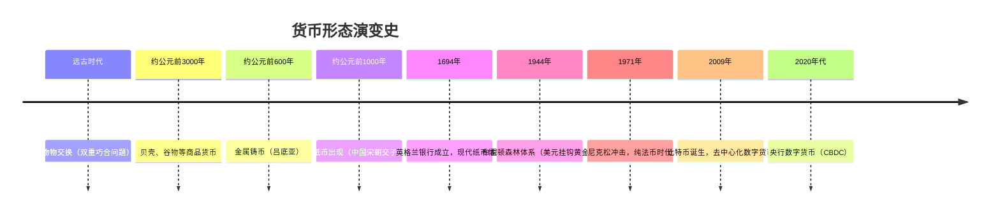
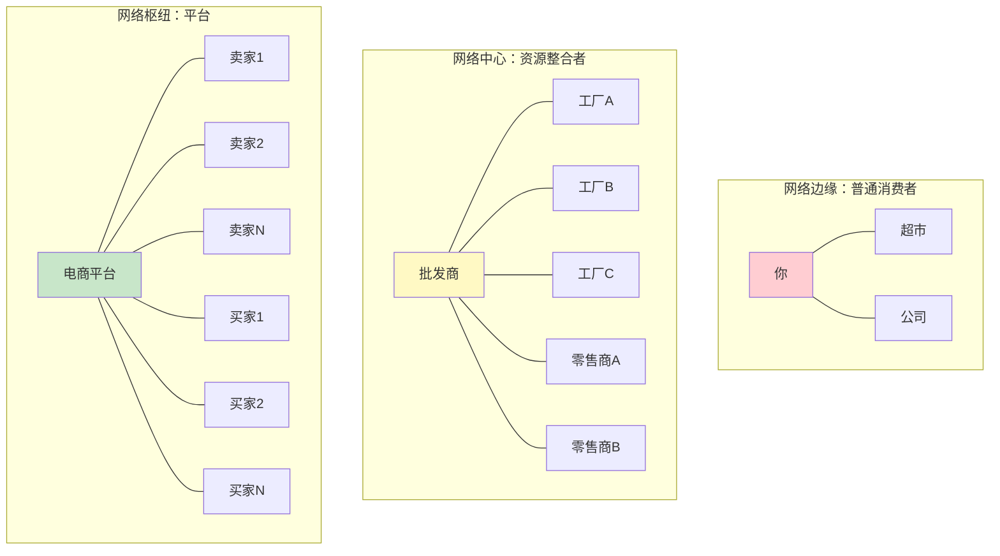
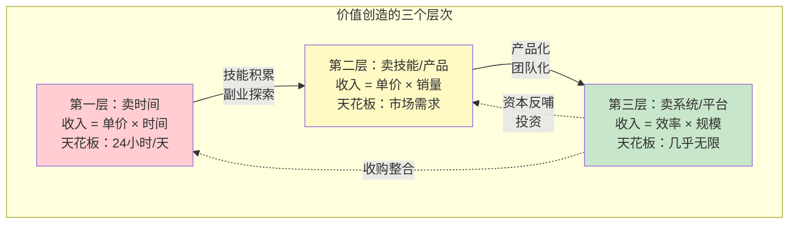
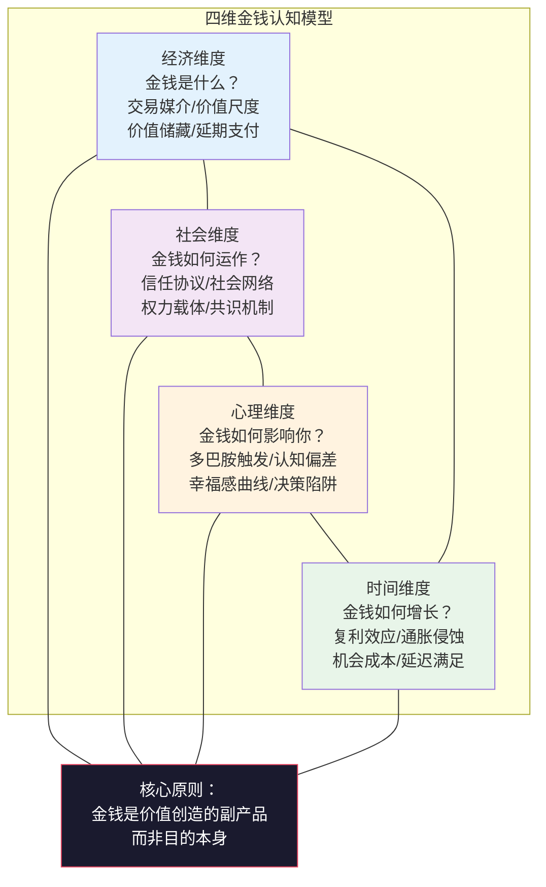

## 1.1 重新认识金钱

> **一句话总结：** 金钱不是"东西"，而是一种社会契约、一种信任协议、一种价值度量衡。你对它的理解深度，决定了你能驾驭它的能力上限。

大多数人对金钱有一种本能的、直觉式的理解——它就是钱包里的纸、银行里的数字、手机里的余额。这种理解在日常生活中够用，但在搞钱的语境下远远不够。就像一个不懂水性的人在浅水区扑腾没问题，但要横渡海峡就必须真正理解水的浮力、洋流和潮汐。

本节将从**经济学、社会学、心理学**三个维度解构金钱，建立一个完整的"金钱认知模型"，然后在此基础上完成从"赚钱思维"到"价值创造思维"的根本性跃迁。

---

### 1.1.1 金钱的本质：经济学视角——价值交换的四大功能

#### 货币的四个核心功能

很多人知道"金钱是交换媒介"，但这只是货币四大功能中最浅显的一个。完整理解货币需要掌握四个维度：

| 功能 | 含义 | 为什么重要 | 举例 |
|------|------|-----------|------|
| **交易媒介** | 充当买卖双方的中介，消除"双重巧合"需求 | 没有它，你必须找到恰好需要你商品的人才能交换 | 你用劳动换工资，再用工资买食物 |
| **价值尺度** | 为所有商品和服务提供统一的定价标准 | 让比较和决策成为可能——你能直观判断"苹果值不值这个价" | 一杯咖啡35元，一部手机5000元 |
| **价值储藏** | 将今天的购买力保存到未来 | 让跨期资源配置成为可能——今天赚钱明天花 | 把工资存入银行，半年后取出消费 |
| **延期支付标准** | 为借贷、分期、信用提供度量基础 | 让信用经济成为可能——贷款、债券、按揭都依赖此功能 | 房贷30年，每年偿还的金额用货币衡量 |

> **关键洞察：** 这四个功能是一个整体。如果一种东西只能交易但不能储存（比如容易腐烂的食物），它不是好的货币；如果只能储存但不能交易（比如某些管制资产），它也不是好的货币。理解这四个功能，你就理解了为什么贝壳、黄金、纸币、比特币都能充当货币——也理解了为什么某些"货币"注定失败。

#### 从物物交换到数字货币：货币演变的完整时间线

理解货币的历史，不是为了"增长见识"，而是为了看懂趋势——每一次货币形态的变革都创造了新的财富机会。



每个阶段的关键特征：

| 时期 | 货币形态 | 核心优势 | 核心缺陷 | 财富机会 |
|------|---------|---------|---------|---------|
| 物物交换 | 实物换实物 | 无需信任第三方 | 双重巧合、无法储存 | 掌握稀缺资源的人拥有话语权 |
| 商品货币 | 贝壳、盐、烟草 | 天然稀缺、便于储存 | 价值不稳定、携带不便 | 掌握商品货币来源的群体 |
| 金属货币 | 金、银、铜 | 耐久、可分割、稀缺 | 重、运输成本高 | 贸易商、矿业 |
| 纸币 | 银行券、法定货币 | 轻便、可大量发行 | 依赖政府信用、可能通胀 | 银行家、金融中介 |
| 信用货币 | 银行存款、信用卡 | 便捷、可透支 | 风险集中于金融机构 | 金融科技创业者 |
| 数字货币 | 加密货币、CBDC | 去中心化/可编程 | 监管不确定、波动性大 | 早期参与者、技术开发者 |

> **现实意义：** 每一次货币形态的跃迁，都伴随着财富的大规模重新分配。宋朝的商人利用交子实现了跨区域贸易的飞跃，20世纪的银行家利用信用货币创造了现代金融体系，而早期理解比特币的人获得了数千倍的回报。你不需要预测下一个货币形态是什么，但你需要理解：**理解货币本质的人，总能比不理解的人更早发现机会。**

#### 金钱的"反面"：货币也有成本

很多人只看到金钱"能做什么"，很少思考金钱"做了什么"。货币系统并非免费午餐，它有三个被普遍忽视的成本：

**1. 通胀税**
法币体系下，央行可以"印钱"。增发的货币稀释了你手中货币的购买力——这是一种隐性税收。假设年通胀率3%，你持有100万元现金不动，10年后购买力实际缩水约26%（只相当于今天的74万元）。你没有做错任何事，财富却被悄悄转移走了。

**2. 金融中介费**
货币从创造到流通，每一步都有人"抽水"——银行存贷利差、支付手续费、汇款手续费、基金管理费。全球金融中介每年从实体经济中抽取的费用以万亿美元计。理解这一点，你就理解了为什么"去中介化"是如此强大的商业模式。

**3. 注意力成本**
金钱是一种需要管理的资源。你花在想钱、赚钱、管钱、花钱上的时间和注意力，本可以用于创造、学习、陪伴家人。这是金钱的机会成本——它不仅仅是"存银行损失利息"，更是"管钱的时间本可以做更有价值的事"。

---

### 1.1.2 金钱的本质：社会学视角——信任协议与社会网络

#### 一张百元纸币为什么值100元？

这个问题听起来很傻，但答案并不简单。

一张100元人民币的制造成本不到1元。它之所以"值"100元，不是因为纸张有多贵、油墨有多稀有，而是因为**14亿人共同相信它值100元**。更准确地说，是14亿人相信其他人也相信它值100元。

这就是金钱的社会学本质：**它是一种集体信任协议。**

亚当·斯密在《国富论》中指出，货币是"交换的车轮"。但这个车轮的转动完全依赖于社会共识。历史上有无数案例证明，一旦信任崩塌，货币就会瞬间变成废纸：

| 案例 | 时间 | 原因 | 结果 |
|------|------|------|------|
| 魏玛共和国恶性通胀 | 1921-1923年 | 一战赔款、滥发货币 | 物价每49小时翻倍，一块面包要2000亿马克 |
| 津巴布韦恶性通胀 | 2007-2009年 | 政治动荡、滥发货币 | 发行100万亿面额纸币，最终货币作废 |
| 委内瑞拉恶性通胀 | 2016年至今 | 石油依赖、政策失误 | 年通胀率超过1000000%，货币几乎失去意义 |

> **关键教训：** 货币的价值不取决于"印了多少"，而取决于"多少人信任它"。这解释了为什么比特币虽然没有实物支撑，但当足够多的人信任它时，它就具有了价值。也解释了为什么人民币在国际上的接受度不如美元——信任是有边界的。

#### 金钱是一种社会网络

金钱不只是信任协议，它还是一个**社会网络**。每笔交易都是一次人与人的连接——你付钱给咖啡店，咖啡店付钱给供应商，供应商付钱给农场主。金钱沿着社会关系流动，形成一张巨大的网络。

这个视角揭示了一个重要规律：**你在这个网络中的位置，决定了你能获得多少金钱。**

- 位于网络边缘的人（只和少数人有经济往来），收入来源有限
- 位于网络中心的人（连接多方资源），拥有更多赚钱机会
- 位于网络"枢纽"的人（比如淘宝、美团这种平台），可以对每笔交易收取"过路费"



> **实践启示：** 想要赚更多钱，本质上就是要在网络中找到或创造更有价值的位置。创业是创建一个新的网络节点，投资是买入现有网络节点的份额，提升技能是让自己在网络中变得不可替代。

#### 金钱与权力的关系

金钱不仅是交换工具，它还是**权力的载体**。拥有金钱意味着拥有资源配置的能力——你可以决定哪些项目得到资金，哪些产品被生产出来，哪些服务被提供。

但这种权力是双向的：金钱可以换取权力（比如政治献金、游说），权力也可以创造金钱（比如垄断特许经营权、政策优惠）。理解这个关系，你就不会天真地认为"只要产品好就能赚钱"——在很多行业，关系网络和政策资源比产品质量更重要。

这不是让你去"搞关系"，而是让你在评估商业机会时，把"这个行业的权力结构是什么"作为重要的分析维度。

---

### 1.1.3 金钱的本质：心理学视角——大脑如何处理金钱

#### 金钱激活的脑区和毒品类似

这听起来像标题党，但这是有神经科学依据的研究结论。

功能性磁共振成像（fMRI）研究发现，当人预期获得金钱时，大脑中的**伏隔核**（nucleus accumbens）会被强烈激活——这个区域正是大脑的"奖励中心"，也是毒品、赌博、美食等成瘾行为的主要作用区域。

更有趣的是，**预期赚钱的快感，往往比真正赚到钱的快感更强烈**。这解释了为什么：
- 购物时"期待拥有"的快感，往往比"真正拥有"后更强烈
- 赌博时"快赢了"的刺激感，比赢钱本身更让人上瘾
- 投资中"看着账户上涨"的兴奋感，容易让人忽略风险

斯坦福大学的Brian Knutson教授做了一个经典实验：给参与者展示即将购买的商品图片，同时用fMRI扫描大脑。结果发现，当看到想要的商品时，伏隔核的激活程度可以预测这个人最终是否会冲动消费——激活越强烈，冲动消费的概率越高。

> **自我觉察：** 当你感到"想花钱"的冲动时，停下来问自己：这是我的真实需求，还是大脑在分泌多巴胺？仅仅这个觉察，就能帮你避免大量非理性消费。

#### 六种核心的金钱心理效应

除了"快感回路"，人类大脑在处理金钱时还有六个系统性偏差，这些偏差在1.2节会深入展开，但这里先列出框架，帮你建立全局认知：

| 心理效应 | 表现 | 生活中的例子 | 对搞钱的影响 |
|---------|------|-------------|-------------|
| **损失厌恶** | 损失的痛苦是收益快乐的2-2.5倍 | 亏100元比赚100元的感受强烈得多 | 害错失机会、死守亏损投资 |
| **锚定效应** | 决策过度依赖第一个接收到的信息 | "原价999，现价199"让你觉得便宜 | 被历史股价、他人建议锚定，误判价值 |
| **心理账户** | 对不同来源的钱区别对待 | 工资不舍得花，但意外之财随意消费 | 不同的钱本质相同，不应该区别对待 |
| **当下偏差** | 高估即时收益，低估未来收益 | "今天先享受，明天再说" | 无法坚持长期储蓄和投资计划 |
| **社会比较** | 用金钱衡量社会地位 | "同事买了新车我也要买" | 消费决策不是基于需求而是基于面子 |
| **沉没成本谬误** | 已经投入的钱影响未来决策 | "已经亏了这么多了，再等等吧" | 越套越深，无法及时止损 |

> **重要提醒：** 这些偏差不是"不聪明"的表现，而是人类大脑的"出厂设置"——它们在原始社会帮助我们的祖先做出快速决策（见到食物就吃、见到危险就跑），但在现代金融环境中却会系统性地误导我们。识别它们是克服它们的第一步。

#### 金钱对幸福感的真实影响

"金钱买不到幸福"——这句话对吗？

普林斯顿大学Daniel Kahneman（诺贝尔经济学奖得主）和Angus Deaton的研究给出了精确答案：

- **年收入低于约7.5万美元（约50万人民币）时**：收入增加显著提升日常情绪幸福感
- **年收入超过这个阈值后**：收入增加不再显著提升情绪幸福感，但"人生满意度评估"仍在提升

也就是说，金钱能买到的不是"幸福"，而是"免于匮乏的焦虑"。当你的基本需求和舒适需求被满足后，更多的钱不会让你更快乐——但会让你对人生的整体评价更高。

这个发现对搞钱的启示是双重的：
1. **在达到"够用"之前，赚钱确实很重要**——不要被"钱不重要"的鸡汤误导
2. **在达到"够用"之后，追求更多钱的边际回报递减**——把精力投入到人际关系、健康、自我实现上，回报更高

---

### 1.1.4 金钱的时间价值与复利效应

#### 为什么今天的一块钱比明天的一块钱更值钱？

这个概念叫**货币时间价值**（Time Value of Money, TVM），它是整个金融学的基石之一。理解它，你就理解了为什么"早投资"如此重要，为什么"复利"是财富增长的终极武器。

三个核心原因：

**1. 通货膨胀侵蚀购买力**
中国近年CPI年均涨幅约2-3%。假设通胀率2.5%，今天的100元：
- 10年后购买力约等于今天的78元
- 20年后购买力约等于今天的61元
- 30年后购买力约等于今天的47元

也就是说，即使你什么都不做，把钱放在那里不动，30年后它也会"缩水"一半以上。这不是理论推演，而是正在发生的事实。

**2. 投资机会成本**
今天的一块钱可以投资产生收益。你延迟一天投资，就损失了一天的收益。这个"机会成本"在长期积累下会变成一个惊人的数字。

**3. 不确定性风险**
未来的钱存在拿不到的风险——政策变化、经济衰退、个人变故。"到手的钱"永远比"承诺的钱"更可靠。

#### 复利效应：财富增长的终极武器

爱因斯坦是否真的说过"复利是世界第八大奇迹"存在争议，但复利的威力是数学上无可争辩的事实。

复利的核心公式：

```text
FV = PV × (1 + r)^n
```

其中：
- FV = 终值（Future Value）
- PV = 现值（Present Value）
- r = 年化收益率
- n = 年数

这个公式的魔力在于那个指数运算 `(1+r)^n`——它让增长不再是线性的，而是指数级的。

**直观对比：单利 vs 复利**

假设你投资10万元，年化收益率10%：

| 年数 | 单利终值 | 复利终值 | 复利优势 |
|------|---------|---------|---------|
| 10年 | 20万 | 25.9万 | +29.5% |
| 20年 | 30万 | 67.3万 | +124% |
| 30年 | 40万 | 174.5万 | +336% |
| 40年 | 50万 | 452.6万 | +805% |

前10年复利只比单利多赚5.9万，看起来优势不大。但第30-40年这10年，复利多赚了278.1万！这就是**指数增长的恐怖之处——前半程看不出差别，后半程天壤之别。**

#### 72法则：心算复利的实用工具

不想用计算器？72法则帮你快速估算：

```text
资金翻倍所需年数 ≈ 72 ÷ 年化收益率(%)
```

| 年化收益率 | 翻倍所需年数 | 30年后变为原来的倍数 |
|-----------|------------|-------------------|
| 4% | 18年 | 3.2倍 |
| 6% | 12年 | 5.7倍 |
| 8% | 9年 | 10.1倍 |
| 10% | 7.2年 | 17.4倍 |
| 12% | 6年 | 30.0倍 |
| 15% | 4.8年 | 66.2倍 |

> **实战意义：** 72法则让你在几秒钟内判断一个投资机会的潜力。有人说"年化收益20%"，你立刻知道大约3.6年翻倍——然后问自己："这个收益水平可持续吗？风险有多大？"这就是从"被数字忽悠"到"用数字分析"的转变。

#### 复利的"敌人"：侵蚀你财富的三股力量

复利是正向的力量，但有三股反向力量在不断侵蚀它：

**1. 通货膨胀——静默的财富小偷**
如果你的投资年化收益6%，但通胀率3%，你的实际收益只有3%。这意味着你的"10%收益"并没有你以为的那么好。计算实际收益的公式：

```text
实际收益率 ≈ 名义收益率 - 通货膨胀率
```

**2. 交易成本——频繁交易的代价**
每次交易都有成本——股票佣金、基金申购赎回费、税费。假设每次交易成本0.5%，如果你每年交易20次，一年的交易成本就是10%——这几乎吃掉了你一整年的收益！

**3. 情绪决策——复利的最大杀手**
在市场恐慌时卖出（低点），在市场狂热时买入（高点），是普通人最大的亏钱操作。一次错误的时机选择，可能抵消数年的复利积累。

---

### 1.1.5 从"赚钱"到"创造价值"的思维跃迁

#### 两种思维模式的根本区别

传统思维和价值创造思维不是"程度"的差异，而是"方向"的根本不同。就像两个人开车去同一个目的地，一个只盯着仪表盘（关注收入数字），一个看着导航和路况（关注价值创造路径）。

| 维度 | "赚钱"思维 | "创造价值"思维 |
|------|-----------|--------------|
| 核心问题 | "我怎样才能赚更多钱？" | "我能为谁解决什么问题？" |
| 关注焦点 | 收入数字 | 客户需求和价值交付 |
| 时间视野 | 短期——这个月工资多少 | 长期——这个系统5年后值多少 |
| 驱动力 | 恐惧和欲望 | 兴趣和使命感 |
| 增长模式 | 线性——多干多得 | 指数——系统化和规模化 |
| 风险来源 | 失去工作 | 价值创造失败 |
| 典型行为 | 跳槽涨薪、加班赚加班费 | 创业、做产品、建平台 |

> **转变不是口号，是策略：** "创造价值"听起来像心灵鸡汤，但它实际上是一个极其务实的策略。当你把注意力从"收入"转移到"价值创造"时，你会发现：
> - 收入是价值创造的"副产品"——你创造的价值越大，收入自然越高
> - 客户会主动帮你传播——口碑是最廉价的获客方式
> - 你的护城河越来越深——不可替代的价值创造者永远不缺收入

#### 价值创造的三个层次：从卖时间到卖系统

理解了"创造价值"的思维后，下一个问题是：怎样创造价值？答案是**三个递进的层次**：

**第一层：卖时间——线性收入模型**

```text
收入 = 单价 × 时间
```

这是绝大多数人的起点：打工、兼职、计件工作。你的收入和投入的时间成正比。

特征：
- 天花板明确：一天只有24小时，一个月最多工作约250小时
- 可替代性高：你的岗位别人也能做
- 停止工作=停止收入：生病、休假、失业都会中断收入流
- 安全感来自"稳定"：每个月固定发工资

适合的阶段：积累期。你需要先通过卖时间获取基本生存保障和技能积累，但不能永远停留在这个层次。

**第二层：卖技能/产品——可复制的收入模型**

```text
收入 = 单价 × 销量（不受时间限制）
```

从"卖时间"跃迁到"卖技能/产品"的关键突破是：**让创造和交付脱耦。** 你花一次时间创造，可以反复销售。

具体形态：
- **自由职业**：一个设计师同时为5个客户提供设计服务，单价远高于打工
- **数字产品**：一门在线课程，投入100小时制作，可以卖给10000人
- **内容创作**：一本电子书、一个付费专栏，一次写作持续收入
- **软件/SaaS**：一款工具软件，用户付费订阅，边际成本接近零

特征：
- 可以突破时间限制：一份产品可以卖给无数人
- 收入有爆发潜力：但也有不确定性——产品可能卖不出去
- 需要前期投入：产品开发阶段可能没有收入
- 核心竞争力是"专业深度"：你必须在某个领域足够优秀

**第三层：卖系统/平台——指数收入模型**

```text
收入 = 系统效率 × 规模
```

最高层次的价值创造是**构建一个自动运转的系统或平台**，让别人在你的系统上创造价值，你收取"基础设施费"。

具体形态：
- **创业**：建立一家公司，雇佣员工，员工为你创造价值
- **投资**：用资本获取其他公司/系统的股份，分享其创造的价值
- **平台**：建立一个连接供需双方的平台，对每笔交易抽成
- **品牌/知识产权**：建立一个有影响力的品牌，品牌本身产生溢价

特征：
- 可以实现指数级增长
- 系统运转不依赖你的个人时间
- 风险最高——系统可能失败
- 核心能力是"整合资源"和"管理复杂系统"



#### 案例：一个设计师的四阶段进化

小王是一名平面设计师，我们用他的人生轨迹说明这三个层次如何在真实世界中运作：

**阶段一：卖时间（月薪8000元）**
小王在一家广告公司做平面设计师，月薪8000元。每天工作8小时，每月工作22天。他的时间单价约为 8000 ÷ (8 × 22) ≈ 45元/小时。他设计能力出色，但无论多努力，收入增长主要靠每年5-10%的加薪——线性增长，天花板明显。

**阶段二：卖技能（月入1.5-3万元）**
小王在工作之余开始在设计平台上接私单。由于他有3年专业经验，每单收费500-2000元，平均每月接10-15单，月收入1.5-3万元。关键突破：他的收入不再完全受限于公司给他的定价——市场愿意为他的技能支付更高的价格。

**阶段三：卖产品（单次爆发收入99万元）**
小王把自己的设计经验整理成一套在线课程《从零到专业：平面设计实战课》，定价99元。他在社交媒体上分享设计技巧积累了5万粉丝，课程上线后卖了1万多份，收入99万元。关键突破：他花60小时制作的课程，不需要再花时间就能持续销售——收入和时间脱耦了。

**阶段四：卖系统（月收入稳定10万元+）**
小王开发了一个设计素材订阅平台——设计师上传素材赚取分成，使用者付费订阅。平台月活跃用户3万，订阅价格29元/月，小王抽取30%作为平台费。月收入 = 30000 × 29 × 30% ÷ (大部分用户不是每月付费，但简化计算) ≈ 稳定10万元以上。关键突破：他建立了一个自动运转的系统——用户自助使用，设计师自助上传，他只需要维护和优化系统。

> **重要提醒：** 这个案例展示了"三层"的跃迁路径，但不要误以为必须按顺序来。有些人直接从第一层跳到第三层（比如技术创业），有些人一辈子停留在第二层也活得很好。关键是理解每个层次的收入逻辑，选择最适合自己的路径。

#### 价值创造的底层逻辑：解决问题

无论你处于哪个层次，价值创造的底层逻辑始终不变：**发现一个真实存在的问题，提供一个有效的解决方案。**

- 外卖骑手解决了"不想出门吃饭"的问题
- 设计师解决了"品牌需要视觉呈现"的问题
- 程序员解决了"业务流程需要自动化"的问题
- 投资人解决了"好项目需要资金"的问题

这个逻辑可以反向推导——如果你想赚钱但不知道从哪开始，问自己三个问题：

1. **我擅长什么？**（技能盘点）
2. **谁需要这些技能？**（市场需求）
3. **他们愿意为这个解决方案付多少钱？**（价值定价）

这三个问题的交集，就是你的价值创造方向。

---

### 1.1.6 四维金钱认知模型：整合框架

现在我们将前面三个维度（经济学、社会学、心理学）整合为一个统一的认知模型。这个模型不是"知识装饰"，而是一个你可以在每次面对金钱决策时快速调用的思维框架。



**如何使用这个模型？**

每次面临重大金钱决策时，用四维框架做一次快速检查：

| 检查维度 | 问自己的问题 | 如果答案是"否"，说明什么 |
|---------|------------|---------------------|
| 经济维度 | 这笔钱/这个机会的实际价值是什么？ | 你可能在为"幻觉"付费，而不是真实价值 |
| 社会维度 | 这个价值在社会网络中的位置是什么？ | 你可能创造了价值但找不到愿意付费的人 |
| 心理维度 | 我是在理性决策还是被情绪驱动？ | 你的大脑可能在"自欺"——用多巴胺替你做了决定 |
| 时间维度 | 这个决策在10年后的复利效应是什么？ | 你可能在用短期满足交换长期财富 |

---

### 1.1.7 常见认知误区与纠正

在建立了正确框架之后，让我们识别几个关于金钱最常见的错误认知：

**误区一："钱是万恶之源"**

原文是"对金钱的贪爱是万恶之源"（《提摩太前书》6:10），而不是"金钱"本身。金钱是中性的工具——菜刀可以做饭也可以伤人，但你不会说"菜刀是万恶之源"。把对金钱的追求一棍子打死，只会让你在财务上自我设限。

**纠正：** 金钱是中性工具。追求金钱不是贪婪，是务实。真正的问题不是"要不要赚钱"，而是"用什么方式赚钱"和"赚钱之后做什么"。

**误区二："省钱就是赚钱"**

这句话从数学上不完全错——省下100元确实等于多赚了100元（税后）。但过度省钱有两个致命陷阱：
- 时间和注意力的机会成本：你花2小时比价省了20元，但这2小时本可以用来学习或创造价值
- 压缩了投资自己的空间：舍不得花钱学习、社交、体验，会限制你的成长天花板

**纠正：** 聪明地省钱（减少不必要支出），大胆地花钱（投资自己和有复利效应的事物）。关键区分标准：这笔钱花出去，1年后我能收获什么？

**误区三："等我有钱了再投资"**

这是最普遍的"拖延症"。你不需要有钱才开始投资——你需要开始投资才能有钱。每月500元的基金定投，假设年化8%：
- 10年后：约9.1万元
- 20年后：约29.5万元
- 30年后：约74.5万元

起始金额不重要，重要的是**时间和纪律**。

**纠正：** 从今天开始，哪怕只有100元。重要的不是金额，而是建立"让钱为你工作"的习惯。

**误区四："高风险=高收益"**

正确的表述应该是"高**预期**收益通常伴随高风险"。但反过来不成立——承担高风险不一定能获得高收益。一个垃圾币可能涨100倍，也可能归零，但这不代表投资垃圾币是"理性追求高收益"的行为。

**纠正：** 不是承担风险就能赚钱，而是在**理解风险**的前提下，选择**风险调整后收益最高**的机会。风险不是要逃避的东西，但也不是要盲目拥抱的东西。

**误区五："财务自由就是不用工作"**

财务自由的真正定义是"被动收入 ≥ 生活开支"——它给你的不是"不工作"的权利，而是"选择做什么工作"的自由。很多实现财务自由的人反而更努力地工作，因为他们终于可以做自己真正热爱的事。

**纠正：** 财务自由是手段，不是目的。目的是获得**选择的自由**。

---

### 1.1.8 自我诊断：你当前的金钱认知处于哪个层次？

在继续学习之前，花5分钟做一个快速自测。这不是"考试"，而是一个帮你看清起点的镜子。

**请对以下10个陈述，选择"是"或"否"：**

1. 我能清楚说出自己月收入的精确数字（税后到手）
2. 我知道自己每个月的钱花在了哪些大类上（住房/餐饮/交通/娱乐等）
3. 我理解通货膨胀如何影响我的存款
4. 我有至少一个"不依赖出卖时间"的收入来源
5. 我能在30秒内说出"复利"是什么意思
6. 我在做重大消费决策时，会先等24小时再决定
7. 我知道"沉没成本"的概念，并且在实际生活中运用过
8. 我有明确的中长期财务目标（3年以上）
9. 我能区分"资产"（能把钱放进你口袋的东西）和"负债"（把钱从你口袋拿走的东西）
10. 我正在用钱"为我工作"，而不是仅仅"为我消费"

**评分标准：**

| 回答"是"的数量 | 你的金钱认知层次 | 建议 |
|---------------|----------------|------|
| 0-3 | 财务无意识 | 本章每一节都需要认真学习，这是你的"地基工程" |
| 4-6 | 财务觉察者 | 你有基础认知，但还没有系统化——本章帮你建立框架 |
| 7-8 | 财务行动者 | 你已经在行动了，需要的是优化策略和深化理解 |
| 9-10 | 财务掌控者 | 你已经有了很好的基础，可以快速浏览后进入后续章节的高阶内容 |

> **重要提示：** 无论你的得分如何，都不必焦虑或自满。金钱认知不是"天赋"，而是**可以学习和训练的技能**。你现在看到的每一个"财务高手"，都是从某个层次开始，逐步升级的。关键是开始。

---

### 1.1.9 本节核心要点回顾

| 维度 | 核心结论 | 你需要记住的一句话 |
|------|---------|------------------|
| 经济本质 | 货币有四大功能：交易媒介、价值尺度、价值储藏、延期支付标准 | 金钱是工具，不是目的 |
| 社会本质 | 金钱是集体信任协议，其价值取决于多少人相信它 | 信任崩塌 = 货币崩塌 |
| 心理本质 | 金钱激活大脑奖励回路，会产生系统性认知偏差 | 你的大脑可能在"自欺" |
| 时间价值 | 今天的一块钱比明天的一块钱更值钱——因为复利 | 越早开始，差距越大 |
| 思维跃迁 | 从"赚钱"到"创造价值"——收入是价值创造的副产品 | 想赚更多钱，就创造更多价值 |
| 层次进化 | 卖时间 → 卖技能/产品 → 卖系统/平台 | 突破时间限制是关键跃迁 |

> **下一步：** 在理解了金钱的本质之后，1.2节将深入你的大脑内部，揭示那些在你不知不觉中操控你财务决策的心理偏差——以及如何系统性地克服它们。
