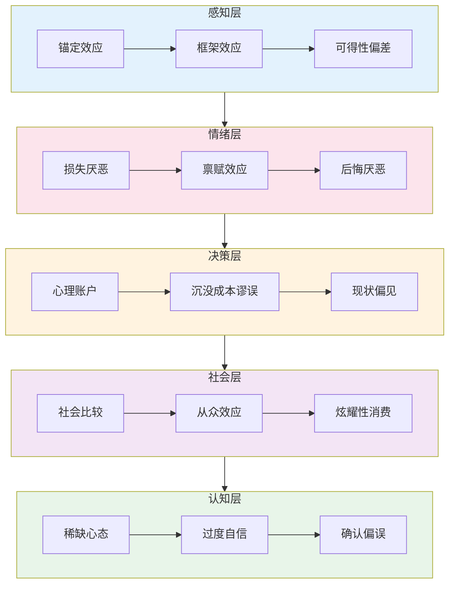

## 1.2 财富心理学

财富心理学是行为经济学与心理学的交叉学科，研究人在赚钱、花钱、存钱、投资等一切与金钱相关的行为背后的心理机制。诺贝尔经济学奖得主丹尼尔·卡尼曼（Daniel Kahneman）和理查德·塞勒（Richard Thaler）的研究表明，**人类在财务决策中并非理性人，而是受到至少20多种系统性认知偏差的影响**。理解这些偏差，是重塑财富观念的第一步。



> **数据支撑**：哈佛大学研究显示，拥有积极金钱观的人，其年收入平均比消极金钱观者高出30%以上。《Journal of Financial Planning》的一项调查显示，70%的财务失误源于心理因素而非知识不足。金钱观的转变不是一夜之间发生的，通常需要3-6个月的持续学习和实践。

### 1.2.1 稀缺心态 vs 富足心态

稀缺心态与富足心态是财富心理学中最基础、最底层的分水岭。哈佛大学教授塞德希尔·穆来纳森（Sendhil Mullainathan）和普林斯顿大学教授埃尔德·沙菲尔（Eldar Shafir）在《稀缺》一书中通过大量实验证明：**稀缺心态会俘获人的注意力，形成"管窥效应"（tunneling），导致人只关注眼前紧急的事，而忽视重要但不紧急的事，降低认知带宽和决策质量**。

#### 稀缺心态的形成机制

稀缺心态并非天生，而是由长期资源匮乏环境塑造的。神经科学研究表明，长期处于稀缺状态的大脑，其前额叶皮层（负责理性决策）活动会减弱，而杏仁核（负责恐惧和应激反应）活动会增强。这意味着稀缺心态不仅是观念问题，更是一种生理性改变。

**稀缺心态的核心信念系统**：

| 信念类型 | 典型内心独白 | 行为表现 | 长期后果 |
|---------|------------|---------|---------|
| 资源有限论 | "钱就这么多，别人多了我就少了" | 零和博弈思维，不愿合作共赢 | 错失合作机会，收入天花板低 |
| 机会稀缺论 | "好机会都被别人抢走了" | 被动等待，不愿主动出击 | 机会越来越少，恶性循环 |
| 能力固化论 | "我条件不好，所以赚不到钱" | 习得性无助，不愿改变现状 | 收入停滞，自我验证 |
| 风险恐惧论 | "万一亏了怎么办" | 极度保守，只存银行 | 财富被通胀侵蚀 |

#### 富足心态的核心信念系统

| 信念类型 | 典型内心独白 | 行为表现 | 长期后果 |
|---------|------------|---------|---------|
| 资源共创论 | "蛋糕可以做大，关键是如何创造价值" | 合作共赢，主动分享 | 人脉网络扩大，机会增多 |
| 机会创造论 | "机会到处都是，关键是有眼光识别" | 主动寻找和创造机会 | 形成正向飞轮 |
| 成长型思维 | "我现在条件不好，但我可以学习改善" | 持续学习，投资自己 | 能力提升，收入增长 |
| 风险管理论 | "风险可以识别、量化和管理" | 理性评估风险，合理承担 | 获得风险溢价收益 |

#### 稀缺心态的五个维度

稀缺心态不仅体现在金钱上，还会蔓延到时间、社交、信息和注意力等维度：

- **金钱稀缺**：总觉得钱不够用，花钱时充满焦虑，即使收入增加也觉得不够
- **时间稀缺**：总觉得时间不够用，忙于救火而无法做重要规划
- **社交稀缺**：觉得人脉不够广，不敢社交或社交时带着功利心
- **信息稀缺**：担心错过重要信息，疯狂收藏但从不阅读
- **注意力稀缺**：被各种紧急事务绑架，无法专注于高价值活动

这五个维度互相强化：金钱焦虑→时间用于加班→没有时间社交和学习→信息闭塞→决策质量下降→收入下降→金钱焦虑加剧。

#### 案例：两个年轻人的五年轨迹

小李和小张都是月薪5000元的应届毕业生，起点完全相同。

**小李（稀缺心态）**：
- 第1年：每月工资一到手就开始焦虑，不敢花钱买书或课程，觉得"太贵了"；拒绝朋友聚餐因为"要省钱"；下班后刷短视频放松
- 第2年：偶尔看到网上的赚钱机会，但觉得"肯定是骗局"；同事跳槽涨薪50%，觉得"人家有关系"
- 第3年：物价上涨，月薪涨到6000元，但生活质量反而下降；信用卡欠款8000元
- 第4年：开始抱怨"社会不公平"，对理财产生恐惧心理
- 第5年：月薪7000元，存款2万，负债1.5万，焦虑感持续上升

**小张（富足心态）**：
- 第1年：每月拿出500元投资自己（买专业书籍、参加线上课程）；适度社交，加入行业社群；每周花5小时学习新技能
- 第2年：利用业余时间接了3个自由职业项目，月均副业收入2000元；通过社群认识了一位行业前辈，获得内推机会
- 第3年：跳槽到新公司，月薪1.2万，副业月入5000元；开始学习基金定投
- 第4年：副业发展为小团队，月均利润2万；投资账户累积到15万
- 第5年：主业月薪1.5万，副业团队月均利润4万，投资账户35万，形成三条收入线

**五年差距的关键拐点**：不是能力差距，而是信念系统差异导致的行为选择差异。小李把每一分钱都"保护"起来，反而让机会流失；小张把一部分钱"投入"成长，撬动了更大的回报。

#### 培养富足心态的实操方法

**方法一：感恩日志（每天5分钟）**

每天睡前写下3件今天值得感恩的事，其中至少1件与金钱或资源相关。研究表明，持续8周的感恩练习可以显著提升主观幸福感和积极情绪（Emmons & McCullough, 2003）。

具体做法：
1. 准备一个专用笔记本或使用手机备忘录
2. 每天固定时间（建议睡前）写下3件感恩的事
3. 不只是列清单，要写出"为什么感恩"和"这让我有什么感受"
4. 每周回顾一次，发现生活中的积极模式

**方法二：财富认知重构（认知行为疗法技术）**

当出现稀缺心态的念头时，用以下四步法进行重构：

| 步骤 | 操作 | 示例 |
|------|------|------|
| 识别 | 记录自动化消极想法 | "这个课程太贵了，我买不起" |
| 质疑 | 寻找支持和反对的证据 | "买了可能学会新技能涨薪，不买肯定没变化" |
| 重构 | 用更平衡的想法替代 | "这是一笔投资，如果能帮我涨薪10%，3个月就回本了" |
| 行动 | 基于新想法做出改变 | "我先看看免费试听课，评估一下再决定" |

**方法三：环境重塑**

- **信息环境**：取关贩卖焦虑的自媒体，关注积极正面的财经内容
- **社交环境**：主动接触比你优秀的人，加入积极向上的社群
- **物理环境**：整理居住和工作空间，干净整洁的环境会降低焦虑感
- **数字环境**：清理手机APP，删除消耗时间的短视频应用

### 1.2.2 损失厌恶与风险认知偏差

卡尼曼和特沃斯基（Amos Tversky）在1979年提出的前景理论（Prospect Theory）是行为经济学的基石。该理论发现：**人们对损失的痛苦感，是获得同等收益快乐感的2-2.5倍**。这个不对称的心理反应，深刻影响着我们的一切财务决策。

#### 损失厌恶的神经科学基础

脑成像研究显示，当人们面对损失时，大脑的杏仁核和脑岛（与负面情绪相关的区域）活动显著增强；而面对同等金额的收益时，伏隔核（与愉悦相关的区域）活动相对较弱。这种神经层面的不对称，是人类进化过程中形成的生存机制——在原始环境中，失去食物意味着死亡，而获得额外食物只是锦上添花。

#### 损失厌恶的七种表现形式

**1. 处置效应（Disposition Effect）**

投资者倾向于过早卖出盈利的股票（锁定收益），同时过久持有亏损的股票（避免确认亏损）。研究表明，投资者卖出盈利股票的概率比卖出亏损股票高出约50%（Odean, 1998）。

错误逻辑："只要我不卖，就没有真正亏损"
正确逻辑："账面亏损和实际亏损，损失是一样的。持有亏损股票的机会成本，可能远大于止损的损失"

**2. 现状偏见（Status Quo Bias）**

人们倾向于维持现状，即使改变明显更有利。在401(k)养老金计划研究中，当默认选项从"不参加"改为"自动参加"时，参与率从49%飙升到86%（Madrian & Shea, 2001）。

表现："我现在的工作虽然工资低但稳定"、"银行利息虽然低但至少不亏"

**3. 确定性效应（Certainty Effect）**

人们对确定性的结果有不成比例的偏好。比如在"100%获得3000元"和"80%获得4000元"之间，大多数人会选择前者，尽管后者的期望值（3200元）更高。

影响：导致人们过度偏好"保本"产品，错过合理的风险收益机会。

**4. 沉没成本谬误（Sunk Cost Fallacy）**

已经花出去的钱不应该影响未来的决策，但人们往往会因为"已经投入了"而继续投入。

- "这只基金我已经亏了20%，不能现在卖掉"（应该看未来预期，而不是过去亏损）
- "这个项目已经投了50万，不能放弃"（应该看未来还需要投入多少，预期收益是多少）
- "我已经学了3年会计，不能转行"（沉没的时间不应该决定未来的职业方向）

**5. 禀赋效应（Endowment Effect）**

人们对自己拥有的东西赋予更高的价值。经典实验：大学生被随机分为两组，一组获得咖啡杯，另一组没有。拥有杯子的人平均愿意以7.12美元出售，而没有杯子的人平均只愿意出2.87美元购买——差距超过2倍。

在财务中的表现：高估自己持有的房产价值、不愿卖出表现不佳的股票、坚持使用低效的理财产品只因为"一直在用"。

**6. 后悔厌恶（Regret Aversion）**

人们为了避免未来的后悔感，会做出非理性决策。

- 不买股票因为"万一跌了我会后悔"（但实际上涨时也会后悔没买）
- 只买大品牌基金因为"亏了也不怪我"（而不是因为大品牌基金更好）
- 跟风投资因为"大家都亏了我也亏，不丢人"

**7. 心理免疫（Psychological Immune System）**

心理学家丹尼尔·吉尔伯特（Daniel Gilbert）发现，人们对未来负面事件的情绪影响会高估——实际上，人们比自己想象的更能适应。这导致两个后果：
- 过度恐惧亏损：实际的痛苦没有想象中那么大
- 低估恢复能力：即使真的亏损，你也会比想象中更快恢复

#### 风险认知偏差的系统性误判

人们对风险的认知存在系统性偏差，并非真实风险的客观反映：

| 偏差类型 | 机制 | 示例 |
|---------|------|------|
| 可得性偏差 | 容易想到的事被高估概率 | 飞机失事新闻多→高估飞行风险（实际比驾车安全100倍） |
| 代表性偏差 | 用相似性替代概率判断 | "这只基金过去3年涨了50%，未来肯定也涨" |
| 情感启发式 | 用情绪反应评估风险 | 感觉股市"危险"→高估亏损概率 |
| 概率忽视 | 对小概率事件过度反应 | 担心基金公司倒闭→不敢买任何基金 |

#### 克服损失厌恶的实操方法

**方法一：重新定义"损失"**

将"损失"重新定义为"学费"和"信息"。每次亏损都问自己三个问题：
1. 这次亏损教会了我什么？
2. 如果重来，我会怎么做？
3. 这个教训值多少钱？

**方法二：建立决策清单**

在做任何财务决策前，对照检查：

- [ ] 我的决定是基于未来预期，还是基于过去投入？
- [ ] 如果我今天手上没有这个资产，我会买入吗？
- [ ] 我是否因为害怕后悔而选择"什么都不做"？
- [ ] 我的风险评估是基于数据，还是基于感觉？
- [ ] 如果这笔钱亏了50%，我的生活会受实质影响吗？

**方法三：预设规则，执行纪律**

提前制定清晰的投资规则并严格执行：
- 止损线：单笔投资亏损超过15%自动止损
- 止盈线：单笔投资收益超过30%分批止盈
- 再平衡：每季度检查一次资产配置，偏离目标超过5%就调整
- 冷静期：大额投资决策至少等48小时

### 1.2.3 延迟满足与即时满足的博弈

斯坦福大学心理学家沃尔特·米歇尔（Walter Mischel）在1960年代进行的"棉花糖实验"是心理学史上最著名的实验之一。实验发现：**能够延迟满足的孩子，在十几年后的SAT考试中平均高出210分，在学业、事业、财务、健康等方面都表现更好**。

但后续研究（Watts et al., 2018）指出，延迟满足能力与家庭社会经济地位高度相关——贫困环境下的孩子更倾向于选择"现在就拿走"，因为他们从小就知道"承诺可能不兑现"。这说明延迟满足不仅是一种"品格"，更是一种**对环境信任和自我效能感的体现**。

#### 即时满足的心理机制

即时满足的根源在于大脑的"双系统"：
- **系统1（快思考）**：由边缘系统驱动，追求即时快乐，不受意志力控制
- **系统2（慢思考）**：由前额叶皮层驱动，能够理性规划，但需要消耗认知资源

当人感到压力、疲惫或情绪低落时，系统1会占据主导。这就是为什么很多人在加班后会"报复性消费"——不是因为他们没有自控力，而是因为认知资源已经被消耗殆尽。

#### 即时满足的六个陷阱

**陷阱一：消费升级陷阱**

收入增长→消费水平跟着提高→永远存不下钱。心理学家称之为"享乐适应"（Hedonic Adaptation）——人们对新消费水平的快乐感很快就会消退，然后需要更高的消费来维持同样的满足感。

数据：《消费者研究杂志》的一项追踪研究发现，中彩票大奖的人在1年后幸福感与中奖前基本持平。

**陷阱二：信贷消费陷阱**

信用卡和花呗让"先享受后付款"变得极其容易。行为经济学称之为"支付脱耦"——消费的快乐是即时的，而付款的痛苦被推迟到了未来。

数据：中国人民银行数据显示，2024年信用卡逾期半年未偿信贷总额超过980亿元。

**陷阱三：信息消费陷阱**

刷短视频、刷新闻给人"在学习"的错觉，实际上是一种廉价的即时满足。大脑会把"收藏"这个动作误认为"已经学会了"。

**陷阱四：社交消费陷阱**

为了面子而消费——请客吃饭抢着买单、送超出承受能力的礼物、跟风购买名牌。

**陷阱五：沉没成本陷阱**

"这个自助餐花了398元，一定要吃回本"——结果吃撑了胃疼，医疗费比398元还贵。

**陷阱六：确定性陷阱**

宁愿要确定的低回报（银行存款2%），也不愿接受不确定的高回报（指数基金长期8-10%）。因为确定性本身就是一种即时满足。

#### 延迟满足的科学培养方法

**方法一：10-10-10法则**

在做任何消费决策时，问自己三个问题：
1. 10分钟后我会怎么看这个决定？（即时情绪）
2. 10个月后我会怎么看这个决定？（中期影响）
3. 10年后我会怎么看这个决定？（长期后果）

大部分冲动消费在10个月后就会被后悔，而大部分投资在10年后都会被庆幸。

**方法二：自动化储蓄**

利用"预先承诺"（Precommitment）策略，在发工资当天自动转入储蓄/投资账户。这样做的心理学原理是：人更容易接受"默认选项"。

具体操作：
1. 开设一个单独的储蓄账户（与日常消费账户分开）
2. 设置工资到账日自动转账，金额为收入的20-30%
3. 将储蓄账户的卡放在家里，不带出门
4. 每月只用剩余的钱消费

**方法三：替代满足**

并非所有快乐都需要花钱。建立一个"低成本快乐清单"：
- 运动（跑步、健身、瑜伽）→ 释放内啡肽
- 社交（与朋友深度交流）→ 释放催产素
- 学习（读一本好书）→ 释放多巴胺（来自成就感）
- 创作（写作、画画、编程）→ 心流体验
- 自然（散步、看日落）→ 降低皮质醇

**方法四：可视化财富增长**

建立一个"财富仪表盘"，每周更新一次，记录：
- 总资产（存款+投资+房产等）
- 月度收入和支出
- 投资收益曲线
- 距离目标的进度

当看到自己的财富在稳步增长时，这种"延迟满足的成果可视化"会替代消费带来的即时满足。

#### 案例：两个家庭的十年财务轨迹

**家庭A（即时满足）**：
- 月入2万，每月消费1.8万（消费升级：名牌包、最新iPhone、频繁外出就餐）
- 每年出国旅游2次（信用卡分期）
- 投资：偶尔听朋友推荐买股票，亏了就割肉
- 第10年状态：存款约5万，信用卡负债3万，房贷还剩150万，每月被账单追着跑

**家庭B（延迟满足+复利思维）**：
- 月入2万，每月消费1.2万，储蓄投资8000元
- 消费策略：国产旗舰手机、经典款衣服、国内深度游
- 投资策略：每月定投指数基金8000元，年均收益率8%
- 第5年：投资账户约60万
- 第10年：投资账户约150万（含复利约30万），月被动收入约1000元
- 第15年：投资账户约300万，被动收入超过月支出，实现财务自由

**两个家庭的差距**：前5年差距不大，但复利效应在第7年开始显著拉开差距。第10年后，差距以指数级扩大。

### 1.2.4 锚定效应在消费和投资中的影响

锚定效应（Anchoring Effect）最早由卡尼曼和特沃斯基在1974年通过实验证明。实验中，受试者被要求估计联合国中非洲国家的百分比，但在估计前先转动一个随机数字转盘。结果发现，转到10的人平均估计25%，转到65的人平均估计45%——一个完全随机的数字深刻影响了判断。

**核心原理**：大脑在处理信息时，需要一个"参照点"。如果缺乏独立判断的能力或意愿，就会抓住任何可用的"锚"来简化决策。

#### 消费中的七种锚定策略

商家深谙锚定效应，以下是最常见的七种策略：

| 策略 | 操作方式 | 心理机制 | 应对方法 |
|------|---------|---------|---------|
| 原价锚定 | "原价999，现价299" | 用高价锚点制造"赚到了"的感觉 | 只看实际价格，忽略"原价" |
| 套餐锚定 | "套餐比单点省50元" | 让你关注"省了多少"而非"花了多少" | 计算实际需要的单品总价 |
| 数量锚定 | "第二件半价" | 让你关注"多划算"而非"是否需要第二件" | 只买需要的数量 |
| 品牌锚定 | 用奢侈品作为参照 | 让中端产品显得"很便宜" | 建立自己的消费标准 |
| 时间锚定 | "限时特价，仅剩2小时" | 用时间压力降低理性判断 | "不买不会死" |
| 数字锚定 | 定价9.99而非10元 | 左位数效应让9.99感觉远低于10 | 忽略尾数，看整数 |
| 对比锚定 | 展示三个价位的选项 | 中间选项因对比而显得"合理" | 独立评估每个选项的实际价值 |

#### 投资中的锚定陷阱

投资中的锚定效应比消费中更危险，因为它直接导致错误的买卖决策：

**陷阱一：历史价格锚定**

"这只股票曾经涨到100元，现在才50元，肯定能涨回去。"

真相：股票的合理价值取决于公司的基本面（盈利能力、增长前景、行业地位），而不是历史价格。很多股票跌到50元是因为基本面恶化了，永远不会再回到100元。

数据：美国股市历史数据显示，约40%的个股在经历50%以上跌幅后，永远无法回到之前的高点。

**陷阱二：买入价格锚定**

"我买入价是30元，现在跌到25元，我不卖是因为不想亏钱。"

真相：你的买入价格对市场没有任何意义。如果今天你手上没有这只股票，以25元的价格你愿意买入吗？如果不愿意，那你持有它的唯一理由就是锚定效应。

**陷阱三：整数关口锚定**

"大盘3000点是底部，不会跌破。"

真相：整数关口没有任何技术或基本面意义，只是人类心理偏好整数。把投资决策建立在整数关口上，等同于用随机数做决策。

**陷阱四：收益率锚定**

"去年收益率20%，今年应该也能做到。"

真相：过去的表现不代表未来。不同的市场环境、经济周期、政策变化都会影响收益率。应该建立基于长期平均值和风险调整后的合理预期。

**陷阱五：分析师目标价锚定**

"分析师给的目标价是80元，现在才50元，肯定能涨。"

真相：分析师的目标价经常出错。《CXO Advisory》的研究显示，分析师预测的准确率只有约47%，接近随机。

#### 如何建立独立判断体系，摆脱锚定效应

**方法一：基本面分析框架**

在评估任何投资标的时，使用以下框架：

```text
投资评估清单：
1. 这家公司/资产靠什么赚钱？（商业模式）
2. 它的盈利能力是在增长还是在下降？（财务数据）
3. 它在行业中的竞争地位如何？（护城河）
4. 当前价格相对于其内在价值是高估还是低估？（估值）
5. 我投资的最大风险是什么？（风险评估）
```

**方法二：多源信息验证**

不要依赖单一信息来源：
- 看多观点：至少读3篇
- 看空观点：至少读3篇
- 历史数据：至少看3年
- 同行对比：至少比3家

**方法三：预设决策标准**

在看到任何"锚"之前，先建立自己的标准：
- "这只股票的合理PE范围是15-25倍"（提前研究行业平均PE）
- "我只投资年化收益预期在8-15%之间的标的"（基于历史均值和风险）
- "单只股票仓位不超过总资金的10%"（风险管理）

### 1.2.5 心理账户：你的大脑如何"偷偷"分配金钱

理查德·塞勒（Richard Thaler）提出的心理账户理论（Mental Accounting）是理解个人财务行为的核心概念。**人们会在心理上将钱分成不同的"账户"，并根据账户的不同而做出截然不同的消费和投资决策——即使金钱本身是完全可互换的**。

#### 心理账户的经典实验

塞勒的实验：两组人分别回答以下问题——

问题A：你花150元买了一张音乐会门票，到了现场发现票丢了，你会再花150元买一张吗？
问题B：你打算到现场买票，到了发现口袋里少了150元（但不知道丢在哪了），你还会花150元买票吗？

结果：问题A中只有46%的人愿意再买，问题B中有88%的人愿意买。

理性分析：两种情况完全等价（都是损失了150元），但因为"音乐会预算"和"钱包里的钱"在心理上属于不同账户，导致了截然不同的决策。

#### 心理账户的五种常见表现

**1. 收入来源影响消费倾向**

- "年终奖是意外之财，可以大方花"（vs 工资收入精打细算）
- "股票赚的钱是白来的，亏了也不心疼"（vs 存款一分不敢动）
- "退税的钱可以犒劳自己"（vs 正常收入不敢乱花）

真相：无论来源如何，1元钱永远是1元钱。"意外之财"不应该比"辛苦钱"更容易被挥霍。

**2. 消费分类导致非理性节约与浪费**

- "买菜多花5块钱觉得贵"，但"买手机多花500块眼都不眨"
- "花200元健身觉得奢侈"，但"花200元请客吃饭觉得正常"
- "不舍得花30元买书"，但"舍得花300元买衣服"

真相：应该根据"价值回报率"而非"心理账户分类"来决定支出。

**3. 预算僵化**

"这个月的餐饮预算花完了，即使遇到很好的聚餐机会也不去。"

真相：预算是指导而非枷锁。如果某个机会的价值超过预算上限，就应该灵活调整。

**4. 账户隔离导致低效配置**

- 信用卡欠款年化利率18%，同时银行存款利率2%
- 一边还房贷，一边存定期存款
- 一边买低收益理财，一边支付高利息消费贷

真相：应该先还高息债务，再考虑投资。资金应该统一管理，而不是分散在多个"心理账户"中。

**5. 沉没成本的"账户锁定"**

"这张健身卡花了5000元，必须去够次数才划算"——但如果你真的不喜欢去健身房，最好的策略是把时间花在你真正喜欢的运动上，而不是为了"回本"而强迫自己。

#### 如何破解心理账户

**方法一：统一财富视角**

每月做一次"财务全景图"：
1. 列出所有资产（存款、投资、房产等）
2. 列出所有负债（信用卡、贷款等）
3. 计算净资产
4. 问自己："如果今天我从零开始，我会如何分配这些钱？"

如果当前配置与"从零开始"的最优配置差距很大，说明心理账户在影响你的决策。

**方法二：价值导向消费**

在每次消费时，不是问"这个属于哪个预算分类"，而是问：
- "这笔消费给我带来的价值/快乐，值不值这个价格？"
- "如果把这钱花在别的地方，会不会带来更大的价值？"

**方法三：定期财务审计**

每月花30分钟做以下检查：
- 有没有因为"这是意外收入"而多花的钱？
- 有没有因为"这是XX预算"而拒绝的好机会？
- 有没有一边付高息债务、一边存低息存款的情况？
- 有没有因为"已经花了"而继续花的钱？

### 1.2.6 从众效应与社会比较偏差

人类是社会性动物，我们的财务决策深受社会环境影响。研究表明，**一个人的消费水平和消费习惯，与其社交圈中前20%的人高度相关**。

#### 从众效应在财务中的表现

**表现一：投资中的羊群效应**

"大家都在买，我也买"→ 追涨
"大家都在卖，我也卖"→ 杀跌

数据：2015年A股牛市期间，新开户数在6月达到峰值（也是市场最高点附近），随后市场暴跌。散户在最高点涌入，在最低点离场。

**表现二：消费中的社交压力**

"朋友都买了新款iPhone，我不买显得格格不入"
"同事都买了车，我也得买一辆"
"同学聚会大家都穿名牌，我不能太寒酸"

**表现三：生活方式的攀比升级**

"邻居换了大房子，我也得换"
"朋友孩子上了国际学校，我家孩子不能输"
"同事去了马尔代夫，我也得去一个差不多的"

#### 社会比较的心理机制

心理学家利昂·费斯廷格（Leon Festinger）在1954年提出社会比较理论：**人们通过与他人比较来评估自己的能力和观点**。在财务领域，这种比较往往是：

- **向上比较**：与比自己富有的人比较→ 财富焦虑、消费超支
- **向下比较**：与比自己穷的人比较→ 满足感、缺乏进取心
- **平行比较**：与和自己差不多的人比较→ 最具参考价值，但也最容易引发攀比

问题在于：在社交媒体时代，人们看到的都是他人精心展示的"高光时刻"，导致系统性的向上比较。

#### 打破从众和攀比的方法

**方法一：建立内在评价体系**

将自己的财务目标与内心真正的需求对齐，而不是与他人的标准对齐。问自己：
- "如果没有人知道，我还会想要这个东西吗？"
- "我追求这个目标，是因为我真的想要，还是因为别人觉得应该？"
- "如果我做到了，会真正改变我的生活质量吗？"

**方法二：谨慎选择参考群体**

你的财务参考群体应该是：
- 在你目标领域已经成功的人（向上学习，而非向上攀比）
- 和你价值观相似的人（互相鼓励，而非互相比较）
- 能给你建设性意见的人（智慧来源，而非焦虑来源）

**方法三：社交媒体断舍离**

- 取关炫富类账号
- 减少社交媒体使用时间
- 关注真正有价值的内容创作者（教知识而非晒生活）

### 1.2.7 过度自信偏差

过度自信是投资者最常见的认知偏差之一。研究显示，**约74%的基金经理认为自己的业绩高于平均水平**——这在数学上显然不可能。

#### 过度自信的三种表现

**表现一：控制幻觉**

"我可以通过看K线图预测股市走势"
"我研究了很久，这只股票一定会涨"
"我有内幕消息/特殊渠道"

真相：在有效市场中，短期股价走势几乎是随机的。大量研究证明，主动投资的长期收益率低于被动指数基金。

**表现二：过度精确**

"这只股票明年目标价80元"（±5%）
"GDP今年增长5.2%"（±0.1%）

真相：对未来的预测越精确，出错的概率越大。承认不确定性，比假装确定性更有利于做出好的决策。

**表现三：自我归因偏差**

赚钱了→ "因为我投资水平高"
亏钱了→ "因为市场不好/运气差"

真相：这种选择性的归因会让人不断高估自己的能力，从而承担越来越大的风险。

#### 克服过度自信的方法

1. **记录决策日志**：每次投资决策都记录理由、预期和实际结果，定期回顾
2. **寻求反面观点**：每次做出决策前，专门找反对意见来看
3. **设定检查点**：投资后设定定期检查点，基于客观数据而非主观感觉来评估
4. **接受基准线**：以沪深300等指数基金的收益率作为自己的基准，而非凭感觉判断

### 1.2.8 框架效应与金钱叙事

框架效应（Framing Effect）是指：**同一信息以不同方式呈现，会导致截然不同的决策**。

#### 框架效应的经典案例

场景：手术有两种描述方式——
- "手术后一个月的存活率是90%" → 84%的人选择接受手术
- "手术后一个月的死亡率是10%" → 50%的人选择接受手术

两种描述完全等价，但"死亡率"的框架触发了损失厌恶。

#### 框架效应在财务中的影响

**收入框架**：
- "月薪1万" vs "年收入12万" → 前者让人觉得少，后者让人觉得多
- "税前月薪1万" vs "税后月薪8500" → 同样的钱，感受完全不同

**消费框架**：
- "每天只要一杯咖啡的钱" vs "每月900元" → 前者让人觉得微不足道
- "首付30万" vs "月供5000元" → 同一套房，不同框架影响购买决策

**投资框架**：
- "这只基金今年涨了20%" vs "这只基金过去3年平均涨了5%"
- "亏损概率10%" vs "盈利概率90%"

#### 如何识破框架效应

在任何财务决策前，把信息用至少两种不同方式重新描述：
1. 把"每天"的金额换算成"每年"的总额
2. 把"涨X%"换成"如果投入1万，实际赚/亏多少元"
3. 把"利率X%"换成"到期实际拿到多少钱"
4. 把"首付X万"换成"总共要付多少钱，包括利息"

### 1.2.9 金钱脚本：童年如何塑造你的金钱观

布拉德·克朗茨（Brad Klontz）博士提出的"金钱脚本"（Money Scripts）理论认为，**人们关于金钱的核心信念在童年时期就已形成，并在潜意识中持续影响成年后的财务行为**。

#### 四种金钱脚本

**脚本一：金钱逃避（Money Avoidance）**

- 核心信念："钱是不好的"、"有钱人都不是好人"、"追求金钱是贪婪的表现"
- 来源：家庭中对金钱的负面态度、宗教或文化中对财富的贬低
- 表现：回避财务问题、不愿意查看账单、在金钱话题上感到羞耻
- 后果：收入低于潜力、债务问题、财务混乱

**脚本二：金钱崇拜（Money Worship）**

- 核心信念："如果我有钱了，所有问题都会解决"、"钱越多越幸福"
- 来源：童年经历贫困或匮乏、看到金钱能解决一切问题
- 表现：过度追求收入、工作狂、用消费填补情感空虚
- 后果：工作生活失衡、关系问题、永远觉得"还不够"

**脚本三：金钱地位（Money Status）**

- 核心信念："一个人的价值等于他拥有的财富"、"花钱才能获得尊重"
- 来源：家庭中用物质衡量成功、同龄人攀比文化
- 表现：炫耀性消费、超前消费、用品牌彰显身份
- 后果：入不敷出、虚假繁荣、内心空虚

**脚本四：金钱警觉（Money Vigilance）**

- 核心信念："钱要省着花"、"不要告诉别人你有多少钱"、"要为未来存够钱"
- 来源：经历过经济困难的家庭、勤俭节约的家教
- 表现：精打细算、储蓄率高、但可能过度节俭
- 适度时的积极效果：财务稳健、抗风险能力强
- 过度时的消极效果：过度焦虑、错过合理的享受和投资机会

#### 识别和改写你的金钱脚本

**识别练习**：回答以下问题，找出你的主导脚本：

1. 你家里的钱是怎么管理的？谁管钱？
2. 你的父母如何谈论金钱？经常吵架还是避而不谈？
3. 你第一次意识到"钱"的存在是什么时候？当时什么感受？
4. 你家是"有钱"还是"没钱"？你怎么知道的？
5. 如果你中了1000万彩票，你第一反应是什么？

**改写方法**：

1. **写下核心信念**：把你关于金钱的核心信念逐条写下来
2. **追溯来源**：每条信念追溯到它最早出现的场景
3. **评估合理性**：用成年人的理性评估每条信念是否合理
4. **建立新信念**：为不合理的信念建立新的、更平衡的替代信念
5. **行为实验**：用小规模的行为来验证新信念是否有效

### 1.2.10 财富心理学自测与行动计划

#### 自测：你的财务心理画像

以下测试帮助你识别自己的主要认知偏差。对每个陈述打分（1=完全不同意，5=完全同意）：

**稀缺心态量表**：
1. 我经常觉得钱不够用 ①②③④⑤
2. 我害怕花钱，即使是必要的支出 ①②③④⑤
3. 我觉得赚钱的机会都被别人占了 ①②③④⑤
4. 我不相信自己的收入能显著提高 ①②③④⑤

**损失厌恶量表**：
5. 亏1000元的痛苦远大于赚1000元的快乐 ①②③④⑤
6. 我宁愿把钱存银行也不愿投资 ①②③④⑤
7. 我不愿意卖出亏损的股票 ①②③④⑤
8. 做重大财务决策时，我最怕的是"万一亏了" ①②③④⑤

**即时满足量表**：
9. 我很难为了长远目标而放弃眼前的享受 ①②③④⑤
10. 我经常买一些不需要但当时很想要的东西 ①②③④⑤
11. 我的信用卡经常有未还清的余额 ①②③④⑤
12. 我很少为退休或长远目标做规划 ①②③④⑤

**锚定效应量表**：
13. 我做购买决策时经常参考"原价" ①②③④⑤
14. 我投资时会关注股票的历史最高价 ①②③④⑤
15. 我经常因为"打折"而买不需要的东西 ①②③④⑤
16. 我的决策容易被别人给的第一个数字影响 ①②③④⑤

**社会比较量表**：
17. 我会因为朋友买了什么而想买同样的东西 ①②③④⑤
18. 我的消费水平受社交圈影响很大 ①②③④⑤
19. 在社交媒体上看到别人的生活会让我焦虑 ①②③④⑤
20. 我经常在意别人怎么看我的经济状况 ①②③④⑤

**计分与解读**：
- 每个量表满分20分
- 4-8分：该偏差对你的影响较小
- 9-13分：该偏差对你有中等影响，需要注意
- 14-20分：该偏差严重影响你的财务决策，需要优先改善

#### 30天行动计划

| 周次 | 重点 | 每日行动 | 周末练习 |
|------|------|---------|---------|
| 第1周 | 觉察 | 记录3次金钱相关的自动化想法 | 完成金钱脚本识别练习 |
| 第2周 | 学习 | 阅读15分钟行为经济学内容 | 做完自测量表，找出最需要改善的偏差 |
| 第3周 | 实践 | 对一个消费决策做10-10-10分析 | 建立投资决策检查清单 |
| 第4周 | 巩固 | 记录3个成功抵抗偏差的时刻 | 制定下一个月的财务行动计划 |

### 1.2.11 推荐阅读与深入学习

| 书名 | 作者 | 核心内容 | 推荐理由 |
|------|------|---------|---------|
| 《思考，快与慢》 | 丹尼尔·卡尼曼 | 人类决策的双系统理论 | 财富心理学的奠基之作 |
| 《稀缺》 | 塞德希尔·穆来纳森 | 稀缺心态如何影响决策 | 理解贫穷心理机制的关键 |
| 《助推》 | 理查德·塞勒 | 通过设计选择架构改善决策 | 实操性强，适合立即应用 |
| 《金钱心理学》 | 摩根·豪泽尔 | 财富与人性的18个真相 | 近年最好的理财心理读物 |
| 《错误的行为》 | 理查德·塞勒 | 行为经济学的核心发现 | 理解非理性财务行为 |
| 《清醒思考的艺术》 | 罗尔夫·多贝里 | 52种常见思维谬误 | 系统性认知偏差指南 |
| 《你的钱还是你的生命》 | 维姬·罗宾 | 重新定义金钱与人生的关系 | 帮助建立健康的金钱关系 |

***

**本节小结**：财富心理学揭示了一个核心真相——**影响你财富水平的最大因素不是智商、不是运气、不是出身，而是你与金钱的关系**。这种关系由你的信念系统、认知偏差和情绪模式共同塑造。好消息是，这些都可以通过觉察、学习和持续练习来改变。从今天开始，做自己财务决策的观察者，而不是被潜意识驱动的机器人。
