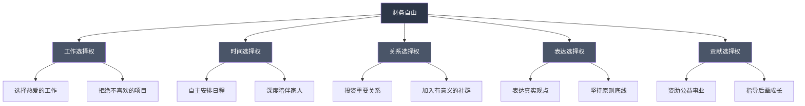
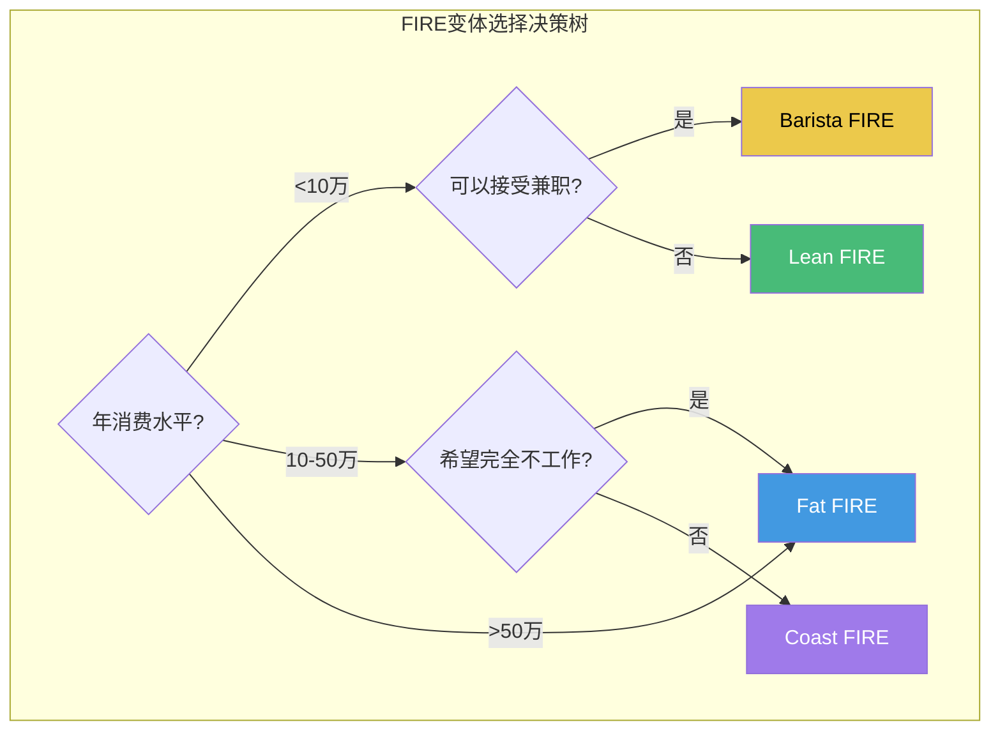
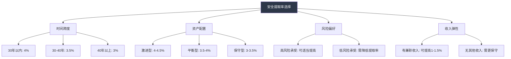
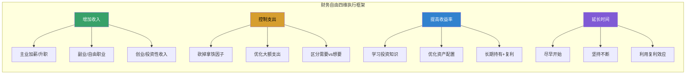
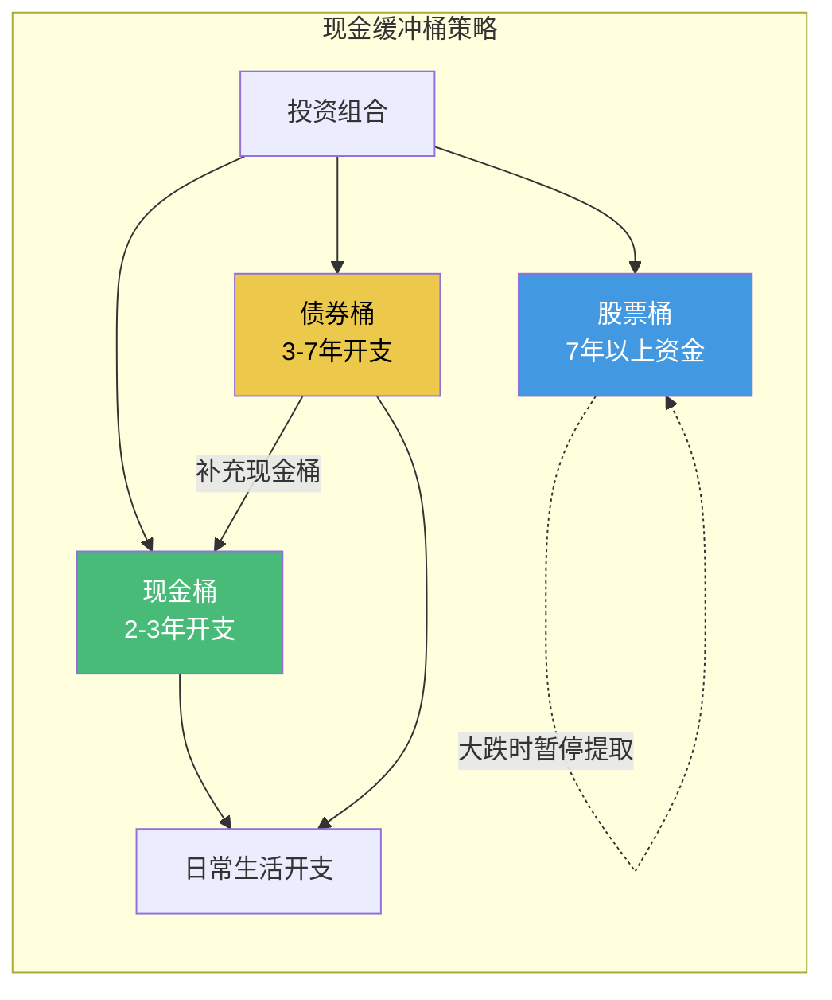
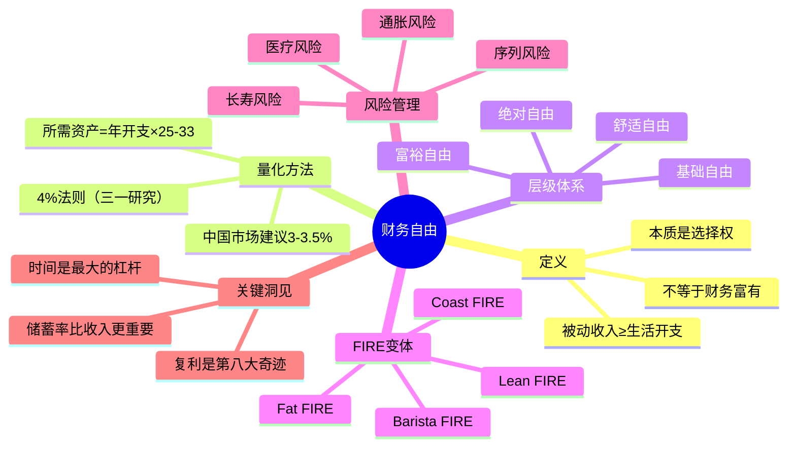

## 1.3 财务自由的定义与标准

### 1.3.1 什么是财务自由：从本质到定义

#### 1.3.1.1 学术定义与通俗理解

财务自由（Financial Independence）在个人理财领域有一个被广泛接受的精确定义：

> **当你的被动收入（Passive Income）持续、稳定地覆盖你的全部生活开支时，你就实现了财务自由。**

这里的关键词有三个：

- **被动收入**：不需要你持续投入时间和劳动就能获得的收入，包括投资收益、租金、版税、股息等
- **持续稳定**：不是偶尔一次，而是能够长期维持，穿越经济周期
- **覆盖全部**：不是只覆盖基本开销，而是覆盖你选择的生活方式所需的全部开支

这个定义的核心公式是：

```text
财务自由状态 = 被动收入 ≥ 生活开支（持续成立）
```

展开为资产语言：

```text
财务自由所需资产 = 年生活开支 ÷ 安全提取率
```

以经典的4%安全提取率计算：

```text
所需资产 = 年生活开支 × 25
```

例如：年开支12万元 × 25 = 300万元。这意味着你拥有300万可投资资产，每年提取12万（即4%），理论上这笔钱可以永远花不完。

#### 1.3.1.2 财务自由 ≠ 财务富有

很多人将财务自由与财务富有混为一谈，这是一个根本性的认知错误。两者的区别如下：

| 维度 | 财务自由 | 财务富有 |
|------|---------|---------|
| 核心标准 | 被动收入 ≥ 生活开支 | 拥有大量财富 |
| 量化指标 | 与个人开支挂钩，因人而异 | 与绝对金额挂钩，有社会共识 |
| 时间特征 | 强调可持续性 | 不一定可持续（可能高收入高消费） |
| 生活状态 | 拥有选择权 | 不一定拥有选择权（可能被财富绑架） |
| 实现门槛 | 相对可规划 | 通常需要运气/机遇 |

一个年薪百万但年消费120万的高管，比不上一个年薪20万但年消费10万、拥有300万投资资产的普通白领——后者已经财务自由，而前者仍在"老鼠赛跑"。

#### 1.3.1.3 财务自由的本质：选择权

财务自由的真正价值不在于"不用工作"，而在于**拥有选择权**。具体而言：

- **工作选择权**：你可以选择做自己喜欢的工作，而不是被迫为钱工作
- **时间选择权**：你可以决定如何分配自己的时间，而不是被他人安排
- **关系选择权**：你可以有更多时间陪伴家人、经营关系
- **表达选择权**：你可以说真话、做自己，而不必为生计违心
- **贡献选择权**：你可以帮助他人、回馈社会，追求更大的价值

正如《富爸爸穷爸爸》作者罗伯特·清崎所说："财务自由不是拥有很多钱，而是拥有选择的自由。"



### 1.3.2 4%法则：财务自由的量化基石

#### 1.3.2.1 三一研究（Trinity Study）的由来

4%法则源自1998年美国三一大学（Trinity University）三位教授——Philip Cooley、Carl Hubbard和Daniel Walz——发表的研究论文。他们分析了1926-1995年间美国股市和债市的历史数据，采用蒙特卡洛模拟方法，测试了不同资产配置和提取率下投资组合的存续能力。

**核心结论**：如果一个退休者持有50%股票+50%债券的投资组合，每年提取初始资产的4%并按通胀调整，那么在30年的退休期内，投资组合有95%以上的概率不会耗尽。

这就是"4%法则"或"安全提取率（Safe Withdrawal Rate, SWR）"的来源。

#### 1.3.2.2 4%法则的计算方式

4%法则有两种常见理解方式：

**方式一：从目标倒推所需资产**

```text
所需资产 = 年生活开支 ÷ 4% = 年生活开支 × 25
```

示例：
- 年开支10万 → 需要250万
- 年开支20万 → 需要500万
- 年开支30万 → 需要750万
- 年开支50万 → 需要1250万

**方式二：从现有资产计算可用开支**

```text
第一年可用开支 = 投资组合总额 × 4%
此后每年按通胀调整：上一年开支 ×（1 + 通胀率）
```

示例（资产300万，通胀率3%）：
- 第1年：12.0万
- 第2年：12.36万
- 第3年：12.73万
- 第10年：15.55万
- 第20年：20.89万
- 第30年：28.07万

#### 1.3.2.3 4%法则的前提条件与局限性

4%法则并非万能，它有严格的前提条件：

| 前提条件 | 说明 | 中国适用性 |
|---------|------|-----------|
| 投资组合 | 50%股票+50%债券 | 需调整为中国市场配置 |
| 提取规则 | 首年4%，此后按通胀调整 | 中国通胀率波动较大 |
| 时间跨度 | 30年 | 如果提前退休需更保守 |
| 市场环境 | 美国市场历史数据 | A股波动性远高于美股 |
| 税收 | 美国税制 | 中国税制完全不同 |

**4%法则在中国需要调整的原因**：

1. **市场波动性**：A股的年化波动率约为25-30%，远高于美股的15-18%
2. **通胀差异**：中国实际通胀率（含房价）可能高于CPI公布的2-3%
3. **汇率风险**：如果持有外币资产还需考虑汇率波动
4. **政策风险**：税收政策、养老金政策可能变化
5. **医疗支出**：中国医疗自费比例较高，老年医疗开支可能远超预期

因此，对于中国市场，更保守的建议是采用**3-3.5%的安全提取率**：

```text
所需资产 = 年生活开支 ÷ 3% = 年生活开支 × 33
所需资产 = 年生活开支 ÷ 3.5% = 年生活开支 × 29
```

### 1.3.3 财务自由的层级体系

财务自由并非"全有或全无"的二元状态，而是一个渐进的过程。我们可以将其划分为六个层级：


#### 第零级：负债状态（Debt Phase）

- 特征：总负债大于总资产，净资产为负
- 典型人群：刚毕业的大学生、过度借贷的消费者
- 目标：停止新增负债，制定还债计划
- 周期：通常需要1-3年脱离此阶段

#### 第一级：收支平衡（Breakeven Phase）

- 特征：资产为零或略正，收支基本持平
- 典型人群：工作2-5年的职场新人
- 目标：建立应急基金（3-6个月开支），开始储蓄
- 周期：通常需要1-2年

#### 第二级：基础自由（Basic Independence）

- 标准：被动收入覆盖基本生活开支（衣食住行）
- 月被动收入需求：3,000-5,000元（二三线城市）/ 8,000-12,000元（一线城市）
- 对应资产：100-200万（二三线）/ 250-400万（一线）
- 生活状态：可以不工作，但需要精打细算
- 安全边际：较薄，需要保持一定的收入来源作为缓冲

#### 第三级：舒适自由（Comfortable Independence）

- 标准：被动收入覆盖舒适的生活开支（含适度娱乐和旅行）
- 月被动收入需求：1-2万元（二三线）/ 2-4万元（一线）
- 对应资产：300-600万（二三线）/ 600-1200万（一线）
- 生活状态：体面而从容，不必为日常开销焦虑
- 安全边际：中等，可以应对大部分意外情况

#### 第四级：富裕自由（Affluent Independence）

- 标准：被动收入覆盖高品质生活开支
- 月被动收入需求：5-10万元
- 对应资产：1500-3000万
- 生活状态：享受优质生活，拥有大量可自由支配的时间和资源
- 安全边际：充足，可以应对重大意外（如大病、市场崩盘）

#### 第五级：绝对自由（Absolute Independence）

- 标准：资产规模足以应对任何生活需求和意外
- 资产门槛：5000万以上
- 生活状态：随心所欲，可以追求任何梦想
- 安全边际：极高，资产产生的收益远超任何合理消费

### 1.3.4 FIRE运动：财务自由的现代实践框架

FIRE（Financial Independence, Retire Early）运动起源于1992年Vicki Robin的畅销书《Your Money or Your Life》，在2008年金融危机后逐渐兴起，如今已成为全球性的理财理念。

#### 1.3.4.1 FIRE的四大变体

| 变体 | 全称 | 年开支倍数 | 生活方式 | 适合人群 |
|------|------|-----------|---------|---------|
| Lean FIRE | 节俭型FIRE | 25-30倍 | 极简生活，年开支<10万 | 低消费欲望者 |
| Fat FIRE | 富裕型FIRE | 30-40倍 | 舒适生活，年开支20-50万 | 追求生活品质者 |
| Barista FIRE | 兼职型FIRE | 15-20倍 | 半退休，兼职覆盖部分开支 | 想减少工作但不想完全退出 |
| Coast FIRE | 滑行型FIRE | 已投资部分足够复利到退休目标 | 当前只需覆盖日常开支 | 年轻时已有足够投资的人 |



#### 1.3.4.2 Lean FIRE详解：极简主义者的财务自由

Lean FIRE的核心理念是通过极简的生活方式大幅降低开支，从而降低财务自由的门槛。

**优势**：
- 所需资产较少，更容易实现
- 适合收入不高但储蓄率高的人
- 强制养成健康消费习惯

**风险**：
- 生活质量可能较低
- 抗风险能力弱（大病、意外等）
- 长期节俭可能导致心理疲惫
- 没有容错空间

**适用场景**：单身或丁克、有房无贷、身体健康、消费欲望低、有其他保障（如农村自建房、家庭支持等）

#### 1.3.4.3 Fat FIRE详解：追求品质的财务自由

Fat FIRE追求的是在保持较高生活品质的前提下实现财务自由。

**计算示例**（一线城市三口之家）：

```text
年生活开支明细：
├── 住房（房贷/房租）：12万/年
├── 饮食（含外食）：8万/年
├── 教育（K12课外+兴趣）：10万/年
├── 交通（车贷+油费+保险）：5万/年
├── 医疗（保险+自费）：3万/年
├── 旅行（国内+国际）：6万/年
├── 娱乐（社交+爱好）：4万/年
├── 其他（服装+家居+杂项）：5万/年
├── 应急储备（10%缓冲）：5.3万/年
└── 总计：约58.3万/年

Fat FIRE所需资产（按3.5%提取率）：
58.3万 ÷ 3.5% ≈ 1666万
```

#### 1.3.4.4 Barista FIRE详解：半退休的平衡之道

Barista FIRE是一种折中方案：积累足够的资产覆盖大部分开支，同时保留一份轻松的兼职工作来补充收入并获得医疗保险。

**计算示例**：

```text
月生活开支：1.5万（年18万）
兼职月收入：0.5万（年6万）
被动收入需覆盖：12万/年
所需资产（按4%提取率）：12万 × 25 = 300万
```

**优势**：
- 所需资产门槛大幅降低
- 保持社交和工作节奏
- 可以选择真正喜欢的兼职工作
- 心理过渡更平滑

**常见兼职选择**：
- 咖啡店/书店店员（享受慢节奏）
- 自由撰稿/翻译（发挥专业技能）
- 社区志愿服务（回馈社会）
- 在线教育/咨询（按兴趣接单）

#### 1.3.4.5 Coast FIRE详解：时间的复利魔法

Coast FIRE的核心理念是：如果在年轻时积累了足够的投资本金，即使不再追加投入，仅靠复利增长到退休时也能达到目标。

**计算示例**：

```text
当前年龄：30岁
目标退休年龄：60岁
预期年化收益率：7%
退休时目标资产：1000万

当前需要的投资本金：
1000万 ÷ (1.07)^30 ≈ 131万

也就是说，30岁时拥有131万投资资产，
即使此后一分钱不存，60岁时也能拥有1000万。
```

这意味着你可以在30岁时转为低收入、有意义的工作，只需覆盖日常开支，让复利替你完成剩下的积累。

### 1.3.5 财务自由目标的精确计算方法

#### 1.3.5.1 第一步：精确计算你的年生活开支

这是整个计算的基础，务必精确。很多人低估了自己的真实开支。

**完整的开支清单模板**：

| 类别 | 子项 | 月支出 | 年支出 | 备注 |
|------|------|-------|--------|------|
| 住房 | 房贷/房租 | | | 退休后可能无贷 |
| 住房 | 物业费 | | | |
| 住房 | 水电燃气 | | | |
| 住房 | 维修基金 | | | 常被忽略 |
| 饮食 | 日常买菜 | | | |
| 饮食 | 外出就餐 | | | |
| 饮食 | 零食饮料 | | | |
| 交通 | 车贷/油费/保养 | | | 退休后可能减少 |
| 交通 | 公共交通 | | | |
| 医疗 | 商业保险 | | | |
| 医疗 | 自费医疗 | | | 老年会增加 |
| 医疗 | 体检/保健 | | | |
| 教育 | 子女教育 | | | 阶段性支出 |
| 教育 | 自我提升 | | | |
| 娱乐 | 旅行 | | | |
| 娱乐 | 社交聚餐 | | | |
| 娱乐 | 爱好/运动 | | | |
| 其他 | 服装鞋帽 | | | |
| 其他 | 家居用品 | | | |
| 其他 | 电子产品 | | | |
| 其他 | 慈善捐赠 | | | |
| 其他 | 人情往来 | | | 中国特有，不可忽略 |
| 合计 | | | | |

**关键提醒**：

1. **使用3-6个月的实际记账数据**，而非凭感觉估算
2. **区分必要支出和可选支出**，财务自由只计算必要支出+你选择保留的可选支出
3. **考虑通胀**，今天的10万≠10年后的10万
4. **考虑生命周期**，子女教育是阶段性支出，退休后医疗支出会增加
5. **加入10-15%的缓冲**，应对意外开支

#### 1.3.5.2 第二步：确定你的安全提取率

安全提取率的选择取决于多个因素：



**保守建议**（适用于中国市场）：

- 如果计划35岁退休：采用3%安全提取率
- 如果计划45岁退休：采用3.5%安全提取率
- 如果计划55岁退休：采用4%安全提取率
- 如果有稳定的兼职/租金收入：可在上述基础上提高0.5%

#### 1.3.5.3 第三步：计算所需资产总额

```text
所需资产 = 年生活开支 ÷ 安全提取率
```

**不同场景的计算示例**：

| 生活方式 | 年开支 | 提取率 | 所需资产 | 难度评级 |
|---------|--------|--------|---------|---------|
| 小城极简 | 6万 | 4% | 150万 | ★☆☆☆☆ |
| 二三线舒适 | 15万 | 3.5% | 429万 | ★★☆☆☆ |
| 二三线品质 | 25万 | 3.5% | 714万 | ★★★☆☆ |
| 一线基本 | 20万 | 3.5% | 571万 | ★★★☆☆ |
| 一线舒适 | 40万 | 3.5% | 1143万 | ★★★★☆ |
| 一线品质 | 80万 | 3% | 2667万 | ★★★★★ |

#### 1.3.5.4 第四步：设定时间节点与储蓄计划

使用复利公式计算到达目标所需的时间：

```text
目标资产 = 当前资产 × (1 + 收益率)^年数 + 每年储蓄 × [(1 + 收益率)^年数 - 1] / 收益率
```

反推年数需要使用对数计算。更实用的做法是使用以下简化估算：

**储蓄率与实现年限的关系**（假设年化收益率7%）：

| 储蓄率 | 从零开始到财务自由所需年数 |
|--------|------------------------|
| 10% | 约46年 |
| 20% | 约37年 |
| 30% | 约31年 |
| 40% | 约26年 |
| 50% | 约21年 |
| 60% | 约17年 |
| 70% | 约13年 |
| 80% | 约10年 |

这个表格揭示了一个反直觉的事实：**储蓄率比收入绝对值更重要**。一个月薪1万存5千的人（储蓄率50%），比月薪3万存4千的人（储蓄率13%）更快达到财务自由。

#### 1.3.5.5 第五步：制定执行计划

财务自由的实现路径可以分解为四个维度：



### 1.3.6 财务自由的风险因素与应对策略

实现财务自由并不意味着一劳永逸。以下是必须考虑的风险因素：

#### 1.3.6.1 长寿风险

随着医疗技术进步，退休后的寿命可能远超预期。如果你55岁退休，可能需要维持40-50年的生活。

**应对策略**：
- 采用更保守的提取率（3%而非4%）
- 保留部分增长型资产配置
- 建立终身收入来源（如年金险）
- 保持一定的兼职收入能力

#### 1.3.6.2 通胀风险

如果年通胀率为3%，20年后物价将上涨80%。100万的购买力将缩水到约55万。

**应对策略**：
- 投资组合中必须包含抗通胀资产（如股票、房产、TIPS）
- 提取率计算时已包含通胀调整
- 定期审视和调整开支预期
- 考虑通胀对冲工具（大宗商品ETF、REITs等）

#### 1.3.6.3 市场崩盘风险（序列风险）

投资组合前期遭遇大亏损（序列风险），会对长期可持续性造成毁灭性打击。

**应对策略**：
- 建立"现金缓冲桶"：保持2-3年开支的现金/短期债券
- 在市场大跌时暂停从股票部分提取
- 采用动态提取策略（丰年多提，荒年少提）
- 保持资产配置的多元化



#### 1.3.6.4 医疗费用风险

中国医疗体系中自费比例仍然较高，重大疾病的费用可能远超预期。

**应对策略**：
- 配置充足的医疗保险（百万医疗险+重疾险）
- 在财务自由计算中单独预留医疗应急基金
- 保持健康的生活方式，预防为主
- 考虑高端医疗险覆盖长期治疗

#### 1.3.6.5 政策与法规风险

税收政策、养老金政策、房地产政策等都可能发生变化。

**应对策略**：
- 资产配置多元化，不把鸡蛋放在一个篮子里
- 关注政策动向，提前做好预案
- 适当配置海外资产以分散单一国家政策风险
- 保持灵活性，随时可以调整生活方式

### 1.3.7 实现财务自由的真实案例

#### 案例一：工程师的Lean FIRE之路

小张，32岁，杭州某互联网公司程序员，年薪45万。

```text
生活开支：月1.2万（年14.4万）
储蓄率：约68%
已有资产：180万（投资组合）
目标：Lean FIRE，年开支12万

计算：
所需资产 = 12万 × 25 = 300万
缺口 = 300万 - 180万 = 120万
按年化7%收益 + 年储蓄30万：
约3年可达成（35岁实现Lean FIRE）
```

小张的策略：
- 保持极简生活，不追求消费升级
- 主要投资指数基金（沪深300+中证500+纳斯达克100）
- FIRE后计划做自由撰稿人，补充少量收入

#### 案例二：双职工家庭的Fat FIRE规划

王先生夫妇，均35岁，上海，家庭年收入80万。

```text
生活开支：月3.5万（年42万）
储蓄率：约47%
已有资产：350万
目标：Fat FIRE，年开支50万，提取率3.5%

计算：
所需资产 = 50万 ÷ 3.5% = 1429万
缺口 = 1429万 - 350万 = 1079万
按年化7%收益 + 年储蓄38万：
约18年可达成（53岁实现Fat FIRE）
```

优化路径：
- 如果能将储蓄率提升到55%（年储蓄45万）：约15年达成（50岁）
- 如果副业收入增加10万/年：约13年达成（48岁）
- 如果投资收益率提升到9%：约12年达成（47岁）

#### 案例三：小城市Barista FIRE

小李，28岁，成都，月薪1.2万。

```text
生活开支：月0.8万（年9.6万）
储蓄率：约33%
已有资产：30万
目标：Barista FIRE，兼职月收入0.3万

计算：
被动收入需覆盖：9.6万 - 3.6万 = 6万/年
所需资产 = 6万 × 25 = 150万
缺口 = 150万 - 30万 = 120万
按年化7%收益 + 年储蓄5万：
约13年可达成（41岁实现Barista FIRE）
```

### 1.3.8 常见误区与纠正

#### 误区一：财务自由就是有很多钱

**错误**：追求绝对金额，比如"我要赚到1000万"。

**纠正**：财务自由是相对概念，与你的生活开支挂钩。年开支10万的人，250万就自由了；年开支100万的人，2500万可能还不够。

#### 误区二：收入高就能财务自由

**错误**：高收入自动等于财务自由。

**纠正**：财务自由取决于储蓄率，而非收入。很多高收入者（明星、运动员）最终破产，因为消费更高。关键公式是：财务自由速度 ≈ 储蓄率 ÷（1 - 储蓄率）。

#### 误区三：4%法则是一成不变的

**错误**：机械地按照4%提取，不考虑市场变化。

**纠正**：4%法则是一个基准，需要根据市场环境、个人情况动态调整。在市场大跌年份，应适当降低提取比例；在大涨年份，可以适当多提。

#### 误区四：财务自由后就可以完全不工作

**错误**：把财务自由等同于退休。

**纠正**：大多数实现财务自由的人仍然在"工作"，只是他们做的是自己选择的、有意义的事情。完全不工作反而可能导致空虚和退化。

#### 误区五：财务自由是终点

**错误**：把财务自由当作人生终极目标。

**纠正**：财务自由是一个里程碑，是新的起点。它的价值在于让你有能力追求更高层次的目标——自我实现、帮助他人、创造价值。

#### 误区六：只靠投资收益就够了

**错误**：只计算投资回报，忽略了其他因素。

**纠正**：财务自由是一个系统工程，需要考虑通胀、税收、医疗、保险、紧急储备等多个维度。纯粹依赖投资收益是危险的。

### 1.3.9 财务自由的实操工具

#### 工具一：财务自由进度追踪表

```python
# 财务自由计算器（Python版本）

def years_to_freedom(current_assets, annual_savings, annual_expenses, 
                     withdrawal_rate=0.04, expected_return=0.07):
    """计算距离财务自由还需要多少年"""
    target = annual_expenses / withdrawal_rate
    year = 0
    assets = current_assets
    
    while assets < target:
        assets = assets * (1 + expected_return) + annual_savings
        year += 1
        if year > 100:  # 防止无限循环
            return ">100年"
    
    return year

# 使用示例
current = 500000      # 当前资产50万
savings = 150000      # 年储蓄15万
expenses = 120000     # 年开支12万
rate = 0.04           # 4%提取率
return_rate = 0.07    # 7%年化收益

years = years_to_freedom(current, savings, expenses, rate, return_rate)
target = expenses / rate
print(f"目标资产: {target/10000:.0f}万")
print(f"预计实现年限: {years}年")
print(f"预计实现年龄: {30 + years}岁（假设现在30岁）")
```

#### 工具二：资产配置检查清单

每月/每季度检查一次：

- [ ] 被动收入是否稳定且符合预期？
- [ ] 投资组合配置是否需要再平衡？
- [ ] 生活开支是否在预算范围内？
- [ ] 保险覆盖是否充足？
- [ ] 应急基金是否保持在3-6个月开支？
- [ ] 是否有新的风险因素需要应对？
- [ ] 通胀调整后的目标是否需要更新？

#### 工具三：推荐的财务自由计算网站

1. **cFIREsim**（cfiresim.com）：基于历史数据的退休模拟器
2. **Portfolio Visualizer**（portfoliovisualizer.com）：投资组合回测工具
3. **火投Firecalc**：中文FIRE计算器
4. **雪球/且慢**：国内投资组合分析工具

### 1.3.10 本节核心要点总结



**三句话总结**：

1. **财务自由 = 被动收入 ≥ 生活开支**，它的本质不是"有很多钱"，而是"拥有选择权"
2. **4%法则是基准而非定律**，在中国市场建议采用3-3.5%的安全提取率，所需资产约为年开支的29-33倍
3. **储蓄率是第一驱动力**——提高储蓄率比提高收入更能加速财务自由的实现，因为前者同时降低了目标金额并增加了投入速度

