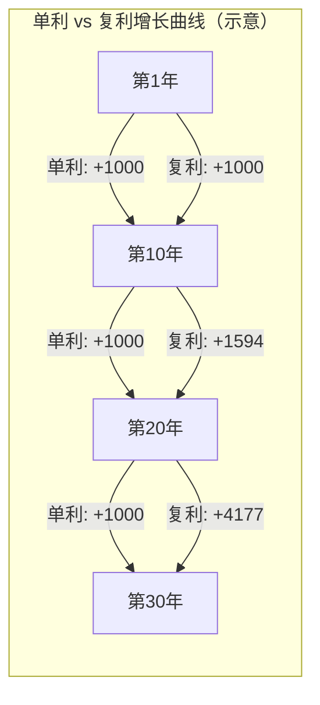
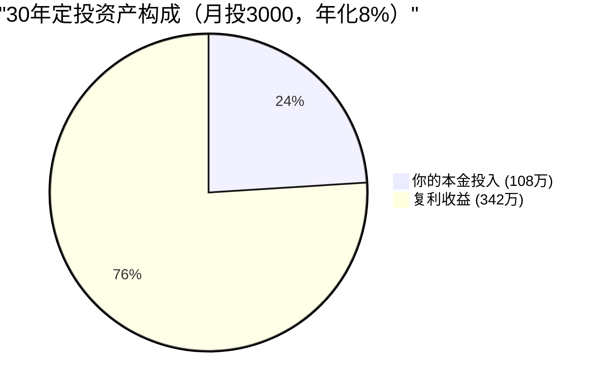
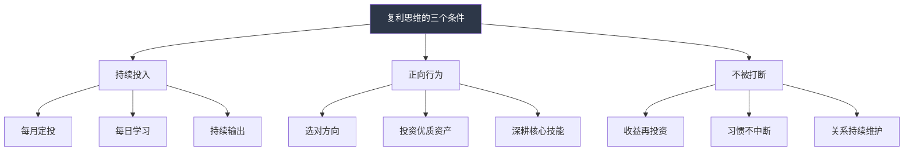
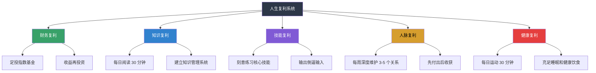

## 1.4 复利思维与长期主义

> "复利是世界第八大奇迹。理解它的人赚取它，不理解的人支付它。" —— 常被归于阿尔伯特·爱因斯坦

在理解了金钱的本质、财富心理学和财务自由的定义之后，我们需要回答一个根本性问题：**财富增长的底层动力机制是什么？** 答案就是复利——它不仅是一种数学公式，更是一种改变命运的思维方式。而长期主义，则是让复利真正发挥作用的唯一前提。

### 1.4.1 复利的数学本质

#### 1.4.1.1 复利与单利：两种完全不同的增长范式

要理解复利的力量，必须先将它与单利做严格对比。

**单利公式**：

$$A_{\text{单利}} = P \times (1 + r \times n)$$

**复利公式**：

$$A_{\text{复利}} = P \times (1 + r)^n$$

其中：
- $P$ = 本金（初始投入金额）
- $r$ = 每期利率（小数形式，如 8% 写作 0.08）
- $n$ = 计息期数
- $A$ = 最终金额

单利是**线性增长**——每年增加固定的利息金额，增长曲线是一条直线。复利是**指数增长**——每期的利息加入本金，下一期的利息基于更大的基数计算，增长曲线是一条不断变陡的曲线。

两者的差距在前期微小，在后期惊人。以下以本金 10,000 元、年化收益率 10% 为例：

| 年数 | 单利终值 | 复利终值 | 复利优势（倍数） |
|------|---------|---------|-----------------|
| 1 年 | 11,000 | 11,000 | 1.00× |
| 5 年 | 15,000 | 16,105 | 1.07× |
| 10 年 | 20,000 | 25,937 | 1.30× |
| 20 年 | 30,000 | 67,275 | 2.24× |
| 30 年 | 40,000 | 174,494 | 4.36× |
| 40 年 | 50,000 | 452,593 | 9.05× |
| 50 年 | 60,000 | 1,173,909 | 19.57× |

到第 50 年，复利终值是单利终值的将近 20 倍。这不是线性差距的放大，而是完全不同的数学量级。

**关键洞察**：复利的威力不在于任何一年的收益有多高，而在于"利滚利"这个自我强化的循环机制。每一年的收益都会变成下一年的本金，形成正反馈回路。这就是为什么爱因斯坦（据传）称其为"世界第八大奇迹"——它让时间本身成为财富增长的燃料。

#### 1.4.1.2 复利的三个核心变量

影响复利终值的只有三个变量，每一个都值得深入理解：

**变量一：收益率（r）—— 增长的效率**

收益率每提升 1 个百分点，在长期维度上的影响是惊人的。以本金 10,000 元、投资 30 年为例：

| 年化收益率 | 30 年后终值 | 比 5% 多出 |
|-----------|-----------|-----------|
| 5% | 43,219 | — |
| 6% | 57,435 | +14,216 |
| 8% | 100,627 | +57,408 |
| 10% | 174,494 | +131,275 |
| 12% | 299,599 | +256,380 |

收益率从 5% 提高到 10%（翻倍），终值从 43,219 变为 174,494——翻了 4 倍。这不是等比例增长，而是指数函数的非线性放大效应。

但必须注意：**收益率的提高往往伴随着风险的增加**。盲目追求高收益率可能导致本金损失，而本金损失对复利的打击是毁灭性的（详见后文"复利的反面"一节）。

**变量二：时间（n）—— 增长的杠杆**

时间是复利公式中指数的底数所依附的"幂次"，是三个变量中杠杆效应最大的一个。以本金 10,000 元、年化 10% 为例：

| 投资年限 | 终值 | 最后 10 年的增值 |
|---------|------|-----------------|
| 10 年 | 25,937 | — |
| 20 年 | 67,275 | — |
| 30 年 | 174,494 | — |
| 40 年 | 452,593 | — |
| 50 年 | 1,173,909 | — |

换一个角度看待这个表格：
- 第 1-10 年增值：15,937
- 第 11-20 年增值：41,338
- 第 21-30 年增值：107,219
- 第 31-40 年增值：278,099
- 第 41-50 年增值：721,316

每过 10 年，增值速度都在加速。第 41-50 年的增值额（721,316）是前 30 年增值总额（164,494）的 4.4 倍。这就是复利曲线"先平后陡"的数学本质——前期是播种期，后期是收获期。

**变量三：本金（P）—— 增长的起点**

本金与终值是线性关系：本金翻倍，终值翻倍。这个变量看似平凡，但在实际生活中影响巨大。本金越大，即使收益率较低，绝对收益也很可观。这就是为什么"攒第一桶金"如此重要——它决定了复利的起跑线。

但本金的重要性远不如时间。假设年化收益 8%：
- 25 岁投入 10 万，到 60 岁变成 147.8 万
- 35 岁投入 20 万（本金是 2 倍），到 60 岁变成 146.3 万

晚 10 年开始、本金翻倍，最终结果反而更少。**时间比本金更重要**，这是复利最反直觉的结论之一。

#### 1.4.1.3 72 法则：心算翻倍时间的利器

72 法则是一个精妙的近似公式，让你无需计算器就能快速估算资产翻倍所需的时间：

$$\text{翻倍所需年数} \approx \frac{72}{\text{年化收益率（百分比）}}$$

| 年化收益率 | 72 法则估算 | 精确值 | 误差 |
|-----------|-----------|--------|------|
| 3% | 24.0 年 | 23.4 年 | +2.4% |
| 5% | 14.4 年 | 14.2 年 | +1.3% |
| 8% | 9.0 年 | 9.0 年 | 0.0% |
| 10% | 7.2 年 | 7.3 年 | -1.0% |
| 12% | 6.0 年 | 6.1 年 | -1.9% |
| 15% | 4.8 年 | 5.0 年 | -3.1% |

72 法则在收益率 5%-15% 的区间内误差极小，非常适合日常使用。

**72 法则的实战用途**：
- 听到"年化 8% 的投资机会"，立刻算出：约 9 年翻倍，18 年翻 4 倍，27 年翻 8 倍
- 听到"信用卡年化 18%"，立刻算出：约 4 年债务翻倍——这就是为什么信用卡最低还款是财富杀手
- 评估通胀影响：通胀 3% 意味着购买力约 24 年缩水一半

还有一个变体：**114 法则**用于计算资产翻三倍的时间（$114 \div \text{收益率}$），以及 **144 法则**用于翻四倍。

#### 1.4.1.4 定期定额投资的复利公式

现实中，大多数人的投资方式不是一次性投入本金后就不管了，而是每月/每年持续追加投入。这种情况需要用**年金终值公式**：

$$A = P \times (1 + r)^n + M \times \frac{(1 + r)^n - 1}{r}$$

其中 $M$ 为每期追加投入金额。

以每月定投 3,000 元、年化 8% 为例：
- 10 年后：总投入 36 万，终值约 55 万（复利贡献 19 万）
- 20 年后：总投入 72 万，终值约 177 万（复利贡献 105 万）
- 30 年后：总投入 108 万，终值约 450 万（复利贡献 342 万）

30 年后，复利贡献（342 万）是总投入（108 万）的 3.17 倍。你的本金只出了一部分力，时间完成了剩下的一切。

### 1.4.2 复利的反面：负复利的毁灭性力量

理解复利不能只看正面，还必须理解它的反面——**负复利（即债务的利滚利）和本金的不可逆损失**。

#### 1.4.2.1 债务复利：财富的黑洞

信用卡分期的实际年化利率约 15%-18%，网络小额贷款可达 24%-36%。这些债务按复利计算，增长速度远超普通人的想象。

以欠款 100,000 元、年化 18% 为例：

| 年数 | 债务总额 | 增长幅度 |
|------|---------|---------|
| 1 年 | 118,000 | +18% |
| 3 年 | 164,303 | +64% |
| 5 年 | 230,672 | +131% |
| 10 年 | 532,945 | +433% |
| 15 年 | 1,234,613 | +1,135% |

10 年不还，10 万变 53 万。15 年不还，10 万变 123 万。债务复利每 4 年翻倍，比绝大多数合法投资的收益都快。这就是为什么**消除高息债务是所有财务规划的第一步**——它不是"建议"，而是"前提条件"。

#### 1.4.2.2 本金亏损的不对称性

复利有一个残酷的不对称性：**亏损和回本的难度完全不同**。

| 亏损幅度 | 回本所需涨幅 | 回本所需时间（年化 10%） |
|---------|------------|----------------------|
| -10% | +11.1% | 1.1 年 |
| -20% | +25.0% | 2.3 年 |
| -30% | +42.9% | 3.7 年 |
| -50% | +100.0% | 7.2 年 |
| -70% | +233.3% | 12.8 年 |
| -90% | +900.0% | 24.2 年 |

亏损 50% 需要翻倍才能回本——以年化 10% 计算，需要 7.2 年。亏损 70% 需要涨 233%，需要将近 13 年。这意味着一次重大亏损可能浪费十几年的复利时间。

**这就是为什么"保本"在复利思维中的优先级远高于"高收益"。** 年化 8% 的稳健收益持续 30 年，远胜于追求 20% 但中途遭遇一次 -50% 的投资者。

#### 1.4.2.3 通胀：复利的隐形敌人

复利让名义金额增长，但通胀侵蚀实际购买力。真正的财富增长必须看**实际收益率**：

$$\text{实际收益率} \approx \text{名义收益率} - \text{通胀率}$$

中国过去 20 年的 CPI 平均约 2%-3%，但教育、医疗、住房等关键支出的涨幅远超 CPI。如果投资年化 6%，实际通胀 4%，你的实际年化收益只有约 2%——这与银行存款差别不大。

真正能长期跑赢通胀的资产类别，从全球 200 年历史数据来看，**股票类资产（指数基金）是被验证最可靠的长期抗通胀工具**。根据杰里米·西格尔（Jeremy Siegel）在《股市长线法宝》中的研究：1802 年投入 1 美元购买美股，到 2021 年实际购买力约为 170 万美元（扣除通胀后），年化实际收益率约 6.6%。同一时期，债券的实际收益率约 3.6%，黄金约 0.7%，美元现金因通胀贬值超过 95%。

### 1.4.3 复利思维：超越金融的底层认知模型

复利不仅仅是一个数学公式或投资概念。它是一种**底层思维模型（Mental Model）**，适用于人生的几乎所有领域。理解这一点，是从"会算复利"到"拥有复利思维"的认知跃迁。

#### 1.4.3.1 什么是复利思维

复利思维的核心定义：**任何持续投入的正向行为，只要不被打断，其累积效果会随时间呈非线性加速增长。**

拆解这个定义，有三个关键条件：

1. **持续投入**：必须有稳定的、不间断的投入（时间、金钱、精力）
2. **正向行为**：投入的方向必须是正确的，错误方向的持续投入是"负复利"
3. **不被打断**：复利链条一旦中断（如中途取出收益、放弃学习、破坏信任），效果会退化甚至归零

#### 1.4.3.2 复利思维的四个核心领域

**领域一：知识的复利**

知识具有天然的复利属性。学了 A 领域的知识，再去学 B 领域时，A 的某些原理可能帮助你更快理解 B；学了 B 之后，你对 A 的理解也会更深。这种知识之间的交叉强化效应，就是知识的复利。

一个零基础的人学投资，前 3 个月可能什么都看不懂。但一旦基础知识体系搭建完成——会计学、金融学、统计学、行为心理学——后面的学习速度会呈指数级增长。每一个新概念都不再孤立，而是与已有知识网络产生连接，形成新的认知节点。

知识复利的关键操作：每日学习 30 分钟，坚持 5 年 = 910 小时，足以成为任何细分领域的专家。费曼学习法（用自己的话解释所学内容）是加速知识复利的最佳工具——它强制你把模糊的理解变成清晰的认知。

**领域二：技能的复利**

技能的复利效应体现在"前期陡峭、后期平坦"的学习曲线上。以写作为例：

- 第 1 个月：写 500 字都很吃力
- 第 6 个月：能流畅写出 2,000 字的分析文章
- 第 1 年：文章开始有人阅读和转发
- 第 2 年：接到约稿和合作邀请
- 第 3 年：写作成为稳定的收入来源之一
- 第 5 年：出书、开课、建立个人 IP

写作能力本身在提升（能力复利），读者和影响力在积累（影响力复利），写作衍生的商业机会在增加（收入复利）。三重复利同时运转。

每天进步 1% 的数学表达虽然在现实中不可能精确实现，但其核心逻辑成立：

$$1.01^{365} = 37.78$$

$$0.99^{365} = 0.03$$

微小的正向偏差经过时间放大，结果惊人；微小的负向偏差同样如此。关键不是每天进步多少，而是方向正确且不中断。

**领域三：人脉的复利**

信任是人脉复利的核心资产。第一次合作，信任度可能只有 50 分；合作愉快后第二次 70 分；第三次 85 分；第五次以后接近满分。信任一旦建立，后续合作的交易成本极低，机会自然涌现。

更深层的是**弱关系的指数扩展**。你的直接联系人（1 度关系）假设 100 人，通过他们可以接触到的 2 度关系约 5,000 人，3 度关系约 25 万人。每维护好一个 1 度关系，就打开了通往他身后整个网络的门。

口碑传播也是人脉复利的表现：你帮了 A 解决问题，A 推荐了 B，B 满意后又推荐了 C。你的影响力以指数级扩散，而你只需要做好每一次交付。

**领域四：健康与习惯的复利**

健康是所有复利的"底层操作系统"。没有健康的身体，知识、技能、人脉的复利都无从谈起。每天运动 30 分钟、充足睡眠、健康饮食，这些微小的正向习惯在 20-30 年后会产生天壤之别。

反面例子同样触目惊心：长期熬夜、不运动、饮食不规律——这是典型的"健康负复利"。30 岁时看不出区别，50 岁时差距巨大，60 岁时可能就是生与死的差距。

### 1.4.4 长期主义：复利的必要前提

如果复利是财富增长的引擎，长期主义就是让引擎持续运转的燃料。没有长期主义，复利只是一道数学题；有了长期主义，复利才成为改变命运的力量。

#### 1.4.4.1 什么是长期主义

长期主义不是简单的"有耐心"或"等得起"。它是一种**系统性的时间框架**，要求你在做每一个决策时，都以 10 年、20 年、30 年后的结果作为主要衡量标准，而不是以当下的感受或短期的回报。

长期主义的核心公式：

$$\text{决策质量} = f(\text{长期预期收益}, \text{而非短期感受})$$

这意味着：
- 短期的账面亏损不等于决策错误（可能是市场波动）
- 短期的账面盈利不等于决策正确（可能是运气）
- 真正重要的指标是 10 年、20 年后的复合收益

#### 1.4.4.2 长期主义的三个维度

**维度一：时间视角的转换**

大多数人的时间视角是"这个月"、"今年"。长期主义者的时间视角是"这个十年"、"这一生"。

| 时间视角 | 典型行为 | 结果 |
|---------|---------|------|
| 一周视角 | 追涨杀跌、频繁交易 | 交易成本吞噬收益 |
| 一年视角 | 年初制定计划，年底焦虑 | 目标常因短期波动而改变 |
| 十年视角 | 选择优质资产，坚持定投 | 复利开始显现威力 |
| 一生视角 | 构建多元复利系统 | 财务自由、知识渊博、人脉广泛 |

时间视角的转换不是一蹴而就的。它需要反复练习：每次做决策前，问自己"如果这个决定的结果要 10 年后才能看到，我还会这样选吗？"

**维度二：认知深度的积累**

长期主义者明白：认知是复利的放大器。同样的投资机会摆在两个人面前，认知水平不同的人会做出完全不同的决策。

认知深度的积累需要：
- 跨领域学习（查理·芒格的"多元思维模型"）
- 从错误中系统性地学习（写投资日志、复盘错误决策）
- 向领域内最优秀的人学习（读书、交流、观察）
- 保持认知谦逊（知道自己不知道什么，比知道自己知道什么更重要）

**维度三：行动系统的构建**

长期主义的敌人不是"不知道该怎么做"，而是"知道但做不到"或"做了但坚持不下来"。解决方案是**把意志力从系统中移除**，用自动化系统代替人为决策。

具体手段：
- 自动储蓄：发工资当天自动转出固定比例到投资账户
- 自动投资：设置基金定投，系统自动执行
- 自动学习：固定时间段、固定地点、固定内容
- 定期复盘：日历提醒，每季度检查一次进度

#### 1.4.4.3 长期主义的心理挑战与应对

坚持长期主义的最大障碍不是市场风险，而是**人类的心理偏差**。

**挑战一：即时满足偏差**

人类的大脑进化于物质匮乏的环境，天然倾向于"即时满足"而非"延迟满足"。这就是为什么消费（买新手机的快乐是即时的）总是比储蓄（30 年后的财务自由是抽象的）更有吸引力。

应对策略：
- 将长期目标具象化：不只是"财务自由"，而是"每天睡到自然醒、带父母去旅行、孩子上好学校"的具体画面
- 设立短期里程碑：把 30 年的目标拆成 30 个年度目标，每完成一个就奖励自己
- 环境设计：取消不必要的消费 App 推送，把储蓄账户设为"隐藏"

**挑战二：损失厌恶**

心理学研究表明，损失 100 元的痛苦约是获得 100 元快乐的 2-2.5 倍（丹尼尔·卡尼曼，诺贝尔经济学奖得主）。这导致投资者在市场下跌时恐慌卖出，在市场上涨时又犹豫不敢买入——完美地"高买低卖"。

应对策略：
- 理解市场波动是正常的：A 股历史上每年平均出现 2-3 次超过 10% 的回撤
- 设置"不看账户"规则：市场剧烈波动时，限制自己查看账户的频率（比如一周最多一次）
- 预先制定卖出规则：不是靠情绪判断，而是靠系统规则（如偏离目标配置 5% 以上才调整）

**挑战三：锚定效应**

人们倾向于把"过去的高点"或"买入价格"作为参考锚点，而不是关注资产的内在价值。"这只基金净值从 2 元跌到 1.5 元，我亏了 25%，不能卖"——这个决策的依据是"买入价"，而不是"这只基金未来 10 年的增长潜力"。

应对策略：
- 不关注买入成本，只关注未来预期收益
- 定期问自己："如果我现在手里没有这只基金，以当前价格我会不会买？"如果会，就应该持有；如果不会，就应该卖出

**挑战四：从众效应（羊群效应）**

"别人都在买，我也要买"、"别人都在卖，我也要卖"——这种心理在市场极端时期（牛市末期、熊市底部）尤为明显，也尤为致命。

应对策略：
- 建立独立的投资分析框架，不依赖"市场情绪"做决策
- 记录自己的投资逻辑：买入时写下理由，卖出时也写下理由。事后复盘时，你会发现大部分"跟着别人做的"决策质量都很差
- 历史是最好的老师：研究 2007 年牛市顶峰和 2008 年熊市底部的市场情绪，你会发现当时的人们和现在的你有着完全相同的感受

### 1.4.5 长期主义的实践者：真实案例分析

#### 1.4.5.1 沃伦·巴菲特：复利的终极代言人

巴菲特的财富增长轨迹是复利最直观的教科书案例：

| 年龄 | 净资产（约） | 前 10 年增值 |
|------|-----------|-------------|
| 30 岁 | 100 万美元 | — |
| 40 岋 | 2,500 万美元 | +2,400 万 |
| 50 岁 | 3 亿美元 | +2.75 亿 |
| 60 岁 | 38 亿美元 | +35 亿 |
| 70 岁 | 360 亿美元 | +322 亿 |
| 80 岁 | 535 亿美元 | +175 亿 |
| 90 岁 | 1,000 亿美元 | +465 亿 |

几个关键事实：
- 巴菲特 99% 的财富是在 50 岁之后赚到的
- 他从 11 岁开始投资，坚持了 70 多年
- 他的年化收益率约 20%——并非惊人，但持续时间极长
- 如果他从 30 岁才开始投资（而不是 11 岁），他的最终财富可能只有现在的零头

巴菲特的案例揭示了一个深刻的真理：**复利的成功要素不是"收益率有多高"，而是"持续了多久"。** 20% 的年化收益如果只持续 10 年，效果远不如 12% 持续 50 年。

#### 1.4.5.2 定投指数基金的普通人：30 年实验

假设一位普通上班族从 25 岁开始，每月定投 3,000 元到沪深 300 指数基金，年化收益按 8% 计算（这是过去 20 年 A 股宽基指数包含分红再投资的长期平均水平附近）：

| 年龄 | 累计投入 | 资产终值 | 复利贡献 |
|------|---------|---------|---------|
| 30 岁 | 18 万 | 约 22 万 | 4 万 |
| 35 岁 | 36 万 | 约 61 万 | 25 万 |
| 40 岁 | 54 万 | 约 122 万 | 68 万 |
| 45 岁 | 72 万 | 约 217 万 | 145 万 |
| 50 岁 | 90 万 | 约 360 万 | 270 万 |
| 55 岁 | 108 万 | 约 575 万 | 467 万 |

30 年后，108 万本金变成了 575 万，其中 467 万（81%）来自复利。这个人不需要高超的投资技巧，不需要择时，不需要选股，只需要"开始得早、坚持得住"。

对比一个 35 岁才开始、每月投入 5,000 元（本金更多）的人：
- 到 55 岁：累计投入 120 万，终值约 295 万

晚 10 年开始、每月多投 2,000 元，最终资产反而只有早开始者的一半。这就是时间在复利公式中的权重。

### 1.4.6 复利思维的常见认知陷阱

#### 陷阱一：线性思维的局限

人类大脑天然擅长线性思考，不擅长指数思考。这就是为什么"每月存 3,000 元，30 年后有 450 万"这个事实会让人惊讶——线性直觉告诉你应该是 108 万（108 个月 × 3000），实际却是 450 万。

突破线性思维的方法：养成使用复利计算器的习惯。每次做长期财务决策时，不要凭直觉估算，而是用公式或工具精确计算。

#### 陷阱二：忽视前期的漫长"沉默期"

复利曲线是一条"先平后陡"的曲线。前 5-10 年几乎看不到显著效果，这让人怀疑自己的策略是否正确。很多人在这个阶段放弃，转而去追求"更快的"方法——结果往往是亏得更多。

正确的心态是：**前期是播种期，后期是收获期。** 你在前 10 年投入的每一元钱和每一分精力，都在为后 20 年的爆发做准备。

#### 陷阱三：追求高收益而忽视风险

巴菲特的长期年化收益约 20%，已经是人类投资史上的顶级水平。任何承诺"年化 30%"的投资机会，要么是骗子，要么是在承担你可能承受不起的风险。

正确的心态是：年化 8%-12% 的稳健收益，持续 30 年，已经足以实现财务自由。不需要追求高收益，需要的是不犯致命错误。

#### 陷阱四：频繁操作打断复利链条

频繁买卖不仅增加交易成本（手续费、印花税、滑点），更关键的是打断了复利链条。每一次卖出再买入，都相当于把复利计数器重置一次。

更深层的问题是：频繁操作会导致"卖飞"——你卖掉的资产继续涨，你买入的资产反而跌。行为金融学的研究反复证明，普通投资者的交易频率与收益呈负相关。

正确的方法：定投 + 持有 + 再平衡（每年 1-2 次），减少一切不必要的操作。

#### 陷阱五：只关注金钱复利，忽视人生复利

如果你只关注投资收益率，却忽视了知识、技能、人脉、健康的复利，你的整体人生复利就被严重削弱了。一个身体健康、知识渊博、人脉广泛的人，即使初始资金不多，长期来看也远胜于一个只有钱但其他维度都在贬值的人。

### 1.4.7 从复利思维到人生系统设计

#### 1.4.7.1 构建你的"人生复利仪表盘"

将复利思维从单一的投资领域扩展到整个人生，需要同时关注至少五个维度：

每月用以下清单自检：

- 本月是否有持续投入到有复利属性的事情？
- 本月是否有任何"打断复利"的行为（冲动卖出、中断学习、忽视关系）？
- 本月的知识是否有增量？能否说出一个新学到的重要概念？
- 本月的投资是否按计划执行？有没有受情绪影响的操作？
- 本月是否维护了至少 3 个重要关系？
- 本月的健康习惯是否坚持？运动、饮食、睡眠是否达标？
- 本月是否有输出（写作、分享、教学）？
- 如果持续当前状态 5 年，我会在哪里？这个答案让我满意吗？

最后一个问题最为关键。如果答案是"不满意"，就找到那个需要调整的变量——收益率、时间投入、本金积累、还是方向本身——然后做出改变。

#### 1.4.7.2 识别"非线性拐点"

复利曲线有一个关键特征：存在**拐点（Inflection Point）**。拐点之前增长缓慢，拐点之后加速增长。

在不同领域的拐点：
- **投资**：本金积累到一定程度后，投资收益开始超过工资收入（"财务临界质量"）
- **写作**：粉丝积累到临界点后，内容传播呈裂变式增长
- **技能**：练习小时数突破某个阈值后，从"会做"变为"做得极好"
- **人脉**：行业知名度达到阈值后，机会开始主动找你

识别你当前处于哪个阶段。如果在拐点之前，最重要的策略就是——**坚持**。拐点一定会来，但只奖励坚持到它出现的人。

#### 1.4.7.3 构建"睡后收入"系统

睡后收入是指不需要你持续投入时间就能产生收益的系统。它的复利属性在于：一次建设，长期收益，收益再投入建设更多系统。

常见类型：
1. **投资组合**：定投指数基金，股息自动再投资
2. **数字产品**：电子书、在线课程、付费专栏——一次创作，长期销售
3. **自动化业务**：SaaS 工具、有稳定现金流的小生意
4. **知识产权**：专利授权、版权收入

建设路径：先用主动收入（工资/自由职业）积累第一桶金和核心技能 → 用技能和资金搭建睡后收入系统 → 让系统产生的收入覆盖生活开支 → 实现财务自由。

### 1.4.8 本节核心要义

1. **复利是指数增长**，不是线性增长。人类的线性直觉会严重低估长期复利的效果。
2. **复利有三个变量**：收益率、时间、本金。其中时间的杠杆效应最大——早开始 10 年比多投 10 万更重要。
3. **复利的反面同样强大**：债务的利滚利、本金的重大亏损、通胀的持续侵蚀，都可能让复利失效。
4. **复利思维是底层认知模型**，适用于知识、技能、人脉、健康等人生所有领域，不局限于金融投资。
5. **长期主义是复利的必要前提**。没有长期主义，复利只是一道数学题。
6. **长期主义的最大敌人是心理偏差**：即时满足、损失厌恶、锚定效应、从众效应——需要用系统和规则来对抗。
7. **不犯致命错误比追求高收益更重要**。年化 8% 持续 30 年远胜于追求 20% 但中途爆仓。
8. **构建人生复利系统**：同时关注财务、知识、技能、人脉、健康五个维度，让多重复利叠加运转。

在下一节（1.5 风险与收益的辩证关系）中，我们将深入探讨如何在追求复利收益的同时管理风险——这是从"理解复利"到"安全地实践复利"的关键一步。

***
