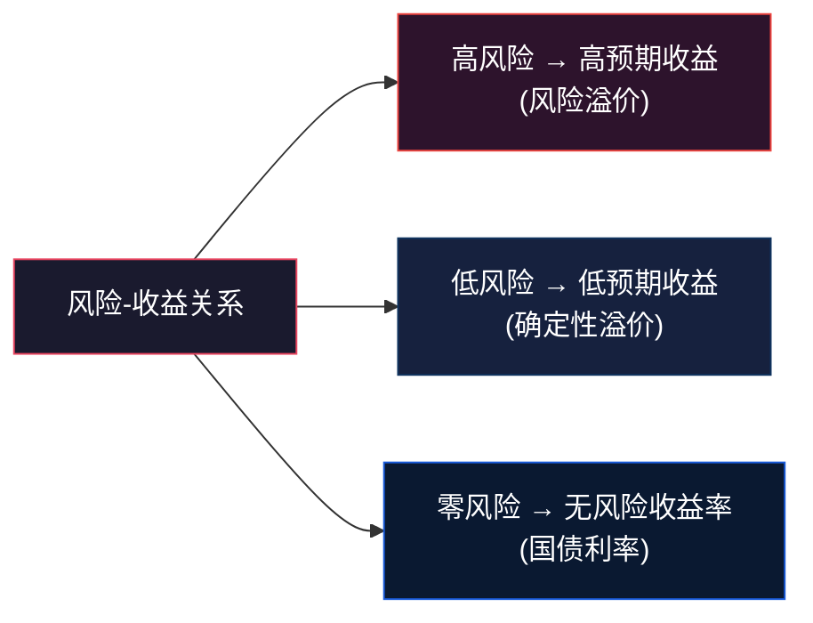
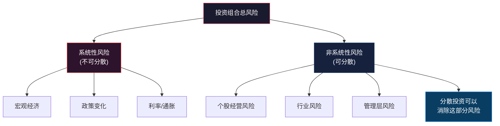
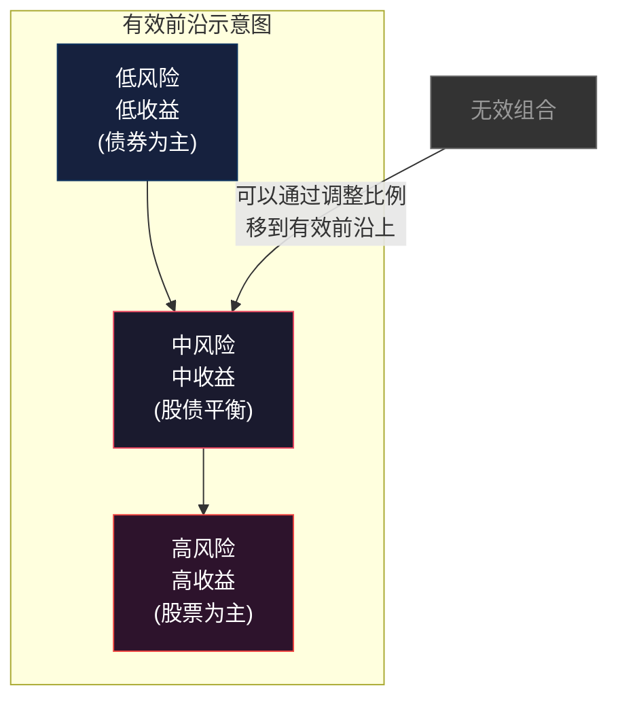
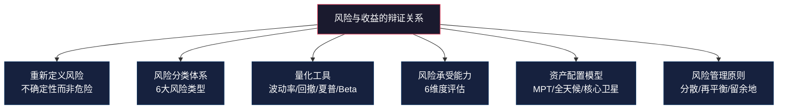

## 1.5 风险与收益的辩证关系

> "风险不是你需要逃避的东西，而是你需要理解、量化和管理的东西。"

在前四节中，你理解了金钱的本质、识别了心理偏差、定义了财务自由的目标、掌握了复利的增长逻辑。现在到了最后一块拼图：**如何在增长与安全之间找到平衡？** 如果说复利是加速器，那风险管理就是方向盘和刹车——没有它们，速度越快死得越惨。

这一节要解决的核心矛盾是：**所有人都想要高收益，但没人愿意承受高风险。** 金融学告诉我们，这两者不可分割；但金融学同时告诉我们，通过科学的方法，你可以在给定风险水平下最大化收益——或者在给定收益目标下最小化风险。这就是本节要教你的。

### 1.5.1 重新定义"风险"：它不是你想的那个东西

#### 1.5.1.1 日常语境 vs 金融语境

"风险"这个词在日常生活中意味着"危险"——过马路有风险、创业有风险、高空跳伞有风险。但在金融学中，风险的定义完全不同：

> **金融风险 = 收益的不确定性（Uncertainty of Returns）**

这个定义包含两层含义：
1. **下行风险（Downside Risk）**：你可能亏钱——这是大多数人理解的风险
2. **上行风险（Upside Risk）**：你可能少赚钱——这是大多数人忽略的风险

举个例子：你把100万元全部存银行定期，年化2%。你没有亏钱的风险，但你有巨大的"少赚钱"的风险——如果通胀是3%，你的购买力每年缩水1%。20年后，你的100万名义上变成了约149万，但实际购买力只相当于今天的约82万。你"安全地"亏了18万。

这就是为什么金融学把风险定义为"不确定性"而不是"危险"——因为**确定性地跑输通胀，也是一种风险，而且是最隐蔽的那种。**

#### 1.5.1.2 风险的两面性：一枚硬币的正反面

风险与收益的关系，本质上是**补偿机制**。市场不会无缘无故给你高收益——高收益是对高风险的补偿。反之，低风险资产之所以收益低，是因为你不需要承受太多不确定性。

这里有一个关键概念：**风险溢价（Risk Premium）**。它指的是投资者因为承担额外风险而要求的额外回报。计算公式：

> 风险溢价 = 投资预期收益率 − 无风险收益率

例如：股票长期年化收益约10%，国债收益率约3%，则股票的风险溢价约为7%。这7%就是市场对你承担股市波动风险的"补偿"。

**关键认知**：风险溢价不是"免费午餐"。你拿到这7%的代价是：可能在某些年份亏损30%-50%，而且你不知道亏损会发生在哪一年。如果你能在亏损的年份扛住不卖，你大概率能拿到这7%的补偿；如果你在低点恐慌卖出，你不仅拿不到补偿，还会把本金赔进去。这就是为什么心理素质（1.2节讨论的损失厌恶）在投资中如此关键。

#### 1.5.1.3 高风险 ≠ 高收益：最常见的误解

这句话需要反复强调：**高风险只意味着高"预期"收益，不意味着高"实际"收益。**

"预期收益"是一个统计学概念——如果你重复同样的投资无数次，平均下来你会获得的收益。但你的人生只有一次，你只投资一次。这意味着：

- 承担高风险，你**可能**获得高收益（概率较大）
- 承担高风险，你**也可能**遭受巨额亏损（概率较小但后果严重）
- 承担高风险，你**还可能**获得平庸的收益（概率也不小）

下表展示了不同投资品种的风险-收益特征。注意"历史最大回撤"这一列——它告诉你最坏情况下你会亏多少：

| 投资品种 | 长期年化收益 | 年化波动率 | 历史最大回撤 | 适合持有期限 |
|---------|------------|----------|------------|------------|
| 银行存款 | 1-2% | ~0% | 0% | 随时 |
| 国债 | 2-4% | 3-5% | -5%~-8% | 1年以上 |
| 货币基金 | 2-3% | ~0.5% | ~0% | 随时 |
| 企业债 | 4-6% | 5-8% | -10%~-20% | 2年以上 |
| 沪深300指数 | 8-12% | 20-25% | -65%（2008年） | 5年以上 |
| 中证500指数 | 10-15% | 25-30% | -72%（2008年） | 5年以上 |
| 标普500指数 | 10-12% | 15-20% | -55%（2008年） | 5年以上 |
| 黄金 | 5-8% | 15-20% | -45%（1980-1999） | 10年以上 |
| 单只A股 | 高度不确定 | 40-60% | -90%以上 | 不建议 |

注意"沪深300指数"那一行：长期年化8-12%看起来很诱人，但历史上它曾经跌过65%。如果你在2007年高点买入100万，到2008年最低点你只剩下35万。你能承受这种亏损吗？如果你能，并且继续持有，到2015年你又会回到100万以上。但大多数人做不到——这就是行为风险（后文详述）。

### 1.5.2 风险的完整分类体系

不是所有风险都一样。有些风险可以通过分散投资消除，有些不能；有些风险可以对冲，有些只能承受。理解风险的分类，是管理风险的前提。

#### 1.5.2.1 系统性风险与非系统性风险

这是金融学最基本的风险分类，来自诺贝尔经济学奖得主威廉·夏普（William Sharpe）的资本资产定价模型（CAPM）。

**系统性风险（Systematic Risk）**——也叫市场风险，是影响整个市场的风险：
- 宏观经济衰退（如2008年金融危机、2020年新冠冲击）
- 货币政策变化（如央行加息、降息）
- 地缘政治事件（如战争、贸易摩擦）
- 通胀/通缩环境变化
- 利率大幅波动

系统性风险的核心特征是：**你无法通过分散投资消除它。** 当整个市场下跌时，几乎所有股票都在跌——不管你买了多少只不同的股票。

**非系统性风险（Unsystematic Risk）**——也叫个体风险或特有风险：
- 单个公司的经营失败（如乐视网、瑞幸咖啡造假）
- 行业监管政策变化（如教培行业双减政策）
- 管理层决策失误
- 产品质量事故
- 竞争对手的颠覆性创新

非系统性风险的核心特征是：**可以通过分散投资大幅降低甚至消除。** 你持有一只股票的风险很高，但持有30只不同行业的股票，单只股票的暴雷对整体组合的影响就很小了。

**实操启示**：
- 分散投资能消除非系统性风险，但消除不了系统性风险
- 分散到一定程度后（学术研究通常认为持有20-30只不同股票），继续增加持股数量带来的风险降低效果微乎其微
- 对冲系统性风险需要更复杂的策略（如期权对冲、跨市场配置），这属于进阶内容

#### 1.5.2.2 六大具体风险类型详解

除了系统/非系统的二分法，实际投资中你需要识别和应对以下六种具体风险：

**① 市场风险（Market Risk）**

资产价格因市场整体波动而变化的风险。表现为：大盘涨你的股票涨，大盘跌你的股票也跌。这是最常见的风险类型，所有权益类投资都要面对。

应对策略：资产配置（股债搭配）、跨市场配置（A股+港股+美股）、定投平滑成本。

**② 信用风险（Credit Risk）**

借款人无法按时偿还本金和利息的风险。主要出现在债券投资中——如果发行债券的公司破产，你可能血本无归。

信用风险的等级可以用信用评级来衡量：

| 信用评级 | 违约概率 | 典型发行主体 | 收益率范围 |
|---------|---------|------------|----------|
| AAA | 极低 | 政策性银行、大型国企 | 2-4% |
| AA | 低 | 优质上市公司 | 3-5% |
| A | 中低 | 中等规模企业 | 4-7% |
| BBB | 中等 | 中小企业 | 6-10% |
| BB及以下 | 高 | 高收益债/垃圾债 | 10%+ |

关键原则：**信用风险溢价是对你承担违约可能性的补偿，但一旦违约发生，损失可能是100%。** 这和股票亏损不同——股票跌了50%你还有50%，债券违约你可能一分不剩。

应对策略：分散持有、选择高评级债券、通过债券基金而非直接购买个券。

**③ 流动性风险（Liquidity Risk）**

资产无法在需要时快速变现，或者必须大幅折价才能变现的风险。

流动性风险的典型场景：
- 你急需用钱，但你的房产无法在一周内卖出
- 你持有的小盘股成交量极低，想卖的时候找不到买家
- 在市场恐慌期间，即使是平时流动性很好的资产也可能出现"有价无市"
- 2015年A股千股跌停期间，很多股票连续多天无法成交

不同资产的流动性排序（从高到低）：

| 资产类型 | 变现时间 | 流动性评级 | 典型折价幅度 |
|---------|---------|----------|------------|
| 货币基金 | T+0或T+1 | 极高 | 0% |
| 大盘股 | T+1 | 高 | 0-1% |
| 国债 | T+1 | 高 | 0-0.5% |
| 中小盘股 | T+1 | 中 | 0-3% |
| 债券（场外） | 1-7天 | 中低 | 0-5% |
| 私募基金 | 锁定期1-3年 | 低 | 0-20% |
| 房产 | 1-6个月 | 低 | 5-20% |
| 股权投资 | 3-10年 | 极低 | 高度不确定 |

应对策略：保持3-6个月生活费的高流动性资产（货币基金或活期存款）；投资前了解资产的锁定期和退出机制。

**④ 通胀风险（Inflation Risk）**

这是最隐蔽、最容易被忽视的风险。通胀不会让你看到账户数字减少，但它会悄悄侵蚀你的购买力。

以年化3%的通胀率计算：

| 年限 | 100万元的实际购买力 | 贬值幅度 |
|------|-------------------|---------|
| 0年 | 1,000,000元 | 0% |
| 5年 | 862,609元 | -13.7% |
| 10年 | 744,094元 | -25.6% |
| 20年 | 553,676元 | -44.6% |
| 30年 | 411,987元 | -58.8% |

30年后，你的100万只剩下相当于今天的41万的购买力。如果你只是存银行（年化2%），30年后名义上你有约181万，但实际购买力只有约100万——你辛苦存了30年，购买力原地踏步。

应对策略：投资收益率必须跑赢通胀。这意味着纯存款长期来看是"稳亏"的。你需要将一部分资金配置到能够对抗通胀的资产上：股票（长期来看是最好的抗通胀资产）、房产、黄金、通胀保值债券（TIPS）等。

**⑤ 利率风险（Interest Rate Risk）**

市场利率变化导致资产价格波动的风险。对债券投资者影响最大：利率上升，债券价格下跌；利率下降，债券价格上涨。

简单理解：你持有一张年息3%的债券，如果市场利率上升到5%，没人愿意按原价买你的3%债券（因为新发行的债券给5%），你的债券只能降价出售。

利率对不同资产的影响：

| 资产类型 | 利率上升时 | 利率下降时 |
|---------|----------|----------|
| 长期债券 | 大幅下跌 | 大幅上涨 |
| 短期债券 | 小幅下跌 | 小幅上涨 |
| 银行存款 | 收益增加 | 收益减少 |
| 房产 | 贷款成本上升→房价承压 | 贷款成本下降→房价利好 |
| 股票 | 估值承压（折现率上升） | 估值提升（折现率下降） |
| 黄金 | 承压（持有成本上升） | 利好（持有成本下降） |

应对策略：债券投资控制久期（利率上升时缩短久期）、关注央行政策动向、资产类别分散。

**⑥ 行为风险（Behavioral Risk）**

这是最被低估的风险类型，也是对普通投资者伤害最大的风险。它不是来自市场，而是来自你自己——你的恐惧、贪婪、过度自信和认知偏差。

行为风险的典型表现：
- **追涨杀跌**：在市场高点兴奋入场，在市场低点恐慌卖出
- **过度交易**：频繁买卖，手续费和税费侵蚀收益
- **确认偏差**：只看支持自己判断的信息，忽略反面证据
- **过度集中**：把所有资金押在一两只股票或一个行业
- **锚定效应**：死守某个买入价，不愿止损
- **处置效应**：急于卖出盈利的股票（锁定利润），不愿卖出亏损的股票（不愿承认错误）

行为金融学的研究数据触目惊心：
- DALBAR公司的年度研究显示，美国股票基金过去20年的年化收益约9.5%，但基金持有人的实际年化收益仅约5%——差距近一半来自行为偏差
- A股市场同样如此：散户长期跑输指数是普遍现象

应对策略：建立投资纪律（定投、再平衡）、制定书面投资计划并严格执行、限制交易频率、使用自动化工具减少情绪干扰。（详细的行为偏差识别和纠正方法见1.2节）

### 1.5.3 风险的量化工具：从感觉走向数据

"感觉风险很大"不是一种投资策略。你需要把风险从主观感受变成客观数据。

#### 1.5.3.1 波动率（Volatility）——最常用的风险度量

波动率用资产收益率的标准差来衡量，反映价格波动的剧烈程度。

- **年化波动率20%**意味着：在任何一年中，该资产的收益率有约68%的概率落在"年化收益±20%"的范围内（假设正态分布）
- 波动率越高，价格涨跌越剧烈，不确定性越大

常见资产的年化波动率参考：

| 资产 | 年化波动率 | 直观感受 |
|------|----------|---------|
| 货币基金 | ~0.5% | 几乎感觉不到波动 |
| 国债 | 3-5% | 偶尔有小幅波动 |
| 沪深300 | 20-25% | 经常有大起大落 |
| 中证500 | 25-30% | 波动更加剧烈 |
| 单只A股 | 40-60% | 每天坐过山车 |
| 比特币 | 70-90% | 极端波动 |

#### 1.5.3.2 最大回撤（Maximum Drawdown）——最直观的损失度量

最大回撤指的是资产从历史最高点到最低点的最大跌幅。它回答的问题是：**"最倒霉的投资者，在最差的时间买入，最多会亏多少？"**

| 资产/指数 | 历史最大回撤 | 回撤期间 | 恢复时间 |
|----------|------------|---------|---------|
| 沪深300 | -72.3% | 2007.10-2008.11 | 约10年 |
| 中证500 | -72.7% | 2008.1-2008.11 | 约7年 |
| 标普500 | -55.3% | 2007.10-2009.3 | 约5.5年 |
| 恒生指数 | -66.3% | 2007.10-2008.10 | 未完全恢复 |
| 黄金 | -45.5% | 1980-1999 | 29年 |

最大回撤告诉你两件事：
1. 你能承受多大的浮亏？如果答案是"最多30%"，那你就不应该全仓股票
2. 你需要多长的投资期限？如果某资产历史上需要10年才能从最大回撤中恢复，那你至少需要10年以上的投资期限

#### 1.5.3.3 夏普比率（Sharpe Ratio）——风险调整后的收益

夏普比率是最实用的风险调整收益指标，由诺贝尔奖得主威廉·夏普提出：

> 夏普比率 = (投资收益率 − 无风险收益率) / 投资收益率的波动率

它回答的问题是：**"每承担一单位风险，你能获得多少超额收益？"**

举例说明：
- 基金A：年化收益12%，波动率15%，无风险利率3%
  - 夏普比率 = (12% - 3%) / 15% = 0.60
- 基金B：年化收益10%，波动率8%，无风险利率3%
  - 夏普比率 = (10% - 3%) / 8% = 0.88

虽然基金A的绝对收益更高（12% > 10%），但基金B的夏普比率更高（0.88 > 0.60），说明基金B每承担一单位风险获得的补偿更多。**基金B是更"划算"的投资。**

夏普比率的参考标准：

| 夏普比率 | 评价 |
|---------|------|
| < 0 | 不值得投资（收益还不如无风险资产） |
| 0 - 0.5 | 一般 |
| 0.5 - 1.0 | 良好 |
| 1.0 - 2.0 | 优秀 |
| > 2.0 | 极其优秀（持续保持很难） |

#### 1.5.3.4 贝塔系数（Beta）——系统性风险的度量

贝塔系数衡量的是某个资产相对于市场整体的波动敏感度：

- Beta = 1：资产波动与市场一致
- Beta > 1：资产波动比市场大（高风险高弹性）
- Beta < 1：资产波动比市场小（低风险低弹性）
- Beta = 0：与市场无关（如国债）
- Beta < 0：与市场反向（如某些避险资产）

| 资产类型 | 典型Beta值 | 含义 |
|---------|----------|------|
| 国债 | ~0 | 几乎不受股市影响 |
| 银行股 | 0.6-0.8 | 波动小于大盘 |
| 沪深300指数基金 | 1.0 | 就是大盘本身 |
| 科技股 | 1.2-1.8 | 波动大于大盘 |
| 创业板小盘股 | 1.5-2.0 | 高弹性高风险 |

**实操意义**：如果你的组合Beta是1.5，当市场下跌10%时，你的组合预计下跌15%。如果你想降低组合波动，可以加入低Beta资产（如债券）来降低整体Beta。

#### 1.5.3.5 风险量化工具小结

| 指标 | 衡量什么 | 优点 | 缺点 |
|------|---------|------|------|
| 波动率 | 价格波动的剧烈程度 | 计算简单，应用广泛 | 对上行和下行波动一视同仁 |
| 最大回撤 | 最大可能损失 | 直观易懂 | 基于历史，不代表未来 |
| 夏普比率 | 每单位风险的超额收益 | 综合考虑收益和风险 | 假设收益正态分布 |
| 贝塔系数 | 对市场波动的敏感度 | 便于资产配置 | 只衡量系统性风险 |
| 索提诺比率 | 只惩罚下行波动 | 更符合投资者感受 | 计算相对复杂 |
| VaR（风险价值） | 给定置信水平下的最大损失 | 金融机构常用 | 对极端事件估计不足 |

### 1.5.4 风险承受能力评估：认识真实的自己

在选择投资产品之前，你必须先了解自己。风险承受能力不是"我觉得我能承受"——它需要系统性评估。

#### 1.5.4.1 影响风险承受能力的六大维度

**① 年龄与投资期限**

年龄是最基本的风险承受能力指标，背后的逻辑是**投资期限**。年轻人距离退休还有几十年，即使短期亏损也有时间等待恢复；临退休者一旦亏损可能没有时间恢复。

一个常用的经验法则："100减去年龄 = 股票配置比例"。例如，30岁的人配置70%股票 + 30%债券。但这个法则过于简化——实际中需要综合考虑以下所有因素。

**② 收入稳定性与增长预期**

- 公务员、医生、教师等稳定收入者：可以承受更高投资风险（因为"人力资本"本身就是低风险的）
- 自由职业者、销售、创业者：收入波动大，投资应偏保守（因为你已经有"收入风险"了）
- 收入增长预期高的人（如刚毕业的年轻人）：可以承受更多当前风险

**③ 家庭负担与财务责任**

- 单身无房贷：风险承受能力最高
- 已婚有房贷车贷：需要降低风险
- 有子女教育支出：进一步降低风险
- 需赡养父母：还需预留应急资金

**④ 现有资产规模**

资产越多，风险承受能力越强（绝对值意义上）。亏10万对月入5千的人是灾难，对资产千万的人只是小波动。但注意：资产多不代表应该冒更大风险——如果现有资产已够生活，反而应该更保守。

**⑤ 投资知识与经验**

新手投资者往往高估自己的风险承受能力——因为他们没有经历过真正的市场暴跌。经历过2008年、2015年、2018年大跌的投资者，对自己的风险承受能力有更清醒的认识。

**⑥ 心理承受力**

这是最难量化但最重要的因素。有些人看到账户亏损5%就失眠，有些人亏损30%依然吃得下睡得着。这种差异部分来自性格，部分来自认知——如果你真正理解了"波动不等于亏损"（前提是你不卖出），你的心理承受力会显著提升。

#### 1.5.4.2 风险承受能力自测问卷

以下是一份简化版的风险承受能力评估。诚实地回答每个问题，记录你的选项对应的分数：

**题目1：你的年龄是？**
- A. 25岁以下（+4分）
- B. 25-35岁（+3分）
- C. 35-50岁（+2分）
- D. 50-60岁（+1分）
- E. 60岁以上（+0分）

**题目2：你的收入来源是？**
- A. 稳定工资收入（公务员/事业单位/大企业）（+3分）
- B. 较稳定工资收入（私企/外企）（+2分）
- C. 不稳定收入（自由职业/销售/创业）（+1分）
- D. 无固定收入/已退休（+0分）

**题目3：如果你失业了，你的储蓄能支撑多久？**
- A. 2年以上（+3分）
- B. 1-2年（+2分）
- C. 3-12个月（+1分）
- D. 不到3个月（+0分）

**题目4：你目前的负债情况？**
- A. 无负债（+3分）
- B. 有房贷但月供<收入30%（+2分）
- C. 有房贷且月供>收入30%，或有其他大额贷款（+1分）
- D. 负债较重，月供>收入50%（+0分）

**题目5：这笔投资的钱，你多久之内可能需要用？**
- A. 10年以上（+4分）
- B. 5-10年（+3分）
- C. 3-5年（+2分）
- D. 1-3年（+1分）
- E. 1年以内（+0分）

**题目6：如果你的投资组合一个月内下跌了20%，你会？**
- A. 加仓，认为是好机会（+3分）
- B. 按兵不动，继续持有（+2分）
- C. 感到焦虑，卖出一部分（+1分）
- D. 全部卖出止损（+0分）

**题目7：以下哪个投资组合最让你感到舒适？**
- A. 预期年化15%，可能亏损40%（+3分）
- B. 预期年化10%，可能亏损25%（+2分）
- C. 预期年化6%，可能亏损10%（+1分）
- D. 预期年化3%，几乎不亏损（+0分）

**题目8：你有过投资亏损的经历吗？当时如何处理的？**
- A. 亏损过，坚持持有或加仓，后来赚回来了（+3分）
- B. 亏损过，等到回本后卖出（+2分）
- C. 亏损过，小幅亏损时割肉了（+1分）
- D. 没有投资经验，或亏损后很痛苦地割肉（+0分）

**评分结果**：

| 总分 | 风险类型 | 股票类资产建议比例 | 适合的投资产品 |
|------|---------|-----------------|--------------|
| 21-24分 | 进取型 | 70-90% | 指数基金、股票基金、个股 |
| 16-20分 | 积极型 | 50-70% | 混合基金、指数基金+债券 |
| 11-15分 | 稳健型 | 30-50% | 平衡型基金、债券为主+少量股票 |
| 6-10分 | 保守型 | 10-30% | 债券基金、银行理财、大额存单 |
| 0-5分 | 极保守型 | 0-10% | 存款、国债、货币基金 |

**重要提醒**：这个自测只是起点。真正的风险承受能力还需要在实际投资中检验——纸上谈兵和真金白银的感受完全不同。建议初次投资时，先用较小金额试水，观察自己在亏损时的真实反应。

### 1.5.5 现代投资组合理论：分散化的科学基础

1952年，哈里·马科维茨（Harry Markowitz）发表了《投资组合选择》论文，奠定了现代投资组合理论（Modern Portfolio Theory, MPT）的基础，并因此获得1990年诺贝尔经济学奖。MPT的核心思想可以用一句话概括：

> **投资的目标不是选择最好的资产，而是构建最好的资产组合。**

#### 1.5.5.1 分散化的数学原理

为什么分散投资能降低风险？关键在于资产之间的**相关性**。

如果两个资产完全正相关（同涨同跌），把它们组合在一起不产生任何分散效果。如果两个资产完全负相关（你涨我跌），组合在一起可以完全消除波动。现实中，大多数资产之间存在弱正相关或低相关，因此适度分散可以降低整体波动，但不能消除所有风险。

举一个直观的例子：

假设你有两个投资选项：
- 资产A：一半概率赚40%，一半概率亏20%，期望收益10%
- 资产B：一半概率赚40%，一半概率亏20%，期望收益10%

如果A和B完全正相关（同涨同跌），买A+B和只买A没有区别。

但如果A和B完全负相关——A赚40%时B亏20%，A亏20%时B赚40%——那么无论哪种情况发生，你的组合收益都是：40% × 50% + (-20%) × 50% = 10%。风险为零，收益确定是10%！

现实中不存在完全负相关的资产，但不同资产之间的相关性确实远低于1。这就是分散投资的数学基础。

#### 1.5.5.2 有效前沿（Efficient Frontier）

马科维茨进一步提出了"有效前沿"的概念：在所有可能的资产组合中，存在一组"最优组合"——它们在给定风险水平下提供最高收益，或在给定收益目标下承担最低风险。这些最优组合连成的曲线就是"有效前沿"。

有效前沿的实操意义：
- 不要只看单个资产的收益和风险，要看组合的整体表现
- 通过合理搭配不同资产，可以在不降低收益的情况下降低风险
- 或者在不增加风险的情况下提高收益

#### 1.5.5.3 资产相关性：分散化的关键

分散投资的效果取决于资产之间的相关性。相关性用相关系数衡量，取值范围为-1到+1：

| 相关系数 | 含义 | 分散效果 |
|---------|------|---------|
| +1 | 完全正相关 | 无分散效果 |
| +0.5 | 中等正相关 | 有一定分散效果 |
| 0 | 不相关 | 较好的分散效果 |
| -0.5 | 中等负相关 | 很好的分散效果 |
| -1 | 完全负相关 | 理想的分散效果 |

常见资产之间的相关性（近似值）：

|  | A股 | 债券 | 黄金 | 美股 | 房产 |
|--|-----|------|------|------|------|
| A股 | 1.0 | -0.1 | 0.0 | 0.3 | 0.2 |
| 债券 | -0.1 | 1.0 | 0.2 | -0.1 | 0.1 |
| 黄金 | 0.0 | 0.2 | 1.0 | -0.1 | 0.1 |
| 美股 | 0.3 | -0.1 | -0.1 | 1.0 | 0.2 |
| 房产 | 0.2 | 0.1 | 0.1 | 0.2 | 1.0 |

注意几个关键的相关性：
- A股与债券的相关性约为-0.1（低负相关）——这就是"股债搭配"有效的数学原因
- A股与美股的相关性约为0.3（低正相关）——跨市场配置有分散效果
- 黄金与A股、美股的相关性都接近0——黄金是很好的分散工具

### 1.5.6 经典资产配置模型

理解了风险分类和分散化原理后，接下来介绍几种经过时间检验的资产配置模型。

#### 1.5.6.1 60/40 股债组合

最经典的资产配置方案：60%股票 + 40%债券。

- **历史表现**：美国市场过去100年，60/40组合年化收益约8-9%，波动率约10%，最大回撤约-30%
- **核心逻辑**：股票提供增长，债券提供稳定和对冲——当股票大跌时，债券通常会上涨，缓冲组合的整体下跌
- **适用场景**：适合中等风险承受能力的投资者，投资期限5年以上

局限性：
- 在低利率环境下，债券收益很低，40%的债券配置会拖累整体收益
- 不包含抗通胀资产（如黄金、房产）
- 不包含国际分散

#### 1.5.6.2 全天候策略（All Weather Strategy）

由桥水基金创始人瑞·达利欧（Ray Dalio）提出，核心思想是：**不预测经济环境，而是构建在任何经济环境下都能表现尚可的组合。**

经济环境的四种状态 × 两种方向 = 四种情景：

| 经济环境 | 对应资产 |
|---------|---------|
| 经济增长上升 | 股票、企业债、新兴市场 |
| 经济增长下降 | 国债、通胀保值债券 |
| 通胀上升 | 商品、黄金、通胀保值债券 |
| 通胀下降 | 名义债券、股票 |

简化版全天候配置：
- 30% 股票
- 40% 长期国债
- 15% 中期国债
- 7.5% 黄金
- 7.5% 商品

核心优势：波动率低（约7-8%），最大回撤小（约-12%），不需要择时。
核心劣势：在大牛市中跑输纯股票组合。

#### 1.5.6.3 年龄递减法则

最简单的资产配置公式：**股票比例 = 100 - 年龄**（也有用110或120减去年龄的激进版本）。

| 年龄 | 股票比例 | 债券比例 | 适合人群 |
|------|---------|---------|---------|
| 25岁 | 75% | 25% | 刚开始工作，长期投资 |
| 35岁 | 65% | 35% | 事业上升期，有一定积蓄 |
| 45岁 | 55% | 45% | 事业稳定，开始考虑退休 |
| 55岁 | 45% | 55% | 临近退休，降低波动 |
| 65岁 | 35% | 65% | 退休期，保本为主 |

优势：简单易执行，自动随年龄调整。
劣势：忽略了个人风险承受能力差异——同为40岁的人，单身创业者和两个孩子的公务员，风险承受能力完全不同。

#### 1.5.6.4 核心-卫星策略

将投资组合分为"核心"和"卫星"两部分：
- **核心（70-80%）**：低成本的宽基指数基金，追求市场平均收益
- **卫星（20-30%）**：主动管理或行业主题基金，追求超额收益

| 组成部分 | 占比 | 目标 | 典型产品 |
|---------|------|------|---------|
| 核心 | 70-80% | 跟踪市场，低成本 | 沪深300ETF、中证500ETF |
| 卫星1 | 5-10% | 行业机会 | 医药/科技/新能源主题基金 |
| 卫星2 | 5-10% | 国际分散 | 标普500QDII、纳指ETF |
| 卫星3 | 5-10% | 另类资产 | 黄金ETF、REITs |

核心优势：兼顾稳定性和进攻性，即使卫星部分表现不佳，核心部分也能保证整体收益不会太差。

### 1.5.7 风险管理的实操原则

理论学完了，下面是可以立即执行的风险管理原则。

#### 1.5.7.1 原则一：永远留有余地

- 永远保留3-6个月生活费的应急资金（放在货币基金中）
- 永远不要用借来的钱投资（杠杆是双刃剑，新手别碰）
- 永远不要把"保命钱"投入高风险资产

#### 1.5.7.2 原则二：分散但不过度分散

- 持有3-5个低相关性资产类别（如股票+债券+黄金+海外+现金）
- 股票部分持有15-30只不同行业的个股，或直接买宽基指数基金
- 过度分散（如持有100只基金）不会进一步降低风险，反而增加管理成本

#### 1.5.7.3 原则三：定期再平衡

资产配置不是"一劳永逸"的。随着时间推移，不同资产的涨跌幅度不同，你的实际配置比例会偏离目标。

例如：你设定的目标是60%股票 + 40%债券。一年后股票涨了30%，债券涨了5%，你的实际比例变成了约67%股票 + 33%债券。这时候你需要卖出部分股票、买入债券，把比例恢复到60/40。

再平衡的好处：
- 强制"高卖低买"——卖出涨得多的，买入涨得少的
- 控制组合风险，防止股票比例过高导致波动失控
- 研究表明，年度再平衡可以提高0.5-1%的年化收益

#### 1.5.7.4 原则四：了解你买的每一样东西

- 不投资你不理解的东西
- 警惕"高收益低风险"的承诺——这是金融骗局的标志
- 任何投资产品都要搞清楚三个问题：钱投到哪里去了？收益从哪里来？最坏情况会亏多少？

### 1.5.8 风险认知的常见误区

#### 误区一："波动就是风险"

纠正：波动是风险的一种表现形式，但不等于风险。真正的风险是**永久性资本损失**——你卖出时确认的亏损，或者投资的公司破产导致的本金归零。短期的账面波动不是真正的风险，前提是你不会在低点被迫卖出。

这就是为什么投资要用"闲钱"——如果你用的是3-5年不用的钱，短期波动对你来说就不是风险。

#### 误区二："分散投资就安全了"

纠正：分散投资只能消除非系统性风险，消除不了系统性风险。2008年全球金融危机期间，几乎所有资产类别都在跌——股票跌、房产跌、商品跌，连"安全"的债券也出现了流动性危机。分散可以降低风险，但不能消除风险。

#### 误区三："年轻人应该大胆冒险"

纠正：年轻确实意味着更长的投资期限，可以承受更多波动。但这不等于应该去炒期货、加杠杆、买垃圾币。年轻人最应该做的是：**用低成本指数基金开始定投，让时间和复利做朋友。** 真正的风险不在于市场波动，而在于因为错误操作（如追涨杀跌、频繁交易）而永久性亏损。

#### 误区四："过去表现好 = 未来表现好"

纠正：金融产品的销售材料都会告诉你"过往业绩不代表未来表现"——这不是一句免责套话，而是血泪教训。2019-2020年的明星基金经理，2021-2023年可能亏得一塌糊涂。过去3年排名第一的基金，未来3年很可能排名倒数——这在金融学中叫"均值回归"。

#### 误区五："我亏了就不卖，等回本"

纠正：这叫"处置效应"，是行为金融学中最典型的偏差之一。你不愿意卖出亏损的股票，是因为"确认亏损"带来的心理痛苦太大。但如果一只股票的基本面已经恶化（如公司财务造假、行业被颠覆），死守只会越亏越多。正确的做法是：**投资之前就设定止损条件，执行时不受情绪干扰。**

#### 误区六："低风险 = 安全"

纠正：低风险资产也有风险，只是风险的形式不同。银行存款的"风险"是跑不赢通胀，长期来看购买力缩水。国债的"风险"是利率上升时价格下跌。货币基金的"风险"是收益率太低，无法实现财务目标。**没有零风险的投资，只有不同形式的风险。**

### 1.5.9 进阶视角：尾部风险与黑天鹅

以上所有风险度量工具（波动率、夏普比率等）都基于一个假设：收益率服从正态分布。但现实是，金融市场存在大量的**尾部事件**——那些"理论上不应该发生"但实际上每隔几年就会发生一次的极端事件。

纳西姆·塔勒布在《黑天鹅》一书中指出：极端事件的影响远大于常规事件。金融市场中，99%的交易日波幅在2%以内，但那1%的极端交易日可能贡献了50%以上的长期收益或亏损。

| 极端事件 | 时间 | 市场反应 | "正态分布"预测概率 | 实际频率 |
|---------|------|---------|------------------|---------|
| 黑色星期一 | 1987.10 | 美股单日跌22.6% | 10^-50（几乎不可能） | 实际发生了 |
| 亚洲金融危机 | 1997 | 东南亚股市跌60-80% | 极低 | 每10-20年一次 |
| 互联网泡沫破裂 | 2000-2002 | 纳斯达克跌78% | 极低 | 每20-30年一次 |
| 全球金融危机 | 2008 | 全球股市跌50%+ | 极低 | 每30-50年一次 |
| 新冠冲击 | 2020.3 | 美股4次熔断 | 几乎不可能 | 实际发生了 |
| A股千股跌停 | 2015.6-8 | 多次千股跌停 | 极低 | 数月内多次 |

**实操启示**：
1. 不要把所有鸡蛋放在一个篮子里——即使理论概率极低
2. 永远保留现金仓位，极端事件发生时它是你的"救命钱"
3. 不要使用极端杠杆——在黑天鹅事件中，杠杆会导致爆仓和永久性亏损
4. 对"这次不一样"保持高度警惕——历史上每次泡沫破裂前，都有人说"这次不一样"

### 1.5.10 本节核心要点回顾

**一句话总结**：

> 风险不是敌人，而是你必须管理的伙伴。理解风险、量化风险、分散风险、承受风险——这四个步骤构成了投资的"安全操作系统"。没有它，再好的投资策略都是在裸奔。

记住：**投资中最重要的事不是赚多少钱，而是确保你能在市场中活得够久。** 活得够久，复利自然会给你回报。而风险管理，就是让你活得够久的唯一保障。
