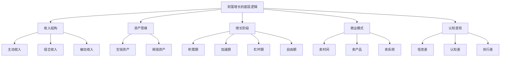
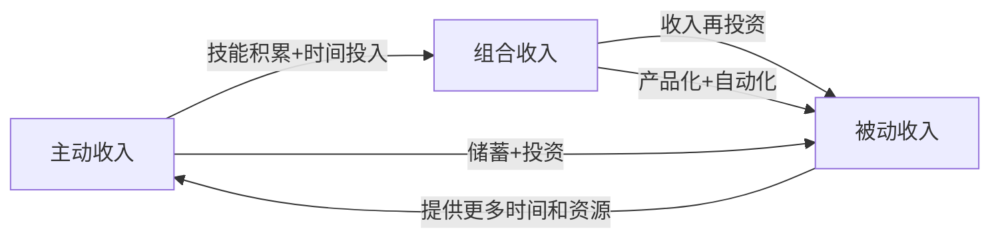
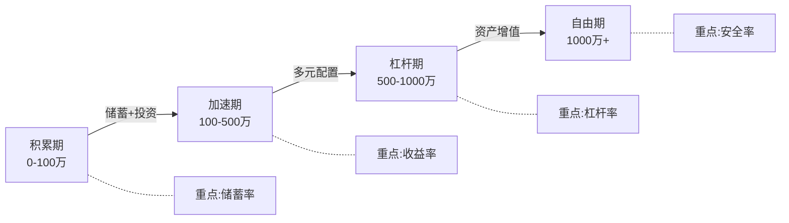
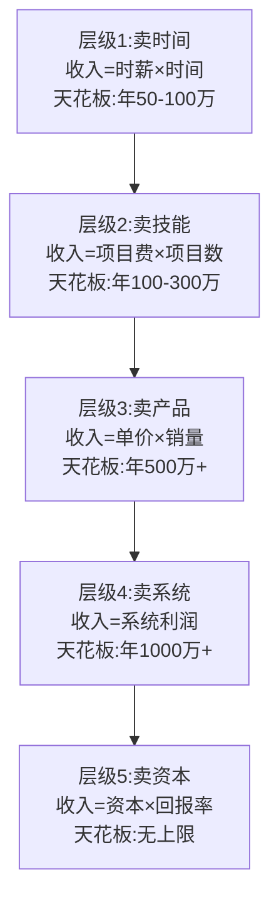
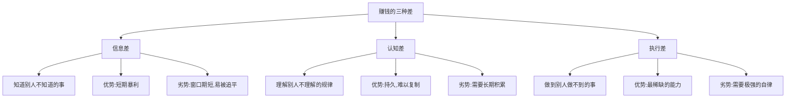
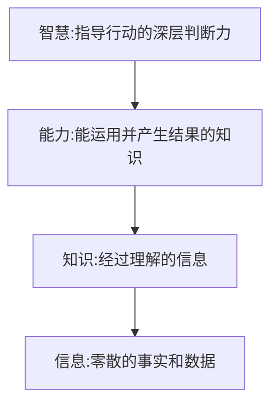

# 第二章：财富增长的底层逻辑

> "如果你想变得富有，就必须理解金钱是如何运作的。" —— 托马斯·科里《富有的习惯》

很多人一辈子都在赚钱，却从来没有人系统地教过他们**财富是如何增长的**。学校教的是如何当一个好员工，家庭教的是如何省钱，但没有人告诉你：钱本身是有"生长规律"的。本章将从经济学、金融学和行为科学三个维度，揭示财富增长的底层逻辑，帮你建立系统的财富增长框架。

理解这些逻辑不是为了让你成为金融专家，而是为了让你在每一个财务决策的岔路口，能做出更优的选择。一次选择可能只差几百块，但十年、二十年的累积效应，就是人生轨迹的分叉。



---

## 2.1 收入的三种类型

理解收入的类型，是理解财富增长的第一步。大多数人只知道"上班拿工资"这一种收入方式，这就像只知道锤子的人，看什么问题都像钉子。

经济学家米尔顿·弗里德曼提出的**永久收入假说**（Permanent Income Hypothesis）指出：人们不是根据当期收入做消费决策，而是根据对长期收入的预期。理解收入的不同类型和特性，才能真正规划好你的财务人生。

### 2.1.1 主动收入：用时间换钱

**主动收入**是最常见的收入形式——你付出时间和劳动，获得报酬。经济学中称之为**劳动性收入（Earned Income）**，本质是你将自己的人力资本"出租"给雇主或客户。

**核心公式**：

```text
主动收入 = 时间单价 × 投入时间
```

**特点**：
- **线性增长**：收入与时间成正比，一天只有24小时，天花板触手可及
- **不可中断**：停止工作 = 停止收入，生病、失业、休假都会断流
- **最大资产是"你自己"**：你的健康、技能、精力就是最大的本钱
- **税收效率低**：工资薪金是税率最高的收入类型之一（中国个税最高45%）
- **依赖单一雇主**：你的收入命脉掌握在别人手里

**常见形式**：
- 工资薪金（最普遍，占中国城镇居民收入的60%以上）
- 劳务报酬（兼职、咨询、自由职业）
- 经营性收入中需要亲力亲为的部分（个体户、小店主）

**案例：一个程序员的时间单价计算**

小明是一名程序员，月薪2万。他每天工作8小时，每月工作22天。他的时间单价是：

```text
20000 ÷ (8 × 22) = 113.6元/小时
```

如果他想月入4万，只有两条路：
1. **增加时间投入**：加班到每天16小时（身体不允许，也不可持续）
2. **提高时间单价**：提升技能、跳槽到更高薪的岗位

但即便是第2条路，也有明显的天花板。一线城市高级程序员的月薪中位数大约在3-5万，技术总监级别在5-8万。要突破这个天花板，就必须改变收入结构。

**主动收入的隐性成本**：

很多人只看到工资数字，却忽略了隐性成本：
- **通勤成本**：每天2小时通勤 × 22天 = 44小时/月，相当于多上了一周班
- **职业装、应酬**：月均500-2000元
- **压力导致的健康支出**：体检、医疗、保健品
- **加班导致的自我提升时间减少**：这是最大的机会成本

把这些算进去，实际的"时间单价"可能只有账面的60%-70%。

**常见误区**：

| 误区 | 事实 |
|------|------|
| "只要努力加班就能涨薪" | 加班只增加时间投入，不提高单价；且边际效用递减 |
| "跳槽一定能涨薪" | 频繁跳槽（1年内）反而会被HR标记为不稳定，长期损害职业发展 |
| "考更多证书就能涨薪" | 证书是敲门砖，真正涨薪靠的是解决问题的能力和不可替代性 |
| "工资高就是赚得多" | 高薪城市的生活成本也高，要算可支配收入而非名义工资 |

### 2.1.2 组合收入：用技能和资源换钱

**组合收入**（Portfolio Income）介于主动收入和被动收入之间——你前期投入时间和精力创造一个"作品"，完成后可以反复销售。纳西姆·塔勒布在《反脆弱》中称之为"凸性收益"：投入有限，收益无上限。

**核心公式**：

```text
组合收入 = 产品价值 × 销售数量 - 边际成本
```

与主动收入的关键区别在于：**边际成本趋近于零**。你录制一次课程，卖1份和卖10000份，制作成本是一样的。

**特点**：
- **前期投入大**：需要投入时间、技能、资源来创建产品
- **边际成本低**：一旦完成，每多卖一份的成本几乎为零
- **收入有复利效应**：好产品会通过口碑传播，销售加速
- **需要特定技能**：写作、设计、编程、教学等可产品化的技能
- **存在竞争风险**：市场会模仿，需要持续迭代

**常见形式及对比**：

| 类型 | 启动成本 | 制作周期 | 天花板 | 维护成本 | 适合人群 |
|------|---------|---------|--------|---------|---------|
| 在线课程 | 低（几千元设备） | 1-3个月 | 高（百万级） | 低（定期更新） | 有教学能力的专业人士 |
| 电子书 | 极低 | 1-6个月 | 中（十万级） | 极低 | 写作能力强的人 |
| 设计/代码模板 | 低 | 1-4周 | 中（十万级） | 中（适配更新） | 设计师、程序员 |
| SaaS工具 | 中（服务器等） | 3-12个月 | 极高（千万级） | 高（持续开发） | 程序员、产品经理 |
| 付费社群 | 低 | 持续投入 | 高（百万级） | 高（持续运营） | 有影响力的人 |
| 播客/视频号 | 低 | 持续投入 | 高（广告+带货） | 中（持续创作） | 有表达欲的人 |

**案例：英语老师的组合收入之路**

小红是一名英语老师，月薪1.5万。她利用业余时间录制了一套英语课程，定价199元，在网易云课堂上线。

| 时间节点 | 累计销量 | 累计收入 | 月均收入 | 投入时间 |
|---------|---------|---------|---------|---------|
| 第1个月 | 100份 | 1.99万 | 1.99万 | 月均投入80小时录制 |
| 第3个月 | 500份 | 9.95万 | 3.3万 | 已完成录制，仅维护 |
| 第6个月 | 1000份 | 19.9万 | 3.3万 | 每周答疑2小时 |
| 第12个月 | 3000份 | 59.7万 | 5.0万 | 每周答疑2小时+季度更新 |
| 第24个月 | 8000份 | 159.2万 | 6.6万 | 已有助教团队 |

她前期投入了约200小时录制课程，但之后每卖出一份都是纯利润。到第24个月，她的课程收入已经是工资的4倍多。

**从"一次性"到"可持续"的关键**：
1. **选对赛道**：选一个持续有需求的领域（语言学习、职业技能、考试辅导）
2. **打造标杆产品**：宁可花3个月做一个精品，也不要花1周做一个凑合的产品
3. **建立流量入口**：通过免费内容（公众号、B站、知乎）持续引流
4. **迭代升级**：根据用户反馈不断优化，推出进阶版

### 2.1.3 被动收入：用资产换钱

**被动收入**（Passive Income）是最高级的收入形式——你的资产为你工作，你不需要投入时间。沃伦·巴菲特说过："如果你在睡觉的时候没有赚钱的途径，你会一直工作到死。"这句话精确地描述了被动收入的价值。

**核心公式**：

```text
被动收入 = 资产规模 × 收益率
```

这个公式的美妙之处在于：资产规模可以持续积累，收益率可以通过学习提高，两者相乘就是指数增长。

**特点**：
- **前期需要大量积累**：资金、资产、系统，三者至少有其一
- **一旦建立，可以持续产生收入**：真正的"睡后收入"
- **收入无上限**：资产规模越大，收益越大
- **税收效率高**：资本利得、股息等被动收入的税率通常低于工资薪金
- **需要耐心**：建立被动收入流通常需要3-10年

**常见形式详解**：

| 类型 | 典型收益率 | 启动门槛 | 风险等级 | 流动性 | 适合阶段 |
|------|----------|---------|---------|--------|---------|
| 银行存款/货币基金 | 1.5%-3% | 极低 | 极低 | 极高 | 积累期 |
| 指数基金定投 | 8%-12%（长期） | 低 | 中 | 高 | 积累期-加速期 |
| 债券/债券基金 | 3%-6% | 低 | 低-中 | 中-高 | 全阶段 |
| 股票（股息策略） | 4%-8%（股息） | 中 | 中-高 | 高 | 加速期 |
| 出租房产 | 2%-5%（净租金） | 高 | 中 | 低 | 加速期-杠杆期 |
| REITs（房地产信托） | 5%-8% | 低 | 中 | 高 | 全阶段 |
| 知识产权/版税 | 因人而异 | 中（技能） | 低 | 中 | 发展期 |
| 股权投资 | 15%-30%（成功时） | 极高 | 极高 | 极低 | 杠杆期 |

**案例：一位退休教师的被动收入组合**

老张是一名退休教师，30年前开始有意识地建立被动收入。他的经验是：不追热点，不加杠杆，持续定投，耐心等待。

| 资产类型 | 资产规模 | 年收益率 | 年收益 | 占比 |
|---------|---------|---------|--------|------|
| 股票账户（蓝筹+指数） | 200万 | 4%（股息）+ 6%（增值） | 20万 | 40% |
| 基金账户（混合型） | 150万 | 8% | 12万 | 30% |
| 出租房产（2套） | 100万（净值） | 12%（租金/净值） | 12万 | 20% |
| 银行理财+国债 | 50万 | 4% | 2万 | 10% |
| **合计** | **500万** | **9.2%** | **46万** | **100%** |

月均被动收入约3.8万，远超多数城市的人均工资。更重要的是，这个收入流在他不工作的情况下也会持续增长——因为大部分收益进行了再投资。

### 2.1.4 三种收入的动态转化

三种收入不是固定不变的，它们之间可以相互转化。理解这个转化过程，是制定收入升级策略的关键。



**转化路径一：主动收入 → 组合收入**

前提条件：
1. 你在某个领域有**可产品化的技能**（写作、设计、编程、教学、咨询）
2. 你有**足够的业余时间**投入产品开发
3. 你愿意**延迟满足**（前期投入大量时间，可能3-6个月没有回报）

操作步骤：
1. 识别你最擅长且市场有需求的技能
2. 将这个技能打包成可复制的产品（课程、模板、工具）
3. 选择一个分发平台（网易云课堂、知识星球、GitHub等）
4. 通过免费内容建立流量入口
5. 持续迭代产品，建立口碑

**转化路径二：主动收入 → 被动收入**

这是最经典的路径：把工资的一部分拿出来投资。

操作步骤：
1. 发薪日自动转出20%-50%到投资账户
2. 建立应急基金（3-6个月生活费，放在货币基金里）
3. 开始指数基金定投（沪深300、中证500）
4. 随着收入增长，逐步增加投资金额和品种
5. 当投资收益超过日常开支时，你就实现了财务自由

**转化路径三：组合收入 → 被动收入**

当你有了一个成功的产品，可以：
1. **自动化运营**：用工具自动处理订单、客服、交付
2. **团队化运营**：雇人处理日常运营，你只做战略决策
3. **产品矩阵化**：围绕核心能力开发多个产品
4. **投资收益**：将产品收入投入被动收入资产

### 2.1.5 收入类型的选择策略

**不同人生阶段的收入重点**：

| 阶段 | 年龄 | 重点收入类型 | 核心目标 | 关键动作 |
|------|------|-------------|---------|---------|
| 积累期 | 20-30岁 | 主动收入（90%） | 提高时间单价，积累第一桶金 | 提升专业技能，跳槽涨薪，严控支出 |
| 发展期 | 30-40岁 | 主动+组合（70%+20%） | 收入多元化，开始建立资产 | 开发副业产品，建立投资组合 |
| 加速期 | 40-50岁 | 组合+被动（40%+40%） | 资产产生收益，减少主动劳动 | 扩大产品矩阵，优化资产配置 |
| 自由期 | 50岁+ | 被动收入（70%+） | 资产自动运转，享受生活 | 保守配置，财富传承 |

**行动建议**：
1. 盘点你当前的收入来源，计算三种收入各占多少比例
2. 根据你的年龄段，确定下一步应该向哪种收入倾斜
3. 选择1-2种最适合你的组合/被动收入方式，开始小规模试水
4. 每季度审视一次收入结构的变化，确保方向正确

---

## 2.2 资产与负债的重新定义

### 2.2.1 现金流视角下的资产与负债

传统会计学对资产和负债的定义是基于**存量**的：
- **资产**：你拥有的有价值的东西（房子、车子、存款）
- **负债**：你欠别人的钱（房贷、车贷、信用卡）

这个定义没有错，但对于个人理财来说不够实用。罗伯特·清崎在《富爸爸穷爸爸》中提出了一个基于**流量**的定义，这个定义改变了数百万人的财务思维：

> **资产**是能把钱**放进**你口袋的东西。
> **负债**是把钱从你口袋**拿走**的东西。

这个定义的精妙之处在于：它不看"你拥有什么"，而是看"这个东西对你的现金流有什么影响"。同样是300万的房子，自住就是负债（每月往外掏钱），出租且租金覆盖月供就是资产（每月往里进钱）。

**为什么现金流视角更重要？**

从经济学的角度，一个资产的真实价值不是它的"账面价格"，而是它**未来能产生的现金流的折现值**（Discounted Cash Flow, DCF）。这是华尔街估值的核心方法论，也完全适用于个人理财。

```text
资产真实价值 = Σ (未来每期现金流 ÷ (1 + 折现率)^期数)
```

举个简单的例子：
- 房子A：市价300万，自住，每月净流出1.27万（月供+物业+维修），现金流为**负**
- 房子B：市价300万，出租，每月净流入800元（租金-月供-物业-维修），现金流为**正**

按照DCF模型，房子A的价值是负数（持续消耗你的财富），房子B的价值是正数（持续创造你的财富）。虽然它们的市价一模一样。

### 2.2.2 生钱资产 vs 耗钱资产

基于现金流视角，我们可以把所有"资产"分为两大类：

**生钱资产**（能产生正现金流的资产）：

| 类型 | 典型年化收益 | 门槛 | 维护成本 | 举例 |
|------|------------|------|---------|------|
| 分红股票 | 3%-8% | 低 | 低 | 银行股、公用事业股 |
| 债券/理财 | 3%-6% | 低 | 极低 | 国债、AAA企业债 |
| 出租房产 | 2%-6%（净） | 高 | 中 | 租金覆盖月供的房产 |
| 知识产权 | 因人而异 | 中 | 低 | 专利授权、图书版税 |
| 盈利的副业 | 10%-50% | 中 | 中 | SaaS产品、课程 |
| 股权/合伙 | 10%-30% | 高 | 低 | 参股朋友的盈利企业 |

**耗钱资产**（产生负现金流的"资产"）：

| 类型 | 年化消耗 | 常见误区 | 真实成本 |
|------|---------|---------|---------|
| 自住房产 | 房价×3%-5% | "房子是最大的资产" | 月供+物业+维修+装修折旧+机会成本 |
| 自用车辆 | 车价×15%-25% | "有车才有面子" | 购置税+保险+油费+停车+保养+折旧 |
| 奢侈品 | 购入价×10%-30% | "奢侈品会保值" | 贬值+维护+保险+机会成本 |
| 闲置物品 | 因物而异 | "以后可能用得上" | 存储空间成本+资金占用的机会成本 |

**深度案例分析：房产是资产还是负债？**

房产是中国家庭最大的财富载体，也是最容易产生认知偏差的领域。让我们用数据说话：

**场景A：一线城市自住房（北京）**

```text
购买价格：500万（80㎡，6.25万/㎡）
首付：150万（30%）
贷款：350万，30年期，利率4.2%
月供：17,142元
物业费：500元/月
维修基金分摊：200元/月
装修折旧（30万÷10年÷12月）：250元/月
──────────────────────────────
每月现金流出：18,092元
年现金流出：217,104元
```

假设房价年涨3%（乐观估计），10年后房子价值约672万，增值172万。但这10年的总支出是：首付150万 + 月供累计约205万 = 355万。实际收益取决于卖出时机和税费。

**场景B：同地段出租房**

```text
购买价格：500万
月供：17,142元
物业费：500元/月
维修基金：200元/月
月租金收入：8,000元（北京80㎡平均租金）
──────────────────────────────
每月净现金流出：10,042元
```

即使出租了，这仍然是**耗钱资产**——租金远不够覆盖月供。只有当租金 > 月供+维护费时，才变成生钱资产。

**场景C：二线城市出租房（成都）**

```text
购买价格：150万（90㎡，1.67万/㎡）
首付：45万（30%）
贷款：105万，30年期，利率4.0%
月供：5,013元
物业费：300元/月
维修基金：100元/月
月租金收入：3,500元（成都90㎡平均租金）
──────────────────────────────
每月净现金流出：1,913元
```

二线城市虽然租金/房价比更高，但仍然是负现金流。**在中国当前的房价水平下，纯靠租金覆盖月供的房产非常稀少**——除非你全款买房。

**关键认知**：
1. **自住房是消费品，不是投资品**。它提供居住价值，但不产生现金流。
2. **房价上涨带来的"增值"是纸面富贵**。你只有在卖掉并换到更便宜的地方住时，才能兑现。
3. **房产投资的真实收益率 = 租金收益率 + 房价增值率 - 持有成本率**。在中国一线城市，这个数字往往是负数或极低。
4. **房产最大的价值是强制储蓄**。月供相当于每月强制存一笔钱，这对消费习惯不好的人来说反而是好事。

### 2.2.3 构建资产组合的核心原则

**原则一：优先购买生钱资产**

在你购买任何"大件"之前，问自己三个问题：
1. 这个东西能把钱放进我的口袋吗？
2. 它的现金流是正的还是负的？
3. 这笔钱如果投入其他地方，回报率会不会更高？

如果答案是否定的，那它就是耗钱资产——不是不能买，而是要**用生钱资产的收益来买**。

**原则二：用生钱资产的收益购买耗钱资产**

这是一条改变人生的规则。具体操作：

```text
想要一辆30万的车？
→ 先建立一个能产生每年3万收益的资产组合（约需30-50万本金）
→ 用每年3万的收益来支付车贷/养车费用
→ 你的本金不减少，车也就"免费"了
```

**原则三：持续增加生钱资产的比例**

财务自由的数学定义是：

```text
被动收入（生钱资产收益）≥ 生活总支出
```

为了实现这个目标，你需要：
1. 计算你的年度生活总支出（包括所有开销）
2. 计算需要多少生钱资产才能产生等额的被动收入
3. 倒推需要多少年才能积累到这个资产规模
4. 制定具体的储蓄和投资计划

| 月支出 | 年支出 | 所需资产（按4%收益率） | 所需资产（按8%收益率） |
|--------|--------|---------------------|---------------------|
| 5,000 | 6万 | 150万 | 75万 |
| 10,000 | 12万 | 300万 | 150万 |
| 20,000 | 24万 | 600万 | 300万 |
| 30,000 | 36万 | 900万 | 450万 |
| 50,000 | 60万 | 1,500万 | 750万 |

**原则四：定期清理耗钱资产**

每年至少做一次"资产审计"：
1. 列出你所有的"资产"（包括房产、车辆、投资、收藏品等）
2. 计算每个资产的年度现金流（收入-支出）
3. 标记哪些是正现金流（生钱），哪些是负现金流（耗钱）
4. 对于耗钱资产，问自己：有没有办法把它变成生钱资产？或者能不能卖掉它？

**常见误区**：

| 误区 | 真相 |
|------|------|
| "房子是最安全的投资" | 自住房是消费品；投资房要看租售比，中国多数城市租售比不达标 |
| "黄金是好的保值资产" | 黄金不产生现金流（没有股息、没有租金），只能靠涨价获利 |
| "收藏品会升值" | 大部分收藏品的流通性极差，变现时往往大幅折价 |
| "买贵的东西就是投资" | 品质好≠投资好，关键看能否产生正现金流 |
| "负债都是坏的" | 能用低成本负债撬动高收益资产的"好负债"是财富加速器 |

---

## 2.3 财富增长的四个阶段

财富增长不是一个匀速的过程，而是一个**加速的过程**。就像火箭发射需要经历不同的阶段一样，财富积累也有明确的阶段性特征。理解这些阶段，可以让你知道自己在哪里、该做什么、不该做什么。



### 2.3.1 积累期（0→100万）

**核心目标**：积累第一桶金

这是最艰难、最漫长、也是最重要的阶段。很多人在这个阶段就放弃了，觉得"存钱太慢了，不如及时行乐"。但第一桶金的意义不在于金额本身，而在于**它证明了你有积累财富的能力**。

**阶段特征**：
- 资产规模小，复利效应不明显（10万本金，8%收益一年才8000）
- 主要靠主动收入积累
- 需要严格控制支出
- 最重要的变量是**储蓄率**，而非收益率

**为什么储蓄率比收益率更重要？**

| 情景 | 月收入 | 月储蓄 | 储蓄率 | 年收益率 | 10年后资产 |
|------|--------|--------|--------|---------|-----------|
| A：高储蓄低收益 | 1.5万 | 6000 | 40% | 6% | 约98万 |
| B：低储蓄高收益 | 2万 | 3000 | 15% | 12% | 约65万 |

A的收入比B低33%，但10年后资产比B多50%。**在起步阶段，存下来多少比赚到多少更重要。**

**具体策略**：

**1. 提高主动收入（开源）**
- 提升专业技能：投资回报率最高的投资就是投资自己。一个AWS认证可以让程序员薪资涨20%-40%。
- 争取加薪或跳槽：每年至少评估一次自己的市场价值。跳槽涨薪幅度通常在20%-50%，而内部加薪通常只有5%-10%。
- 开发副业：利用主业积累的技能做兼职。程序员接外包、设计师做兼职、老师做家教。

**2. 控制支出（节流）**
- **50/30/20法则**：收入的50%用于必要支出（房租、餐饮、交通），30%用于个人发展和享受，20%用于储蓄和投资。在积累期，建议调整为**60/20/20**甚至**50/20/30**。
- **区分"需要"和"想要"**：吃饭是需要，下馆子是想要；通勤是需要，打车是想要。
- **警惕"生活方式通胀"**：涨薪后不要同步升级消费水平。涨薪5000，存下4000，只用1000改善生活。
- **记账**：至少记3个月，了解自己的钱去了哪里。推荐App：随手记、MoneyWiz。

**3. 开始投资（钱生钱）**
- **第一步：建立应急基金**。3-6个月的生活费，放在货币基金（余额宝、零钱通）里，随取随用。这不是投资，是安全垫。
- **第二步：开始定投指数基金**。每月固定日期，投入固定金额到沪深300或中证500指数基金。定投的核心是"纪律"，不是"择时"。
- **第三步：学习基本的投资知识**。推荐先读《指数基金投资指南》（银行螺丝钉），建立基础认知。

**案例：月薪1万如何攒到100万**

小李，25岁，月薪1万，坐标杭州：

```text
月收入：10,000元
├── 必要支出：4,500元（房租1500+餐饮1200+交通300+通讯200+水电100+其他1200）
├── 弹性支出：1,500元（社交、娱乐、购物）
├── 自我投资：1,000元（书籍、课程、考证）
└── 储蓄+投资：3,000元
    ├── 应急基金：500元（存满6个月支出后停止）
    └── 指数基金定投：2,500元
```

假设年化收益率8%（沪深300长期年化约10-12%，保守取8%）：

| 年份 | 累计投入 | 资产总额 | 其中收益 |
|------|---------|---------|---------|
| 第3年 | 10.8万 | 12.2万 | 1.4万 |
| 第5年 | 18万 | 22.1万 | 4.1万 |
| 第8年 | 28.8万 | 40.8万 | 12万 |
| 第10年 | 36万 | 55.9万 | 19.9万 |
| 第12年 | 43.2万 | 74.7万 | 31.5万 |
| 第15年 | 54万 | 110.2万 | 56.2万 |

注意看第15年的数据：投入54万，收益56.2万——**收益超过了本金**。这就是复利的力量，但它需要时间来显现。

如果小李在这期间涨薪（很合理），每月投资从3000涨到5000，100万的目标可以在**10-12年内实现**。

**这个阶段最大的敌人**：
1. **放弃**：觉得太慢、看不到希望。对策：设定小目标（第一个10万、第一个50万），每达到一个就奖励自己。
2. **冲动消费**：看到别人买名牌、换新车就心痒。对策：算一算那个包/车的机会成本——10年后它值多少钱？
3. **盲目追求高收益**：去炒期货、加杠杆、追涨停板。对策：在积累期，保住本金比赚取高收益重要100倍。

### 2.3.2 加速期（100万→500万）

**核心目标**：收入多元化，建立投资组合

当你的资产达到100万时，游戏规则变了。100万按8%的年化收益，每年可以产生8万的收益——这已经相当于很多三四线城市的平均年收入了。**钱开始替你工作了。**

**阶段特征**：
- 复利效应开始显现（100万本金，8%收益，10年后变成216万）
- 可以承受适度的风险（有安全垫了）
- 需要学习更多的投资知识
- 收入来源开始多元化

**具体策略**：

**1. 资产配置多元化**

不要把所有鸡蛋放在一个篮子里。根据你的风险承受能力和投资期限，建议的配置比例：

| 资产类别 | 比例 | 具体品种 | 预期年化 | 作用 |
|---------|------|---------|---------|------|
| 股票类 | 40%-50% | 沪深300+中证500+纳指100 | 8%-15% | 进攻，追求增长 |
| 债券类 | 20%-30% | 国债+高等级企业债基金 | 3%-6% | 防守，降低波动 |
| 另类投资 | 10%-15% | 黄金+REITs | 5%-10% | 分散，对冲风险 |
| 现金类 | 10%-15% | 货币基金+短期理财 | 2%-3% | 流动性，应急 |

**2. 收入来源多元化**

在这个阶段，你应该有至少2-3个收入来源：
- **主业收入**（占60%-70%）：依然是你的核心收入
- **投资收入**（占15%-25%）：股息、利息、资本增值
- **副业/组合收入**（占10%-15%）：课程、咨询、外包

**3. 学习高级投资策略**

在积累期你只需要"定投指数基金"，但在这个阶段你需要：
- 学习基本面分析（看财报、算估值）
- 了解不同资产类别的特性（股票、债券、商品、房产）
- 学习资产配置理论（现代投资组合理论、风险平价）
- 了解税务优化（利用免税额度、合理避税）

**案例：35岁小王的资产200万配置**

```text
资产配置：
├── 股票基金：80万（40%）
│   ├── 沪深300指数：30万
│   ├── 中证500指数：20万
│   ├── 纳斯达克100：15万
│   └── 主动管理基金：15万
├── 债券基金：50万（25%）
│   ├── 纯债基金：30万
│   └── 二级债基：20万
├── 另类投资：30万（15%）
│   ├── 黄金ETF：15万
│   └── REITs：15万
├── 现金类：20万（10%）
│   └── 货币基金：20万
└── 出租房产：20万（净值，10%）
    └── 月租金收入：3000元

年预期收益：
80×10% + 50×4% + 30×7% + 20×2.5% + 20×5% = 8+2+2.1+0.5+1 = 13.6万
```

13.6万的年投资收益，相当于月入1.13万。再加上主业收入和副业收入，小王的年总收入在30-40万之间。

### 2.3.3 杠杆期（500万→1000万）

**核心目标**：利用杠杆放大收益

**阶段特征**：
- 资产规模较大，投资收益开始接近甚至超过主动收入
- 可以合理使用杠杆放大收益
- 风险管理变得更加重要——一次重大亏损可能让你倒退几年
- 需要更专业的知识或专业团队的支持

**杠杆的双刃剑**：

杠杆的本质是**借钱投资**。如果投资回报率 > 借贷成本，杠杆放大收益；反之，杠杆放大亏损。

```text
杠杆收益 = (投资回报率 - 借贷成本) × 杠杆倍数 × 本金
```

| 场景 | 本金 | 杠杆 | 总投资 | 回报率 | 借贷成本 | 净收益 | 收益率（基于本金） |
|------|------|------|--------|--------|---------|--------|------------------|
| 无杠杆 | 100万 | 0 | 100万 | 10% | - | 10万 | 10% |
| 2倍杠杆 | 100万 | 100万 | 200万 | 10% | 4% | 12万 | 12% |
| 3倍杠杆 | 100万 | 200万 | 300万 | 10% | 4% | 18万 | 18% |
| 2倍杠杆（亏损） | 100万 | 100万 | 200万 | -10% | 4% | -28万 | -28% |

**杠杆使用的三条铁律**：
1. **只在确定性高的机会上使用杠杆**。不要拿杠杆去炒短线、追热点。
2. **杠杆倍数不超过2倍**。超过2倍，一个30%的下跌就会让你爆仓。
3. **确保有稳定的现金流覆盖借贷成本**。如果投资暂时亏损，你必须能还得起利息。

**具体策略**：

1. **房产杠杆**：用30%首付撬动100%的房产。但前提是：租金收益率 > 贷款利率，或者你确信房价会涨。
2. **融资融券**：用保证金撬动更大的投资。风险极高，不建议新手使用。
3. **经营杠杆**：用别人的钱做自己的生意。比如：你有一个验证过的商业模式，但缺资金扩大规模，可以找合伙人或借贷。

**案例：45岁老张的800万资产配置**

```text
资产配置：
├── A股：200万（25%）
│   ├── 蓝筹股：100万（银行、消费、医药）
│   └── 成长股：100万（科技、新能源）
├── 港股+美股：150万（19%）
│   ├── 恒生科技：50万
│   ├── 标普500：50万
│   └── 纳指100：50万
├── 债券：100万（12.5%）
├── 房产：250万（31%，含贷款100万，杠杆2.5倍）
│   ├── 自住房：150万（净值）
│   └── 投资房：100万（净值，贷款100万）
├── 另类投资：50万（6%）
│   ├── 黄金：25万
│   └── 私募基金：25万
└── 现金：50万（6%）

年预期收益：
投资收益：约40-50万
房租收入：约10万
主业收入：约30万
总计：约80-90万
```

### 2.3.4 自由期（1000万+）

**核心目标**：资产配置与财富传承

**阶段特征**：
- 被动收入完全覆盖生活开支（按4%法则，1000万每年可提取40万）
- 可以选择自己喜欢的生活方式
- 需要考虑财富传承和税务规划
- 关注资产的**安全性**和**传承性**，而非单纯的增长性

**4%法则**（也叫"25倍法则"）：

这是来自美国Trinity Study的一个经典结论：如果你的投资组合每年提取不超过4%（根据通胀调整），那么你的钱大概率可以永远花不完。

```text
财务自由所需资产 = 年支出 × 25
```

| 年支出 | 所需资产 |
|--------|---------|
| 20万 | 500万 |
| 40万 | 1000万 |
| 60万 | 1500万 |
| 100万 | 2500万 |

**注意**：4%法则基于美国股市的历史数据。在中国，考虑到更高的通胀预期和不同的市场特征，建议使用**3%-3.5%的安全提取率**。

**具体策略**：

1. **保守型资产配置**
   - 固定收益：40%-50%（国债、高等级债券、大额存单）
   - 股票：20%-30%（蓝筹股、指数基金）
   - 另类投资：10%-15%（黄金、REITs）
   - 现金：10%-15%

2. **财富传承规划**
   - **遗嘱**：明确资产分配意愿，避免家庭纠纷
   - **保险**：大额人寿保险可以作为财富传承工具（杠杆功能+避税功能）
   - **信托**：将资产装入信托，实现资产隔离和代际传承
   - **赠与**：利用每年的免税赠与额度，逐步转移资产

3. **税务优化**
   - 了解不同收入类型的税率差异
   - 利用税收优惠政策（个人养老金账户、税优健康险等）
   - 合理规划资产持有结构（个人 vs 公司）

**案例：55岁王先生的3000万资产配置**

```text
资产配置：
├── 固定收益：1200万（40%）
│   ├── 国债：500万（年收益约15万）
│   ├── 大额存单：400万（年收益约12万）
│   └── 高等级债券基金：300万（年收益约12万）
├── 股票：600万（20%）
│   ├── 沪深300ETF：300万
│   ├── 港股蓝筹：200万
│   └── 美股指数：100万
├── 房产：800万（27%）
│   ├── 自住房：500万
│   └── 出租房产：300万（年租金约15万）
├── 另类投资：200万（7%）
│   ├── 黄金：100万
│   └── 私募/VC：100万
└── 现金：200万（6%）

年被动收入：
固定收益利息：约39万
股票股息+增值：约30-50万
房租收入：约15万
合计：约84-104万
月均：约7-8.7万
```

**这个阶段最重要的原则**：不要为了追求更高收益而冒不必要的风险。你已经有了足够的财富，现在的目标是**守住它**，并让它稳定地为你和你的家人服务。

**四个阶段的总结对比**：

| 维度 | 积累期 | 加速期 | 杠杆期 | 自由期 |
|------|--------|--------|--------|--------|
| 资产规模 | 0-100万 | 100-500万 | 500-1000万 | 1000万+ |
| 核心策略 | 高储蓄率 | 多元配置 | 合理杠杆 | 保守保值 |
| 主要收入 | 主动收入 | 主动+投资 | 投资+经营 | 被动收入 |
| 风险承受 | 低 | 中 | 中-高 | 低 |
| 关键能力 | 自律+节流 | 学习+配置 | 风控+杠杆 | 传承+税务 |
| 典型年限 | 5-15年 | 5-10年 | 3-7年 | 持续 |
| 最大陷阱 | 放弃 | 盲目跟风 | 过度杠杆 | 骄傲自满 |

---

## 2.4 个人商业模式升级

财富增长不仅取决于你赚多少、存多少、投多少，更取决于你**用什么方式赚钱**。大多数人一辈子只有一种赚钱方式——打工。但事实上，个人的商业模式有很多种，每一种都有完全不同的收入上限和自由度。

### 2.4.1 个人商业模式的五个层级



**从卖时间到卖资本，每升一级，收入上限翻一个数量级，自由度也大幅提升。**

**层级1：卖时间**（最基础）

你把自己的时间卖给一个雇主。这是90%的人的模式。

- 收入公式：**收入 = 时薪 × 工作时间**
- 天花板：一天24小时 × 365天 = 8760小时，假设时薪100元，理论上限87.6万/年
- 实际上限：考虑到健康和生活质量，实际可用工作时间约2000小时/年
- 核心能力：执行力、专业技能
- 典型职业：上班族、公务员、教师

**层级2：卖技能**（自由职业/外包）

你把技能打包成服务，卖给多个客户。

- 收入公式：**收入 = 项目单价 × 项目数量**
- 天花板：取决于你能同时管理多少个项目
- 关键升级：从"一对一"变成"一对多"，从"按小时计费"变成"按价值计费"
- 核心能力：技能+营销+客户管理
- 典型职业：自由设计师、咨询师、律师、会计师

**层级3：卖产品**（产品化）

你把技能/知识打包成可复制的产品。

- 收入公式：**收入 = 产品单价 × 销售数量**
- 天花板：理论上无上限（互联网产品的边际成本趋近于零）
- 关键升级：**你不再卖时间**。产品可以24小时销售，全球销售
- 核心能力：产品设计+营销+运营
- 典型形态：在线课程、SaaS工具、电子书、设计模板、App

**层级4：卖系统**（企业化）

你建立一个团队和系统，让系统为你工作。

- 收入公式：**收入 = 系统收入 - 系统成本**
- 天花板：取决于系统的规模和效率
- 关键升级：**你不再卖自己的技能**，而是管理别人的技能
- 核心能力：领导力+系统思维+资源整合
- 典型形态：公司、工作室、MCN、加盟体系

**层级5：卖资本**（资本化）

你用资本投资别人的系统。

- 收入公式：**收入 = 资本 × 投资回报率**
- 天花板：无上限
- 关键升级：**你既不卖时间也不卖技能**，只用钱生钱
- 核心能力：投资眼光+风险管理+资产配置
- 典型形态：天使投资、股权投资、基金投资

### 2.4.2 模式升级的实操路径

**从层级1到层级2：打工者→自由职业**

这是最常见也最可行的第一步升级。操作路径：

1. **识别你的可外售技能**：你在公司里做的事情，有没有人愿意在外面付费请你做？
2. **建立个人品牌**：在行业社区、社交媒体上展示你的专业能力
3. **接第一个外部项目**：先利用业余时间接单，不要裸辞
4. **建立稳定的客户来源**：口碑转介绍 + 线上平台（猪八戒、Upwork、Fiverr）
5. **当副业收入稳定达到主业的70%以上时**，可以考虑全职转型

**关键指标**：
- 副业月收入 ≥ 主业月薪 × 0.7
- 至少有3个稳定客户
- 有6个月以上的应急基金

**从层级2到层级3：自由职业者→产品创作者**

这是从"时间换钱"到"产品换钱"的质变。操作路径：

1. **识别重复交付的内容**：你每次给客户做的方案中，有哪些部分是重复的？
2. **将重复部分产品化**：模板、工具、课程、SaaS
3. **选择分发平台**：
   - 课程：网易云课堂、腾讯课堂、Udemy
   - 模板：GitHub、Envato、Creative Market
   - 工具/App：App Store、Chrome Web Store
   - 知识付费：知识星球、小报童
4. **用免费内容引流**：写博客、做视频、发社交媒体
5. **持续迭代产品**：根据用户反馈改进

**从层级3到层级4：产品创作者→系统构建者**

这是从"一个人做"到"一个团队做"的升级。操作路径：

1. **标准化你的业务流程**：把每个环节写成SOP（标准操作流程）
2. **招聘第一个助手**：先从虚拟助理或兼职开始
3. **建立质量控制系统**：确保别人做的和你做的一样好
4. **逐步扩大团队**：从1人→3人→10人→更多
5. **你从"做事"变成"管事"**：你的核心工作从执行变成决策

**案例：程序员的四步商业模式升级**

| 阶段 | 模式 | 具体形态 | 月收入 | 时间投入 | 自由度 |
|------|------|---------|--------|---------|--------|
| 阶段1 | 卖时间 | 公司程序员 | 2万 | 176小时/月 | 低 |
| 阶段2 | 卖技能 | 接外包项目 | 3-6万 | 120-160小时/月 | 中 |
| 阶段3 | 卖产品 | 开发SaaS工具 | 1-10万（持续增长） | 40-80小时/月 | 高 |
| 阶段4 | 卖系统 | 技术团队负责人 | 5-20万+ | 20-40小时/月 | 极高 |

### 2.4.3 从本地市场到全球市场

互联网时代最大的红利之一，就是**市场边界的消失**。一个二线城市的设计师，可以通过Fiverr服务全球客户；一个县城的英语老师，可以通过YouTube触达全球学习者。

**本地市场的限制**：
- 客户群体有限（一个城市的人口）
- 竞争激烈（同行都在同一个池子里）
- 定价天花板低（受当地收入水平限制）
- 增长需要地理扩张（成本高）

**全球市场的机会**：
- 客户群体扩大1000倍以上
- 可以利用汇率差异（赚美元花人民币）
- 可以24小时运营（不同时区的客户）
- 品牌可以指数级增长

**案例：从本地设计工作室到全球设计平台**

| 维度 | 本地模式 | 全球模式 |
|------|---------|---------|
| 客户来源 | 本地企业 | 全球客户 |
| 月客户数 | 5-10个 | 50-200个 |
| 客单价 | 3000-1万 | 500-5000美元 |
| 月收入 | 3万 | 5-15万人民币 |
| 工作时间 | 朝九晚五 | 自由安排 |
| 增长空间 | 有限 | 几乎无限 |

**全球化实操路径**：
1. **选择一个可远程交付的技能**：设计、编程、写作、翻译、咨询
2. **注册海外自由职业平台**：Fiverr、Upwork、Toptal
3. **打造英文个人网站/作品集**：展示你的专业能力
4. **从低价起步积累评价**：前5-10个订单可以适当降价，积累好评
5. **逐步提价，筛选优质客户**：好评积累到一定程度后，价格翻倍

### 2.4.4 个人商业模式画布

商业模式画布（Business Model Canvas）由亚历山大·奥斯特瓦尔德提出，原本用于企业，但完全适用于个人。以下是**个人版商业模式画布**：

```text
┌─────────────────────────────────────────────────────────────┐
│                      个人商业模式画布                         │
├──────────┬──────────┬───────────┬──────────┬────────────────┤
│ 关键合作  │ 关键活动  │  价值主张  │ 客户关系  │   客户群体     │
│          │          │           │          │               │
│ • 导师    │ • 内容创作│  我能帮    │ • 一对一  │ • 谁需要我？   │
│ • 同行    │ • 产品开发│  客户解决  │ • 一对多  │ • 他们的痛点？ │
│ • 供应商  │ • 市场营销│  什么问题？│ • 自动化  │ • 他们愿意     │
│ • 平台方  │ • 客户服务│  比别人好  │ • 社群    │   付多少钱？   │
│          │          │  在哪里？  │          │               │
├──────────┴──────────┼───────────┴──────────┴────────────────┤
│     关键资源        │            渠道                        │
│                     │                                       │
│ • 技能（核心竞争力） │ • 线上平台（课程/电商）                │
│ • 知识（领域专业度） │ • 社交媒体（引流+品牌）                │
│ • 人脉（合作+推荐）  │ • 口碑传播（最高效的渠道）             │
│ • 资金（启动+运营）  │ • 合作伙伴（分销+联名）                │
│ • 时间（最稀缺资源） │ • SEO/内容营销（长尾流量）             │
├─────────────────────┼───────────────────────────────────────┤
│     成本结构        │            收入来源                    │
│                     │                                       │
│ • 时间成本（最大）   │ • 主动收入（咨询/服务）                │
│ • 学习成本          │ • 组合收入（课程/产品/模板）           │
│ • 工具/平台成本     │ • 被动收入（投资/版税/广告）           │
│ • 营销成本          │ • 杠杆收入（团队利润/股权收益）        │
│ • 机会成本          │                                       │
└─────────────────────┴───────────────────────────────────────┘
```

**行动建议**：
1. 用这个画布梳理你目前的商业模式。诚实填写每个格子。
2. 识别最大的瓶颈在哪里（通常在"价值主张"或"客户群体"）
3. 制定一个90天的升级计划，聚焦于一个关键改变
4. 每半年重新画一次，追踪你的商业模式演进

---

## 2.5 认知变现的底层逻辑

### 2.5.1 信息差、认知差、执行差——赚钱的三种"差"

所有赚钱行为，本质上都是利用某种"不对称性"。理解这三种"差"的层次和特性，可以帮助你选择最持久的赚钱方式。



**信息差**：你知道别人不知道的信息

信息差是最容易利用、也是消亡最快的"差"。在互联网时代，信息传播速度极快，一个信息差的窗口期通常只有几天到几个月。

典型案例：
- 早年知道淘宝开店的人，先发优势巨大
- 知道某个新兴平台的流量红利期
- 了解某个行业的供应链信息

**信息差的规律**：
1. 信息差的收益与**时效性**成正比——越早知道，收益越大
2. 信息差的收益与**传播范围**成反比——知道的人越多，收益越小
3. **合法的信息差**（行业认知、市场洞察）vs **非法的信息差**（内幕交易）——后者是犯罪

**认知差**：你理解别人不理解的规律

认知差是比信息差更深层的不对称。信息可以搜索到，但认知需要长期的积累和思考。

典型案例：
- 理解复利的力量，并坚持20年不动摇
- 看懂一个行业的底层逻辑，提前布局
- 理解人性弱点，在别人恐惧时贪婪

认知差为什么更持久？因为**认知不能被简单复制**。你可以告诉一个人"要长期投资"，但他如果没有经历过牛熊周期，没有深入理解背后的数学原理和行为心理学，他做不到。

**执行差**：你做到别人做不到的事情

执行差是最稀缺的能力。知道和理解都很容易，但真正做到的人极少。世界上的道理就那么多，每个人都知道要"早起、锻炼、读书、投资"，但真正做到的人不到5%。

典型案例：
- 别人知道健身好但不去，你坚持每天健身
- 别人知道该定投但总中断，你持续定投10年
- 别人知道该学习但刷手机，你每天阅读2小时

**三种"差"的价值排序**：

| 维度 | 信息差 | 认知差 | 执行差 |
|------|--------|--------|--------|
| 获取难度 | 低（多关注即可） | 中（需要深度学习） | 高（需要长期修炼） |
| 持久性 | 短（几天到几个月） | 长（几年到几十年） | 极长（终身受用） |
| 收益上限 | 中（单次机会有限） | 高（可复利增长） | 极高（改变人生轨迹） |
| 可复制性 | 高（别人也能查到） | 低（需要内化理解） | 极低（知道也做不到） |
| 适合阶段 | 任何阶段 | 有积累后 | 任何阶段（但最难） |

**核心结论**：认知差 > 执行差 > 信息差。最聪明的人追求认知差，最勤奋的人追求执行差，最投机的人追求信息差。

**案例：三个投资者的十年**

投资者A（信息差）：
- 2015年通过"朋友"得知某股票即将重组，重仓买入
- 短期获利30%，信心大增
- 之后继续听"消息"炒股，2018年亏掉全部利润外加40%本金
- 10年总收益：-15%

投资者B（认知差）：
- 2013年开始系统学习价值投资，读了格雷厄姆、巴菲特、芒格的著作
- 理解了"买股票就是买公司"的底层逻辑
- 选择了3-5家自己能理解的优质公司，长期持有
- 中间经历了2015年股灾、2018年熊市、2020年疫情，都没卖
- 10年总收益：380%

投资者C（执行差）：
- 也读了和B一样的书，认知水平差不多
- 但在2015年股灾时恐慌卖出，在2020年疫情时又恐慌卖出
- 每次"抄底"都抄在半山腰
- 10年总收益：60%

**B和C的区别不是智商，不是知识，而是执行纪律。**

### 2.5.2 从"知道"到"做到"的鸿沟

大多数人的问题不是"不知道"，而是"做不到"。从"知道"到"做到"之间，有一条巨大的鸿沟。行为科学家称之为**"知行鸿沟"（Knowing-Doing Gap）**。

**鸿沟的四个层次**：

**层次1：知道 ≠ 理解**
- 你知道"复利"这个概念
- 但你可能不理解：为什么72法则说72÷年化收益率=资产翻倍所需年数？为什么10%的年化收益在30年后会让资产变成17倍？
- 你更不理解：复利在心理学上为什么那么难以坚持？因为人类的大脑是线性思维的，不擅长感知指数增长。

**层次2：理解 ≠ 认同**
- 你理解了复利的数学原理
- 但你可能不相信它真的有效："万一市场大跌呢？""万一中国经济不行了呢？"
- 认同需要**信仰**——不是宗教式的盲信，而是基于深入研究后的确信

**层次3：认同 ≠ 行动**
- 你认同了长期投资的价值
- 但你可能不会开始："等我有钱了再投""等我学完这个课程再投""等市场跌了再投"
- 或者你开始了，但第一次看到账户亏损20%就恐慌卖出

**层次4：行动 ≠ 结果**
- 你开始投资了
- 但可能因为方法不对（追涨杀跌、频繁交易、集中持仓）而亏损
- 或者因为没有系统，三天打鱼两天晒网

**跨越鸿沟的五个策略**：

1. **深入学习，建立"为什么"的信仰**
   - 不要只学"怎么做"，更要理解"为什么这么做"
   - 推荐阅读：《穷查理宝典》《思考，快与慢》《随机漫步的傻瓜》
   - 把每个投资决策背后的逻辑写下来，定期回顾

2. **小步验证，降低心理门槛**
   - 不要一上来就投10万。先投1000块，体验一下涨跌的心理冲击
   - 用3-6个月的小额投资来验证你的投资理念
   - 亏了不心疼，赚了有信心

3. **建立系统，用规则代替判断**
   - 定投就是最好的"系统"——每月固定时间、固定金额，不需要判断
   - 设置自动扣款，让投资变成"默认行为"
   - 制定"投资宪法"——写清楚什么情况买、什么情况卖、什么情况不动

4. **找到同伴，用社群对抗孤独**
   - 加入投资社群（不是荐股群，是学习群）
   - 找到2-3个志同道合的朋友，定期交流
   - 在市场大跌时互相鼓励，防止恐慌卖出

5. **定期复盘，用数据驱动改进**
   - 每月查看一次投资组合的表现
   - 每季度做一次深度复盘：哪些决策对了？哪些错了？为什么？
   - 每年做一次全面的资产审计和策略调整

### 2.5.3 构建个人知识体系

认知差不是天生的，而是通过**系统化的学习**构建出来的。大多数人学习是"碎片化"的——今天看一篇公众号文章，明天听一段播客，知识之间没有连接。要建立认知差，你需要一个**结构化的知识体系**。

**知识体系的金字塔模型**：



| 层次 | 定义 | 举例（投资领域） | 如何到达 |
|------|------|-----------------|---------|
| 信息 | 零散的事实 | "某股票今天涨了5%" | 每天看新闻 |
| 知识 | 整理后的信息 | "低PE股票长期跑赢高PE股票" | 系统读书 |
| 能力 | 能运用的知识 | "我能用PE估值法筛选股票" | 实践练习 |
| 智慧 | 指导行动的判断力 | "在什么市场环境下，PE估值法会失效" | 深度反思+经验积累 |

**构建知识体系的五步法**：

**Step 1：确定你的知识变现方向**

问自己三个问题：
1. 我在哪个领域有超过1000小时的积累？
2. 这个领域的市场有多大？（需求验证）
3. 我能把这个知识产品化吗？（可行性验证）

**Step 2：建立知识地图**

以"个人投资理财"为例：

```text
投资理财知识体系
├── 基础层（必修）
│   ├── 经济学基础（供需、利率、通胀）
│   ├── 会计学基础（三张报表：资产负债表、利润表、现金流量表）
│   ├── 金融学基础（货币时间价值、风险与收益、资产定价）
│   └── 税务基础（个税、资本利得税、各类税收优惠）
├── 理论层（核心）
│   ├── 价值投资理论（格雷厄姆、巴菲特、芒格）
│   ├── 现代投资组合理论（马科维茨、夏普）
│   ├── 行为金融学（卡尼曼、塞勒）
│   └── 周期理论（霍华德·马克斯、周金涛）
├── 方法层（实操）
│   ├── 基本面分析（财务分析、行业分析、公司分析）
│   ├── 技术面分析（K线、均线、MACD、量价关系）
│   ├── 资产配置（股债平衡、风险平价、全天候策略）
│   └── 风险管理（仓位控制、止损策略、压力测试）
├── 工具层（效率）
│   ├── 财务报表分析工具（同花顺、东方财富）
│   ├── 估值模型（DCF、PE/PB/PS比较估值）
│   ├── 回测系统（聚宽、米筐）
│   └── 记录与复盘工具（投资日记、Excel模板）
└── 实践层（验证）
    ├── 模拟投资（3-6个月）
    ├── 小额实战（1-5万）
    ├── 中额实战（5-50万）
    └── 大额投资（50万+）
```

**Step 3：深度学习（输入）**

推荐的学习路径（按优先级排序）：

| 阶段 | 学习内容 | 推荐资源 | 预计时间 |
|------|---------|---------|---------|
| 入门 | 建立基础概念 | 《小狗钱钱》《穷爸爸富爸爸》 | 1-2周 |
| 基础 | 系统学习投资知识 | 《指数基金投资指南》《投资中最简单的事》 | 1-2个月 |
| 进阶 | 深入理解投资理论 | 《聪明的投资者》《漫步华尔街》 | 2-3个月 |
| 高级 | 建立投资哲学 | 《穷查理宝典》《周期》 | 3-6个月 |
| 专家 | 跨学科学习 | 心理学、统计学、哲学、历史 | 持续进行 |

**Step 4：实践验证（输出）**

知识不经过实践就是"伪知识"。你需要：
1. **写投资日记**：每次买卖都记录理由、预期、结果
2. **做案例分析**：研究成功和失败的投资案例
3. **模拟投资**：在投入真金白银之前，先用模拟盘验证
4. **教别人**：把你的知识写成文章或做成课程——费曼学习法

**Step 5：输出分享（变现）**

知识变现的渠道：
- **写作**：公众号、知乎专栏、豆瓣、自建博客
- **视频**：B站、抖音、YouTube
- **课程**：网易云课堂、腾讯课堂、知识星球
- **咨询**：一对一咨询、企业培训
- **社群**：付费社群、读书会

### 2.5.4 持续学习与迭代

**为什么要持续学习？**

1. **知识会过时**：10年前有效的投资策略（如"打新股必赚"），今天可能完全失效
2. **市场在变化**：新的投资品种（ETF、REITs、数字货币）、新的交易规则、新的市场环境
3. **竞争在加剧**：当所有人都在学习时，你不学习就是在退步
4. **认知的"保质期"**：在信息爆炸的时代，一个认知优势的持续时间越来越短

**查理·芒格的学习方法论**

查理·芒格是沃伦·巴菲特的搭档，伯克希尔·哈撒韦的副主席，被称为"行走的图书馆"。他的学习方法值得每个人借鉴：

1. **每天阅读**：芒格每天花大量时间阅读各种书籍和报告。他说："我这辈子遇到的聪明人，没有不每天阅读的——没有，一个都没有。"

2. **跨学科学习**：芒格不只读金融投资的书，还读心理学、物理学、生物学、历史学、哲学。他把不同学科的知识整合成**"多元思维模型"**。

3. **逆向思维**：芒格常说："反过来想，总是反过来想。"与其问"怎么成功"，不如问"怎么保证失败"，然后避免那些错误。

4. **能力圈原则**：只在你真正理解的领域做决策。不懂的不碰，宁可错过机会也不冒险犯错。

5. **检查清单**：在做重大决策前，用一个心理检查清单来排查可能的错误。

**持续学习的实操系统**：

| 频率 | 动作 | 时间 | 具体做法 |
|------|------|------|---------|
| 每天 | 阅读 | 30-60分钟 | 读书/深度文章，不刷短视频 |
| 每周 | 笔记整理 | 1-2小时 | 把本周学到的知识整理成笔记 |
| 每月 | 知识复盘 | 2-3小时 | 回顾本月笔记，提炼关键洞察 |
| 每季 | 策略复盘 | 半天 | 复盘投资表现，调整策略 |
| 每年 | 体系升级 | 1-2天 | 全面审视知识体系，确定下一年学习方向 |

---

## 本章总结

### 核心要点

1. **收入结构决定财富上限**：主动收入用时间换钱（有天花板），组合收入用产品换钱（边际成本低），被动收入用资产换钱（无上限）。要逐步从主动收入转向被动收入。

2. **现金流定义资产和负债**：能产生正现金流的是生钱资产，产生负现金流的是耗钱资产。自住房、自用车是耗钱资产，不是投资。

3. **财富增长有四个阶段**：积累期（储蓄率最重要）→ 加速期（收益率最重要）→ 杠杆期（合理使用杠杆）→ 自由期（安全第一）。每个阶段有不同的策略和陷阱。

4. **商业模式可以升级**：从卖时间到卖技能到卖产品到卖系统到卖资本，每升一级收入上限和自由度都大幅提升。

5. **认知差是最持久的优势**：认知差 > 执行差 > 信息差。投资自己的认知，是所有投资中回报率最高的。

### 行动清单

- [ ] 盘点你当前的所有收入来源，计算主动/组合/被动收入各占多少比例
- [ ] 列出你所有的"资产"，逐个判断是生钱资产还是耗钱资产
- [ ] 确定你目前处于财富增长四阶段中的哪一个，制定下一步策略
- [ ] 用个人商业模式画布梳理你的商业模式，找出最大的升级机会
- [ ] 选择一个你想深入的领域，按照五步法构建知识体系
- [ ] 设定一个90天目标：在收入结构、资产配置或商业模式上做出一个具体改变

### 推荐资源

**必读书籍**：
| 书名 | 作者 | 核心价值 | 适合阶段 |
|------|------|---------|---------|
| 《富爸爸穷爸爸》 | 罗伯特·清崎 | 资产vs负债的思维转变 | 入门 |
| 《纳瓦尔宝典》 | 埃里克·乔根森 | 财富创造的底层哲学 | 入门-进阶 |
| 《指数基金投资指南》 | 银行螺丝钉 | 最简单的投资入门方法 | 入门 |
| 《聪明的投资者》 | 本杰明·格雷厄姆 | 价值投资的圣经 | 进阶 |
| 《穷查理宝典》 | 彼得·考夫曼 | 多元思维模型 | 进阶-高级 |
| 《周期》 | 霍华德·马克斯 | 理解市场周期 | 进阶-高级 |
| 《思考，快与慢》 | 丹尼尔·卡尼曼 | 理解决策偏差 | 进阶 |
| 《反脆弱》 | 纳西姆·塔勒布 | 从不确定性中获益 | 高级 |

**在线课程**：
- Coursera：耶鲁大学《金融市场》（Robert Shiller）
- 得到App：《香帅的北大金融学课》
- 网易云课堂：各类投资理财课程

**实用工具**：
- **记账**：随手记、MoneyWiz、YNAB
- **投资**：天天基金、蛋卷基金、且慢
- **学习**：微信读书、得到、Audible
- **资产分析**：雪球、同花顺、东方财富

**社群与社区**：
- 雪球（www.xueqiu.com）：投资者社区
- 知识星球：各类投资学习社群
- 得到App：知识付费平台

***

> **下一章预告**：我们将探讨搞钱的心态与习惯，了解成功搞钱者的共同特质，克服搞钱路上的心理障碍，建立搞钱的日常习惯。心态是1，方法是后面的0——没有正确的心态，再好的方法也执行不了。
