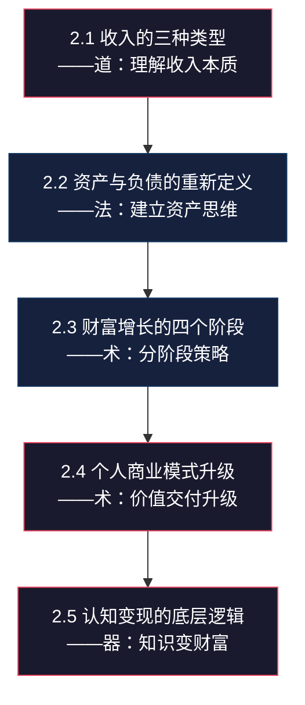

# 第二章：财富增长的底层逻辑
## 章节概览

> "如果你想变得富有，就必须理解金钱是如何运作的。" —— 托马斯·科里《富有的习惯》

第一章帮你建立了正确的金钱观——你知道了金钱的本质、复利的力量、风险与收益的关系。但仅仅"知道"这些还不够。很多人一辈子都在赚钱，却从来不理解**财富是如何增长的**——他们像在跑步机上跑步，拼尽全力却始终在原地。

本章要解决的，是金钱观之上的第二层问题：**财富增长的操作系统**。如果说第一章是"道"——理解金钱是什么，那本章就是"法"——理解财富如何运转。收入有哪些类型，哪种收入结构最健康？资产和负债的真正区别是什么？财富增长会经历哪些阶段，每个阶段该做什么？个人的商业模式如何升级？认知如何变成真金白银？

这些问题的答案，构成了一套完整的**财富增长框架**。掌握了这套框架，你就不会再盲目地"赚钱"，而是有方向、有节奏地构建自己的财富系统。后续所有具体的投资策略、副业方法、理财工具，都建立在本章的基础之上。

---

## 为什么这一章排在第二位

大多数人对财富的理解停留在两个极端：要么觉得"有钱就是王道"，要么觉得"钱不重要"。这两种极端认知在第一章已经被纠偏。但纠偏之后，你需要一套**正向的操作框架**。

想象你在开车：第一章告诉你"靠右行驶、注意安全"（规则），本章告诉你"发动机怎么工作、变速箱怎么挂挡"（机制）。不理解机制的人，即使遵守了所有规则，也只会用一档开到底——永远到不了目的地。

**本章的核心价值在于三个转变：**

1. **从"赚钱"到"构建收入结构"**——不再只关注月收入数字，而是关注收入的来源比例和可持续性
2. **从"存钱"到"积累资产"**——不再只关注银行余额，而是关注资产的现金流属性
3. **从"打工"到"升级个人商业模式"**——不再只关注眼前的工作，而是关注个人价值的交付方式

---

## 本章核心问题

本章围绕五个核心问题展开，每个问题都是财富增长框架的一根支柱：

| # | 核心问题 | 为什么重要 | 本章会给你什么 |
|---|---------|-----------|--------------|
| 1 | 收入有哪些类型？ | 90%的人只有主动收入，一旦失业就断粮。理解三种收入类型，才能建立"收入安全网" | 三种收入的完整对比模型+从主动收入向被动收入过渡的实操路径+不同人生阶段的收入结构优化策略 |
| 2 | 什么是资产？什么是负债？ | 你自以为的"资产"可能正在蚕食你的财富。大多数人分不清生钱资产和耗钱资产 | 现金流视角的资产/负债定义+生钱资产与耗钱资产的对比清单+资产组合构建的四条核心原则 |
| 3 | 财富增长有哪些阶段？ | 不同阶段需要完全不同的策略。在积累期用杠杆期的策略，就像小孩开大车——危险且无效 | 四个财富阶段的详细拆解（0-100万→100-500万→500-1000万→1000万+）+每阶段的核心策略、关键指标和常见陷阱 |
| 4 | 如何升级个人商业模式？ | 你的时间有天花板，但你的产品/服务没有。从卖时间到卖价值的转变，是财富跃迁的关键 | 个人商业模式画布+三种升级路径的详细拆解（卖时间→卖产品→卖系统）+从本地到全球的扩展策略 |
| 5 | 认知如何变现？ | 知道不等于做到，做到不等于赚到。信息差、认知差、执行差的层级关系决定了你能赚什么层次的钱 | 三种"差"的变现模型+从知道到做到的五层鸿沟分析+个人知识体系构建的实操框架 |

---

## 本章结构

本章遵循**道→法→术→器**的递进逻辑：先理解收入的本质（道），再建立资产思维（法），然后掌握各阶段策略（术），最后通过商业模式升级和认知变现落地执行（器）。

### 2.1 收入的三种类型（道：理解收入本质）

> **一句话总结：** 收入不是"赚了多少钱"，而是"你的钱从哪里来、怎么来"——收入结构决定了你的财务健康度。

大多数人只关注"月入多少"，却忽略了收入的来源结构。一个月入3万但只有工资的人，和一个月入2万但有三个收入来源的人，后者的财务状况更健康——因为前者的收入只要失业就归零，后者的收入有安全冗余。

本节会深入拆解三种收入类型，帮你理解从主动收入向被动收入过渡的完整路径：

- **主动收入（用时间换钱）：** 收入 = 单价 × 时间。这是最常见的收入形式，也是最大的"陷阱"——因为你的时间有天花板。本节会分析主动收入的六个典型特征，以及为什么"提高时间单价"只能解一时之渴，不能解长久之困。
- **组合收入（用技能和资源换钱）：** 介于主动和被动之间的"中间态"——你前期投入时间创造产品/服务，之后可以反复销售。在线课程、电子书、设计模板、软件工具都属于这一类。本节会用具体案例展示组合收入的复利效应，以及为什么它是大多数人最应该优先启动的收入类型。
- **被动收入（用资产换钱）：** 真正的"睡后收入"——投资收益、房租、版税、专利费。但被动收入并不"被动"，它需要前期大量的资金积累或系统构建。本节会揭示被动收入的真实面目，打破"不劳而获"的幻想。
- **收入结构优化策略：** 不同人生阶段应该采取什么样的收入组合？从20岁到50岁，你的收入结构应该如何动态调整？

**本节你将获得：**
- 三种收入类型的完整对比框架（特征、优劣势、常见形式、适用人群）
- "时间单价"计算方法及提升路径
- 组合收入的启动清单（从技能到产品的转化步骤）
- 被动收入的七个常见来源及门槛分析
- 不同人生阶段的收入结构优化路线图

### 2.2 资产与负债的重新定义（法：建立资产思维）

> **一句话总结：** 你以为的"资产"可能是负债——判断标准不是"你拥有什么"，而是"它让钱流进来还是流出去"。

传统会计学说房子是资产、车子是折旧资产——这些定义对你个人理财毫无帮助。罗伯特·清崎在《富爸爸穷爸爸》中给出了一个更实用的定义：**资产是能把钱放进你口袋的东西，负债是把钱从你口袋拿走的东西。**

本节会用这个现金流视角重新审视你拥有的每一样东西：

- **生钱资产 vs 耗钱资产：** 同一套房子，自住是耗钱资产（每月流出房贷+物业费），出租且租金覆盖月供就是生钱资产。你的车、你的奢侈品、你的闲置物品——逐一分析它们的真实属性。
- **资产组合的四条核心原则：** 优先购买生钱资产；用生钱资产的收益购买耗钱资产；持续增加生钱资产比例；定期清理或转化耗钱资产。每条原则都配有具体的操作方法。
- **从"拥有很多东西"到"拥有很多现金流"：** 这是富人和中产最大的思维区别。中产追求"拥有"（更大的房子、更好的车），富人追求"现金流"（更多的钱自动流进来）。

**本节你将获得：**
- 生钱资产与耗钱资产的完整分类清单
- 房产/车辆/消费品的现金流分析模板
- 资产组合健康度自测工具
- "先买生钱资产，再买耗钱资产"的实操路径

### 2.3 财富增长的四个阶段（术：分阶段策略）

> **一句话总结：** 财富增长不是线性的，而是阶梯式的——每个阶段需要完全不同的策略，用错策略比不用策略更危险。

财富增长有明确的阶段性特征，就像打游戏有新手村、中级副本、高级副本和终局一样。在新手村用高级装备（杠杆），在高级副本用新手策略（死存钱），都会事倍功半。

本节会详细拆解四个财富阶段，每个阶段都有明确的资产范围、核心目标、关键策略和常见陷阱：

- **积累期（0-100万）：** 核心是"存"和"学"——储蓄率比收益率重要100倍。这个阶段最重要的是建立"存钱系统"和"投资自己"。很多人在这个阶段就开始追求高收益，结果本金都没攒够就亏光了。
- **加速期（100-500万）：** 核心是"配置"和"多元"——资产开始产生可观的复利效应，收入来源需要多元化。这个阶段需要学习真正的投资知识，而不是听消息炒股。
- **杠杆期（500-1000万）：** 核心是"放大"和"团队"——可以合理使用杠杆放大收益，需要建立专业顾问团队。这个阶段的风险管理比收益追求更重要。
- **自由期（1000万+）：** 核心是"守护"和"传承"——被动收入完全覆盖生活开支，关注点从增长转向安全和传承。

**本节你将获得：**
- 四个阶段的详细特征描述和判断标准
- 每个阶段的核心策略清单（5-8条可执行策略）
- 每个阶段的常见陷阱和避坑指南
- 阶段跃迁的关键指标和过渡策略
- 复利效应在不同阶段的实际表现数据

### 2.4 个人商业模式升级（术：价值交付升级）

> **一句话总结：** 你的商业模式决定了你的收入天花板——从卖时间到卖产品到卖系统，每一次升级都是一次收入维度的跃迁。

个人商业模式是你创造和交付价值的方式。大多数人终其一生都在用最低效的模式——卖时间。本节会帮你理解并实践商业模式的三级升级。

- **从卖时间到卖产品/服务：** 核心转变是从"我做什么"到"市场需要什么"，从"一对一服务"到"一对多服务"。一个咨询师一次只能服务一个客户，但一套在线课程可以同时服务一万个学员。
- **从个人贡献者到系统构建者：** 你亲自完成所有工作，收入取决于你的个人能力；你建立一个系统让系统为你工作，收入取决于系统的效率和规模。
- **从本地市场到全球市场：** 互联网打破了地域限制，一个程序员的技能可以在全球范围内变现。
- **个人商业模式画布：** 一个帮助你梳理商业模式的可视化工具，包含关键合作、关键活动、价值主张、客户关系、客户群体、关键资源、渠道、成本结构、收入来源九大模块。

**本节你将获得：**
- 个人商业模式的三级升级路径详解
- "技能→产品→系统"转化的实操步骤
- 个人商业模式画布模板（含填写指南和案例）
- 从本地到全球的扩展策略清单
- 10种常见的个人商业模式类型及适用场景

### 2.5 认知变现的底层逻辑（器：知识变财富）

> **一句话总结：** 赚钱有三种"差"——信息差、认知差、执行差——你处于哪个层级，决定了你能赚什么钱。

这是本章的"收尾"，也是最有深度的一节。它回答一个根本问题：**为什么同样聪明的人，财富差距可以如此巨大？**

- **信息差、认知差、执行差的三层模型：** 信息差是最浅层的——你知道别人不知道的信息（但信息传播越来越快，信息差越来越小）。认知差是中层的——你理解别人不理解的规律（更持久，更难复制）。执行差是最高层——你做到别人做不到的事情（执行力是最稀缺的能力）。
- **从"知道"到"做到"的五层鸿沟：** 知道→理解→认同→行动→坚持，每一层都会淘汰一大批人。很多人停留在"知道"层，以为自己"懂了"，其实连"理解"都没到。
- **构建个人知识体系：** 碎片化的知识毫无价值，只有体系化的知识才能变现。本节会给你一套构建个人知识体系的实操方法。
- **持续学习与迭代：** 查理·芒格说"我这辈子遇到的聪明人，没有不每天阅读的"——持续学习不是鸡汤，而是财富增长的底层燃料。

**本节你将获得：**
- 信息差→认知差→执行差的完整分析框架
- "知道到做到"五层鸿沟的自测工具
- 个人知识体系构建的五步法
- 知识变现的六种常见模式
- 每日学习迭代的最小可行方案

---

## 学习目标

完成本章学习后，你应该能够：

1. **识别并优化你的收入结构** —— 清楚自己目前有哪些收入来源、分别属于哪种类型，并制定从主动收入向组合收入和被动收入过渡的具体计划
2. **用现金流视角审视资产** —— 不再被"拥有"的幻觉迷惑，能准确判断每项资产是"生钱"还是"耗钱"，并开始构建正现金流的资产组合
3. **判断你所在的财富阶段** —— 根据你的资产规模和收入结构，准确定位自己处于积累期、加速期、杠杆期还是自由期，并采取对应阶段的最优策略
4. **设计你的个人商业模式** —— 用商业模式画布梳理你的价值创造和交付方式，找到从"卖时间"升级到"卖产品/服务"的具体路径
5. **理解认知变现的逻辑** —— 认识到信息差、认知差、执行差的层级关系，开始有意识地构建个人知识体系，将认知转化为可量化的财富增长

---

## 关键概念速查表

| 概念 | 定义 | 核心要点 | 详见 |
|------|------|---------|------|
| 主动收入 | 用时间换钱的收入形式 | 收入=单价×时间，停止工作=停止收入，天花板明显 | 2.1 |
| 组合收入 | 用技能和资源换钱的中间态收入 | 前期投入后可持续销售，是大多数人最应优先启动的收入类型 | 2.1 |
| 被动收入 | 用资产换钱的"睡后收入" | 需要前期大量积累，并非不劳而获 | 2.1 |
| 生钱资产 | 能产生正现金流的资产 | 判断标准：是否让钱自动流进你的口袋 | 2.2 |
| 耗钱资产 | 产生负现金流的"资产" | 自住房、自用车、奢侈品等——你以为的资产可能是负债 | 2.2 |
| 现金流思维 | 用流入/流出而非"拥有"来判断资产价值 | 富人和中产最大的思维区别 | 2.2 |
| 财富四阶段 | 积累期→加速期→杠杆期→自由期 | 每个阶段策略完全不同，用错策略比不用更危险 | 2.3 |
| 储蓄率 | 每月储蓄占收入的比例 | 积累期的核心指标，比收益率重要100倍 | 2.3 |
| 个人商业模式 | 个人创造和交付价值的方式 | 从卖时间到卖产品到卖系统，每次升级都是收入维度跃迁 | 2.4 |
| 个人商业模式画布 | 梳理个人商业模式的可视化工具 | 九大模块：关键合作、关键活动、价值主张、客户关系、客户群体、关键资源、渠道、成本、收入 | 2.4 |
| 信息差 | 你知道别人不知道的信息 | 最浅层，传播速度越来越快，差异越来越小 | 2.5 |
| 认知差 | 你理解别人不理解的规律 | 中间层，更持久、更难复制 | 2.5 |
| 执行差 | 你做到别人做不到的事情 | 最高层，执行力是最稀缺的能力 | 2.5 |
| 复利效应 | 利息产生利息的指数级增长 | 在收入、能力、知识三个维度都存在复利效应 | 2.3, 2.5 |

---

## 预计学习时间

| 学习方式 | 时长 | 适合人群 |
|---------|------|---------|
| 快速通读 | 40-60分钟 | 有一定基础，想快速了解框架 |
| 精读+笔记 | 2-3小时 | 想深入理解每个概念和方法 |
| 精读+练习+计算 | 3-4小时 | 想完成所有实操练习、画商业模式画布、计算自己的财富阶段 |
| 分段学习（推荐） | 每天30-40分钟，一周完成 | 时间有限但想真正吸收的上班族 |

> **学习建议：** 不建议一次性读完。本章涉及五个核心主题，信息密度很高。建议分3-4次学习，每次聚焦1-2个小节。重点做两件事：（1）用现金流视角重新审视你目前的资产清单，区分生钱资产和耗钱资产；（2）用商业模式画布梳理你当前的个人商业模式，找到升级的切入点。这两个实操练习产生的行动价值，远大于读完全部理论。

---

## 本章金句

> "资产是能把钱放进你口袋的东西。负债是把钱从你口袋拿走的东西。" —— 罗伯特·清崎《富爸爸穷爸爸》

> "在这个阶段，储蓄率比收益率更重要。"

> "认知差 > 执行差 > 信息差"

> "我这辈子遇到的聪明人，没有不每天阅读的——没有，一个都没有。" —— 查理·芒格

> "财富不是你赚了多少钱，而是你能留住多少钱、让多少钱为你工作。"

> "大多数人终其一生都在用一档开车——他们不是不努力，而是不知道还有二档、三档、四档。"

---

## 适用人群

本章适合：

- **想要理解财富增长规律的人：** 你可能收入不低但总觉得"钱不够用"——本章帮你找到问题的根源：不是赚得少，而是收入结构和资产结构有问题
- **想要从主动收入向被动收入转变的人：** 你已经意识到"用时间换钱"的局限性，但不知道如何开始——本章给你完整的过渡路径
- **想要升级个人商业模式的人：** 你有一技之长但不知道如何"产品化"——本章给你从技能到产品的转化方法
- **处于财富积累期的年轻人（22-35岁）：** 你现在做的每一个财务决策，都会被复利放大10倍、100倍——越早理解本章内容，复利越站在你这边
- **有一定积蓄但不知道如何配置的人：** 你银行里有几十万甚至上百万，但不知道怎么让钱"生钱"——本章帮你建立资产配置的基本框架

---

> **阅读建议：** 建议先通读全文，了解整体框架。然后针对自己的薄弱环节，重点阅读相关部分。完成每节的练习，将知识转化为行动。特别推荐两个实操练习：（1）列出你目前所有的资产，用现金流视角判断每项是生钱资产还是耗钱资产；（2）画一张你当前的个人商业模式画布，找到最需要升级的模块。这两个练习会让你对本章的理解从"知道"跃迁到"理解"。
