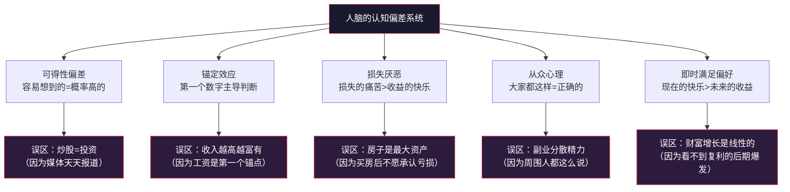
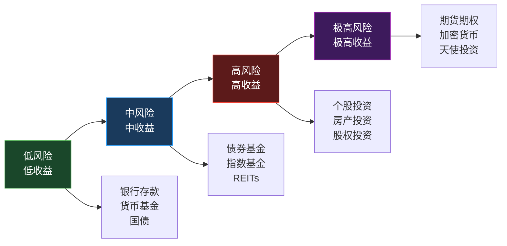
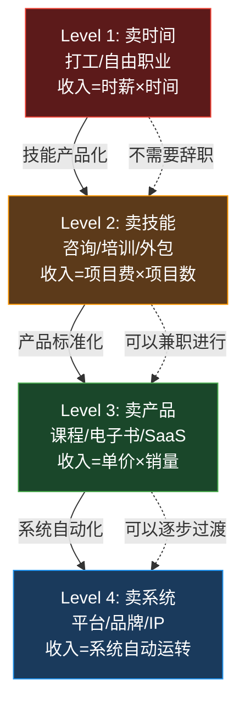
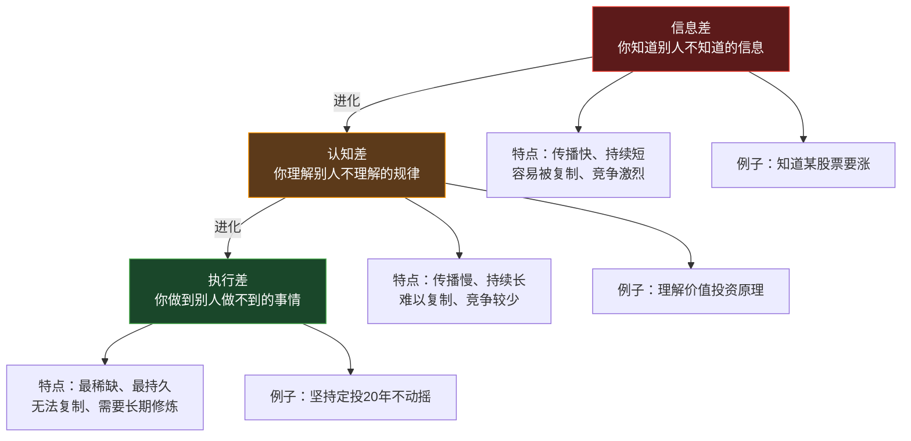
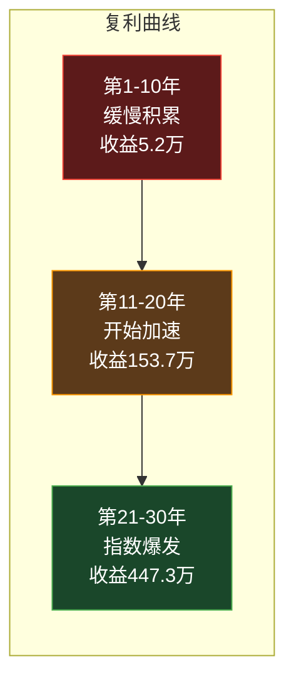
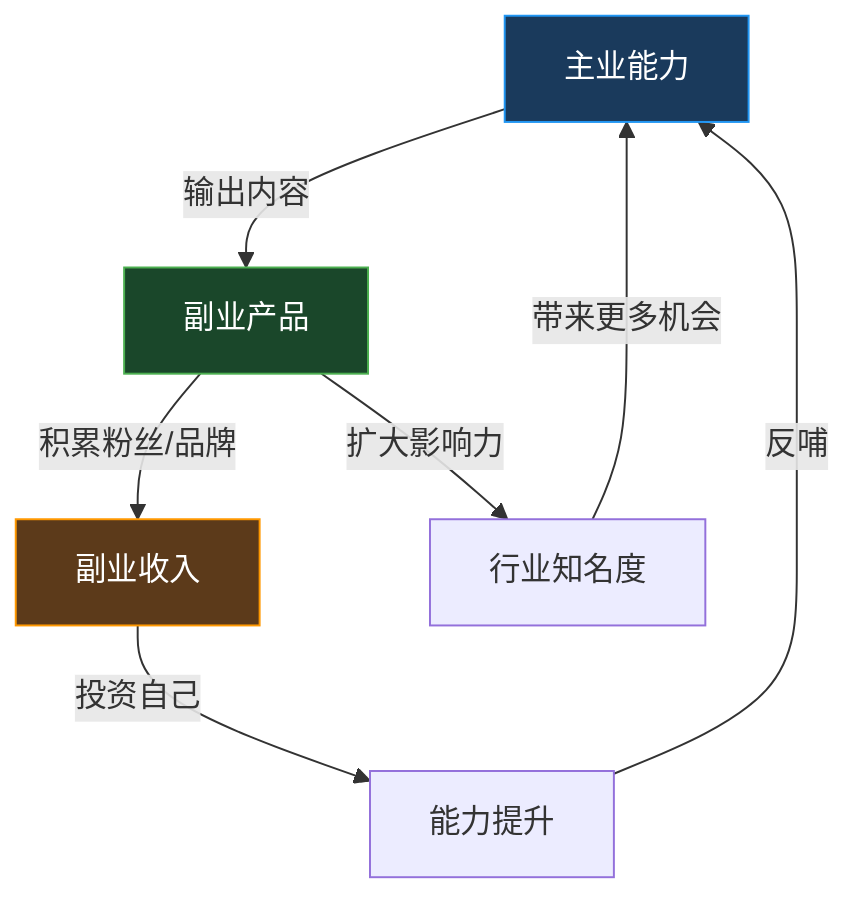
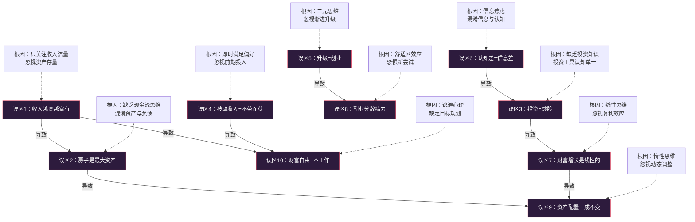

# 第二章：财富增长的底层逻辑 —— 常见误区

> "最危险的不是无知，而是你以为自己知道。" —— 马克·吐温

前面几节我们建立了收入类型、资产定义、财富阶段和商业模式的正确认知框架。但在实际生活中，大多数人并没有按照这些框架行动——不是因为他们没学过，而是因为他们的认知被**根深蒂固的误区**所绑架。

这些误区之所以危险，有三个原因：

1. **它们听起来很合理**——符合直觉、符合日常经验、符合周围人的说法
2. **它们有社会共识**——"买房就是投资""收入高就是成功"是大多数人的默认信念
3. **它们有延迟反馈**——错误的决策不会立刻让你破产，而是在5年、10年后才显现出破坏力

本节将逐一拆解十个最常见的财富认知误区。每个误区都会从**心理学根源**、**真实案例**、**数据验证**和**纠正方法**四个维度展开，帮你从根本上重建正确的财富认知。

---

## 误区的认知心理学根源

在逐个拆解误区之前，先理解一个关键问题：**为什么人脑天生容易陷入财富认知误区？**

行为经济学和认知心理学的研究揭示了几个核心机制：



**丹尼尔·卡尼曼在《思考，快与慢》中指出**：人脑有两套思维系统——系统1（快速、直觉、情绪化）和系统2（缓慢、理性、需要努力）。财富决策大多由系统1驱动，而系统1恰恰是认知偏差的温床。理解这一点，是纠正误区的心理基础。

---

## 误区一：收入越高就越富有

### 误区的普遍性

这是最普遍、最根深蒂固的财富误区。在中国社会语境下，"你月薪多少"几乎是衡量一个人成功与否的第一标准。相亲要看收入，同学聚会要比较收入，甚至父母对孩子的期望也往往以收入数字为锚。

### 心理学根源：锚定效应与可得性偏差

**锚定效应（Anchoring Effect）**：工资单上的数字是你每月见到的第一个"财富数字"，它成为你判断财务状况的锚点。你自然而然地认为：收入高 → 财务好，收入低 → 财务差。

**可得性偏差（Availability Bias）**：媒体和社交网络上充斥着"年薪百万""月入十万"的叙事，这些高收入案例因为频繁出现而被你高估了代表性和重要性。

### 为什么这个误区是错的

**收入是一个流量概念，财富是一个存量概念。** 这两者的区别，就像水龙头的出水量和水池里的水位——水龙头开得再大，如果下面有个洞在漏水，水池永远装不满。

**三个核心事实：**

**事实一：收入高不等于储蓄高**

一个人的财务健康度取决于储蓄率（储蓄 ÷ 收入），而不是收入本身。月入5万但支出4.8万的人，储蓄率只有4%；月入1万但支出5000的人，储蓄率是50%。后者的财务状况远好于前者。

**事实二：储蓄高不等于净资产增长快**

储蓄只是第一步。如果储蓄全部躺在银行活期（年化0.2%），而通货膨胀率是3%，你的净资产实际上在缩水。真正的财富增长需要储蓄转化为**能产生收益的资产**。

**事实三：净资产高不等于财务自由**

财务自由的标准是：**被动收入 ≥ 生活支出**。一个人净资产1000万但全部是自住房产（耗钱资产），他的被动收入可能是零，他仍然需要工作来维持生活。

### 真实案例对比

**案例A：高收入的"月光族"**

张伟，35岁，某互联网公司中层管理者，年薪80万（税后约55万）。他的月度开支：
- 房贷：1.8万（300万房产，贷款210万）
- 车贷：6000元（40万轿车，贷款28万）
- 车辆使用费：3000元（油费+保险+停车）
- 孩子国际学校：1.2万
- 家庭日常开销：8000元
- 应酬社交：5000元
- 奢侈品/消费升级：3000元

月支出合计：5.5万，月收入约4.6万（税后），**入不敷出**，靠年终奖填补缺口。工作10年，净资产约80万（主要是房产首付），银行存款不到10万。

**案例B：中等收入的"隐形富人"**

李芳，33岁，某事业单位职员，年薪15万（税后约12万）。她的月度开支：
- 房贷：3500元（80万房产，贷款56万）
- 日常生活：2500元
- 交通通讯：500元
- 其他：1000元

月支出合计：7500元，月收入约1万，月储蓄2500元，储蓄率25%。此外，她利用周末做翻译兼职，月均额外收入3000元，全部用于定投指数基金。工作8年：
- 房产净值：约30万
- 基金账户：约18万
- 银行存款：5万
- **净资产合计：约53万**

**关键对比**：张伟的收入是李芳的5倍多，但净资产只有她的1.5倍。按目前的储蓄速度，李芳在5年内就能追上张伟的净资产。更关键的是，李芳的基金每年产生约1.5万收益，而张伟的投资收益为零。

### 正确的财富衡量指标

不要只看收入，要看以下三个核心指标：

| 指标 | 计算方式 | 健康标准 | 说明 |
|------|---------|---------|------|
| **储蓄率** | 月储蓄 ÷ 月收入 | ≥ 30% | 衡量你的"留钱能力" |
| **资产收益率** | 年投资收益 ÷ 总资产 | ≥ 5% | 衡量你的"钱生钱能力" |
| **被动收入覆盖率** | 被动收入 ÷ 生活支出 | ≥ 100% | 衡量你的"财务自由度" |

### 纠正方法

1. **建立个人资产负债表**：列出你所有的资产和负债，计算真实净资产。每月更新一次。
2. **计算你的真实储蓄率**：不是"大概存了多少"，而是精确到元的储蓄率。
3. **追踪你的"财富增长速度"**：每月净资产的增长额，这才是你真正的"收入"。
4. **停止用收入衡量自己和他人**：当你看到"年薪百万"的标题时，问自己：这个人的真实储蓄率是多少？他的净资产增长速度是多少？

---

## 误区二：房子是最大的资产

### 误区的普遍性

"买房就是投资"是中国社会最根深蒂固的财富信念之一。在很多家庭看来，房子不仅是居住空间，更是"最大的资产""最安全的投资""留给下一代的财富"。

### 心理学根源：禀赋效应与沉没成本

**禀赋效应（Endowment Effect）**：人们对已经拥有的东西会赋予更高的价值。你买了一套300万的房子，你会下意识地认为它值300万甚至更多，即使市场价已经跌到250万。

**沉没成本谬误**：你已经付了100万首付和50万月供，你不愿意承认这笔投资可能不划算，因为承认就意味着"之前的钱白花了"。

**社会认同**：你父母买房赚了钱，你同事买房赚了钱，你朋友买房赚了钱——"买房=赚钱"成了不容置疑的社会共识。

### 为什么这个误区需要被审视

罗伯特·清崎在《富爸爸穷爸爸》中给出了一个颠覆性定义：**资产是能把钱放进你口袋的东西，负债是把钱从你口袋拿走的东西。**

按照这个定义，你需要重新审视你的房子：

**自住房的现金流分析**（以一线城市300万房产为例）：

| 项目 | 月金额 | 年金额 | 方向 |
|------|--------|--------|------|
| 房贷月供 | 12,000元 | 144,000元 | 流出 |
| 物业费 | 500元 | 6,000元 | 流出 |
| 维修基金/维护 | 200元 | 2,400元 | 流出 |
| 房产税（试点城市） | 约300元 | 3,600元 | 流出 |
| 折旧（按50年） | 5,000元 | 60,000元 | 隐性流出 |
| **月度净现金流出** | **约13,000元** | **约156,000元** | **流出** |

自住房每个月都在**从你口袋里拿钱**——按照清崎的定义，它是**负债**，不是资产。

**出租房的现金流分析**（同一套房子出租）：

| 项目 | 月金额 | 年金额 | 方向 |
|------|--------|--------|------|
| 租金收入 | 8,000元 | 96,000元 | 流入 |
| 房贷月供 | -12,000元 | -144,000元 | 流出 |
| 物业费+维护 | -700元 | -8,400元 | 流出 |
| 空置期损失（按1个月/年） | -8,000元/年 | -8,000元 | 流出 |
| **月度净现金流** | **约-1,500元** | **约-18,000元** | **流出** |

在这个案例中，即使是出租，现金流也是负的。只有当租金收入 > 房贷+维护+空置成本时，出租房才是真正的"生钱资产"。

### 房产投资的真实回报率计算

很多人说"我的房子涨了100万"，但他们没有计算：

1. **首付的机会成本**：100万首付如果投入年化8%的投资组合，10年后的终值是216万
2. **月供的机会成本**：每月多付的月供（相比租金）如果定投指数基金，10年后的累计金额
3. **持有成本**：物业费、维修费、房产税等累计支出
4. **交易成本**：契税、中介费、装修折旧等

**真实案例**：2015年在北京以300万购入一套房产（首付100万，贷款200万），到2025年市值约450万。

```text
表面收益：450万 - 300万 = 150万
但扣除以下成本：
- 10年房贷利息：约80万
- 10年物业费+维护：约8万
- 装修折旧（30万装修，10年）：约20万
- 交易成本（如果出售）：约15万
真实收益：150 - 80 - 8 - 20 - 15 = 27万

对比：100万首付投入沪深300指数基金（2015-2025年化约7%）
10年终值：约197万，收益97万
加上每月节省的月供差额定投，总收益远超房产
```

**注意**：以上是简化计算，实际情况因城市、时间、利率而异。核心观点是：**不要只看房价涨幅，要计算真实的投资回报率。**

### 房产的合理定位

房产不是"不该买"，而是要**分清居住需求和投资需求**：

| 维度 | 自住需求 | 投资需求 |
|------|---------|---------|
| 决策逻辑 | 生活质量、通勤、学区 | 租售比、升值潜力、流动性 |
| 预算上限 | 月供 ≤ 家庭月收入30% | 月供 ≤ 租金收入的80% |
| 时机选择 | 需要时就买，不择时 | 只在租售比合理时买入 |
| 杠杆使用 | 适度杠杆，确保现金流安全 | 精确计算杠杆收益与风险 |
| 心理预期 | 视为消费，不是投资 | 视为投资，严格计算回报率 |

### 纠正方法

1. **用现金流定义资产**：对你的每一项"资产"做现金流分析，流入的是资产，流出的是负债。
2. **计算房产的真实回报率**：包括首付机会成本、利息、持有成本、交易成本。
3. **先买生钱资产，再买耗钱资产**：用投资收益来支付房贷，而不是用工资来付房贷。
4. **租房也是一种选择**：在租售比极高的城市（如北京、上海），租房+投资的组合可能比买房更划算。

---

## 误区三：投资就是炒股

### 误区的普遍性

很多人一提到"投资"，第一反应就是"炒股"。而一提到"炒股"，联想到的就是"追涨杀跌""割韭菜""赌博"。这种等式——投资 = 炒股 = 赌博——让很多人对整个投资领域产生了恐惧和排斥。

### 心理学根源：可得性偏差与以偏概全

**可得性偏差**：媒体对股市暴跌、散户亏损的报道远多于对稳健投资的报道。你脑海中"投资"的记忆样本被极端案例主导——跳楼的股民、亏损的故事、暴涨暴跌的K线图。

**以偏概全（Overgeneralization）**：因为炒股亏了钱，就得出"投资=赌博"的结论，就像因为吃了一家难吃的餐厅就说"所有餐厅都难吃"一样荒谬。

### 投资的完整光谱

投资远不止炒股。按照风险等级和参与门槛，投资工具可以排列成一个完整的光谱：



**各投资工具详解：**

| 投资工具 | 预期年化收益 | 风险等级 | 最低门槛 | 适合人群 | 需要的知识 |
|---------|------------|---------|---------|---------|-----------|
| 银行定期存款 | 1.5-2.5% | 极低 | 50元 | 所有人 | 基础 |
| 货币基金 | 1.5-2.5% | 极低 | 1元 | 所有人 | 基础 |
| 国债 | 2-3% | 极低 | 100元 | 保守型投资者 | 基础 |
| 债券基金 | 3-6% | 低 | 10元 | 稳健型投资者 | 初级 |
| 指数基金（定投） | 6-10% | 中低 | 10元 | 大多数人 | 初级 |
| REITs（不动产信托） | 5-8% | 中 | 1000元 | 对房产有兴趣者 | 中级 |
| 个股投资 | 不确定 | 高 | 约100元 | 有研究能力者 | 高级 |
| 房产投资 | 3-8% | 中高 | 数十万 | 资金充足者 | 中级 |
| 股权投资/天使投资 | 不确定 | 极高 | 数十万 | 高净值人群 | 专家级 |
| 期货期权 | 不确定 | 极高 | 数万 | 专业交易者 | 专家级 |

**关键认知**：大多数人不需要炒股，也不应该炒股。**指数基金定投**是适合绝大多数普通人的投资方式——不需要选股能力，不需要盯盘，长期年化收益6-10%，足以跑赢通胀并实现财富增长。

### 巴菲特的赌局：指数基金 vs 对冲基金

2007年，沃伦·巴菲特与对冲基金Protégé Partners打了一个赌：标普500指数基金 vs 一组对冲基金，赌期10年。

结果（2008-2017）：
- 标普500指数基金：年化收益 **7.1%**，累计收益 **125.8%**
- 对冲基金组合：年化收益 **2.2%**，累计收益 **36.3%**

**指数基金完胜。** 巴菲特总结道："对大多数人来说，低成本的指数基金是最好的投资方式。"

### 纠正方法

1. **把"投资"和"炒股"分开**：炒股只是投资的一种方式，而且不是最好的方式。
2. **从指数基金定投开始**：每月拿出收入的10-30%定投宽基指数基金（如沪深300、中证500），坚持3年以上。
3. **建立投资知识体系**：先读《指数基金投资指南》（银行螺丝钉）、《漫步华尔街》（伯顿·马尔基尔），建立基础知识框架。
4. **远离"炒股群""荐股大师"**：如果你的投资决策依赖于别人的"消息"，那你不是在投资，而是在赌博。

---

## 误区四：被动收入是不劳而获

### 误区的普遍性

"睡后收入""不工作也能赚钱""被动收入实现财富自由"——这类叙事在自媒体上泛滥，给人一种错觉：被动收入是轻松的、免费的、躺着就能赚的。

### 心理学根源：即时满足偏好与幸存者偏差

**即时满足偏好（Present Bias）**：人脑天然偏好"现在就能得到"的东西。"不劳而获"的叙事完美契合了这种偏好——你不需要付出努力，钱就会自动流进来。

**幸存者偏差（Survivorship Bias）**：你只看到了那些"被动收入成功"的案例（自媒体博主晒出的收益截图），却没有看到成千上万尝试过但失败的人。

### 被动收入的真实面貌

**被动收入不是"不劳而获"，而是"先劳后获"。** 它的准确描述是：**前期大量投入，后期持续回报。**

不同类型被动收入的真实投入：

| 被动收入类型 | 前期投入 | 持续维护 | 真实案例 |
|------------|---------|---------|---------|
| 投资收益（股息/利息） | 大量资金积累 + 数年学习 | 定期检视和再平衡 | 攒够100万本金需要5-10年 |
| 房租收入 | 数十万首付 + 装修 + 找租客 | 维修、换租客、处理纠纷 | 前期投入至少50万 |
| 在线课程 | 数百小时内容研发 + 录制 + 推广 | 更新内容、回复学员、处理退款 | 一门高质量课程需要3-6个月开发 |
| 电子书/数字产品 | 数月写作/设计 + 推广 | 更新版本、处理售后 | 一本书需要3-12个月写作 |
| 软件/SaaS产品 | 数月开发 + 持续迭代 | 服务器维护、客户支持、功能更新 | 一个MVP需要3-6个月开发 |
| 自媒体广告收入 | 数月到数年的内容积累 | 持续创作、保持更新 | 达到月入1万通常需要1-2年 |

**关键数据**：根据某在线教育平台统计，平台上超过80%的课程年收入不到5000元。那些晒出"月入十万"截图的，是头部2%的创作者。

### 被动收入的"被动"是相对的

更准确的说法是**"半被动收入"**——前期主动投入，后期需要较少但不可忽略的维护：

- **投资收益**：需要定期再平衡、检视组合、应对市场波动
- **房租收入**：需要处理租客问题、维修、空置期
- **在线课程**：需要更新内容、回复学员提问、处理退款
- **自媒体**：需要持续创作新内容，否则流量会下降

**真正"被动"的收入只有一种：银行存款利息。** 但它的收益率低到几乎可以忽略（年化1-2%）。

### 纠正方法

1. **接受"先劳后获"的现实**：被动收入的"被动"是结果，不是过程。你需要先投入大量的时间、精力或资金。
2. **选择适合你的被动收入类型**：有资金优势的选投资收益，有技能优势的选产品/课程，有时间优势的选内容创作。
3. **设定合理预期**：不要期望一个月就看到回报。大多数被动收入需要6-24个月才能开始产生有意义的收入。
4. **建立多个被动收入来源**：不要把所有希望押在一个来源上。目标是3-5个不同的被动收入来源。

---

## 误区五：商业模式升级就是创业

### 误区的普遍性

很多人一听到"商业模式升级"或"从卖时间到卖产品"，第一反应就是"那我得辞职创业"。这种思维把"商业模式升级"和"创业"画上了等号，制造了不必要的恐惧和门槛。

### 心理学根源：二元思维与灾难化想象

**二元思维（Binary Thinking）**：人脑倾向于把复杂问题简化为"非此即彼"的选择——要么打工，要么创业；要么稳定，要么冒险。

**灾难化想象**：一想到创业，就联想到融资、招人、租办公室、烧钱、失败、负债——这些想象中的风险被大脑放大了10倍。

### 商业模式升级的四级路径

商业模式升级不是"打工 vs 创业"的二选一，而是一个**渐进式的四级升级**：



**每一级升级都不需要辞职：**

**Level 1 → Level 2（卖时间 → 卖技能）**
- 程序员在周末接外包项目
- 设计师在闲鱼卖设计服务
- 翻译在有道翻译做兼职翻译
- **不需要辞职，不需要投入资金，只需要利用业余时间**

**Level 2 → Level 3（卖技能 → 卖产品）**
- 程序员把自己的外包经验写成技术博客，积累粉丝后开付费专栏
- 设计师把自己的设计模板打包成模板包在淘宝/某宝售卖
- 老师把自己的教学方法录制成在线课程
- **不需要辞职，但需要投入较多业余时间（3-6个月）**

**Level 3 → Level 4（卖产品 → 卖系统）**
- 从一个人做课程，到建立讲师团队做教育品牌
- 从卖单个模板，到建立设计模板平台
- 从个人IP，到建立MCN机构
- **这一步通常需要全职投入，但到这一步时，你的产品收入已经可以覆盖生活成本**

### 不辞职也能做的商业模式升级

| 你目前的工作 | 升级方向 | 具体做法 | 启动成本 |
|------------|---------|---------|---------|
| 程序员 | 技术博客→付费专栏→技术课程 | 知乎/掘金写技术文章→开知识星球→出视频课 | 0元 |
| 设计师 | 设计模板→设计课程→设计工具 | 做模板卖千图网→开设计课→开发设计插件 | 0元 |
| 教师 | 教学笔记→在线课程→教育品牌 | 写教学公众号→出网课→建教育IP | 0元 |
| 销售 | 行业分析→咨询→培训 | 写行业分析文章→接咨询→做销售培训 | 0元 |
| 医生 | 科普文章→健康课程→健康管理 | 写医学科普→做健康课程→建健康管理品牌 | 0元 |
| 会计 | 财税知识→财税课程→财税SaaS | 写财税科普→做财税培训→开发财税工具 | 0元 |

### 纠正方法

1. **把"创业"从你的恐惧清单中删除**：商业模式升级 ≠ 创业。大多数升级可以在不辞职、不投入资金的情况下开始。
2. **从最小的升级开始**：不要想着一步到位做平台。先从写一篇技术文章、做一个设计模板、录一节免费课程开始。
3. **利用"100小时法则"**：在业余时间投入100小时做一个最小可行产品（MVP），验证市场需求后再决定是否加大投入。
4. **保持主业的稳定收入**：主业是你的"安全网"。在副业收入稳定超过主业之前，不要辞职。

---

## 误区六：认知差就是信息差

### 误区的普遍性

"信息差赚钱"是近年来的流行叙事。很多人认为，赚钱的关键就是"知道别人不知道的信息"——某个股票要涨、某个行业要火、某个政策要出。于是他们疯狂加群、刷信息流、追热点，以为获取更多信息就能赚更多钱。

### 心理学根源：信息焦虑与控制幻觉

**信息焦虑（Information Anxiety）**：在信息爆炸时代，人们害怕"错过"重要信息（FOMO），于是不断消费信息，但很少消化和内化信息。

**控制幻觉（Illusion of Control）**：获取信息给人一种"我在掌控"的感觉——"我知道了这个消息，我就能做出正确决策"。但信息 ≠ 知识，知识 ≠ 智慧。

### 信息差、认知差、执行差的本质区别

赚钱有三种"差"，它们的层级关系如下：



**三种"差"的详细对比：**

| 维度 | 信息差 | 认知差 | 执行差 |
|------|--------|--------|--------|
| **定义** | 你知道别人不知道的信息 | 你理解别人不理解的规律 | 你做到别人做不到的事情 |
| **持续时间** | 短（天/周/月） | 长（年/十年） | 永久 |
| **复制难度** | 低（信息会传播） | 中（需要深度学习） | 高（需要意志力和习惯） |
| **竞争程度** | 激烈（所有人都在追信息） | 中等（愿意深度思考的人少） | 极低（能做到的人极少） |
| **典型收益** | 一次性收益 | 中期收益 | 长期复利收益 |
| **风险** | 信息可能是假的/过时的 | 理解可能是错的 | 几乎没有（做了就有结果） |
| **例子** | "某公司下周发利好" | "复利效应需要20年才能显现" | "每月定投3000元坚持20年" |

### 为什么信息差越来越不值钱

**信息传播速度在加速**。在互联网时代，一条信息从产生到全民皆知，可能只需要几个小时。你在微信群里看到的"内部消息"，可能已经有100万人看到了。

**更关键的是**：即使你获得了真实的信息差，你还需要：
1. 判断信息的真伪（很多"内部消息"是假的）
2. 判断信息的价值（不是所有真信息都有投资价值）
3. 做出正确的决策（知道信息和做出正确决策是两回事）
4. 执行到位（决策正确但执行不到位也白搭）

**认知差之所以更有价值，是因为它不依赖于特定信息，而是理解底层规律。** 你不需要知道"明天哪只股票涨"，你只需要理解"长期持有优质指数基金的年化收益约8-10%"——这个认知可以让你受益终身。

### 从信息差到认知差的进化路径

1. **停止追逐信息流**：减少刷微信群、微博、抖音的时间。大多数"信息"对你没有价值。
2. **深度阅读经典书籍**：读《聪明的投资者》比追100条股票消息更有价值。
3. **建立个人知识体系**：把零散的信息整合成系统化的认知框架。
4. **用输出倒逼输入**：写文章、做分享、教别人——输出是最高效的学习方式。
5. **在实践中验证认知**：把你的认知用小额资金验证，看它是否真的有效。

### 纠正方法

1. **区分"信息消费"和"知识生产"**：每天花在"消费信息"上的时间不应超过1小时，花在"生产知识"上的时间不应少于1小时。
2. **投资认知差而非信息差**：读10本经典投资书籍，比追1000条财经消息更有价值。
3. **把认知转化为行动**：认知差的价值在于行动。如果你理解了复利的力量但没有开始定投，你的认知差就是零。
4. **接受认知差的慢回报**：认知差不像信息差那样"今天知道明天赚钱"，它需要数年才能显现出价值。但一旦显现，回报是指数级的。

---

## 误区七：财富增长是线性的

### 误区的普遍性

大多数人对财富增长的心理模型是线性的："我今年存了5万，明年存5万，后年存5万，10年后我就有50万了。"这种线性思维导致两个问题：一是对前期的缓慢增长感到焦虑和绝望，二是对后期的加速增长完全没有准备。

### 心理学根源：线性思维与当下偏差

**线性思维（Linear Thinking）**：人脑天然倾向于用线性关系来预测未来——过去5年每年增长10%，未来也会每年增长10%。但复利是非线性的。

**当下偏差（Present Bias）**：人脑对"现在"的感知权重远高于"未来"。每月存3000元在当下感觉"没什么用"，因为你看不到30年后的680万。

### 复利的数学真相

复利的公式是：**终值 = 本金 × (1 + 收益率)^年数**

这个公式的数学特性决定了：**前期慢，后期快，最终呈指数级爆发。**

**具体数据**：每月定投3000元，年化收益10%

| 年限 | 累计投入 | 账户终值 | 收益金额 | 收益倍数 |
|------|---------|---------|---------|---------|
| 5年 | 18万 | 23.2万 | 5.2万 | 0.29倍 |
| 10年 | 36万 | 61.8万 | 25.8万 | 0.72倍 |
| 15年 | 54万 | 126.3万 | 72.3万 | 1.34倍 |
| 20年 | 72万 | 230.9万 | 158.9万 | 2.21倍 |
| 25年 | 90万 | 417.1万 | 327.1万 | 3.63倍 |
| 30年 | 108万 | 678.2万 | 570.2万 | 5.28倍 |

**关键观察**：
- 前10年（投入36万）只积累了61.8万
- 后10年（第20-30年，投入36万）却积累了 **447.3万**（678.2 - 230.9）
- **同样的投入金额，后10年的收益是前10年的12.5倍**



### 巴菲特的财富增长曲线

巴菲特的财富增长是复利效应的最佳例证：

| 年龄 | 净资产 | 关键事件 |
|------|--------|---------|
| 21岁 | 2万美元 | 开始投资 |
| 30岁 | 100万美元 | 成立合伙基金 |
| 40岁 | 2,500万美元 | 合伙基金规模扩大 |
| 50岁 | 3.76亿美元 | 收购伯克希尔 |
| 60岁 | 38亿美元 | 可口可乐投资 |
| 70岁 | 360亿美元 | 成为世界首富 |
| 90岁+ | 1,000亿美元+ | 持续增长 |

**关键数据**：巴菲特99%的财富是在50岁之后赚到的。他在21岁到50岁之间积累了3.76亿美元——这已经是巨额财富，但只占他最终财富的不到4%。

**启示**：复利需要**时间**。前30年的积累看起来"没什么了不起"，但正是这30年的积累为后30年的爆发奠定了基础。

### 为什么大多数人等不到复利爆发

1. **第1-3年**：投入了一点钱，收益很少，感觉"没什么用"——放弃
2. **第3-5年**：遇到一次市场大跌，账户亏损20-30%，恐慌卖出——放弃
3. **第5-10年**：看到别人炒币/炒房赚了快钱，觉得自己"太慢了"——转投
4. **第10年+**：真正坚持下来的人开始看到复利的威力——但只有不到5%的人能走到这一步

### 纠正方法

1. **理解复利的数学原理**：不是"大概知道"，而是亲自用Excel计算一遍。当你看到30年后的数字时，你的认知会发生质变。
2. **尽早开始**：复利最大的敌人不是低收益率，而是**晚开始**。晚开始10年，最终收益可能差3-5倍。
3. **设定自动投资**：把定投设置为自动扣款，不要给自己"要不要继续投"的选择机会。
4. **远离短期噪音**：不要每天看账户收益。每月看一次就够了。复利是以"年"为单位计算的，不是以"天"。

---

## 误区八：副业会分散精力

### 误区的普遍性

"做好本职工作就行了""副业会影响主业""精力有限，不如专注一件事"——这些说法听起来很有道理，也确实适用于某些情况。但如果把它当作普遍真理，你会错失收入多元化的机会。

### 心理学根源：确认偏误与舒适区效应

**确认偏误（Confirmation Bias）**：如果你已经决定"不做副业"，你会自动关注那些"副业失败"的案例来强化自己的决定，而忽略那些"副业成功"的案例。

**舒适区效应**：做主业已经很累了，下班后最想做的就是休息。"副业分散精力"给了你一个完美的借口来留在舒适区。

### 好副业 vs 坏副业的关键区别

**坏副业的特征**（确实会分散精力）：
- 与主业完全无关（程序员去送外卖）
- 纯粹出卖额外时间（开滴滴、做家教）
- 没有积累效应（每次都要从零开始）
- 收益上限很低（时薪与主业差不多或更低）

**好副业的特征**（能与主业互相促进）：
- 与主业技能相关（程序员做技术博客）
- 有积累效应（内容/产品/品牌可以持续产生价值）
- 能提升主业能力（写作提升表达能力，教学加深理解）
- 收益上限很高（可以远超主业收入）

### 好副业的协同效应模型



**协同效应的具体表现：**

| 你的主业 | 好副业选择 | 协同效应 |
|---------|----------|---------|
| 程序员 | 技术博客/开源项目/技术课程 | 提升技术深度 + 扩大行业影响力 + 潜在跳槽/创业机会 |
| 设计师 | 设计模板/设计教程/UI Kit | 提升设计能力 + 积累作品集 + 被动收入 |
| 产品经理 | 产品分析文章/产品课程/咨询 | 深化产品思维 + 行业人脉 + 咨询收入 |
| 教师 | 在线课程/教辅材料/教育咨询 | 教学能力提升 + 学生覆盖扩大 + 品牌效应 |
| 医生 | 医学科普/健康管理课程 | 患者教育 + 专业影响力 + 知识变现 |
| 销售 | 销售培训/行业分析/人脉撮合 | 销售方法论沉淀 + 行业影响力 + 多重收入 |

### 副业时间管理的实操框架

**每周投入10-15小时做副业，具体分配：**

| 时间段 | 时长 | 内容 |
|--------|------|------|
| 工作日早晨（6:00-7:00） | 5小时/周 | 内容创作/产品开发 |
| 周末上午（9:00-12:00） | 6小时/周 | 深度工作/项目推进 |
| 碎片时间 | 2-3小时/周 | 素材收集/互动回复 |

**关键原则**：
1. **副业时间要固定**：不是"有空就做"，而是"每周二四六早6点做"。
2. **副业不能侵占睡眠**：睡眠不足会导致主业和副业同时质量下降。
3. **副业要有里程碑**：不是漫无目的地做，而是设定明确的阶段目标（如"3个月内发布第一门课程"）。

### 纠正方法

1. **不要笼统地说"副业分散精力"**：先区分是"好副业"还是"坏副业"。好副业不仅不分散精力，还能反哺主业。
2. **从最小的副业开始**：不需要辞职，不需要投入资金。从写一篇文章、做一个模板、录一节免费课开始。
3. **设定副业的"止损线"**：如果副业连续3个月没有正向进展，或者明显影响了主业表现，及时调整或暂停。
4. **用副业验证你的"第二曲线"**：副业是你探索"第二曲线"的低成本方式。如果副业发展得好，它可能成为你未来的主业。

---

## 误区九：资产配置是一成不变的

### 误区的普遍性

很多人在做了一次资产配置之后就"设置并忘记"——买了基金就再也不看，配了股票就再也不调。他们认为"长期投资就是买了不动"。

### 心理学根源：惰性与过度简化

**惰性（Status Quo Bias）**：人脑倾向于维持现状，因为改变需要消耗认知能量。"反正已经配好了，就别动了"是最省力的选择。

**过度简化**：把"长期投资"简单理解为"买了不动"，忽略了资产配置需要根据市场环境、人生阶段和财务目标动态调整的复杂性。

### 为什么资产配置需要动态调整

**原因一：市场环境在变化**

不同的经济周期需要不同的资产配置：

| 经济周期 | 特征 | 适合的资产 | 不适合的资产 |
|---------|------|----------|------------|
| 复苏期 | GDP增长、利率低、通胀温和 | 股票、房产 | 现金、短期债券 |
| 过热期 | GDP高增长、利率上升、通胀上升 | 大宗商品、通胀保值债券 | 长期债券 |
| 滞胀期 | GDP下降、利率高、通胀高 | 现金、短期债券 | 股票、房产 |
| 衰退期 | GDP下降、利率下降、通胀下降 | 长期债券、防御型股票 | 大宗商品、高风险资产 |

**原因二：你的人生阶段在变化**

年龄和财务状况的变化要求不同的风险配置：

| 人生阶段 | 年龄 | 风险承受能力 | 推荐配置 |
|---------|------|------------|---------|
| 积累期 | 25-35岁 | 高 | 股票70% + 债券20% + 现金10% |
| 发展期 | 35-45岁 | 中高 | 股票50% + 债券30% + 另类10% + 现金10% |
| 保全期 | 45-55岁 | 中 | 股票30% + 债券40% + 另类15% + 现金15% |
| 传承期 | 55岁+ | 低 | 股票20% + 债券50% + 现金20% + 另类10% |

**原因三：你的财务目标在变化**

25岁时你的目标可能是"10年后买房"，35岁时可能是"孩子教育金"，45岁时可能是"退休规划"。不同的目标对应不同的投资期限和风险承受能力。

### 动态再平衡的实操方法

**方法一：定期再平衡（推荐大多数人）**

每半年或每年检视一次资产配置，偏离目标比例超过5%时进行调整。

```text
示例：目标配置 股票60% + 债券30% + 现金10%
半年后：股票涨到70%，债券跌到22%，现金8%
操作：卖出部分股票，买入债券和现金类资产，恢复60/30/10
```

**方法二：阈值再平衡**

当任何一类资产偏离目标比例超过10%时，立即调整。

**方法三：生命周期基金（最省心）**

选择目标日期基金（如"2050退休基金"），基金会自动随时间推移调整股债比例。

### 纠正方法

1. **设定固定的资产检视时间**：每半年花1-2小时检视你的资产配置。
2. **使用再平衡策略**：不要凭感觉调整，而是按照预设的规则执行。
3. **不要过度调整**：再平衡不是"择时"，不要因为市场短期波动就频繁买卖。一年调整1-2次就够了。
4. **根据人生阶段调整风险偏好**：年轻时可以承受更高风险，年长时应该降低风险。这不是"保守"，而是"理性"。

---

## 误区十：财富自由就是不工作

### 误区的普遍性

"等我财富自由了，我就天天躺着""财富自由 = 不用上班""财富自由 = 想买什么就买什么"——这是大多数人对财富自由的想象。这种想象不仅错误，而且有害——它让财富自由变成了一个"遥不可及的幻想"，而不是一个"可以规划的目标"。

### 心理学根源：逃避心理与非黑即白思维

**逃避心理**：很多人追求财富自由，本质上是在逃避工作中不愉快的部分（加班、压力、不喜欢的上司）。他们把财富自由当成了"解脱"。

**非黑即白思维**：要么工作，要么不工作。没有中间状态。但真实的财富自由是一个**连续光谱**，不是一个二元开关。

### 财富自由的准确定义

**财富自由 = 被动收入 ≥ 生活支出**

这个定义有三个关键点：

1. **被动收入**：不需要你投入时间就能获得的收入（投资收益、房租、版税等）
2. **生活支出**：你选择的生活方式所需的全部开支
3. **≥**：被动收入至少等于生活支出，最好大于

**这意味着**：
- 如果你的月生活支出是5000元，被动收入达到5000元时你就已经财富自由了
- 如果你的月生活支出是5万元，你需要更高的被动收入才能达到财富自由
- **财富自由的门槛取决于你的生活方式，而不是你的"欲望"**

### 财富自由的五个层级

财富自由不是一个终点，而是一个有层级的连续体：

| 层级 | 名称 | 定义 | 你可以做什么 |
|------|------|------|------------|
| 1 | 基础自由 | 被动收入覆盖基本生活 | 可以选择不工作，但生活较朴素 |
| 2 | 舒适自由 | 被动收入覆盖舒适生活 | 可以选择喜欢的工作，不必为钱工作 |
| 3 | 安全自由 | 被动收入覆盖生活+应急 | 可以承受失业/疾病等风险 |
| 4 | 品质自由 | 被动收入覆盖高品质生活 | 可以选择任何生活方式 |
| 5 | 终极自由 | 被动收入远超任何需求 | 可以做任何想做的事，包括慈善 |

### 财富自由后人们在做什么

**研究发现**：达到财富自由的人，大多数并没有"天天躺着"。他们的共同特征是：

1. **继续工作，但方式变了**：从"为钱工作"变成"为热爱工作"、"为意义工作"、"为影响力工作"
2. **工作时间反而增加了**：因为做的是自己真正热爱的事，所以投入更多时间
3. **生活满意度更高**：不是因为"不用工作"，而是因为"可以选择做什么工作"

**真实案例**：
- **巴菲特**：90多岁了，每天仍然阅读5-6小时，管理投资。他不是为了钱而工作，而是因为热爱投资这件事。
- **比尔·盖茨**：从微软退休后，全职做慈善。他的工作时间不比在微软时少。
- **很多普通退休者**：退休后反而更忙——做志愿者、学画画、旅行、写书。

### 正确的财富自由规划

**第一步：定义你的"自由数字"**

```text
月生活支出 × 12 = 年生活支出
年生活支出 ÷ 4%（安全提取率）= 你需要的总资产

示例：
月支出1万 → 年支出12万 → 需要300万资产
月支出2万 → 年支出24万 → 需要600万资产
月支出3万 → 年支出36万 → 需要900万资产
```

**4%法则**：这是来自美国"三一研究"的安全提取率——如果你每年从投资组合中提取不超过4%的金额，你的本金大概率可以永续使用（基于历史回测）。

**第二步：规划你的"自由路径"**

```text
当前净资产 + 每年储蓄 × (1+收益率)^年数 = 目标资产

示例：
当前净资产30万，每年储蓄10万，年化收益8%
目标：300万
需要约15年
```

**第三步：思考财富自由后你想做什么**

这个问题比"如何达到财富自由"更重要。如果你不知道财富自由后要做什么，你很可能在达到之后感到空虚和迷茫。

### 纠正方法

1. **重新定义财富自由**：财富自由不是"不工作"，而是"可以选择做什么工作"。
2. **计算你的"自由数字"**：知道你需要多少钱才能实现财富自由，让它从一个模糊的幻想变成一个具体的目标。
3. **降低你的"自由门槛"**：不是赚更多钱，而是降低生活支出。月支出从3万降到1.5万，你的"自由数字"就从900万降到450万。
4. **现在就开始做你想做的事**：不要等到财富自由后才去追求热爱。如果你现在就想写作、旅行、做公益，现在就开始——也许方式不同，但方向是对的。

---

## 十大误区的关联图谱

这十个误区不是孤立存在的，它们之间存在深层的关联。理解这些关联，有助于你从整体上重建财富认知：



---

## 自我诊断：你陷入了几个误区？

回答以下10个问题，每个"是"计1分：

| # | 问题 | 误区对应 |
|---|------|---------|
| 1 | 你是否主要用收入水平来衡量自己或他人的财务状况？ | 误区1 |
| 2 | 你是否认为自住房是你最大的"投资"？ | 误区2 |
| 3 | 你是否认为投资就是炒股，或者觉得投资太危险不想碰？ | 误区3 |
| 4 | 你是否期望找到一种"不用努力就能赚钱"的方式？ | 误区4 |
| 5 | 你是否认为做副业或商业模式升级就必须辞职创业？ | 误区5 |
| 6 | 你是否花大量时间刷财经消息、追热点，但很少深度阅读？ | 误区6 |
| 7 | 你是否觉得"每月存几千块没什么用"？ | 误区7 |
| 8 | 你是否用"副业分散精力"来回避尝试新的收入方式？ | 误区8 |
| 9 | 你是否自从做了资产配置后就再也没检视过？ | 误区9 |
| 10 | 你是否把财富自由想象成"天天躺着不工作"？ | 误区10 |

**评分解读：**

| 得分 | 诊断 | 建议 |
|------|------|------|
| 0-2分 | 你的财富认知框架比较健康 | 继续深化，关注实操执行 |
| 3-4分 | 存在一些认知偏差，但不严重 | 针对性地修正得分项对应的误区 |
| 5-6分 | 认知偏差较为明显，正在影响你的财务决策 | 建议系统学习本章内容，重建认知框架 |
| 7分以上 | 认知偏差严重，需要根本性的认知重建 | 建议从头阅读本章，并开始执行纠正方法 |

---

## 总结：从误区到正确认知

### 核心对照表

| # | 常见误区 | 正确认知 | 关键行动 |
|---|---------|---------|---------|
| 1 | 收入越高就越富有 | 净资产增长速度决定财富 | 建立个人资产负债表，追踪储蓄率 |
| 2 | 房子是最大的资产 | 能产生正现金流的才是资产 | 用现金流视角审视每一项"资产" |
| 3 | 投资就是炒股 | 投资是完整的工具光谱 | 从指数基金定投开始 |
| 4 | 被动收入是不劳而获 | 被动收入是"先劳后获" | 设定合理预期，选择适合的类型 |
| 5 | 商业模式升级就是创业 | 升级是渐进的四级路径 | 从最小的升级开始，不辞职 |
| 6 | 认知差就是信息差 | 认知差比信息差更有价值 | 减少信息消费，增加知识生产 |
| 7 | 财富增长是线性的 | 财富增长是指数级的 | 尽早开始，设定自动投资 |
| 8 | 副业会分散精力 | 好副业与主业互相促进 | 选择有协同效应的副业 |
| 9 | 资产配置一成不变 | 配置需要动态再平衡 | 每半年检视一次资产配置 |
| 10 | 财富自由就是不工作 | 财富自由是拥有选择权 | 计算你的"自由数字"并规划路径 |

### 三层认知重建框架

纠正误区不是"知道正确答案"就够了，你需要在三个层面重建认知：

**第一层：知识层（知道）**—— 读完本节，你已经知道了十个误区和对应的正确认知。

**第二层：理解层（理解）**—— 不只是记住结论，而是理解每个误区的心理学根源、数学原理和真实案例。这需要反复阅读和思考。

**第三层：行动层（做到）**—— 把正确认知转化为具体行动。这是最难的一步，也是最有价值的一步。

> **查理·芒格说**："我这辈子遇到的聪明人，没有不每天阅读的——没有，一个都没有。" 纠正误区的最好方式，不是"想通了"就行，而是**持续学习、持续行动、持续迭代**。

---

> **下一步行动**：完成本节的自我诊断后，如果你得分在3分以上，建议针对得分最高的误区，阅读对应的理论基础章节，深入理解底层逻辑。然后制定一个为期30天的"认知纠偏计划"——每周聚焦一个误区，从知识到理解到行动，逐步重建你的财富认知体系。
