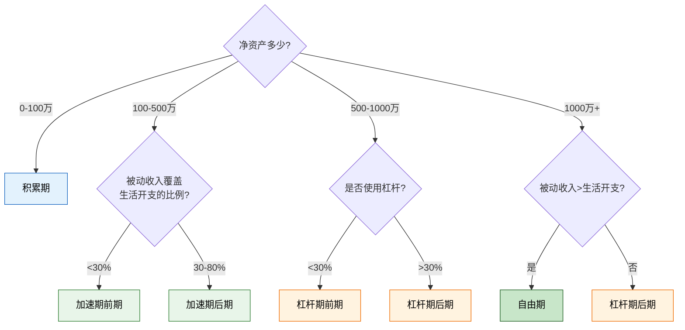
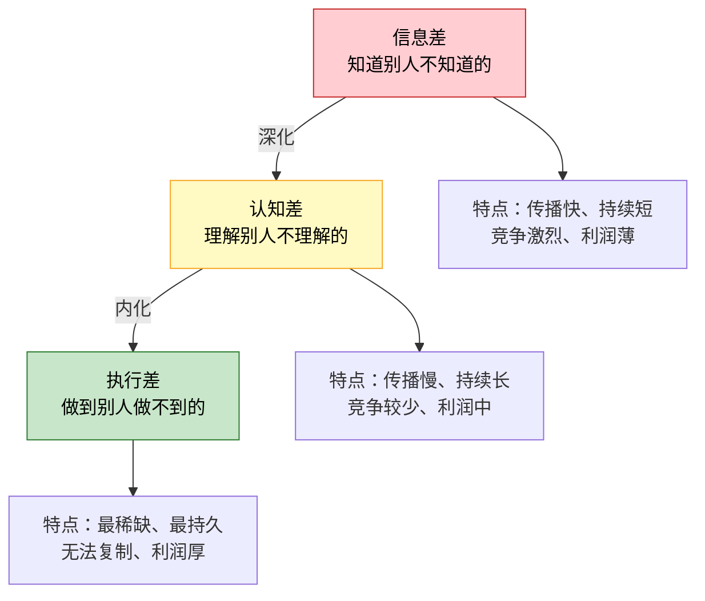

# 第二章：财富增长的底层逻辑 —— 练习方法

> "知识的价值不在于知道，而在于做到。" —— 彼得·德鲁克

前面的理论、技巧和案例帮你建立了财富增长的认知框架。但认知和行动之间有一条鸿沟——大多数人读完一本理财书，觉得自己"都懂了"，然后继续用原来的方式过日子。这条鸿沟不会自动消失，只有通过**刻意练习**才能跨越。

本节提供七套实操练习，覆盖第二章的全部核心知识点。每套练习都不是简单的填空题，而是**完整的思考-分析-决策框架**——你需要用真实数据、真实场景来完成它，而不是凭感觉随便填。

---

## 练习前的准备工作

在开始之前，花 10 分钟做好以下准备，能让你的练习效果提升 3 倍：

### 需要准备的资料

| 资料 | 用途 | 获取方式 |
|------|------|---------|
| 最近 3 个月银行流水 | 练习一、练习二 | 手机银行 App 导出 |
| 所有投资账户截图/报表 | 练习二 | 券商 App / 基金 App |
| 房贷/车贷合同或还款计划 | 练习二 | 银行 App 或纸质合同 |
| 最近一个月的详细记账 | 练习一 | 记账 App 导出，或手工记录 |
| 社保/公积金缴纳明细 | 练习二 | 社保 App 或工资条 |

### 练习心态

- **诚实第一**：对自己诚实比填出好看的数字重要 100 倍。这个练习只有你自己看，不用给任何人交差。
- **精确到元**：不要写"大概几万"，精确数字才能暴露问题。
- **接受不舒服**：如果填完之后你感到焦虑或不安，说明练习起作用了——这才是你的真实起点。

---

## 练习一：收入类型分析

### 为什么要练这个

90% 的人只有主动收入——一旦停止工作，收入立刻归零。这个练习帮你**用数据看清自己的收入结构**，找到从"用时间换钱"到"让钱/技能/资产替你赚钱"的突破口。

### 核心理论回顾

收入分三种类型：
- **主动收入**：收入 = 单价 × 时间。你投入 1 小时就赚 1 小时的钱，停下来就没了。
- **组合收入**：前期投入时间创造产品/服务，之后可以反复销售。如在线课程、电子书、设计模板。
- **被动收入**：资产自动产生的收入。如投资分红、房租、版税。

> 详见本章 2.1 节。关键公式：时间价值 = 年收入 ÷ 年工作小时数。

### Step 1：列出所有收入来源

把你最近 12 个月的**实际收入**（不是期望收入）列出来：

| 序号 | 收入来源 | 月均金额（元） | 年收入（元） | 类型 |
|------|---------|-------------|-----------|------|
| 1 | 主业工资（税后） | ___ | ___ | 主动收入 |
| 2 | 年终奖/绩效奖金（月均摊） | ___ | ___ | 主动收入 |
| 3 | 副业收入 | ___ | ___ | ___ |
| 4 | 投资收益（股息/利息/分红） | ___ | ___ | 被动收入 |
| 5 | 房租收入 | ___ | ___ | 被动收入 |
| 6 | 课程/电子书/模板等产品收入 | ___ | ___ | 组合收入 |
| 7 | 其他收入 | ___ | ___ | ___ |
| **合计** | | **___** | **___** | |

**填写指南**：

1. **主动收入**包括：工资、奖金、加班费、按小时/项目计费的自由职业收入、按劳取酬的兼职。
2. **组合收入**包括：你**创建一次、可反复销售**的产品或服务收入——在线课程、电子书、设计模板、软件工具、付费专栏、知识星球等。判断标准：你睡觉的时候它还能产生收入吗？如果能，就是组合收入。
3. **被动收入**包括：投资分红、利息、房租、版税、专利授权费等。判断标准：你完全不参与（不更新、不维护）它还能持续吗？如果能，就是被动收入。

**常见分类困惑**：

| 收入来源 | 分类 | 理由 |
|---------|------|------|
| 自由职业按项目接单 | 主动收入 | 每个项目都需要你投入时间 |
| 网店卖自己设计的模板 | 组合收入 | 设计一次，反复销售 |
| 网店需要每天发货的实物 | 主动收入 | 需要持续投入时间运营 |
| 基金定投的分红 | 被动收入 | 资金自动运作 |
| 知识星球/付费社群 | 组合收入（但需维护） | 需要定期更新内容维持价值 |
| 写了一本书的版税 | 被动收入 | 出版后基本不需要维护 |

### Step 2：计算各类型收入占比

```text
主动收入占比 = (主动收入合计 ÷ 总收入) × 100%
组合收入占比 = (组合收入合计 ÷ 总收入) × 100%
被动收入占比 = (被动收入合计 ÷ 总收入) × 100%
```

**示例**：

小李，28 岁，程序员。月工资 2 万，年终奖月均 5000 元，业余做技术博客每月广告收入约 800 元，基金分红年均 3000 元（月均 250 元）。

```text
主动收入：20000 + 5000 = 25000 元/月
组合收入：800 元/月
被动收入：250 元/月
总收入：26050 元/月

主动收入占比 = 25000 ÷ 26050 × 100% = 96.0%
组合收入占比 = 800 ÷ 26050 × 100% = 3.1%
被动收入占比 = 250 ÷ 26050 × 100% = 1.0%
```

### Step 3：分析你的收入结构

填完数据后，对照以下标准评估：

| 你的主动收入占比 | 结构评价 | 核心风险 |
|---------------|---------|---------|
| > 90% | 极度危险——"单腿走路" | 失业即断粮，没有任何缓冲 |
| 70-90% | 高度依赖——"独轮车" | 主业出问题则财务立刻紧张 |
| 50-70% | 初步多元化——"两轮车" | 有一定安全垫，但仍需继续优化 |
| 30-50% | 较健康——"三轮车" | 收入来源多元，抗风险能力强 |
| < 30% | 接近自由——"四轮车" | 被动/组合收入已成主力 |

**关键问题清单**（逐一回答）：

1. 如果你明天失业，你的非主动收入能支撑你多久的生活？
   - 计算：非主动收入 ÷ 月生活开支 = ___ 个月

2. 你的收入来源有几个？（3 个以上为佳）
   - 数量：___

3. 哪个收入来源在增长？哪个在萎缩？
   - 增长中：___
   - 萎缩中：___

4. 你的"时间单价"是多少？
   - 计算：年收入 ÷ 年工作小时数 = ___ 元/小时

### Step 4：制定 90 天优化计划

| 优化方向 | 具体行动 | 目标 | 截止日期 |
|---------|---------|------|---------|
| 提升主动收入 | ___ | 月增 ___ 元 | ___ |
| 建立/扩大组合收入 | ___ | 月收入达 ___ 元 | ___ |
| 建立/扩大被动收入 | ___ | 月收入达 ___ 元 | ___ |
| 砍掉低效收入 | ___ | 节省 ___ 小时/月 | ___ |

**90 天后重新做这个练习**，对比前后数据。这是检验你是否在进步的最直接方式。

---

## 练习二：资产盘点与现金流诊断

### 为什么要练这个

大多数人觉得自己"没什么资产"，或者把自住房、自用车当成"大资产"——这两种认知都是错的。这个练习帮你**用现金流视角**重新审视你拥有的一切，区分"生钱资产"和"耗钱资产"。

### 核心理论回顾

> 资产是能把钱放进你口袋的东西，负债是把钱从你口袋拿走的东西。 —— 罗伯特·清崎《富爸爸穷爸爸》

按照现金流方向，资产分三类：
- **生钱资产**：每月净现金流 > 0（持续往你口袋里放钱）
- **耗钱资产**：每月净现金流 < 0（持续从你口袋里掏钱）
- **中性资产**：每月净现金流 ≈ 0（不进不出，如活期存款）

> 详见本章 2.2 节。

### Step 1：列出所有资产和负债

#### 资产清单

| 序号 | 类别 | 具体项目 | 当前市值（元） | 月现金流入（元） | 月现金流出（元） | 月净现金流（元） |
|------|------|---------|-------------|-------------|-------------|-------------|
| 1 | 现金类 | 活期存款 | ___ | ___ | 0 | ___ |
| 2 | 现金类 | 定期存款/大额存单 | ___ | ___ | 0 | ___ |
| 3 | 现金类 | 货币基金 | ___ | ___ | 0 | ___ |
| 4 | 投资类 | 股票/ETF | ___ | ___ | 0 | ___ |
| 5 | 投资类 | 基金（非货币） | ___ | ___ | 0 | ___ |
| 6 | 投资类 | 债券/理财产品 | ___ | ___ | 0 | ___ |
| 7 | 投资类 | 数字货币 | ___ | ___ | 0 | ___ |
| 8 | 房产类 | 自住房产 | ___ | 0 | ___ | ___ |
| 9 | 房产类 | 出租房产 | ___ | ___ | ___ | ___ |
| 10 | 车辆类 | 自用车辆 | ___ | 0 | ___ | ___ |
| 11 | 其他 | ___ | ___ | ___ | ___ | ___ |
| **合计** | | | **___** | **___** | **___** | **___** |

#### 负债清单

| 序号 | 类型 | 剩余本金（元） | 月还款额（元） | 年利率 | 还清日期 |
|------|------|-------------|-------------|-------|---------|
| 1 | 房贷 | ___ | ___ | ___% | ___ |
| 2 | 车贷 | ___ | ___ | ___% | ___ |
| 3 | 信用卡分期 | ___ | ___ | ___% | ___ |
| 4 | 消费贷/网贷 | ___ | ___ | ___% | ___ |
| 5 | 亲友借款 | ___ | ___ | 0% | ___ |
| **合计** | | **___** | **___** | | |

**净资产 = 资产合计 - 负债合计 = ___ 元**

### Step 2：判断每项资产的类型

对每一项资产，问自己一个问题：**这项资产每个月让我口袋里的钱增加了还是减少了？**

| 资产项目 | 月净现金流 | 类型 | 判断依据 |
|---------|---------|------|---------|
| 自住房产 | -12000（房贷+物业） | 耗钱资产 | 每月流出 12000 元 |
| 出租房产 | +1500（租金-房贷-维护） | 生钱资产 | 每月净流入 1500 元 |
| 自用车辆 | -3000（油费+保险+停车+折旧） | 耗钱资产 | 每月流出 3000 元 |
| 指数基金 | +500（分红，按年均摊） | 生钱资产 | 每月净流入 500 元 |
| 定期存款 | +200（利息，按年均摊） | 生钱资产 | 每月净流入 200 元 |
| ... | ... | ... | ... |

**重要提醒**：

1. **自住房产**：房贷月供 + 物业费 + 维修费 + 折旧 = 负现金流。不要因为"房价涨了"就认为它是生钱资产——房价涨跌是资本利得，不是现金流。没有卖出之前，你的口袋只有流出没有流入。
2. **自用车辆**：油费 + 保险 + 停车费 + 保养 + 折旧 = 负现金流。车辆是纯粹的耗钱资产（除非你用它做网约车等创收）。
3. **股票/基金**：如果只持有不卖出，现金流主要来自分红。大多数 A 股基金的年分红率在 1-3%，换算成月现金流很小。但如果每月定投，总投入本身也是流出（需要区分投资支出和投资收益）。
4. **现金类资产**：活期存款跑不赢通胀，实际上是"中性偏负"——购买力在缩水。

### Step 3：计算关键指标

```text
净资产 = 总资产 - 总负债 = ___ 元

生钱资产比例 = 生钱资产市值 ÷ 总资产市值 × 100% = ___%
耗钱资产比例 = 耗钱资产市值 ÷ 总资产市值 × 100% = ___%

月净现金流 = 所有资产的月净现金流之和 = ___ 元
年净现金流 = 月净现金流 × 12 = ___ 元

被动收入覆盖率 = (投资收益 + 房租 + 版税等被动收入) ÷ 月生活开支 × 100% = ___%

负债资产比 = 总负债 ÷ 总资产 × 100% = ___%

资产收益率 = 年净现金流 ÷ 总资产 × 100% = ___%
```

### Step 4：对照评估标准

| 指标 | 健康标准 | 你的数据 | 评价 |
|------|---------|---------|------|
| 生钱资产比例 | ≥ 50% | ___% | ___ |
| 耗钱资产比例 | ≤ 30% | ___% | ___ |
| 负债资产比 | ≤ 50% | ___% | ___ |
| 被动收入覆盖率 | 长期目标 ≥ 100% | ___% | ___ |
| 资产收益率 | ≥ 5%（扣除通胀后） | ___% | ___ |
| 月净现金流 | > 0（持续为正） | ___元 | ___ |

### Step 5：制定资产优化计划

| 优化方向 | 具体行动 | 预期效果 | 时间节点 |
|---------|---------|---------|---------|
| 处理耗钱资产 | （如：卖掉闲置车/减少不必要支出） | 月减少流出 ___ 元 | ___ |
| 转化耗钱为生钱 | （如：自住房出租一间/闲置房间做民宿） | 月增加流入 ___ 元 | ___ |
| 增加生钱资产 | （如：定投指数基金/购买 REITs） | 月增加流入 ___ 元 | ___ |
| 降低负债成本 | （如：提前还高息贷款/转低息贷款） | 月减少利息 ___ 元 | ___ |

---

## 练习三：财富阶段判断与策略匹配

### 为什么要练这个

财富增长不是线性的，而是阶梯式的——每个阶段需要**完全不同的策略**。在积累期追求高收益（本金太少收益没意义），或在杠杆期死守存款（白白浪费复利），都是"用错策略"的典型表现。这个练习帮你**准确定位自己的阶段**，找到当前阶段最该做的事。

### 核心理论回顾

财富增长分四个阶段：
- **积累期（0-100 万）**：核心是"存"和"学"，储蓄率比收益率重要 100 倍
- **加速期（100-500 万）**：核心是"配置"和"多元"，复利效应开始显现
- **杠杆期（500-1000 万）**：核心是"放大"和"团队"，可以合理使用杠杆
- **自由期（1000 万+）**：核心是"守护"和"传承"，被动收入覆盖生活开支

> 详见本章 2.3 节。根据中国家庭财富调查数据，约 65% 家庭处于积累期，20% 处于加速期，10% 处于杠杆期，5% 处于自由期。

### Step 1：填写财务画像

| 维度 | 你的数据 | 备注 |
|------|---------|------|
| 净资产（资产-负债） | ___ 万元 | 取自练习二 |
| 月主动收入 | ___ 元 | 取自练习一 |
| 月被动收入（投资收益+房租+版税等） | ___ 元 | 取自练习一 |
| 月生活开支 | ___ 元 | 包括房贷/房租、日常消费、保险等全部支出 |
| 储蓄率 | ___% | = (收入-支出) ÷ 收入 × 100% |
| 被动收入 / 生活开支 | ___% | = 被动收入 ÷ 生活开支 × 100% |
| 收入来源数量 | ___ 个 | 取自练习一 |
| 投资知识水平 | 入门 / 进阶 / 专业 / 精通 | 自评 |

### Step 2：判断你的财富阶段

根据净资产和被动收入覆盖率两个维度综合判断：



**我的判断结果：当前处于 ___ 期**

判断依据：
1. 净资产：___ 万 → 对应 ___
2. 被动收入覆盖率：___% → 对应 ___
3. 综合判断：___

### Step 3：匹配当前阶段的核心策略

**如果你在积累期（0-100 万）**：

| 优先级 | 策略 | 具体行动 | 衡量指标 |
|-------|------|---------|---------|
| ★★★★★ | 提高储蓄率 | 削减非必要支出，目标储蓄率 ≥ 30% | 月储蓄率 |
| ★★★★★ | 投资自己 | 每月投入收入的 10% 学习技能 | 学习时长 |
| ★★★★ | 建立应急基金 | 存够 3-6 个月生活开支 | 应急基金金额 |
| ★★★ | 开始定投 | 每月定投宽基指数基金 500-2000 元 | 定投金额 |
| ★★ | 开发副业 | 利用技能创造第二收入来源 | 副业月收入 |
| ★ | 学习投资知识 | 读完 3 本经典投资书 | 阅读数量 |

**如果你在加速期（100-500 万）**：

| 优先级 | 策略 | 具体行动 | 衡量指标 |
|-------|------|---------|---------|
| ★★★★★ | 资产配置多元化 | 股票 40-60%、债券 20-30%、另类 10-20%、现金 10% | 资产配比 |
| ★★★★★ | 建立组合收入 | 创建可反复销售的产品/服务 | 组合收入金额 |
| ★★★★ | 学习高级投资 | 个股分析、房产投资、REITs | 投资知识体系 |
| ★★★ | 优化税务 | 合理利用个税抵扣、企业架构 | 节税金额 |
| ★★ | 建立顾问网络 | 找到理财师、律师、税务师 | 顾问数量 |

**如果你在杠杆期（500-1000 万）**：

| 优先级 | 策略 | 具体行动 | 衡量指标 |
|-------|------|---------|---------|
| ★★★★★ | 风险管理 | 建立完整的保险体系和法律架构 | 保障覆盖度 |
| ★★★★★ | 合理使用杠杆 | 用低成本资金放大投资收益 | 杠杆收益率 |
| ★★★★ | 海外资产配置 | 分散单一市场风险 | 海外资产比例 |
| ★★★ | 建立专业团队 | 财务顾问+税务顾问+法律顾问 | 团队完整度 |
| ★★ | 考虑股权投资 | 参与早期项目或合伙经营 | 股权投资金额 |

**如果你在自由期（1000 万+）**：

| 优先级 | 策略 | 具体行动 | 衡量指标 |
|-------|------|---------|---------|
| ★★★★★ | 财富传承 | 遗嘱、信托、保险架构 | 传承方案完整度 |
| ★★★★★ | 保守配置 | 固收 40-50%、股票 20-30%、另类 10-20%、现金 10-20% | 波动率控制 |
| ★★★★ | 税务优化 | 合法节税架构 | 年节税金额 |
| ★★★ | 慈善/回馈 | 有计划地回馈社会 | 捐赠/投资教育 |
| ★★ | 生活方式优化 | 把时间花在真正重要的事上 | 生活满意度 |

### Step 4：制定阶段过渡计划

```text
我的当前阶段：___
我的下一阶段：___

从___过渡到___需要：
1. 净资产从___万增长到___万
2. 被动收入从___元/月增长到___元/月
3. 储蓄率从___%提升到___%

按当前储蓄速度：
- 每月可存___元
- 年储蓄___元
- 预计___年后达到下一阶段门槛

加速策略：
1. ____________________
2. ____________________
3. ____________________

加速后预计时间：___年
```

---

## 练习四：个人商业模式诊断

### 为什么要练这个

你的商业模式决定了你的**收入天花板**。用"卖时间"的模式，天花板就是一天 24 小时；用"卖产品"的模式，天花板是市场容量；用"卖系统"的模式，理论上没有天花板。这个练习帮你诊断当前模式，找到升级路径。

### 核心理论回顾

个人商业模式分四个层级：
- **Level 1：卖时间** → 打工、按小时计费的自由职业
- **Level 2：卖技能** → 咨询、培训、外包项目
- **Level 3：卖产品** → 课程、电子书、SaaS、模板
- **Level 4：卖系统** → 平台、品牌、IP 授权

> 详见本章 2.4 节。

### Step 1：商业模式自测

回答以下 10 个问题，每个问题选 A/B/C/D：

| # | 问题 | A | B | C | D |
|---|------|---|---|---|---|
| 1 | 你赚钱的方式是？ | 按月领工资 | 按项目收费 | 卖自己做的产品 | 建了系统自动赚钱 |
| 2 | 你的客户是谁？ | 老板/公司 | 直接找你的客户 | 线上陌生人 | 平台用户 |
| 3 | 你服务多少人？ | 1 个（公司） | 同时 3-10 个 | 没有上限 | 没有上限且自动化 |
| 4 | 你停止工作后收入？ | 立刻归零 | 1-3 个月内归零 | 持续 6 个月以上 | 持续 1 年以上 |
| 5 | 你的价值交付方式？ | 一对一 | 一对少 | 一对多 | 一对无限（自动） |
| 6 | 收入上限取决于？ | 职级和工龄 | 客户数量和单价 | 产品销量 | 系统规模和效率 |
| 7 | 你需要出现在工作现场？ | 每天 | 经常 | 偶尔 | 几乎不需要 |
| 8 | 你的收入有复利效应？ | 没有 | 略有 | 明显 | 非常明显 |
| 9 | 你的知识/技能在积累？ | 有限 | 有积累 | 深度积累 | 系统化积累 |
| 10 | 你的客户需要"认识你"？ | 不需要 | 必须 | 看情况 | 不需要 |

**计分方式**：A=1 分，B=2 分，C=3 分，D=4 分

| 总分 | 商业模式等级 | 含义 |
|------|-----------|------|
| 10-15 分 | Level 1：卖时间 | 你完全靠出卖时间赚钱，收入天花板最低 |
| 16-22 分 | Level 1→2 过渡期 | 开始有"卖技能"的意识，但还没完全转型 |
| 23-30 分 | Level 2-3：卖技能/卖产品 | 你的价值可以反复交付，收入有复利效应 |
| 31-40 分 | Level 3-4：卖产品/卖系统 | 你在构建可持续的收入系统 |

**我的得分：___ 分，商业模式等级：___**

### Step 2：画出你的商业模式现状

用以下框架画出你当前的商业模式全貌：

```text
┌─────────────────────────────────────────────────────┐
│                我的商业模式画布                         │
├──────────┬──────────┬──────────┬──────────┬──────────┤
│ 关键合作  │ 关键活动  │ 价值主张  │ 客户关系  │ 客户群体  │
│          │          │          │          │          │
│ 1.______ │ 1.______ │ 我帮客户  │ □ 一对一  │ 1.______ │
│ 2.______ │ 2.______ │ 解决____ │ □ 社群   │ 2.______ │
│ 3.______ │ 3.______ │ 问题，提供│ □ 自助   │ 3.______ │
│          │          │ ____价值  │ □ 自动化  │          │
├──────────┼──────────┤          ├──────────┼──────────┤
│ 关键资源  │          │          │ 渠道     │          │
│          │          │          │          │          │
│ 技能：___│          │          │ 触达：___│          │
│ 知识：___│          │          │ 交付：___│          │
│ 人脉：___│          │          │ 反馈：___│          │
│ 资金：___│          │          │          │          │
├──────────┴──────────┴──────────┴──────────┴──────────┤
│  成本结构：____________________________________        │
│  收入来源：____________________________________        │
│  收入模式：□ 工资  □ 项目费  □ 产品销售  □ 订阅  □ 广告 │
└─────────────────────────────────────────────────────┘
```

### Step 3：找到升级切入点

对照你的画布，回答以下问题：

**问题 1：你的价值主张能否"产品化"？**
- 你是否经常被问到同样的问题？ → 可以做成 FAQ/指南/课程
- 你的工作是否有标准化流程？ → 可以做成模板/工具
- 你的经验是否对别人有价值？ → 可以做成电子书/付费专栏

**问题 2：你的客户群体能否"扩大"？**
- 你目前服务的是本地客户还是全国客户？
- 你的服务能否搬到线上？
- 你的价格是否还有上升空间？

**问题 3：你的交付方式能否"自动化"？**
- 哪些环节可以由系统完成？
- 哪些环节需要外包/雇人？
- 哪些环节只能你亲自做？

### Step 4：制定升级路线图

```text
当前商业模式：Level ___（卖时间/卖技能/卖产品/卖系统）
当前月收入：___ 元
收入天花板：___ 元/月

升级目标：Level ___
预期月收入：___ 元

90 天行动计划：
Month 1：
  - ____________________
  - ____________________
  - ____________________

Month 2：
  - ____________________
  - ____________________
  - ____________________

Month 3：
  - ____________________
  - ____________________
  - ____________________

关键里程碑：
  [ ] 完成第一个产品 MVP
  [ ] 获得第一个付费客户
  [ ] 月收入达到 ___ 元
  [ ] ____________________
```

---

## 练习五：认知差审计与建设计划

### 为什么要练这个

赚钱有三种"差"：信息差（你知道别人不知道的）、认知差（你理解别人不理解的）、执行差（你做到别人做不到的）。信息差最浅、最容易被复制；执行差最深、最稀缺。这个练习帮你**审计你在哪个层级**，然后有针对性地提升。

### 核心理论回顾



> 详见本章 2.5 节。

### Step 1：选择你的优势领域

从以下维度评估你在哪些领域有"认知差"：

| 领域 | 你的水平（1-10） | 市场需求（1-10） | 独特性（1-10） | 综合得分 | 可变现潜力 |
|------|---------------|---------------|-------------|---------|---------|
| 你的专业技能 | ___ | ___ | ___ | ___ | □高 □中 □低 |
| 行业经验 | ___ | ___ | ___ | ___ | □高 □中 □低 |
| 投资理财 | ___ | ___ | ___ | ___ | □高 □中 □低 |
| 某个兴趣爱好 | ___ | ___ | ___ | ___ | □高 □中 □低 |
| 人际关系/资源 | ___ | ___ | ___ | ___ | □高 □中 □低 |
| 其他：___ | ___ | ___ | ___ | ___ | □高 □中 □低 |

**综合得分 = (水平 + 市场需求 + 独特性) ÷ 3**

选择综合得分最高的 1-2 个领域作为你的**认知差变现主战场**。

### Step 2：审计你在三种"差"中的位置

以你选择的优势领域为例，逐项自测：

**信息差自测**：

| # | 测试项 | 是/否 |
|---|-------|-------|
| 1 | 你知道一些行业内幕或未公开的信息？ | ___ |
| 2 | 你比大多数人更早知道行业趋势？ | ___ |
| 3 | 你能接触到普通人接触不到的资源/人脉？ | ___ |
| 4 | 你订阅了专业的付费信息源？ | ___ |
| 5 | 你的"信息优势"能持续多久？（周/月/年） | ___ |

**认知差自测**：

| # | 测试项 | 是/否 |
|---|-------|-------|
| 1 | 你能解释"为什么"而不仅仅是"是什么"？ | ___ |
| 2 | 你有一套自己的方法论或框架？ | ___ |
| 3 | 你能预判行业的长期趋势（不是猜测）？ | ___ |
| 4 | 你能在不同领域之间建立跨学科联系？ | ___ |
| 5 | 你的认知是通过实践验证过的（不是纸上谈兵）？ | ___ |

**执行差自测**：

| # | 测试项 | 是/否 |
|---|-------|-------|
| 1 | 你做到了大多数人"知道但做不到"的事？ | ___ |
| 2 | 你有持续 1 年以上的系统性习惯？ | ___ |
| 3 | 你的执行力不依赖于情绪和外部激励？ | ___ |
| 4 | 你在遇到困难/失败后仍然坚持？ | ___ |
| 5 | 你的行动产生了可量化的成果？ | ___ |

**评估结果**：
- 信息差得分：___/5
- 认知差得分：___/5
- 执行差得分：___/5
- **我的主要优势层级**：___

### Step 3：制定认知升级计划

根据你的评估结果，制定 6 个月的升级计划：

**知识输入计划**：

| 时间 | 学习内容 | 学习方式 | 目标 |
|------|---------|---------|------|
| 第 1-2 月 | ___ | 读书/课程/向专家学习 | 建立知识框架 |
| 第 3-4 月 | ___ | 深度研究/实操验证 | 形成方法论 |
| 第 5-6 月 | ___ | 跨学科融合/体系化输出 | 建立认知壁垒 |

**知识输出计划**（输出倒逼输入，这是最高效的学习方式）：

| 输出方式 | 平台 | 频率 | 目标 |
|---------|------|------|------|
| 文章/笔记 | 公众号/知乎/掘金 | 每周 1 篇 | 6 个月积累 24 篇 |
| 视频/课程 | B站/抖音/小红书 | 每月 2 条 | 6 个月积累 12 条 |
| 社群/付费内容 | 知识星球/付费专栏 | 持续运营 | 积累 100+ 付费用户 |
| 咨询/培训 | 线上/线下 | 月均 2 次 | 验证市场需求 |

### Step 4：从认知到变现的路径图


---

## 练习六：时间价值计算与优化

### 为什么要练这个

大多数人在"省小钱"上花大量时间（花 30 分钟比价省 5 块钱），却在"花大钱"上不假思索（冲动消费几千元）。这个练习帮你**量化自己的时间价值**，从此做出更理性的决策。

### 核心理论回顾

> 详见本章核心技巧 3.1 节。时间价值 = 年收入 ÷ 年工作小时数。

### Step 1：计算你的时间价值

```text
年税后收入 = 月收入 × 12 + 年终奖 + 其他 = ___ 元
年工作小时数 = 每天实际工作小时 × 每月工作天数 × 12 = ___ 小时

时间价值 = 年税后收入 ÷ 年工作小时数 = ___ 元/小时

附加计算：
通勤时间：___ 小时/天 × 250 天 = ___ 小时/年
隐性工作时间（加班、回复消息等）：___ 小时/天 × 250 天 = ___ 小时/年
真实工作小时数 = 标准工作小时 + 通勤 + 隐性 = ___ 小时/年

真实时间价值 = 年税后收入 ÷ 真实工作小时数 = ___ 元/小时
```

**示例**：

小王，月薪 1.5 万（税后），年终奖 2 万，每天实际工作 9 小时（含加班），通勤 1.5 小时，每月工作 22 天。

```text
年税后收入 = 15000 × 12 + 20000 = 200000 元
标准工作小时 = 8 × 22 × 12 = 2112 小时
真实工作小时 = (9 + 1.5) × 22 × 12 = 2772 小时

标准时间价值 = 200000 ÷ 2112 = 94.7 元/小时
真实时间价值 = 200000 ÷ 2772 = 72.2 元/小时
```

### Step 2：用时间价值重新审视日常决策

| 场景 | 你以前的做法 | 时间成本（分钟） | 时间价值（元） | 正确决策 |
|------|-----------|-------------|-------------|---------|
| 比价买一件 50 元商品 | 花 30 分钟比 3 家店 | 30 | ___ | 10% 差价才值得比 |
| 等公交 vs 打车 | 等 20 分钟省 15 元 | 20 | ___ | 看时薪和当时状态 |
| 自己修水管 vs 找师傅 | 自己折腾 2 小时 | 120 | ___ | 除非享受修的过程 |
| 刷短视频"学习" | 每天花 1 小时 | 60 | ___ | 结构化学习效率高 10 倍 |
| 做一份重复性报表 | 每月花 4 小时 | 240/月 | ___ | 写脚本自动化 |

**决策规则**：

```text
如果 时间价值 × 花费时间 > 省下的钱
→ 直接花钱解决，不要浪费时间

如果 省下的钱 > 时间价值 × 花费时间
→ 花时间省钱是值得的

例外：
- 如果你享受这个过程（如种花、做饭），不算时间成本
- 如果你能从中学到有用的技能，可以算作投资而非浪费
```

### Step 3：制定时间价值提升计划

| 时间段 | 当前时薪 | 目标时薪 | 提升策略 | 行动 |
|-------|---------|---------|---------|------|
| 现在 | ___ 元/小时 | — | — | — |
| 6 个月后 | — | ___ 元/小时 | 提升技能/争取加薪 | ___ |
| 1 年后 | — | ___ 元/小时 | 副业/产品化 | ___ |
| 3 年后 | — | ___ 元/小时 | 商业模式升级 | ___ |

---

## 练习七：紧急财务压力测试

### 为什么要练这个

很多人对自己的财务安全过度乐观——觉得"收入稳定""不会有什么大事"。这个练习通过**极端场景模拟**，帮你发现财务体系中最脆弱的环节，提前做好防御。

### Step 1：回答压力测试问题

逐个场景回答：**如果发生以下情况，你能撑多久？**

| # | 极端场景 | 你当前的应对能力 | 能撑多久 | 紧急程度 |
|---|---------|---------------|---------|---------|
| 1 | 突然失业，3 个月内找不到同薪工作 | 应急基金：___元，非主动收入：___元/月 | ___ 个月 | □危险 □可 □安全 |
| 2 | 家庭成员突发重大疾病，需自费 30 万 | 医保+商保覆盖：___元，可变现资产：___元 | ___ | □危险 □可 □安全 |
| 3 | 投资账户亏损 30%（股市暴跌） | 亏损金额：___元，对生活影响：___ | ___ | □危险 □可 □安全 |
| 4 | 房贷利率上升 1%，月供增加___元 | 增加的月供：___元，月结余：___元 | ___ | □危险 □可 □安全 |
| 5 | 主要收入来源减少 50% | 调整后月收入：___元，月支出：___元 | ___ 个月 | □危险 □可 □安全 |
| 6 | 需要赡养父母（每月增加___元支出） | 增加的支出：___元，月结余：___元 | ___ | □危险 □可 □安全 |

### Step 2：评估你的财务安全等级

| 等级 | 标准 | 说明 |
|------|------|------|
| 红色 | 能撑 < 1 个月 | 极度脆弱，任何意外都可能导致财务崩溃 |
| 橙色 | 能撑 1-3 个月 | 脆弱，需要立刻建立应急基金 |
| 黄色 | 能撑 3-6 个月 | 基本安全，但缓冲不多 |
| 绿色 | 能撑 6-12 个月 | 安全，有足够的时间应对变化 |
| 蓝色 | 能撑 > 12 个月 | 高度安全，被动收入足以应对 |

**你的综合财务安全等级：___ 色**

### Step 3：制定补强计划

针对每个"危险"或"可"的场景，制定具体的补强措施：

| 场景 | 当前弱点 | 补强措施 | 目标状态 | 时间节点 |
|------|---------|---------|---------|---------|
| 失业 | 无应急基金 | 每月存___元到专用账户 | 存够 6 个月开支 | ___ |
| 重疾 | 保险不足 | 购买___万保额重疾险 | 覆盖 30 万自费 | ___ |
| 投资亏损 | 持仓过于集中 | 分散到___类资产 | 单一资产占比<30% | ___ |
| ... | ... | ... | ... | ... |

---

## 练习总结与行动计划

### 完成进度表

| 练习 | 主题 | 核心收获 | 完成日期 | 状态 |
|------|------|---------|---------|------|
| 练习一 | 收入类型分析 | 我的主动收入占比：___% | ___ | □ |
| 练习二 | 资产盘点与现金流 | 我的生钱资产占比：___% | ___ | □ |
| 练习三 | 财富阶段判断 | 我处于___期 | ___ | □ |
| 练习四 | 商业模式诊断 | 我的商业模式 Level：___ | ___ | □ |
| 练习五 | 认知差审计 | 我的优势层级：___ | ___ | □ |
| 练习六 | 时间价值计算 | 我的时间价值：___元/小时 | ___ | □ |
| 练习七 | 财务压力测试 | 我的安全等级：___色 | ___ | □ |

### 建议的练习顺序和时间安排

| 阶段 | 练习 | 预计时间 | 为什么这个顺序 |
|------|------|---------|-------------|
| 第 1 天 | 练习一：收入类型分析 | 30-45 分钟 | 最基础的数据采集，后续练习依赖这些数据 |
| 第 1 天 | 练习六：时间价值计算 | 15-20 分钟 | 快速见效，立刻改变你的决策方式 |
| 第 2 天 | 练习二：资产盘点 | 45-60 分钟 | 数据量大，需要翻找各种账户，单独做 |
| 第 3 天 | 练习三：财富阶段判断 | 20-30 分钟 | 依赖练习一和练习二的数据 |
| 第 4 天 | 练习四：商业模式诊断 | 30-40 分钟 | 需要深度思考，不适合和数据型练习同天做 |
| 第 5 天 | 练习五：认知差审计 | 30-40 分钟 | 最需要自我反思的练习，放在最后精力最好 |
| 第 6 天 | 练习七：财务压力测试 | 20-30 分钟 | 综合前六项数据做压力测试 |
| 第 7 天 | 汇总+制定 90 天行动计划 | 60 分钟 | 整合所有发现，制定行动计划 |

**总时间：约 4-5 小时，建议分 7 天完成，每天 30-60 分钟。**

### 90 天行动计划模板

```text
═══════════════════════════════════════════
我的 90 天财富增长行动计划
═══════════════════════════════════════════

【起点数据】（来自七项练习）
- 净资产：___万
- 月收入：___元（主动___%，组合___%，被动___%）
- 储蓄率：___%
- 生钱资产比例：___%
- 商业模式 Level：___
- 财务安全等级：___色

【90 天目标】
- 净资产增长到：___万（+___%）
- 月被动收入增长到：___元
- 储蓄率提升到：___%
- 完成商业模式从 Level___到 Level___的升级

【第一个月：打基础】
Week 1-2：
  1. ____________________
  2. ____________________
Week 3-4：
  1. ____________________
  2. ____________________

【第二个月：建系统】
Week 5-6：
  1. ____________________
  2. ____________________
Week 7-8：
  1. ____________________
  2. ____________________

【第三个月：见成效】
Week 9-10：
  1. ____________________
  2. ____________________
Week 11-12：
  1. ____________________
  2. ____________________

【90 天后复查】
  重新完成七项练习，对比前后数据变化。
═══════════════════════════════════════════
```

### 练习的常见坑和避坑指南

| 常见错误 | 为什么是错的 | 正确做法 |
|---------|-----------|---------|
| 凭感觉填数字，不查实际数据 | 感觉和现实差距通常 > 50% | 翻出银行流水、投资账户，用真实数据 |
| 填完不看，束之高阁 | 练习的价值在于行动，不在于填写 | 填完立刻制定 90 天计划，设日历提醒 |
| 追求完美的数字才开始行动 | 等你"准备好了"可能永远不会开始 | 先用大致数据完成，后续再精确修正 |
| 一次做完所有练习 | 疲劳状态下质量很低 | 分 7 天完成，每天 30-60 分钟 |
| 只做练习不复盘 | 不知道进步了多少 | 90 天后重新做一遍，对比数据变化 |
| 和别人比较数字 | 每个人的起点和情况完全不同 | 只和自己的过去比较，看进步速度 |
| 忽略练习七（压力测试） | "不会出事"是最大的赌博 | 财务安全是底线，必须做 |

---

> **最后的话**：这七个练习不是"做一次就完了"的作业，而是你的**财富健康体检**。建议每 90 天重新做一遍，对比前后数据。真正让你财务状况改变的，不是"知道"这些概念，而是**用真实数据做完整练习，并根据结果采取行动**。读完这一节，请立刻选一个练习开始——不要等到"有时间"，"有时间"永远不会来。
