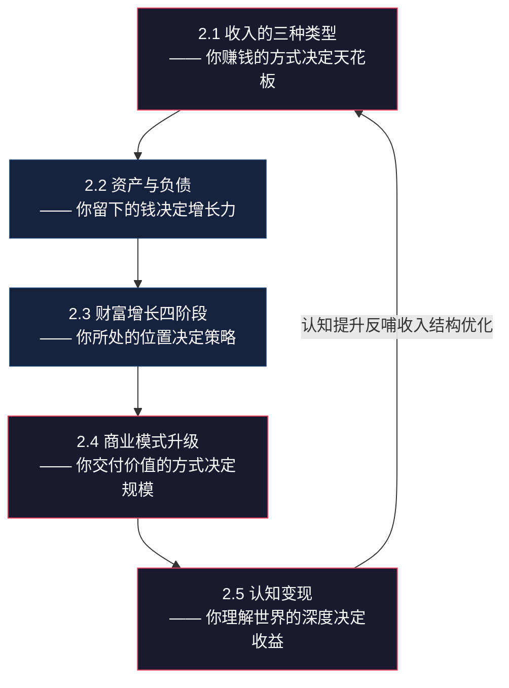
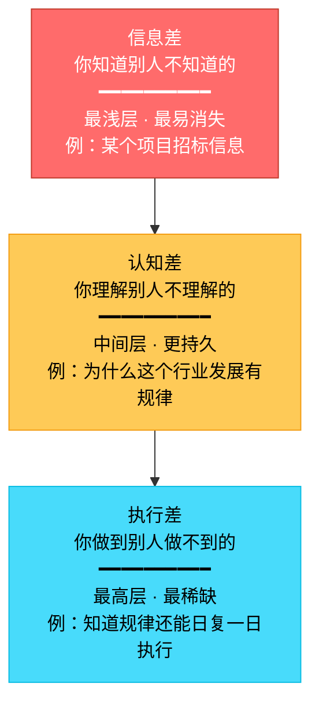

# 第二章：财富增长的底层逻辑 —— 本章小结

> "知道和做到之间，隔着一条太平洋。而本章小结，就是帮你在这条太平洋上架一座桥。"

前面五节内容构建了一套完整的财富增长框架——从收入的本质（道），到资产的判断（法），到阶段的策略（术），到商业模式的升级（术），再到认知变现的逻辑（器）。本章小结不是简单的"划重点"，而是要把这五根支柱焊接成一个**可操作的系统**。

---

## 一、核心框架：五根支柱如何咬合

本章的五个主题不是孤立的知识点，而是一个层层递进的系统。理解它们之间的咬合关系，比记住单个概念重要十倍。



**核心逻辑链**：你的收入类型决定了你能积累多少资产→资产规模决定了你处于哪个财富阶段→每个阶段需要不同的商业模式来放大价值→而所有这些的背后，是认知深度在驱动。认知差是底层发动机，收入结构是传动系统，资产是车轮，商业模式是变速箱，财富阶段是当前档位。

**一个公式概括全章**：

```text
财富增长 = 收入结构优化 × 资产配置效率 × 商业模式杠杆 × 认知复利 × 时间
```

五个因子是**乘法关系**——任何一个为零，结果都是零。只关注收入不关注资产，是"漏水的桶"；只关注资产不升级商业模式，是"小马拉大车"；只关注商业模式不提升认知，是"盲人骑瞎马"。

---

## 二、五根支柱的深度回顾

### 2.1 收入的三种类型：从"赚钱"到"构建收入结构"

**核心洞察**：大多数人只关注"月入多少"，却忽略了收入的来源结构。月入3万但只有工资的人，和月入2万但有三个收入来源的人——后者的财务安全度更高，因为前者的收入只要失业就归零。

**三种收入的完整对比**：

| 维度 | 主动收入 | 组合收入 | 被动收入 |
|------|---------|---------|---------|
| 本质 | 用时间换钱 | 用技能和资源换钱 | 用资产换钱 |
| 公式 | 收入 = 单价 × 时间 | 收入 = 产品销量 × 单价 | 收入 = 资产规模 × 收益率 |
| 天花板 | 一天24小时 | 市场容量 | 理论无上限 |
| 停止工作后 | 立刻归零 | 逐渐衰减（需维护） | 持续产生 |
| 启动难度 | 低 | 中 | 高（需要本金或系统） |
| 复利效应 | 几乎没有 | 明显（口碑积累） | 最强（利滚利） |
| 典型形式 | 工资、加班费、按单计费 | 在线课程、电子书、模板、SaaS | 股息、房租、版税、专利费 |
| 占比健康线 | ≤ 50% | ≥ 20% | ≥ 30% |

**关键转变路径**：

1. **积累期（0-3年）**：90%精力提升主动收入的"单价"——不是加班，而是提升不可替代性。一个高级工程师的时间单价是初级的3-5倍，但工作时间相同。
2. **过渡期（3-5年）**：用主动收入的"溢出"时间和资金启动组合收入——把你的技能产品化。一个设计师做一套模板卖100次，第101次的边际成本是零。
3. **加速期（5-10年）**：组合收入的利润投入被动收入资产——基金定投、REITs、出租房产。让钱替你工作。
4. **自由期（10年+）**：被动收入覆盖生活开支，主动收入变成"可选项"而非"必选项"。

**常见误区**：很多人把"副业"等同于"组合收入"。如果你的副业是接私活——每接一单花一单的时间——那仍然是主动收入，只是换了个雇主。真正的组合收入，是**创造一次、销售多次**。

### 2.2 资产与负债的重新定义：从"拥有"到"现金流"

**核心洞察**：传统会计学的资产定义（你拥有的东西）对个人理财毫无帮助。罗伯特·清崎的现金流定义才是实战利器——**资产是能把钱放进你口袋的东西，负债是把钱从你口袋拿走的东西**。

**生钱资产 vs 耗钱资产的判断矩阵**：

| 资产类型 | 生钱还是耗钱 | 现金流方向 | 实例 | 判断依据 |
|---------|------------|----------|------|---------|
| 出租房产（租金>月供） | 生钱 | 月净流入 +3000元 | 一线城市核心区小户型 | 租金 - 房贷 - 物业 - 维护 > 0 |
| 自住房产 | 耗钱 | 月净流出 -12000元 | 自住商品房 | 房贷 + 物业 + 维修 + 保险 > 0 |
| 指数基金（持有分红） | 生钱 | 月均流入 +500元 | 沪深300ETF | 年分红率1.5-2%，按月摊 |
| 自用车辆 | 耗钱 | 月净流出 -3000元 | 家用轿车 | 油费+保险+停车+折旧 > 0 |
| 网约车（用车赚钱） | 生钱 | 月净流入 +5000元 | 运营车辆 | 运营收入 - 全部成本 > 0 |
| 奢侈品手表 | 耗钱 | 月净流出 -200元（折旧） | 名表 | 无现金流流入，保养+折旧 > 0 |
| 定期存款 | 生钱（微弱） | 月均流入 +200元 | 3年期大额存单 | 年化2.5-3%，跑不赢通胀 |
| 健康的身体 | 生钱（隐性） | 无法量化 | 每天运动+体检 | 减少医疗支出+延长工作年限 |

**关键判断技巧**：问自己一个问题——**"如果我明天什么都不做，这项资产下个月会往我口袋里放钱还是掏钱？"** 放钱就是生钱资产，掏钱就是耗钱资产。

**资产组合构建的四条铁律**：

1. **优先购买生钱资产**：每花一笔大钱之前，先问"这笔钱能不能买一个每月给我带来正现金流的资产？" 5万元买奢侈品是耗钱资产，5万元投入年化8%的组合是每月带来333元的生钱资产。
2. **用生钱资产的收益购买耗钱资产**：想买一辆20万的车？先建立一个能产生每月3000元现金流的资产组合（约45万本金），用收益来覆盖车辆的持有成本。
3. **持续增加生钱资产的比例**：每季度盘点一次，目标是生钱资产占比从当前水平逐步提升至50%以上。
4. **定期清理或转化耗钱资产**：闲置物品卖掉变现、自住房间出租一间、自用车辆在不需要时卖掉——每一项耗钱资产都有转化为生钱资产的可能。

### 2.3 财富增长的四个阶段：用对策略比努力更重要

**核心洞察**：财富增长不是匀速直线运动，而是阶梯式跃迁。每个阶段的核心任务完全不同——在积累期用杠杆期的策略（借钱投资），就像让小学生开卡车，危险且无效。

**四阶段全景对比**：

| 维度 | 积累期（0-100万） | 加速期（100-500万） | 杠杆期（500-1000万） | 自由期（1000万+） |
|------|-----------------|------------------|-------------------|-----------------|
| 核心任务 | 存钱+学习 | 配置+多元 | 放大+团队 | 守护+传承 |
| 最重要指标 | 储蓄率（≥30%） | 资产配置多元化 | 风险调整后收益 | 被动收入覆盖率 |
| 收入重点 | 提升主动收入 | 建立组合收入 | 优化被动收入 | 被动收入为主 |
| 投资策略 | 宽基指数定投 | 股债平衡+另类 | 全球配置+杠杆 | 保守配置+传承 |
| 典型年限 | 3-7年 | 5-10年 | 3-7年 | 持续优化 |
| 最大陷阱 | 追求高收益（本金太少） | 过度自信（牛市幻觉） | 杠杆失控（黑天鹅） | 通胀侵蚀（太保守） |
| 学习重点 | 储蓄习惯+基础投资 | 资产配置+个股分析 | 风险管理+税务规划 | 财富传承+慈善 |

**各阶段的关键动作清单**：

**积累期（0-100万）—— "存"比"赚"重要100倍**：
- 建立"先存后花"的自动转账系统（工资到账当天自动转30%到投资账户）
- 建立3-6个月生活费的应急基金（放在货币基金，随时可取）
- 开始宽基指数基金定投（沪深300+中证500，每月500-2000元）
- 每月投入收入的10%学习技能（这是这个阶段回报率最高的投资）
- 记录每一笔支出（用记账App，精确到元）

**加速期（100-500万）—— 让复利开始为你工作**：
- 建立股债平衡的资产配置（股票40-60%、债券20-30%、另类10-20%、现金10%）
- 开始建立组合收入（把技能产品化——课程、模板、工具）
- 学习高级投资知识（个股分析、REITs、房产投资）
- 优化税务结构（合理利用个税抵扣、企业架构）
- 建立顾问网络（理财师、税务师、律师各一位）

**杠杆期（500-1000万）—— 放大但不失控**：
- 建立完整的保险体系（重疾+寿险+意外+财产险）
- 合理使用低成本杠杆（房贷利率<投资收益率时，不提前还贷）
- 开始海外资产配置（分散单一市场风险，比例10-20%）
- 建立专业团队（财务顾问+税务顾问+法律顾问）
- 考虑股权投资（参与早期项目或合伙经营）

**自由期（1000万+）—— 守护比增长更重要**：
- 被动收入覆盖率 ≥ 120%（留20%的安全边际）
- 保守配置（固收40-50%、股票20-30%、另类10-20%、现金10-20%）
- 建立财富传承架构（遗嘱、信托、保险架构）
- 合法税务优化（跨境架构、慈善捐赠抵税）
- 把时间花在真正重要的事上

### 2.4 个人商业模式升级：从卖时间到卖系统

**核心洞察**：你的商业模式决定了你的收入天花板。用"卖时间"的模式，天花板就是一天24小时×每小时单价；用"卖系统"的模式，天花板取决于系统规模——理论上没有上限。

**四级商业模式对比**：

| 维度 | Level 1：卖时间 | Level 2：卖技能 | Level 3：卖产品 | Level 4：卖系统 |
|------|---------------|---------------|---------------|---------------|
| 收入公式 | 时薪 × 小时 | 日薪 × 天数 | 单价 × 销量 | 系统规模 × 效率 |
| 客户数量 | 1个（雇主） | 3-10个 | 无上限 | 无上限+自动化 |
| 停工影响 | 立刻归零 | 1-3月归零 | 持续6月+ | 持续1年+ |
| 复利效应 | 无 | 弱 | 强 | 极强 |
| 启动门槛 | 低 | 中 | 高 | 极高 |
| 典型职业 | 上班族、工厂工人 | 咨询师、设计师 | 课程讲师、SaaS创业者 | 平台创始人、IP持有者 |

**升级的三条实操路径**：

**路径一：卖时间 → 卖技能**（适用于有一技之长的上班族）
1. 识别你的"可出售技能"——同事经常请教你的事、你在公司内部培训讲过的主题
2. 在业余时间接外包/咨询项目（从低价开始积累口碑）
3. 建立个人品牌（技术博客、社交媒体、行业社群）
4. 逐步提高单价，用"专家定位"替代"劳动力定位"

**路径二：卖技能 → 卖产品**（适用于已有客户基础的自由职业者）
1. 识别你反复回答的问题——"如果第100个客户问同样的问题，你能不能把答案录成视频？"
2. 把服务流程标准化——制作模板、清单、SOP
3. 选择产品形态——在线课程（知识付费）、电子书、设计模板、SaaS工具
4. 用一个平台（如小鹅通、知识星球）做最小可行产品（MVP）
5. 迭代优化——根据用户反馈持续改进

**路径三：卖产品 → 卖系统**（适用于已有成熟产品的创业者）
1. 把产品的"交付"环节自动化（支付自动化、内容自动解锁、客服机器人）
2. 建立分销/代理体系（让别人帮你卖，你提供产品和分润）
3. 打造品牌IP（从"卖产品"升级为"卖品牌"——用户买的是你的品牌溢价）
4. 授权/加盟（把你的成功模式复制给其他人）

**商业模式画布的九大模块**（填写指南）：

| 模块 | 核心问题 | 填写示例（以在线课程讲师为例） |
|------|---------|--------------------------|
| 价值主张 | 你帮客户解决什么问题？ | "帮零基础的人3个月学会Python数据分析" |
| 客户群体 | 谁是你的核心客户？ | 25-35岁想转行数据分析师的上班族 |
| 渠道 | 你怎么触达客户？ | B站引流 → 微信私域 → 课程平台转化 |
| 客户关系 | 你和客户怎么互动？ | 社群答疑 + 直播辅导 + 1对1咨询 |
| 收入来源 | 你怎么赚钱？ | 课程销售（主力）+ 1对1咨询（高客单）+ 企业内训（B端） |
| 关键资源 | 你需要什么？ | 技术能力 + 教学经验 + 平台账号 + 行业人脉 |
| 关键活动 | 你做什么？ | 课程研发 + 内容营销 + 社群运营 + 学员辅导 |
| 关键合作 | 谁帮你？ | 平台方（小鹅通）+ 分销伙伴 + 助教团队 |
| 成本结构 | 你花什么？ | 平台费 + 营销费 + 助教薪资 + 设备折旧 |

### 2.5 认知变现的底层逻辑：从"知道"到"赚到"

**核心洞察**：赚钱有三种"差"——信息差、认知差、执行差。你处于哪个层级，决定了你能赚什么层次的钱。大多数人以为自己"懂了"，其实连"理解"都没到。

**三种"差"的完整模型**：



| 维度 | 信息差 | 认知差 | 执行差 |
|------|-------|-------|-------|
| 本质 | 知道别人不知道的 | 理解别人不理解的 | 做到别人做不到的 |
| 持久性 | 低（信息传播越来越快） | 高（需要深度思考） | 极高（需要自律和系统） |
| 复制难度 | 低（一条消息就能抹平） | 中（需要学习和思考） | 高（知道和做到之间有鸿沟） |
| 变现方式 | 倒卖信息、中介服务 | 咨询、培训、投资判断 | 创业、产品、品牌 |
| 保质期 | 天-周 | 月-年 | 年-十年 |
| 举例 | "某某公司要上市" | "为什么消费升级是长期趋势" | "连续5年每天写作3000字" |

**从"知道"到"赚到"的五层鸿沟**：

```text
第1层：知道 → 你听说了这个概念（大多数人停在这里）
    ↓ 淘汰 70% 的人
第2层：理解 → 你能解释背后的原理和逻辑
    ↓ 淘汰 50% 的人
第3层：认同 → 你真的相信这是对的，愿意投入资源
    ↓ 淘汰 40% 的人
第4层：行动 → 你开始按照这个认知去做
    ↓ 淘汰 60% 的人
第5层：坚持 → 你持续做了一年以上，形成了系统
    
最终能从"知道"走到"坚持"的人，大约只有 3.6%
（100% × 30% × 50% × 60% × 40% = 3.6%）
```

这就是为什么"知道很多道理，却依然过不好这一生"——因为"知道"只是第1层，距离"赚到"还有四层鸿沟。

**构建个人知识体系的五步法**：

1. **选定一个垂直领域**：不要什么都学。选择一个你有基础、有热情、有市场的领域，深扎下去。宽度决定你知道多少，深度决定你能赚多少。
2. **建立知识框架**：找这个领域的3-5本经典教材，画出知识地图——主干是什么、分支有哪些、节点之间是什么关系。
3. **输入-处理-输出闭环**：读一篇文章→用自己的话总结→写成公开发表的内容。输出是最好的学习——"教是最好的学"。
4. **实践验证**：每学到一个新方法，72小时内找机会实践。不能变现的知识只是信息。
5. **迭代更新**：每季度回顾你的知识体系，删掉过时的、补充新发现的、深化薄弱的。

**知识变现的六种模式**：

| 变现模式 | 门槛 | 收入天花板 | 适合阶段 | 具体形式 |
|---------|------|----------|---------|---------|
| 写作变现 | 低 | 低-中 | 积累期 | 公众号、知乎、付费专栏 |
| 教育变现 | 中 | 中-高 | 加速期 | 在线课程、训练营、工作坊 |
| 咨询变现 | 高 | 中-高 | 加速期 | 1对1咨询、企业内训 |
| 投资变现 | 高 | 极高 | 杠杆期 | 用认知差做投资判断 |
| 产品变现 | 中 | 高 | 加速期 | 工具、模板、SaaS |
| 品牌变现 | 极高 | 极高 | 自由期 | IP授权、代言、品牌溢价 |

---

## 三、关键概念速查表

| 概念 | 一句话定义 | 核心要点 | 在系统中的位置 |
|------|----------|---------|-------------|
| 主动收入 | 用时间换钱 | 停止工作=停止收入，天花板明显 | 收入结构的基础层 |
| 组合收入 | 用技能和资源换钱 | 创建一次、销售多次，复利效应明显 | 收入结构的过渡层 |
| 被动收入 | 用资产换钱 | 真正的"睡后收入"，需要前期积累 | 收入结构的目标层 |
| 生钱资产 | 产生正现金流的资产 | 判断标准：让钱流进你的口袋 | 资产配置的核心 |
| 耗钱资产 | 产生负现金流的"资产" | 你以为的资产可能是负债 | 资产配置的清理对象 |
| 储蓄率 | 月储蓄占收入的比例 | 积累期最重要的指标，比收益率重要100倍 | 财富增长的加速器 |
| 财富四阶段 | 积累→加速→杠杆→自由 | 每阶段策略完全不同 | 全局路线图 |
| 个人商业模式 | 创造和交付价值的方式 | 从卖时间到卖系统，每次升级是维度跃迁 | 收入天花板的决定因素 |
| 信息差 | 知道别人不知道的 | 最浅层，保质期最短 | 认知变现的第1层 |
| 认知差 | 理解别人不理解的 | 中间层，需要深度思考 | 认知变现的第2层 |
| 执行差 | 做到别人做不到的 | 最高层，最稀缺也最持久 | 认知变现的第3层 |
| 复利效应 | 利息产生利息的指数增长 | 在资金、能力、知识三个维度都存在 | 全章的底层引擎 |

---

## 四、常见误区与纠正

### 误区一："等我有钱了再开始投资"

**错在哪里**：积累期的核心是"储蓄率"而不是"收益率"。100万本金年化10%=10万，但如果你月入1万、月光，你永远不会有100万本金。反过来，月入1万存30%=3000元/月，年化5%，10年后也有47万。

**正确做法**：从第一笔工资开始，建立"先存后花"的自动转账系统。金额不重要，习惯才重要。

### 误区二："自住房是最大的资产"

**错在哪里**：自住房每月流出房贷+物业+维修+保险，是典型的耗钱资产。它可能升值，但升值是"资本利得"——不卖就没有现金流。你不能靠"房子涨了"来交下个月的房贷。

**正确做法**：自住房是生活必需品，但不要把它当成"投资"。真正的房产投资，是租金覆盖月供后还有正现金流的出租房产。

### 误区三："被动收入就是不劳而获"

**错在哪里**：被动收入需要前期大量的资金积累或系统构建。买一套出租房需要几十万首付+持续的维护管理；建一个能产生被动收入的在线课程系统需要几个月的内容研发。被动收入的"被动"是指后期被动，前期的投入比主动收入更辛苦。

**正确做法**：做好3-5年的前期投入准备。把"被动收入"理解为"前期主动投入、后期被动收获"。

### 误区四："商业模式升级 = 必须创业"

**错在哪里**：商业模式升级有多种路径。一个上班族可以在业余时间写技术博客（从卖时间到卖技能），做付费专栏（从卖技能到卖产品），建立自动化的内容分发系统（从卖产品到卖系统）——全程不需要辞职创业。

**正确做法**：先在现有工作中找到"可产品化"的技能，利用业余时间测试市场。等到副业收入稳定达到主业的50-80%时，再考虑全职转型。

### 误区五："我知道了 = 我能做到"

**错在哪里**：从"知道"到"做到"有五层鸿沟，96.4%的人会在中途掉队。读了一本理财书≠你改变了消费习惯，听了一节投资课≠你建立了投资系统。

**正确做法**：每学到一个概念，72小时内找到一个可执行的最小行动。比如学了"收入结构"→今天就列出你的所有收入来源并分类；学了"生钱资产"→今天就盘点你的资产现金流。

### 误区六："只要收益率够高，本金少也没关系"

**错在哪里**：10万本金年化20%=2万收益，但年化20%几乎不可能持续。而如果你的储蓄率从10%提升到40%（月入2万，从存2000到存8000），一年就多存7.2万——这比追求高收益率实际得多。

**正确做法**：在积累期，把80%的精力放在提高储蓄率上，20%的精力放在学习投资上。等到本金到了一定规模（比如100万），收益率的差异才真正开始产生显著影响。

---

## 五、行动清单：从今天开始

### 第一阶段：认知校准（今天，30分钟）

- [ ] **盘点收入来源**：列出你所有的收入来源，按照"主动/组合/被动"分类，计算各类型占比。如果主动收入>90%，你处于"单腿走路"的高风险状态。
- [ ] **资产现金流审计**：列出你拥有的所有"资产"，逐项判断是生钱资产还是耗钱资产。计算你的月净现金流——如果是负数，你的"资产"正在蚕食你的财富。
- [ ] **财富阶段定位**：根据净资产和被动收入覆盖率，判断自己处于四个阶段中的哪一个。

### 第二阶段：系统设计（本周，2-3小时）

- [ ] **画商业模式画布**：用九大模块梳理你当前的个人商业模式，找到最薄弱的环节。
- [ ] **制定90天收入优化计划**：设定主动收入提升目标、组合收入启动计划、被动收入建设计划。
- [ ] **建立"先存后花"系统**：设置工资到账日自动转账（至少20%到投资/储蓄账户）。

### 第三阶段：开始执行（本月）

- [ ] **启动组合收入实验**：选择一个你最擅长的技能，用最低成本测试市场——写一篇文章、录一节课、做一套模板。
- [ ] **开始定投**：选择一只宽基指数基金（如沪深300ETF），设定每月自动定投。
- [ ] **建立学习-输出闭环**：每周读一篇本领域深度文章，用自己的话写300字总结并发到社交媒体。

### 第四阶段：持续迭代（每季度）

- [ ] **重新做收入类型分析**：对比上季度数据，检查组合收入和被动收入是否在增长。
- [ ] **重新做资产审计**：检查生钱资产比例是否在提升。
- [ ] **重新评估财富阶段**：是否接近阶段跃迁的门槛？需要调整策略吗？
- [ ] **更新商业模式画布**：哪些模块已经升级？哪些还需要优化？

---

## 六、本章知识自测

学完本章后，试着回答以下问题。如果你能流畅回答每一个，说明你真正理解了；如果答不上来，回去重读对应章节。

| # | 问题 | 考察点 | 详见 |
|---|------|-------|------|
| 1 | 月入3万的上班族和月入2万的自由职业者（同时有课程收入和投资收入），谁的财务状况更健康？为什么？ | 收入结构理解 | 2.1 |
| 2 | 一套市值500万的房子，月租1.2万，月供1.5万，物业费2000元。这是生钱资产还是耗钱资产？ | 现金流分析能力 | 2.2 |
| 3 | 一个净资产200万、月被动收入3000元、月生活开支2万元的人，处于什么阶段？下一步最该做什么？ | 阶段判断+策略匹配 | 2.3 |
| 4 | 一个程序员业余时间接外包项目，这属于商业模式的哪个层级？如何升级？ | 商业模式认知 | 2.4 |
| 5 | "某某股票要涨"和"价值投资的底层逻辑"，分别对应哪种"差"？哪种更有长期价值？ | 认知层级理解 | 2.5 |

**参考答案要点**：
1. 后者更健康——收入来源多元化，抗风险能力更强。前者的收入只要失业就归零。
2. 耗钱资产——月净现金流 = 12000 - 15000 - 2000 = -5000元。即使房价涨了，没有卖出之前只有流出。
3. 加速期——净资产在100-500万区间，但被动收入覆盖率仅15%（3000/20000），处于加速期前期。下一步：优化资产配置+建立组合收入。
4. Level 1（卖时间）——每个项目都需要投入时间。升级路径：把反复使用的技术方案做成模板/课程/工具。
5. 前者是信息差（保质期短、易消失），后者是认知差（持久、难复制）。认知差更有长期价值——理解了价值投资的逻辑，可以终身受益。

---

## 七、推荐资源

### 书籍

**入门级（建立框架）**：
- 《富爸爸穷爸爸》——罗伯特·清崎：现金流思维的启蒙书，帮你建立"资产vs负债"的判断框架
- 《纳瓦尔宝典》——埃里克·乔根森：硅谷投资人的财富哲学，核心观点"用杠杆放大你的独特知识"
- 《认知觉醒》——周岭：从"知道"到"做到"的鸿沟如何跨越，适合执行力不足的读者

**进阶级（深化理解）**：
- 《商业模式新生代》——亚历山大·奥斯特瓦尔德：商业模式画布的原著，个人商业模式设计的标准参考
- 《穷查理宝典》——查理·芒格：多元思维模型的集大成者，认知变现的最高级形态
- 《富足人生》——托马斯·科里：基于对177位白手起家富人的研究，总结出真实的财富习惯

**投资类（资产配置）**：
- 《聪明的投资者》——本杰明·格雷厄姆：价值投资的圣经，巴菲特称之为"有史以来最伟大的投资著作"
- 《投资最重要的事》——霍华德·马克斯：风险管理和逆向思维的深度阐释

### 课程与平台

| 平台 | 推荐课程 | 适合阶段 | 费用 |
|------|---------|---------|------|
| Coursera | Financial Markets（耶鲁大学，Robert Shiller主讲） | 加速期 | 免费旁听 |
| 得到App | 《香帅的北大金融学课》 | 积累期-加速期 | 199元 |
| 雪球 | 投资实战课程 | 加速期 | 免费-付费 |
| B站 | 搜索"资产配置"/"指数基金定投" | 积累期 | 免费 |

### 实用工具

| 工具 | 用途 | 推荐 |
|------|------|------|
| 记账App | 收支追踪 | 随手记、Money Pro |
| 基金定投 | 自动化投资 | 蛋卷基金、天天基金 |
| 商业模式画布 | 个人商业模式梳理 | canvanizer.com（免费在线） |
| 资产负债表 | 资产盘点 | Excel/Numbers自制模板 |

---

## 八、本章金句

> "资产是能把钱放进你口袋的东西。负债是把钱从你口袋拿走的东西。" —— 罗伯特·清崎

> "在这个阶段，储蓄率比收益率更重要。"

> "认知差 > 执行差 > 信息差"

> "我这辈子遇到的聪明人，没有不每天阅读的——没有，一个都没有。" —— 查理·芒格

> "财富不是你赚了多少钱，而是你能留住多少钱、让多少钱为你工作。"

> "大多数人终其一生都在用一档开车——他们不是不努力，而是不知道还有二档、三档、四档。"

---

## 九、下一章预告

在下一章**《搞钱的心态与习惯》**中，我们将探讨财富增长的"燃料系统"——如果说本章给了你一张财富增长的地图，下一章就是帮你把油加满、把引擎调好。具体包括：

1. **成功搞钱者的共同特质**：目标清晰、执行力强、善于学习、持续迭代——这些特质不是天生的，而是可以后天培养的
2. **搞钱路上的心理障碍**：恐惧失败、完美主义、拖延症、即时满足偏好——识别并克服这些心理陷阱
3. **建立搞钱的日常习惯**：微习惯系统、习惯堆叠、环境设计——让正确的财务行为变成"自动驾驶"
4. **时间管理与效率提升**：把有限的时间花在回报率最高的事情上，而不是陷入"忙碌的幻觉"
5. **构建搞钱的生态系统**：你身边的五个人决定了你的财富水平——如何主动构建一个支持你搞钱的人际网络

> **学习建议**：本章信息量很大，不建议一次性消化。建议分3-4次学习，每次聚焦1-2个主题。重点做两件事：（1）用今天学到的现金流视角，重新审视你目前的资产清单；（2）用商业模式画布梳理你当前的个人商业模式。这两个实操练习产生的行动价值，远大于读完全部理论。
