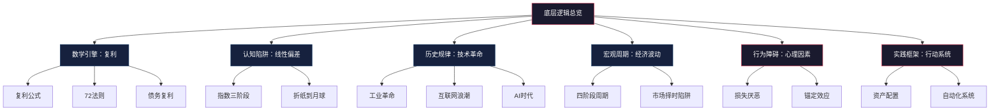
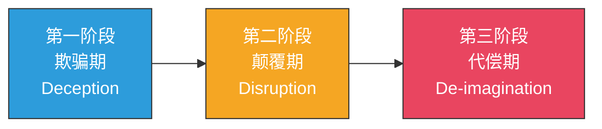
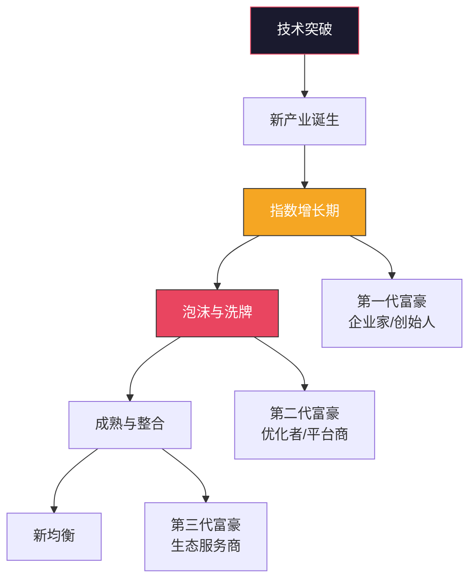
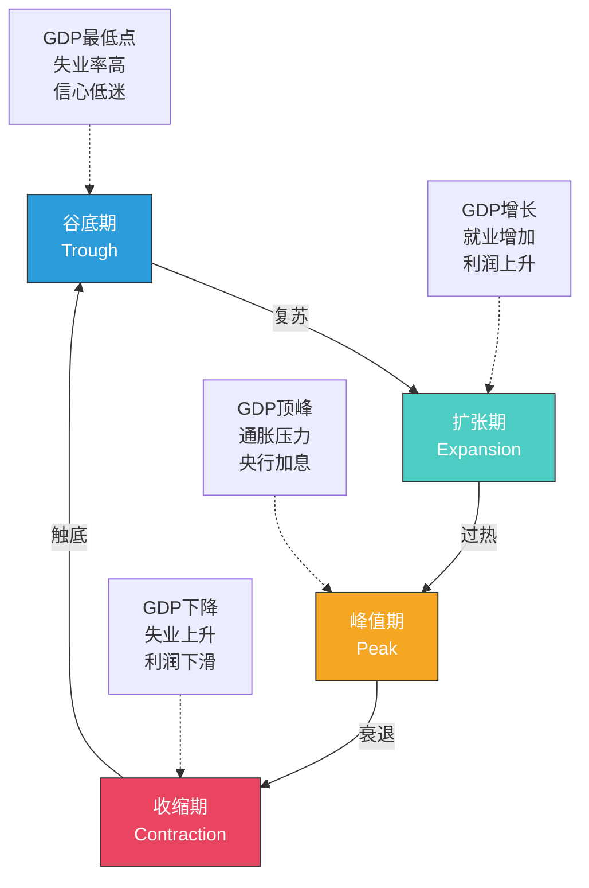
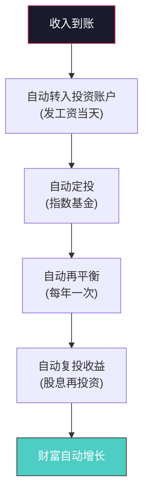
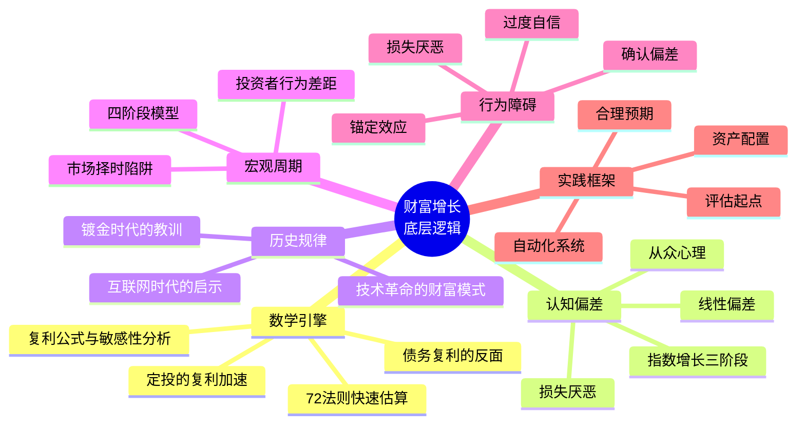

# 深度拓展：财富增长的底层逻辑

> "复利是世界第八大奇迹。理解它的人，赚取它；不理解的人，支付它。" —— 常被归于爱因斯坦

本节是第二章的纵深延伸。如果说前面的理论基础回答了"财富增长是什么"，核心技巧回答了"怎么做"，那么本节要回答的是"为什么这样做有效"。我们将从数学原理、人类认知偏差、历史规律和宏观周期四个维度，建立对财富增长的完整底层理解。

---

## 一、复利的数学原理与深层应用

### 1.1 复利的数学本质

复利（Compound Interest）的数学表达：

**A = P(1 + r/n)^(nt)**

| 符号 | 含义 | 示例 |
|------|------|------|
| A | 最终金额 | — |
| P | 本金（Principal） | 10万元 |
| r | 年利率（小数形式） | 0.08（即8%） |
| n | 每年复利次数 | 12（月复利） |
| t | 投资年数 | 30年 |

当复利频率趋向无穷时，公式收敛于连续复利：

**A = Pe^(rt)**

其中 e ≈ 2.71828，是自然对数的底数。这个公式的深层含义是：**复利的本质是指数函数**。指数函数是自然界中最强大的增长模式——细胞分裂、病毒传播、核裂变都遵循同样的数学规律。

"棋盘上的麦粒"思想实验直观展示了指数的威力：在64格棋盘上，第1格放1粒、第2格放2粒、第3格放4粒……每格是前一格的2倍。最终需要约 18.4×10^18 粒麦子——大约是全球小麦年产量的2000倍。这就是为什么"理解复利"不是数学课的题外话，而是财富认知的第一课。

### 1.2 复利的变量敏感性分析

复利公式中有四个关键变量，每个变量的微小变化都会在长期产生巨大影响：

| 本金 | 年化收益率 | 投资年限 | 最终金额 | 总收益倍数 |
|------|-----------|---------|---------|-----------|
| 10万 | 5% | 30年 | 43.2万 | 4.3倍 |
| 10万 | 8% | 30年 | 100.6万 | 10.1倍 |
| 10万 | 10% | 30年 | 174.5万 | 17.5倍 |
| 10万 | 12% | 30年 | 299.6万 | 30.0倍 |
| 10万 | 15% | 30年 | 662.1万 | 66.2倍 |

关键发现：收益率从5%提升到10%（仅5个百分点），30年后结果相差4倍。从10%到15%（同样是5个百分点），结果又相差近4倍。**收益率的微小差异，在时间的作用下会被指数级放大**。这就是为什么"学习投资"不是锦上添花，而是财富增长的核心变量之一。

再看时间维度（假设本金10万，年化8%）：

| 投资年限 | 最终金额 | 其中利息占比 |
|---------|---------|-------------|
| 5年 | 14.7万 | 32% |
| 10年 | 21.6万 | 54% |
| 20年 | 46.6万 | 79% |
| 30年 | 100.6万 | 90% |
| 40年 | 217.2万 | 95% |

**投资30年时，90%的财富来自利息而非本金。投资40年时，这个比例达到95%。** 这就是为什么巴菲特说"我的财富99%是在50岁之后赚到的"——他不是在谦虚，而是在陈述复利的数学事实。

### 1.3 定投的复利加速效应

定期定额投资（DCA）是普通人利用复利最有效的方式。假设每月定投3000元：

| 年化收益率 | 10年后 | 20年后 | 30年后 | 总投入 |
|-----------|--------|--------|--------|--------|
| 5% | 46.6万 | 123.3万 | 250.3万 | 108万 |
| 8% | 54.9万 | 176.5万 | 447.1万 | 108万 |
| 10% | 61.7万 | 228.0万 | 678.1万 | 108万 |
| 12% | 69.5万 | 298.3万 | 1048.5万 | 108万 |

同样的108万投入，8%收益率和12%收益率在30年后相差600万。这就是"为什么要把钱放进指数基金而不是银行活期"的数学理由。

**定投的三大优势**：
1. **强制储蓄**：每月自动扣款，从行为层面杜绝"月光"
2. **摊平成本（Dollar Cost Averaging）**：市场低迷时买入更多份额，市场高涨时买入较少份额，自动实现"低买多、高买少"
3. **复利叠加**：每期投入的资金独立产生复利效应，早期投入的资金享受最长时间的复利

**定投的一个常见误区**：很多人在市场下跌时停止定投（因为"亏了"），在市场上涨时加大定投（因为"赚了"）。这恰恰做反了——市场下跌时才是定投摊低成本的最佳时机。

### 1.4 72法则与快速估算

72法则（Rule of 72）是投资中最实用的心算工具：用72除以年化收益率（百分比形式），得到投资翻倍所需的大致年数。

| 年化收益率 | 72法则估算 | 实际翻倍年数 | 误差 |
|-----------|-----------|-------------|------|
| 3% | 24年 | 23.4年 | +2.6% |
| 6% | 12年 | 11.9年 | +0.8% |
| 8% | 9年 | 9.0年 | 0% |
| 10% | 7.2年 | 7.3年 | -1.4% |
| 12% | 6年 | 6.1年 | -1.6% |
| 15% | 4.8年 | 5.0年 | -4.0% |
| 18% | 4年 | 4.2年 | -4.8% |

72法则在6-12%的收益率区间最为准确，这也是大多数投资的实际收益率范围。更精确的版本是69.3法则（因为 ln(2) ≈ 0.693），但72更容易心算且在常见收益率区间足够准确。

**72法则的扩展应用**：

- **通胀侵蚀估算**：年通胀率3%，购买力减半需要约24年。100万元储蓄若不做任何投资，24年后实际购买力仅约50万
- **GDP增长估算**：中国GDP年增速6%，经济总量翻倍需要约12年
- **工资增长对照**：如果工资年增长5%但通胀3%，实际购买力翻倍需要约36年（用72除以实际增长率2%）

### 1.5 复利的反面：债务的复利效应

复利是双刃剑——它能让财富增长，也能让债务膨胀。

**信用卡债务的真实成本**（假设欠款10万元，年利率18%，仅支付最低还款额）：

| 还款策略 | 还清时间 | 总支付利息 | 总支付金额 |
|---------|---------|-----------|-----------|
| 最低还款额（2%） | 约47年 | 约16.8万 | 约26.8万 |
| 每月固定2000元 | 约6年 | 约4.1万 | 约14.1万 |
| 每月固定5000元 | 约2年 | 约1.4万 | 约11.4万 |
| 一次性还清 | 立即 | 0 | 10万 |

最低还款额的陷阱在于：每月还的大部分是利息，本金几乎不减少。10万元的信用卡债务，用最低还款额慢慢还，最终要还近27万——接近本金的2.7倍。

**债务管理的优先级法则**：

核心原则：**任何投资收益都无法稳定超过信用卡的利息成本**。在开始投资之前，先还清所有高息债务（利率>10%）。中低息债务（如房贷3-4%）可以与投资并行，因为投资的长期收益通常能覆盖这个成本。

### 1.6 复利的三个加速器

| 加速器 | 机制 | 适用阶段 | 风险 |
|--------|------|---------|------|
| 提高收益率 | 学习投资知识，从银行理财升级到指数基金 | 全阶段 | 追求过高收益可能亏损 |
| 增加本金投入 | 提高储蓄率，将加薪/奖金/副业收入投入投资 | 积累期（最有效） | 过度节俭影响生活质量 |
| 延长投资时间 | 尽早开始投资，减少中断 | 越早越好 | 需要极强的耐心和纪律 |

**三个加速器的组合效应**：假设基准场景为每月投入2000元、年化6%、投资25年，最终约115万。如果同时优化三个变量——每月投入3000元、年化8%、投资30年，最终约447万。三个变量各提升一点，最终结果相差近4倍。

---

## 二、指数增长与人类认知偏差

### 2.1 线性偏差：大脑的出厂设置

人类大脑在数百万年的进化中，主要处理的是线性变化：食物数量与采集时间成正比，猎物范围与狩猎距离成正比。这种进化环境塑造了我们的认知模式——**直觉天生倾向于线性思维，对指数增长存在系统性低估**。

经典思想实验"折纸到月球"完美体现了这一点：一张0.1毫米厚的纸，对折42次后，厚度约44万公里——超过地球到月球的距离（约38.4万公里）。但直觉告诉我们"纸很薄，折叠几次也不会变厚多少"。

**线性偏差在投资中的表现**：

| 直觉判断 | 实际情况 | 偏差程度 |
|---------|---------|---------|
| "年化8%，30年大概翻3倍" | 实际翻10倍 | 低估3倍 |
| "每月投2000元，30年大概存72万" | 实际约300万（8%收益率） | 低估4倍 |
| "晚投资5年，影响不大" | 少赚约40%的终值 | 严重低估 |
| "收益率差2个百分点，差别不大" | 30年后相差50%以上 | 严重低估 |

### 2.2 指数增长的三个阶段

奇点大学联合创始人彼得·戴曼迪斯（Peter Diamandis）提出的"指数增长三阶段"框架，解释了为什么大多数人错过指数增长的机会：

**第一阶段——欺骗期**：指数增长的早期，绝对增长量极小，看起来与零无异。1→2→4→8→16……在前几次翻倍时，数字仍然很小。这是大多数人放弃的阶段——"我已经投资了5年，才赚了这么点"。

**第二阶段——颠覆期**：增长越过临界点后，绝对量开始显著。但大多数人仍将此视为"异常"而非"趋势"。2009年有人告诉你比特币未来值6万美元，你大概率不会相信。

**第三阶段——代偿期**：增长快到让所有人震惊，人们才意识到"原来这是指数增长"——但此时最佳窗口已过。2021年所有人都在谈论比特币时，恰恰是风险最高的时候。

**在投资中的应用**：

- 25岁开始每月投2000元，前10年（25-35岁）账户增长缓慢，看起来"没多少"——这是欺骗期
- 第15-20年（35-45岁），账户开始加速增长，复利效应开始显现——进入颠覆期
- 第25-30年（45-55岁），账户增长飞速，远超你的工资收入——进入代偿期

**关键启示**：指数增长最困难的不是"知道"，而是"坚持过欺骗期"。绝大多数人在第一阶段就放弃了。

### 2.3 巴菲特的财富曲线：指数增长的现实证明

沃伦·巴菲特的财富增长是指数增长最著名的现实案例：

| 年龄 | 净资产（约） | 关键事件 |
|------|------------|---------|
| 21岁 | 2万美元 | 大学毕业 |
| 30岁 | 100万美元 | 成立合伙基金 |
| 39岁 | 2,500万美元 | 关闭合伙基金 |
| 47岁 | 6,700万美元 | 伯克希尔转型 |
| 56岁 | 13亿美元 | 首次进入福布斯400 |
| 66岁 | 160亿美元 | 可口可乐投资大获成功 |
| 83岁 | 585亿美元 | 99%财富在50岁后获得 |
| 90岁+ | 1,000亿美元+ | 复利持续运转 |

巴菲特从21岁到50岁积累了约3亿美元——这已经是巨额财富，但仅占他最终财富的不到1%。**剩下99%的财富是在50岁之后，通过复利的指数增长创造的**。如果巴菲特在50岁退休，他将只是一个"成功的投资人"，而不是"世界上最富有的人之一"。

---

## 三、财富增长的历史规律

### 3.1 技术革命的财富创造模式

每一次重大技术革命都遵循相似的财富创造模式：新技术→新产业→新富豪→新阶层。理解这个模式，有助于识别当前时代的机会。

| 技术革命 | 时期 | 核心产业 | 代表富豪 | 财富来源 |
|---------|------|---------|---------|---------|
| 第一次工业革命 | 1760-1840 | 纺织、蒸汽机 | 理查德·阿克赖特 | 工厂制度+规模经济 |
| 第二次工业革命 | 1870-1914 | 石油、钢铁、铁路 | 洛克菲勒、卡内基 | 垂直整合+垄断 |
| 电气化时代 | 1880-1930 | 电力、汽车 | 福特、爱迪生 | 流水线+大众市场 |
| 信息技术革命 | 1970-2010 | 软件、互联网 | 盖茨、贝索斯 | 平台效应+网络效应 |
| 移动互联网 | 2007-2020 | 智能手机、应用 | 扎克伯格、黄峥 | 社交网络+电商 |
| AI时代 | 2020-至今 | 生成式AI、芯片 | 黄仁勋、奥特曼 | 算力基础设施+模型 |

### 3.2 镀金时代的财富积累（1870-1900）

美国"镀金时代"（Gilded Age）是人类历史上最壮观的财富创造时期之一。一批被称为"强盗贵族"的企业家积累了前所未有的财富：

**约翰·D·洛克菲勒**（石油）：通过标准石油公司控制了美国90%以上的炼油能力。按通胀调整后的净资产计算，洛克菲勒是人类历史上最富有的个人，巅峰净资产约合今天的4000亿美元——超过比尔·盖茨、杰夫·贝索斯和埃隆·马斯克的总和。

**安德鲁·卡内基**（钢铁）：通过垂直整合和规模经济，将钢铁生产成本降低了约75%。1901年以4.8亿美元（约合今天的170亿美元）将卡内基钢铁出售给J.P.摩根。

**科尼利厄斯·范德比尔特**（铁路与航运）：从100美元起家，通过航运和铁路投资建立了约合今天2000亿美元的财富帝国。

这些财富积累的共同特征：**利用了当时最强大的"指数增长"力量——工业化**。工业化不仅是技术革命，更是整个经济体系的重构。那些能够在工业化浪潮中占据关键节点（石油、钢铁、铁路）的人，获得了超线性的回报。

**对个人的启示**：选择一个正在经历指数增长的经济体、行业或公司，乘上增长的电梯，比在停滞的环境中单纯依靠个人努力更有效。

### 3.3 亚洲四小龙的经济奇迹（1960-2000）

| 经济体 | 1960年人均GDP | 2000年人均GDP | 增长倍数 | 核心策略 |
|--------|-------------|-------------|---------|---------|
| 韩国 | 约158美元 | 约11,347美元 | 约71倍 | 出口导向+财阀体系+教育投资 |
| 新加坡 | 约428美元 | 约23,793美元 | 约56倍 | 金融中心+法治环境+人才引进 |
| 中国台湾 | 约159美元 | 约14,877美元 | 约94倍 | 电子制造+中小企业+技术引进 |
| 中国香港 | 约572美元 | 约25,760美元 | 约45倍 | 自由港+转口贸易+金融服务 |

共同增长策略：出口导向型工业化、高储蓄率（30-40%）、重视教育、政府与市场的有效配合。

### 3.4 互联网时代的财富创造（1995-至今）

**从零到万亿美元的时间线**：

| 公司 | 成立年份 | 万亿美元市值年份 | 用时 | 核心驱动力 |
|------|---------|----------------|------|-----------|
| 苹果 | 1976 | 2018 | 42年 | 硬件生态+品牌溢价 |
| 亚马逊 | 1994 | 2018 | 24年 | 电商+云计算 |
| 微软 | 1975 | 2019 | 44年 | 操作系统+云服务 |
| 谷歌 | 1998 | 2020 | 22年 | 搜索+广告+安卓 |
| 英伟达 | 1993 | 2024 | 31年 | GPU+AI算力 |

这些案例的共同特征：**平台效应（Platform Effect）和网络效应（Network Effect）**。当一个平台的用户数量增加时，每个用户获得的价值也增加（梅特卡夫定律），形成正反馈循环。这使得成功的科技公司能够实现远超传统行业的增长速度。

---

## 四、经济周期与财富波动

### 4.1 经济周期的基本模型

经济周期是市场经济的内在特征。标准模型包括四个阶段：

美国经济1854年至今经历了约34次正式衰退，平均持续约17个月，扩张期平均持续约38个月。统计上，经济约30%的时间处于衰退中，70%处于扩张中。**长期来看，扩张是常态，衰退是插曲。**

### 4.2 著名经济危机的财富效应

| 危机 | 时间 | 最大跌幅 | 恢复时间 | 关键教训 |
|------|------|---------|---------|---------|
| 大萧条 | 1929-1932 | 道指-89% | 25年（1954年回到高点） | 危机中持续定投的投资者回报远高于恐慌卖出者 |
| 互联网泡沫 | 2000-2002 | 纳指-78% | 15年（2015年回到高点） | 存活下来的公司（亚马逊、eBay）创造了更大价值 |
| 金融危机 | 2007-2009 | 标普-57% | 5.5年（2013年回到高点） | 全球家庭财富损失超50万亿美元 |
| 新冠冲击 | 2020.2-3 | 标普-34% | 5个月（2020年8月回到高点） | 史上最快暴跌+最快反弹，美联储刺激政策的关键作用 |

**一个关键数据**：如果在1929年大萧条最高点（道指381点）一次性投入1万美元，到1954年道指回到381点时，你的名义回报是0%。但如果你在1929-1954年间每月定额投入，你的总回报远超0%——因为你以极低的价格买入了大量份额。**危机是定投者最好的朋友**。

### 4.3 "市场择时"的陷阱

"低买高卖"听起来简单，但学术研究一致表明：**市场择时几乎不可能持续成功**。

**关键研究数据**：

达特茅斯学院教授肯尼斯·弗伦奇（Kenneth French）的研究显示，1926-2019年间标普500指数：

| 场景 | 年化收益率 |
|------|-----------|
| 全程持有 | 10.3% |
| 错过最好的10个交易日（占全部交易日的0.04%） | 6.1% |
| 错过最好的30个交易日 | 2.2% |
| 错过最好的50个交易日 | -0.3%（亏损） |

更惊人的是：**表现最好的10个交易日中，有6个发生在最差的10个交易日的两周之内**。这意味着，如果你想抓住最好的交易日，你必须在最恐慌的时刻保持在场。

**投资者行为差距**（Morningstar 2003-2022年数据）：

| 指标 | 数值 |
|------|------|
| 标普500指数基金年化收益率 | 9.8% |
| 投资者实际平均年化收益率 | 7.1% |
| 差距来源 | 错误时点的买卖行为 |

投资者因为"择时"行为，每年损失了2.7个百分点的收益。30年累计下来，这个差距意味着最终财富相差约50%。

### 4.4 各周期阶段的投资策略

| 阶段 | 股票配置 | 债券配置 | 现金 | 核心策略 |
|------|---------|---------|------|---------|
| 扩张期 | 增加（60-80%） | 减少（15-30%） | 少量（5-10%） | 关注成长股和周期股，适度杠杆 |
| 峰值期 | 减少（40-50%） | 增加（30-40%） | 增加（10-20%） | 转向防御性行业，减少杠杆 |
| 收缩期 | 保持（30-40%） | 增加（30-40%） | 充足（20-30%） | 高质量债券，为抄底储备弹药 |
| 谷底期 | 大幅增加（60-80%） | 减少（15-25%） | 少量（5-10%） | 大胆买入被错杀的优质资产 |

**但请注意**：大多数普通投资者不需要（也不应该）试图判断经济周期。因为：
1. 判断周期的转折点极其困难，即使是专业经济学家也经常判断错误
2. 频繁调仓会产生交易成本和税务成本
3. 长期来看，股票在任何周期阶段买入并持有10年以上，几乎都是正收益

**对普通投资者更实际的建议**：设定一个适合自己的资产配置比例（如股7债3），然后定期再平衡（如每年一次），而不是试图择时。

---

## 五、行为金融学：阻碍财富增长的心理因素

### 5.1 损失厌恶（Loss Aversion）

诺贝尔经济学奖得主丹尼尔·卡尼曼（Daniel Kahneman）的研究表明：**损失带来的痛苦是同等收益带来快乐的2-2.5倍**。

这意味着：
- 你亏了1万元的痛苦，需要赚2-2.5万元才能弥补
- 这导致投资者倾向于"过早卖出盈利股票，过久持有亏损股票"（处置效应）
- 研究显示，投资者卖出盈利股票的概率比卖出亏损股票高约50%

**应对策略**：
1. 设定明确的止盈止损规则，并严格执行
2. 减少查看账户的频率（每天看→每周看→每月看）
3. 用自动化投资（定投）替代主动交易

### 5.2 锚定效应（Anchoring Effect）

人们在做决策时，会过度依赖第一个接触到的信息（"锚"）。

在投资中的表现：
- "这只股票最高到过100元，现在50元很便宜"——历史高点成为锚
- "我买入价是80元，现在涨到90元该卖了"——买入价成为锚
- "去年涨了30%，今年只涨了10%，表现不好"——去年的收益成为锚

**应对策略**：
1. 关注资产的内在价值（如PE、PB、现金流折现），而非历史价格
2. 不要因为"已经涨了很多"就卖出，也不要因为"已经跌了很多"就买入
3. 用"如果我现在空仓，我会买这只股票吗？"来替代"我已经赚/亏了多少"

### 5.3 从众心理（Herd Behavior）

"别人买我也买，别人卖我也卖"是最危险的投资心理之一。

历史案例：
- **1637年荷兰郁金香泡沫**：一株郁金香球茎的价格涨到相当于一栋豪宅，最终崩盘
- **2015年中国股市**：全民炒股，出租车司机都在讨论股票，沪指从5178点跌至2850点
- **2021年加密货币**：狗狗币、柴犬币等"meme币"暴涨后暴跌，大量散户亏损

**应对策略**：
1. 当所有人都在谈论某个投资机会时，恰恰是最危险的时候
2. 制定投资计划并坚持执行，不受市场情绪影响
3. 记住巴菲特的名言："别人贪婪时恐惧，别人恐惧时贪婪"

### 5.4 过度自信（Overconfidence）

研究显示，约74%的基金经理认为自己的业绩高于平均水平——这在统计上是不可能的。过度自信导致：
- 过度交易（频繁买卖），增加成本
- 忽视风险，使用过高杠杆
- 不做分散投资，集中持仓

**应对策略**：
1. 记录每笔交易的理由和结果，定期回顾
2. 承认自己的局限性，用指数基金替代个股选择
3. 设定"冷静期"——重大投资决策前等待至少48小时

### 5.5 心理偏差总结表

| 偏差 | 表现 | 后果 | 对策 |
|------|------|------|------|
| 损失厌恶 | 不愿卖出亏损股票 | 越套越深 | 设定止损规则 |
| 锚定效应 | 以历史价格为参考 | 错误估值 | 关注内在价值 |
| 从众心理 | 跟风买卖 | 高买低卖 | 独立思考+长期计划 |
| 过度自信 | 频繁交易、集中持仓 | 成本增加、风险集中 | 指数基金+分散投资 |
| 确认偏差 | 只看支持自己观点的信息 | 忽视风险信号 | 主动寻找反面论据 |
| 现状偏差 | 害怕改变，维持现状 | 错过优化机会 | 定期审视资产配置 |
| 近因偏差 | 过度关注最近事件 | 忽视长期趋势 | 用10年以上视角看投资 |

---

## 六、技术革命中的财富机会

### 6.1 当前技术浪潮的深度分析

**人工智能（AI）**

生成式AI（ChatGPT、Midjourney、Claude等）正在重塑几乎所有行业。这不是"又一个技术热点"，而是与电力、互联网同级别的通用技术革命。

| 维度 | 数据 |
|------|------|
| 全球AI市场规模（2024） | 约2000亿美元 |
| 预计2030年市场规模 | 约1.8万亿美元 |
| 年复合增长率 | 约37% |
| 可自动化的全球工作任务比例 | 约30%（麦肯锡估计） |

**投资AI的机会层级**：

| 层级 | 内容 | 代表标的 | 风险等级 |
|------|------|---------|---------|
| 基础设施层 | 芯片、算力、数据中心 | 英伟达、台积电、AMD | 中 |
| 模型层 | 大模型训练和推理 | OpenAI、Anthropic（未上市） | 高 |
| 应用层 | AI驱动的垂直应用 | 各行业SaaS公司 | 中高 |
| 工具层 | AI辅助工具、开发平台 | 各类AI工具创业公司 | 高 |

**普通人参与AI革命的方式**（按门槛从低到高）：
1. 学习使用AI工具提升工作效率（零成本，立即见效）
2. 投资AI相关指数基金（如纳斯达克100 ETF）
3. 利用AI创造内容/产品/服务（需要技能+时间）
4. 创办AI相关企业（需要资源+团队+能力）

**清洁能源**

全球能源转型正在创造巨大的投资机会。国际能源署（IEA）估计，到2030年，全球清洁能源投资将超过4万亿美元/年。

| 领域 | 增长驱动 | 投资标的举例 |
|------|---------|------------|
| 电动汽车 | 政策推动+成本下降 | 特斯拉、比亚迪、宁德时代 |
| 太阳能 | 发电成本持续下降 | 隆基绿能、通威股份 |
| 储能 | 新能源并网需求 | 宁德时代、亿纬锂能 |
| 氢能 | 重工业脱碳 | 亿华通、美锦能源 |

**生物技术**

基因编辑（CRISPR）、mRNA疫苗、合成生物学等技术正在开辟全新产业。摩根士丹利估计，到2030年，全球合成生物学市场规模将达300亿美元以上。

### 6.2 普通人如何利用技术革命创造财富

**策略一：成为技术的使用者，而非旁观者**

| 阶段 | 行动 | 预期收益 |
|------|------|---------|
| 立即 | 学习使用AI工具（ChatGPT、Copilot等） | 工作效率提升30-50% |
| 3个月内 | 将AI融入日常工作流程 | 成为团队中的"效率标杆" |
| 6个月内 | 利用AI开发新技能或副业 | 开辟新的收入来源 |
| 1年内 | 建立"AI+你的专业"的复合能力 | 提升职业竞争力和议价能力 |

**策略二：通过指数基金投资科技行业**

如果你无法判断哪个具体的技术公司会胜出，通过科技指数基金分散投资是更稳妥的选择。

| 指数/ETF | 覆盖范围 | 适合人群 |
|---------|---------|---------|
| 纳斯达克100（QQQ） | 美国科技龙头 | 看好美国科技 |
| 标普500（SPY/VOO） | 美国整体市场 | 追求稳健增长 |
| 中证科技50 | 中国科技龙头 | 看好中国科技 |
| 全球科技指数 | 全球科技公司 | 追求全球分散 |

**策略三：利用技术杠杆放大个人价值**

互联网和AI工具让个人第一次拥有了与大公司竞争的杠杆：
- 内容创作（公众号、B站、小红书）——零成本启动，潜在受众数十亿
- 在线教育（知识付费、在线课程）——一次制作，反复销售
- SaaS创业（软件即服务）——低边际成本，可规模化
- 自由职业（设计、开发、翻译）——全球接单，不受地域限制

---

## 七、实践框架：构建你的财富增长引擎

### 7.1 评估你的起点

在制定任何计划之前，先诚实地评估当前状况：

| 评估维度 | 计算方法 | 健康标准 |
|---------|---------|---------|
| 净资产 | 资产总额 - 负债总额 | 正数且持续增长 |
| 储蓄率 | 月储蓄额 / 月收入 × 100% | ≥20%为良好，≥30%为优秀 |
| 被动收入占比 | 被动收入 / 总收入 × 100% | 积累期<10%，自由期>80% |
| 应急储备 | 生活费月数（活期/货基） | ≥6个月 |
| 投资回报率 | 年化收益率（扣除通胀） | ≥6%为良好 |

### 7.2 设定合理的收益预期

根据历史数据，各类资产的长期年化收益率预期（扣除通胀后）：

| 资产类别 | 年化收益率（实际） | 波动性 | 适合人群 |
|---------|-----------------|--------|---------|
| 全球股票指数 | 6-8% | 高 | 长期投资者 |
| 美国标普500 | 7-9% | 高 | 追求稳健增长 |
| 中国A股沪深300 | 6-10% | 很高 | 能承受高波动 |
| 新兴市场股票 | 8-10% | 很高 | 追求高增长 |
| 投资级债券 | 2-3% | 低 | 保守投资者 |
| 房地产（扣除成本） | 4-6% | 中 | 偏好实物资产 |
| 黄金 | 1-2% | 中 | 对冲通胀 |
| 现金/货币基金 | 0-1%（通常低于通胀） | 极低 | 应急储备 |

**一个重要提醒**：不要用过去10年的收益率来预测未来。A股2015年涨了50%不代表2016年也会涨50%。用30年以上的长期数据来设定预期。

### 7.3 资产配置的核心原则

**原则一：分散投资**

不要把所有鸡蛋放在一个篮子里。分散的维度包括：
- **资产类别分散**：股票+债券+现金+另类资产
- **地域分散**：国内+海外
- **行业分散**：科技+消费+金融+医疗
- **时间分散**：定投，不要一次性投入

**原则二：根据年龄调整风险配置**

经典的"100法则"：用100减去你的年龄，得到股票配置比例的参考值。

| 年龄 | 股票配置参考 | 债券/固收配置参考 |
|------|-------------|-----------------|
| 25岁 | 75% | 25% |
| 35岁 | 65% | 35% |
| 45岁 | 55% | 45% |
| 55岁 | 45% | 55% |
| 65岁 | 35% | 65% |

**原则三：定期再平衡**

每年至少一次将资产配置恢复到目标比例。当股票大涨导致占比过高时，卖出部分股票买入债券；反之亦然。这自动实现了"高卖低买"。

### 7.4 自动化投资系统

**构建你的"财富自动驾驶系统"**：

具体操作清单：

1. **工资日自动转账**：设置银行自动转账，发工资当天将固定比例（如30%）转入投资账户
2. **设置自动定投**：在券商或基金APP中设置每周/每月自动买入指数基金
3. **开启股息再投资（DRIP）**：让分红自动买入更多份额
4. **设置年度提醒**：每年1月检查一次资产配置，进行再平衡
5. **设置查看频率提醒**：最多每周查看一次账户，避免情绪化操作

### 7.5 行动清单：从今天开始

| 优先级 | 行动 | 预计时间 | 影响 |
|--------|------|---------|------|
| 1 | 还清所有高息债务（利率>10%） | 按金额大小 | 消除最大的财务漏洞 |
| 2 | 建立6个月应急储备 | 1-6个月 | 安全网 |
| 3 | 计算净资产和储蓄率 | 30分钟 | 了解起点 |
| 4 | 设定具体财务目标 | 1小时 | 方向明确 |
| 5 | 开设投资账户并设置定投 | 1-2小时 | 启动复利引擎 |
| 6 | 选择资产配置比例 | 2小时学习 | 风险管理 |
| 7 | 设置自动化系统 | 1小时 | 消除人为干扰 |
| 8 | 每季度回顾一次 | 每季度2小时 | 持续优化 |

### 7.6 常见误区与纠正

| 误区 | 真相 | 纠正方法 |
|------|------|---------|
| "等有钱了再投资" | 投资的关键是时间和复利，不是本金大小 | 每月100元也可以开始定投 |
| "投资太复杂，我学不会" | 指数基金定投是最简单的投资方式 | 先从沪深300或标普500 ETF开始 |
| "房价永远涨" | 日本房价从1991年跌了20年才恢复 | 不要把所有资产押在房产上 |
| "炒股能暴富" | 90%的散户长期亏损 | 用指数基金替代个股 |
| "保险是骗人的" | 重疾险和定期寿险是必要的风险转移工具 | 先买保障型保险，再考虑理财型 |
| "我还年轻，不需要理财" | 25岁开始投资和35岁开始，最终相差2倍以上 | 越早开始越好 |
| "把钱存银行最安全" | 3%通胀下，银行存款的实际购买力每年缩水 | 至少用货基替代活期存款 |

---

## 八、本节核心框架

**一句话总结**：财富增长的底层逻辑不是"找到下一个暴涨的股票"，而是理解复利的数学力量、克服人类的认知偏差、利用技术革命的时代红利、穿越经济周期的波动、建立自动化的投资系统——然后，让时间成为你最大的盟友。
