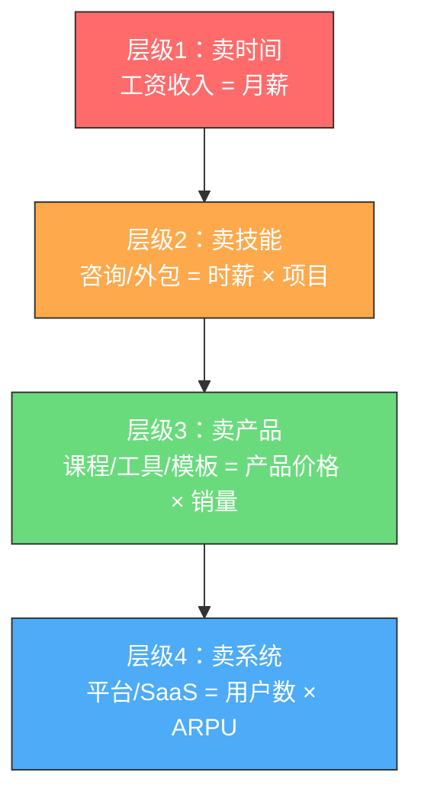
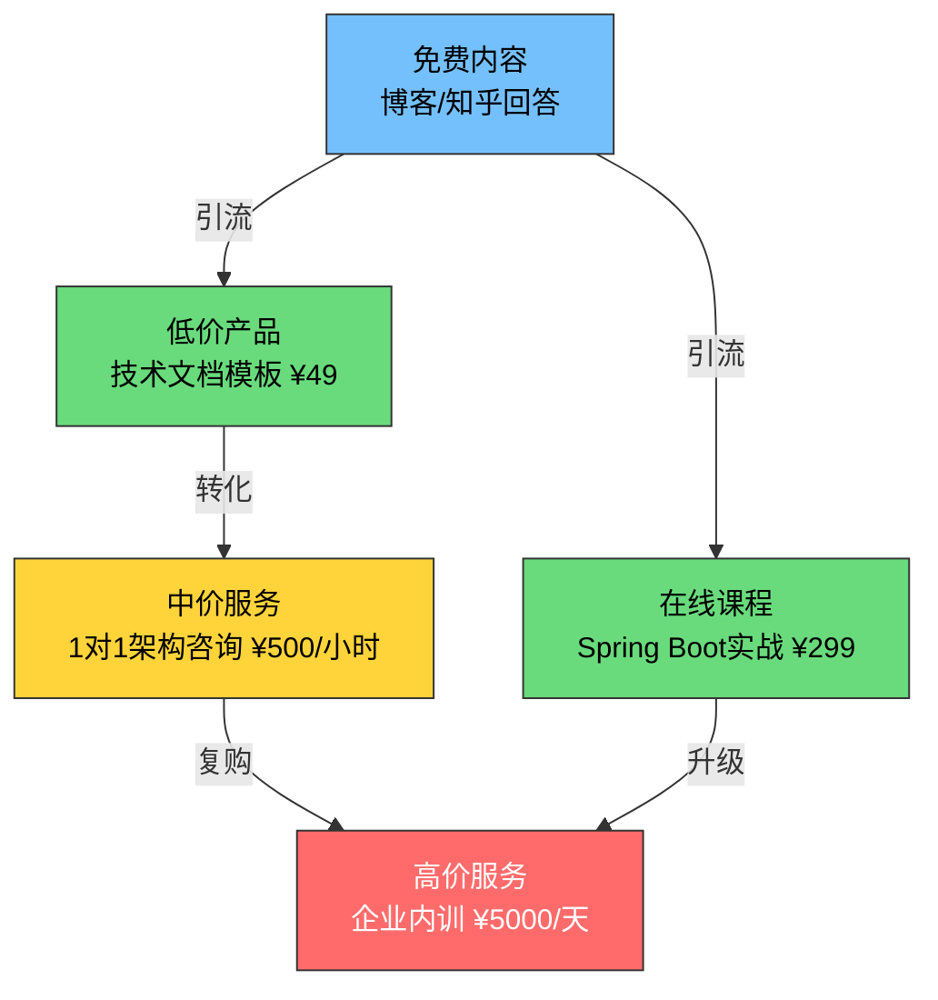
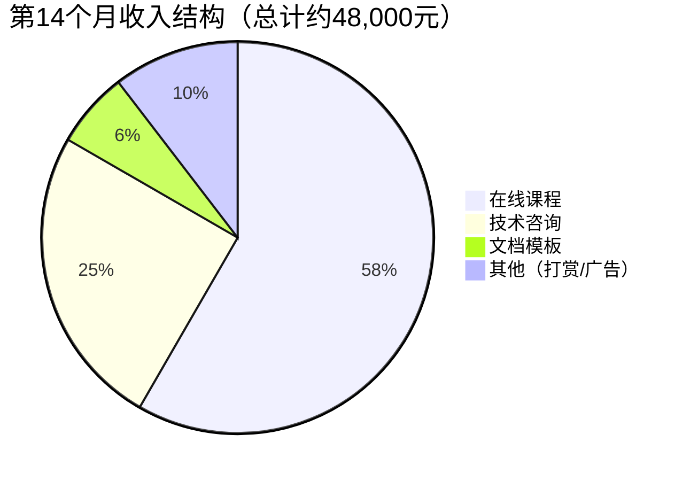
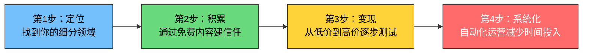

# 案例一：从程序员到技术创业者的商业模式升级

> "程序员最大的误区，是以为技术能力等于商业价值。真正的跃迁，是把技术能力封装成可规模化的产品。"

本案例追踪一位互联网公司后端工程师从月薪2万的主动收入模式，经过18个月的系统性升级，最终构建起月收入12万+的多元收入体系的完整过程。这不是一个"一夜暴富"的故事，而是一套可复制的商业模式升级方法论。

---

## 一、案例背景：起点画像

### 1.1 人物档案

| 维度 | 详情 |
|------|------|
| 化名 | 陈工 |
| 年龄 | 29岁 |
| 职业 | 某中型互联网公司后端工程师 |
| 工作年限 | 5年 |
| 技术栈 | Java/Spring Boot、MySQL、Redis、Docker/K8s |
| 月薪 | 税前22,000元（到手约17,500元） |
| 每月结余 | 约3,000-4,000元 |
| 所在城市 | 杭州 |
| 学历 | 本科，计算机科学专业 |

### 1.2 启动前的困境分析

陈工面临的问题，是绝大多数程序员在职业中期都会遇到的：

**收入天花板明显**：在杭州，5年经验的后端工程师薪资中位数约20-25K。要突破30K，要么晋升为技术主管（需要管理能力），要么跳槽到大厂（竞争激烈且加班严重）。两条路都充满不确定性。

**时间被锁死**：每天9:30-20:00在公司，通勤1小时，留给自己的时间只有晚上21:00-23:00和周末。这2-3小时的"自由时间"，是他唯一的突破口。

**资产为零**：工作5年，存款约15万。没有房产（杭州房价高），没有投资经验，没有任何被动收入来源。他的收入模式是纯粹的"主动收入"——不写代码就没有钱。

**认知局限**：他以为"赚更多钱"的唯一路径是"写更多代码"或"学更牛的技术"。这个认知偏差，锁死了他的想象力。

### 1.3 转折触发点

2023年3月，陈工的公司进行了一轮裁员。虽然他没有被裁，但他亲眼看到身边几位同事——包括一位技术比他更强的同事——被优化。这件事给了他两个冲击：

1. **安全感是幻觉**：你以为的"铁饭碗"，在公司眼里只是一个成本项
2. **技术能力不等于不可替代性**：那位被裁的同事技术更强，但他的岗位更容易被外包替代

从那一刻起，陈工开始认真思考：**如何把我的技术能力转化成不依赖雇主的收入？**

---

## 二、诊断框架：程序员的商业模式升级路径

在讲陈工的具体行动之前，先建立一个分析框架。这是理解整个案例的关键。

### 2.1 程序员收入的四个层级



| 层级 | 收入公式 | 时间投入 | 收入上限 | 被动程度 |
|------|---------|---------|---------|---------|
| 层级1：卖时间 | 月薪 | 全职 | 3-5万/月 | 0% |
| 层级2：卖技能 | 时薪 × 项目 | 兼职 | 5-15万/月 | 10-20% |
| 层级3：卖产品 | 产品价格 × 销量 | 前期投入 | 10-50万/月 | 60-80% |
| 层级4：卖系统 | 用户数 × ARPU | 构建期 | 无上限 | 80-95% |

陈工的起点在层级1，目标是在18个月内到达层级3，并在36个月内触及层级4。

### 2.2 商业模式画布分析

在开始行动之前，陈工用个人商业模式画布对自己做了一次全面梳理：

| 模块 | 分析结果 |
|------|---------|
| **关键资源** | Java/Spring Boot深度经验、分布式系统设计能力、5年大厂项目经验 |
| **关键活动** | 技术博客写作、开源项目维护、技术咨询 |
| **价值主张** | 帮助中小团队用大厂级架构解决技术难题，成本降低60% |
| **客户群体** | 初创公司CTO、传统企业技术负责人、自学编程的初中级开发者 |
| **渠道** | 技术社区（掘金/知乎）、GitHub、微信公众号 |
| **客户关系** | 咨询（一对一）、课程（一对多）、工具（自动化） |
| **收入来源** | 咨询费、课程收入、工具授权费 |
| **成本结构** | 时间成本（晚上+周末）、工具成本（约500元/月）、学习成本 |

---

## 三、执行过程：18个月的升级路线

### 3.1 第一阶段：积累势能（第1-3个月）

**核心策略**：通过免费内容建立专业影响力，验证市场需求。

#### 3.1.1 定位选择

陈工没有选择"泛编程"方向（竞争太激烈），而是聚焦在一个细分领域：**Spring Boot企业级项目架构设计**。

选择这个定位的逻辑：

1. **需求真实**：大量中小企业在数字化转型中需要架构指导，但请不起大厂架构师
2. **壁垒存在**：5年实战经验是真实的护城河，不是看几篇文章就能复制的
3. **内容可扩展**：从博客→课程→咨询→工具，升级路径清晰
4. **竞争相对小**：大多数技术博主在写"入门教程"，深度架构内容供给不足

#### 3.1.2 内容矩阵搭建

陈工制定了一个内容产出计划：

| 平台 | 频率 | 内容类型 | 目标 |
|------|------|---------|------|
| 掘金 | 每周2篇 | 技术深度文章（2000-5000字） | 建立专业形象 |
| GitHub | 每月1个 | 开源项目/工具 | 建立技术信任 |
| 知乎 | 每周3-5个 | 回答技术问题 | 引流到博客 |
| 微信公众号 | 每周1篇 | 精选文章+个人思考 | 沉淀私域流量 |

**关键动作**：他把工作中遇到的真实问题（经过脱敏处理）写成文章。这些内容天然有实战价值，比泛泛而谈的"教程"更有说服力。

#### 3.1.3 第一阶段成果

| 指标 | 第1个月 | 第2个月 | 第3个月 |
|------|---------|---------|---------|
| 掘金粉丝 | 120 | 480 | 1,200 |
| GitHub Star | 15 | 120 | 380 |
| 公众号关注 | 50 | 200 | 600 |
| 知乎关注 | 80 | 350 | 900 |
| 月收入 | 0元 | 0元 | 0元 |

这个阶段没有任何收入。陈工的朋友问他："你每天晚上写文章，一分钱不赚，图什么？"

他的回答是：**"我在建管道。管道建好了，水自然会来。"**

### 3.2 第二阶段：启动变现（第4-8个月）

**核心策略**：从免费内容过渡到付费服务，验证付费意愿。

#### 3.2.1 变现路径设计

陈工设计了一个"漏斗式"变现模型：



#### 3.2.2 第一个付费产品：技术文档模板包

陈工发现，很多初中级开发者在写项目文档时非常痛苦——他们不知道该怎么写技术方案、架构设计文档、代码评审标准。于是他把自己工作中积累的文档模板整理成了一个"Spring Boot企业级项目文档模板包"，定价49元。

**模板包内容**：
- 技术方案文档模板（含3个真实案例）
- 架构设计文档模板（含UML图模板）
- 数据库设计文档模板
- API接口文档模板
- 代码评审Checklist
- 性能测试报告模板
- 故障复盘报告模板

**关键细节**：每个模板都不是空壳，而是附带了一个真实案例的填写示范。这让买家一看就知道"原来应该这样写"，立即产生使用价值。

**第4个月数据**：卖出87份，收入4,263元。这是陈工的第一笔非工资收入。

#### 3.2.3 第一次付费咨询

第5个月，一位初创公司CTO通过掘金私信联系陈工，问能否帮忙做一次架构评审。陈工开价500元/小时（当时心里其实没底），对方爽快答应了。

这次咨询持续了2小时，陈工帮他发现了3个严重的架构问题：
1. 数据库连接池配置不合理，高并发下会崩溃
2. 缓存策略有缺陷，会出现缓存雪崩
3. 服务拆分粒度不对，导致不必要的网络开销

对方当场转了1000元，并且在朋友圈发了一条推荐。这个推荐带来了后续5个咨询客户。

**第4-8个月收入明细**：

| 月份 | 文档模板 | 技术咨询 | 掘金打赏 | 合计 |
|------|---------|---------|---------|------|
| 第4月 | 4,263 | 0 | 120 | 4,383 |
| 第5月 | 2,100 | 1,000 | 180 | 3,280 |
| 第6月 | 1,800 | 3,000 | 250 | 5,050 |
| 第7月 | 1,500 | 4,500 | 300 | 6,300 |
| 第8月 | 1,200 | 6,000 | 350 | 7,550 |

注意文档模板的收入在递减——这是正常的，因为市场在饱和。但咨询收入在快速上升，说明口碑在扩散。

### 3.3 第三阶段：产品化放大（第9-14个月）

**核心策略**：将咨询经验封装成可规模化销售的在线课程。

#### 3.3.1 课程开发

陈工用了2个月时间（第9-10个月），把前几个月咨询中最常被问到的问题整理成了一套系统课程：**《Spring Boot企业级架构实战：从单体到微服务》**。

**课程结构**（12章，48节课，总时长约20小时）：

| 章节 | 内容 | 时长 |
|------|------|------|
| 第1章 | 课程导学与架构思维建立 | 1.5h |
| 第2章 | Spring Boot项目结构最佳实践 | 2h |
| 第3章 | 数据库架构设计与优化 | 2.5h |
| 第4章 | 缓存架构设计（Redis实战） | 2h |
| 第5章 | 消息队列架构设计（RabbitMQ/Kafka） | 2h |
| 第6章 | 分布式事务解决方案 | 2h |
| 第7章 | 服务拆分与微服务架构 | 2.5h |
| 第8章 | API网关与服务治理 | 1.5h |
| 第9章 | 高可用架构设计 | 2h |
| 第10章 | 性能优化实战 | 2h |
| 第11章 | 监控与故障排查 | 1.5h |
| 第12章 | 真实项目案例实战 | 2.5h |

**定价策略**：原价399元，早鸟价299元（前100名）。

**课程的核心竞争力**：
1. **不是理论堆砌**：每一节课都有可运行的代码Demo
2. **不是入门教程**：直接讲企业级场景，面向有1-3年经验的开发者
3. **不是照本宣科**：每个知识点都附带"踩坑记录"——这些坑是陈工在真实项目中踩过的

#### 3.3.2 课程推广策略

陈工没有花钱投广告，而是用了"内容引流+社群裂变"的组合拳：

**内容引流**：
- 在掘金发布了一篇《我如何从月薪2万到月入5万：一个后端工程师的副业之路》（阅读量12,000+）
- 在知乎回答了"Spring Boot架构师需要掌握哪些技能？"（获得2,300赞同）
- 在GitHub开源了一个课程配套的Demo项目（获得500+ Star）

**社群裂变**：
- 建了一个微信交流群，购买课程即可加入
- 群内每周做一次免费直播答疑
- 老学员推荐新学员，双方各获50元优惠券

**关键数据**：
- 上线首月：卖出210份，收入约62,790元
- 上线第3个月：累计卖出580份，累计收入约173,420元
- 复购率（购买文档模板的用户再买课程）：约35%

#### 3.3.3 收入结构变化

从第9个月开始，陈工的收入结构发生了质变：



**关键指标对比**：

| 指标 | 第3个月 | 第8个月 | 第14个月 |
|------|---------|---------|---------|
| 月总收入 | 0元 | 7,550元 | 48,000元 |
| 主动收入占比 | — | 80% | 25% |
| 被动收入占比 | — | 20% | 75% |
| 每小时收入 | — | 约150元 | 约800元 |
| 工作时间 | 每天2小时 | 每天2小时 | 每天1.5小时 |

注意：第14个月的工作时间反而减少了，因为课程是"一次录制，反复销售"，属于组合收入/被动收入。

### 3.4 第四阶段：系统化运营（第15-18个月）

**核心策略**：建立自动化运营系统，减少个人时间投入。

#### 3.4.1 产品矩阵扩展

陈工开始扩展产品线：

| 产品 | 定价 | 目标客户 | 变现方式 |
|------|------|---------|---------|
| 入门文档模板包 | ¥49 | 初级开发者 | 引流+低价转化 |
| 进阶文档模板包 | ¥99 | 中级开发者 | 利润产品 |
| 系统课程（基础版） | ¥299 | 1-3年经验 | 核心利润产品 |
| 系统课程（高级版） | ¥599 | 3-5年经验 | 高利润产品 |
| 1对1架构咨询 | ¥800/小时 | CTO/技术负责人 | 高端服务 |
| 企业内训 | ¥8,000/天 | 传统企业 | B端收入 |
| 技术社群年费 | ¥299/年 | 持续学习者 | 稳定现金流 |

#### 3.4.2 自动化运营

陈工把重复性工作逐步自动化：

**内容分发自动化**：写一篇文章，自动同步到掘金、知乎、公众号、CSDN四个平台。工具：自己写了一个Python脚本，调用各平台的API（部分平台需要逆向）。

**客户服务自动化**：常见问题整理成FAQ，用ChatGPT搭建了一个自动回复机器人。80%的售前咨询可以自动回答。

**销售漏斗自动化**：
- 免费文章底部自动放置课程广告
- 文档模板包购买后自动发送课程优惠券
- 课程学员自动加入微信群
- 每周自动发送学习提醒邮件

#### 3.4.3 第18个月最终数据

| 指标 | 起步时（第1个月） | 成熟后（第18个月） | 增幅 |
|------|-----------------|-----------------|------|
| 月总收入 | 0元 | 120,000元 | — |
| 其中：课程收入 | 0 | 65,000元 | — |
| 其中：咨询收入 | 0 | 25,000元 | — |
| 其中：模板收入 | 0 | 12,000元 | — |
| 其中：社群收入 | 0 | 10,000元 | — |
| 其中：其他收入 | 0 | 8,000元 | — |
| 被动收入占比 | 0% | 72% | — |
| 每日工作时间 | 2小时 | 1.5小时 | 减少25% |
| 付费用户总数 | 0 | 2,800+ | — |
| 微信社群成员 | 0 | 1,500+ | — |
| 掘金粉丝 | 0 | 18,000+ | — |
| GitHub Star | 0 | 3,200+ | — |

---

## 四、关键转折点复盘

### 4.1 五个关键决策

在整个升级过程中，有五个决策起到了决定性作用：

**决策1：聚焦细分领域而非泛编程**

很多程序员做自媒体的误区是什么都写——今天写Python，明天写Go，后天写算法。陈工一开始就聚焦"Spring Boot企业级架构"，这让他的内容形成了体系，也让目标受众能够清晰地识别他。

> 专业定位的公式：**技术栈 + 场景 + 受众**
> 
> 例：Spring Boot + 企业级架构 + 中级开发者

**决策2：先免费后付费，先内容后产品**

陈工花了3个月做免费内容，没有急着变现。这3个月的积累，让他在启动付费时有了足够的信任基础。如果一开始就卖东西，很可能无人问津。

**决策3：从咨询中提炼产品**

课程不是凭空设计的，而是从真实咨询中提炼出来的。这让课程内容天然贴近用户需求——因为需求已经被验证过了。

**决策4：定价不低**

陈工的课程定价299元，在技术课程中属于中高价位。低价课程（9.9元/19.9元）虽然容易卖，但会吸引大量"伸手党"，他们买了不看，看了不做，做了不反馈。中高价位筛选出了真正有需求、有行动力的用户，这些用户的反馈和口碑传播，反而带来了更多销售。

**决策5：建立社群而非单向输出**

微信社群不只是"售后群"，而是一个学习社区。陈工每周在群里做免费直播答疑，学员之间也互相帮助。这种社区黏性，让复购率和推荐率远高于"卖完即走"的模式。

### 4.2 三个关键认知升级

**认知升级1：从"技术思维"到"产品思维"**

程序员习惯的思维是："我能做什么技术？"产品思维是："用户需要什么解决方案？"

陈工的文档模板包之所以卖得好，不是因为模板本身有多牛，而是因为他精准地解决了"写文档不知道怎么写"这个痛点。技术只是手段，解决问题才是价值。

**认知升级2：从"一对一"到"一对多"**

咨询是典型的一对一服务——你服务一个客户，就消耗一份时间。课程是一对多——你录制一次，可以卖给无限多的人。这就是从"卖时间"到"卖产品"的本质转变。

**认知升级3：从"做事"到"建系统"**

前期陈工什么都自己做——写文章、录课程、回复咨询、管理社群。后期他开始建立系统：自动分发内容、自动回复常见问题、自动管理社群。这让他从"系统中的操作员"变成了"系统的设计者"。

---

## 五、可复制的方法论

### 5.1 程序员商业模式升级四步法

基于陈工的案例，提炼出一套可复制的方法论：



**第1步：定位（第1周）**

问自己三个问题：
1. 我最擅长什么技术？（能力维度）
2. 这个技术在市场上有什么需求？（市场维度）
3. 现有内容供给是否已经饱和？（竞争维度）

三者的交集，就是你的定位。

**第2步：积累（第1-3个月）**

- 选择1-2个主阵地（推荐：掘金/知乎 + GitHub）
- 每周产出2-3篇深度内容
- 不急着变现，专注于提供价值
- 目标：3个月后有1000+精准粉丝

**第3步：变现（第4-8个月）**

- 先做低价产品（文档模板/电子书，49-99元）验证付费意愿
- 再做中价服务（1对1咨询，300-800元/小时）
- 最后做高价产品（系统课程，299-599元）
- 每个阶段都要收集用户反馈，迭代产品

**第4步：系统化（第9个月以后）**

- 把重复性工作自动化
- 建立内容分发矩阵
- 搭建销售漏斗
- 逐步减少个人时间投入

### 5.2 收入公式拆解

程序员副业收入的通用公式：

```text
月收入 = 内容触达人数 × 付费转化率 × 客单价 × 复购系数
```

以陈工第18个月的数据为例：
- 内容触达人数：约50,000人/月（各平台文章总阅读量）
- 付费转化率：约2%（1,000人进入付费漏斗）
- 客单价：约120元（加权平均）
- 复购系数：1.6（老客户复购带来的倍增）

计算：50,000 × 2% × 120 × 1.6 = 192,000元（理论值，实际约12万，因为有退款和渠道损耗）

**优化方向**：
- 提高触达：产出更多内容、拓展更多平台
- 提高转化：优化销售页面、增加信任背书
- 提高客单价：升级产品、提供增值服务
- 提高复购：建立社群、持续提供价值

---

## 六、常见误区与纠正

### 误区1："我技术不够强，做不了"

**真相**：你不需要是技术大牛才能做。你需要的是比你的目标受众领先1-2步。一个3年经验的程序员，完全有能力教1年经验的人。陈工也不是架构师，他只是把自己踩过的坑整理出来而已。

### 误区2："等我准备好了再开始"

**真相**：永远没有"准备好"的那一天。陈工的第一篇文章写得很烂，第一版课程有很多问题。但他边做边改，在实战中迭代。"完成"比"完美"重要100倍。

### 误区3："做副业会影响主业"

**真相**：前3个月确实会占用一些业余时间。但从第4个月开始，副业的收入反而给了陈工更大的安全感和谈判筹码。他在第12个月跳槽到了一家更好的公司——因为他的副业让他有了"不怕被裁"的底气。

### 误区4："技术内容没人看"

**真相**：浅显的技术内容确实竞争激烈。但深度的、实战的、有体系的技术内容，供给严重不足。陈工的一篇《Spring Boot在千万级并发下的架构优化实践》，阅读量超过5万——因为这种内容太稀缺了。

### 误区5："做自媒体就要天天更新"

**真相**：质量远比数量重要。陈工每周只更新2-3篇文章，但每篇都是2000字以上的深度内容。稳定且高质量的更新频率，比日更但质量参差不齐效果好得多。

---

## 七、进阶思考：从副业到创业

### 7.1 什么时候应该全职做？

陈工在第18个月时面临一个选择：副业收入已经远超工资（12万 vs 2.2万），是否应该辞职全职做？

他用了一个决策框架：

| 条件 | 要求 | 陈工的情况 |
|------|------|----------|
| 副业收入 > 工资收入 × 2 | 连续6个月 | 满足（连续8个月） |
| 现金储备 > 12个月生活费 | 必须 | 满足（约30万） |
| 副业有清晰的增长路径 | 必须 | 满足（企业内训+SaaS工具） |
| 家庭支持 | 必须 | 满足（未婚，父母支持） |
| 社保/医保有替代方案 | 必须 | 满足（灵活就业社保） |

所有条件都满足后，陈工在第20个月辞职，正式创业。

### 7.2 下一步：从个人到团队

创业后的第一件事，是招聘第一个员工——一位负责社群运营和内容编辑的助理。这让陈工能够专注于更高价值的工作：课程研发、企业内训、产品设计。

**团队扩张路径**：
- 第1个员工：社群运营+内容编辑（月薪6,000-8,000元）
- 第2个员工：视频剪辑+课程制作（月薪8,000-10,000元）
- 第3个员工：销售+BD（底薪+提成）
- 第4个员工：全栈开发（做SaaS工具）

### 7.3 长期价值：个人IP的复利

陈工最大的资产，不是他的课程或模板，而是他的**个人品牌**。这个品牌的价值会随时间复利增长：

- 今天写的一篇文章，3年后还会带来新学员
- 今天服务的一个客户，3年后可能成为企业内训的决策者
- 今天积累的10,000个粉丝，3年后可能是20,000甚至50,000

这就是"个人商业模式升级"的终极形态：**你不再是一个人，而是一个品牌、一个系统、一个生态。**

---

## 八、本案例的核心启示

| 启示 | 说明 |
|------|------|
| 技术是手段，不是目的 | 用户买的是解决方案，不是你的技术有多牛 |
| 先提供价值，再获取回报 | 3个月免费内容积累，换来后续12个月的付费爆发 |
| 从咨询中提炼产品 | 用真实需求验证产品方向，降低失败风险 |
| 定价不要太低 | 低价吸引伸手党，中高价筛选优质客户 |
| 建立系统而非依赖个人 | 自动化运营是减少时间投入、提高收入上限的关键 |
| 个人品牌是终极资产 | 它会随时间复利增长，是最持久的竞争壁垒 |

> **最后的话**：陈工的故事不是个例。在中国，有成千上万的程序员正在走类似的路。他们不是天才，也不是运气好，只是比大多数人早一步理解了"个人商业模式升级"的底层逻辑，并且付诸行动。如果你想复制这条路径，现在就开始——不需要辞职，不需要投入资金，只需要每天2小时的业余时间，和一颗愿意"先付出后回报"的心。

---

**与本章其他内容的关联**：
- 本案例对应第2.4节"个人商业模式升级"的理论框架，展示了从层级1（卖时间）到层级3（卖产品）的完整升级路径
- 收入结构变化印证了第2.1节"收入的三种类型"：从100%主动收入到72%被动收入的转变
- 资产积累过程对应第2.2节"资产与负债的重新定义"：课程、社群、个人品牌都是"生钱资产"
- 决策框架中提到的"认知升级"，呼应了第2.5节"认知变现的底层逻辑"
