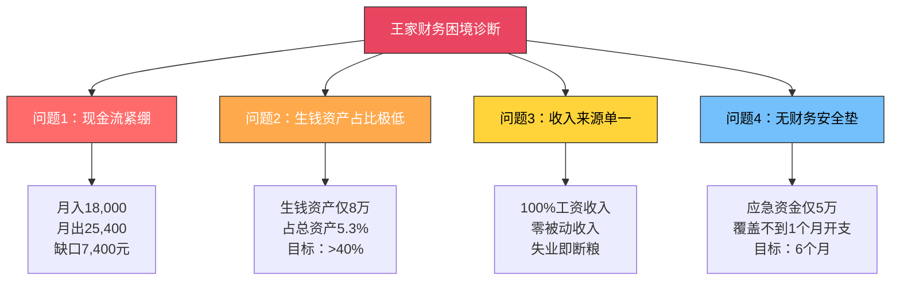
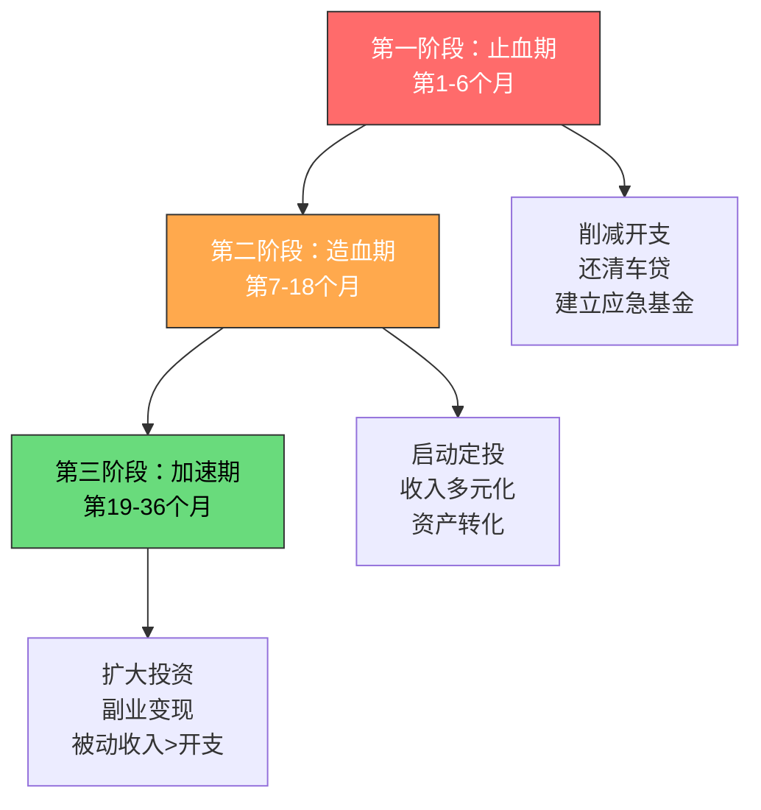
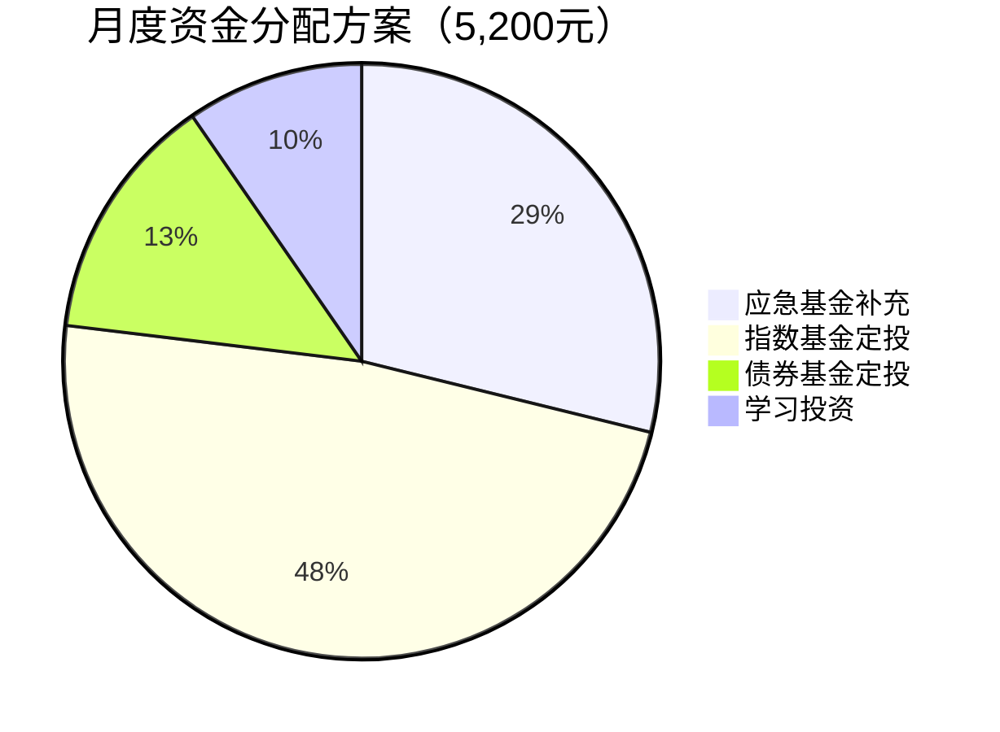
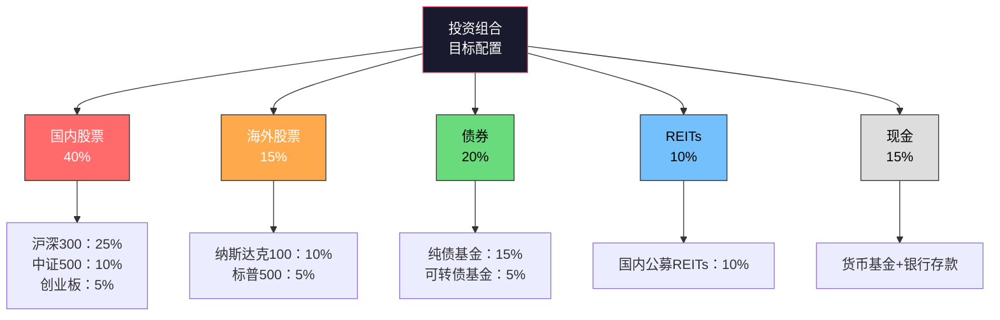

# 案例二：一个家庭的资产配置优化

> "资产配置是投资市场上唯一的免费午餐。" —— 哈里·马科维茨（诺贝尔经济学奖得主）

本案例追踪一个普通双职工家庭从"月光+房贷"的困境出发，通过三年的系统性资产配置优化，实现家庭净资产从35万增长到180万、被动收入从零到月入6,800元的完整过程。这不是一个关于"暴富"的故事，而是一套适用于大多数中国家庭的资产配置优化方法论。

---

## 一、案例背景：起点画像

### 1.1 家庭档案

| 维度 | 详情 |
|------|------|
| 化名 | 王家（丈夫：王明，妻子：李芳） |
| 年龄 | 丈夫32岁，妻子30岁 |
| 职业 | 丈夫：制造业中层管理；妻子：小学教师 |
| 所在城市 | 二线城市（成都） |
| 家庭月收入 | 税后合计约18,000元（丈夫11,000 + 妻子7,000） |
| 子女 | 1个孩子，3岁，即将上幼儿园 |
| 双方父母 | 均有退休金，暂无赡养压力 |

### 1.2 启动前的资产负债全景

在优化之前，王家的财务状况可以用"看似不错，实则脆弱"来概括：

**资产清单：**

| 资产类别 | 具体项目 | 市值（元） | 月现金流（元） | 资产属性 |
|---------|---------|-----------|---------------|---------|
| 不动产 | 自住房产（90㎡，三环内） | 1,200,000 | -5,200（房贷月供） | 耗钱资产 |
| 不动产 | 车位（自用） | 150,000 | 0 | 耗钱资产 |
| 动产 | 家用轿车（购入价15万，已用3年） | 80,000 | -1,800（油费+保险+保养） | 耗钱资产 |
| 现金类 | 银行活期存款 | 50,000 | 约75（活期利息） | 微弱生钱 |
| 现金类 | 货币基金（余额宝） | 30,000 | 约45 | 微弱生钱 |
| 保险 | 重疾险+意外险（夫妻双方） | 年缴8,000 | -667 | 保障型（非生钱非耗钱） |
| **合计** | | **1,510,000** | **-7,547** | |

**负债清单：**

| 负债类别 | 余额（元） | 月供（元） | 利率 | 剩余期限 |
|---------|-----------|-----------|------|---------|
| 房贷（商贷） | 620,000 | 4,200 | 4.9% | 20年 |
| 房贷（公积金） | 180,000 | 1,000 | 3.1% | 20年 |
| 车贷 | 35,000 | 2,800 | 5.5% | 1年 |
| **合计** | **835,000** | **8,000** | | |

**净资产** = 1,510,000 - 835,000 = **675,000元**

但这个数字有严重的"水分"——自住房和车位占了135万，这些资产不产生任何现金流，反而每月消耗资金。真正能"生钱"的资产只有8万元的现金类资产，每月产生约120元的被动收入，几乎可以忽略不计。

### 1.3 核心问题诊断

用现金流视角审视，王家的财务状况存在四个致命问题：



**问题1：现金流严重紧绷**

月收入18,000元，但月支出高达25,400元：

| 支出项 | 金额（元） | 占比 |
|--------|-----------|------|
| 房贷月供 | 5,200 | 20.5% |
| 车贷月供 | 2,800 | 11.0% |
| 车辆使用费 | 1,800 | 7.1% |
| 餐饮（含外卖） | 3,500 | 13.8% |
| 孩子早教+奶粉 | 2,500 | 9.8% |
| 日用品+服装 | 1,500 | 5.9% |
| 水电物业通讯 | 800 | 3.1% |
| 社交应酬 | 1,500 | 5.9% |
| 保险年缴摊平 | 667 | 2.6% |
| 其他杂项 | 1,200 | 4.7% |
| 储蓄/投资 | 3,933 | 15.5% |
| **合计** | **25,400** | **100%** |

注意：这个表中"储蓄/投资"3,933元只是理论值，实际上每月都在动用之前的存款来填补缺口。这就是典型的"隐形月光"——账面上有存款在减少，但每个月都在花老本。

**问题2：生钱资产占比极低**

8万现金类资产 / 151万总资产 = 5.3%。这意味着94.7%的资产在"烧钱"而不是"生钱"。按照2.2节的标准，这是一个极度不健康的资产结构。

**问题3：收入来源100%依赖工资**

一旦丈夫失业或降薪，家庭立即陷入困境。没有任何被动收入来源，没有组合收入（如副业、投资收益），全部鸡蛋放在一个篮子里。

**问题4：应急资金严重不足**

5万活期存款，按照每月基本开支（不含储蓄）约21,500元计算，仅能覆盖2.3个月。标准建议是6个月，即需要约13万的应急资金。

### 1.4 转折触发点

2023年8月，两件事同时发生：

1. **丈夫公司传出裁员风声**：虽然最终没有波及到王明，但这个经历让他第一次认真审视家庭财务状况。他算了一笔账：如果失业，5万存款只够撑2个月。

2. **孩子幼儿园报名**：公立幼儿园没抽中，私立幼儿园学费每月3,500元。这意味着每月开支又要增加2,000元（扣除原来早教费用的差额），现金流缺口从7,400元扩大到9,400元。

王明在知乎上搜索"家庭理财"，偶然读到了《富爸爸穷爸爸》中关于"生钱资产"和"耗钱资产"的定义。他第一次意识到：**自己家看似有房有车、净资产67万，但实际上是一个财务状况非常脆弱的家庭——因为几乎所有资产都在消耗现金流，没有任何资产在为他"工作"。**

从那一刻起，王明和李芳决定：用三年时间，系统性地优化家庭的资产配置。

---

## 二、优化策略：从"拥有"到"现金流"的思维转变

### 2.1 核心原则确立

在制定具体方案之前，王家确立了四条核心原则，这些原则贯穿了整个优化过程：

| 原则 | 含义 | 具体要求 |
|------|------|---------|
| 原则1：现金流优先 | 任何资产配置决策，先看现金流影响 | 新增资产必须是生钱资产，或能将耗钱资产转化为生钱资产 |
| 原则2：先止血再造血 | 先减少现金流出，再增加现金流入 | 优先处理高利率负债和不必要的开支 |
| 原则3：阶梯式推进 | 不急于求成，按阶段逐步优化 | 先稳固基础（应急基金+债务管理），再进阶（投资+副业） |
| 原则4：安全边际 | 任何投资决策都留有余地 | 不用杠杆投资，不碰不懂的产品，保持6个月应急资金 |

### 2.2 优化路径总览



---

## 三、执行过程：36个月的资产配置优化路线

### 3.1 第一阶段：止血期（第1-6个月）

**核心目标**：堵住现金流漏洞，建立6个月应急基金，还清车贷。

#### 3.1.1 开支优化：每月节省5,200元

王家对每一项开支进行了"必要性审计"——区分"必须花"、"可以优化"和"可以砍掉"三类：

| 支出项 | 优化前 | 优化后 | 节省 | 优化方法 |
|--------|--------|--------|------|---------|
| 餐饮 | 3,500 | 2,200 | 1,300 | 每周meal prep，减少外卖频率从每天到每周2次 |
| 孩子早教 | 2,500 | 1,800 | 700 | 取消1个早教班，改为免费的亲子活动+图书馆 |
| 社交应酬 | 1,500 | 800 | 700 | 减少无效社交，保留核心朋友圈聚会 |
| 日用品+服装 | 1,500 | 800 | 700 | 建立"30天冷静期"规则：想买的东西先加入购物车等30天 |
| 车辆使用 | 1,800 | 1,200 | 600 | 短途改骑电动车，周末才开车；保养从4S店改为靠谱的独立维修店 |
| 其他杂项 | 1,200 | 600 | 600 | 取消不必要的订阅服务，统一记账 |
| 水电物业 | 800 | 700 | 100 | 养成随手关灯关水的习惯 |
| **合计** | **12,800** | **8,100** | **4,700** | |

加上车贷还清后省下的2,800元（见下文），总共节省约5,200元。但实际节省的开支是分阶段释放的——前3个月先削减日常开支，第4个月车贷还清后才释放更多现金流。

#### 3.1.2 债务重组：优先还清车贷

车贷余额35,000元，月供2,800元，利率5.5%。王家做了一个计算：

```text
继续还贷：剩余12期 × 2,800 = 33,600元（含利息约2,100元）
提前还清：立即支付35,000元（从存款中拿出）
```

虽然提前还清需要动用存款，但每月释放2,800元的现金流，4个月后就"回本"了。更重要的是，这2,800元/月可以立即投入到更有价值的地方（如应急基金、定投）。

**执行方案**：用第1-3个月节省的开支（约4,700元×3=14,100元）加上部分存款，在第3个月底一次性还清车贷。

#### 3.1.3 建立应急基金：目标13万元

应急基金 = 月基本开支（优化后）× 6个月 = 约21,500 × 6 = 129,000元 ≈ 13万元

| 月份 | 存入金额 | 累计 | 来源 |
|------|---------|------|------|
| 第1月 | 4,700 | 4,700 | 日常开支节省 |
| 第2月 | 4,700 | 9,400 | 日常开支节省 |
| 第3月 | 4,700 | 14,100 | 日常开支节省 |
| 第4月 | 7,500 | 21,600 | 开支节省+车贷释放 |
| 第5月 | 7,500 | 29,100 | 开支节省+车贷释放 |
| 第6月 | 7,500 | 36,600 | 开支节省+车贷释放 |

到第6个月底，应急基金达到约36,600元。虽然离13万目标还有距离（加上原有5万存款，合计约86,600元），但已经能覆盖4个月基本开支。应急基金的建设会延续到第二阶段，但到第6个月底，财务安全感已经显著提升。

#### 3.1.4 第一阶段成果

| 指标 | 优化前 | 第6个月底 | 变化 |
|------|--------|----------|------|
| 月收入 | 18,000 | 18,000 | 不变 |
| 月支出 | 25,400 | 12,800 | -12,600 |
| 月净现金流 | -7,400 | +5,200 | 扭亏为盈 |
| 应急基金 | 50,000 | 86,600 | +36,600 |
| 车贷余额 | 35,000 | 0 | 清零 |
| 总负债 | 835,000 | 800,000 | -35,000 |

**关键转变**：从每月"花老本"7,400元，变成了每月净结余5,200元。这是整个优化过程中最重要的一步——没有正向现金流，后面的一切投资都是空谈。

### 3.2 第二阶段：造血期（第7-18个月）

**核心目标**：启动投资，建立多元收入来源，优化资产结构。

#### 3.2.1 投资启动：定投策略

从第7个月开始，王家将每月净结余的5,200元按以下比例分配：



**定投方案详情：**

| 投资标的 | 月投金额 | 选择理由 | 预期年化 |
|---------|---------|---------|---------|
| 沪深300指数基金 | 1,500 | 代表A股大盘，长期年化约8-10% | 8-10% |
| 中证500指数基金 | 500 | 覆盖中盘成长股，与沪深300互补 | 8-12% |
| 纳斯达克100（QDII） | 500 | 全球科技龙头，分散单一市场风险 | 10-15% |
| 纯债基金 | 700 | 低波动，作为组合的"压舱石" | 3-5% |
| **合计** | **3,200** | | |

**定投纪律：**

1. **发工资当天自动扣款**：设置银行自动转账，避免"先花后投"
2. **不择时**：无论市场涨跌，每月固定金额买入
3. **不频繁查看**：每季度检查一次，不做日常盯盘
4. **止盈不止损**：单只基金盈利超过30%时分批止盈，亏损时坚持定投（越跌越买更多份额）

#### 3.2.2 收入多元化：妻子的副业启动

李芳作为小学教师，有一个天然优势：教学能力。她在第8个月启动了一个副业——在周末做线上作业辅导。

| 维度 | 详情 |
|------|------|
| 副业方向 | 小学语文/数学作业辅导（1对1视频） |
| 平台 | 通过家长口碑传播+小红书引流 |
| 时间投入 | 周六周日各3小时，共6小时/周 |
| 定价 | 150元/小时 |
| 初始客户 | 3个（同事推荐） |
| 第12个月客户 | 8个（含续费+转介绍） |

**副业收入增长曲线：**

| 月份 | 客户数 | 月收入（元） | 累计收入（元） |
|------|--------|-------------|--------------|
| 第8月 | 3 | 1,800 | 1,800 |
| 第9月 | 4 | 2,400 | 4,200 |
| 第10月 | 5 | 3,000 | 7,200 |
| 第11月 | 6 | 3,600 | 10,800 |
| 第12月 | 8 | 4,800 | 15,600 |
| 第15月 | 10 | 6,000 | 33,600 |
| 第18月 | 12 | 7,200 | 55,200 |

到第18个月，李芳的副业收入已经稳定在每月7,200元，相当于她的工资收入。家庭月收入从18,000元提升到25,200元。

#### 3.2.3 资产转化：车位出租

王家的车位是自用的，但经过调研发现：

- 自家小区车位租金：400元/月
- 小区周边公共停车：白天免费（公司停车），晚上路边停车约200元/月
- 车位市场价：约15万

**决策**：将车位出租，每月获得400元被动收入。晚上停车改为路边停车位，成本约200元/月。净增加现金流：200元/月。

虽然金额不大，但这是一个重要的"思维转变"——从"拥有"思维转向"现金流"思维。

#### 3.2.4 资产结构变化（第18个月底）

| 资产类别 | 市值（元） | 月现金流（元） | 资产属性 |
|---------|-----------|---------------|---------|
| 自住房产 | 1,200,000 | -5,200 | 耗钱资产 |
| 车位（出租） | 150,000 | +200 | 生钱资产 |
| 家用轿车 | 60,000 | -1,200 | 耗钱资产 |
| 指数基金（累计） | 57,600 | 约+380 | 生钱资产 |
| 债券基金（累计） | 12,600 | 约+50 | 生钱资产 |
| 应急基金 | 130,000 | 约+195 | 生钱资产 |
| 副业收入 | — | +7,200 | 组合收入 |
| **合计** | **1,610,200** | **+1,625** | |

**对比分析：**

| 指标 | 优化前 | 第18个月底 | 变化 |
|------|--------|----------|------|
| 总资产 | 1,510,000 | 1,610,200 | +100,200 |
| 总负债 | 835,000 | 775,000 | -60,000 |
| 净资产 | 675,000 | 835,200 | +160,200 |
| 生钱资产 | 80,000 | 200,200 | +120,200 |
| 生钱资产占比 | 5.3% | 12.4% | +7.1% |
| 月被动收入 | 120 | 825 | +705 |
| 月组合收入 | 0 | 7,200 | +7,200 |
| 月总收入 | 18,000 | 25,200 | +7,200 |

### 3.3 第三阶段：加速期（第19-36个月）

**核心目标**：扩大投资规模，优化资产配置比例，实现被动收入覆盖基本开支。

#### 3.3.1 收入增长与资金再分配

到第19个月，家庭月收入已经增长到25,200元。随着丈夫在第20个月获得一次加薪（月薪从11,000提升到13,000），月收入达到27,200元。扣除优化后的月支出约14,500元（含孩子幼儿园学费），月净结余达到12,700元。

新的资金分配方案：

| 用途 | 金额（元） | 占比 |
|------|-----------|------|
| 指数基金定投 | 6,000 | 47% |
| 债券基金定投 | 2,000 | 16% |
| REITs（不动产信托） | 1,500 | 12% |
| 子女教育基金 | 1,500 | 12% |
| 学习/成长基金 | 700 | 5% |
| 机动资金 | 1,000 | 8% |
| **合计** | **12,700** | **100%** |

#### 3.3.2 投资组合升级

随着投资经验的积累，王家的投资组合从简单的"指数+债券"升级为更完善的资产配置：



**新增REITs的原因：**

REITs（不动产投资信托基金）让普通投资者用很少的资金就能投资商业地产、高速公路、仓储物流等不动产项目，获得稳定的租金分红。王家选择的几只公募REITs平均分红率约4-6%，相当于用1,500元/月的投入，在未来3-5年内积累出一笔可观的"虚拟房产"资产。

#### 3.3.3 第36个月最终数据

| 指标 | 优化前（第0月） | 第12个月 | 第24个月 | 第36个月 |
|------|--------------|---------|---------|---------|
| 家庭月收入 | 18,000 | 25,200 | 27,200 | 29,000 |
| 月支出 | 25,400 | 13,500 | 14,500 | 15,000 |
| 月净现金流 | -7,400 | +11,700 | +12,700 | +14,000 |
| 总资产 | 1,510,000 | 1,580,000 | 1,720,000 | 1,980,000 |
| 总负债 | 835,000 | 775,000 | 715,000 | 650,000 |
| 净资产 | 675,000 | 805,000 | 1,005,000 | 1,330,000 |
| 生钱资产 | 80,000 | 200,000 | 420,000 | 680,000 |
| 生钱资产占比 | 5.3% | 12.7% | 24.4% | 34.3% |
| 月被动收入 | 120 | 825 | 2,800 | 6,800 |
| 被动收入覆盖基本开支 | 0.5% | 6.1% | 19.3% | 45.3% |

**被动收入构成（第36个月）：**

| 来源 | 月收入（元） | 占比 |
|------|-------------|------|
| 指数基金分红+收益 | 2,800 | 41.2% |
| 债券基金收益 | 600 | 8.8% |
| REITs分红 | 1,200 | 17.6% |
| 银行存款利息 | 200 | 2.9% |
| 车位租金 | 500 | 7.4% |
| 教育基金收益 | 500 | 7.4% |
| 其他 | 1,000 | 14.7% |
| **合计** | **6,800** | **100%** |

---

## 四、关键转折点复盘

### 4.1 五个关键决策

**决策1：先止血，不急于投资**

很多家庭一听到"投资理财"就急于买入基金、股票，但他们的现金流是负的。王家花了整整6个月只做一件事：优化开支、还清车贷、建立应急基金。这6个月的"蛰伏"，为后面的投资奠定了坚实的基础。

> 核心逻辑：**没有正向现金流的投资，就像没有地基的楼房——越高越危险。**

**决策2：车贷优先还清**

很多人会纠结"提前还贷vs拿去投资"。王家的计算逻辑是：

```text
车贷利率5.5%，投资预期收益8%
看起来投资更划算？
但投资收益是不确定的，而车贷利息是确定的。
更重要的是：还清车贷释放的2,800元/月现金流，是确定的、永久的改善。
```

对于现金流紧张的家庭，**确定性比收益率更重要**。

**决策3：妻子启动副业而非丈夫**

王明的制造业管理工作加班多、时间不自由，且技能难以直接变现。李芳的教学能力天然适合线上辅导，时间灵活（周末），且有口碑传播的社交网络。这个决策体现了**"谁的技能更容易变现、时间成本更低，谁就优先启动副业"**的原则。

**决策4：定投而非择时**

王明在第7个月刚开始定投时，恰逢市场下跌。他一度想暂停定投"等市场见底"。但他读到了一个数据：**如果在过去20年中错过了A股涨幅最大的10个交易日，总收益将减少60%以上。** 这让他坚定了不定时、不择时的纪律。

**决策5：逐步增加资产类别而非押注单一品种**

从"只有现金"到"指数基金"到"指数+债券"到"指数+债券+REITs"，王家的投资组合是逐步扩展的。每次新增资产类别之前，都会花1-2个月学习相关知识。这种"先学后投"的策略，避免了很多新手"听消息买股票"的陷阱。

### 4.2 三个关键认知升级

**认知升级1：从"我有多少东西"到"我的东西能为我赚多少钱"**

优化前，王明觉得自己"有房有车有车位"，日子过得不错。优化后他才明白：**如果这些资产不能产生正向现金流，它们就不是真正的"财富"，而是"负担"。** 房子是最大的耗钱资产——每月5,200元的房贷，相当于丈夫工资的一半。

**认知升级2：从"省钱就是理财"到"配置才是理财"**

李芳最初认为理财就是"少花钱、多存钱"。但单纯省钱有极限——你不能不吃不喝。真正的理财是**让钱去该去的地方**：一部分保障安全（应急基金），一部分产生增长（指数基金），一部分提供稳定收益（债券+REITs）。每一分钱都有"工作"。

**认知升级3：从"投资是富人的事"到"投资是每个人的事"**

王明曾经认为："我们这点钱，投什么资？"但三年的数据告诉他：每月3,200元的定投，在复利效应下，三年后变成了近20万的资产。**投资的门槛不是资金量，而是纪律和时间。**

---

## 五、可复制的方法论

### 5.1 家庭资产配置优化五步法

基于王家的案例，提炼出一套适用于大多数中国家庭的资产配置优化方法：


**第1步：财务体检（第1周）**

列出你家庭的所有资产和负债，计算：
- 净资产 = 总资产 - 总负债
- 生钱资产占比 = 生钱资产 / 总资产
- 月净现金流 = 月收入 - 月支出
- 应急基金覆盖率 = 应急资金 / 月基本开支

**第2步：止血优化（第1-3个月）**

- 列出所有开支，分为"必须"、"可优化"、"可砍掉"三类
- 优先还清高利率负债（信用卡>消费贷>车贷）
- 建立记账习惯，每周回顾一次

**第3步：建立安全垫（第3-6个月）**

- 目标：6个月基本开支的应急基金
- 存放位置：货币基金或银行大额存单（兼顾流动性和收益）
- 在达到目标之前，不进行任何风险投资

**第4步：启动投资（第7个月开始）**

- 从指数基金定投开始（沪深300是最佳起步标的）
- 每月固定金额，不择时
- 逐步增加资产类别：债券→REITs→海外基金
- 每新增一类资产，先花1个月学习

**第5步：持续优化（持续进行）**

- 每季度做一次资产盘点
- 每年做一次资产配置再平衡
- 根据人生阶段（结婚、生子、升职、退休）动态调整

### 5.2 资产配置比例参考

不同人生阶段的建议配置比例：

| 人生阶段 | 股票类 | 债券类 | 现金类 | 另类投资 | 特点 |
|---------|--------|--------|--------|---------|------|
| 单身期（22-28岁） | 60-70% | 15-20% | 15-20% | 0-5% | 风险承受力高，可以激进 |
| 家庭形成期（28-35岁） | 40-50% | 25-30% | 15-20% | 5-10% | 开始稳健，兼顾增长 |
| 家庭成长期（35-45岁） | 35-45% | 25-30% | 15-20% | 10-15% | 收入高峰期，增加配置 |
| 家庭成熟期（45-55岁） | 25-35% | 30-35% | 15-20% | 10-15% | 逐步降低风险 |
| 退休期（55岁+） | 15-25% | 35-40% | 20-30% | 10-15% | 保本为主，稳定收益 |

> **注意**：以上比例仅供参考，实际配置需根据个人风险承受能力、收入稳定性、家庭负担等因素综合判断。核心原则是：**年龄越大、收入越不稳定、家庭负担越重，低风险资产的比例就应该越高。**

### 5.3 家庭现金流管理模板

```text
=====================================
    家庭月度现金流管理表（模板）
=====================================

【收入项】
  丈夫工资：        _______ 元
  妻子工资：        _______ 元
  副业收入：        _______ 元
  投资收益：        _______ 元
  其他收入：        _______ 元
  ───────────────────────
  月总收入：        _______ 元

【支出项——固定支出】
  房贷/房租：       _______ 元
  车贷：           _______ 元
  保险：           _______ 元
  水电物业：        _______ 元
  通讯费：          _______ 元
  ───────────────────────
  固定支出小计：     _______ 元

【支出项——生活支出】
  餐饮：           _______ 元
  交通：           _______ 元
  日用品：          _______ 元
  服装：           _______ 元
  医疗：           _______ 元
  ───────────────────────
  生活支出小计：     _______ 元

【支出项——可变支出】
  社交应酬：        _______ 元
  娱乐休闲：        _______ 元
  子女教育：        _______ 元
  学习成长：        _______ 元
  其他：           _______ 元
  ───────────────────────
  可变支出小计：     _______ 元

【投资分配】
  应急基金：        _______ 元
  指数基金定投：     _______ 元
  债券基金定投：     _______ 元
  其他投资：        _______ 元
  ───────────────────────
  投资分配小计：     _______ 元

【汇总】
  月总支出：        _______ 元
  月净现金流：       _______ 元
  储蓄率：          _______ %
  生钱资产占比：     _______ %
  应急基金覆盖率：   _______ 个月

【本月优化记录】
  1. ________________
  2. ________________
  3. ________________
```

---

## 六、常见误区与纠正

### 误区1："我家收入太低，没资格谈资产配置"

**真相**：资产配置的核心不是"有多少钱"，而是"怎么分配钱"。月入5,000元的家庭，同样可以按照"应急基金→还债→定投"的路径优化。区别只是金额大小，但比例和逻辑是一样的。王家起步时月净现金流是负数——比大多数家庭都差。关键不是起点，而是方向。

### 误区2："买房就是最好的投资"

**真相**：自住房产是耗钱资产，不是投资。每月流出的房贷、物业费、维修费，加起来可能比租金还高。真正能算"投资"的房产，是能产生正向租金现金流的出租房。在做"买房还是投资"的决策时，要用现金流思维，而不是"房价会涨"的预期思维。

### 误区3："基金定投稳赚不赔"

**真相**：定投不是"稳赚"，而是"大概率赚"。A股沪深300指数从2005年到2025年的年化收益约8-10%，但期间有过多次30%以上的回撤。定投的真正优势是：**通过分散买入时间，降低择时风险**。但如果你在市场高点开始定投然后恐慌卖出，定投也救不了你。

### 误区4："分散投资就是买很多只基金"

**真相**：分散投资的核心是**资产类别分散**，不是**基金数量分散**。你买了10只A股基金，本质上还是同一个资产类别（A股）。真正的分散是：股票+债券+REITs+海外+现金，这些资产之间的相关性低，才能起到"东方不亮西方亮"的效果。

### 误区5："投资收益可以取代工资收入"

**真相**：在资产规模较小的阶段（比如100万以下），投资收益对家庭收入的贡献是有限的。假设年化收益10%，100万的年收益是10万，平均每月8,300元——这在二线城市仅够基本生活。在积累阶段，**提高主动收入（加薪、副业）的效率远高于提高投资收益率**。投资是"雪球"，但你首先需要足够大的"雪球"和足够长的"坡道"。

### 误区6："记账太麻烦，没用"

**真相**：记账不是为了"省钱"，而是为了"看见"。大多数人不知道自己的钱花在了哪里。王家在记账后的第一个月就发现了三笔"隐形开支"：一个忘记取消的视频会员（25元/月）、一个不再使用的健身APP（19元/月）、一个自动续费的云存储（12元/月）。单独看金额很小，但类似的"隐形开支"加起来可能有几百元/月。更重要的是，记账让你对自己的财务状况有**掌控感**——这种掌控感是所有理财行为的心理基础。

---

## 七、进阶思考：从优化到自由

### 7.1 财务自由的量化标准

王家的最终目标是"财务自由"——被动收入覆盖全部生活开支。他们的量化标准：

```text
财务自由门槛 = 月基本开支 × 12 × 25 = 年开支 × 25
```

按照优化后月开支15,000元计算：
- 年开支 = 180,000元
- 财务自由门槛 = 180,000 × 25 = **450万元**

这就是著名的"4%法则"——如果你的投资组合每年提取不超过4%的金额用于生活开支，理论上可以永续运行（因为投资收益长期超过4%）。

以王家当前的速度（年净资产增长约30万），预计在第8-9年（即优化开始后的第8-9年）可以达到450万的净资产目标。

### 7.2 不同阶段的资产配置动态调整

随着资产规模增长，配置策略需要动态调整：

| 资产规模 | 核心策略 | 股票比例 | 重点事项 |
|---------|---------|---------|---------|
| 0-50万 | 存钱+定投 | 50-60% | 储蓄率>30%，不碰个股 |
| 50-200万 | 多元配置 | 40-50% | 增加债券+REITs，学习资产再平衡 |
| 200-500万 | 专业管理 | 35-45% | 考虑请理财顾问，关注税务优化 |
| 500万+ | 财富守护 | 25-35% | 信托、保险、传承规划 |

### 7.3 给不同家庭类型的配置建议

**双职工无孩家庭**：风险承受力最高，可以配置较高比例的股票类资产（50-60%），同时启动副业增加收入。

**单职工有孩家庭**：收入来源单一，风险承受力较低。优先建立12个月的应急基金（而非6个月），股票比例控制在30-40%。尽早为家庭经济支柱配置充足的保险。

**中年家庭（40岁+）**：逐步降低风险资产比例，增加债券和现金类资产。重点关注子女教育基金和退休规划，而非追求高收益。

**自由职业/创业者家庭**：收入波动大，应急基金至少12个月。投资以稳健为主（债券+REITs占50%以上），避免"创业风险+投资风险"双重叠加。

---

## 八、案例启示

王家的案例告诉我们三个朴素但深刻的道理：

**第一，财务健康不是"赚多少钱"，而是"钱的结构"。** 一个月入3万但现金流为负的家庭，不如一个月入1.5万但现金流为正的家庭。优化的第一步永远是：让现金流入大于流出。

**第二，投资不是有钱人的专利。** 每月500元的指数基金定投，在30年后（假设年化8%）会变成约75万元。复利的威力不在于起始金额，而在于时间和纪律。

**第三，最好的投资是投资自己。** 李芳的副业收入从0增长到7,200元/月，靠的不是"投资"，而是把自己的教学技能变现。在资产规模较小的阶段，**提升自身赚钱能力的回报率，远高于任何金融产品。**

> "财富不是你赚了多少钱，而是你能留住多少钱、让多少钱为你工作。"

王家的三年优化之路，本质上就是从"为钱工作"到"让钱为我工作"的转变过程。这条路没有捷径，但每一步都算数。
