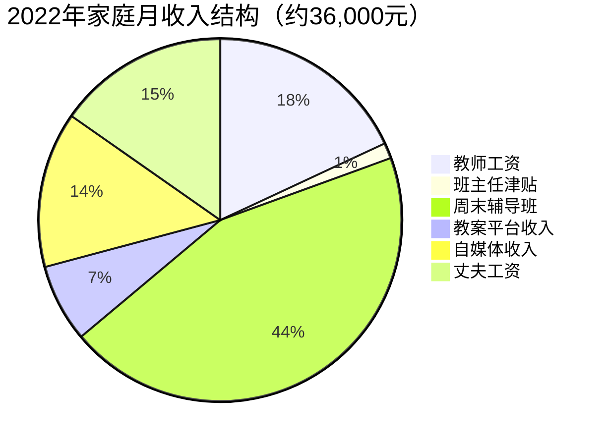
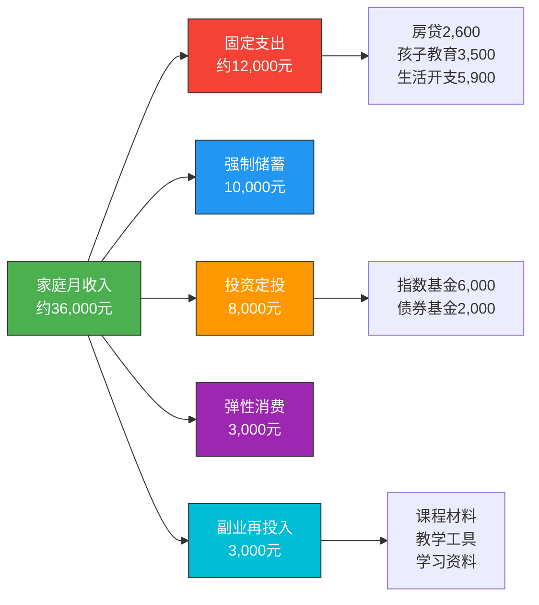
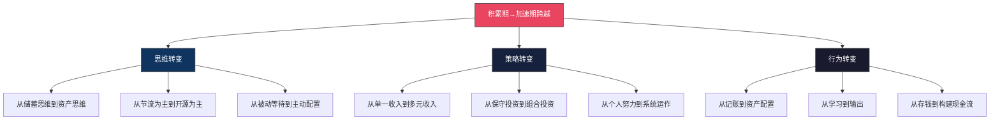
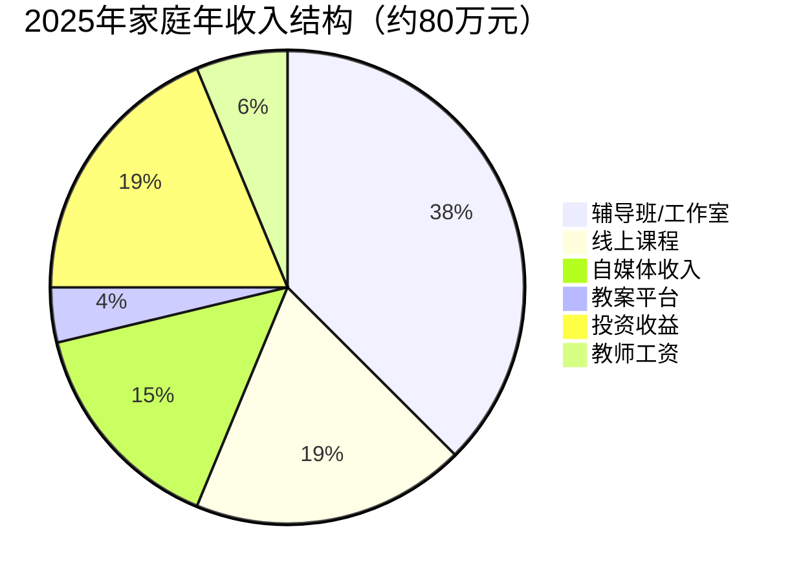

# 案例三：从积累期到加速期的跨越

> "第一个100万是最难的。不是因为它需要多高的收益率，而是因为它需要你对抗人性中所有的消费冲动、所有的急功近利、所有的自我怀疑。"

本案例追踪一位三线城市小学教师，用7年时间从零存款积累到第一个100万，又用3年时间从100万增长到380万的完整过程。重点分析"积累期→加速期"这个关键转折点上，她的思维、策略和行为发生了哪些本质变化——以及哪些东西没有变。

---

## 一、案例背景：起点画像

### 1.1 人物档案

| 维度 | 详情 |
|------|------|
| 化名 | 林小溪 |
| 年龄 | 启动时26岁，目前36岁 |
| 职业 | 三线城市公立小学语文教师 |
| 月薪 | 启动时3,800元（到手），目前约6,500元 |
| 所在城市 | 湖南某地级市 |
| 学历 | 本科，师范专业 |
| 家庭 | 已婚，丈夫为当地国企员工，月薪约5,000元 |
| 孩子 | 一个女儿，启动时2岁 |

### 1.2 启动前的财务状况

2016年初，林小溪的家庭财务状况可以用四个字概括：**月光边缘**。

| 项目 | 金额 | 说明 |
|------|------|------|
| 家庭月收入 | 8,800元 | 林小溪3,800 + 丈夫5,000 |
| 房贷月供 | 2,600元 | 2015年购入的婚房，贷款48万，30年期 |
| 幼儿园费用 | 1,200元 | 女儿上公立幼儿园 |
| 生活开支 | 约3,500元 | 三线城市中等水平 |
| 人情往来 | 约500元 | 同事结婚、过年红包等 |
| 其他开支 | 约800元 | 交通、通讯、日用品 |
| **月结余** | **约200元** | 几乎为零 |

银行存款：约15,000元（应急金都不够）。没有任何投资，没有任何被动收入。夫妻二人的收入模式都是纯粹的"主动收入"——不上班就没有钱。

### 1.3 转折触发点

2016年4月，林小溪的父亲突发脑梗住院。虽然有医保报销了大部分费用，但自费部分加上护工费、营养品、往返交通，前后花了约35,000元。这笔钱是她和丈夫向亲戚借的。

这件事给了她三个冲击：

1. **15,000元的存款，连一场中等疾病都扛不住**——如果父亲的病更严重、医保报销更少呢？
2. **借钱的滋味不好受**——虽然亲戚没有催，但她能感受到那种微妙的尴尬
3. **她和丈夫的收入增长极其缓慢**——教师和国企员工的薪资涨幅每年只有3%-5%，靠涨工资永远追不上生活的不确定性

从那天起，林小溪开始认真学习理财知识，并制定了一份家庭财务改善计划。

---

## 二、积累期阶段（2016-2022年）：第一个100万

### 2.1 积累期的核心认知

在正式行动之前，林小溪花了两个月时间阅读了《富爸爸穷爸爸》《小狗钱钱》《指数基金投资指南》三本书。她总结出积累期最重要的三个认知：

**认知1：储蓄率比收益率重要**

在本金很少的阶段，花大量时间研究"买哪只基金收益率更高"是本末倒置。月入8,800元，即使年化收益率达到20%，一年收益也只有几千块。但如果把储蓄率从2%提升到30%，每年能多存3万+。

**认知2：先保障再增值**

没有应急金就开始投资，就像没有安全气囊就上高速。她做的第一件事不是投资，而是建立应急基金。

**认知3：投资自己是最高回报的投资**

教师的工资天花板很低，但教师的技能可以产生组合收入——写教案、做课件、开辅导班、做线上课程。这些能力的培养，比任何投资的回报率都高。

### 2.2 第一步：建立财务系统（2016年5-8月）

林小溪没有急着投资，而是先花了4个月时间"止血"和"建系统"。

#### 2.2.1 记账与预算

她开始用手机记账App记录每一笔支出。第一个月的记录让她震惊：

| 类别 | 实际支出 | 她以为的 | 差额 |
|------|---------|---------|------|
| 餐饮零食 | 1,800元 | 1,200元 | +600元 |
| 网购（服饰/日用） | 1,200元 | 500元 | +700元 |
| 奶茶/外卖 | 450元 | 200元 | +250元 |
| 娱乐（电影/KTV） | 350元 | 200元 | +150元 |

记账让她第一次看清了"钱去了哪里"。在此基础上，她制定了家庭预算：

| 类别 | 预算 | 实际执行（前3个月均值） |
|------|------|---------------------|
| 房贷 | 2,600元（固定） | 2,600元 |
| 幼儿园 | 1,200元（固定） | 1,200元 |
| 伙食费 | 2,000元 | 2,100元 |
| 交通通讯 | 400元 | 380元 |
| 日用品 | 300元 | 320元 |
| 人情往来 | 300元 | 350元 |
| 娱乐/零食 | 200元 | 250元 |
| 弹性备用 | 200元 | 150元 |
| **强制储蓄** | **1,600元** | **1,450元** |

关键操作：**发工资当天自动转出1,600元到一个单独的储蓄账户**。这是她从《小狗钱钱》中学到的"先付给自己"原则——储蓄不是月底看剩多少存多少，而是月初先存再花。

#### 2.2.2 建立应急基金

4个月时间，她攒下了约6,000元。加上之前的15,000元存款，应急金达到21,000元。这个数字大约是家庭3个月的生活开支——她设定的最低应急标准。

#### 2.2.3 优化支出结构

她做了几个具体的改变：

| 改变 | 每月节省 | 具体做法 |
|------|---------|---------|
| 自己做饭替代外卖 | 约400元 | 周末批量备菜，工作日只需简单烹饪 |
| 带饭到学校 | 约300元 | 学校有微波炉，中午带饭 |
| 减少网购 | 约500元 | 设置"48小时冷静期"——想买的东西加购物车，48小时后还想买再下单 |
| 取消不必要的订阅 | 约50元 | 视频会员、音乐会员等只保留一个 |
| 利用教师身份优惠 | 约100元 | 很多景区、书店对教师有折扣 |
| **合计** | **约1,350元** | |

这些改变没有降低生活质量——她砍掉的都是"花了也没感觉"的支出。

### 2.3 第二步：提升收入（2016年9月-2018年）

单纯靠节省，天花板太低。林小溪开始思考如何增加收入。

#### 2.3.1 主业内的收入提升

作为公立学校教师，工资涨幅有限，但并非完全无法操作：

**策略1：评职称**

教师的工资与职称直接挂钩。林小溪从"二级教师"努力评上"一级教师"，月薪从3,800元涨到了4,500元。评职称需要发表论文、参加教学比赛、带班成绩优秀——她把这些目标分解到每学期执行。

**策略2：争取额外岗位津贴**

她主动申请担任班主任（每月多500元津贴）、兼任学校教研组副组长（每月多300元）。虽然工作量增加了，但这些岗位也提升了她的专业能力。

**策略3：参加教学比赛获奖**

省级教学比赛获奖不仅有奖金（5,000-20,000元），还能为评职称加分。她连续三年参加了市级和省级教学比赛，获得了两次省级二等奖。

#### 2.3.2 副业收入的开发

这是收入增长的关键。林小溪发现，教师的技能有多种变现途径：

**副业1：周末辅导班（2016年9月启动）**

她利用周末时间，为小学生提供语文和作文辅导。一开始只有3个学生（都是同事介绍的），每人每小时80元，每周上课4小时。

| 时间段 | 学生数 | 周收入 | 月收入 |
|--------|--------|--------|--------|
| 2016年9-12月 | 3人 | 960元 | 约3,840元 |
| 2017年1-6月 | 6人 | 1,920元 | 约7,680元 |
| 2017年7-12月 | 10人 | 3,200元 | 约12,800元 |
| 2018年全年 | 12-15人 | 约4,000元 | 约16,000元 |

注意：辅导班收入的增长不是靠涨价，而是靠口碑转介绍。她教的学生作文成绩提升明显，家长们口口相传。

**关键细节**：她把辅导班的教学方法系统化——整理了一套"小学作文六步法"，每个学生都用同一套方法论，只是根据水平调整难度。这让她可以标准化教学，而不是每节课重新备课。

**副业2：教案和课件售卖（2017年3月启动）**

她把日常教学中积累的优质教案和课件上传到"学科网"和"教习网"等教育资料平台。这些平台按下载量分成，每份教案定价2-5元。

| 时间段 | 上传数量 | 月均下载量 | 月均收入 |
|--------|---------|-----------|---------|
| 2017年3-12月 | 45份 | 约200次 | 约500元 |
| 2018年全年 | 累计120份 | 约500次 | 约1,200元 |
| 2019年全年 | 累计200份 | 约800次 | 约2,000元 |

这是她第一次体验到"组合收入"的魅力——教案只需写一次，但可以反复销售。到2019年，教案收入已经稳定在每月2,000元左右，而且几乎不需要额外时间投入。

**副业3：自媒体内容（2018年6月启动）**

她在今日头条和微信公众号上分享教学方法、育儿经验、亲子阅读推荐。内容定位："一线教师的实战教学分享"。

| 时间段 | 粉丝量 | 月收入 | 收入来源 |
|--------|--------|--------|---------|
| 2018年6-12月 | 2,000 | 约300元 | 平台流量分成 |
| 2019年全年 | 15,000 | 约1,500元 | 流量分成+广告 |
| 2020年全年 | 45,000 | 约4,000元 | 流量分成+广告+课程分销 |

### 2.4 第三步：开始投资（2017年1月启动）

在有了应急金和稳定的副业收入后，林小溪开始投资。

#### 2.4.1 投资启蒙阶段（2017年1-6月）

她选择的入门方式是**定投沪深300指数基金**。原因很简单：

1. 不需要选股能力——她当时完全没有
2. 定投不需要择时——每月固定日期买入
3. 历史数据证明长期定投指数基金的收益率能跑赢大多数主动基金

**起投金额**：每月500元（从辅导班收入中拿出）

她选择了一只费率最低的沪深300ETF联接基金，设置了每月15号自动扣款。

#### 2.4.2 逐步加码（2017年7月-2019年）

随着副业收入增长，她逐步提高了定投金额：

| 时间段 | 每月定投 | 资金来源 |
|--------|---------|---------|
| 2017年1-6月 | 500元 | 辅导班收入 |
| 2017年7-12月 | 1,500元 | 辅导班+教案收入 |
| 2018年1-12月 | 3,000元 | 副业收入增长 |
| 2019年1-12月 | 5,000元 | 副业收入进一步增长 |

#### 2.4.3 投资组合扩展（2019年下半年）

2019年下半年，她开始学习更多投资知识，将投资组合从单一指数基金扩展为：

| 资产类别 | 配置比例 | 具体产品 | 理由 |
|---------|---------|---------|------|
| 沪深300指数基金 | 40% | 天弘沪深300ETF联接A | 大盘蓝筹，波动相对小 |
| 中证500指数基金 | 20% | 天弘中证500ETF联接A | 中小盘成长性 |
| 债券基金 | 25% | 易方达稳健收益债券A | 降低组合波动 |
| 货币基金 | 15% | 余额宝/零钱通 | 流动性储备 |

她没有碰个股——"不懂的东西不碰"是她给自己定的铁律。

### 2.5 积累期完整数据（2016年5月-2022年12月）

#### 2.5.1 家庭收入结构变化



#### 2.5.2 资产增长曲线

| 时间节点 | 累计净资产 | 当年新增储蓄 | 投资收益 | 关键事件 |
|---------|-----------|------------|---------|---------|
| 2016年5月 | 1.5万 | — | — | 开始记账 |
| 2016年12月 | 4.2万 | 2.7万 | 0 | 建立应急金 |
| 2017年12月 | 14.5万 | 8.8万 | 1.5万 | 辅导班+定投启动 |
| 2018年12月 | 32万 | 12万 | 5.5万 | 自媒体启动，收入结构多元化 |
| 2019年12月 | 56万 | 14万 | 10万 | 投资组合扩展，复利效应初显 |
| 2020年12月 | 78万 | 10万 | 12万 | 疫情影响辅导班，但线上收入增长 |
| 2021年6月 | **100万** | 10万 | 12万 | **跨越百万大关** |
| 2021年12月 | 118万 | 8万 | 10万 | 心态转变，进入加速期 |
| 2022年12月 | 150万 | 10万 | 22万 | 加速期策略全面展开 |

**关键数据**：
- 从零到100万，用了约5年（2016年5月-2021年6月）
- 其中储蓄贡献约56万，投资收益贡献约44万
- 前3年投资收益占比约15%，后2年投资收益占比约45%——复利效应在后期才真正显现

#### 2.5.3 积累期每月资金流向（2021年初典型月）



---

## 三、跨越点分析：从积累期到加速期的转折

### 3.1 什么是"跨越"？

积累期→加速期的跨越，不是某一天突然发生的事件，而是一系列思维和行为模式的渐进转变。林小溪的跨越大约发生在2020年下半年到2021年上半年，净资产从70万增长到100万的阶段。

这个跨越包含三个维度的变化：



### 3.2 跨越前后的思维对比

| 维度 | 积累期思维 | 加速期思维 |
|------|-----------|-----------|
| 核心关注 | 月结余多少 | 资产每月产生多少现金流 |
| 对待收入 | 主业+副业补贴家用 | 副业是独立的收入引擎 |
| 对待投资 | "存进去就不管了" | 主动研究资产配置、动态再平衡 |
| 对待风险 | "我不懂，所以不碰" | "我需要学习，才能更好地配置" |
| 对待时间 | 每分钟都在赚钱 | 把时间花在最高杠杆的事情上 |
| 对待消费 | "这个能省就省" | "这个投入能产生多少回报" |
| 核心指标 | 储蓄率 | 资产回报率 + 现金流覆盖率 |

### 3.3 跨越的五个关键节点

林小溪回顾自己的跨越过程，总结了五个最关键的节点：

#### 节点1：投资收益首次超过一个月工资（2019年12月）

2019年12月，她的投资账户全年收益约10万元，平均每月约8,300元——超过了她的教师工资（4,500元）。

这个数字让她第一次意识到：**钱是可以生钱的，而且速度可以比你上班更快**。

从那以后，她对投资的态度从"顺便做做"变成了"认真对待"。她开始系统学习投资知识，阅读了《漫步华尔街》《聪明的投资者》《投资最重要的事》等经典著作。

#### 节点2：辅导班收入稳定超过工资的2倍（2020年）

2020年虽然受疫情影响，线下辅导班一度暂停，但她在疫情期间把部分课程转到了线上。疫情结束后，线下+线上的混合模式反而让辅导班收入增长了。

当辅导班月收入稳定在16,000元（教师工资的2.5倍）时，她的心态发生了根本变化：**教师工资不再是家庭经济的支柱，而只是收入来源之一**。这个认知让她在工作中更加从容——不再为评职称焦虑，不再为涨工资纠结。

#### 节点3：资产突破100万（2021年6月）

100万是一个心理里程碑。虽然从纯数学角度看，99万和100万没有本质区别，但跨越这个整数关口带来的心理效应是巨大的：

1. **自信心提升**：从"我怎么可能有100万"到"我真的做到了"
2. **视野打开**：开始思考"100万到500万"的路径，而不是停留在"怎么再多存一点"
3. **风险承受力增强**：敢于把更多资金配置到权益类资产

#### 节点4：第一次主动调仓（2021年9月）

2021年9月，她第一次根据市场估值主动调整了投资组合——在沪深300市盈率处于历史高位时，将部分权益类基金赎回，转入债券基金和货币基金。

这次操作本身并不复杂，但标志着她从"无脑定投"进化到了"有策略的资产配置"。从那以后，她开始学习估值方法、资产配置理论、再平衡策略。

#### 节点5：把辅导班交给合伙人运营（2022年3月）

随着学生数量增加到20人以上，林小溪发现自己已经没有足够的时间亲自教所有学生。她做了一个关键决策：**找了一位同样有教学经验的退休教师作为合伙人，分担部分教学工作，利润五五分成**。

这个决策的意义在于：她开始从"亲自干活"转向"建立系统"。虽然分出了一半利润，但她腾出的时间可以用来开发新课程、运营自媒体、研究投资——这些事情的长期价值远超短期利润损失。

### 3.4 跨越期的心理挑战

从积累期到加速期的跨越，并非一帆风顺。林小溪经历了三个典型的心理挑战：

#### 挑战1：跨越前的"黎明前黑暗"

在净资产达到70-90万阶段，她一度感到极度疲惫和焦虑：

- 辅导班要上课，学校要教课，自媒体要更新，孩子要辅导——时间被压缩到极限
- 看着账户里的数字增长越来越慢（因为基数大了，同样的增长率对应更大的绝对值，心理感受是"怎么还没到100万"）
- 周围的同事朋友开始消费升级（买车、换房、旅游），而她还在"抠门"

**应对方法**：她每个月给自己设定了一个"小奖励"——只要当月储蓄目标达成，就花500元做一件自己喜欢的事（买一本好书、吃一顿好的、看一场电影）。这个"奖励机制"帮助她维持了长期坚持的动力。

#### 挑战2：跨越后的"过度自信"

资产突破100万后，她一度产生了"我已经是投资高手"的错觉。2021年下半年，她冲动地把一部分资金投入了一只主动管理基金（某明星基金经理的产品），结果半年内亏损了15%。

**教训**：这次亏损让她清醒地认识到，100万只是加速期的起点，不是"可以冒险"的资本。她重新回归了以指数基金为主的配置策略，只是在组合中增加了更多的债券和货币基金比例。

#### 挑战3：家庭关系的微妙变化

随着收入结构的变化，林小溪在家庭中的经济话语权明显增强。丈夫虽然收入也在增长，但增速远不如她。这偶尔会引发一些微妙的摩擦。

**应对方法**：她和丈夫做了一次深入的财务沟通，把所有资产和收入透明化，共同制定了家庭财务目标。她强调"我们的钱"而不是"我的钱"，避免让收入差距变成家庭矛盾的导火索。

---

## 四、加速期阶段（2022年至今）：从100万到380万

### 4.1 加速期的核心认知转变

进入加速期后，林小溪的财务思维发生了三个根本性转变：

**转变1：从"存钱"到"配置"**

积累期的核心是"多存少花"，加速期的核心是"合理配置"。她开始系统学习资产配置理论，理解了"不要把所有鸡蛋放在一个篮子里"的真正含义——不是买很多只基金，而是在不同资产类别之间分散配置。

**转变2：从"个人努力"到"系统运作"**

积累期靠的是个人勤奋——多上课、多写教案、多更新内容。加速期靠的是系统效率——让辅导班自己运转、让教案持续产生收入、让自媒体内容形成复利。

**转变3：从"追求收益"到"管理风险"**

100万之前，亏了可以从头再来。100万之后，一次重大亏损可能需要几年才能恢复。风险管理的重要性第一次超过了收益追求。

### 4.2 加速期的资产配置

2023年初，林小溪重新梳理了自己的投资组合：

| 资产类别 | 配置比例 | 具体产品 | 预期年化 | 风险等级 |
|---------|---------|---------|---------|---------|
| A股指数基金 | 30% | 沪深300+中证500+创业板 | 8-12% | 中高 |
| 债券基金 | 25% | 纯债基金+二级债基 | 4-6% | 低 |
| 银行理财 | 15% | R2级理财产品 | 3-4% | 低 |
| 货币基金 | 10% | 余额宝/零钱通 | 2-3% | 极低 |
| 港股/美股指数 | 10% | 恒生科技指数+标普500 | 8-15% | 高 |
| 黄金 | 5% | 黄金ETF | 不确定 | 中 |
| 现金 | 5% | 银行活期 | 0.2% | 无 |

**配置逻辑**：
- 权益类（A股+港股美股）合计40%：追求长期增值
- 固收类（债券+银行理财）合计40%：提供稳定收益和安全垫
- 另类+现金（黄金+货币+活期）合计20%：流动性和对冲

### 4.3 加速期的收入结构优化

进入加速期后，林小溪进一步优化了收入结构：

#### 4.3.1 辅导班升级为"小工作室"

2022年9月，她正式注册了一家教育咨询工作室。从"个人辅导"升级为"小机构"：

| 维度 | 升级前 | 升级后 |
|------|--------|--------|
| 形式 | 在家教学 | 租了一间60平的小教室 |
| 团队 | 1人（自己） | 3人（自己+2位兼职教师） |
| 学生数 | 15-20人 | 40-50人 |
| 月收入 | 约16,000元 | 约35,000元（扣除成本后） |
| 个人时间投入 | 每周末12小时 | 每周末6小时（管理+部分教学） |

关键变化：她把"时间换钱"的模式升级为"系统赚钱"——通过招聘兼职教师，她的个人时间投入减少了一半，但总收入翻倍。

#### 4.3.2 线上课程的突破

2023年初，她把自己最擅长的"小学作文六步法"制作成了一套线上课程，在"小鹅通"平台上售卖。

| 指标 | 数据 |
|------|------|
| 课程定价 | 199元 |
| 课程时长 | 15节视频课+配套练习 |
| 上线首月销量 | 85份 |
| 累计销量（6个月） | 420份 |
| 累计收入 | 约83,580元 |
| 复购率 | 约25%（买了作文课再买阅读课） |

线上课程的意义在于：它是真正的"一对多"产品——录一次课，可以卖给无限多的人。这让她的收入第一次突破了"时间天花板"。

#### 4.3.3 自媒体矩阵扩展

2022-2023年，她的自媒体从图文扩展到了短视频：

| 平台 | 粉丝量 | 月收入 | 内容形式 |
|------|--------|--------|---------|
| 微信公众号 | 6万 | 3,000元 | 深度图文 |
| 抖音 | 12万 | 5,000元 | 教学短视频 |
| 小红书 | 8万 | 2,000元 | 育儿+学习方法 |
| B站 | 3万 | 1,500元 | 教学长视频 |
| 头条号 | 5万 | 2,000元 | 图文+微头条 |
| **合计** | **34万** | **约13,500元** | — |

### 4.4 加速期完整数据（2022年至今）

#### 4.4.1 资产增长数据

| 时间节点 | 累计净资产 | 年收入 | 投资收益 | 被动收入占比 |
|---------|-----------|--------|---------|-------------|
| 2022年12月 | 150万 | 约50万 | 22万 | 35% |
| 2023年12月 | 220万 | 约65万 | 28万 | 42% |
| 2024年12月 | 300万 | 约75万 | 35万 | 48% |
| 2025年6月 | 约380万 | 预计80万 | 约40万 | 52% |

**关键里程碑**：2024年底，被动收入（投资收益+教案平台+线上课程的自动销售收入）首次超过了主动收入（工资+辅导班中亲自教学的部分）。这意味着即使她完全停止工作，家庭的被动收入也能覆盖基本生活开支。

#### 4.4.2 收入结构对比



---

## 五、可复制的方法论

### 5.1 积累期到加速期的跨越公式

基于林小溪的案例，提炼出跨越的核心公式：

```text
跨越速度 = (储蓄率 × 收入增长率) + (投资本金 × 长期收益率) + (技能变现 × 规模效应)
```

三个变量分别对应三种积累方式：
1. **省钱**——提高储蓄率，控制支出
2. **赚钱**——提升主业收入，开发副业
3. **生钱**——让已有资金通过投资产生收益

在积累期早期（0-30万），变量1和2是主要驱动力。在积累期后期（30-100万），变量3的贡献越来越大。跨越到加速期后，变量3成为最大的驱动力。

### 5.2 跨越的实操清单

#### 清单1：积累期前半段（0-30万）

| 优先级 | 行动 | 预期效果 | 时间投入 |
|--------|------|---------|---------|
| 1 | 建立记账习惯 | 明确资金流向，找到节省空间 | 每天5分钟 |
| 2 | 制定预算，发工资当天强制储蓄 | 储蓄率提升到20-30% | 月初30分钟 |
| 3 | 建立3-6个月应急基金 | 财务安全感 | 3-6个月 |
| 4 | 评估自身技能的变现潜力 | 找到副业方向 | 1-2周 |
| 5 | 启动副业（从最小可行产品开始） | 收入来源多元化 | 每周5-10小时 |
| 6 | 开始定投指数基金 | 建立投资习惯 | 设置一次，每月自动执行 |

#### 清单2：积累期后半段（30-100万）

| 优先级 | 行动 | 预期效果 | 时间投入 |
|--------|------|---------|---------|
| 1 | 扩大副业规模，提升副业收入 | 加速积累 | 每周10-15小时 |
| 2 | 扩展投资组合，加入更多资产类别 | 降低风险，提高收益 | 每月2-4小时学习 |
| 3 | 学习资产配置基础理论 | 为加速期做准备 | 持续学习 |
| 4 | 建立副业的"系统化"运作 | 减少个人时间投入 | 1-3个月集中建设 |
| 5 | 优化税务（了解个税抵扣政策） | 合法节省税款 | 每年1-2小时 |
| 6 | 家庭财务透明化沟通 | 统一目标，避免矛盾 | 一次性深度对话 |

#### 清单3：跨越期（即将到达100万时）

| 优先级 | 行动 | 预期效果 |
|--------|------|---------|
| 1 | 制定加速期的资产配置方案 | 为下一阶段做准备 |
| 2 | 评估是否需要调整副业方向 | 确保副业有持续增长空间 |
| 3 | 建立风险管理框架 | 防止"过度自信"导致的亏损 |
| 4 | 设定加速期的阶段性目标 | 保持方向感和动力 |
| 5 | 考虑是否需要专业顾问 | 税务、法律、投资的专业建议 |

### 5.3 不同收入水平的跨越策略

林小溪的案例是"三线城市中等收入"的典型。不同收入水平的人，跨越策略会有所不同：

| 收入水平 | 核心策略 | 预期跨越时间 | 关键杠杆 |
|---------|---------|-------------|---------|
| 月入5,000以下 | 极致节省+技能提升+副业 | 8-12年 | 副业收入增长 |
| 月入5,000-10,000 | 合理节省+副业+定投 | 5-8年 | 副业+投资收益 |
| 月入10,000-20,000 | 优化支出+投资+副业 | 3-5年 | 投资收益+主业晋升 |
| 月入20,000以上 | 资产配置+商业模式升级 | 2-3年 | 投资收益+商业模式 |

**注意**：收入越高，跨越速度越快，但"高收入低储蓄率"的情况非常普遍。月薪3万但月光的人，跨越速度可能还不如月薪8千但储蓄率40%的人。

---

## 六、常见误区与纠正

### 误区1："等有了100万再学投资"

**真相**：投资能力需要时间培养。从500元开始定投指数基金，和从100万开始投资，用的是同一套基础能力。等到有了100万再学投资，你可能会在"学费"上付出更大的代价。

**纠正方法**：积累期就开始小额投资，把它当作"学费"。亏了就当交学费，赚了就当奖学金。

### 误区2："副业一定要和主业相关"

**真相**：林小溪的副业（辅导班、教案、自媒体）确实和教师主业高度相关，这是一种理想情况。但很多人的副业和主业完全无关——程序员做烘焙博主、医生做摄影副业、公务员做手工电商——同样可以成功。

**纠正方法**：副业选择的核心标准不是"和主业相关"，而是"你有热情+市场有需求+你有能力"。三者的交集才是最佳副业方向。

### 误区3："省钱没用，关键是赚钱"

**真相**：这句话只对了一半。在积累期早期，省钱是最可控、最有效的手段。月薪8,000元的人，省下2,000元比赚到2,000元容易得多。省钱和赚钱不是二选一，而是同时进行。

**纠正方法**：前6个月以省钱为主（建立预算、砍掉浪费），6个月后以赚钱为主（开发副业、提升主业）。省钱是地基，赚钱是楼层。

### 误区4："投资就是买基金买股票"

**真相**：投资自己（学技能、建人脉、提升认知）的回报率远高于任何金融投资。林小溪投资"教学能力"产生的回报（辅导班+教案+课程），远超她投资基金的收益。

**纠正方法**：在积累期，把至少30%的"投资预算"花在自我提升上。买一门好课、考一个有用的证书、参加一个高质量的社群——这些投资的回报率可能是1000%甚至更高。

### 误区5："100万就够了，可以松口气了"

**真相**：100万在三线城市大约能支撑一个家庭3-5年的生活（不含房贷）。它远远不够"财务自由"，甚至不够"安全感"。如果你在100万时松懈下来，很可能在5年后发现自己还在原地——因为通货膨胀在持续侵蚀你的购买力。

**纠正方法**：把100万当作加速期的起点，而不是终点。跨越100万后，你应该做的不是松口气，而是制定从100万到500万的系统性计划。

### 误区6："复利效应很厉害，躺着就能变富"

**真相**：复利效应确实厉害，但它需要两个前提条件：足够长的时间+持续的投入。100万本金，年化8%，20年后是466万——看起来很美好。但如果你停止投入，仅仅靠复利增长，在通胀调整后，实际购买力的增长远没有那么惊人。

**纠正方法**：把复利效应当作"加速器"，而不是"发动机"。发动机是你持续的收入能力（主业+副业），复利只是让发动机的输出效率更高。

---

## 七、进阶思考：跨越之后的下一步

### 7.1 从加速期到杠杆期的准备

林小溪目前处于加速期中段（380万）。她已经在思考从加速期到杠杆期（500-1000万）的跨越。与前一次跨越不同，这次跨越的核心不再是"省钱+副业"，而是：

1. **资产配置的专业化**——需要更深入地理解不同资产类别的风险收益特征
2. **商业模式的规模化**——辅导班工作室是否可以开第二家？线上课程是否可以拓展到更多学科？
3. **团队的建设**——从"一个人的战斗"到"一个团队的协作"
4. **风险管理的系统化**——需要考虑保险配置、资产隔离、税务规划

### 7.2 林小溪的反思

在采访中，林小溪分享了她最深刻的三个反思：

**反思1：最难的不是方法，是坚持**

"所有理财书上写的道理都差不多——多存钱、学投资、开发副业。方法大家都知道，但99%的人做不到。不是因为方法太难，而是因为坚持太难。每天记账、每月定投、每个周末上课——这些事情做一天不难，做一年不难，难的是做七年。"

**反思2：最大的收获不是钱，是认知**

"这七年最大的收获不是银行账户里的数字，而是我对'钱'的理解完全改变了。以前我觉得'有钱就是幸福'，现在我知道'有稳定的现金流、有抗风险的能力、有持续增长的系统'才是真正的安全感。"

**反思3：普通人最大的优势是时间**

"我没有高薪，没有家底，没有特殊资源。我唯一的优势就是时间——26岁开始，比40岁开始多了14年的复利时间。如果让我给年轻人一个建议，我会说：不要等到'准备好了'再开始，现在就开始。哪怕每月只存500元，哪怕只定投一只指数基金——开始了，就比99%的人强。"

---

## 八、关键数据汇总

### 8.1 十年财务旅程一览表

| 年份 | 净资产 | 年收入 | 年储蓄 | 投资收益 | 储蓄率 | 被动收入占比 |
|------|--------|--------|--------|---------|--------|-------------|
| 2016 | 4.2万 | 10.6万 | 2.7万 | 0 | 25% | 0% |
| 2017 | 14.5万 | 15万 | 8.8万 | 1.5万 | 35% | 5% |
| 2018 | 32万 | 22万 | 12万 | 5.5万 | 38% | 12% |
| 2019 | 56万 | 30万 | 14万 | 10万 | 35% | 20% |
| 2020 | 78万 | 32万 | 10万 | 12万 | 32% | 28% |
| 2021 | 118万 | 40万 | 12万 | 22万 | 30% | 35% |
| 2022 | 150万 | 50万 | 10万 | 22万 | 28% | 35% |
| 2023 | 220万 | 65万 | 15万 | 28万 | 27% | 42% |
| 2024 | 300万 | 75万 | 15万 | 35万 | 26% | 48% |
| 2025H1 | 380万 | 预计80万 | — | 约40万 | — | 52% |

### 8.2 跨越期关键指标对照

| 指标 | 积累期典型值 | 跨越期临界值 | 加速期典型值 |
|------|-------------|-------------|-------------|
| 净资产 | 0-100万 | 80-120万 | 100-500万 |
| 储蓄率 | 25-40% | 25-30% | 20-30% |
| 收入来源数 | 1-2个 | 2-3个 | 3-5个 |
| 被动收入占比 | 0-20% | 20-35% | 35-55% |
| 投资组合 | 单一（指数基金） | 开始多元化 | 全面多元化 |
| 风险承受力 | 低 | 逐步提升 | 中等 |
| 核心驱动力 | 储蓄+副业 | 副业+投资收益 | 投资收益+系统化副业 |
| 每月投资学习时间 | 0-2小时 | 4-8小时 | 4-8小时 |

---

## 九、本案例的核心启示

林小溪的案例之所以值得深入分析，不是因为她做了一件多么"厉害"的事情——她没有创业成功、没有投资暴富、没有拿到天降横财。她做的每一件事都很"普通"：记账、省钱、上课、定投。

但正是这些"普通"的事情，通过7年如一日的坚持，产生了惊人的复利效应。这个案例验证了一个被反复证明但很少有人真正做到的道理：

> **财富增长的真正秘密，不是某个神奇的投资策略或赚钱方法，而是一套正确的系统 × 足够长的时间 × 不间断的执行。**

从积累期到加速期的跨越，本质上不是资产数字的变化，而是**一个人从"被动应对生活"到"主动设计人生"的认知跃迁**。林小溪在26岁时和大多数人一样——月光、焦虑、不知道未来在哪里。但她在那个最普通的起点上，迈出了最不普通的一步：**开始行动，并且不停下来**。
