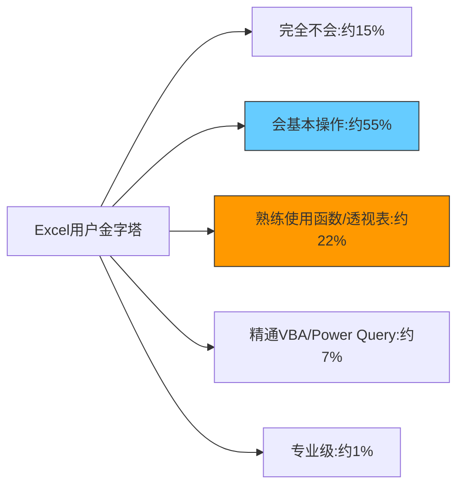
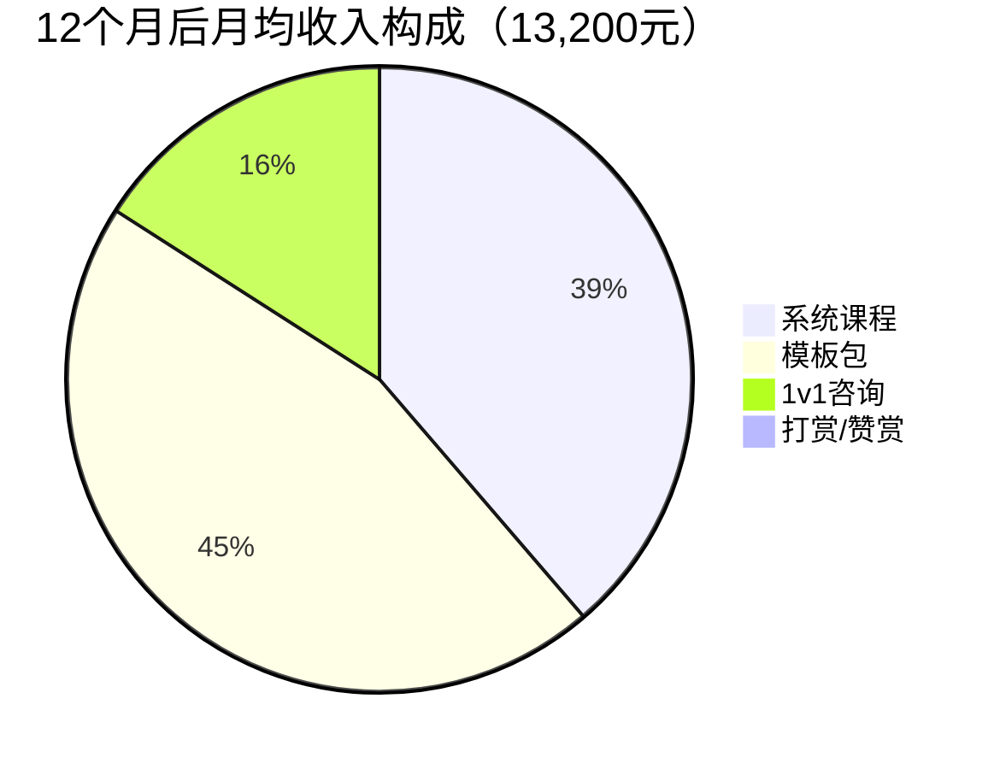
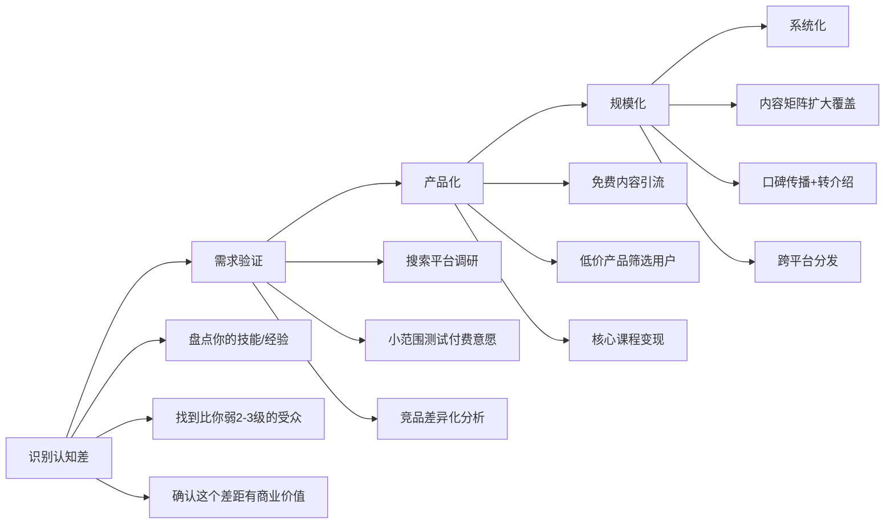
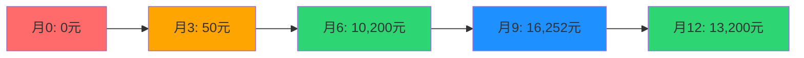

# 案例四：一个自媒体人的认知变现之路

> "你不需要成为世界顶级专家才能教别人。你只需要比你的目标受众领先两步。" —— 纳西姆·塔勒布

认知变现是普通人实现收入跃迁最现实的路径之一。本案例追踪一位职场白领从零起步，用12个月时间将自己在"Excel数据分析"领域的认知优势转化为月入12,000+元稳定副业收入的完整过程。这个案例的核心不是"自媒体怎么做"，而是**如何识别自身认知差、将其产品化、并持续放大**的方法论。

---

## 一、案例背景：起点画像

### 1.1 人物档案

| 维度 | 详情 |
|------|------|
| 化名 | 林小然 |
| 年龄 | 26岁 |
| 职业 | 某电商公司运营专员 |
| 工作年限 | 3年 |
| 核心技能 | Excel数据分析、数据透视表、VBA基础、Power Query |
| 月薪 | 税前11,000元（到手约8,800元） |
| 每月结余 | 约1,500-2,000元 |
| 所在城市 | 成都 |
| 学历 | 本科，市场营销专业 |
| 日常可支配时间 | 晚上20:30-22:30（约2小时），周末约4小时 |

### 1.2 启动前的状态分析

**收入结构**：纯主动收入，单一工资来源，每月结余极低，没有任何被动收入。

**技能盘点**：林小然的日常工作包括制作销售报表、运营数据看板、周报月报等。三年下来，她在Excel方面积累了不少实操经验——数据透视表用得很熟，会写一些基础VBA宏来自动化重复操作，还自学了Power Query做数据清洗。在公司内部，同事们遇到Excel问题经常找她帮忙，她也被戏称为"Excel小达人"。

**认知优势识别**：林小然并没有意识到自己的Excel水平有什么特别。直到有一次部门培训，她给同事们讲了一个30分钟的"数据透视表实操"分享，反响出乎意料地好。事后好几个同事私信她："你有没有系统的教程？我想系统学一下。"

这个反馈让她开始思考一个问题：**我的Excel水平，在"完全不会"和"专业数据分析师"之间，处于什么位置？**

经过调研，她发现了一个关键事实：



林小然处于D层（熟练使用），而她的目标受众——职场新人和运营岗位——大多处于B-C层。**她不需要成为F层的专家，只需要比目标受众领先2-3个层级，就能建立足够的认知差。**

这就是纳瓦尔·拉维坎特所说的"特定知识"（Specific Knowledge）：你不需要做到最好，只需要在一个足够细分的领域里，比你的受众知道得更多、理解得更深、能做到得更好。

---

## 二、认知差的识别与验证

### 2.1 信息差 vs 认知差 vs 执行差

在开始行动之前，林小然首先分析了自己所拥有的"差"属于哪个层次：

| 维度 | 信息差 | 认知差 | 执行差 |
|------|--------|--------|--------|
| 她拥有的 | 知道Power Query这个工具（大多数人不知道） | 理解"为什么用透视表比手动汇总好100倍"的底层逻辑 | 能在30分钟内完成同事需要2小时才能做出的报表 |
| 变现难度 | 低（一篇帖子就能传递） | 中（需要结构化课程） | 高（需要示范+陪练） |
| 持久性 | 短（别人搜一下就知道了） | 长（理解了原理就不会忘） | 极长（习惯和肌肉记忆） |
| 定价空间 | 低（免费内容即可覆盖） | 中（99-299元课程） | 高（1v1辅导1000+元/次） |

**关键洞察**：她决定以**认知差**作为核心变现点，以**执行差**作为高价值增值服务，用**信息差**内容做免费引流。三层联动，形成完整的产品矩阵。

### 2.2 需求验证：不靠感觉，靠数据

林小然没有一上来就开始做内容，而是先花了两周时间做需求验证。这个步骤至关重要——很多人做自媒体失败，不是因为内容不好，而是选了一个没有付费需求的方向。

**验证方法一：搜索平台调研**

她在以下平台搜索"Excel"相关关键词，记录搜索量、互动量和付费情况：

| 平台 | 搜索内容 | 发现 |
|------|---------|------|
| 知乎 | "Excel 透视表" | 话题浏览量2000万+，高赞回答动辄万赞 |
| B站 | "Excel教程" | 播放量最高的视频100万+，但大多偏基础 |
| 小红书 | "Excel技巧" | 相关笔记10万+，爆款笔记点赞过万 |
| 淘宝 | "Excel课程" | 销量最高的课程月销5000+，定价9.9-199元 |
| 微信指数 | "Excel" | 日均搜索指数稳定在50万+ |

**验证方法二：付费意愿测试**

她在小红书发了一条帖子："整理了一份我自用的Excel数据透视表速查手册（30页PDF），有人需要吗？评论区扣1。"

结果：24小时内收到87条评论扣1。她私信了前20个人，问"如果这个手册定价9.9元，你会买吗？"——16个人回复"会"。

**验证结论**：需求真实存在，付费意愿明确，且竞争虽然激烈但"实操型"内容（非理论型）存在明显空白。

### 2.3 竞品分析：找到差异化切口

林小然系统分析了市面上前20个Excel类自媒体账号：

| 维度 | 大部分账号的做法 | 她的差异化切口 |
|------|----------------|---------------|
| 内容风格 | 教科书式、按功能分类教学 | 场景驱动：从真实工作场景出发 |
| 目标受众 | 泛人群"想学Excel的人" | 聚焦：电商运营+行政岗位 |
| 内容深度 | 偏基础（SUM、VLOOKUP为主） | 覆盖透视表+Power Query+自动化 |
| 交付形式 | 视频为主 | 图文为主+短视频辅助（制作成本低） |
| 变现模式 | 卖课（一次性） | 课程+模板+1v1咨询（多层次） |

---

## 三、执行过程：从0到月入12,000的四个阶段

### 3.1 第一阶段：冷启动期（第1-2个月）

**目标**：验证内容方向，积累第一批种子用户（目标500粉丝）

**时间分配**：每天2小时，周末各2小时，周均投入14小时

**具体动作**：

**平台选择**：小红书（主战场）+ 知乎（长文沉淀）+ B站（视频备选）

选择小红书的原因：用户以年轻职场女性为主，与"电商运营/行政"画像高度重合；图文形式制作门槛低；平台算法对新账号友好，冷启动成本低。

**内容策略**：每日一更，采用"3+2+1+1"节奏

- 周一到周三：实操技巧帖（"3分钟学会用透视表做销售日报"）
- 周四到周五：场景解决方案（"老板让你半小时出一份月报，怎么办？"）
- 周六：工具推荐/模板分享（免费引流）
- 周周日：复盘+下周选题规划

**第一条爆款帖子的诞生**：

第3周，她发了一条帖子："我用Excel帮老板做了一个自动更新的销售看板，他以为我请了外援。"配图是一个精心制作的数据看板截图，配文详细讲了制作步骤。

数据：48小时内，点赞1200+，收藏3500+，评论280+，涨粉400+。

这条帖子的成功验证了一个关键假设：**职场人不缺Excel教程，缺的是"在什么场景下用什么功能"的场景化解决方案。**

**冷启动期数据**：

| 指标 | 第1个月 | 第2个月 |
|------|--------|--------|
| 小红书粉丝 | 120 | 680 |
| 知乎关注者 | 35 | 150 |
| 总笔记/文章数 | 25篇 | 50篇（累计） |
| 平均单篇点赞 | 80 | 250 |
| 收入 | 0元 | 0元 |

收入为零是正常的。这个阶段的目标不是赚钱，而是验证方向、积累内容资产、培养创作手感。

### 3.2 第二阶段：内容资产积累期（第3-5个月）

**目标**：建立内容体系，开始试水付费产品（目标月入2,000元）

**内容升级**：从散点技巧到体系化内容

林小然将所有内容按"场景"重新组织，形成了自己的内容体系：

```text
Excel运营人内容体系
├── 数据清洗篇
│   ├── 原始数据导入与整理
│   ├── Power Query基础操作
│   ├── 常见数据问题的处理方案
│   └── 批量处理多表合并
├── 数据分析篇
│   ├── 数据透视表从入门到精通
│   ├── 常用函数组合（IF+VLOOKUP+INDEX/MATCH）
│   ├── 条件格式与数据可视化
│   └── 多维度交叉分析
├── 报表自动化篇
│   ├── VBA宏录制与修改
│   ├── 一键生成周报/月报
│   ├── 自动邮件发送报表
│   └── 动态数据看板制作
└── 实战场景篇
    ├── 电商运营数据分析全套
    ├── 销售团队业绩跟踪
    ├── 库存管理与预警
    └── 活动复盘分析模板
```

**第一个付费产品的诞生**：

第4个月，她制作了第一份付费产品——《电商运营Excel模板包》，包含15个即开即用的模板文件，定价29.9元。

**产品设计逻辑**：

| 层次 | 内容 | 定价 | 作用 |
|------|------|------|------|
| 免费层 | 小红书帖子+知乎回答 | 0元 | 引流+信任建立 |
| 低价层 | 模板包（15个模板） | 29.9元 | 筛选付费用户，建立交易关系 |
| 中价层 | 系统课程（待开发） | 199元 | 核心变现产品 |
| 高价层 | 1v1咨询（待开发） | 500元/次 | 高价值服务 |

**推广策略**：在每篇高赞帖子的评论区和文末自然引导"完整模板已整理好，主页可查看"。不做硬广，让内容本身成为销售员。

**第二阶段数据**：

| 指标 | 第3个月 | 第4个月 | 第5个月 |
|------|--------|--------|--------|
| 小红书粉丝 | 1,500 | 2,800 | 4,200 |
| 知乎关注者 | 320 | 550 | 800 |
| 模板包销量 | — | 45份 | 120份 |
| 模板包收入 | 0元 | 1,346元 | 3,588元 |
| 其他收入（打赏等） | 50元 | 120元 | 200元 |
| **月总收入** | **50元** | **1,466元** | **3,788元** |

### 3.3 第三阶段：产品化加速期（第6-9个月）

**目标**：推出核心课程产品，月收入突破8,000元

**系统课程的开发**：

基于前5个月积累的300+条评论和私信中用户反复提出的问题，林小然开发了系统课程《Excel运营人实战课：从数据到决策》。

**课程结构设计**（基于"由浅入深"原则）：

| 模块 | 内容 | 课时 | 目标 |
|------|------|------|------|
| 模块一：数据基础 | 数据规范、清洗、导入导出 | 4课时 | 建立正确的数据处理习惯 |
| 模块二：透视表精通 | 透视表从入门到高级用法 | 6课时 | 能用透视表解决80%的分析需求 |
| 模块三：函数武器库 | 10个最常用函数的组合拳 | 5课时 | 遇到复杂需求不再手足无措 |
| 模块四：自动化入门 | VBA宏录制+基础修改 | 4课时 | 把重复操作自动化 |
| 模块五：实战项目 | 4个完整的真实工作场景 | 4课时 | 学完就能直接用在工作中 |
| 加餐：效率工具包 | 快捷键大全+模板+速查手册 | 持续更新 | 持续提供价值 |

**定价策略**：199元/人，限时早鸟价149元。同时提供"课程+模板包+30天答疑群"的组合包，定价249元。

**课程开发过程中的关键决策**：

**决策1：不做视频课程，做图文+录屏混合课程**

原因：视频课程制作成本高（拍摄+剪辑+字幕），而且Excel类教程中，用户更需要的是"能跟着一步步操作"而非"看老师演示"。图文课程配合关键步骤的GIF动图，学习效率更高，制作成本更低。

**决策2：每节课控制在15-20分钟**

基于用户行为数据分析：超过20分钟的课程，完课率下降40%。每节课只解决一个问题，学完就能用。

**决策3：建立付费答疑群而非一对一答疑**

一对一答疑不可规模化。建群后，学员之间可以互相帮助，高频问题可以在群里统一回复，大大降低服务成本。同时群内的讨论和提问也成为了新课程选题的来源。

**推广策略**：

1. **老用户转化**：向已购买模板包的200+用户发送课程介绍，转化率约15%
2. **内容营销**：在课程中挑选2-3个精彩片段做成免费帖子，自然引导
3. **学员见证**：收集学员的学习反馈和工作改善案例，做成"学员故事"系列
4. **限时促销**：每月做一次48小时限时优惠，制造紧迫感

**第三阶段数据**：

| 指标 | 第6个月 | 第7个月 | 第8个月 | 第9个月 |
|------|--------|--------|--------|--------|
| 小红书粉丝 | 6,500 | 9,000 | 12,000 | 15,000 |
| 课程累计销量 | 35份 | 85份 | 150份 | 230份 |
| 模板包月销量 | 150份 | 160份 | 170份 | 180份 |
| 课程月收入 | 5,215元 | 7,465元 | 8,230元 | 8,870元 |
| 模板包月收入 | 4,485元 | 4,784元 | 5,083元 | 5,382元 |
| 咨询收入 | 500元 | 1,000元 | 1,500元 | 2,000元 |
| **月总收入** | **10,200元** | **13,249元** | **14,813元** | **16,252元** |

### 3.4 第四阶段：系统化运营期（第10-12个月）

**目标**：优化产品结构，稳定月收入在12,000元以上

进入第十个月后，林小然开始从"做内容"转向"做系统"。她的核心工作不再是每天写帖子，而是优化整个变现系统的效率。

**系统优化动作**：

**1. 内容生产流程化**

她建立了标准化的内容生产SOP（标准作业流程）：

| 步骤 | 内容 | 时间 |
|------|------|------|
| 选题 | 从评论区/私信/搜索热词中筛选 | 周日1小时批量完成 |
| 写作 | 按模板撰写初稿 | 30分钟/篇 |
| 配图 | 用Excel制作截图+标注 | 15分钟/篇 |
| 发布 | 按排期表发布 | 5分钟/篇 |
| 互动 | 回复评论+私信 | 每天15分钟 |

每周只需投入约5小时就能维持日更节奏。

**2. 自动化运营**

利用VBA和Power Automate实现了部分运营自动化：
- 课程订单自动汇总到Excel
- 学员入群自动发送欢迎语和学习指南
- 周报自动生成（销售额、新增学员、热门内容）

**3. 复购与转介绍机制**

| 机制 | 做法 | 效果 |
|------|------|------|
| 老学员续费优惠 | 第二年课程更新费半价 | 续费率45% |
| 学员推荐返现 | 推荐1人购买返30元 | 每月带来15-20个新学员 |
| 学员案例征集 | 优秀学员案例在公众号展示 | 提升信任度+学员荣誉感 |
| 模板包定期更新 | 每月新增2-3个模板 | 保持老用户活跃度 |

**第四阶段数据**：

| 指标 | 第10个月 | 第11个月 | 第12个月 |
|------|---------|---------|---------|
| 小红书粉丝 | 18,000 | 21,000 | 25,000 |
| 知乎关注者 | 2,500 | 3,000 | 3,500 |
| 课程月销量 | 25份（稳定） | 28份 | 30份 |
| 模板包月销量 | 185份 | 190份 | 200份 |
| 咨询收入 | 2,500元 | 2,000元 | 2,500元 |
| **月总收入** | **12,800元** | **12,520元** | **13,200元** |

---

## 四、收入结构拆解

### 4.1 12个月后的收入构成

| 收入来源 | 月均收入 | 占比 | 性质 | 边际成本 |
|---------|---------|------|------|---------|
| 系统课程 | 5,100元 | 38.6% | 组合收入（一次性录制，持续销售） | 极低 |
| 模板包 | 5,980元 | 45.3% | 组合收入（一次性制作，持续销售） | 极低 |
| 1v1咨询 | 2,100元 | 15.9% | 主动收入（每次1小时） | 高（时间成本） |
| 打赏/赞赏 | 20元 | 0.2% | 被动收入 | 零 |
| **合计** | **13,200元** | **100%** | — | — |



**关键发现**：产品型收入（课程+模板）占总收入的83.9%，而这部分的边际成本几乎为零。这意味着每多卖一份，利润率接近100%。这就是**从"卖时间"到"卖产品"**的商业模式升级。

### 4.2 与传统副业方式的对比

| 维度 | 林小然的认知变现 | 传统副业（如代运营） |
|------|----------------|-------------------|
| 启动成本 | 0元（只需时间和电脑） | 0-5000元 |
| 收入模式 | 产品型（可规模化） | 服务型（不可规模化） |
| 时间弹性 | 内容可提前批量制作 | 随叫随到 |
| 收入上限 | 无上限（取决于流量） | 有上限（取决于客户数×单价） |
| 中断影响 | 内容持续销售，收入不会断崖 | 停止服务=停止收入 |
| 12个月总收入 | 约95,000元 | 约60,000-80,000元（按月均5,000-6,600元估算） |

---

## 五、认知变现的核心方法论

### 5.1 认知变现的四步框架

从林小然的案例中，提炼出可复制的认知变现方法论：



### 5.2 "领先两步"法则

这是认知变现最重要的原则：**你不需要成为专家，你只需要比目标受众领先两步。**

| 你的水平 | 你的受众 | 差距 | 变现可能性 |
|---------|---------|------|-----------|
| 完全不会 | 完全不会 | 0步 | ❌ 无法变现 |
| 初学者 | 完全不会 | 1步 | ⚠️ 太近，价值感弱 |
| 熟练使用者 | 初学者 | 2步 | ✅ 最佳变现距离 |
| 精通者 | 初学者 | 3-4步 | ✅ 可以，但需要注意表达方式 |
| 专家 | 初学者 | 5步+ | ⚠️ 容易"知识诅咒"——你讲的东西受众听不懂 |

**"知识诅咒"**（Curse of Knowledge）是指当你对一个领域了解太深后，你会忘记初学者的困惑点，无法用简单的语言解释复杂的问题。这就是为什么很多顶级专家讲课反而不如"刚学会的人"讲得清楚——因为他刚经历过初学者的阶段，知道哪里会卡住。

### 5.3 内容-产品-服务的三层变现模型

林小然的变现模型可以用一个三层结构来概括：

| 层级 | 产品 | 定价 | 目的 | 比喻 |
|------|------|------|------|------|
| 引流层 | 免费帖子、回答、短视频 | 0元 | 获取流量和信任 | 钓鱼的饵 |
| 转化层 | 模板包、电子手册 | 19-49元 | 筛选付费意愿，建立交易关系 | 试用装 |
| 利润层 | 系统课程 | 99-299元 | 核心收入来源 | 正装商品 |
| 增值层 | 1v1咨询、企业内训 | 500-2000元/次 | 高利润服务 | VIP定制 |

**核心逻辑**：每一层都是下一层的"漏斗入口"。免费内容吸引关注，低价产品筛选付费用户，高价产品实现核心利润。

### 5.4 持续性收入的关键：内容资产

林小然最大的认知突破是意识到：**帖子不是消耗品，而是资产。**

一条高质量的小红书帖子，在发布后3-6个月内持续带来搜索流量。她第3个月写的那条"透视表速查表"帖子，到第12个月依然每天带来10-20个新粉丝。这就是内容的"复利效应"。

**内容资产的复利计算**：

假设每月发布25篇帖子，每篇帖子在发布后6个月内平均带来50个粉丝：

```text
第12个月的月新增粉丝 ≈ 第7-12个月发布的帖子数 × 50 + 前6个月帖子的持续流量
= 150 × 50 + 前期内容的长尾效应
≈ 7,500 + 2,000 = 9,500个/月
```

这就是为什么林小然的粉丝增长不是线性的，而是加速的——前面的内容在持续工作。

---

## 六、踩过的坑与避坑指南

### 6.1 八个关键错误及其教训

**坑1：一开始就想做视频**

林小然最初计划做B站视频教程，花了两周学剪辑，录了3条视频，每条制作时间超过8小时。结果播放量不过百。

**教训**：视频的制作成本和时间成本远高于图文，冷启动期应选择制作效率最高的形式。先用图文验证方向，等有团队或收入后再考虑视频。

**纠正**：切换到小红书图文+知乎长文，制作效率提升10倍。

**坑2：只教功能，不教场景**

早期帖子标题是"VLOOKUP函数详解"，数据平平。后来改成"老板让你从10万行数据里匹配客户信息，3步搞定"，数据翻了5倍。

**教训**：用户不关心"这个功能怎么用"，关心的是"我遇到的这个问题怎么解决"。

**纠正**：所有内容都从真实工作场景出发，标题采用"问题场景+解决方案+效果承诺"的结构。

**坑3：定价太低，陷入价格战**

第一版模板包定价9.9元，销量不错但利润微薄。后来发现定价29.9元后，销量只下降了15%，但利润增加了200%。

**教训**：低价不等于高销量。价格本身是价值信号——太便宜的产品反而让人怀疑质量。

**纠正**：用"价值锚定"策略——在课程详情页列出"如果请人帮你做这些报表，每次至少200元；29.9元的模板包可以反复使用，相当于请了一个免费的数据助手"。

**坑4：忽视评论区的价值**

早期只把评论区当"互动区"，后来发现评论区是最好的选题来源和需求验证工具。

**教训**：每一条评论都是用户用真金白银（时间成本）告诉你的需求信号。

**纠正**：每周系统整理一次评论区，按"提问/需求/反馈/吐槽"分类，形成选题库。

**坑5：过早追求"完美内容"**

前三个月，林小然每篇帖子都要反复修改3-5遍，一篇帖子写2小时。后来发现，80分的帖子和95分的帖子，在传播效果上差距不大，但制作时间差了3倍。

**教训**：在冷启动期，"数量×质量的及格线"远胜于"极少量的完美作品"。

**纠正**：建立内容模板，用SOP流程化生产，确保质量下限的同时大幅提升产出效率。

**坑6：没有建立"信任阶梯"**

一开始就在私信里推销课程，转化率极低（不到1%）。后来改为先免费分享→低价模板→中价课程的阶梯式转化，转化率提升到8%。

**教训**：用户需要经过"认知→信任→付费"的心理旅程。跳过任何一步都会导致转化失败。

**坑7：忽视复购和转介绍**

前6个月只关注获取新客户，没有设计复购和转介绍机制。后来加入"学员推荐返现"后，每月新增学员中30%来自老学员推荐，获客成本几乎为零。

**教训**：老用户的口碑是最好的广告。每个满意用户都可以成为你的"销售员"。

**坑8：没有预留"应急内容库存"**

有一次生病三天，内容断更，流量断崖式下跌，恢复花了两周。

**教训**：内容生产要建立"库存"机制，至少提前储备一周的内容，避免意外中断。

**纠正**：每周批量制作下周内容，提前排期发布。

### 6.2 不同阶段的核心陷阱

| 阶段 | 核心陷阱 | 表现 | 正确做法 |
|------|---------|------|---------|
| 冷启动期（0-3月） | 急于变现 | 第一条帖子就挂商品链接 | 先积累100篇优质内容再考虑变现 |
| 积累期（3-6月） | 贪多求全 | 同时运营5个平台 | 聚焦1个主平台，做到头部再扩展 |
| 加速期（6-9月） | 忽视用户反馈 | 课程内容闭门造车 | 每周收集用户反馈，快速迭代 |
| 稳定期（9-12月） | 躺在舒适区 | 不再创新，内容重复 | 每季度推出新内容/新产品 |

---

## 七、可复制的行动框架

### 7.1 90天冷启动计划

如果你想复制林小然的路径，以下是具体的90天行动计划：

**第1-14天：定位与验证期**

- [ ] 盘点你的所有技能和经验，列出5个可能的认知变现方向
- [ ] 对每个方向做需求验证（搜索量、竞品分析、付费测试）
- [ ] 选定1个方向，确定目标受众画像
- [ ] 确定主攻平台（推荐小红书或知乎）
- [ ] 完成竞品分析（至少分析10个同领域账号）

**第15-30天：内容试水期**

- [ ] 每天发布1条内容，测试不同选题和形式
- [ ] 记录每条内容的数据（点赞、收藏、评论、涨粉）
- [ ] 分析数据，找出"爆款基因"——什么样的选题/标题/形式效果最好
- [ ] 回复每一条评论和私信，建立用户关系

**第31-60天：体系化内容期**

- [ ] 基于前30天的数据，确定3-5个核心内容系列
- [ ] 建立内容生产SOP，实现批量制作
- [ ] 开始做"免费资料包"，收集用户邮箱/微信
- [ ] 同步在第2个平台开始内容分发

**第61-90天：第一款产品上线期**

- [ ] 基于用户反馈，确定第一款付费产品（模板包/电子手册/小课）
- [ ] 制作产品，定价19-49元
- [ ] 在内容中自然引导，不做硬广
- [ ] 收集首批用户反馈，快速迭代

### 7.2 关键指标监测表

| 指标 | 冷启动期目标 | 积累期目标 | 加速期目标 |
|------|------------|-----------|-----------|
| 月发布内容数 | 25-30条 | 20-25条 | 15-20条（质量优先） |
| 单条平均互动 | 50+ | 200+ | 500+ |
| 月新增粉丝 | 200-500 | 1,000-2,000 | 2,000-5,000 |
| 付费用户转化率 | — | 1-3% | 3-8% |
| 月收入 | 0元 | 500-3,000元 | 3,000-10,000元 |
| 内容库存 | 0 | 1周 | 2周 |

### 7.3 工具清单

| 用途 | 推荐工具 | 说明 |
|------|---------|------|
| 内容创作 | Canva / 稿定设计 | 封面图和配图制作 |
| 排版 | 135编辑器 / 秀米 | 公众号排版 |
| 数据分析 | 平台自带数据后台 | 监测内容表现 |
| 选题工具 | 新红/灰豚数据 | 小红书热门选题分析 |
| 课程制作 | 小鹅通 / 荔枝微课 | 课程托管和销售 |
| 社群管理 | 微信群+企业微信 | 学员答疑和运营 |
| 模板销售 | 有赞 / 小鹅通 | 数字产品销售 |
| 自动化 | Power Automate / Zapier | 运营流程自动化 |

---

## 八、成果数据总览

### 8.1 12个月关键指标变化

| 指标 | 起步时 | 第3个月 | 第6个月 | 第9个月 | 第12个月 |
|------|--------|--------|--------|--------|---------|
| 小红书粉丝 | 0 | 680 | 6,500 | 15,000 | 25,000 |
| 知乎关注者 | 0 | 150 | 800 | 2,000 | 3,500 |
| 月收入 | 0元 | 50元 | 10,200元 | 16,252元 | 13,200元 |
| 客户数 | 0 | 0 | 85 | 230 | 350+（累计） |
| 复购率 | 0% | 0% | 35% | 50% | 60% |
| 月工作时长 | 0小时 | 56小时 | 45小时 | 35小时 | 25小时 |
| 时薪（月收入/月工作时长） | 0元 | 1.8元 | 227元 | 464元 | 528元 |

### 8.2 收入增长曲线



注意第9个月到第12个月收入的小幅回落——这是正常的。第9个月包含了"双十一"期间的一波促销高峰，第12个月回归常态。自媒体收入不是匀速增长的，而是呈阶梯式上升+周期波动的形态。

---

## 九、经验总结与深度反思

### 9.1 五个核心教训

**教训一：认知差是普通人最大的杠杆**

林小然没有任何特殊资源——没有大厂背景、没有百万粉丝、没有资本支持。她唯一的"资产"是自己在Excel领域的实操经验。但就是这个"不起眼"的技能，通过系统化的内容输出和产品化，产生了月入过万的稳定收入。

这印证了纳瓦尔的观点：**特定知识（Specific Knowledge）是无法被培训出来的，它来自于你的天赋、好奇心和实践经验的结合。** 每个人都有自己的特定知识，关键是要识别它、放大它、变现它。

**教训二：先验证再投入，不要闭门造车**

林小然没有花三个月开发一个"自以为完美"的课程。她先用两周做需求验证，再用一个月测试内容方向，然后用两个月验证付费意愿，最后才投入大量时间开发课程产品。

**教训三：内容是资产，不是消耗品**

一条帖子不是用完就扔的，它是持续为你工作的"数字员工"。林小然前6个月写的150条帖子，在后续6个月里持续带来流量和转化，这就是内容的复利效应。

**教训四：商业模式比流量更重要**

很多自媒体人有百万粉丝却赚不到钱，因为他们只有流量没有产品。林小然在粉丝不到1000时就开始设计变现路径——免费引流→低价转化→高价变现的漏斗结构，确保每一个流量都能被有效利用。

**教训五：系统化是长期制胜的关键**

个人做自媒体最大的瓶颈是"时间有限"。林小然通过建立内容SOP、自动化运营工具、标准化产品体系，将每周工作时间从56小时压缩到25小时，同时收入反而更稳定。这说明：**做自媒体不是拼体力，而是拼系统。**

### 9.2 这个案例的局限性

诚实地说，这个案例有以下局限性：

1. **幸存者偏差**：林小然成功了，但大量尝试做自媒体的人失败了。她的成功有运气成分（第一条帖子恰好踩中了算法推荐）。
2. **不可完全复制**：每个人的技能组合、表达能力、平台环境都不同，照搬她的路径不一定有效。
3. **收入波动性**：自媒体收入受平台算法、季节性因素影响较大，不像工资那样稳定。
4. **时间投入被低估**：虽然稳定期每周只投入25小时，但前6个月的每周投入超过50小时，这对大多数人来说很难坚持。

### 9.3 适用人群与不适用人群

| 适合做认知变现的人 | 不适合做认知变现的人 |
|-------------------|-------------------|
| 有1000+小时某领域积累 | 没有任何突出技能或经验 |
| 愿意每天投入1-2小时 | 期望"零投入高回报" |
| 能坚持3-6个月看不到收入 | 急于求成，一个月没效果就放弃 |
| 善于总结和表达 | 不愿分享，害怕"教会徒弟饿死师傅" |
| 有耐心与人沟通 | 讨厌回复评论和私信 |

---

## 十、与本章理论框架的对应

本案例是第二章"财富增长的底层逻辑"中2.5节"认知变现的底层逻辑"的实践验证。以下是理论与实践的对照：

| 理论框架 | 实践验证 |
|---------|---------|
| 信息差（2.5.1） | 林小然知道Power Query等工具，这是信息差——用于免费引流 |
| 认知差（2.5.1） | 她理解"场景化教学比功能教学有效100倍"——这是认知差——用于课程核心价值 |
| 执行差（2.5.1） | 她每天坚持更新，持续12个月——这是执行差——也是最难复制的竞争壁垒 |
| 知行鸿沟（2.5.2） | 从"知道Excel技巧"到"做出系统课程"，跨越了四层鸿沟 |
| 知识体系（2.5.3） | 她的内容体系树就是个人知识体系的产品化输出 |
| 持续迭代（2.5.4） | 每月基于用户反馈更新课程内容，保持知识的"新鲜度" |
| 商业模式升级（2.4） | 从卖时间（1v1咨询）→ 卖产品（课程+模板）→ 卖系统（自动化运营） |
| 收入结构转型（2.1） | 从100%主动收入 → 83.9%组合收入+16.1%主动/被动收入 |

**核心结论**：认知变现不是"割韭菜"，而是把你的经验、技能和洞察系统化地传递给需要的人。当你真正帮助别人解决了问题，收入只是副产品。

---

> **下一步行动**：盘点你自己的技能和经验，用"领先两步"法则评估你的认知变现潜力。不需要准备完美才开始——林小然从一条帖子开始，你也可以。
