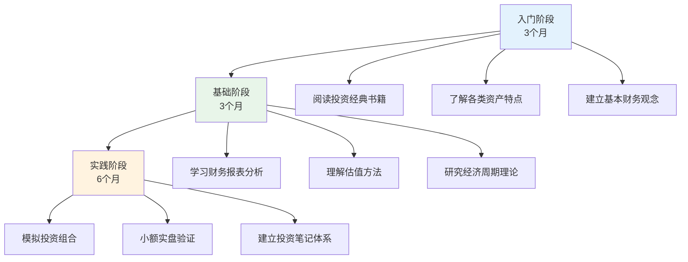
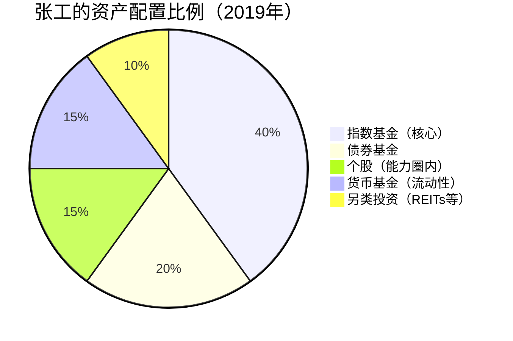
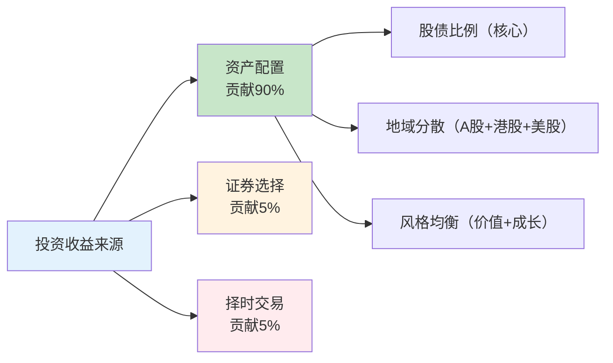
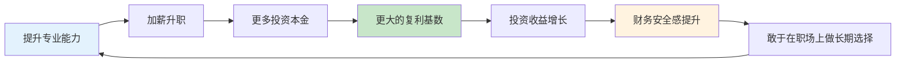

## 案例五：一个投资者的财富增长之路

本案例跟踪记录了一位普通上班族从零开始学习投资，用12年时间实现从积累期到杠杆期跨越的真实历程。这个案例的核心价值在于：它不是天才的故事，而是一个普通人通过系统学习、纪律执行和持续优化，让复利真正发挥作用的过程。

### 案例背景

**主人公画像**

| 维度 | 初始状态 |
|------|----------|
| 年龄 | 28岁（2012年开始系统投资） |
| 职业 | 二线城市机械工程师 |
| 月薪 | 8,000元（税后） |
| 家庭 | 已婚，妻子月薪5,000元 |
| 存款 | 6万元（工作3年积蓄） |
| 投资知识 | 几乎为零，仅知道银行理财 |
| 负债 | 房贷3,200元/月（公积金覆盖大部分） |

**起点的困境**

2012年的张工（化名）和大多数同龄人一样，收入不算低但也没多少结余。每月家庭总收入13,000元，扣除房贷、生活开支后，能存下的钱大约3,000-4,000元。按这个速度，攒到100万需要20年以上。

转折点出现在2012年底，他读了一本关于复利投资的书，书中一句话击中了他："如果你的资产年化收益只有2%，你本质上是在让银行用你的钱去赚钱；如果你能让资产年化达到8%，10年后的差距是翻倍的。"

他做了一个简单的计算：

| 场景 | 年化收益率 | 6万元10年后 | 6万元20年后 |
|------|-----------|------------|------------|
| 银行活期 | 0.35% | 6.21万 | 6.43万 |
| 银行定期 | 3% | 8.06万 | 10.83万 |
| 稳健理财 | 6% | 10.75万 | 19.24万 |
| 合理投资 | 10% | 15.56万 | 40.36万 |

这组数据让他意识到：**投资能力的差距，本质上是人生财富的差距**。他决定系统学习投资。

### 第一阶段：积累期的学习与试水（2012-2015）

#### 系统学习（第1年）

张工没有急于投入资金，而是花了整整一年时间学习。他的学习路径如下：



**他读的书单（按顺序）**：

1. **入门级**：《小狗钱钱》《富爸爸穷爸爸》——建立正确的金钱观念
2. **基础级**：《聪明的投资者》《漫步华尔街》——理解市场运行规律
3. **进阶级**：《证券分析》《投资最重要的事》——学习分析框架
4. **实操级**：《指数基金投资指南》《定投十年财务自由》——掌握具体方法

**学习方法的关键细节**：

- 每天早上6:00-7:00阅读，坚持了整个第一年
- 做了超过200页的读书笔记，每本书提炼核心模型
- 在雪球、集思录等论坛潜水学习，看高手的分析思路
- 用Excel建立了一个模拟投资组合，跟踪了6个月

#### 小额实盘（第2-3年）

2013年下半年，他开始用真金白银实践，但严格控制金额：

**初始资金分配**：

| 用途 | 金额 | 占比 | 说明 |
|------|------|------|------|
| 应急储备金 | 2万 | 33% | 保持不动，放在货币基金 |
| 投资本金 | 3万 | 50% | 分批投入市场 |
| 学习预算 | 1万 | 17% | 买课程、参加线下活动 |

**第一年投资组合**：

他采用"核心-卫星"策略，这是他从书中学到的第一个实用框架：

- **核心仓位（70%）**：沪深300指数基金定投，每月1,500元
- **卫星仓位（30%）**：个股尝试，选择了3只他能看懂财报的制造业公司

**第一年的成绩单**：

| 指标 | 结果 |
|------|------|
| 总投入 | 4.8万元（含定投追加） |
| 绝对收益 | +3,200元 |
| 年化收益率 | 约6.7% |
| 沪深300同期 | +5.2% |
| 超额收益 | +1.5个百分点 |

虽然跑赢了指数，但他反思发现：花在研究个股上的时间超过100小时，只多赚了约700元。这个发现让他第一次深刻理解了**时间的机会成本**。

#### 积累期关键决策

2014年初，张工做了一个重要决定：**把投资收益率提升作为和加薪同等重要的目标**。

他算了一笔账：当时月薪8,000元，每年加薪幅度约8-10%。如果投资能力能把年化收益率从6%提升到10%，在资产达到50万时，投资收益的增量就相当于一次加薪。

这个认知让他把"提升投资能力"变成了和"提升专业技能"并列的长期任务。

### 第二阶段：加速期的系统化（2015-2019）

#### 收入增长与投资协同

2015-2019年间，张工的收入结构发生了显著变化：

| 年份 | 月薪 | 年终奖 | 投资收益 | 家庭年收入 |
|------|------|--------|----------|-----------|
| 2015 | 10,000 | 3万 | 0.8万 | 18.8万 |
| 2016 | 12,000 | 4万 | 1.5万 | 22.5万 |
| 2017 | 14,000 | 5万 | 3.2万 | 28.2万 |
| 2018 | 15,000 | 6万 | 2.1万 | 29.1万 |
| 2019 | 16,000 | 8万 | 5.6万 | 36.6万 |

注意2018年投资收益下降——这是A股的熊市年份。但张工不仅没有亏损，还保持了正收益，这得益于他在2017年市场高点时做的一件事：**将股票仓位从60%降至35%，增配了债券基金和货币基金**。

#### 投资体系的成熟

到2017年，张工已经形成了一套完整的投资体系：

**资产配置框架**：



**定投纪律的执行细节**：

张工的定投不是简单的"每月固定金额"，而是采用了一个改良策略：

1. **基础定投**：每月15日自动扣款5,000元到指数基金
2. **估值调节**：当沪深300市盈率低于历史30%分位时，追加定投至8,000元
3. **止盈机制**：当年收益率超过25%时，赎回超额部分转入债券基金
4. **再平衡**：每半年检查一次资产比例，偏离超过5%时调整

这套纪律让他在2015年牛市中没有贪婪追高，在2018年熊市中没有恐惧割肉。

**投资笔记体系**：

他坚持记录每一笔投资决策的逻辑：

```text
日期：2017-06-15
操作：减持沪深300ETF 2万元
理由：
1. 沪深300市盈率14.2，处于历史65%分位
2. 股债利差收窄至2.1%，接近历史均值
3. 个人资产中权益类占比已达58%，超出目标
执行：赎回2万，转入中证全债ETF
预期：降低组合波动，等待更好的入场时机
```

这个习惯让他在市场波动时有据可依，而不是凭情绪决策。

#### 关键转折：2018年熊市的考验

2018年是张工投资生涯中最重要的年份。A股全年下跌超过25%，很多人在恐慌中割肉离场。

**张工的操作记录**：

| 月份 | 市场情况 | 操作 | 心理状态 |
|------|----------|------|----------|
| 1月 | 开始下跌 | 维持定投，观望 | 轻微不安 |
| 3月 | 加速下跌 | 开始加仓，定投翻倍 | 检查历史数据后镇定 |
| 6月 | 持续阴跌 | 继续加仓，投入年终奖 | 有压力但坚持纪律 |
| 10月 | 暴跌至2440点 | 大幅加仓，动用储备金 | 逆向思维发挥作用 |
| 12月 | 企稳反弹 | 恢复正常定投节奏 | 对长期更有信心 |

**他在2018年10月写下的投资笔记**：

> "今天沪深300跌到2900点附近，市盈率只有10.2倍，处于历史最低10%的分位。我的定投账户浮亏15%，但我做了三件事：第一，重新看了一遍过去50年全球股市的数据，确认每一次大跌最终都回来了；第二，检查了我的现金流，确认未来12个月不需要动用这笔钱；第三，把定投金额从5000提高到10000。别人恐惧时贪婪——这不是一句空话，而是需要数据和纪律支撑的决策。"

**2018年的结果**：

- 全年投入：14.4万元（含加仓）
- 年末浮亏：-8.2%
- 但2019年市场反弹后，这部分加仓的收益率超过40%

这段经历让他深刻理解了一句话：**熊市是投资者的朋友，前提是你有足够的现金流和心理准备**。

### 第三阶段：杠杆期的跨越（2019-2024）

#### 资产突破500万的关键节点

到2019年底，张工的投资资产达到了约120万。但真正的加速发生在2020-2024年间。

**资产增长曲线**：

| 时间点 | 投资资产 | 年投资收益 | 累计收益 |
|--------|---------|-----------|---------|
| 2019.12 | 120万 | 5.6万 | — |
| 2020.12 | 168万 | 18.2万 | 23.8万 |
| 2021.12 | 215万 | 22.5万 | 46.3万 |
| 2022.12 | 235万 | -8.6万 | 37.7万 |
| 2023.12 | 298万 | 28.4万 | 66.1万 |
| 2024.12 | 385万 | 42.6万 | 108.7万 |

**关键发现**：从2020年开始，投资收益开始超过工资收入。到2024年，投资收益42.6万，而工资+奖金约38万。**钱生钱的速度超过了人赚钱的速度**——这就是杠杆期的标志。

#### 认知升级：从"选股"到"资产配置"

2020年后，张工的投资理念发生了根本性转变。他意识到，对于非职业投资者来说，**资产配置决定了90%以上的收益**。

**他的新框架**：



基于这个认知，他大幅简化了投资组合：

| 资产类别 | 配置比例 | 具体标的 | 选择理由 |
|----------|---------|---------|---------|
| A股宽基指数 | 35% | 沪深300+中证500 | 覆盖大中盘，费率低 |
| 港股/美股指数 | 15% | 恒生科技+标普500 | 地域分散，对冲单一市场风险 |
| 债券基金 | 25% | 中证全债+国债ETF | 降低波动，提供再平衡机会 |
| REITs | 10% | 公募REITs组合 | 另类资产，与股债低相关 |
| 现金类 | 15% | 货币基金+短债 | 流动性储备，等待机会 |

#### 投资收益的复利效应可视化

为了直观理解复利的威力，张工做了一张图，对比了三种情况：

| 场景 | 年化收益 | 2012年投入6万 | 2024年价值 | 加上每月定投3000 |
|------|---------|-------------|-----------|----------------|
| 银行定期 | 3% | 6万 | 8.6万 | 78.3万 |
| 张工实际 | 约9.5% | 6万 | 18.2万 | 385万 |
| 指数平均 | 7% | 6万 | 13.5万 | 258万 |

**复利的真正威力体现在定投上**：每月3,000元的定投，在9.5%的年化收益下，12年后变成了约370万。这就是为什么张工反复强调："**定投是最好的懒人投资法，前提是你能坚持10年以上**。"

### 成果数据总览

| 维度 | 2012年（起点） | 2024年（现在） | 变化 |
|------|---------------|---------------|------|
| 投资资产 | 6万 | 385万 | 64倍 |
| 年投资收益 | 0 | 42.6万 | — |
| 投资年化收益率 | — | 约9.5% | 持续优化 |
| 投资知识体系 | 零基础 | 系统化框架 | 12年积累 |
| 收入结构 | 100%主动收入 | 主动52%+被动48% | 质变 |
| 财务阶段 | 积累期初 | 杠杆期中 | 跨越两个阶段 |
| 投资决策方式 | 情绪驱动 | 系统+纪律 | 根本转变 |

### 深度复盘：成功的关键因素

#### 因素一：先学习再投入

张工用一年时间系统学习，这在很多人看来是"浪费时间"。但这一年的学习让他避免了新手最常见的三个错误：

1. **追涨杀跌**：理解了市场周期后，他在2015年牛市中没有追高
2. **频繁交易**：理解了交易成本和税收的影响后，他把年换手率控制在50%以下
3. **集中持仓**：理解了分散投资的价值后，他从未把超过15%的资金放在单只股票上

**对比数据**：同期开始投资的同事小李，第一年就投入10万追涨创业板，在2015年股灾中亏损40%，此后彻底退出股市。两个人的差距不是运气，而是知识储备的差距。

#### 因素二：纪律大于判断

张工的投资纪律可以总结为"四不原则"：

| 纪律 | 具体规则 | 执行情况 |
|------|---------|---------|
| 不预测市场 | 不做任何基于"我觉得会涨/跌"的操作 | 12年零次违反 |
| 不中断定投 | 无论市场涨跌，每月定投不中断 | 仅2018年10月临时加仓 |
| 不超过配置 | 任何单一资产不超过总资产40% | 12年零次违反 |
| 不借钱投资 | 永远不加杠杆，永远用闲钱投资 | 12年零次违反 |

这些纪律看似简单，但执行12年需要极强的心理素质。他坦言，2018年10月是最难熬的时候，账户浮亏超过15万，但他靠着检查历史数据和现金流分析稳住了心态。

#### 因素三：持续迭代投资体系

张工的投资体系不是一成不变的，而是持续迭代的：

| 阶段 | 体系版本 | 核心变化 |
|------|---------|---------|
| 2012-2014 | V1.0 | 纯定投指数基金 |
| 2015-2017 | V2.0 | 加入个股研究，尝试主动管理 |
| 2018-2019 | V3.0 | 回归指数为主，加入估值调节 |
| 2020-2022 | V4.0 | 全球分散配置，加入REITs |
| 2023-至今 | V5.0 | 简化组合，聚焦资产配置 |

每次迭代都是基于实践中的反思。比如V2.0阶段他花大量时间研究个股，最终发现扣除时间成本后，收益并不比纯指数定投高多少，于是在V3.0回归了指数为主。

#### 因素四：收入增长与投资的正循环

张工的成功不仅仅是投资的成功，更是"收入增长+投资增值"双轮驱动的结果：



这个正循环的关键节点是：当投资收益能覆盖基本生活开支时，你在职场上的选择就不再被"生存焦虑"绑架，可以做更长期的规划。

### 常见误区与纠正

基于张工12年的投资经历，以下是普通投资者最容易犯的错误：

**误区一：等有钱了再投资**

很多人觉得"我现在钱太少，投资没意义"。张工从6万元开始，如果他等到"有钱了"再开始，12年的复利窗口就白白浪费了。

纠正：投资的第一步不是钱多钱少，而是建立正确的投资体系。用1万元学习投资，比用100万盲目投资更有价值。

**误区二：追求高收益而忽视风险**

新手常被"年化30%"的高收益吸引，却忽略了高收益背后往往伴随着本金永久损失的风险。

纠正：张工12年的年化收益率约9.5%，看起来不高，但关键是**持续且不中断**。巴菲特的年化收益率也就20%左右，但他保持了60年。投资比的不是谁跑得快，而是谁跑得久。

**误区三：把投资当赌博**

频繁交易、追热点、加杠杆——这些行为的本质是赌博，不是投资。

纠正：张工12年的年换手率平均不到50%。他买过的指数基金，平均持有时间超过5年。真正的投资是"买入好资产，然后耐心等待"。

**误区四：忽视投资以外的因素**

很多人把全部注意力放在"买什么"上，却忽视了收入增长、支出控制、保险保障等同样重要的因素。

纠正：张工的投资资产中，约40%来自工资储蓄的持续投入，60%来自投资收益。如果他的工资没有从8,000增长到16,000，投资收益的复利效应会大打折扣。

### 可复制的方法论

从张工的案例中，可以提炼出一套可复制的投资方法论：

#### 第一步：建立财务基础（1-3个月）

1. 记账至少3个月，搞清楚钱花在哪里
2. 建立应急储备金（3-6个月生活费）
3. 配置基础保险（医疗险+意外险+定期寿险）
4. 设定储蓄率目标（至少30%）

#### 第二步：系统学习投资（3-12个月）

1. 阅读3-5本投资经典书籍
2. 理解各类资产的风险收益特征
3. 学习基本的估值方法
4. 用模拟盘或小额实盘验证所学

#### 第三步：建立投资体系（第2年）

1. 确定自己的资产配置比例
2. 选择具体的投资标的（指数基金为首选）
3. 制定定投计划并设置自动执行
4. 建立投资笔记，记录每笔决策的逻辑

#### 第四步：执行与迭代（长期）

1. 严格执行定投纪律，不因市场波动中断
2. 每年复盘一次投资体系，根据实际情况调整
3. 持续学习，但不频繁改变策略
4. 当资产规模增长后，逐步优化资产配置

### 进阶思考：投资与人生的协同

张工的案例揭示了一个更深层的道理：**投资不是孤立的财务活动，而是人生规划的一部分**。

他在12年投资旅程中获得的不仅仅是财富增长，还有：

1. **延迟满足的能力**：学会为未来的目标牺牲当下的享受
2. **系统思考的能力**：学会从概率和长期视角看问题
3. **情绪管理的能力**：学会在市场波动中保持理性
4. **持续学习的习惯**：12年来从未停止阅读和反思

这些能力反过来又帮助他在职场上做出了更好的决策——他敢于在35岁时跳槽到一家更有发展前景的公司，因为他知道即使收入暂时下降，投资收益也能提供缓冲。

**最终目标不是赚到多少钱，而是获得选择的自由**。当你的被动收入能覆盖基本生活开支时，你就有底气去做真正想做的事。这就是财富增长的终极意义。
