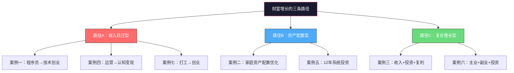
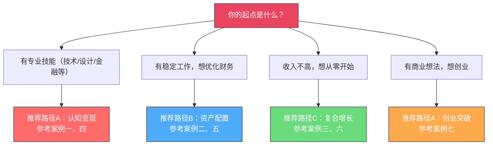
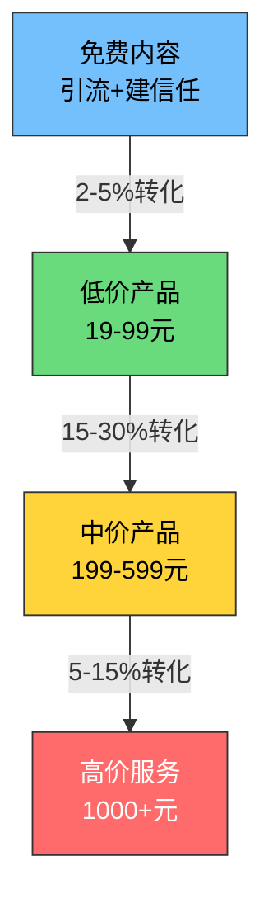
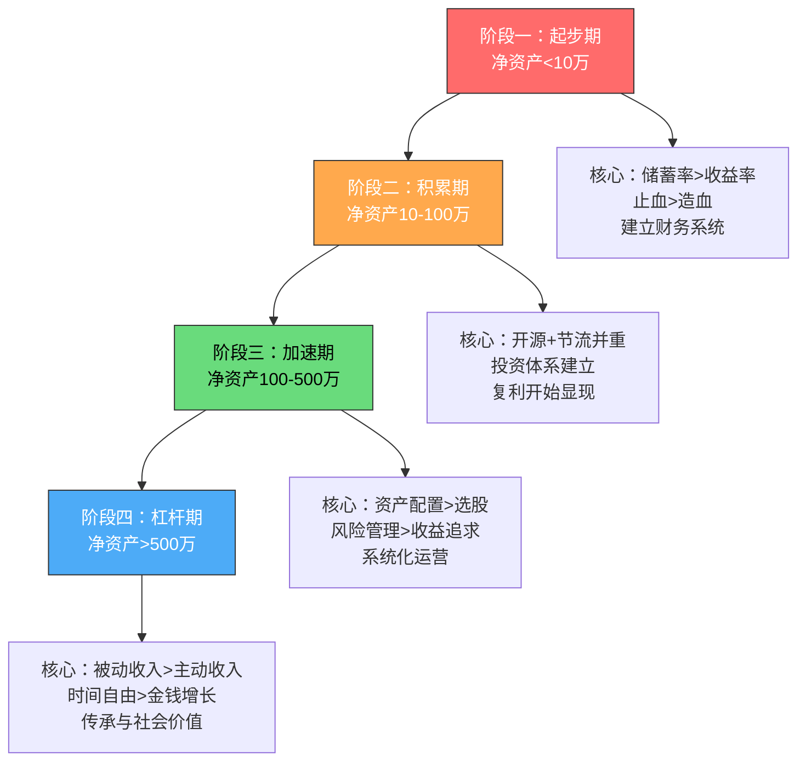

# 案例总结：财富增长的共性规律与个性化路径

> "成功不可复制，但规律可以借鉴。"

本章呈现了七个不同背景、不同起点、不同路径的财富增长案例。本节将这些案例放在一起，横向对比、纵向提炼，找出**所有成功案例的共性规律**，并帮你找到**最适合你自己的个性化路径**。

---

## 一、案例全景纵览

### 1.1 七位主人公的起点画像

| 编号 | 化名 | 起始年龄 | 职业 | 起始月收入 | 所在城市 | 核心困境 |
|------|------|---------|------|-----------|---------|---------|
| 案例一 | 陈工 | 29岁 | 后端工程师 | 17,500元 | 杭州 | 收入天花板明显，100%主动收入 |
| 案例二 | 王家 | 32/30岁 | 制造业管理+教师 | 18,000元 | 成都 | 现金流紧绷，生钱资产仅5.3% |
| 案例三 | 林小溪 | 26岁 | 小学教师 | 8,800元 | 湖南三线 | 月光边缘，一场病就扛不住 |
| 案例四 | 林小然 | 26岁 | 电商运营 | 8,800元 | 成都 | 纯主动收入，技能未变现 |
| 案例五 | 张工 | 28岁 | 机械工程师 | 13,000元 | 二线城市 | 投资知识为零，复利窗口未开启 |
| 案例六 | 小刘 | 28岁 | 普通职员 | 8,000元 | 二线城市 | 低储蓄率，无投资意识 |
| 案例七 | 老陈 | 30岁 | 产品经理 | 20,000元（税后） | — | 高收入但无被动收入，目标感缺失 |

### 1.2 案例结局总览

| 编号 | 耗时 | 终态月收入 | 终态净资产 | 被动收入占比 | 核心跃迁 |
|------|------|-----------|-----------|-------------|---------|
| 案例一 | 18个月 | 120,000元 | — | 72% | 从卖时间→卖产品→卖系统 |
| 案例二 | 36个月 | 29,000元（家庭） | 133万 | 被动收入6,800元/月 | 从耗钱资产→生钱资产 |
| 案例三 | 10年 | 80万/年 | 380万 | 52% | 从月光→百万→加速期 |
| 案例四 | 12个月 | 13,200元（副业） | — | 84%（产品型收入） | 从技能→认知差→产品化 |
| 案例五 | 12年 | 投资收益42.6万/年 | 385万 | 48% | 从投资小白→系统化投资者 |
| 案例六 | 15年 | 被动收入2.5万/月 | 350万 | 被动收入覆盖开支 | 从月光→财务自由 |
| 案例七 | 10年 | 年营收500万 | 1,100万 | — | 从打工→副业→创业 |

---

## 二、横向对比：不同路径的核心差异

### 2.1 财富增长的三条主路径

七个案例看似各不相同，但本质上走了三条路径：



**路径A：收入跃迁型**（案例一、四、七）

核心逻辑：**突破收入天花板**。通过商业模式升级（从卖时间到卖产品/卖系统），实现收入数量级跃迁。特点是爆发力强，但需要特定技能或创业能力。

| 维度 | 案例一（技术创业） | 案例四（认知变现） | 案例七（创业） |
|------|-----------------|-----------------|--------------|
| 启动门槛 | 中（需要技术深度） | 低（任何可教技能） | 高（需要商业能力） |
| 收入上限 | 高（无上限） | 中高（取决于流量） | 极高（取决于企业规模） |
| 风险等级 | 低（副业试错） | 极低（零成本启动） | 高（辞职创业） |
| 适合人群 | 有专业技能的职场人 | 任何有认知差的人 | 有创业意愿和商业嗅觉的人 |
| 核心能力 | 产品化能力 | 内容创作+营销 | 领导力+商业模式设计 |

**路径B：资产配置型**（案例二、五）

核心逻辑：**让钱生钱**。通过系统性的资产配置和长期投资，利用复利效应实现财富增长。特点是稳定持久，但需要较长的时间积累。

| 维度 | 案例二（家庭配置） | 案例五（个人投资） |
|------|-----------------|-----------------|
| 启动门槛 | 低（优化开支即可） | 低（小额定投即可） |
| 收入上限 | 中（受限于本金规模） | 中高（取决于本金+时间） |
| 风险等级 | 低（分散配置） | 低中（取决于配置策略） |
| 适合人群 | 有稳定收入的家庭 | 有耐心的长期主义者 |
| 核心能力 | 纪律+配置知识 | 纪律+投资体系 |

**路径C：复合增长型**（案例三、六）

核心逻辑：**多引擎驱动**。同时提升收入（主业+副业）和投资收益，两者形成正循环。特点是速度适中、风险可控、适用面最广。

| 维度 | 案例三（教师+副业+投资） | 案例六（职员+副业+投资） |
|------|----------------------|----------------------|
| 启动门槛 | 低 | 低 |
| 收入上限 | 高（取决于副业规模） | 中高 |
| 风险等级 | 低 | 低 |
| 适合人群 | 几乎所有人 | 几乎所有人 |
| 核心能力 | 执行力+耐心 | 执行力+学习能力 |

### 2.2 不同起点的最佳路径匹配



---

## 三、共性规律：所有成功案例的八个共同点

尽管七个案例的路径各不相同，但深入分析后，我们发现了八个反复出现的共性规律。这些规律不依赖于特定行业、特定技能或特定运气，是任何人在任何起点都可以应用的底层逻辑。

### 规律一：先止血，再造血

**现象**：七个案例中，没有一个人是"一上来就投资"或"一上来就做副业"的。所有人都先做了同一件事——**搞清楚自己的财务状况，堵住现金流漏洞**。

| 案例 | "止血"动作 | 耗时 | 效果 |
|------|-----------|------|------|
| 案例一 | 分析技能和市场需求，而非盲目行动 | 1个月 | 避免了方向错误 |
| 案例二 | 削减开支4,700元/月，还清车贷 | 6个月 | 从-7,400→+5,200月净现金流 |
| 案例三 | 记账+预算+建立应急基金 | 4个月 | 从月光→月存1,600元 |
| 案例四 | 需求验证，不盲目开始 | 2周 | 避免了选错方向 |
| 案例五 | 系统学习一年再投入 | 12个月 | 避免了新手三大错误 |
| 案例六 | 记账3个月，发现隐形消费 | 3个月 | 储蓄率从25%→35% |
| 案例七 | 主业深耕3年，积累能力和人脉 | 3年 | 为后续副业/创业打下基础 |

**底层逻辑**：在你还没有"止血"的时候，任何"造血"动作都是在往破桶里倒水。财务优化的第一步永远是：**弄清楚钱去了哪里，然后堵住不必要的流出**。

### 规律二：储蓄率比收益率重要

**现象**：在本金较少的阶段（净资产<100万），所有案例的财富增长主要靠**提高储蓄率**，而非提高投资收益率。

**数学解释**：

```text
场景A：月入10,000元，储蓄率10%（月存1,000），年化收益15%
  → 一年后：1,000 × 12 + 收益 ≈ 13,800元

场景B：月入10,000元，储蓄率40%（月存4,000），年化收益8%
  → 一年后：4,000 × 12 + 收益 ≈ 51,840元
```

场景B的收益率只有场景B的一半，但最终金额是场景A的3.75倍。**在本金少的时候，多存钱比多赚钱（投资）更有效**。

| 案例 | 积累期储蓄率 | 核心策略 |
|------|------------|---------|
| 案例二 | 从负→30%+ | 削减开支+增加副业 |
| 案例三 | 从2%→40%+ | 记账+预算+强制储蓄 |
| 案例五 | 30%+ | 自动转账+不中断定投 |
| 案例六 | 25%→50%+ | 削减开支+副业收入 |

**何时储蓄率不再是关键？** 当你的净资产超过100万后，投资收益的绝对值开始超过年度储蓄。这时候，**资产配置和投资能力**的重要性才真正超过储蓄率。

### 规律三：建立"先付给自己"的自动机制

**现象**：所有案例都采用了某种形式的"自动化储蓄/投资"——发工资当天自动扣款，而不是月底看剩多少存多少。

| 案例 | 具体做法 | 关键细节 |
|------|---------|---------|
| 案例二 | 发工资当天自动转5,200元到投资账户 | 避免"先花后投" |
| 案例三 | 发工资当天自动转1,600元到储蓄账户 | "先付给自己"原则 |
| 案例五 | 每月15日自动扣款5,000元到指数基金 | 不择时，不中断 |
| 案例六 | 工资到账日自动转2,800元到投资账户 | 从手动→自动 |

**底层逻辑**：人性天然倾向于"先满足当下的欲望"。自动机制绕过了意志力的消耗——你不需要每个月都做出"存钱还是花钱"的决定，因为钱在你看到工资之前就已经被存起来了。

### 规律四：先建立信任，再考虑变现

**现象**：所有通过副业/认知变现的案例（案例一、三、四、七），都经历了至少2-3个月的"免费内容期"或"能力积累期"，没有一上来就卖东西。

| 案例 | 免费积累期 | 积累内容 | 启动付费时机 |
|------|-----------|---------|------------|
| 案例一 | 3个月 | 技术博客+GitHub项目 | 第4个月 |
| 案例三 | 3个月 | 教案积累+口碑建立 | 第4个月 |
| 案例四 | 2个月 | 小红书帖子50篇 | 第3个月 |
| 案例七 | 3年 | 产品能力+行业人脉 | 第4年 |

**底层逻辑**：用户付费需要经过"认知→信任→付费"的心理旅程。跳过信任建设直接卖东西，转化率极低。免费内容是建立信任的最佳方式——你在免费内容中展现的专业度和诚意，就是用户付费的理由。

### 规律五：从低价到高价的阶梯式变现

**现象**：所有成功的变现案例都采用了"漏斗式"定价策略——用低价产品筛选付费意愿，用高价产品实现利润。



| 案例 | 引流层 | 转化层 | 利润层 | 增值层 |
|------|--------|--------|--------|--------|
| 案例一 | 免费博客 | 文档模板49元 | 课程299元 | 咨询800元/时 |
| 案例三 | 教案分享 | 线上课程199元 | 辅导班 | 工作室 |
| 案例四 | 小红书帖子 | 模板包29.9元 | 课程199元 | 1v1咨询500元 |

### 规律六：复利需要时间，坚持是最大的竞争力

**现象**：所有案例的财富增长都不是线性的，而是前期缓慢、后期加速的指数曲线。几乎所有案例都在中途经历了"看不到成果"的煎熬期。

| 案例 | 煎熬期 | 持续时间 | 突破标志 |
|------|--------|---------|---------|
| 案例一 | 前3个月零收入 | 3个月 | 第一笔课程销售 |
| 案例三 | 前2年净资产增长缓慢 | 2年 | 辅导班收入稳定超过工资 |
| 案例四 | 前2个月零收入 | 2个月 | 第一条爆款帖子 |
| 案例五 | 2018年熊市浮亏15万 | 约12个月 | 2019年反弹，加仓部分收益40%+ |
| 案例六 | 前5年净资产增长缓慢 | 5年 | 投资资产突破50万 |

**复利曲线的典型形态**：

```text
资产
  ^
  |                                    *
  |                                 ***
  |                              ***
  |                           ***
  |                        ***    ← 加速期（后30%时间贡献70%收益）
  |                     ***
  |                  ***
  |              ****
  |          ****    ← 积累期（前70%时间贡献30%收益）
  |      ****
  |  ****
  |**________________________________→ 时间
```

**林小溪的数据**（案例三）是最好的佐证：
- 从零到100万：5年（2016-2021），储蓄贡献56万，投资收益44万
- 从100万到380万：4年（2021-2025），投资收益占比超过50%
- 前3年投资收益占比15%，后2年投资收益占比45%

### 规律七：收入增长与投资增长的双轮驱动

**现象**：所有长期成功的案例都不是"只靠投资"或"只靠收入增长"，而是两者形成正循环。


| 案例 | 收入增长贡献 | 投资增长贡献 | 正循环节点 |
|------|------------|------------|-----------|
| 案例一 | 副业收入12万/月 | — | 副业收入>工资后辞职创业 |
| 案例三 | 副业收入16,000元/月 | 投资收益150万/年 | 投资收益超过工资时心态质变 |
| 案例五 | 工资从8,000→16,000 | 投资收益42.6万/年 | 投资收益>工资收入 |
| 案例六 | 副业月入3,000 | 10年后投资资产120万 | 被动收入>日常开支 |

### 规律八：系统化运营，从"做事"到"建系统"

**现象**：所有案例在后期都经历了从"亲力亲为"到"建立系统"的转变。这是从"赚辛苦钱"到"让系统帮你赚钱"的关键跃迁。

| 案例 | 系统化动作 | 效果 |
|------|-----------|------|
| 案例一 | 自动化内容分发+客服机器人+销售漏斗 | 每日工作时间从2h→1.5h，收入翻倍 |
| 案例三 | 辅导班交给合伙人运营 | 个人时间减半，总收入翻倍 |
| 案例四 | 内容SOP+自动回复+学员推荐机制 | 每周5小时维持日更 |
| 案例五 | 自动定投+半年再平衡+投资笔记体系 | 纪律执行12年，年化9.5% |
| 案例六 | 定投自动执行+资产配置纪律 | 15年不中断 |

---

## 四、关键认知升级的横向对比

### 4.1 所有案例中反复出现的认知跃迁

| 认知跃迁 | 出现频率 | 典型案例 | 核心表述 |
|---------|---------|---------|---------|
| 从"赚钱"到"生钱" | 7/7 | 案例二、三、五 | 让资产为你工作，而不是你为钱工作 |
| 从"卖时间"到"卖产品" | 4/7 | 案例一、三、四、七 | 一次创作，反复销售 |
| 从"省钱"到"配置" | 3/7 | 案例二、三、五 | 每一分钱都有"工作" |
| 从"完美主义"到"完成优先" | 3/7 | 案例一、四、六 | 80分的产品×10个 > 100分的产品×1个 |
| 从"个人努力"到"系统运作" | 5/7 | 案例一、三、四、五、六 | 从系统中的操作员→系统的设计者 |
| 从"追求收益"到"管理风险" | 3/7 | 案例二、三、五 | 100万之前亏了可以重来，100万之后一次大亏可能需要几年恢复 |

### 4.2 不同阶段的核心认知



---

## 五、常见失败模式与避坑指南

从七个案例中，我们也总结了最常见的失败模式——那些让大多数人"知道但做不到"的陷阱：

### 5.1 致命错误清单

| 错误 | 典型表现 | 正确做法 | 涉及案例 |
|------|---------|---------|---------|
| 急于变现 | 第一天就挂商品链接 | 先积累100篇优质内容 | 案例一、四 |
| 追求完美 | 一篇帖子改5遍，2小时写不完 | 80分即可，数量×及格线 > 极少量完美 | 案例四 |
| 追涨杀跌 | 牛市追高，熊市割肉 | 纪律性定投，不择时 | 案例五 |
| 贪多求全 | 同时做5个平台、3个副业 | 聚焦1个主平台，做到头部再扩展 | 案例四 |
| 不记账 | "大概够花就行" | 每笔支出都记录，每周回顾 | 案例二、三、六 |
| 没有应急金就投资 | 所有钱都投进股市 | 先存6个月应急金 | 案例二、三、五 |
| 忽视复购和转介绍 | 只关注新客户 | 设计推荐机制，老客户是最好的广告 | 案例一、四 |
| 中断定投 | 市场跌了就暂停 | 无论涨跌，每月固定执行 | 案例五、六 |

### 5.2 不同阶段的核心陷阱

| 阶段 | 核心陷阱 | 为什么会掉进去 | 如何避免 |
|------|---------|--------------|---------|
| 起步期 | "等我准备好了再开始" | 完美主义+恐惧失败 | 设定最小可行行动，今天就开始 |
| 积累期 | "怎么还没到100万" | 复利前期增长缓慢，心理感受差 | 设定阶段性小目标，给自己奖励 |
| 加速期 | "我是投资高手了" | 100万后的过度自信 | 记住：一次重大亏损可能需要几年恢复 |
| 杠杆期 | "钱够了，可以享受了" | 目标达成后的松懈 | 设定新的非财务目标（自由、影响力等） |

---

## 六、个性化行动指南：找到你的起点

### 6.1 自我诊断清单

在选择路径之前，先回答以下问题：

| 诊断维度 | 问题 | 你的答案 |
|---------|------|---------|
| **财务状况** | 你每月的净现金流是正还是负？ | ___ |
| | 你的应急基金能覆盖几个月开支？ | ___ |
| | 你的生钱资产占总资产比例是多少？ | ___ |
| **收入结构** | 你有被动收入来源吗？ | ___ |
| | 你的收入100%依赖工资吗？ | ___ |
| | 你有哪些可以变现的技能？ | ___ |
| **时间资源** | 每天有多少可支配的自由时间？ | ___ |
| | 你能坚持一件事多久？ | ___ |
| **风险偏好** | 你能承受多大的亏损？ | ___ |
| | 你的家庭经济状况允许你试错吗？ | ___ |

### 6.2 基于诊断结果的行动方案

**方案A：现金流为负或极低**（参考案例二、三）

```text
第1步（第1-3个月）：记账+预算，堵住现金流漏洞
第2步（第3-6个月）：建立6个月应急基金
第3步（第6-12个月）：启动定投（指数基金，每月最低500元）
第4步（第12个月后）：探索副业可能性
```

**方案B：有稳定现金流，想优化配置**（参考案例二、五）

```text
第1步（第1周）：财务体检，计算净资产和生钱资产占比
第2步（第1-3个月）：优化开支，提高储蓄率到30%+
第3步（第3-6个月）：建立应急基金
第4步（第6个月后）：启动指数基金定投
第5步（持续）：逐步扩展资产类别（债券→REITs→海外）
```

**方案C：有专业技能，想变现**（参考案例一、四）

```text
第1步（第1-2周）：识别你的认知差（你比谁强？强多少？）
第2步（第2-4周）：需求验证（搜索平台调研+付费意愿测试）
第3步（第1-3个月）：免费内容积累（每周2-3篇，不急着卖）
第4步（第3-6个月）：推出低价产品（模板/手册，19-99元）
第5步（第6-12个月）：推出核心课程（199-599元）
第6步（第12个月后）：系统化运营+高价服务
```

**方案D：想长期投资，追求财务自由**（参考案例五、六）

```text
第1步（第1-3个月）：系统学习3-5本投资经典
第2步（第3-6个月）：小额实盘验证（1-3万元）
第3步（第6个月后）：建立定投计划（自动执行）
第4步（第2年后）：优化资产配置（指数→债券→REITs）
第5步（长期）：每年复盘，持续迭代投资体系
```

### 6.3 不同收入水平的最优策略

| 月收入 | 最优策略 | 核心杠杆 | 参考案例 |
|--------|---------|---------|---------|
| 3,000-5,000元 | 节流为主+小额定投 | 储蓄率 | 案例三、六 |
| 5,000-10,000元 | 节流+副业+定投 | 副业收入 | 案例三、四、六 |
| 10,000-20,000元 | 副业变现+投资组合 | 认知变现 | 案例一、四 |
| 20,000-50,000元 | 收入跃迁+资产配置 | 商业模式升级 | 案例一、七 |
| 50,000元+ | 系统化运营+全球配置 | 系统效率 | 案例五、七 |

---

## 七、数据对比：关键指标的横向分析

### 7.1 财富增长速度对比

| 案例 | 起始净资产 | 终态净资产 | 耗时 | 年均复合增长率 |
|------|-----------|-----------|------|--------------|
| 案例一 | 约15万 | 副业月入12万 | 1.5年 | 收入跃迁（非净资产指标） |
| 案例二 | 67.5万 | 133万 | 3年 | 约25%（含收入增长） |
| 案例三 | 1.5万 | 380万 | 10年 | 约73%（含储蓄+副业+投资） |
| 案例四 | 约2万（存款） | 副业月入1.3万 | 1年 | 收入跃迁 |
| 案例五 | 6万 | 385万 | 12年 | 约40%（含定投追加） |
| 案例六 | 5万 | 350万 | 15年 | 约35%（含储蓄+副业+投资） |
| 案例七 | 30万 | 1,100万 | 10年 | 约43%（含创业收入） |

**关键洞察**：案例三（林小溪）的增长率最高，因为她的起点最低、副业收入增长最快、投资复利效应最完整。这说明：**低起点不是劣势，反而意味着更大的增长空间**。

### 7.2 被动收入占比变化

| 案例 | 起始被动收入占比 | 终态被动收入占比 | 转折点 |
|------|----------------|----------------|--------|
| 案例一 | 0% | 72% | 课程上线后（第10个月） |
| 案例二 | 0.7% | 约23%（被动收入6,800/月总收入29,000） | 定投+REITs+副业三管齐下 |
| 案例三 | 0% | 52% | 线上课程+教案平台+投资收益 |
| 案例四 | 0% | 84%（产品型收入） | 模板+课程上线后 |
| 案例五 | 0% | 48% | 投资资产超过200万后 |
| 案例六 | 0% | 被动收入覆盖开支 | 15年定投+副业 |
| 案例七 | 0% | —（创业收入非传统被动收入） | 公司运营稳定后 |

---

## 八、进阶思考：从案例中提炼的深层智慧

### 8.1 财富增长的本质

七个案例告诉我们，财富增长的本质不是"赚更多钱"，而是**建立一个能持续为你工作的系统**。这个系统可以是：

- **投资系统**（案例五）：自动定投+资产配置+纪律执行
- **内容系统**（案例一、四）：一次创作+反复销售+自动分发
- **商业系统**（案例七）：团队+流程+品牌
- **教育系统**（案例三）：标准化教学+口碑传播+线上线下结合

### 8.2 最被低估的财富杠杆

在所有案例中，最被低估的财富杠杆是**时间**。

复利的数学公式：`FV = PV × (1 + r)^n`

其中n（时间）在指数位置。这意味着：
- 年化10%，10年后的1万元 = 2.59万
- 年化10%，20年后的1万元 = 6.73万
- 年化10%，30年后的1万元 = 17.45万

**早开始10年，最终结果相差2.6倍**。这就是为什么所有案例都在强调：**今天就开始，不要等到"准备好了"**。

### 8.3 适合大多数人的"最小可行方案"

如果你读完七个案例还是不知道从哪里开始，这里是一个**所有人都可以执行的最小方案**：

```text
【第1个月】
1. 下载一个记账App，记录每一笔支出
2. 发工资当天，自动转10%到一个单独账户（无论多少）
3. 读完《小狗钱钱》（2小时就能读完）

【第2-3个月】
4. 分析记账数据，找到3个可以砍掉的"隐形消费"
5. 把储蓄率提升到20%
6. 读完《富爸爸穷爸爸》

【第4-6个月】
7. 把应急基金存到3个月生活费
8. 开一个基金账户，设置每月500元自动定投沪深300
9. 盘点自己的技能，思考"我比谁强？强多少？"

【第7-12个月】
10. 维持定投，不中断
11. 如果有变现想法，开始免费内容积累
12. 每季度回顾一次财务状况
```

这个方案不需要任何专业知识，不需要大量资金，不需要辞职，不需要冒险。它只需要你**今天就开始，然后坚持12个月**。

---

## 九、本节核心要点回顾

| 编号 | 要点 | 一句话总结 |
|------|------|-----------|
| 1 | 先止血再造血 | 堵住现金流漏洞是一切的起点 |
| 2 | 储蓄率>收益率 | 本金少的时候，多存钱比多赚钱更有效 |
| 3 | 自动化储蓄 | 用机制绕过意志力的消耗 |
| 4 | 先信任后变现 | 免费内容是最好的信任建设工具 |
| 5 | 阶梯式定价 | 低价筛选用户，高价实现利润 |
| 6 | 复利需要时间 | 前期缓慢是正常的，坚持是最大的竞争力 |
| 7 | 双轮驱动 | 收入增长+投资增长形成正循环 |
| 8 | 建系统而非做事 | 从操作员变成系统设计者 |

**最后的话**：七个案例，七条路径，但只有一个共同的起点——**今天就开始**。你不需要一步到位，不需要完美计划，不需要等所有条件都满足。你只需要从"最小可行方案"开始，然后坚持下去。时间会帮你完成剩下的工作。
