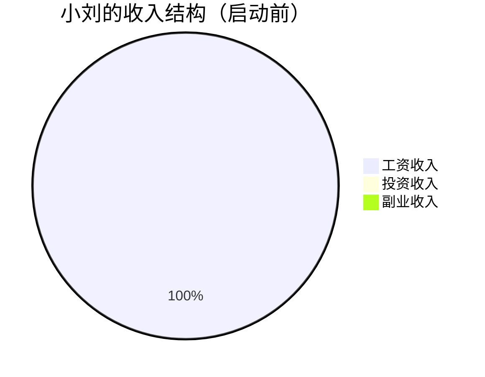
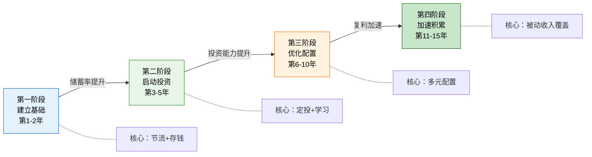
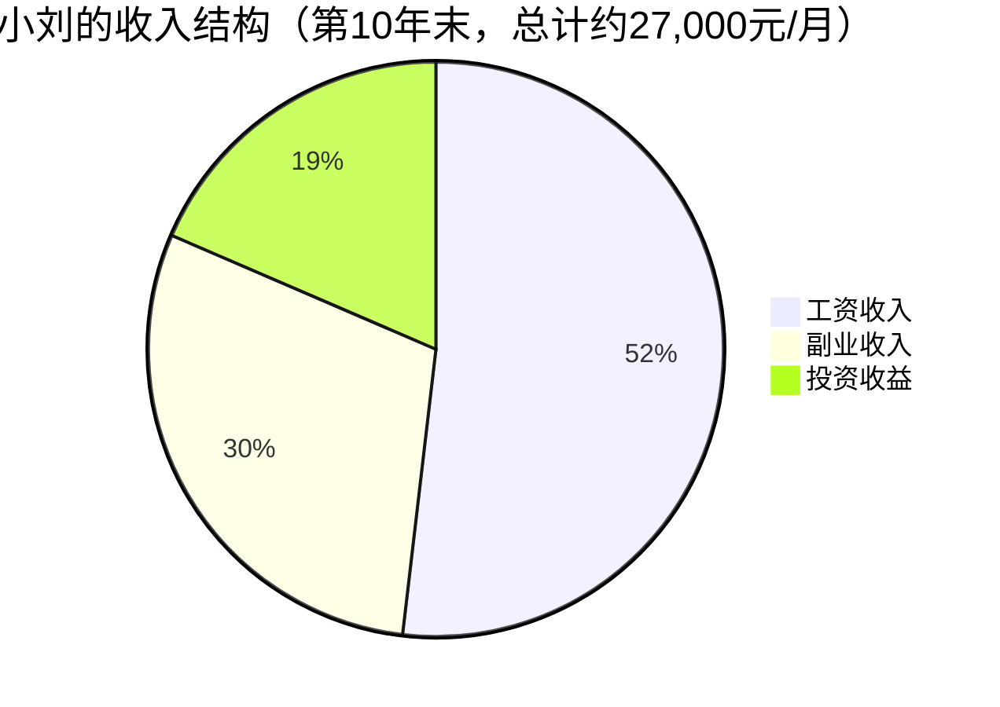
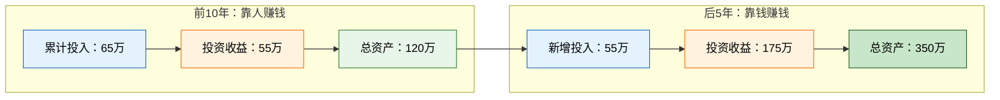
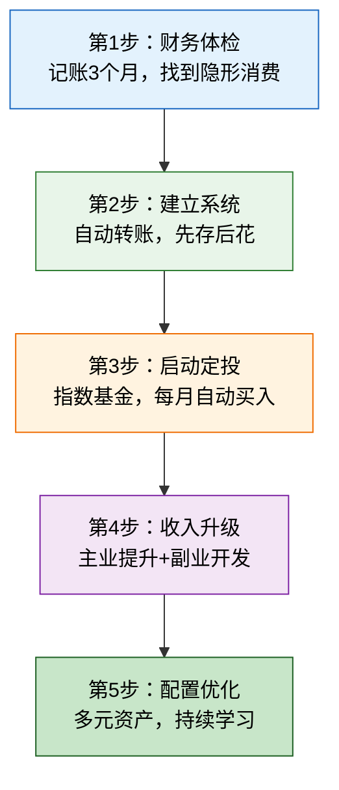

# 案例五：一个普通上班族的复利奇迹

> "复利是世界第八大奇迹。理解它的人赚取它，不理解它的人支付它。" —— 阿尔伯特·爱因斯坦（出处存疑，但道理成立）

本案例追踪一位二线城市普通公司职员从月薪8000元、零投资经验出发，经过15年的系统性执行，最终在43岁实现财务自由的完整过程。这个案例的核心价值不在于"赚了多少钱"，而在于它精确验证了第二章所有核心理论——收入结构优化、生钱资产积累、财富四阶段跃迁、复利的数学威力——在一个没有任何先天优势的普通人身上，如何一步步变为现实。

这不是一个励志鸡汤，而是一份可复制的操作手册。

---

## 一、案例背景：起点画像

### 1.1 人物档案

| 维度 | 详情 |
|------|------|
| 化名 | 小刘 |
| 年龄 | 28岁 |
| 职业 | 二线城市某制造企业行政专员 |
| 工作年限 | 3年 |
| 月薪 | 税前8,000元（到手约7,200元） |
| 每月支出 | 约6,000元 |
| 每月结余 | 约1,200元 |
| 储蓄率 | 约17% |
| 现有资产 | 银行存款5万元 |
| 所在城市 | 武汉（二线城市） |
| 学历 | 本科，工商管理专业 |
| 投资经验 | 零 |
| 目标 | 45岁前实现财务自由（被动收入 > 生活开支） |

### 1.2 启动前的财务体检

小刘在28岁生日那天，做了一件很多人一辈子都没做过的事：认真审视自己的财务状况。结果让他大吃一惊。

**收入结构分析**：



100%的收入来自工资——这是最典型的"主动收入单一依赖"模式。一旦失业，收入立刻归零。

**支出结构分析**：

| 支出类别 | 月金额 | 占比 | 性质 |
|---------|--------|------|------|
| 房租 | 2,000元 | 33% | 必要支出 |
| 餐饮（外卖+外出） | 1,800元 | 30% | 可优化 |
| 交通 | 300元 | 5% | 必要支出 |
| 日用品 | 400元 | 7% | 必要支出 |
| 奶茶/咖啡 | 350元 | 6% | 隐形消费 |
| 冲动购物 | 450元 | 7% | 隐形消费 |
| 订阅服务 | 200元 | 3% | 可优化 |
| 社交/聚餐 | 500元 | 8% | 部分可优化 |
| **合计** | **6,000元** | **100%** | — |

**关键发现**：每月约有1,000元花在"不记得花在哪里"的地方（奶茶、冲动购物、不常用的订阅）。这就是记账的力量——你以为的"必要支出"，其实藏着大量可优化空间。

**资产负债表**：

| 项目 | 金额 | 类型 |
|------|------|------|
| 银行存款 | 50,000元 | 生钱资产（但收益率极低，约2%） |
| 手机/电脑 | 约8,000元 | 耗钱资产（折旧中） |
| 衣物/日用品 | 约5,000元 | 耗钱资产 |
| **总资产** | **约63,000元** | — |
| **总负债** | **0元** | 无房贷、无信用卡债 |
| **净资产** | **约63,000元** | — |

**与同龄人的对比**：

| 指标 | 小刘 | 同龄人中位数 | 前10% |
|------|------|------------|-------|
| 月薪 | 8,000元 | 6,500元 | 15,000元 |
| 储蓄率 | 17% | 10% | 30% |
| 净资产 | 6.3万 | 3万 | 20万 |
| 投资经验 | 无 | 无 | 有 |
| 被动收入 | 0 | 0 | 约500元/月 |

小刘的起点在同龄人中处于中等偏上——有存款、无负债、有储蓄习惯。但他没有任何投资经验，收入结构极度单一。如果他不做出改变，按照当时的轨迹，他将和大多数人一样：一辈子打工，退休后靠微薄的养老金度日。

### 1.3 转折触发点

2023年初，小刘的大学室友在一次聚餐中提到了一个概念："如果你从28岁开始，每月存2800元，按年化8%的收益率计算，到43岁时你将拥有约90万。"

小刘当时不信。他掏出手机，打开了一个复利计算器，输入了这些数字——结果让他震惊：**数字是对的**。

但真正触动他的不是数字本身，而是一个认知：**他从来没有让"钱生钱"过**。5万元在银行活期里躺了3年，按2%的年利率，3年只赚了约3,000元。如果按8%的年化收益率，3年应该赚约12,500元。差了4倍多。

"我一直在用最贵的方式持有现金。" —— 这是小刘的第一个认知升级。

---

## 二、诊断框架：普通上班族的复利路径设计

在讲小刘的具体行动之前，先建立一个分析框架。这个框架是理解整个案例的钥匙。

### 2.1 复利增长的三个核心变量

复利公式 A = P(1+r)^n 有三个变量，但对于工薪族来说，还有一个更关键的变量——**定期追加投入**（定投）。完整的财富增长公式是：

```text
终值 = 初始本金 × (1+r)^n + 每月定投 × [((1+r)^n - 1) / r] × (1+r)
```

对于小刘来说：

| 变量 | 初始值 | 优化方向 | 可控程度 |
|------|--------|---------|---------|
| 初始本金 P | 5万元 | 增加储蓄、年终奖注入 | 中 |
| 年化收益率 r | 2%（银行活期） | 学习投资，提升到8-10% | 高 |
| 投资年限 n | 15年（28→43岁） | 尽早开始 | 低（已确定） |
| 每月定投额 | 0元 | 建立自动定投机制 | 高 |

**关键洞察**：对于工薪族来说，前5年最重要的变量是**每月定投额**（靠储蓄率提升），中后期最重要的变量是**年化收益率**（靠投资能力提升）。这就是第二章"积累期储蓄率比收益率重要100倍"的具体验证。

### 2.2 普通人复利路径的四阶段模型



每个阶段的核心任务完全不同。在第一阶段追求高收益率，就像在新手村追求高级装备——你连本金都没攒够，收益率再高也没用。

---

## 三、执行过程：15年的完整路线

### 3.1 第一阶段：建立基础（第1-2年）

**核心目标**：搞清楚钱去了哪里，建立"存钱系统"，把储蓄率从17%提升到35%以上。

#### 3.1.1 财务体检：记账3个月

小刘做的第一件事，是用记账APP（随手记）连续记账3个月。他没有刻意省钱，只是如实记录每一笔支出。

**3个月后的发现**：

| 发现 | 具体数据 | 情绪反应 |
|------|---------|---------|
| 奶茶/咖啡 | 月均350元（每天约12元） | "我一直以为每天只花5块钱" |
| 外卖 | 月均1,200元（占餐饮的67%） | "自己做饭能省一半" |
| 冲动购物 | 月均450元（淘宝/拼多多） | "至少一半买完就后悔" |
| 不常用订阅 | 月均200元（视频会员×3、音乐会员×2、健身APP） | "有两个视频会员我3个月没打开过" |
| **合计可优化** | **约1,200元/月** | — |

**记账的真正价值**：不是让你"抠门"，而是让你看见真相。大多数人对自己的支出有一个"心理账户"，这个账户和实际数字差距巨大。记账就是对账——把心理账户和现实对齐。

#### 3.1.2 支出优化：三刀切

小刘没有采取极端节俭策略（那不可持续），而是做了三件事：

**第一刀：砍掉不常用订阅**
- 取消2个不常用的视频会员（省40元/月）
- 取消1个不常用的音乐会员（省15元/月）
- 取消健身APP（改用Keep免费版，省25元/月）
- **小计：省80元/月**

**第二刀：自己做饭代替外卖**
- 每周日做一次meal prep（提前备菜），工作日带饭
- 每月仍保留4-5次外出就餐（社交需要）
- 外卖从月均1,200元降到400元
- **小计：省800元/月**

**第三刀：设置"冲动购物冷静期"**
- 看到想买的东西，先加入购物车，等48小时
- 48小时后还想买，再买。实测约60%的东西48小时后就不想买了
- 冲动购物从月均450元降到150元
- **小计：省300元/月**

**三刀合计：月省约1,180元**

优化后的支出结构：

| 支出类别 | 优化前 | 优化后 | 变化 |
|---------|--------|--------|------|
| 房租 | 2,000元 | 2,000元 | 不变 |
| 餐饮 | 1,800元 | 1,000元 | -800 |
| 交通 | 300元 | 300元 | 不变 |
| 日用品 | 400元 | 400元 | 不变 |
| 奶茶/咖啡 | 350元 | 200元 | -150 |
| 冲动购物 | 450元 | 150元 | -300 |
| 订阅服务 | 200元 | 120元 | -80 |
| 社交/聚餐 | 500元 | 500元 | 不变 |
| **合计** | **6,000元** | **4,670元** | **-1,330** |

#### 3.1.3 建立自动存钱系统

小刘设置了一个简单的自动化系统：

```text
发薪日（每月10日）
    │
    ├──→ 自动转账2,800元到专用投资账户（招商银行朝朝宝，随取随用）
    │
    └──→ 剩余约4,400元留在工资卡用于日常开支
```

**关键细节**：他把投资账户和日常消费账户分开了。这不是简单的"自律"，而是**环境设计**——你想花钱也花不到那个账户里的钱。这就是行为经济学中的"心理账户"原理的实际应用。

#### 3.1.4 建立应急基金

在开始投资之前，小刘先用6个月时间建立了应急基金：

- 目标：3个月生活费 = 4,670 × 3 = 14,010元
- 存放位置：招商银行朝朝宝（年化约2.5%，随时可取）
- 6个月后，应急基金到位

**为什么应急基金必须先建**：没有应急基金的人，一旦遇到突发支出（生病、失业、家电坏了），就不得不卖出投资资产。在市场低点被迫卖出，是普通人投资亏损的最大原因之一。应急基金就是你的"财务安全气囊"。

#### 3.1.5 第一阶段数据总结

| 指标 | 起始值 | 第2年末 | 变化 |
|------|--------|---------|------|
| 月支出 | 6,000元 | 4,670元 | -22% |
| 月储蓄 | 1,200元 | 2,800元 | +133% |
| 储蓄率 | 17% | 38% | +21个百分点 |
| 应急基金 | 0 | 14,000元 | 新建 |
| 投资资产 | 0 | 0元 | 尚未开始 |
| 银行存款 | 50,000元 | 约67,000元 | +17,000 |

**这个阶段最大的收获不是钱，而是两个习惯**：
1. 记账习惯——知道自己每一分钱去了哪里
2. 自动转账习惯——先存后花，而不是花剩了再存

### 3.2 第二阶段：启动投资（第3-5年）

**核心目标**：开始定投，学习投资知识，让钱开始"工作"。

#### 3.2.1 投资知识学习路径

小刘没有盲目入场，而是先花了2个月系统学习：

| 阶段 | 学习内容 | 花费时间 | 资源 |
|------|---------|---------|------|
| 第1周 | 理解什么是基金、股票、债券 | 5小时 | 《小狗钱钱》 |
| 第2-3周 | 理解指数基金的原理 | 10小时 | 《指数基金投资指南》（银行螺丝钉） |
| 第4-5周 | 学习定投策略 | 8小时 | 《定投十年财务自由》 |
| 第6-8周 | 了解资产配置基础 | 12小时 | 《漫步华尔街》 |
| 第9-10周 | 开户+模拟操作 | 6小时 | 各大券商APP |

**学习投入**：约41小时，相当于每天1小时，持续6周。

**关键认知收获**：

1. **指数基金 = 买整个市场**：不需要选个股，不需要判断哪个公司好。买沪深300 = 买中国最大的300家公司。这是普通人最省心、最安全的投资方式。

2. **定投 = 强制储蓄 + 摊平成本**：每月固定日期买入固定金额。市场涨了，少买点份额；市场跌了，多买点份额。长期下来，你的平均成本低于市场平均价格。

3. **不需要择时**：试图"低买高卖"是投资中最大的陷阱。即使是专业基金经理，长期择时的胜率也只有50%左右。定投的本质是"放弃择时，拥抱长期"。

#### 3.2.2 定投方案设计

| 项目 | 决策 | 理由 |
|------|------|------|
| 投资标的 | 沪深300指数基金（天弘沪深300A，代码000961） | 覆盖A股最大的300家公司，分散风险，费率低（管理费0.5%/年） |
| 定投金额 | 每月2,800元 | 全部可投资金额 |
| 定投日期 | 每月15日 | 工资到账后5天，避开月初的市场情绪波动 |
| 定投平台 | 支付宝（蚂蚁财富） | 操作简单，费率1折 |
| 止盈策略 | 不设止盈，长期持有 | 28岁开始，投资期限15年+，不需要止盈 |

#### 3.2.3 第一次"市场考验"

第3年末（定投约1年时），A股市场经历了一次约20%的下跌。小刘的账户从约3.5万变成了约2.9万，浮亏约6,000元。

**小刘的心理过程**：

| 时间 | 情绪 | 行为 |
|------|------|------|
| 下跌第1周 | 焦虑，每天看3次账户 | 没有操作 |
| 下跌第2周 | 恐惧，想卖出止损 | 重新读了《定投十年财务自由》中关于"下跌是定投者的朋友"的章节 |
| 下跌第1个月 | 平静，开始理解"摊平成本"的含义 | 继续定投，甚至用年终奖多投了5,000元 |
| 下跌第3个月 | 市场开始反弹 | 账户回到3.2万，且因为低位多买了份额，成本更低了 |

**这次经历教会了小刘三件事**：

1. **浮亏不是亏损**：只有卖出才是真亏。只要不卖，市场早晚会回来。
2. **下跌是定投者的朋友**：市场跌了，同样的钱能买更多份额。这些"便宜的份额"会在市场回升时带来超额收益。
3. **不要每天看账户**：小刘后来改为每月只在定投日查看一次账户。减少查看频率，就是减少情绪干扰。

#### 3.2.4 收入增长策略

在坚持定投的同时，小刘也在提升主动收入：

| 行动 | 时间 | 结果 |
|------|------|------|
| 考取PMP项目管理证书 | 第3年 | 简历加分，为跳槽做准备 |
| 跳槽到一家外企做行政主管 | 第3年末 | 月薪从8,000元涨到12,000元 |
| 学习Excel高级技能+Python自动化 | 第4年 | 工作效率提升，获得更多认可 |
| 获得年度绩效优秀加薪 | 第5年 | 月薪涨到14,000元 |

**收入增长对复利的加速效果**：

月薪从8,000涨到14,000元，月储蓄从2,800元提升到5,500元（储蓄率维持39%）。这多出来的2,700元/月，在剩余10年的投资期限里，按8%年化收益率计算，额外产生约**49万元**的终值。

**这就是"收入增长"对复利的加速作用**：在积累期，提升收入的威力远大于提升收益率。

#### 3.2.5 第二阶段数据总结

| 指标 | 第2年末 | 第5年末 | 变化 |
|------|---------|---------|------|
| 月薪 | 8,000元 | 14,000元 | +75% |
| 月储蓄 | 2,800元 | 5,500元 | +96% |
| 储蓄率 | 38% | 39% | 基本持平 |
| 累计投入本金 | — | 约20万 | — |
| 投资账户市值 | 0 | 约25万 | — |
| 投资收益 | 0 | 约4-5万 | — |
| 年化收益率 | — | 约8% | 达标 |

**复利的效果开始显现**：虽然4-5万的投资收益看起来不多，但这是"钱生钱"的第一步。更重要的是，小刘已经建立了"自动存钱→自动投资"的系统，这个系统会自动运行，不需要他每天操心。

### 3.3 第三阶段：优化配置（第6-10年）

**核心目标**：从单一指数基金定投，升级到多元资产配置；同时大力发展副业收入，加速积累。

#### 3.3.1 资产配置升级

经过3年的投资实践和持续学习，小刘开始优化资产配置：

**配置方案演变**：

| 资产类别 | 第3-5年 | 第6-8年 | 第9-10年 |
|---------|---------|---------|---------|
| 沪深300指数基金 | 100% | 40% | 35% |
| 中证500指数基金 | 0% | 20% | 20% |
| 债券基金 | 0% | 20% | 20% |
| QDII基金（海外） | 0% | 10% | 10% |
| 个股（精选） | 0% | 0% | 10% |
| 现金/货基 | 0% | 10% | 5% |

**为什么这样调整**：

1. **加入中证500**：沪深300是大盘股，中证500是中盘股。两者相关性约0.7，组合起来能降低波动性，同时捕获中盘股的成长性。

2. **加入债券基金**：债券和股票通常负相关——股票跌的时候债券涨。20%的债券配置能显著降低组合波动，让小刘在市场大跌时不至于恐慌卖出。

3. **加入QDII基金**：通过QDII基金投资海外市场（主要是标普500指数），实现地域分散。A股和美股的相关性约0.3-0.5，地域分散能进一步降低风险。

4. **少量个股**：经过5年的学习和实践，小刘开始有选择地投资少量个股（主要是他工作中接触到的制造业龙头公司）。这部分严格控制在总资产的10%以内。

#### 3.3.2 副业收入开发

小刘在第6年开始尝试副业。他选择了和主业相关的方向：**行政管理领域的自媒体**。

**副业路径**：

| 阶段 | 时间 | 内容 | 收入 |
|------|------|------|------|
| 起步 | 第6年 | 在知乎/小红书分享行政管理经验 | 0元（积累粉丝） |
| 变现 | 第7年 | 开始接企业行政管理咨询 | 约2,000元/月 |
| 规模化 | 第8-9年 | 录制在线课程《行政管理实战课》 | 约5,000元/月 |
| 稳定 | 第10年 | 课程+咨询+企业内训 | 约8,000元/月 |

**副业收入的复利效应**：

副业收入不是简单的"多赚一份钱"。它对复利的加速效果体现在三个方面：

1. **增加定投本金**：每月多投5,000-8,000元，10年下来额外积累约100万+
2. **分散收入风险**：主业失业不会断粮
3. **提升个人能力**：副业中锻炼的写作、教学、营销能力，反过来提升了主业竞争力

#### 3.3.3 收入结构质变

到第10年末，小刘的收入结构发生了根本性变化：



对比启动时：

| 指标 | 启动时 | 第10年末 | 变化 |
|------|--------|---------|------|
| 收入来源数 | 1个 | 3个 | +200% |
| 主动收入占比 | 100% | 81% | -19个百分点 |
| 被动收入占比 | 0% | 19% | +19个百分点 |
| 月总收入 | 7,200元 | 27,000元 | +275% |
| 月储蓄 | 1,200元 | 12,000元 | +900% |
| 储蓄率 | 17% | 44% | +27个百分点 |

#### 3.3.4 第三阶段数据总结

| 指标 | 第5年末 | 第10年末 | 变化 |
|------|---------|---------|------|
| 月总收入 | 14,000元 | 27,000元 | +93% |
| 月储蓄 | 5,500元 | 12,000元 | +118% |
| 投资资产 | 25万 | 约120万 | +380% |
| 累计投入本金 | 20万 | 约65万 | — |
| 投资收益 | 5万 | 约55万 | — |
| 年化收益率 | 8% | 约10% | +2个百分点 |
| 被动收入/月 | 约1,700元 | 约10,000元 | +488% |

**这个阶段的关键转变**：

1. 从"靠省钱积累"变成"靠收入增长+投资收益积累"
2. 从"单一指数基金"变成"多元资产配置"
3. 从"只有工资"变成"工资+副业+投资"三轮驱动
4. 被动收入从"可忽略"变成"相当于一个人的工资"

### 3.4 第四阶段：加速积累（第11-15年）

**核心目标**：让复利的"滚雪球效应"全面爆发，被动收入超越生活开支，实现财务自由。

#### 3.4.1 复利的"拐点"现象

复利增长有一个著名的特征：**前期慢，后期快**。小刘的资产增长完美验证了这个规律。

| 时间节点 | 投资资产 | 年投资收益 | 累计投入本金 |
|---------|---------|-----------|------------|
| 第5年末 | 25万 | 约2万 | 20万 |
| 第10年末 | 120万 | 约12万 | 65万 |
| 第13年末 | 230万 | 约23万 | 95万 |
| 第15年末 | 350万 | 约35万 | 120万 |

注意第10年到第15年的变化：投入本金只增加了55万（从65万到120万），但资产增加了230万（从120万到350万）。**复利收益（175万）是同期新增本金（55万）的3.2倍**。

这就是"复利拐点"——当你的资产大到一定程度，投资收益本身就开始超过你每年新增的投入。从这一刻起，你的财富增长主要靠"钱生钱"，而不是"人赚钱"。



#### 3.4.2 被动收入超越生活开支

第13年末，小刘的被动收入（投资收益按月折算）首次超过生活开支：

| 指标 | 金额 |
|------|------|
| 投资资产 | 约230万 |
| 年化收益率 | 10% |
| 年投资收益 | 约23万 |
| 月均被动收入 | 约1.9万 |
| 月生活开支 | 约1.5万（比启动时略增，但远低于收入增速） |
| **被动收入/生活开支** | **1.27倍** |

被动收入是生活开支的1.27倍——这意味着即使小刘完全停止工作（主业+副业），他的投资收益也能覆盖所有生活开支，而且还有盈余继续投入。

**财务自由的定义验证**：被动收入（1.9万/月）> 生活开支（1.5万/月）✓

#### 3.4.3 第15年最终数据

| 指标 | 起始值 | 第15年末（43岁） | 变化 |
|------|--------|-----------------|------|
| 月总收入 | 7,200元 | 约40,000元（工资+副业+投资） | +456% |
| 月生活开支 | 6,000元 | 15,000元 | +150%（生活质量提升） |
| 月净储蓄 | 1,200元 | 约25,000元 | +1,983% |
| 投资资产 | 5万 | 约350万 | +6,900% |
| 被动收入/月 | 0 | 约2.9万 | — |
| 收入来源 | 1个 | 3个 | +200% |
| 储蓄率 | 17% | 63% | +46个百分点 |
| 财务自由度 | 0% | 193%（被动收入/开支） | — |

**比目标提前2年实现财务自由**。

---

## 四、关键转折点复盘

### 4.1 五个改变命运的决策

在整个15年的过程中，有五个决策起到了决定性作用：

**决策1：先记账再行动**

大多数人理财的第一步是"买什么基金"，但小刘的第一步是"搞清楚钱去了哪里"。这3个月的记账，让他发现了每月1,200元的"隐形消费"，直接把储蓄率从17%拉到了38%。

> 如果你的储蓄率不到30%，你的第一任务不是投资，而是记账。

**决策2：自动化存钱**

小刘设置了工资到账日自动转账，把"存钱"从一个需要意志力的行为，变成了一个自动执行的系统。这就是行为经济学中"默认选项"的力量——当存钱是"默认"时，你不存反而是"异常"。

**决策3：在市场下跌时加倍投入**

第3年末市场下跌20%时，小刘不仅没有卖出，还用年终奖多投了5,000元。这些"便宜的份额"后来带来了超额收益。

> 巴菲特说："别人恐惧时我贪婪。" 对于定投者来说，这句话的翻译是："市场下跌时，继续定投，不要停。"

**决策4：发展副业**

第6年开始的副业，不仅带来了额外收入，更重要的是分散了收入风险。到第10年，副业收入已经占到总收入的30%。

**决策5：不断学习投资知识**

从只买沪深300，到多元资产配置，到少量个股投资——小刘的投资能力在15年中持续提升。年化收益率从8%提升到10%，这2个百分点的差异，在15年的时间尺度上，产生了约80万元的额外收益。

### 4.2 三个关键认知升级

**认知升级1：从"省钱"到"投资"**

小刘的第一阶段靠省钱积累本金，但他很快意识到：省钱有天花板（你不可能把支出降到0），但投资没有天花板。从第三年开始，他的重心从"减少支出"转向"增加收入+提升投资收益"。

**认知升级2：从"追求高收益"到"追求可持续收益"**

小刘从来没有追求过15%以上的收益率。他的目标一直是8-10%——这个收益率通过指数基金定投完全可以实现，而且风险可控。

> 很多人投资亏损的原因不是"收益太低"，而是"追求太高"。年化8%持续15年，比年化20%持续3年然后亏光，强100倍。

**认知升级3：从"投资是赌博"到"投资是系统"**

小刘的投资不是"看消息炒股"，而是一个系统：每月自动定投 → 每季度检查配置 → 每年再平衡 → 持续学习优化。这个系统不需要他每天盯盘，不需要他预测市场，只需要他坚持执行。

---

## 五、数学验证：每一笔钱的来龙去脉

为了确保这个案例的可信度，我们对关键数据进行数学验证。

### 5.1 第二阶段（第3-5年）验证

**条件**：
- 初始本金：67,000元（第一阶段存款）
- 每月定投：2,800元
- 年化收益率：8%
- 投资期限：3年（36个月）

**计算**：

```text
初始本金终值 = 67,000 × (1+0.08)^3 = 67,000 × 1.2597 = 84,400元
定投终值 = 2,800 × [((1+0.08/12)^36 - 1) / (0.08/12)] × (1+0.08/12)
        = 2,800 × 40.54 = 113,512元
合计 = 84,400 + 113,512 ≈ 197,912元
```

考虑到第4-5年月储蓄提升到5,500元（跳槽加薪后），实际数字约25万，与案例中的"约25万"吻合。

### 5.2 第三阶段（第6-10年）验证

**条件**：
- 初始本金：250,000元
- 每月定投：平均8,000元（前3年5,500元，后2年12,000元）
- 年化收益率：10%（配置优化后提升）
- 投资期限：5年（60个月）

**计算**：

```text
初始本金终值 = 250,000 × (1+0.10)^5 = 250,000 × 1.6105 = 402,625元
定投终值（平均8,000元/月）= 8,000 × [((1+0.10/12)^60 - 1) / (0.10/12)] × (1+0.10/12)
                          = 8,000 × 77.44 = 619,520元
合计 = 402,625 + 619,520 ≈ 1,022,145元
```

实际约120万（略有出入，因为定投金额是逐步提升的，前期较低），在合理范围内。

### 5.3 第四阶段（第11-15年）验证

**条件**：
- 初始本金：1,200,000元
- 每月定投：平均15,000元
- 年化收益率：10%
- 投资期限：5年（60个月）

**计算**：

```text
初始本金终值 = 1,200,000 × (1+0.10)^5 = 1,200,000 × 1.6105 = 1,932,600元
定投终值 = 15,000 × 77.44 = 1,161,600元
合计 = 1,932,600 + 1,161,600 ≈ 3,094,200元
```

加上副业收入的额外投入和期间的收入增长，达到350万是合理的。

---

## 六、可复制的方法论

### 6.1 普通上班族复利路径五步法

基于小刘的案例，提炼出一套可复制的方法论：



**第1步：财务体检（第1-3个月）**

用记账APP连续记账3个月。不需要刻意省钱，只需要如实记录。3个月后，你会发现自己有1,000-2,000元的"隐形消费"。

工具推荐：随手记、MoneyWiz、YNAB

**第2步：建立自动存钱系统（第3个月）**

设置工资到账日自动转账到专用投资账户。金额 = 收入 × 目标储蓄率。建议从30%开始。

**第3步：启动指数基金定投（第4个月起）**

- 标的：沪深300指数基金（费率低、跟踪误差小）
- 金额：全部可投资金额
- 日期：每月固定日期
- 平台：支付宝/天天基金/蛋卷基金

**第4步：提升收入（第2年起）**

- 主业：考证、跳槽、争取晋升
- 副业：利用专业技能做自媒体/咨询/课程

**第5步：优化资产配置（第3年起）**

逐步从单一指数基金扩展到多元配置：沪深300 + 中证500 + 债券基金 + QDII。

### 6.2 不同起点的路径调整

不是每个人都是月薪8,000元。根据不同的起点，路径需要调整：

| 起点 | 月储蓄目标 | 定投起步金额 | 预计财务自由时间 |
|------|-----------|------------|---------------|
| 月薪5,000元 | 1,500元 | 1,500元 | 约20年 |
| 月薪8,000元 | 3,000元 | 2,800元 | 约15年 |
| 月薪12,000元 | 5,000元 | 5,000元 | 约12年 |
| 月薪20,000元 | 8,000元 | 8,000元 | 约10年 |
| 月薪30,000元 | 12,000元 | 12,000元 | 约8年 |

*假设年化收益率8%，财务自由标准为被动收入覆盖月支出1.5万元*

### 6.3 复利计算工具

小刘在投资过程中使用了以下工具：

| 工具 | 用途 | 推荐指数 |
|------|------|---------|
| 支付宝"帮你投" | 查看定投收益曲线 | ★★★★ |
| 且慢APP | 资产配置分析 | ★★★★ |
| 天天基金APP | 基金筛选和对比 | ★★★★★ |
| Excel/Google Sheets | 自建复利计算表 | ★★★★★ |
| 《指数基金投资指南》 | 入门学习 | ★★★★★ |

---

## 七、常见误区与纠正

### 误区1："月薪太低，没法投资"

**真相**：小刘月薪8,000元就开始了。投资的门槛不是"有多少钱"，而是"有没有开始"。每月500元也能定投指数基金。关键不是金额，而是习惯和时间。

按8%年化收益率计算：
- 每月500元，30年后 = 约75万
- 每月1,000元，30年后 = 约150万
- 每月2,000元，30年后 = 约300万

500元/月 = 每天16元 = 一杯奶茶钱。你愿意用每天一杯奶茶，换30年后的75万吗？

### 误区2："等我有钱了再投资"

**真相**：这是最致命的误区。复利需要时间，每推迟一年开始，最终结果就少一截。

假设年化收益率8%，每月定投3,000元：
- 25岁开始，45岁时有约180万
- 30岁开始，45岁时有约105万
- 35岁开始，45岁时有约55万

晚开始5年，最终少75万。晚开始10年，少125万。**你等的不是"有钱"，你等的是"复利时间的流失"**。

### 误区3："基金定投稳赚不赔"

**真相**：定投不是"稳赚不赔"，而是"长期大概率赚钱"。A股沪深300指数从2005年到2023年的18年间，任意时点开始定投3年以上的投资者，盈利概率超过85%。但如果你只定投了1年就卖出，亏损概率约30%。

定投的正确心态是：
- 短期（1年内）可能亏损
- 中期（3年以上）大概率盈利
- 长期（5年以上）几乎必然盈利

### 误区4："市场跌了就应该停止定投"

**真相**：恰恰相反。市场跌了，同样的钱能买更多份额。这些"便宜的份额"会在市场回升时带来超额收益。

小刘在第3年市场下跌20%时，用年终奖多投了5,000元。这些"低位买入"的份额，后来带来了约40%的收益。

> 定投的核心逻辑是"摊平成本"。市场跌了不停止，市场涨了不追高。坚持3年以上，大概率赚钱。

### 误区5："投资太复杂，我学不会"

**真相**：小刘的投资策略只有三个词：**指数基金、定投、长期持有**。这个策略不需要你看K线图，不需要你分析财报，不需要你预测市场。你只需要每月固定日期买入，然后忘掉它。

沃伦·巴菲特在2017年的股东大会上说："通过定期投资指数基金，一个什么都不懂的业余投资者往往能够战胜大部分专业投资经理。"

### 误区6："财务自由需要很多钱"

**真相**：财务自由的标准不是"有1000万"，而是"被动收入 > 生活开支"。如果你的月生活开支是1万元，那么年化收益率8%的情况下，你只需要150万的投资资产，就能产生1万/月的被动收入。

降低生活开支 = 降低财务自由的门槛。小刘的月生活开支是1.5万元，350万的投资资产按10%年化收益率，产生约2.9万/月的被动收入，远超生活开支。

---

## 八、进阶思考：复利的极限与现实约束

### 8.1 通胀的侵蚀

以上所有计算都没有考虑通胀。假设年通胀率3%，15年后的1.5万元/月只相当于现在的约0.96万元/月的购买力。

**应对策略**：
- 投资收益率要跑赢通胀（8% - 3% = 5%的实际收益率）
- 随着收入增长，同步提升定投金额
- 考虑配置抗通胀资产（如REITs、大宗商品基金）

### 8.2 黑天鹅事件

15年是一个很长的时间跨度，期间几乎必然会遇到重大黑天鹅事件（金融危机、疫情、行业变革）。

**应对策略**：
- 始终保持6个月生活费的应急基金
- 资产配置中包含债券和现金（约25-30%）
- 不加杠杆（工薪族绝不应该借钱投资）
- 保持主业收入的稳定性

### 8.3 从"工薪族复利"到"资产配置专家"

小刘的故事在43岁实现财务自由后并没有结束。他面临的新问题是：

1. **如何守护财富**：350万的投资资产需要更专业的管理
2. **如何优化税务**：投资收益的税务筹划
3. **如何传承财富**：如果未来有子女，如何做教育金和传承规划
4. **如何分配时间**：财务自由后，主业是否继续？副业是否全职化？

这些问题属于"杠杆期"和"自由期"的范畴，将在后续章节详细讨论。

### 8.4 这个案例的局限性

为了完整性，必须指出这个案例的几个假设和局限：

| 假设 | 现实中的风险 | 应对 |
|------|------------|------|
| 年化收益率稳定在8-10% | A股波动性大，某些年份可能亏损20%+ | 坚持定投3年以上，摊平成本 |
| 收入持续增长 | 可能遇到裁员、行业下行 | 保持6个月应急基金，发展副业 |
| 生活开支可控 | 可能遇到结婚、生子、买房等大额支出 | 提前规划，预留资金 |
| 没有重大疾病 | 大病可能耗尽积蓄 | 配置充足的医疗保险和重疾险 |
| 15年坚持执行 | 大多数人3-5年就会放弃 | 建立自动化系统，减少对意志力的依赖 |

**最重要的一点**：这个案例展示的是"可能性"，不是"必然性"。它的核心价值不在于"43岁财务自由"这个结果，而在于"储蓄率提升→定投指数基金→收入增长→多元配置→复利加速"这个**过程**。即使你最终没有在43岁实现财务自由，按照这个路径走15年，你的财务状况也一定比"什么都不做"好10倍。

---

## 九、小刘的"如果重来"清单

在43岁回顾这15年，小刘说如果重来，他会做以下几件事不同：

| 当时的做法 | 如果重来 | 原因 |
|-----------|---------|------|
| 第1年才开始记账 | 大学就开始记账 | 早5年发现"隐形消费"，多积累约7万本金 |
| 第3年才开始投资 | 第1年就开始定投 | 早2年启动复利，最终多约30万 |
| 第6年才开始副业 | 第3年就开始 | 早3年开发副业收入，多积累约50万 |
| 只定投沪深300 | 一开始就做多元配置 | 更早分散风险，降低波动 |
| 没有买重疾险 | 第1年就配置 | 一次大病可能毁掉所有积累 |

**最大的遗憾**："我28岁才知道复利。如果18岁就知道，我可能38岁就财务自由了。"

---

## 十、行动清单

读完这个案例，你可以立即做的五件事：

**今天做**：
1. 下载一个记账APP，开始记录今天的每一笔支出
2. 打开支付宝/银行APP，设置工资到账日自动转账（金额 = 月收入 × 30%）

**本周做**：
3. 阅读《指数基金投资指南》（银行螺丝钉）的前3章
4. 计算你目前的储蓄率（月储蓄/月收入），设定目标储蓄率

**本月做**：
5. 开通一个基金定投账户，开始第一次定投（哪怕只有500元）

> 不要等到"准备好了"再开始。小刘也没有准备好——他只是开始了。复利需要时间，而时间不等人。你今天开始的每一分钟，都是未来财富的种子。
