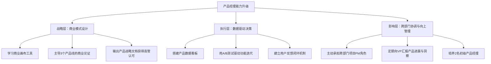
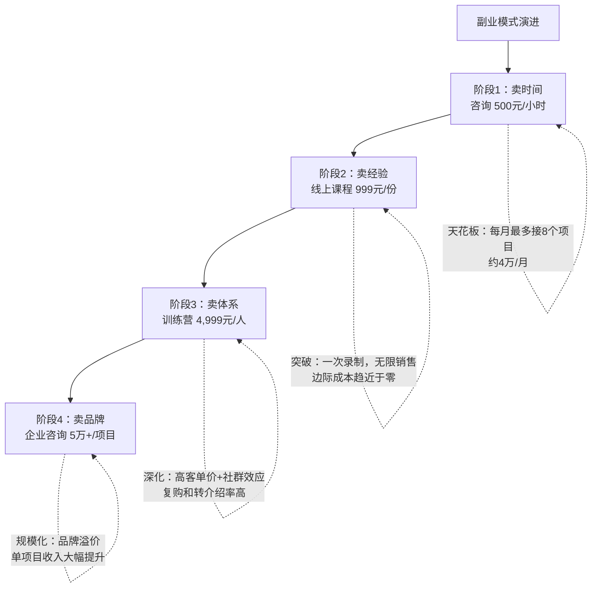
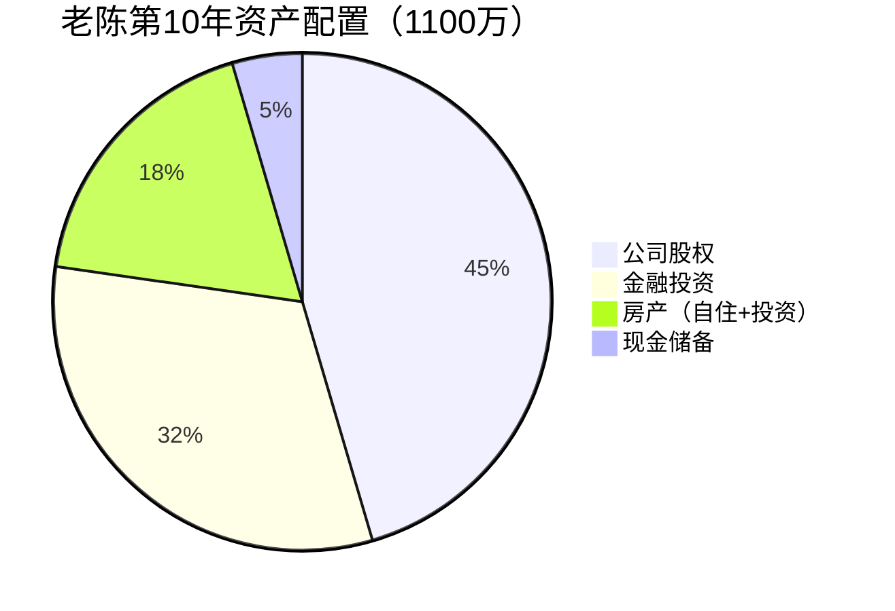
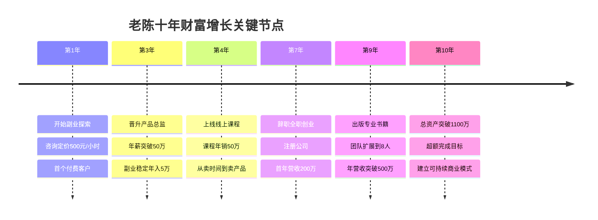
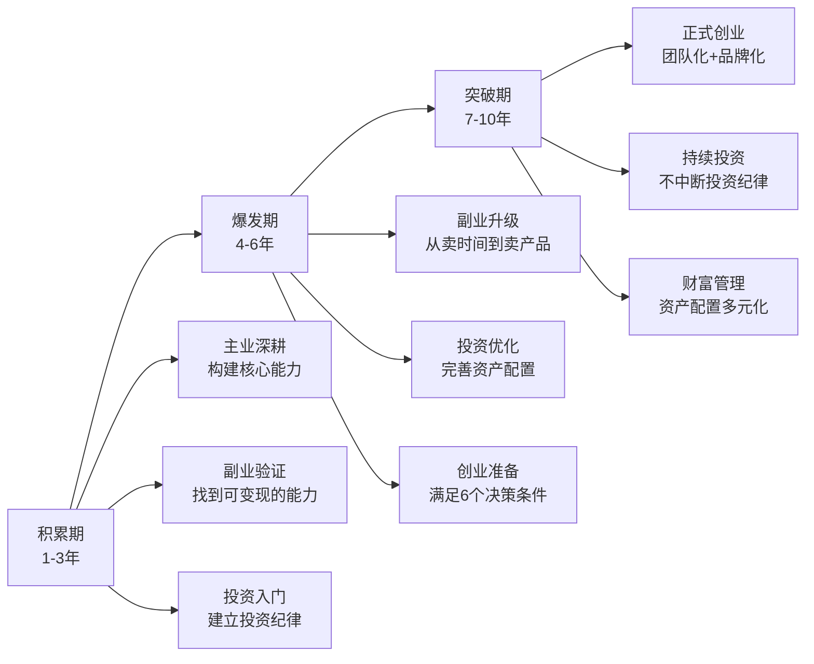

# 案例六：一个创业者的财富增长之路

> "创业不是赌博，而是一场精心设计的杠杆实验——用确定性能力撬动不确定性回报，用主业积累的势能转化为副业的动能，最终在时机成熟时全力一击。"

本案例追踪一位互联网产品经理从年薪30万的职场中层，经过10年系统性规划，实现净资产突破1100万的完整历程。与"天才创业"的叙事不同，这个案例的核心价值在于：每一步都有明确的风险控制和退出条件，创业是"水到渠成"而非"孤注一掷"。

---

## 一、案例背景：起点画像

### 1.1 人物档案

| 维度 | 初始状态（30岁） |
|------|-------------------|
| 化名 | 老陈 |
| 年龄 | 30岁 |
| 职业 | 某中型互联网公司产品经理 |
| 工作年限 | 7年（含3年产品助理+4年产品经理） |
| 年薪 | 30万（税后约24万） |
| 所在城市 | 深圳 |
| 学历 | 本科，信息管理专业 |
| 家庭 | 已婚，妻子年薪约15万 |
| 存款 | 20万 |
| 股票账户 | 10万（盲目跟风买入，亏损约20%） |
| 负债 | 房贷月供8,000元（公积金抵扣3,000元） |
| 目标 | 40岁前拥有1,000万净资产 |

### 1.2 启动前的困境分析

老陈面临的困境，是许多互联网从业者在职业中期的典型画像：

**收入增速放缓**：产品经理在中型公司的薪资天花板约40-50万。要突破这个天花板，要么跳槽到大厂做高级PM/总监（竞争激烈，且大厂组织架构调整频繁），要么走管理路线（需要带团队的机会和能力）。老陈已经做到了产品经理的上限，下一步晋升产品总监需要"空缺"——而空缺不可控。

**资产结构单一**：30万存款中，20万是活期/定期存款，年化收益不到3%；10万在股票账户里，因为缺乏系统投资知识，追涨杀跌，两年亏损约2万。他本质上是"高收入、低财商"的状态。

**时间与精力的矛盾**：已婚未育，妻子工作稳定但收入有限。房贷月供8,000元（公积金抵扣后实际负担5,000元），生活开支约6,000元/月。年结余约9万——看起来不错，但距离1,000万的目标，按纯储蓄路径需要111年。

**核心认知突破**：老陈在30岁生日那天算了一笔账——如果只靠工资存钱，即使每年存9万，10年后也只有90万加利息，远不到100万。而他的目标是1,000万。这中间有**10倍的差距**，靠省钱和涨薪根本不可能弥补。他意识到：**财富增长必须依靠杠杆——人力杠杆、资本杠杆或商业模式杠杆**。

### 1.3 转折触发点

2016年初，老陈参加了一个产品经理社区的线下分享会。一位从产品经理转型做独立咨询顾问的前辈分享了他的经历：利用业余时间做产品咨询，3年内副业收入超过主业。这位前辈说了一句话让老陈印象深刻："产品经理最大的资产不是代码能力，而是**对用户需求的理解和对商业模式的洞察**——这两样东西，可以脱离公司单独变现。"

老陈开始思考：**我拥有的哪些能力，可以脱离雇主独立产生价值？**

---

## 二、第一阶段：能力积累期（第1-3年）

### 2.1 阶段目标

| 指标 | 起点 | 3年目标 | 实际结果 |
|------|------|---------|----------|
| 主业年薪 | 30万 | 45-50万 | 50万（晋升产品总监） |
| 副业年收入 | 0 | 3-5万 | 5万 |
| 年储蓄额 | 9万 | 15万 | 16万 |
| 投资能力 | 亏损状态 | 年化8-10% | 年化12% |
| 总资产 | 30万 | 70-80万 | 80万 |

### 2.2 主业深耕策略

老陈的主业策略不是"跳槽涨薪"，而是**在现有岗位上构建不可替代性**，为晋升产品总监创造条件。

**能力升级的三个维度：**



**具体执行步骤：**

**（1）战略能力构建（第1年重点）**

老陈发现，产品总监和高级产品经理最大的区别不是"做得更好"，而是**能从商业视角思考产品**。他做了三件事：

- **系统学习商业模式**：报名了一个商业分析线上课程（花费3,000元），重点学习了商业模式画布（Business Model Canvas）和价值主张设计（Value Proposition Design）
- **主动承担战略项目**：当公司讨论新业务方向时，老陈主动请缨做商业可行性分析，输出了详细的市场调研、竞品分析和财务预测报告
- **建立"产品战略文档"的习惯**：每个季度输出一份产品战略分析，不仅包含功能规划，还包括市场趋势、竞争格局和商业机会分析。这份文档后来成为他晋升的关键材料

**（2）数据驱动能力（第2年重点）**

老陈意识到，"拍脑袋做产品"的时代已经过去，数据驱动决策是产品经理的核心竞争力。他做了以下工作：

- **搭建产品数据看板**：用公司现有的数据工具（后来自学了SQL和Python），搭建了涵盖用户行为、转化漏斗、留存曲线的实时数据看板
- **推行A/B测试文化**：在团队内推行"任何功能上线前必须A/B测试"的流程，用数据而非直觉做决策
- **建立用户反馈闭环**：创建了"用户反馈→分析→优先级排序→迭代→验证"的完整闭环机制

**（3）影响力建设（第3年重点）**

晋升产品总监不仅需要能力，还需要**组织内部的认可和影响力**：

- **跨部门协作**：主动承担了3个跨部门项目的PM角色，展示了协调和领导能力
- **向上管理**：每两周向VP做一次产品进展汇报，不仅汇报数据，还分享行业洞察和产品思考
- **团队培养**：带了2名初级产品经理，展示了管理潜力

**结果**：第3年，老陈成功晋升为产品总监，年薪从30万涨到50万。

### 2.3 副业探索：从零到一

老陈的副业策略不是"赚快钱"，而是**验证商业模式、积累客户资源、建立个人品牌**。

**副业选择的三个标准：**

| 标准 | 说明 | 老陈的选择 |
|------|------|-----------|
| 与主业能力复用 | 不需要从零学新技能 | 产品咨询——直接用产品经理的能力 |
| 时间灵活 | 不影响主业工作 | 周末咨询+晚上写文章 |
| 有规模化潜力 | 未来可以放大 | 咨询经验可以沉淀为课程/文章 |

**具体执行：**

**（1）产品咨询（第1年开始）**

- **起步方式**：在产品经理社区（如人人都是产品经理、知乎）回答问题，展示专业能力，吸引有需求的创业者主动联系
- **定价策略**：初期定价500元/小时（远低于市场价的1,500-2,000元），目的是积累案例和口碑
- **服务内容**：帮助初创公司做产品定位、用户需求分析、MVP（最小可行产品）设计
- **客户来源**：前6个月零收入，第7个月开始有第一个付费客户，之后靠口碑转介绍，到第3年稳定在每月1-2个客户

**（2）行业专栏写作（第1年开始）**

- **平台选择**：知乎专栏+36氪投稿（当时平台还有内容补贴）
- **内容策略**：每周写1篇深度产品分析文章（2,000-3,000字），重点写"方法论"而非"新闻评论"
- **内容主题**：用户需求分析框架、产品定价策略、从0到1的产品设计、产品经理的成长路径
- **效果**：第3年积累了约2万关注者，文章平均阅读量3,000-5,000，成为行业内小有名气的产品博主

**副业收入明细（第3年）：**

| 收入来源 | 年收入 | 说明 |
|----------|--------|------|
| 产品咨询 | 3万 | 约6个项目，平均5,000元/项目 |
| 专栏稿费 | 1.5万 | 36氪投稿+知乎打赏 |
| 小型培训 | 0.5万 | 2次企业内部产品培训 |
| **合计** | **5万** | |

### 2.4 投资策略：从亏损到盈利

老陈在投资上的转变，是这个阶段最具参考价值的部分。

**问题诊断：**

老陈之前的投资失败，根本原因是**没有投资体系**：

- 没有资产配置概念——10万全仓个股
- 没有择时策略——追涨杀跌
- 没有止损纪律——亏损时死扛，回本就卖
- 没有持续学习——听消息炒股

**系统学习路径：**

```mermaid
graph LR
    A[投资学习路径] --> B[第1年：基础认知]
    A --> C[第2年：策略构建]
    A --> D[第3年：实战优化]
    B --> B1[读完5本经典投资书籍]
    B --> B2[理解资产类别和风险收益特征]
    B --> B3[建立"指数基金为主"的核心理念]
    C --> C1[构建60/40股债组合]
    C --> C2[学习定投策略和再平衡]
    C --> C3[用小资金试水个股投资]
    D --> D1[优化资产配置比例]
    D --> D2[建立投资纪律和检查清单]
    D --> D3[年化收益稳定在12%]
```

**核心投资组合：**

| 资产类别 | 配置比例 | 具体标的 | 年化预期 |
|----------|----------|----------|----------|
| 沪深300指数基金 | 35% | 天弘沪深300ETF联接 | 8-12% |
| 中证500指数基金 | 25% | 南方中证500ETF联接 | 10-15% |
| 债券基金 | 30% | 易方达稳健收益债券 | 4-6% |
| 个股（实验仓） | 10% | 精选3-5只研究过的个股 | 15-25% |

**投资纪律（铁律）：**

1. **定投纪律**：每月15日自动扣款定投，不看市场涨跌
2. **再平衡纪律**：每季度检查一次，偏离目标配置超过5%就再平衡
3. **个股纪律**：个股仓位绝不超过总投资的15%，单只个股不超过5%
4. **止损纪律**：个股亏损20%强制止损，不抱幻想
5. **学习纪律**：每周至少花2小时学习投资知识

### 2.5 三年资产增长路径

| 时间节点 | 主业储蓄累计 | 副业储蓄累计 | 投资收益 | 总资产 |
|----------|-------------|-------------|----------|--------|
| 起点 | 20万 | 0 | 0 | 30万 |
| 第1年末 | 28万 | 1万 | 1.5万 | 40.5万 |
| 第2年末 | 37万 | 3万 | 5万 | 55万 |
| 第3年末 | 48万 | 6万 | 11万 | 80万 |

**阶段总结**：三年时间，老陈完成了三个关键转变——主业从高级PM到产品总监、副业从零到年入5万、投资从亏损到年化12%。总资产从30万增长到80万，增长167%。

---

## 三、第二阶段：副业爆发期（第4-6年）

### 3.1 阶段目标

| 指标 | 起点 | 3年目标 | 实际结果 |
|------|------|---------|----------|
| 主业年薪 | 50万 | 55-60万 | 60万 |
| 副业年收入 | 5万 | 30-40万 | 50万 |
| 年储蓄额 | 16万 | 40-50万 | 50万 |
| 投资年化 | 12% | 12-15% | 15% |
| 总资产 | 80万 | 280-350万 | 350万 |

### 3.2 副业爆发的关键转折

老陈的副业在第4年出现了质的飞跃，核心原因是**从"卖时间"转向"卖产品"**。

**商业模式升级路径：**



**（1）线上课程：从0到50万/年**

老陈在第4年决定把3年积累的咨询经验沉淀为线上课程。这个决策背后的逻辑是：

- **时间杠杆**：咨询是"一份时间卖一次"，课程是"一次录制，卖无数次"
- **规模杠杆**：咨询每月最多服务8个客户，课程没有上限
- **品牌杠杆**：课程是个人品牌的"放大器"，可以持续吸引新客户

**课程开发过程：**

| 步骤 | 耗时 | 内容 | 成本 |
|------|------|------|------|
| 需求调研 | 2周 | 分析50个咨询案例，提炼共性需求 | 0元 |
| 课程大纲 | 1周 | 设计"从0到1做产品"的完整体系 | 0元 |
| 内容录制 | 4周 | 录制48节视频课（每节15-20分钟） | 2,000元（设备+剪辑） |
| 平台选择 | 1周 | 选择知识星球+小鹅通组合 | 平台费约2,000元/年 |
| 冷启动 | 4周 | 用已有粉丝+老客户做种子用户 | 0元 |
| 持续迭代 | 持续 | 每季度更新一次课程内容 | 持续投入 |

**课程定价策略：**

老陈没有定低价走量，而是采用了**价值定价法**：

- 课程定价999元（同期竞品多在199-499元）
- 包含48节视频课+12次直播答疑+专属社群+1对1作业批改
- 定价理由：学员完成课程后，相当于获得了3年的产品咨询经验浓缩，999元比一次咨询（2,000-3,000元）便宜得多

**销售数据（第4年）：**

| 指标 | 数据 |
|------|------|
| 课程单价 | 999元 |
| 累计学员 | 500人 |
| 课程收入 | 约50万 |
| 复购率 | 约15%（购买进阶课程） |
| 好评率 | 92% |

**（2）从课程到训练营：深度变现**

第5年，老陈开始做**高客单价训练营**，进一步深化商业模式：

- **训练营定价**：4,999元/人（3个月周期）
- **服务内容**：系统课程+每周直播+小组讨论+项目实战+1对1辅导
- **每期人数**：30人
- **每期收入**：约15万
- **年举办**：2期
- **年收入**：约30万

**训练营的核心价值在于"社群效应"**：

- 学员之间形成互助网络，降低了老陈的服务成本
- 高质量学员成为口碑传播节点，带来了更多新学员
- 优秀学员成为老陈的"案例素材"，进一步丰富了课程内容

### 3.3 收入结构的质变

第6年，老陈的收入结构发生了根本性变化：

| 收入来源 | 金额 | 占比 | 性质 |
|----------|------|------|------|
| 主业工资 | 60万 | 45% | 主动收入 |
| 线上课程 | 50万 | 38% | 被动/半被动收入 |
| 投资收益 | 15万 | 11% | 被动收入 |
| 咨询/培训 | 8万 | 6% | 主动收入 |
| **合计** | **133万** | **100%** | |

**关键指标变化**：

- 被动/半被动收入占比从0%提升到**49%**——这意味着即使老陈停止工作，仍有接近一半的收入来源
- 收入多元化指数（1 - 最大收入来源占比）从0提升到**0.55**——抗风险能力显著增强
- 时薪从主业的约150元/小时提升到副业的约800元/小时——时间效率大幅提升

### 3.4 投资策略优化

随着收入增长，老陈的投资策略也做了调整：

**资产配置调整：**

| 资产类别 | 第3年占比 | 第6年占比 | 调整理由 |
|----------|----------|----------|----------|
| 指数基金 | 60% | 50% | 降低单一资产风险 |
| 个股 | 10% | 15% | 研究能力提升，适度增加 |
| 债券基金 | 30% | 15% | 收入稳定，降低防御仓位 |
| REITs | 0% | 10% | 增加不动产敞口，对冲通胀 |
| 现金/货币基金 | 0% | 10% | 为创业储备流动性 |

**新增投资原则：**

1. **创业储备金**：始终保留12个月生活费+房贷的现金储备（约30万），不动用投资资金
2. **能力圈投资**：只投资自己能理解的行业（科技、消费、教育），不碰看不懂的板块
3. **定期检视**：每季度做一次投资复盘，记录决策逻辑和结果

### 3.5 六年资产增长路径

| 时间节点 | 主业累计 | 副业累计 | 投资收益 | 房产增值 | 总资产 |
|----------|---------|---------|----------|----------|--------|
| 第3年末 | 48万 | 6万 | 11万 | 15万 | 80万 |
| 第4年末 | 57万 | 30万 | 22万 | 18万 | 127万 |
| 第5年末 | 67万 | 65万 | 40万 | 22万 | 194万 |
| 第6年末 | 78万 | 105万 | 72万 | 28万 | 350万* |

*注：第6年末总资产包含房产增值和投资复利的累计效应。*

**阶段总结**：三年时间，总资产从80万增长到350万，增长338%。这一阶段的核心驱动力是**副业从"卖时间"到"卖产品"的商业模式升级**，以及**投资策略的持续优化**。

---

## 四、第三阶段：创业突破期（第7-10年）

### 4.1 决策框架：何时全职创业？

老陈没有在副业收入刚超过主业时就辞职创业，而是设置了一套**严格的创业决策条件**：

| 条件 | 标准 | 老陈的实际状态 |
|------|------|---------------|
| 副业收入稳定性 | 连续12个月副业收入≥主业收入 | ✅ 已连续15个月 |
| 现金储备 | ≥24个月家庭开支 | ✅ 储备了约60万现金 |
| 家庭支持 | 配偶同意并有应急收入 | ✅ 妻子年薪15万+ |
| 市场验证 | 至少有3个稳定的企业客户 | ✅ 有5个长期合作客户 |
| 退出条件 | 如果创业失败，可以回到职场 | ✅ 产品总监经验+行业人脉 |
| 心理准备 | 能接受连续12个月没有收入 | ✅ 已做好最坏打算 |

**决策过程**：

老陈在第7年初做了一次"10-10-10分析"：

- **10分钟后**：辞职创业会感到兴奋和自由
- **10个月后**：如果业务顺利，收入会大幅增长；如果业务困难，60万现金储备可以支撑
- **10年后**：创业成功的话，财富自由；创业失败的话，最大的损失是2年时间和机会成本，但获得了宝贵的创业经验

**结论**：风险可控，收益可期，值得全力一搏。

### 4.2 创业路径设计

老陈的创业不是"从零开始"，而是**将已有副业正式化、规模化**：

```mermaid
graph TD
    A[副业正式化<br>注册公司] --> B[产品化<br>标准化服务]
    B --> C[团队化<br>招聘核心团队]
    C --> D[规模化<br>拓展客户和业务线]
    D --> E[品牌化<br>建立行业影响力]
    
    A --> A1[注册"XX产品咨询有限公司"]
    A --> A2[建立正式的合同和报价体系]
    A --> A3[开设企业银行账户和税务登记]
    
    B --> B1[将咨询服务拆解为标准模块]
    B --> B2[建立服务交付SOP和质量标准]
    B --> B3[开发内部知识库和案例库]
    
    C --> C1[第1年：招1名助理+1名分析师]
    C --> C2[第2年：招2名咨询顾问]
    C --> C3[第3年：团队稳定在8人]
    
    D --> D1[从互联网产品扩展到消费品]
    D --> D2[从咨询扩展到培训+出版]
    D --> D3[从深圳拓展到北京/上海]
    
    E --> E1[出版产品方法论书籍]
    E --> E2[受邀参加行业峰会演讲]
    E --> E3[成为多家企业的长期顾问]
```

### 4.3 营收与利润增长

| 年份 | 营收 | 成本 | 净利润 | 利润率 | 关键事件 |
|------|------|------|--------|--------|----------|
| 第7年 | 200万 | 120万 | 80万 | 40% | 正式注册公司，招2人 |
| 第8年 | 350万 | 220万 | 130万 | 37% | 拓展消费品客户，招至5人 |
| 第9年 | 500万 | 340万 | 160万 | 32% | 出版书籍，团队8人 |
| 第10年 | 600万 | 420万 | 180万 | 30% | 建立稳定客户群，利润率稳定 |

**利润率下降的原因分析**：

| 因素 | 影响 | 老陈的应对 |
|------|------|-----------|
| 团队扩张 | 人力成本增加 | 通过标准化降低人均服务成本 |
| 市场竞争 | 咨询费率增长受限 | 开发高毛利产品（课程、书籍） |
| 品质投入 | 前期投入品牌建设 | 品牌溢价在后期体现 |

### 4.4 资金分配策略

老陈在创业后采用了"三分法"资金分配策略：

| 分配方向 | 比例 | 用途 | 说明 |
|----------|------|------|------|
| 公司再投入 | 50% | 团队扩张、品牌建设、产品研发 | 确保公司持续增长 |
| 金融投资 | 30% | 指数基金+个股+债券 | 保持投资纪律，不因创业而中断 |
| 现金储备 | 20% | 货币基金+定期存款 | 始终保持12个月以上的现金缓冲 |

### 4.5 投资组合的最终形态

到第10年，老陈的投资组合已经相当成熟：



**金融投资明细：**

| 资产类别 | 金额 | 年化收益 | 说明 |
|----------|------|----------|------|
| 沪深300+中证500指数基金 | 150万 | 10% | 核心仓位 |
| 精选个股（科技+消费） | 80万 | 18% | 能力圈投资 |
| 债券基金 | 50万 | 5% | 稳健底仓 |
| REITs | 40万 | 8% | 不动产敞口 |
| 货币基金 | 30万 | 3% | 流动性储备 |
| **合计** | **350万** | **11.5%** | |

### 4.6 十年资产全景

| 资产类别 | 金额 | 占比 | 说明 |
|----------|------|------|------|
| 公司股权 | 500万 | 45% | 按年利润3倍估值 |
| 金融投资 | 350万 | 32% | 含基金、股票、债券、REITs |
| 房产净值 | 200万 | 18% | 自住房市值400万-贷款200万 |
| 现金储备 | 50万 | 5% | 应急资金 |
| **总净资产** | **1,100万** | **100%** | **超额完成1,000万目标** |

---

## 五、关键转折点复盘

### 5.1 六个关键时刻



### 5.2 每个阶段的核心杠杆

| 阶段 | 核心杠杆 | 具体表现 | 财富倍增效应 |
|------|----------|----------|-------------|
| 第1-3年 | 能力杠杆 | 主业晋升+副业起步 | 30万→80万（2.7倍） |
| 第4-6年 | 模式杠杆 | 从卖时间到卖产品 | 80万→350万（4.4倍） |
| 第7-10年 | 规模杠杆 | 团队化+品牌化 | 350万→1,100万（3.1倍） |

---

## 六、风险复盘与教训

### 6.1 老陈差点翻车的三次危机

**危机一：第5年课程退款潮**

- **事件**：课程质量参差不齐，导致一波差评和退款请求
- **原因**：课程录制时过于追求"全面"，导致部分章节质量下降
- **应对**：花了2个月时间重新录制低分章节，推出"无条件退款"政策
- **教训**：**产品品质是1，营销是后面的0。没有品质，再多营销都是负数**

**危机二：第8年核心员工离职**

- **事件**：创业第二年，最得力的咨询顾问跳槽到竞争对手
- **原因**：薪酬体系不够透明，晋升路径不清晰
- **应对**：重新设计薪酬体系，引入股权激励，建立内部培训体系
- **教训**：**小公司的核心竞争力是人，留住人比招到人更重要**

**危机三：第9年现金流紧张**

- **事件**：拓展新业务线投入过大，连续3个月现金流为负
- **原因**：过于乐观地估计了新业务的回报周期
- **应对**：砍掉不赚钱的业务线，聚焦核心客户，引入外部投资
- **教训**：**创业公司最重要的不是增长速度，而是现金流安全**

### 6.2 老陈犯过的错误清单

| 错误 | 发生时间 | 后果 | 正确做法 |
|------|----------|------|----------|
| 副业初期定价过低 | 第1-2年 | 浪费了大量时间，积累了低质量客户 | 参考市场价定价，用服务品质而非低价获客 |
| 课程录制追求大而全 | 第4年 | 部分章节质量差，引发退款 | 先做MVP版本，根据反馈迭代 |
| 创业初期扩张过快 | 第8年 | 现金流紧张，差点发不出工资 | 每次扩张前确保6个月现金储备 |
| 忽视税务规划 | 第7年 | 多交了约10万税 | 从创业第一天就找专业会计师 |
| 没有及时建立财务制度 | 第7-8年 | 账目混乱，影响融资 | 公司注册当天就用专业财务软件 |

---

## 七、方法论提炼：可复制的创业财富增长框架

### 7.1 "三阶段"创业准备模型



### 7.2 创业决策的六个条件

在决定全职创业之前，确保以下条件全部满足：

| 序号 | 条件 | 最低标准 | 检验方法 |
|------|------|----------|----------|
| 1 | 收入验证 | 副业收入连续6个月≥主业收入的80% | 查看银行流水 |
| 2 | 现金储备 | ≥18个月家庭总开支 | 计算月开支×18 |
| 3 | 家庭支持 | 配偶明确同意并有稳定收入 | 深度沟通，签署"家庭协议" |
| 4 | 市场验证 | 至少有2个稳定付费客户 | 查看合同和回款记录 |
| 5 | 退出路径 | 创业失败后能在6个月内回到职场 | 更新简历，试探猎头市场 |
| 6 | 心理准备 | 能接受最坏结果（损失1-2年收入） | 做一次"最坏情景推演" |

### 7.3 收入结构优化目标

追求以下收入结构的渐进式优化：

| 阶段 | 主动收入占比 | 半被动收入占比 | 被动收入占比 |
|------|-------------|---------------|-------------|
| 初始状态 | 100% | 0% | 0% |
| 积累期结束 | 75% | 15% | 10% |
| 爆发期结束 | 45% | 40% | 15% |
| 突破期结束 | 20% | 50% | 30% |
| 理想状态 | 10% | 40% | 50% |

---

## 八、核心启示

### 8.1 五条财富增长铁律

**第一条：主业是根基，但不是天花板**

老陈的主业收入从30万涨到60万，增长了100%。但如果没有副业和创业，他的总资产最多也就200万左右。主业提供了稳定的现金流和核心能力，但真正的财富跃迁来自于商业模式的升级。

**第二条：副业是桥梁，核心是"能力验证"**

副业的最大价值不是赚钱（虽然也赚了），而是**验证了哪些能力可以脱离公司独立变现**。当副业收入稳定超过主业时，创业就不再是赌博，而是有数据支撑的理性决策。

**第三条：创业是加速器，但不是万能药**

创业让老陈的收入从120万/年增长到180万/年净利润，但同时也带来了更大的风险和压力。创业成功的关键不是"勇气"，而是**充分的准备和严格的风险控制**。

**第四条：投资是放大器，纪律比技巧重要**

老陈的投资收益从最初的亏损，到年化12%，再到年化15%，核心不是"选对了哪只股票"，而是**建立了系统化的投资纪律并长期执行**。10年累计投资收益约200万，占总资产的18%——这是"睡后收入"的力量。

**第五条：财富增长是复利函数，不是线性函数**

老陈的资产增长曲线：

| 时间 | 总资产 | 年均增长率 |
|------|--------|-----------|
| 第1年末 | 40万 | 33% |
| 第3年末 | 80万 | 26%（年化） |
| 第6年末 | 350万 | 28%（年化） |
| 第10年末 | 1,100万 | 26%（年化） |

这条曲线完美诠释了复利效应：前期增长缓慢，后期指数级爆发。**耐心，是最重要的投资品质。**

### 8.2 对不同读者的建议

| 读者类型 | 建议重点 | 优先行动 |
|----------|----------|----------|
| 刚工作的年轻人 | 先深耕主业，积累核心能力 | 花2年时间成为某个领域的专家 |
| 有3-5年经验的职场人 | 开始副业探索，验证能力 | 用业余时间做一个小的变现项目 |
| 副业已有收入的人 | 系统化副业，准备创业条件 | 对照6个条件，逐项达标 |
| 已经创业的人 | 关注现金流和团队建设 | 建立财务制度，设计股权激励 |
| 所有人 | 建立投资纪律 | 从今天开始定投指数基金 |

---

> **最终感悟**：老陈的1,000万之路，不是靠一个天才idea或一次幸运的投机，而是靠**10年如一日的系统性规划和执行**。他的故事告诉我们：财富增长的底层逻辑，是**能力×杠杆×时间×纪律**。这四个变量，缺一不可。
