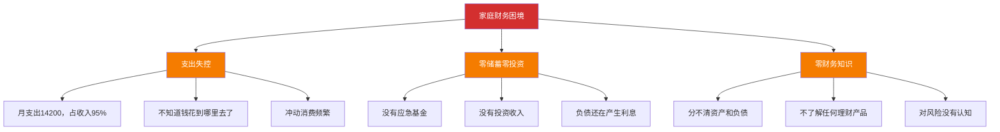
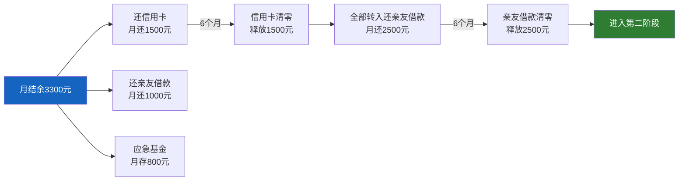
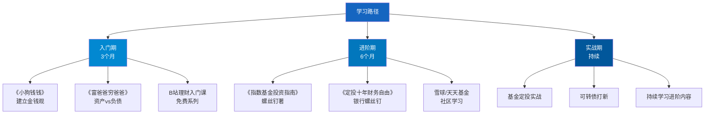
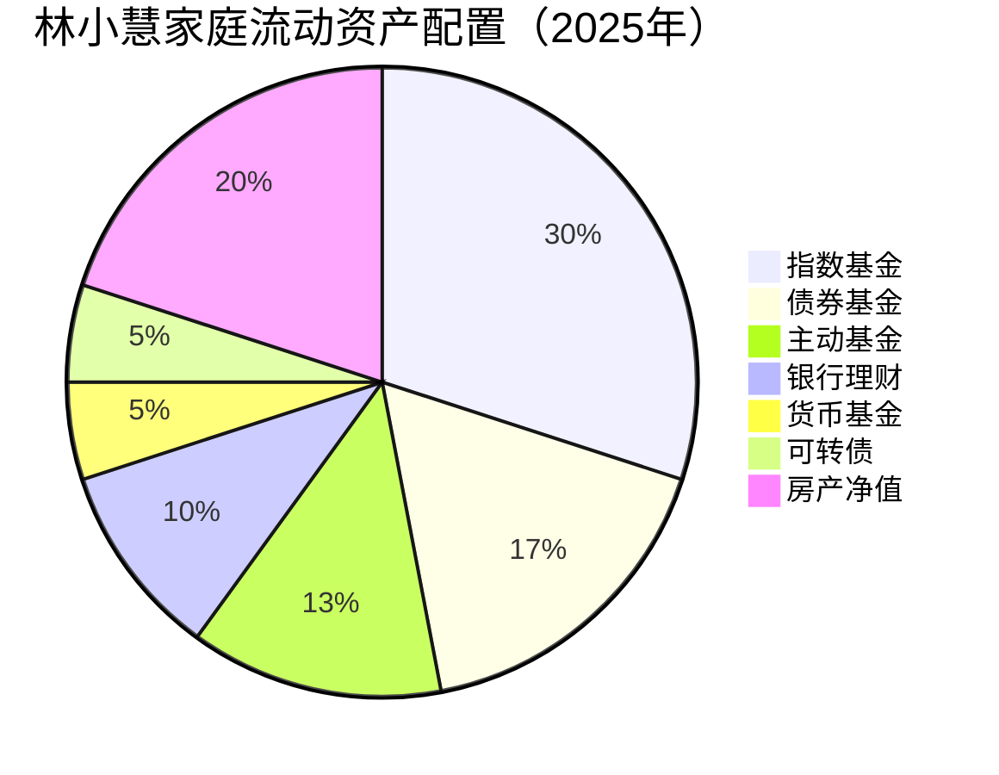
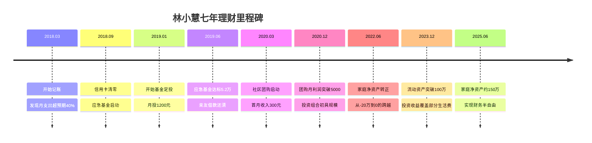
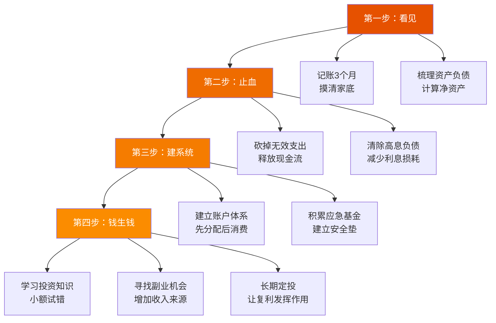

## 案例七：一个家庭主妇的理财之路

> 一个没有稳定收入的家庭主妇，如何从零开始，用七年时间将家庭净资产从负债20万做到正资产150万？这个案例揭示了一个被严重低估的财富增长引擎——**家庭财务管理**。

### 一、案例背景：为什么家庭主妇理财值得单独研究

在中国约有1.2亿全职主妇（含全职主夫），她们面临一个独特的财务困境：

- **没有独立收入来源**，经济上完全依赖配偶
- **缺乏财务安全感**，一旦家庭变故将陷入被动
- **有大量碎片化时间**，但不知道如何转化为财务价值
- **承担家庭消费决策的80%以上**，却很少接受过系统的理财训练

传统理财教育大多面向"有收入、有资产"的职场人士，很少有人告诉一个家庭主妇：**你手中掌握的"家庭CFO"角色，本身就是一种巨大的财务杠杆**。

本案例的主人公叫林小慧（化名），35岁，坐标成都。以下是她从2018年到2025年的真实理财历程。

### 二、起点：一笔"糊涂账"

#### 2.1 家庭财务状况（2018年初）

| 项目 | 金额 | 说明 |
|------|------|------|
| 丈夫月收入 | 15,000元 | IT行业中级工程师 |
| 林小慧月收入 | 0元 | 全职在家带两个孩子（3岁和5岁） |
| 家庭月支出 | 14,200元 | 几乎月光 |
| 房贷余额 | 68万元 | 月供4,500元 |
| 信用卡负债 | 2.3万元 | 分期还款中 |
| 亲友借款 | 5万元 | 结婚时借的，一直没还清 |
| 储蓄 | 8,000元 | 活期账户 |
| 投资 | 0 | 无任何投资 |

**净资产：约 -20万元**（负债减去资产）

#### 2.2 核心问题诊断

林小慧当时面临的不是"怎么投资赚钱"的问题，而是更基础的三个致命问题：

**这几乎是90%中国家庭的真实写照——不是赚得少，而是管得差。**

### 三、第一阶段：记账与止血（2018年3月—2018年9月）

#### 3.1 从记账开始：看见真相

林小慧做的第一件事不是学习投资，而是**记账**。她下载了随手记App，开始记录每一笔支出。

第一个月的账单让她崩溃：

| 分类 | 月支出 | 占比 | 她的预期 |
|------|--------|------|----------|
| 房贷 | 4,500元 | 31.7% | 知道 |
| 餐饮（含外卖） | 3,800元 | 26.8% | 以为2000 |
| 孩子教育/培训 | 2,200元 | 15.5% | 知道 |
| 交通/出行 | 800元 | 5.6% | 以为400 |
| 服饰/美妆 | 1,200元 | 8.5% | 以为300 |
| 日用品/超市 | 900元 | 6.3% | 以为500 |
| 其他（红包、礼物等） | 800元 | 5.6% | 没算过 |
| **合计** | **14,200元** | **100%** | 以为10000 |

> "我以为每个月花一万块，结果花了快一万五。那些'小钱'加起来太吓人了。" ——林小慧

**记账的真相揭露效应**是理财的第一步，这个原理在行为经济学中被称为"注意力唤醒"——当人们对某件事投入注意力后，会自动改变行为。

#### 3.2 第一轮"止血"：砍掉无效支出

经过分析，林小慧识别出三类可优化支出：

**第一类：冲动消费（月省800元）**
- 关闭所有电商App的推送通知
- 卸载拼多多和小红书（她的冲动消费重灾区）
- 建立"想买东西先等72小时"规则
- 每月设置服饰美妆预算上限500元

**第二类：外卖依赖（月省1,200元）**
- 每周提前做菜单规划
- 周末集中采购一周食材
- 工作日午餐改为简单便当
- 每周最多点两次外卖作为"弹性消费"

**第三类：无效社交（月省500元）**
- 减少无意义的聚餐应酬
- 红包预算化：每月上限300元
- 拒绝"面子消费"

**止血效果：月支出从14,200元降至11,700元，月结余从800元提升到3,300元。**

#### 3.3 清除高息负债

有了月结余后，林小慧的还债策略：

还债优先级遵循**雪崩法**（Avalanche Method）：先还利率最高的债务。信用卡分期年化利率约15-18%，远高于亲友借款的零利息或低利息。

到2018年9月：
- 信用卡负债：**清零**
- 亲友借款：**剩余2.5万元**（正在按计划偿还）
- 应急基金：**4,800元**

### 四、第二阶段：建立系统（2018年10月—2019年12月）

#### 4.1 家庭财务架构设计

林小慧开始把家庭财务当成一家公司来管理。她设计了一套"家庭账户体系"：

| 账户 | 用途 | 月分配比例 | 月金额 |
|------|------|------------|--------|
| 基本生活账户 | 房贷+餐饮+交通+日用 | 70% | 8,200元 |
| 安全垫账户 | 应急基金（目标6个月支出） | 10% | 1,200元 |
| 成长投资账户 | 基金定投+学习 | 12% | 1,400元 |
| 自由消费账户 | 服饰、娱乐、社交 | 5% | 600元 |
| 人情往来账户 | 红包、礼物、请客 | 3% | 350元 |
| **合计** | | **100%** | **11,750元** |

这个体系的核心思想是**先分配后消费**——工资到账当天就自动转账到各个账户，而不是"花剩下的再存"。

#### 4.2 应急基金的建立

林小慧设定的目标是**6个月基本生活支出**，即约5万元。她用以下方法积累：

- 每月固定存入1,200元
- 年终奖（丈夫1.5万）拿出8,000元
- 卖掉闲置物品收入（婴儿车、旧手机等）约3,000元
- 2019年春节红包盈余2,000元

到2019年6月，应急基金达到**52,000元**，存入货币基金（年化约2.5%），既保持流动性又有一点收益。

**应急基金的心理价值远大于其财务价值。** 林小慧说："有了这笔钱，我不再因为老公加班晚回来就焦虑'万一他出事了怎么办'。这种安全感让我后面的投资决策冷静了很多。"

#### 4.3 学习投资基础知识

在有了应急基金的安全感之后，林小慧开始系统学习。她的学习路径：

她的学习原则很朴素：

1. **不懂的不碰** ——绝不因为别人赚钱就跟风
2. **先模拟后实盘** ——用天天基金的模拟组合练了两个月
3. **小额试错** ——第一次定投只投了200元/月
4. **只用闲钱** ——绝不挪用应急基金和生活费

#### 4.4 第一次投资：基金定投

2019年1月，林小慧开始第一笔基金定投：

| 基金 | 类型 | 月定投 | 选择理由 |
|------|------|--------|----------|
| 沪深300指数基金 | 宽基指数 | 500元 | 跟踪A股大盘，分散风险 |
| 中证500指数基金 | 宽基指数 | 300元 | 覆盖中小盘，与沪深300互补 |
| 纯债基金 | 债券型 | 400元 | 降低组合波动，稳定收益 |
| **合计** | | **1,200元/月** | |

定投策略：
- **扣款日**：每月10号（丈夫发工资第二天）
- **平台**：天天基金（费率1折）
- **止盈目标**：年化收益率达到15%时分批止盈
- **不止损**：市场下跌时坚持甚至加投

### 五、第三阶段：拓展收入（2020年—2022年）

#### 5.1 发现"家庭主妇"的隐性技能

2020年初，疫情居家期间，林小慧发现自己有几个可以变现的技能：

| 隐性技能 | 来源 | 变现方向 |
|----------|------|----------|
| 做饭好吃 | 7年家庭烹饪经验 | 短视频/社区团购 |
| 比价达人 | 长期负责家庭采购 | 好物分享/带货 |
| 育儿经验 | 两个孩子的实战经验 | 育儿博主/咨询 |
| 家收纳整理 | 小户型高效收纳 | 整理收纳服务 |

她选择了**社区团购**作为切入点，原因是：
- 启动成本几乎为零
- 利用已有的邻里关系
- 时间灵活，不影响带孩子
- 与她擅长的"比价采购"能力直接匹配

#### 5.2 社区团购实战

**起步阶段（2020年3月-6月）**：
- 在小区业主群发起团购，从水果和生鲜开始
- 第一周只有3个邻居参与，总金额180元
- 核心策略：**亲自去批发市场选品，比超市便宜20-30%，自己先试吃再推荐**
- 到第3个月，固定客户达到40人，月流水约1.5万元

**扩展阶段（2020年7月-2021年底）**：
- 品类扩展到日用品、零食、儿童用品
- 建立了3个微信群，覆盖周边3个小区
- 固定客户150人，月流水约5万元
- 利润率约8-12%，月净利润4,000-6,000元

**运营模式**：

**林小慧的团购核心竞争力**：
1. **选品严格** ——每样东西自己先买来吃/用，不合格的绝不上架
2. **价格透明** ——公开进货价和加价幅度，赚"明白钱"
3. **服务到位** ——水果不甜可以退，品质问题秒赔
4. **人情味足** ——记住老客户的口味偏好，主动推荐

> "做团购和做投资一样，核心是'信任'。邻居们信任我，是因为我从来不骗他们。这个信任积累了一年多，但崩塌只需要一次。"

#### 5.3 收入结构的变化

到2022年，林小慧家庭的收入结构已经发生了质变：

| 收入来源 | 2018年 | 2022年 | 增长 |
|----------|--------|--------|------|
| 丈夫工资 | 15,000元 | 22,000元（升职加薪） | +47% |
| 社区团购净利润 | 0 | 5,500元 | 从0到有 |
| 基金投资收益（月均） | 0 | 800元 | 从0到有 |
| 理财利息（货基等） | 0 | 150元 | 从0到有 |
| **家庭月收入** | **15,000元** | **28,450元** | **+90%** |

更重要的是，月结余从2018年的800元提升到**9,200元**，结余率从5%提升到**32%**。

### 六、第四阶段：资产积累与配置（2023年—2025年）

#### 6.1 投资组合的进化

随着投资知识和资金量的增长，林小慧的投资组合逐渐丰富：

| 资产类别 | 具体配置 | 金额 | 占比 | 年化收益目标 |
|----------|----------|------|------|-------------|
| 货币基金 | 应急基金+零钱 | 8万元 | 5% | 2% |
| 债券基金 | 纯债+二级债 | 25万元 | 17% | 4-6% |
| 指数基金 | 沪深300+中证500+创业板 | 45万元 | 30% | 8-12% |
| 主动基金 | 3只优质混合基金 | 20万元 | 13% | 10-15% |
| 可转债 | 打新+低价策略 | 8万元 | 5% | 5-10% |
| 银行理财 | R2级别稳健型 | 15万元 | 10% | 3.5% |
| 房产（自住） | 已还贷至剩余30万 | 估值180万 | — | — |
| **流动资产合计** | | **121万元** | **80%** | |

**投资纪律**：
- 每季度做一次资产再平衡
- 单只基金不超过总资产的10%
- 股票类资产不超过总资产的60%
- 永远保留6个月支出的应急基金不动

#### 6.2 她的资产配置逻辑

这个配置遵循**核心-卫星策略**：
- **核心资产（70%）**：指数基金+债券基金+银行理财——追求稳健增长
- **卫星资产（30%）**：主动基金+可转债——追求超额收益

#### 6.3 复利效应的显现

林小慧从2019年开始定投，到2025年已经坚持了6年。复利的真实效果：

| 年份 | 累计投入 | 累计收益 | 总资产 | 收益率 |
|------|----------|----------|--------|--------|
| 2019年末 | 14,400元 | 680元 | 15,080元 | 4.7% |
| 2020年末 | 36,000元 | 5,200元 | 41,200元 | 14.4% |
| 2021年末 | 62,400元 | 18,500元 | 80,900元 | 29.6% |
| 2022年末 | 88,800元 | 8,200元 | 97,000元 | 9.2% |
| 2023年末 | 120,000元 | 22,000元 | 142,000元 | 18.3% |
| 2024年末 | 156,000元 | 35,000元 | 191,000元 | 22.4% |
| 2025年中 | 174,000元 | 46,000元 | 220,000元 | 26.4% |

> 注：收益率包含市场波动，2022年市场下跌时她坚持定投，反而在后续反弹中获得了更高收益。

### 七、最终成果：七年财务蜕变

#### 7.1 资产负债对比

| 指标 | 2018年初 | 2025年中 | 变化 |
|------|----------|----------|------|
| 房贷余额 | 68万元 | 28万元 | 减少40万元 |
| 房产市值 | 120万元 | 180万元 | 增值60万元 |
| 房产净值 | 52万元 | 152万元 | +100万元 |
| 流动资产 | 0.8万元 | 121万元 | +120.2万元 |
| 负债总额 | 75.3万元 | 28万元 | -47.3万元 |
| **家庭净资产** | **-20万元** | **约150万元** | **+170万元** |

#### 7.2 关键里程碑

### 八、深度解析：她做对了什么

#### 8.1 底层认知的转变

林小慧的转变不是从"学投资技巧"开始的，而是从**认知升级**开始的：

| 旧认知 | 新认知 | 转变来源 |
|--------|--------|----------|
| "我又不赚钱，管什么钱" | "家庭CFO比公司CFO更重要" | 《富爸爸穷爸爸》 |
| "投资是有钱人的事" | "100元也能开始投资" | 指数基金定投入门 |
| "省钱就是抠门" | "省下的是未来的自由" | 记账后的数据冲击 |
| "风险=危险" | "风险=不确定性，可管理" | 系统学习投资知识 |
| "钱放银行最安全" | "通货膨胀才是最大的风险" | 理解货币贬值原理 |

#### 8.2 方法论总结：家庭主妇理财四步法

#### 8.3 她踩过的坑

林小慧的理财之路并非一帆风顺，她犯过几个典型错误：

**坑1：盲目追涨（2020年7月）**
- 看到白酒基金涨了60%，忍不住把纯债基金全部转投白酒
- 结果白酒回调20%，亏了约4,000元
- **教训**：永远不追热门，坚持既定的资产配置比例

**坑2：过度节省引发家庭矛盾（2018年下半年）**
- 为了省钱，取消了孩子的一个早教班
- 丈夫强烈反对，认为"亏了孩子"
- **教训**：理财不是苦行僧，该花的钱要花，关键是花得值

**坑3：团购选品失误（2021年3月）**
- 贪便宜进了一批临期酸奶，客户投诉
- 赔钱道歉，差点失去几个老客户
- **教训**：品质是底线，宁可不赚也不能砸口碑

**坑4：忽视保险（2020年之前）**
- 全家只有社保，没有任何商业保险
- 直到一个邻居大病花了30万才意识到风险
- **教训**：保险是理财的地基，地基不牢上面全白搭

#### 8.4 她的保险配置

在意识到保险的重要性后，林小慧为全家配置了以下保障：

| 家庭成员 | 保险类型 | 年保费 | 保额 | 产品特征 |
|----------|----------|--------|------|----------|
| 丈夫（经济支柱） | 定期寿险 | 1,200元 | 100万 | 保至60岁 |
| 丈夫 | 重疾险 | 3,600元 | 50万 | 保终身，含身故 |
| 丈夫 | 百万医疗险 | 300元 | 200万 | 1万免赔额 |
| 丈夫 | 意外险 | 200元 | 100万 | 含猝死保障 |
| 林小慧 | 重疾险 | 2,800元 | 30万 | 保终身 |
| 林小慧 | 百万医疗险 | 280元 | 200万 | 1万免赔额 |
| 两个孩子 | 少儿重疾险 | 1,600元 | 各30万 | 保30年 |
| 两个孩子 | 百万医疗险 | 600元 | 各200万 | 1万免赔额 |
| **合计** | | **约10,580元/年** | | 占家庭年收入约3% |

> 林小慧的保险配置原则：**先保大人后保小孩，先保经济支柱，先保障后理财。年保费不超过家庭年收入的5%。**

### 九、给不同阶段读者的实操建议

#### 9.1 如果你是"零基础"家庭主妇

**立刻可以做的3件事**（今天就开始）：

1. **下载一个记账App**，随手记或钱迹都行，从今天开始记录每一笔支出
2. **打开银行App**，把所有账户的余额加在一起，算出家庭净资产
3. **和丈夫做一次"家庭财务会议"**，把收入、支出、负债、资产摊开来说

**第一个月目标**：
- 连续记账30天
- 制作家庭资产负债表
- 识别出3个最大的"浪费项"

#### 9.2 如果你已经有一定基础

**进阶动作**：
- 建立完整的账户体系（5-6个专用账户）
- 开始基金定投（从每月500元起）
- 探索一个适合自己的副业方向

**3个月目标**：
- 应急基金达到3个月支出
- 定投组合运行稳定
- 副业开始产生收入

#### 9.3 如果你已经走上正轨

**高阶动作**：
- 优化投资组合，加入更多资产类别
- 学习税务筹划（合理利用个税抵扣）
- 考虑为家庭建立"财务自由基金"
- 培养孩子的财商教育

### 十、核心启示

林小慧的故事告诉我们一个朴素但深刻的道理：

> **财富增长的底层逻辑不是"赚更多"，而是"管更好"。一个家庭主妇不需要高薪，只需要系统化的财务管理思维，就能撬动整个家庭的财富增长。**

她的案例完美诠释了本章的核心理论：

1. **复利效应** ——每月1200元的定投，6年后变成了22万
2. **现金流管理** ——同样的收入，结余率从5%提升到32%
3. **风险管理** ——从零保险到完整的家庭保障体系
4. **收入多元化** ——从单一工资收入到"工资+团购+投资"三条腿走路
5. **认知升级** ——从"钱是省出来的"到"钱是管出来的"

**最后的话：** 每个家庭都有一位潜在的"CFO"。如果你是那个负责家庭日常财务的人，请记住——你手中的权力比你以为的大得多。善用它，就是整个家庭最大的财富杠杆。

---
**本案例关键数字速览**

| 指标 | 数值 |
|------|------|
| 总投入时间 | 7年 |
| 起始净资产 | -20万元 |
| 最终净资产 | 约150万元 |
| 净资产增幅 | +170万元 |
| 月结余提升 | 800元 → 9,200元 |
| 投资组合年化收益 | 约12%（6年平均） |
| 副业月收入 | 5,500元 |
| 保险覆盖率 | 100%（全家4口） |
