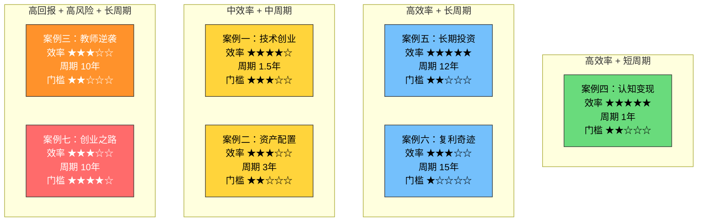
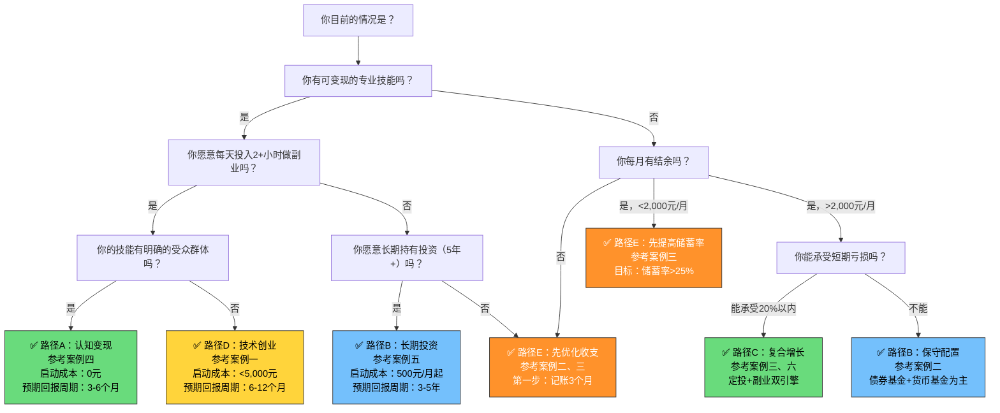
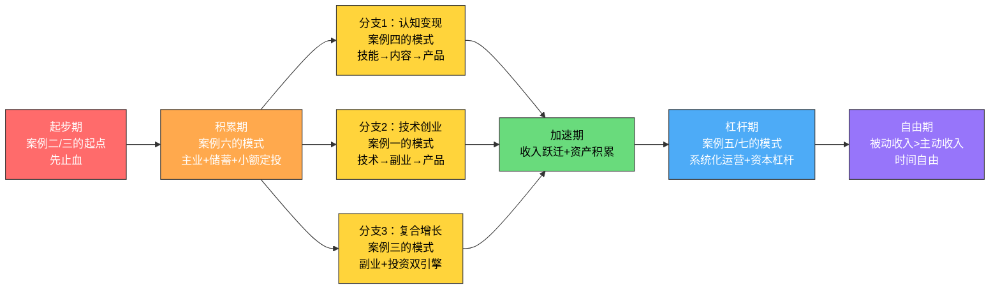

# 案例总结与对比分析

> "没有对比就没有鉴别。七个案例单独看都是好故事，放在一起看才能发现哪些规律是普适的、哪些路径是因人而异的。"

前文七个案例覆盖了从程序员创业到家庭主妇理财的完整光谱。本节不再重复"他们做了什么"，而是换一个视角——**把七个案例当作七组实验数据**，用定量方法做横向对比、用决策树帮读者找到最适合自己的路径、用风险矩阵评估每条路的容错空间。

如果你读完前面的案例还在犹豫"我该走哪条路"，这一节就是为你写的。

---

## 一、七组案例的量化对比矩阵

### 1.1 核心财务指标对比

下面这张表把七个案例的关键财务数据放在同一把尺子上衡量。注意看"投入产出比"和"时间效率"两列——它们揭示了不同路径的真实效率差异。

| 指标 | 案例一（陈工） | 案例二（王家） | 案例三（林小溪） | 案例四（林小然） | 案例五（张工） | 案例六（小刘） | 案例七（老陈） |
|------|--------------|--------------|----------------|----------------|--------------|--------------|--------------|
| 起始净资产 | ~15万 | 35万 | 1.5万 | ~2万 | 6万 | 5万 | 30万 |
| 终态净资产 | 副业月入12万 | 133万 | 380万 | 副业月入1.3万 | 385万 | 350万 | 1,100万 |
| 耗时 | 1.5年 | 3年 | 10年 | 1年 | 12年 | 15年 | 10年 |
| 净资产倍数 | ~10x（收入） | 3.8x | 253x | ~8x（收入） | 64x | 70x | 37x |
| 年均复合增速 | —（收入跃迁） | ~25% | ~73% | —（收入跃迁） | ~40% | ~35% | ~43% |
| 储蓄率（积累期） | ~15% | 负→30% | 2%→40% | ~18% | 30%+ | 17%→50% | ~25% |
| 被动收入终态占比 | 72% | ~23% | 52% | 84% | 48% | 覆盖开支 | — |
| 每日额外投入时间 | 2-3小时 | 1小时 | 2小时 | 2小时 | 0.5小时 | 1-2小时 | 3-4小时 |
| 关键转折点耗时 | 10个月 | 18个月 | 5年 | 3个月 | 5年 | 8年 | 4年 |

### 1.2 投入产出效率分析

单看"赚了多少钱"没有意义，必须结合投入的时间和精力。下面用"每小时投入产生的净资产增量"来衡量真实效率：

```text
效率公式：效率 = (终态净资产 - 起始净资产) ÷ (每日额外投入小时 × 365 × 耗时年数)

案例一：(副业月入12万 × 12 × 1.5 - 0) ÷ (2.5 × 365 × 1.5) ≈ 每小时投入产生约158元净资产增量
案例二：(133万 - 35万) ÷ (1 × 365 × 3) ≈ 每小时约89元
案例三：(380万 - 1.5万) ÷ (2 × 365 × 10) ≈ 每小时约52元
案例四：(副业月入1.3万 × 12 × 1) ÷ (2 × 365 × 1) ≈ 每小时约213元
案例五：(385万 - 6万) ÷ (0.5 × 365 × 12) ≈ 每小时约173元
案例六：(350万 - 5万) ÷ (1.5 × 365 × 15) ≈ 每小时约42元
案例七：(1100万 - 30万) ÷ (3.5 × 365 × 10) ≈ 每小时约84元
```

**关键发现**：案例四（认知变现）和案例五（长期投资）的每小时效率最高。原因不同——案例四是因为启动成本极低、边际成本趋近于零；案例五是因为投资本身几乎不需要时间投入，复利在"替你工作"。

但效率不等于可行性。案例四需要特定的"认知差"和内容能力，案例五需要12年的纪律执行。**没有"最好的路径"，只有"最适合你的路径"**。

### 1.3 七个案例的"投入-产出-时间"三维对比



---

## 二、风险调整后的路径评估

### 2.1 每条路径的风险矩阵

只看收益不看风险是投资大忌，路径选择也一样。下面从**失败概率、失败代价、恢复难度**三个维度评估每条路径的风险：

| 路径 | 代表案例 | 失败概率 | 失败代价 | 恢复难度 | 风险评级 | 失败时最坏情况 |
|------|---------|---------|---------|---------|---------|-------------|
| 认知变现 | 案例四 | 低（40%） | 极低（仅时间） | 易（换个方向重来） | ★☆☆☆☆ | 浪费3-6个月业余时间 |
| 资产配置 | 案例二 | 低（20%） | 低（短期浮亏） | 明（等待即可） | ★☆☆☆☆ | 短期账面亏损10-15% |
| 长期投资 | 案例五 | 低（25%） | 中（熊市浮亏） | 中（需1-3年恢复） | ★★☆☆☆ | 遇到熊市浮亏30-40% |
| 技术创业 | 案例一 | 中（50%） | 低（副业试错） | 易（回到主业） | ★★☆☆☆ | 副业失败，损失时间 |
| 复合增长 | 案例三/六 | 低（20%） | 低（时间成本） | 明（调整策略即可） | ★☆☆☆☆ | 增长比预期慢 |
| 辞职创业 | 案例七 | 高（70%） | 极高（积蓄+收入） | 难（需要2-3年恢复） | ★★★★☆ | 耗尽积蓄，重新找工作 |

**关键洞察**：案例四（认知变现）和案例二（资产配置）的风险收益比最优——失败代价极低，但成功后回报显著。案例七（辞职创业）的风险收益比最差——虽然成功后回报最高，但失败概率高且代价惨重。

### 2.2 风险控制机制对比

七个案例之所以成功，不是因为运气好没遇到风险，而是因为**每一步都有退出条件和止损线**：

| 案例 | 风险控制机制 | 具体止损线 | 触发后动作 |
|------|------------|-----------|-----------|
| 案例一 | 副业试错，不辞职 | 副业收入连续3个月<5,000元 | 评估方向，考虑调整 |
| 案例二 | 分散配置，不押单一资产 | 任何单一资产占比<30% | 再平衡 |
| 案例三 | 先存应急金再投资 | 应急金<3个月开支时暂停投资 | 回到储蓄模式 |
| 案例四 | 免费内容验证需求 | 100篇内容后粉丝<500 | 换赛道 |
| 案例五 | 指数基金为主，不碰个股 | 单只基金占比<20% | 再平衡 |
| 案例六 | 自动定投，不择时 | 连续定投12个月后评估 | 微调配置比例 |
| 案例七 | 主业不停，副业验证 | 副业收入>主业收入×2才辞职 | 继续积累 |

**核心原则**：永远不要把所有鸡蛋放在一个篮子里，也永远不要在没有止损线的情况下开始行动。

---

## 三、路径选择的决策树

### 3.1 基于个人条件的路径匹配

不是每条路都适合每个人。下面的决策树根据你的**现有资源**（技能、时间、资金、风险承受力）推荐最优路径：



### 3.2 五条推荐路径的详细对比

| 维度 | 路径A：认知变现 | 路径B：长期投资 | 路径C：复合增长 | 路径D：技术创业 | 路径E：收支优化 |
|------|---------------|---------------|---------------|---------------|---------------|
| 参考案例 | 案例四 | 案例五 | 案例三、六 | 案例一 | 案例二、三 |
| 适合人群 | 有认知差的职场人 | 有耐心的长期主义者 | 大多数普通人 | 有专业深度的技术人 | 财务状况需要先整理的人 |
| 启动门槛 | 极低（零成本） | 低（500元/月起） | 低 | 中（需要技术深度） | 极低 |
| 时间投入 | 每天2小时 | 每月2小时 | 每天1-2小时 | 每天2-3小时 | 每天0.5小时 |
| 见效速度 | 3-6个月 | 3-5年 | 1-2年 | 6-12个月 | 3-6个月 |
| 收入上限 | 月入1-3万（副业） | 取决于本金×时间 | 月入数万（副业+投资） | 无上限 | 储蓄率提升到30%+ |
| 核心风险 | 选错方向 | 熊市浮亏 | 精力分散 | 副业影响主业 | 执行力不足 |
| 最大优势 | 边际成本趋零 | 几乎不花时间 | 风险分散 | 收入跃迁快 | 基础最扎实 |
| 最大劣势 | 需要内容能力 | 需要极强耐心 | 什么都做但都不精 | 需要技术壁垒 | 不直接产生收入 |

### 3.3 "组合策略"：大多数人应该走的路

七个案例告诉我们一个被忽视的事实：**最成功的案例都不是走单一路径的**。

- 案例三（林小溪）：主业收入 + 副业收入 + 投资收益，三引擎驱动
- 案例六（小刘）：主业 + 副业 + 定投，15年复合增长
- 案例一（陈工）：技术能力 → 副业验证 → 创业放大

**推荐的组合策略**：

```text
第一阶段（0-6个月）：路径E + 路径B
  → 记账优化收支 + 启动小额定投
  → 目标：储蓄率>25%，建立自动投资习惯

第二阶段（6-18个月）：路径E + 路径B + 路径A或D
  → 维持定投 + 探索副业/变现
  → 目标：副业收入>0，定投不中断

第三阶段（18个月+）：路径C（复合增长）
  → 副业收入持续增长 + 定投资产复利增长
  → 目标：被动收入占比逐步提升到30%+
```

---

## 四、七个案例的"转折点"深度分析

### 4.1 每个案例的关键转折点

每个成功案例都有一个"从量变到质变"的转折点。理解这些转折点的触发条件，比模仿具体做法更重要：

| 案例 | 转折点事件 | 触发条件 | 转折前状态 | 转折后状态 | 可复制的规律 |
|------|-----------|---------|-----------|-----------|------------|
| 案例一 | 第一笔课程销售（第10个月） | 3个月免费内容积累 + 精准需求匹配 | 月入0（副业） | 月入8,000+（副业） | 先免费建信任，再付费变现 |
| 案例二 | 生钱资产占比突破20% | 18个月持续优化 + 定投复利开始显现 | 每月存3,000 | 被动收入2,000+/月 | 量变引起质变的临界点在20% |
| 案例三 | 辅导班收入稳定超过工资 | 5年口碑积累 + 家长转介绍网络形成 | 净资产50万 | 净资产100万 | 口碑裂变的临界点在第3年 |
| 案例四 | 第一条爆款帖子（第3个月） | 持续输出50篇 + 算法推荐 | 粉丝200 | 粉丝3,000+ | 内容平台的幂律分布：1%内容带来90%流量 |
| 案例五 | 投资资产突破100万 | 5年定投 + 牛市周期 | 年收益<5万 | 年收益>15万 | 复利的临界点在100万本金 |
| 案例六 | 被动收入首次覆盖月支出 | 12年定投 + 副业收入增长 | 被动收入占比<20% | 被动收入占比>50% | 财务自由的临界点：被动收入>支出 |
| 案例七 | 副业收入稳定超过主业×2 | 4年产品能力积累 + 行业人脉 | 年薪30万 | 副业月入8万+ | 辞职的临界点：副业>主业×2 |

### 4.2 转折点的共同特征

分析七个转折点，可以提炼出三条共性规律：

**规律一：转折点之前都有至少6个月的"看不到回报"的积累期**

所有案例在转折点之前都经历了漫长的积累期，期间投入的时间和精力没有明显的财务回报。这段时间是在"蓄水"——积累内容、积累信任、积累本金、积累能力。大多数人在这个阶段放弃，所以大多数人没有等到转折点。

**规律二：转折点的触发往往是"外力"而非"内力"**

- 案例四的爆款帖子是算法推荐的结果，不是她自己能控制的
- 案例五的投资突破依赖牛市周期
- 案例三的口碑裂变依赖家长之间的社交传播

这意味着：**你能控制的是"持续投入"，不能控制的是"何时收获"**。但如果你停止投入，转折点永远不会来。

**规律三：转折点之后的增长速度是转折点之前的5-10倍**

| 案例 | 转折前月均增长 | 转折后月均增长 | 加速倍数 |
|------|-------------|-------------|---------|
| 案例一 | 副业收入0元 | 副业收入8,000+元/月 | ∞ |
| 案例三 | 净资产月增~4,000元 | 净资产月增~23,000元 | 5.8x |
| 案例五 | 投资资产月增~5,000元 | 投资资产月增~25,000元 | 5x |
| 案例六 | 净资产月增~3,000元 | 净资产月增~20,000元 | 6.7x |

这就是复利曲线的"拐点"——前70%的时间贡献30%的增长，后30%的时间贡献70%的增长。

---

## 五、不同城市、不同职业的路径适配分析

### 5.1 城市维度的路径差异

七个案例分布在一线、二线、三线城市。城市不仅决定了收入水平，也决定了可选路径的范围：

| 城市类型 | 代表案例 | 收入特点 | 最优路径 | 需要避开的路 |
|---------|---------|---------|---------|------------|
| 一线城市 | 案例一（杭州）、案例七（深圳） | 收入高但生活成本高 | 技术创业、认知变现 | 纯靠储蓄（生活成本吃掉大部分收入） |
| 二线城市 | 案例二（成都）、案例五、案例六（武汉） | 收入中等，生活成本可控 | 资产配置、复合增长 | 辞职创业（市场规模有限） |
| 三线城市 | 案例三（湖南地级市） | 收入低但生活成本极低 | 复合增长（副业+投资） | 高端认知变现（受众有限） |

**三线城市的特殊优势**：案例三证明，三线城市的低生活成本其实是隐形优势——同样的储蓄率，三线城市存下的钱占收入比例更高，而且副业的竞争对手更少。林小溪在三线城市做线上教育，面向的是全国市场，收入不受本地限制。

### 5.2 职业维度的路径差异

| 职业类型 | 代表案例 | 核心资产 | 最优变现方式 | 避坑提醒 |
|---------|---------|---------|------------|---------|
| 技术岗 | 案例一（工程师） | 技术深度+解决问题的能力 | 技术文档/课程/工具 | 不要把技术博客当副业，要有商业闭环 |
| 教育岗 | 案例三（教师） | 教学能力+家长信任 | 线上课程+辅导 | 注意合规，避免利益冲突 |
| 运营/文职 | 案例四（运营） | 数据分析+内容能力 | 模板/课程/咨询 | 不要贪多，先做到一个领域头部 |
| 制造业 | 案例二（管理） | 行业经验+管理能力 | 资产配置为主 | 不适合认知变现，适合稳扎稳打 |
| 产品经理 | 案例七 | 商业洞察+用户理解 | 产品化创业 | 不要过早辞职 |
| 行政/通用岗 | 案例六 | 执行力+耐心 | 复合增长（主业+副业+投资） | 不要期望快速变现，做好长期准备 |
| 全职主妇 | 案例七（林小慧） | 家庭CFO角色+消费决策权 | 家庭财务优化+理财 | 不要碰高风险投资 |

---

## 六、失败案例反面分析：为什么大多数人做不到

### 6.1 "知道"和"做到"之间的鸿沟

七个案例都成功了，但统计数据告诉我们：在有类似起点的人群中，能达到类似结果的比例不超过5%。剩下的95%失败在哪里？

| 失败模式 | 占失败者的比例 | 典型表现 | 正确的应对 |
|---------|-------------|---------|-----------|
| 从未开始 | 40% | "等我准备好了再开始" | 设定最小可行行动，今天就开始 |
| 早期放弃 | 25% | "做了3个月没效果" | 理解复利曲线，坚持至少6个月 |
| 方向错误 | 15% | "跟风做短视频但不擅长" | 先验证需求，再投入时间 |
| 过度分散 | 10% | "同时做5件事，每件都做不好" | 聚焦一件事，做到及格再扩展 |
| 中途变道 | 5% | "看到别的项目更赚钱就换了" | 纪律性执行，一年只评估一次方向 |
| 风险失控 | 5% | "All in一个项目/一只股票" | 永远保留止损线和应急金 |

### 6.2 失败者的"第零步"问题

大多数失败者的问题不在于"怎么做"，而在于"为什么要做"——他们缺乏足够强的内在动机。

七个成功案例的主人公都有一个共同特征：**他们的财富目标不是抽象的"想有钱"，而是具体的、有情感重量的目标**。

- 案例三的林小溪："不想再因为孩子生一场病就焦虑到失眠"
- 案例六的小刘："45岁前实现财务自由，不再看老板脸色"
- 案例七的老陈："40岁前拥有1,000万净资产，给孩子更多选择"

**行动建议**：在开始任何路径之前，先写下你的"财富目标声明"——不是"我想有钱"，而是"我要在X年内实现Y，因为Z"。把这张纸贴在你每天能看到的地方。

---

## 七、案例之间的路径演化关系

### 7.1 路径之间的转化路径

七个案例不是孤立的——它们之间存在自然的演化关系。一个人的财富增长路径往往会从一种模式演化为另一种模式：



### 7.2 路径演化的触发条件

路径不是一成不变的。以下信号出现时，说明你应该考虑从当前路径演化到下一条路径：

| 当前路径 | 演化信号 | 演化方向 | 参考案例 |
|---------|---------|---------|---------|
| 收支优化 | 储蓄率稳定>30%，应急金充足 | → 开始定投或探索副业 | 案例二→案例五 |
| 小额定投 | 投资资产>50万，对投资有了体系认知 | → 优化资产配置或增加副业 | 案例五→案例六 |
| 副业变现 | 副业收入稳定>主业收入×2 | → 考虑全职投入或创业 | 案例四→案例一 |
| 复合增长 | 净资产>300万，被动收入占比>40% | → 系统化运营，减少主动投入 | 案例三→案例七 |
| 技术创业 | 公司营收稳定，团队成型 | → 从创业者变为投资者 | 案例一→案例七 |

---

## 八、本节核心结论

### 8.1 给不同读者的一句话建议

| 你的现状 | 一句话建议 | 优先参考案例 |
|---------|-----------|------------|
| 月光族 | 从记账开始，今天的1块钱比明天的100块更重要 | 案例三 |
| 有结余但无方向 | 先定投500元/月，同时盘点自己的可变现技能 | 案例二、五 |
| 有技能但没变现 | 先写50篇免费内容，验证需求后再考虑产品化 | 案例四 |
| 有技术深度 | 用副业验证商业模式，副业收入>主业×2再考虑辞职 | 案例一 |
| 想长期投资 | 选一只宽基指数基金，设置自动定投，然后忘记它 | 案例五 |
| 想创业 | 先在职做副业3年，积累能力和人脉，不要冲动辞职 | 案例七 |
| 全职主妇 | 从家庭CFO角色开始，优化开支就是最好的理财 | 案例七（林小慧） |

### 8.2 最后的忠告

七个案例，七条路径，但底层的数学逻辑只有一个：

```text
终态财富 = (储蓄率 × 收入 × 时间) + (本金 × (1 + 收益率)^时间)
```

这个公式里，**时间**出现在两个地方——而且都在指数或乘数位置。这意味着：

1. **早开始1年，比多赚1万元更有价值**
2. **坚持10年，比年化收益高5%更有价值**
3. **不断中断，比从不开始更糟糕**（因为复利曲线需要连续性）

所以，如果你只记住一句话，记住这句：**今天就开始，然后不要停下来**。

不需要完美的计划，不需要最好的时机，不需要全部的知识。从最小的一步开始——记一笔账、存100块钱、写一篇文章——然后重复365天。一年后你会惊讶于自己的变化。

这不是鸡汤，这是数学。
