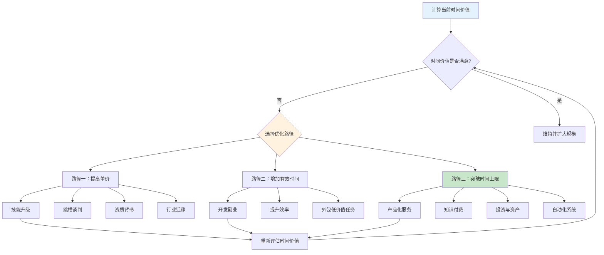
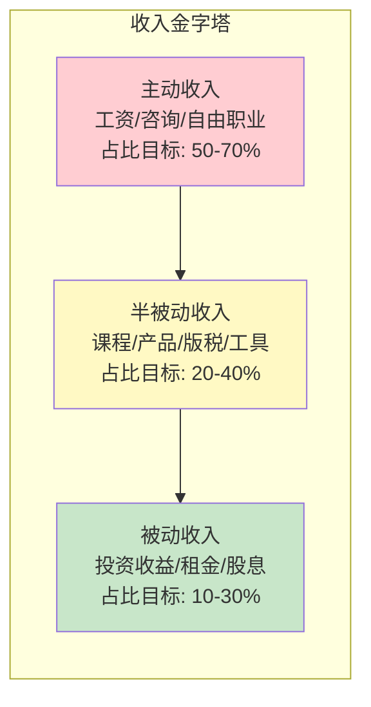
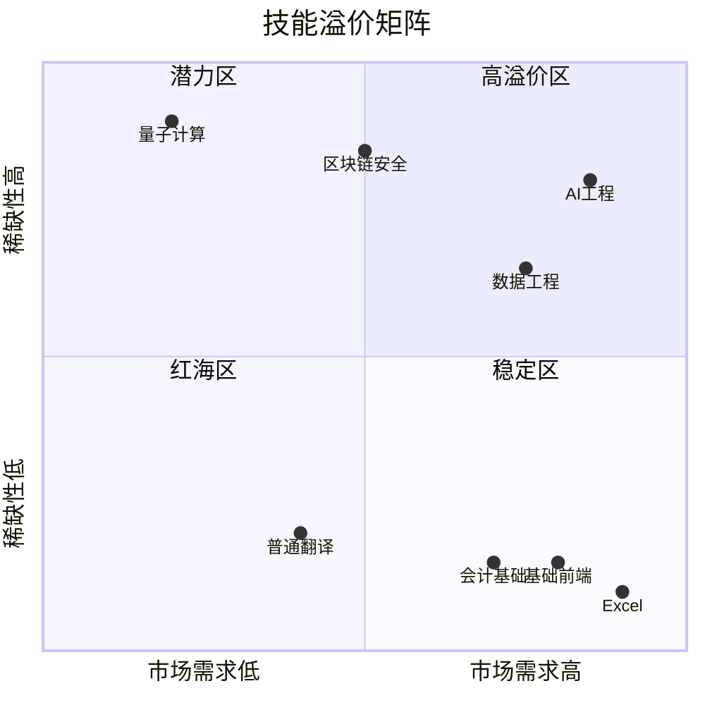
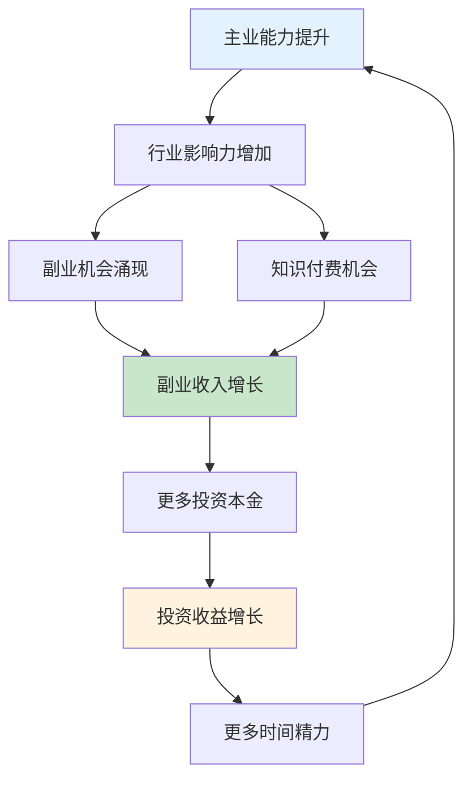

## 3.1 收入类型优化技巧

> **核心洞察**：大多数人困在"时间换钱"的线性模型里——月薪2万，每天8小时，一年2112小时，时薪113元。这意味着每多赚一块钱，就必须多付出一分钟生命。真正的收入优化不是"加班"，而是改变收入的底层结构，让时间与收入脱钩。

### 收入优化全局决策图



---

### 3.1.1 理解收入的三种底层结构

在优化收入之前，必须先理解收入的分类逻辑。所有收入本质上属于三种类型，它们的时间-收入关系完全不同：

| 类型 | 定义 | 时间-收入关系 | 上限 | 风险 |
|------|------|---------------|------|------|
| **主动收入** | 用时间直接换钱 | 线性：干1小时得1小时的钱 | 受限于可用时间 | 低（稳定） |
| **半被动收入** | 一次投入，多次产出 | 指数衰减：初期投入大，后期维护少 | 受限于产品生命周期 | 中 |
| **被动收入** | 资产自动产生收益 | 脱钩：与投入时间无关 | 受限于资本规模 | 因资产类型而异 |

**关键认知**：这三种类型不是"好"与"坏"的关系，而是收入金字塔的三个层级。主动收入是地基，半被动收入是中层，被动收入是顶层。优化路径是：先稳定地基，再建中层，最后搭顶层。



**案例：三种收入结构的实际对比**

以一位拥有5年经验的前端工程师为例，月收入目标3万：

| 方案 | 收入构成 | 月收入 | 每月投入时间 | 时薪 | 可持续性 |
|------|----------|--------|-------------|------|----------|
| 纯主动 | 全职 + 加班 | 3万 | 250小时 | 120元 | 低（依赖公司） |
| 混合型 | 全职 + 开源工具赞助 | 3万 | 200小时 | 150元 | 中（依赖平台） |
| 优化型 | 全职 + 付费课程 + 工具订阅 | 3万 | 180小时 | 167元 | 高（资产复利） |

---

### 3.1.2 计算你的真实时间价值

大多数人的"时薪"计算是错误的——只算了基本工资除以法定工时，忽略了隐性成本。

**基础公式**：

```text
显性时薪 = 年税后收入 ÷ 年工作小时数
```

**示例**：
- 月薪2万（税后约1.7万），年收入20.4万
- 年工作小时数：8小时 × 22天 × 12月 = 2112小时
- 显性时薪 = 204000 ÷ 2112 = 96.6元/小时

**进阶公式（考虑隐性成本）**：

```text
真实时薪 = (年税后收入 - 工作相关支出) ÷ (工作时间 + 通勤时间 + 加班时间 + 下班后恢复时间)
```

**示例（修正后）**：
- 工作相关支出：通勤费2000/月、午餐1500/月、职业装/培训分摊500/月 = 4000/月 = 4.8万/年
- 净收入：20.4万 - 4.8万 = 15.6万
- 通勤时间：1.5小时/天 × 22天 × 12月 = 396小时
- 下班恢复时间：0.5小时/天（心理脱离工作状态） × 22天 × 12月 = 132小时
- 总时间：2112 + 396 + 132 = 2640小时
- 真实时薪 = 156000 ÷ 2640 = 59.1元/小时

**从96.6元降到59.1元**——这个数字才是你每小时的真实价值。它决定了你应该如何做决策。

**时间价值决策矩阵**：

| 决策场景 | 判断标准 | 举例（时薪60元） |
|----------|----------|-------------------|
| 是否请家政 | 家政时薪 < 你的真实时薪 | 请（家政30-50元/小时） |
| 是否自己做饭 | 做饭时间的机会成本 vs 外卖差价 | 工作日外卖，周末自己做 |
| 是否坐地铁 vs 打车 | 省下的时间能否创造更高价值 | 通勤时能工作则打车，否则地铁 |
| 是否购买付费工具 | 节省的时间 × 时薪 > 工具费用 | 月费100元的效率工具值得买 |
| 是否参加某次会议 | 参会时间的机会成本 vs 会议产出 | 无明确议程的会议拒绝参加 |

---

### 3.1.3 路径一：提高单价——让每一小时更值钱

提高单价是收入优化的第一选择，因为它不需要额外时间投入。

#### 3.1.3.1 技能升级策略

不是所有技能都能提高时薪。技能升级的关键是找到"稀缺性 × 市场需求"的交叉点。

**技能溢价矩阵**：



**实操步骤**：

1. **盘点现有技能**：列出你掌握的所有技能，标注熟练度（1-5分）
2. **调研市场溢价**：在招聘网站搜索相关岗位，记录薪资范围
3. **识别技能缺口**：找到高薪岗位要求但你缺失的技能
4. **制定学习计划**：优先学习投入产出比最高的技能（即"3个月能入门、6个月能接单"的技能）
5. **验证市场价值**：通过兼职/咨询验证新技能的市场定价

**案例：前端工程师的技能升级路径**

| 阶段 | 技能 | 学习周期 | 月薪提升 | 投入产出比 |
|------|------|----------|----------|-----------|
| 基础 | React + TypeScript | 已掌握 | 基准 | — |
| 进阶 | Next.js + 性能优化 | 2-3个月 | +3000-5000 | 高 |
| 高级 | 架构设计 + 团队管理 | 6-12个月 | +8000-15000 | 中 |
| 稀缺 | AI工程 + LLM应用开发 | 3-6个月 | +10000-20000 | 极高 |

#### 3.1.3.2 跳槽谈判技巧

跳槽是提高单价最快的方式——平均涨幅20-30%，而内部加薪通常只有5-10%。

**跳槽时机判断**：
- 当前公司薪资低于市场中位数15%以上
- 连续两年涨幅低于通胀率
- 核心技能已形成，但晋升通道受阻
- 行业处于上升期，人才供不应求

**薪资谈判核心原则**：

1. **锚定效应**：先了解目标公司的薪资范围，报出范围上限
2. **总包思维**：不仅谈月薪，还要谈年终奖、股票期权、签字费
3. **延迟报价**：尽量让对方先出价，你后还价
4. **多offer竞争**：同时拿到2-3个offer，用互相压价
5. **非金钱补偿**：远程办公、弹性工时、培训预算、职级title

**谈判话术模板**：

```text
场景：HR问你期望薪资

错误回答："我期望25-30K"（直接暴露底线）

正确回答：
"我目前的整体年包在XX万左右（包含年终和股票），
我对这个机会很感兴趣，贵公司对这个岗位的预算范围是怎样的？"
→ 让对方先出价
→ 根据对方报价，在其基础上加10-15%还价
→ 用其他offer作为谈判筹码
```

#### 3.1.3.3 资质背书策略

某些行业，一张证书能直接提升薪资档次：

| 行业 | 高价值证书 | 平均薪资提升 | 考取周期 |
|------|-----------|-------------|----------|
| 金融 | CFA一级 | +15-25% | 6-12个月 |
| 云计算 | AWS Solutions Architect | +20-30% | 3-6个月 |
| 项目管理 | PMP | +10-20% | 3-6个月 |
| 安全 | CISSP | +25-40% | 6-12个月 |
| 数据 | Google Data Analytics | +15-20% | 3-6个月 |

**关键提醒**：证书的价值不在于"有"，而在于"稀缺"。所有人都有的证书（如英语四六级）不产生溢价。选择考取行业内认可度高、通过率低的证书。

---

### 3.1.4 路径二：增加有效时间——突破8小时限制

增加时间不是简单地"加班"，而是通过副业和效率提升，让同样的24小时产出更多价值。

#### 3.1.4.1 副业选择框架

不是所有副业都值得做。副业选择的核心标准是**边际收益递增**——投入的时间越多，单位时间产出越高。

**副业评估五维模型**：

| 维度 | 评估标准 | 权重 |
|------|----------|------|
| 时薪潜力 | 副业的预期时薪是否高于主业时薪的50% | 30% |
| 可扩展性 | 能否从"卖时间"转向"卖产品" | 25% |
| 技能复用 | 能否复用主业积累的技能和人脉 | 20% |
| 启动成本 | 前期需要投入多少时间/金钱 | 15% |
| 风险可控 | 失败的最坏后果是否可承受 | 10% |

**副业类型分级**：

| 等级 | 类型 | 时薪范围 | 可扩展性 | 举例 |
|------|------|----------|----------|------|
| L1 | 体力型 | 20-50元 | 无 | 跑腿、代驾、摆摊 |
| L2 | 技能型 | 100-500元 | 低 | 翻译、设计、编程外包 |
| L3 | 顾问型 | 500-2000元 | 中 | 咨询、培训、评审 |
| L4 | 产品型 | 理论无上限 | 高 | 课程、工具、SaaS |

**推荐路径**：从L2起步，积累口碑和案例后转向L3，最终进化到L4。

#### 3.1.4.2 效率提升：减少无效时间

效率提升的核心不是"更快地工作"，而是"减少不产生价值的时间"。

**常见时间黑洞及应对**：

| 黑洞 | 日均浪费 | 解决方案 | 预期节省 |
|------|----------|----------|----------|
| 无意义会议 | 1-2小时 | 会前要求议程，会后明确action | 50-70% |
| 频繁切换任务 | 1-1.5小时 | 番茄工作法 + 批量处理 | 30-40% |
| 社交媒体刷屏 | 0.5-1小时 | 屏障App + 固定查看时段 | 60-80% |
| 邮件/消息处理 | 0.5-1小时 | 每天固定2-3个时段集中处理 | 40-50% |
| 重复性手工操作 | 0.5-1小时 | 脚本自动化 + 模板化 | 70-90% |

**效率工具推荐**：

- **任务管理**：Todoist、Notion、滴答清单
- **时间追踪**：Toggl、RescueTime、番茄土豆
- **自动化**：Zapier、IFTTT、n8n（自部署）
- **专注模式**：Forest、Focus@Will、白噪音App

#### 3.1.4.3 外包低价值任务

当你的时间价值超过某个阈值（比如100元/小时），所有低于这个价值的工作都应该外包。

**可外包任务清单**：

- 家务清洁（25-40元/小时）
- 跑腿代办（30-50元/小时）
- 数据录入/整理（20-40元/小时）
- 基础设计/排版（30-60元/小时）
- 客服回复（25-40元/小时）
- 简单编程/脚本（50-80元/小时）

**外包平台**：猪八戒、一品威客、Upwork、Fiverr、闲鱼服务

---

### 3.1.5 路径三：突破时间上限——从卖时间到卖产品

这是收入优化的终极目标：建立一个能脱离你的时间投入而持续产生收入的系统。

#### 3.1.5.1 产品化服务

将你的专业能力打包成标准化、可复制的产品形态。

**产品化四步法**：


1. **识别高频需求**：从你的客户/同事最常问的问题中提炼
2. **标准化流程**：将解决方案变成可重复的SOP（标准操作流程）
3. **工具化交付**：用软件/模板/检查清单替代人工交付
4. **规模化销售**：通过平台/渠道触达更多客户

**案例：从咨询师到产品化的转变**

| 阶段 | 形态 | 月收入 | 时间投入 | 时薪 |
|------|------|--------|----------|------|
| 初始 | 1对1咨询，2000元/次 | 2万 | 100小时 | 200元 |
| 标准化 | 咨询模板 + 检查清单，500元/份 | 1.5万 | 20小时（维护） | 750元 |
| 产品化 | 在线课程 + 社群，199元/人 | 3万 | 30小时（内容更新） | 1000元 |
| 平台化 | 自动化评估工具 + 推荐引擎 | 5万+ | 10小时（运维） | 5000元+ |

#### 3.1.5.2 知识付费

知识付费的核心不是"教什么"，而是"帮用户解决什么问题"。

**知识付费产品形态对比**：

| 形态 | 制作成本 | 维护成本 | 天花板 | 适合人群 |
|------|----------|----------|--------|----------|
| 电子书/文档 | 低 | 低 | 低 | 有写作能力的专家 |
| 录播课程 | 中 | 低 | 中 | 有系统知识体系的专家 |
| 直播训练营 | 中 | 高 | 高 | 有教学能力的专家 |
| 会员社群 | 低 | 高 | 中 | 有持续输出能力的专家 |
| 1对1咨询 | 无 | 无 | 低 | 有深度经验的专家 |
| SaaS工具 | 高 | 中 | 极高 | 有技术能力的专家 |

**定价策略**：

- **阶梯定价**：免费引流课 → 低价入门课（99元） → 中价进阶课（499元） → 高价训练营（2999元） → 1对1咨询（5000元/次）
- **价值锚定**：先展示高价方案，再展示中价方案，用户感觉"占了便宜"
- **限时/限量**：制造稀缺感，但不要过度使用

#### 3.1.5.3 投资与资产

被动收入的本质是"让钱替你工作"。不同资产类型的收入特性差异巨大：

**被动收入资产对比**：

| 资产类型 | 预期年化 | 流动性 | 门槛 | 风险 | 适合阶段 |
|----------|----------|--------|------|------|----------|
| 货币基金 | 2-3% | 极高 | 极低 | 极低 | 起步期 |
| 债券基金 | 3-5% | 高 | 低 | 低 | 起步期 |
| 指数基金 | 8-12% | 高 | 低 | 中 | 成长期 |
| 房产租金 | 3-6% | 低 | 高 | 中 | 成熟期 |
| 股息股票 | 4-8% | 中 | 中 | 中高 | 成长期 |
| REITs | 5-10% | 中 | 低 | 中 | 成长期 |
| 数字产品 | 20-100%+ | — | 中 | 高 | 任何阶段 |

**被动收入的复利效应**：

假设每月定投5000元到年化10%的指数基金：

| 年限 | 累计投入 | 资产总值 | 年被动收入 | 月均被动收入 |
|------|----------|----------|-----------|-------------|
| 5年 | 30万 | 38.8万 | 3.9万 | 3230元 |
| 10年 | 60万 | 103.3万 | 10.3万 | 8600元 |
| 15年 | 90万 | 208.4万 | 20.8万 | 1.7万 |
| 20年 | 120万 | 383.6万 | 38.4万 | 3.2万 |

> 第20年时，你的被动收入（3.2万/月）已接近一个普通白领的工资。这就是复利的力量——前期积累缓慢，后期指数级增长。

#### 3.1.5.4 自动化系统

自动化是"突破时间上限"的技术手段——用系统替代人工，实现7×24小时运转。

**可自动化的收入场景**：

| 场景 | 自动化工具 | 预期效果 |
|------|-----------|----------|
| 电商店铺 | ERP + 自动发货 + 智能客服 | 减少80%人工 |
| 内容创作 | AI辅助写作 + 定时发布 | 3-5倍产出 |
| 社群运营 | 机器人 + 自动回复 + 定时推送 | 减少60%运营时间 |
| 广告投放 | 智能出价 + 自动优化 | 减少50%管理时间 |
| 客户跟进 | CRM自动提醒 + 邮件序列 | 减少70%手动操作 |

---

### 3.1.6 收入来源多元化策略

#### 3.1.6.1 70/20/10法则

收入多元化不是"什么都做一点"，而是有比例地分配精力：

```text
总收入 = 70%主业收入 + 20%副业收入 + 10%投资收入
```

**为什么是这个比例？**

- **70%主业**：保证基本生活，是收入的压舱石
- **20%副业**：提供增长潜力，是收入的加速器
- **10%投资**：建立被动收入，是收入的稳定器

**应用示例**：

假设你的月收入目标是5万：

| 收入来源 | 目标金额 | 时间投入 | 策略 |
|----------|----------|----------|------|
| 主业收入 | 3.5万 | 8小时/天 | 专注核心技能，争取年度涨薪 |
| 副业收入 | 1万 | 2小时/天 | 周末接项目或运营课程 |
| 投资收入 | 5000元 | 1小时/周 | 定投指数基金 + 股息再投资 |

#### 3.1.6.2 收入多元化的三个阶段

**阶段一：稳定基础（0-12个月）**

- 主业收入达到行业中位数以上
- 建立3-6个月应急基金
- 开始学习投资基础知识
- 评估副业方向

**阶段二：扩展收入（12-36个月）**

- 主业薪资通过跳槽/加薪提升20%+
- 副业收入达到主业收入的20-30%
- 投资组合初具规模
- 被动收入开始产生

**阶段三：资产化（36个月+）**

- 副业向产品化/平台化进化
- 投资收入占总收入10%以上
- 多条收入线并行运转
- 时间自由度大幅提升

---

### 3.1.7 常见误区与纠正

#### 误区一：盲目追求副业数量

**错误认知**："副业越多越好，鸡蛋不放一个篮子里"

**实际情况**：同时做3-4个副业，每个都浅尝辄止，不如集中精力做好1-2个。副业的核心价值是深度，不是广度。一个月入1万的副业，远好过4个月入2500的副业。

**纠正方法**：用"砍刀测试"——如果只能保留一个副业，你留哪个？集中资源做好它。

#### 误区二：忽略税务优化

**错误认知**："收入越高越好，税的问题以后再说"

**实际情况**：不同收入类型的税率差异巨大。工资薪金适用3-45%累进税率，劳务报酬预扣20-40%，经营所得适用5-35%累进税率，股息红利20%，资本利得（持有超1年A股）免税。

**纠正方法**：
- 副业收入考虑注册个体工商户或工作室，享受经营所得税率
- 投资收入优先选择长期持有，享受税收优惠
- 利用公积金、商业养老保险等税优工具

#### 误区三：高估被动收入的"被动"程度

**错误认知**："被动收入就是躺着赚钱"

**实际情况**：所有被动收入都需要前期大量投入。写一本书需要3-6个月，做一个课程需要1-3个月，建立投资组合需要持续学习和管理。所谓"被动"，是指收益的被动，不是投入的被动。

**纠正方法**：用"投入-产出曲线"评估——计算从零到月入5000元需要多少小时投入，以及达到后每月需要多少维护时间。

#### 误区四：主业没做好就搞副业

**错误认知**："主业没前途，副业才是出路"

**实际情况**：主业是你的基本盘。如果主业都没做到中上水平，说明你的专业能力还不足以支撑副业变现。副业的竞争更激烈——没有公司品牌背书，全靠个人能力。

**纠正方法**：先确保主业时薪达到行业前30%，再考虑副业。主业能力是副业变现的基础。

#### 误区五：只看收入不看成本

**错误认知**："副业收入5000元/月，太好了！"

**实际情况**：副业的真实收入需要扣除时间成本、工具成本、平台抽成、税务成本。如果副业每月投入60小时，你的真实时薪可能只有50元，低于主业。

**纠正方法**：用真实时薪公式重新计算副业收入，与主业时薪对比。只有副业时薪 ≥ 主业时薪的50%时，才值得投入。

---

### 3.1.8 收入优化实操模板

#### 3.1.8.1 个人收入诊断表

```markdown
## 个人收入诊断

### 基本信息
- 当前月薪（税后）：_____元
- 年终奖/其他：_____元
- 年总收入：_____元

### 时间投入
- 每日工作时间：_____小时
- 每日通勤时间：_____小时
- 每日恢复时间：_____小时
- 年工作天数：_____天

### 计算结果
- 显性时薪：_____元/小时
- 真实时薪：_____元/小时

### 优化目标
- 目标月薪：_____元
- 目标真实时薪：_____元/小时
- 实现路径：□提高单价 □增加时间 □突破上限
- 计划时间：_____个月

### 行动计划
1. 短期（1-3个月）：_____
2. 中期（3-12个月）：_____
3. 长期（1-3年）：_____
```

#### 3.1.8.2 副业评估决策矩阵

对每个潜在副业，按以下维度打分（1-5分）：

| 维度 | 权重 | 副业A | 副业B | 副业C |
|------|------|-------|-------|-------|
| 时薪潜力 | 30% | _ | _ | _ |
| 可扩展性 | 25% | _ | _ | _ |
| 技能复用 | 20% | _ | _ | _ |
| 启动成本 | 15% | _ | _ | _ |
| 风险可控 | 10% | _ | _ | _ |
| **加权总分** | | _ | _ | _ |

选择得分最高的1-2个副业集中投入。

#### 3.1.8.3 月度收入追踪表

```markdown
## 月度收入追踪 - YYYY年MM月

| 收入来源 | 目标 | 实际 | 达成率 | 备注 |
|----------|------|------|--------|------|
| 主业工资 | | | | |
| 副业收入 | | | | |
| 投资收益 | | | | |
| 其他收入 | | | | |
| **总计** | | | | |

### 本月复盘
- 最大增长点：_____
- 最大瓶颈：_____
- 下月重点：_____
```

---

### 3.1.9 进阶：收入飞轮效应

当收入优化到一定阶段，会进入"飞轮效应"——多条收入线互相促进，形成正循环。



**飞轮启动的关键**：找到你的"第一推动力"——即你最强的那个收入来源，用它带动其他收入线。

**案例：技术博主的收入飞轮**

1. 主业：高级工程师，月薪4万
2. 技术博客：积累10万粉丝 → 广告收入5000/月
3. 开源项目：GitHub 5000 stars → 赞助收入3000/月
4. 技术课程：基于博客内容开发 → 收入2万/月
5. 技术咨询：基于课程学员转化 → 收入1万/月
6. 投资：用以上收入定投 → 收入5000/月

**总收入：8.3万/月**，其中被动/半被动收入占比53%。

这个飞轮的起点是"技术博客"——一个低门槛、高复利的起点。找到你的起点，然后让飞轮转起来。

---

### 3.1.10 总结：收入优化的核心心法

1. **先算账，再行动**：知道你的真实时薪，才能做出正确的投入决策
2. **优先提高单价**：同样8小时，时薪从100到200，收入直接翻倍
3. **副业要选对**：不是所有副业都值得做，选可扩展的、与主业协同的
4. **终极目标是产品化**：从卖时间到卖产品，是收入结构的根本转变
5. **投资是必修课**：复利效应需要时间启动，越早开始越好
6. **多元化不是分散**：先做好一个，再扩展第二个
7. **持续追踪和优化**：每月复盘收入结构，识别最大杠杆点

> **最后一句话**：收入优化不是一夜暴富的捷径，而是一套可以持续迭代的系统。从今天开始计算你的真实时薪，然后用本章的方法论规划你的第一个优化动作。记住：每个月多赚1000元，十年后就是12万——这还只是本金，加上投资收益会更多。
