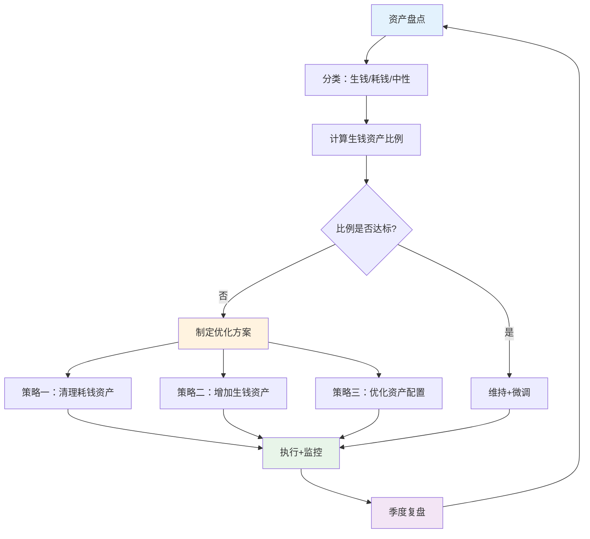
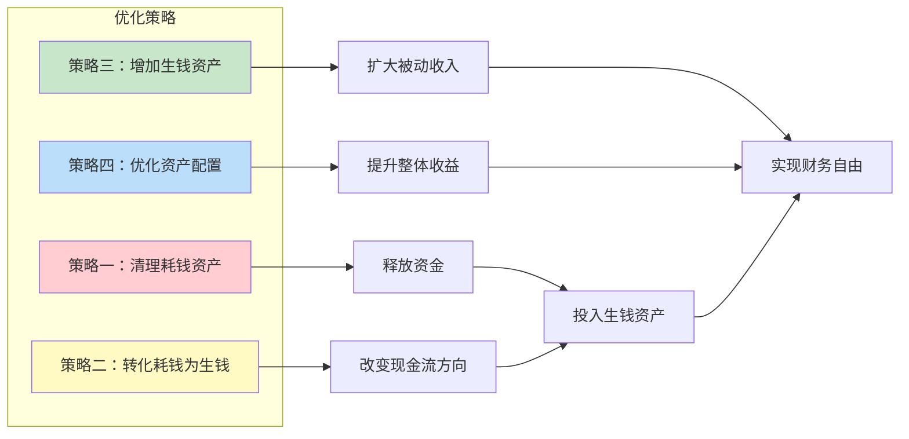
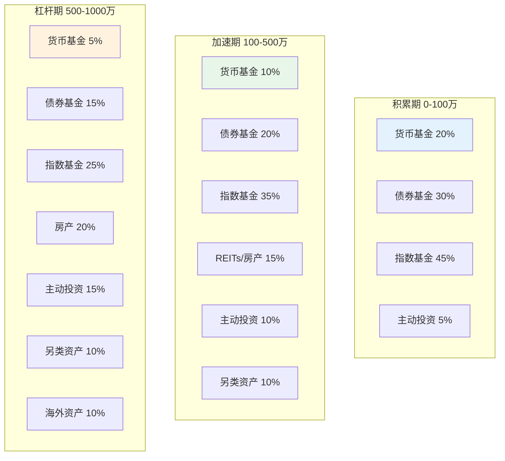
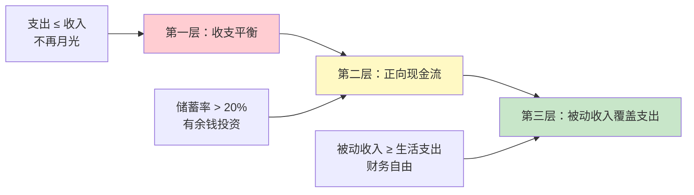
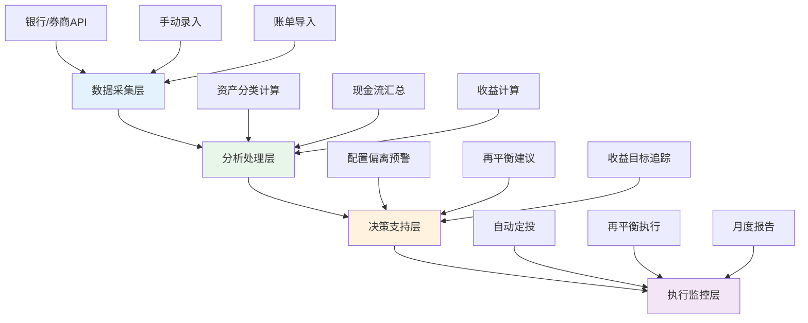

## 3.2 资产管理技巧

> **核心洞察**：大多数人管理资产的方式是"记账+看余额"——知道卡里有多少钱，但不知道这些钱在帮你赚钱还是在帮你亏钱。真正的资产管理不是"管钱"，而是**管现金流方向**——让每一分钱都流向能产生正现金流的位置。

上一节我们优化了收入结构，让收入来源更多元、更健康。但收入只是"进水口"，真正决定财富增长速度的，是你把收入放进了什么样的"容器"里。同样是月入3万、每月存下1万的两个人，一个把钱放在银行活期，一个把钱分散配置到指数基金和REITs里——10年后两人的资产差距可能超过100万。这就是资产管理的力量。

### 资产管理全局流程图



---

### 3.2.1 资产分类：现金流视角

传统会计学把资产分为"流动资产"和"固定资产"，这种分类对你个人理财几乎没有帮助。你需要的是**现金流视角**的分类——每一项资产，到底在帮你赚钱还是在帮你花钱。

#### 三种资产类型

| 类型 | 定义 | 现金流方向 | 典型举例 |
|------|------|-----------|---------|
| **生钱资产** | 持有期间持续产生正现金流 | 流入 > 流出 | 出租且租金覆盖月供的房产、股息股票、货币基金、在线课程、专利授权 |
| **耗钱资产** | 持有期间持续产生负现金流 | 流出 > 流入 | 自住房（房贷+物业+维修）、自用车（油费+保险+折旧）、奢侈品、闲置物品 |
| **中性资产** | 持有期间现金流接近零 | 流入 ≈ 流出 | 自住无贷房产（仅物业费）、日常生活用品、现金存款 |

**关键判断方法**：

```text
判断公式：月净现金流 = 月流入 - 月流出（含折旧、维护、机会成本）

如果 月净现金流 > 0 → 生钱资产
如果 月净现金流 < 0 → 耗钱资产
如果 月净现金流 ≈ 0 → 中性资产
```

**案例：同一辆车的不同属性**

| 场景 | 月流入 | 月流出（油费+保险+折旧+维修） | 月净现金流 | 属性 |
|------|--------|-------------------------------|-----------|------|
| 私家车，上下班代步 | 0 | 3500元 | -3500元 | 耗钱资产 |
| 网约车，全职运营 | 15000元 | 6000元（含更高油费和磨损） | +9000元 | 生钱资产 |
| 闲置车，偶尔开一次 | 0 | 1800元（保险+折旧+停车） | -1800元 | 耗钱资产 |
| 车辆出租给租赁公司 | 4000元 | 2000元 | +2000元 | 生钱资产 |

同一辆车，因为使用方式不同，可以是生钱资产也可以是耗钱资产。**资产的属性不是固定的，取决于你如何使用它。**

#### 隐性耗钱资产的识别

很多人忽略了"隐性耗钱资产"——表面上不花钱，实际上在消耗你的财富：

| 隐性耗钱资产 | 表面成本 | 实际成本 | 如何识别 |
|-------------|---------|---------|---------|
| 闲置的会员卡/健身卡 | 0（已付年费） | 每月分摊费用 + 占用心理空间 | 3个月未使用即为闲置 |
| 不穿的衣服/鞋子 | 0（已购买） | 存储空间成本 + 账面价值蒸发 | 1年未穿着即为闲置 |
| 低收益的银行活期 | 0（看起来没亏） | 通胀侵蚀（购买力每年缩水2-3%） | 对比同期货币基金收益 |
| 过度保险 | "保障" | 重复保障部分的保费浪费 | 审计保单，去除重复项 |
| 不产生收益的收藏品 | 0（放在那里） | 存储成本 + 资金机会成本 | 估值是否随时间增长 |

---

### 3.2.2 资产盘点清单（完整版）

资产盘点是所有资产管理动作的起点。不做盘点，就像医生不做体检就开药——全靠猜。

#### Step 1：全面列出所有资产

你需要一个完整的资产清单，不遗漏任何一项：

| 资产大类 | 具体项目 | 市值（元） | 月流入（元） | 月流出（元） | 月净现金流（元） | 属性判定 |
|---------|---------|-----------|------------|------------|----------------|---------|
| **现金类** | 银行活期 | ____ | 利息收入 ____ | 0 | ____ | 生钱/中性 |
| | 银行定期 | ____ | 利息收入 ____ | 0 | ____ | 生钱 |
| | 货币基金 | ____ | 收益 ____ | 0 | ____ | 生钱 |
| | 现金（手头） | ____ | 0 | 0 | 0 | 中性 |
| **投资类** | 指数基金 | ____ | 分红 ____ | 管理费 ____ | ____ | 生钱 |
| | 股票 | ____ | 股息 ____ | 0 | ____ | 生钱/耗钱 |
| | 债券/债券基金 | ____ | 利息 ____ | 0 | ____ | 生钱 |
| | 理财产品 | ____ | 收益 ____ | 0 | ____ | 生钱 |
| | 数字资产 | ____ | 质押收益 ____ | 0 | ____ | 生钱/耗钱 |
| **实物类** | 自住房产 | ____ | 0 | 房贷+物业+维修 ____ | ____ | 耗钱 |
| | 出租房产 | ____ | 租金 ____ | 房贷+物业+维修 ____ | ____ | 生钱/耗钱 |
| | 车辆 | ____ | 0或运营收入 ____ | 油费+保险+折旧 ____ | ____ | 生钱/耗钱 |
| | 贵金属 | ____ | 0 | 存储费 ____ | ____ | 中性/耗钱 |
| **无形资产** | 在线课程/数字产品 | ____ | 销售收入 ____ | 平台费+维护费 ____ | ____ | 生钱 |
| | 知识产权/专利 | ____ | 授权费 ____ | 维护费 ____ | ____ | 生钱 |
| | 个人品牌/自媒体 | ____ | 广告+带货 ____ | 时间成本折算 ____ | ____ | 生钱 |
| **保险类** | 现金价值型保险 | ____ | 0 | 保费 ____ | ____ | 耗钱/中性 |
| **负债** | 房贷 | ____ | 0 | 月供 ____ | ____ | 负债 |
| | 车贷 | ____ | 0 | 月供 ____ | ____ | 负债 |
| | 信用卡分期 | ____ | 0 | 月供+利息 ____ | ____ | 负债 |
| | 消费贷 | ____ | 0 | 月供+利息 ____ | ____ | 负债 |
| **合计** | | **____** | **____** | **____** | **____** | |

> **注意**：负债单独列出，不要与资产混合。净资产 = 总资产 - 总负债。

#### Step 2：计算核心指标

```text
净资产 = 总资产市值 - 总负债余额

生钱资产总额 = 所有月净现金流 > 0 的资产市值之和

生钱资产比例 = 生钱资产总额 ÷ 总资产市值 × 100%

月净现金流合计 = 所有资产月净现金流之和（含负债的月供流出）

财务自由度 = 被动收入（生钱资产月净现金流合计）÷ 月生活支出 × 100%
```

#### Step 3：评估你的资产健康度

| 指标 | 危险 | 警戒 | 健康 | 优秀 |
|------|------|------|------|------|
| 生钱资产比例 | < 20% | 20-40% | 40-60% | > 60% |
| 负债/净资产 | > 100% | 50-100% | 20-50% | < 20% |
| 储蓄率 | < 10% | 10-20% | 20-30% | > 30% |
| 财务自由度 | < 5% | 5-20% | 20-50% | > 50% |
| 收入来源数 | 1个 | 2个 | 3个 | 4个以上 |

**实操建议**：用Excel或Notion建立一个资产追踪表，每月更新一次数据，每季度做一次全面复盘。推荐模板结构见本节末尾。

---

### 3.2.3 资产优化四大策略

资产优化的目标只有一个：**持续提高生钱资产比例，直到生钱资产的被动收入覆盖你的生活开支。**



#### 策略一：清理耗钱资产——释放被困资金

耗钱资产就像漏水的水管——不管你怎么加大进水量，只要漏水不停，水池永远蓄不满。清理耗钱资产是资产管理的第一步，因为它能立刻释放现金流。

**清理优先级排序**：

| 优先级 | 耗钱资产类型 | 判断标准 | 处理方式 |
|--------|------------|---------|---------|
| 最高 | 闲置物品（电子产品、衣物、家具） | 1年以上未使用 | 闲鱼/转转出售、捐赠 |
| 高 | 高成本负债（信用卡分期、消费贷） | 年化利率 > 8% | 优先用闲置资金一次性还清 |
| 中 | 低收益投资（银行活期、低息定期） | 年化收益 < 货币基金 | 转移到货币基金或更好的标的 |
| 中 | 不产生收益的收藏品 | 估值停滞或下降 | 评估后出售或重新定位 |
| 低 | 过度保险 | 重复保障 | 退保或减额交清 |

**案例：小王的耗钱资产清理计划**

小王，28岁，月薪1.5万，盘点后发现以下耗钱资产：

| 耗钱资产 | 市值/余额 | 月流出 | 处理方式 | 释放月现金流 |
|---------|----------|--------|---------|------------|
| 闲置iPhone 13 | 3000元 | 0 | 闲鱼出售 | +3000元（一次性） |
| 闲置健身年卡（剩余6个月） | 2000元 | 333元/月 | 转让 | +333元/月 |
| 信用卡分期（年化15%） | 1.2万 | 1100元 | 一次性还清 | +1100元/月 |
| 活期存款5万 | 5万 | 损失通胀约125元/月 | 转货币基金 | +125元/月+收益 |
| 不穿的衣服20件 | 500元 | 占用衣柜空间 | 闲鱼/捐赠 | 释放空间 |

**清理后效果**：月现金流增加约1558元，一次性回收约4.3万元。

#### 策略二：转化耗钱资产为生钱资产

有些耗钱资产不需要清理，而是需要**改变使用方式**，让现金流方向反转。

**常见转化场景**：

| 耗钱资产 | 转化方式 | 转化后效果 | 前提条件 |
|---------|---------|-----------|---------|
| 自住房闲置房间 | 出租（长租或Airbnb） | 月流入1000-5000元 | 房间独立、有需求 |
| 自用私家车 | 注册网约车/租车平台 | 闲时产生收入 | 保险覆盖、车况好 |
| 闲置车位 | 出租停车位 | 月流入300-1500元 | 所在小区停车紧张 |
| 个人技能/知识 | 录制课程/写电子书 | 持续销售收入 | 有系统化知识 |
| 闲置车库/储物间 | 出租仓储空间 | 月流入500-2000元 | 位置便利 |
| 家庭厨房（周末） | 做私房菜/烘焙外卖 | 周末收入 | 手艺好、食品安全许可 |

**关键原则**：转化的前提是不影响资产的主要功能。出租闲置房间不能影响你的正常居住质量；跑网约车不能影响你的主业工作。

#### 策略三：增加生钱资产——扩大被动收入

这是资产增长的核心策略。增加生钱资产的本质是：**把每月的储蓄，系统性地投入到能产生正现金流的资产中。**

**生钱资产的分类与选择**：

| 生钱资产类型 | 预期年化 | 流动性 | 门槛 | 管理难度 | 适合阶段 | 具体标的举例 |
|-------------|---------|--------|------|---------|---------|------------|
| **现金类生钱** | 1.5-3% | 极高 | 极低 | 极低 | 任何阶段 | 货币基金、大额存单、国债逆回购 |
| **固收类生钱** | 3-6% | 高 | 低 | 低 | 起步期 | 国债、债券基金、银行理财 |
| **权益类生钱** | 8-15% | 高 | 低 | 中 | 成长期 | 指数基金、高股息ETF、REITs |
| **房产类生钱** | 3-8% | 低 | 高 | 中 | 加速期 | 出租房产、商铺、车位 |
| **数字类生钱** | 20-100%+ | — | 中 | 高 | 任何阶段 | 在线课程、电子书、SaaS工具、自媒体 |
| **另类生钱** | 变化大 | 低 | 中高 | 高 | 杠杆期 | 专利授权、品牌授权、小额股权投资 |

**每月定投实操方案**：

假设你每月有5000元可投资资金，以下是不同风险偏好的分配方案：

| 资产类型 | 保守型（年化4-6%） | 均衡型（年化8-12%） | 进取型（年化12-18%） |
|---------|-------------------|-------------------|---------------------|
| 货币基金 | 20%（1000元） | 10%（500元） | 5%（250元） |
| 债券基金 | 40%（2000元） | 20%（1000元） | 10%（500元） |
| 指数基金 | 30%（1500元） | 50%（2500元） | 50%（2500元） |
| REITs | 10%（500元） | 10%（500元） | 15%（750元） |
| 数字资产/主动投资 | 0 | 10%（500元） | 20%（1000元） |

**定投纪律**：

1. **发工资日自动扣款**：设置自动转账，避免"这个月先不投了"的诱惑
2. **下跌时加码**：市场下跌20%以上时，增加定投金额50-100%
3. **不择时**：坚持定期定额，不要试图预测市场
4. **止盈不止损**：达到目标收益后分批止盈，但不要因短期下跌而卖出

#### 策略四：优化资产配置——提升整体效率

资产配置不是"买更多种类"，而是**让不同资产之间产生协同效应**——当一类资产下跌时，另一类资产上涨或持平，平滑整体波动。

**核心配置原则**：

| 原则 | 说明 | 实操建议 |
|------|------|---------|
| 分散化 | 不把鸡蛋放在一个篮子里 | 单一资产占比不超过总资产的30% |
| 低相关性 | 资产之间价格走势不完全同步 | 股票+债券+黄金+房产，相关性低 |
| 风险匹配 | 配置与你的风险承受能力匹配 | 年龄越大，固收比例越高 |
| 定期再平衡 | 偏离目标比例时恢复 | 每半年或偏离5%时再平衡 |
| 阶段适配 | 配置随财富阶段调整 | 见下表 |

**不同财富阶段的资产配置参考**：



| 资产类别 | 积累期（0-100万） | 加速期（100-500万） | 杠杆期（500-1000万） | 自由期（1000万+） |
|---------|-----------------|-------------------|--------------------|--------------------|
| 现金/货币基金 | 15-25% | 10-15% | 5-10% | 5-10% |
| 债券/固收 | 25-35% | 15-25% | 10-20% | 15-25% |
| 权益类（股票/基金） | 40-55% | 30-40% | 20-30% | 15-25% |
| 房产/REITs | 0-10% | 15-25% | 20-30% | 15-25% |
| 另类/主动投资 | 0-5% | 5-15% | 10-20% | 5-15% |
| 海外资产 | 0% | 0-5% | 5-15% | 10-20% |

**再平衡实操**：

```text
再平衡触发条件（满足任一即触发）：
1. 时间触发：每6个月检查一次
2. 偏离触发：任一资产类别偏离目标比例超过5个百分点
3. 事件触发：市场大跌/大涨超过20%

再平衡操作：
1. 计算每个资产类别的当前占比
2. 对比目标占比，找出偏离最大的类别
3. 卖出超配类别，买入低配类别
4. 优先通过新增资金调整（避免卖出产生的税费）
```

---

### 3.2.4 现金流管理技巧

资产管理的终极目标是**正现金流**——让流入持续大于流出。现金流管理不是"省吃俭用"，而是**优化每一笔钱的流向**。

#### 现金流管理的三个层次



#### 月度现金流管理模板

```text
══════════════════════════════════════════
          月度现金流管理表
══════════════════════════════════════════

一、收入端
────────────────────────────────────────
主业收入（税后）：         ¥__________
副业收入（税后）：         ¥__________
投资收入（分红/利息）：     ¥__________
租金收入：                ¥__________
数字产品销售收入：         ¥__________
其他收入：                ¥__________
────────────────────────────────────────
总收入A：                 ¥__________


二、支出端——固定支出（每月不变）
────────────────────────────────────────
房贷/房租：               ¥__________
车贷：                    ¥__________
保险费（月均）：           ¥__________
子女教育/托费：            ¥__________
赡养费：                  ¥__________
固定订阅（视频/音乐/工具）： ¥__________
────────────────────────────────────────
固定支出小计B1：           ¥__________


三、支出端——生活支出（必要但可优化）
────────────────────────────────────────
餐饮：                    ¥__________
交通/出行：               ¥__________
通讯费：                  ¥__________
水电燃气物业：             ¥__________
日用品：                  ¥__________
医疗/健康：               ¥__________
────────────────────────────────────────
生活支出小计B2：           ¥__________


四、支出端——可变支出（可大幅优化）
────────────────────────────────────────
购物（衣物/电子/家居）：    ¥__________
娱乐/社交：               ¥__________
旅行：                    ¥__________
学习/培训：               ¥__________
人情往来：                ¥__________
其他非必要支出：           ¥__________
────────────────────────────────────────
可变支出小计B3：           ¥__________


总支出B = B1 + B2 + B3：   ¥__________


五、现金流分析
══════════════════════════════════════════
月净现金流 = A - B：        ¥__________
储蓄率 = (A - B) ÷ A × 100%：__________%

六、优化目标
────────────────────────────────────────
本月目标储蓄率：           __________%
本月可优化空间：
  - 固定支出可优化：       ¥__________
  - 生活支出可优化：       ¥__________
  - 可变支出可优化：       ¥__________
  - 收入可增长空间：       ¥__________

七、资金分配计划
────────────────────────────────────────
应急基金补充：             ¥__________（目标：6个月支出）
投资定投：                ¥__________
保险保费储备：             ¥__________
大额支出储备：             ¥__________（旅行/教育/购车等）
══════════════════════════════════════════
```

#### 增加现金流入的五条路径

| 路径 | 具体方法 | 预期效果 | 时间投入 |
|------|---------|---------|---------|
| **提升主业收入** | 技能升级、争取晋升、跳槽涨薪 | 年薪提升10-30% | 持续投入 |
| **开发副业收入** | 基于主业技能的兼职/咨询 | 月增2000-10000元 | 每周5-10小时 |
| **增加投资收益** | 优化资产配置，提高投资回报率 | 年化提升2-5% | 每周1-2小时学习 |
| **变现闲置资产** | 出售闲置物品、出租闲置资源 | 一次性回收数千-数万 | 一次性投入 |
| **创造数字资产** | 课程、电子书、工具、模板 | 持续被动收入 | 前期集中投入 |

#### 减少现金流出的三个层次

| 层次 | 策略 | 举例 | 月节省 |
|------|------|------|--------|
| **砍掉不必要支出** | 取消不用的订阅、减少冲动消费 | 取消3个未使用的会员 | 100-500元 |
| **优化必要支出** | 同品质找更便宜的替代、批量购买 | 团购日用品、自己做饭 | 500-2000元 |
| **降低固定支出** | 重新谈判保险、优化贷款利率 | 房贷转LPR、车险比价 | 200-1000元 |

---

### 3.2.5 应急基金管理

应急基金是资产配置的**地基**——没有应急基金，任何投资计划都可能因为一次突发支出而崩盘。

#### 应急基金的计算

```text
应急基金目标 = 月必要支出 × 月数

月必要支出 = 房贷/房租 + 餐饮 + 交通 + 通讯 + 水电 + 保险 + 最低生活费

月数建议：
- 双薪家庭、稳定工作：3-6个月
- 单一收入来源：6-9个月
- 自由职业/创业：9-12个月
- 行业不稳定/即将失业：12个月以上
```

#### 应急基金的存放方式

| 存放方式 | 收益 | 流动性 | 建议占比 |
|---------|------|--------|---------|
| 银行活期 | 0.2-0.3% | 即时 | 30%（应对即时需求） |
| 货币基金 | 1.5-2.5% | T+0/T+1 | 50%（主存放地） |
| 短期理财（30天内） | 2-3% | 30天内 | 20%（提高收益） |

**关键纪律**：
1. 应急基金**只能用于真正的紧急情况**（失业、重大疾病、意外维修），不能用于旅行、购物
2. 使用后必须在3个月内补回
3. 每年根据生活成本变化调整金额

---

### 3.2.6 资产管理的常见误区

#### 误区一：把自住房当成最大的"资产"

**错误认知**："我的房子值300万，我是百万富翁"

**实际情况**：自住房是耗钱资产。每月房贷+物业+维修+保险，持续流出资金。除非你卖掉它，否则这300万不会产生任何收益。更糟糕的是，房贷利息可能远超同期租金——你为"拥有"一套房子付出的总成本，可能比租房高出50-100%。

**纠正方法**：用现金流视角重新评估。计算自住房的月净现金流（通常是负数），对比"如果把首付和月供用于投资"的机会成本。不是说不能买房，而是要清楚买房的真实成本，不要误以为它是"资产增值"。

#### 误区二：追求高收益而忽略流动性

**错误认知**："收益越高越好，我把所有钱都投到收益最高的标的"

**实际情况**：高收益通常伴随低流动性。房产年化5%但卖房可能需要3-6个月，私募基金年化15%但锁定期3年。如果突发需要资金，你可能被迫折价变现。

**纠正方法**：资产配置必须考虑流动性分层——至少30%的资产可以在1周内变现，50%在1个月内变现。高收益标的控制在总资产的20-30%以内。

#### 误区三：不做资产盘点，凭感觉管理

**错误认知**："大概知道自己有多少钱就行了"

**实际情况**："大概知道"意味着你不知道钱去了哪里。很多人年入30万但5年后存款不到10万——不是赚得少，而是没有系统管理。

**纠正方法**：每月花30分钟更新资产表，每季度做一次全面复盘。用数据驱动决策，而不是凭感觉。

#### 误区四：把所有鸡蛋放在一个篮子里

**错误认知**："我只买XX股票/我只投房产/我只存银行"

**实际情况**：集中投资在顺境时收益最大化，但在逆境时可能遭受毁灭性打击。2015年A股大跌时，全仓股票的投资者亏损50-70%；2021年教培行业整顿，全仓教育股的投资者几乎清零。

**纠正方法**：单一资产类别占比不超过30-40%，单一标的占比不超过10-15。分散是唯一的"免费午餐"。

#### 误区五：忽略税费对收益的侵蚀

**错误认知**："投资收益8%，不错了"

**实际情况**：投资收益需要扣税。A股资本利得（持有超1年）免税，但持有不满1年需缴20%个人所得税（实际上A股暂免征收资本利得税，但未来政策可能变化）。基金分红需缴税，房产交易有增值税、个税、契税。扣除税费后，实际收益可能大幅缩水。

**纠正方法**：在评估投资收益时，一定要计算税后收益。合理利用税收优惠政策（如个人养老金账户每年12000元的税前扣除）。

#### 误区六：只关注资产增值，不关注现金流

**错误认知**："我的股票涨了50%，我赚大了"

**实际情况**：纸面收益不是收益。股票涨了50%但你不卖，它随时可能跌回去。真正的收益是**落袋为安的现金流**——分红、利息、租金。一个年分红5%的股息股，比一个涨了50%但不分红的成长股，在现金流视角下更健康。

**纠正方法**：关注"已实现收益"而非"账面收益"。建立一个"年度已实现收益"追踪表，记录每年实际收到的分红、利息、租金收入。

---

### 3.2.7 进阶：自动化资产管理系统

当你的资产规模超过50万、资产种类超过5种时，手动管理效率太低。你需要一套**半自动化**的资产管理系统。

#### 系统架构



#### 推荐工具组合

| 需求 | 推荐工具 | 成本 | 特点 |
|------|---------|------|------|
| 资产追踪 | 雪球/且慢/天天基金 | 免费 | 自动同步基金/股票数据 |
| 记账+现金流 | 随手记/MoneyWiz | 免费/低价 | 收支分类、预算管理 |
| 投资组合分析 | Portfolio Visualizer | 免费 | 配置分析、回测、风险评估 |
| 自动化定投 | 各券商/基金App定投功能 | 免费 | 设置后自动执行 |
| 全局仪表盘 | Excel/Notion自建 | 免费 | 完全自定义 |

#### 月度复盘清单

每月花30分钟，按以下清单复盘：

```text
□ 更新所有资产的最新市值
□ 计算本月净现金流（流入-流出）
□ 计算本月储蓄率
□ 检查各资产类别占比是否偏离目标（>5%需要调整）
□ 检查是否有耗钱资产需要清理
□ 检查应急基金是否充足
□ 记录本月投资收益（已实现）
□ 对比年度目标进度
□ 制定下月优化计划
```

---

### 3.2.8 资产管理进阶原则

当你已经建立了基础的资产管理体系后，以下进阶原则能帮你更上一层楼：

**原则一：现金流优先于增值**

不要追逐"看起来会涨"的资产，优先选择"确定产生现金流"的资产。一个年分红6%的REITs，比一个"预期涨50%"的科技股，在资产管理视角下更优——因为分红是确定的，涨幅是预期的。

**原则二：用生钱资产的收益购买耗钱资产**

这是富人购买奢侈品的方式。想买一辆30万的车？先建立一个年化8%的投资组合，当这个组合的年收益能覆盖车辆的持有成本时，再买。这样，车的购买不会侵蚀你的本金。

```text
目标：购买30万的车（年持有成本约5万）
需要的投资组合规模：5万 ÷ 8% = 62.5万
路径：先积累62.5万的生钱资产，再用收益买车
```

**原则三：定期"杀死"不产生价值的资产**

每半年做一次"资产断舍离"——如果一项资产6个月内没有产生正现金流，也没有明确的增值预期，就应该考虑清理它。闲置就是亏损。

**原则四：关注"资产效率"而非"资产规模"**

```text
资产效率 = 年被动收入 ÷ 总资产市值 × 100%

举例：
A：总资产200万，年被动收入4万 → 资产效率2%
B：总资产100万，年被动收入8万 → 资产效率8%

B的资产管理水平远高于A，尽管A的资产规模更大。
```

---

### 3.2.9 实战案例：从零开始的资产增长路径

**案例背景**：小李，26岁，前端工程师，月薪1.5万（税后1.2万），月支出8000元，月储蓄4000元，现有存款3万。

**第一年：建立基础**

| 月份 | 动作 | 资产变化 |
|------|------|---------|
| 第1月 | 资产盘点，建立追踪表 | 发现3万存款全部在活期 |
| 第2月 | 留1万活期应急，2万转入货币基金 | 月收益从5元增加到30元 |
| 第3-6月 | 每月定投4000元到指数基金（70%）+债券基金（30%） | 累计投资2.4万 |
| 第7月 | 清理闲置物品（手机、衣物、电子产品） | 回收5000元 |
| 第8-12月 | 继续定投，开始学习REITs | 累计投资5.6万 + 应急基金1万 |

**第一年末资产状况**：
- 总资产：约10万（3万应急 + 7万投资）
- 生钱资产比例：70%
- 月被动收入：约150元（货币基金利息 + 基金分红）
- 储蓄率：33%

**第三年：加速增长**

- 主业涨薪至月薪2万（跳槽）
- 副业收入月均3000元（周末接外包项目）
- 投资组合增长至35万
- 月定投金额提升至8000元
- 月被动收入：约800元

**第五年：突破临界点**

- 主业月薪2.5万
- 副业收入月均8000元（已产品化，卖技术课程）
- 投资组合增长至80万
- 月被动收入：约2500元
- 生钱资产比例：75%

**第十年：接近自由**

- 总资产突破200万
- 月被动收入：约8000-12000元
- 接近覆盖基本生活开支
- 开始考虑从加速期向杠杆期过渡

---

### 3.2.10 本节核心要点回顾

| 要点 | 核心内容 |
|------|---------|
| 资产分类 | 用现金流视角分为生钱、耗钱、中性三类 |
| 资产盘点 | 全面列出所有资产，计算月净现金流和生钱资产比例 |
| 四大优化策略 | 清理耗钱→转化耗钱→增加生钱→优化配置 |
| 现金流管理 | 增加流入、减少流出、优化结构三层推进 |
| 应急基金 | 3-12个月必要支出，分层存放 |
| 配置原则 | 分散化、低相关性、风险匹配、定期再平衡 |
| 进阶原则 | 现金流优先、用收益买耗钱资产、关注资产效率 |

> **行动清单**：读完本节后，请立即做三件事——（1）花30分钟完成资产盘点表；（2）计算你的生钱资产比例和财务自由度；（3）找出你最大的一项耗钱资产，制定清理或转化计划。知识不转化为行动，就只是信息。

***
