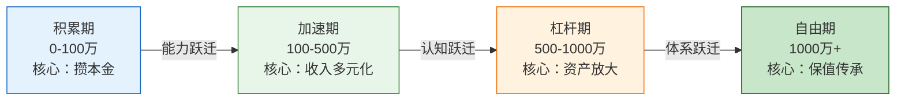
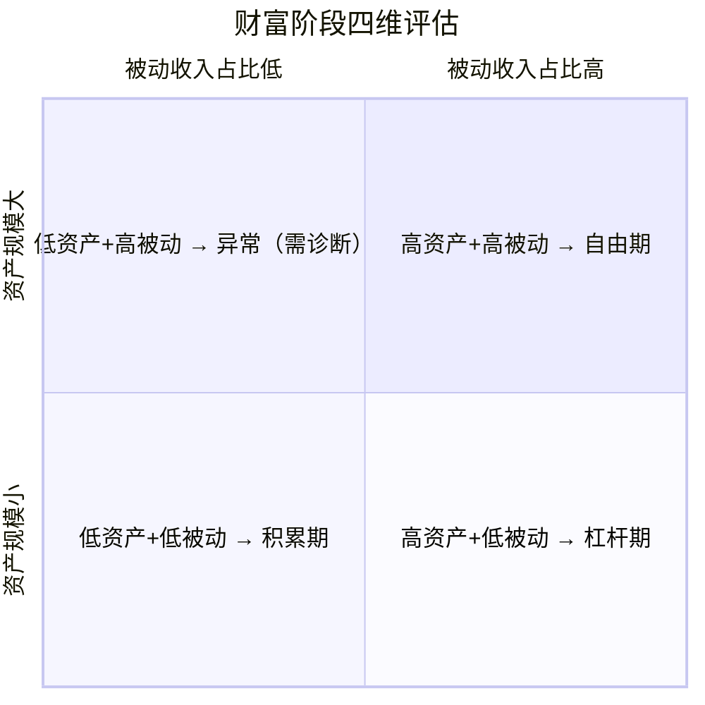
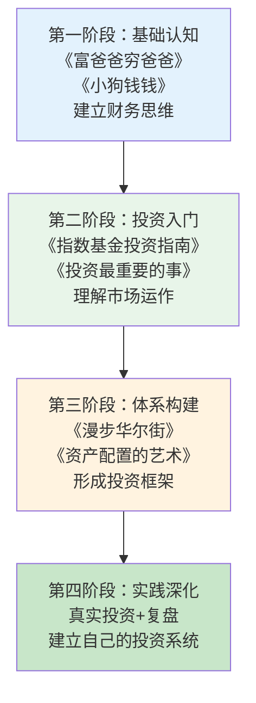
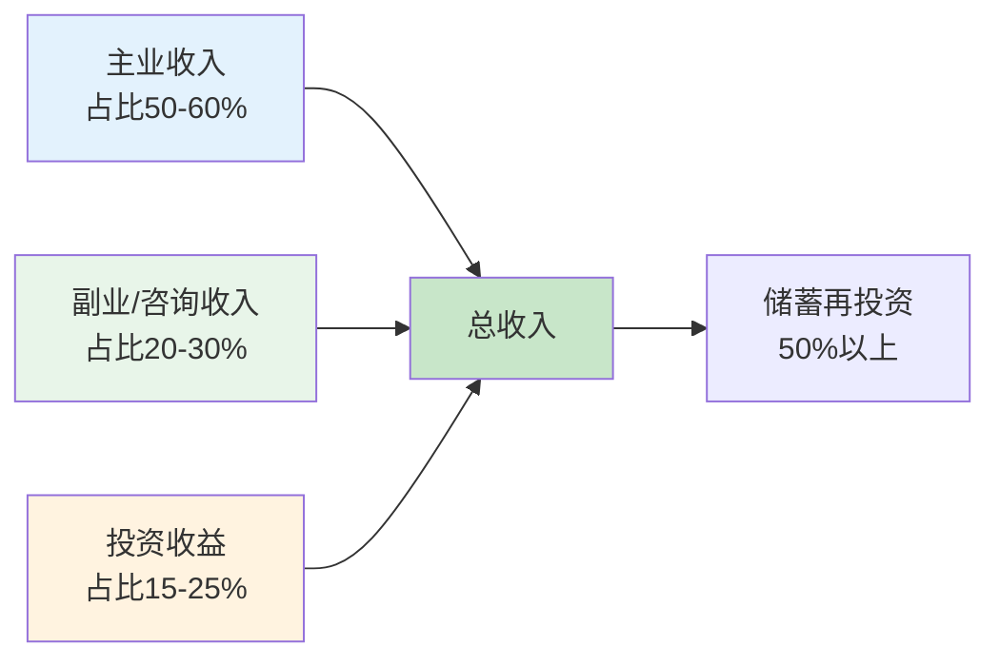
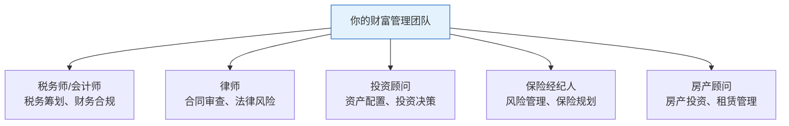
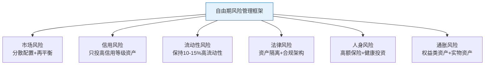
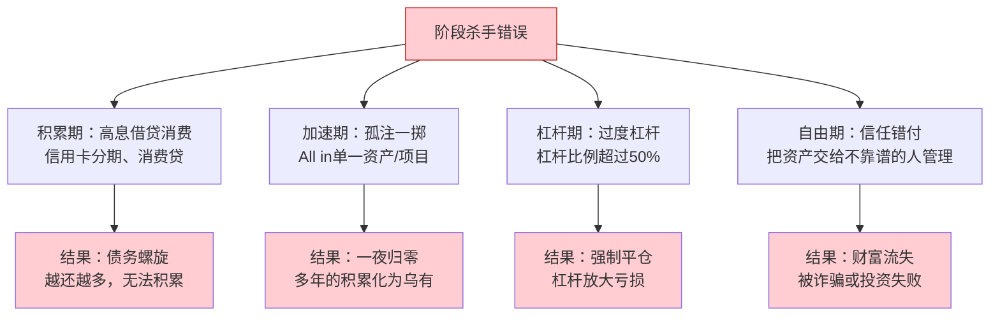

## 3.3 财富阶段判断与策略

财富增长不是线性的，而是呈现"阶梯式跃迁"的特征。不同财富阶段面临的核心矛盾不同，适用的工具和策略也截然不同。用积累期的思维去操作杠杆期的资产，或者用自由期的保守心态去面对积累期的挑战，都会导致严重的结果偏差。

本节的核心目标是帮你完成三件事：准确定位自己所处的财富阶段、理解每个阶段的核心矛盾、获得可落地执行的策略方案。

### 3.3.1 为什么财富需要分阶段管理

#### 阶段管理的底层逻辑

财富增长遵循"S型曲线"规律，而非简单的线性增长。每一个财富阶段的跃迁，本质上是一次"系统升级"——你需要新的认知框架、新的工具组合、新的风险管理方式。

**阶段错配的典型后果**：

| 错配类型 | 表现 | 后果 |
|---------|------|------|
| 阶段高估 | 积累期就使用高杠杆 | 一次市场回调就打回原形 |
| 阶段低估 | 已到杠杆期仍只做定投 | 错失3-5年的复利窗口 |
| 策略错配 | 用单一资产配置面对所有阶段 | 收益率跑不赢通胀 |
| 心态错配 | 加速期就追求"躺赚" | 被动收入远不足以覆盖生活 |

**案例**：小王28岁，总资产80万，年收入30万。他看到朋友用杠杆炒股赚了大钱，于是把60万投入股市并使用了2倍融资。2022年市场下跌30%，他的账户亏损45%（含杠杆放大），最终只剩下33万。如果他按积累期策略——定投指数基金+提升主动收入，同样的80万在3年后大概率能增长到120万以上。阶段错配的代价是至少3年的时间损失。

#### 财富增长的阶梯模型

每一次跃迁都需要三个条件同时满足：资产规模达标、核心能力掌握、心智模式升级。缺少任何一个，就会卡在当前阶段无法前进。

### 3.3.2 精准判断你的财富阶段

#### 核心评估指标体系

判断财富阶段不能只看总资产数字，需要从四个维度综合评估：

#### 四维评估详细标准

| 评估维度 | 积累期（0-100万） | 加速期（100-500万） | 杠杆期（500-1000万） | 自由期（1000万+） |
|---------|-------------------|---------------------|----------------------|-------------------|
| **总资产** | 0-100万 | 100-500万 | 500-1000万 | 1000万以上 |
| **被动收入占比** | <生活开支的10% | 10%-30% | 30%-80% | >80% |
| **收入结构** | 90%+靠工资/主动劳动 | 工资+副业+投资收益 | 投资收益占30%以上 | 被动收入为主 |
| **投资能力** | 入门级：只懂存款和货基 | 进阶级：理解资产配置 | 专业级：能管理复杂组合 | 精通级：体系化运作 |
| **风险管理** | 基本无风险意识 | 开始建立风控体系 | 系统性风险管理 | 家族级风控架构 |
| **时间精力分配** | 90%用于赚钱 | 70%赚钱+30%投资学习 | 40%赚钱+60%资产管理 | 20%赚钱+80%生活 |

#### 自我诊断工具

用以下评分表快速定位自己的阶段。每个维度1-4分，总分范围6-24分。

| 评分项 | 1分 | 2分 | 3分 | 4分 |
|--------|-----|-----|-----|-----|
| 总资产 | <30万 | 30-100万 | 100-500万 | >500万 |
| 被动收入占比 | <5% | 5-20% | 20-60% | >60% |
| 收入来源数量 | 1个 | 2个 | 3-4个 | 5个以上 |
| 投资知识水平 | 只懂存款 | 理解基金股票 | 能做资产配置 | 精通多资产类别 |
| 风险管理能力 | 无 | 有基本保险 | 有系统风控 | 有专业顾问团队 |
| 财务自由度 | 完全依赖工资 | 离职后撑6个月 | 离职后撑2年 | 不工作也能持续 |

**评分解读**：
- 6-10分：积累期——核心任务是攒够第一桶金
- 11-15分：加速期——核心任务是让收入和资产同时增长
- 16-20分：杠杆期——核心任务是用体系放大收益
- 21-24分：自由期——核心任务是保值、传承和享受

**注意事项**：如果你的总资产很高但被动收入占比很低（比如500万资产但被动收入不到10%），说明你的资产配置有问题——太多资金躺在低效资产上。这不是真正的杠杆期，而是"伪杠杆期"，需要先优化资产结构。

### 3.3.3 各阶段核心策略详解

#### 积累期策略（0-100万）

**阶段核心矛盾**：本金太少，时间太多但不懂如何用。

这个阶段的本质是"建立财务地基"。你的首要目标不是投资收益最大化，而是尽快积累足够的本金，同时建立正确的财务习惯和投资认知。

**策略一：最大化储蓄率**

储蓄率 = （收入 - 支出）/ 收入 × 100%

积累期的目标储蓄率是30%以上。对于月入1.5万的人来说，每月至少存4500元。

**实操方法**：

1. **50/30/20预算法**：50%必要支出（房租、吃饭、交通）、30%个人发展（学习、社交、健康）、20%储蓄投资。这个比例是底线，可以调整为40/30/30甚至30/30/40。

2. **自动化储蓄**：工资到账当天，自动转出20-30%到专用储蓄账户。推荐使用银行的"工资自动转存"功能，或者直接设置两个银行账户——"收入账户"和"储蓄账户"。

3. **支出审计**：每月底花30分钟回顾当月所有支出，找出3-5个"可优化项"。比如外卖可以减少到每周3次、咖啡可以从星巴克换成自制、订阅服务可以合并或取消。

**策略二：提升主动收入**

积累期的收入增长比投资收益更重要。月入1万时存30%，月入3万时还是存30%，后者的积累速度是前者的3倍。

**提升路径**：

| 路径 | 时间投入 | 预期回报 | 适合人群 |
|------|---------|---------|---------|
| 考取行业证书 | 3-6个月 | 薪资涨幅20-50% | 有明确职业方向的人 |
| 学习副业技能 | 1-3个月 | 月增收入2000-8000 | 有时间精力的人 |
| 跳槽/升职 | 1-6个月 | 薪资涨幅30-100% | 有市场竞争力的人 |
| 创业/自由职业 | 6-12个月 | 不确定，上限高 | 有资源和勇气的人 |

**策略三：开始定投学习**

积累期不是不投资，而是"边学边投，小钱试错"。

**入门投资方案**：

1. **应急基金**：先存3-6个月生活开支作为应急基金，放在货币基金或银行活期+中。

2. **指数基金定投**：每月定投1000-3000元到宽基指数基金（沪深300、中证500）。定投的意义不在于收益，而在于让你"身在市场中"，建立对波动的感知。

3. **小额学习仓**：拿总资产的5-10%（比如2-5万）做主动投资学习，可以尝试股票、基金组合等。亏了是学费，赚了是信心。

**策略四：建立财务知识体系**

这个阶段最重要的投资是投资自己的大脑。推荐的学习路径：

**积累期常见误区**：

- ❌ **误区1**：等有钱了再理财。真相：理财习惯比金额更重要，月入5000就开始记账和定投的人，比月入5万但从不理财的人更容易实现财务自由。
- ❌ **误区2**：追求高收益投资。真相：积累期的本金太少，即使年化20%，10万本金一年也就赚2万。但提升技能把月薪从1万涨到1.5万，一年多赚6万。先赚"大钱"（主动收入），再用"大钱"赚"小钱"（投资收益）。
- ❌ **误区3**：省钱就是一切。真相：过度省钱会压缩自我投资的空间，导致收入增长停滞。该花的钱（学习、社交、健康）一分都不能省。
- ❌ **误区4**：忽视保险。真相：积累期抗风险能力最弱，一场大病可能清零所有积蓄。意外险+百万医疗险每年不到1000元，是性价比最高的"投资"。

#### 加速期策略（100-500万）

**阶段核心矛盾**：有能力赚钱了，但不知道如何让钱高效运转。

进入加速期，你已经有了100万以上的资产和相对稳定的收入来源。这个阶段的核心任务从"攒钱"转变为"让钱生钱"——你需要建立多元化的收入结构和科学的资产配置体系。

**策略一：收入多元化**

加速期的收入结构应该是"主动收入 + 副业收入 + 投资收入"三条腿走路。

**收入多元化路径**：

**具体方法**：

1. **技能变现**：把你的专业技能转化为副业收入。程序员可以接外包、做技术咨询；设计师可以做自由设计；教师可以做线上课程。目标是每月增加5000-15000元的副业收入。

2. **知识付费**：如果你在某个领域有深度积累，可以通过写书、做课程、开咨询等方式变现。一个定价199元的线上课程，如果能卖出500份，就是近10万元收入。

3. **小规模创业**：用不超过总资产10%的资金尝试小规模创业项目。比如开一个淘宝店、做一个SaaS小产品、投资一个朋友的生意。即使失败，损失也在可控范围内。

**策略二：资产配置优化**

加速期的资产配置目标是"稳健增长+风险分散"。

**推荐配置方案**：

| 资产类别 | 配置比例 | 预期年化 | 风险等级 | 说明 |
|---------|---------|---------|---------|------|
| 货币基金/银行理财 | 10-15% | 2-3% | 极低 | 应急资金+短期需求 |
| 债券基金/固收+ | 20-30% | 4-6% | 低 | 稳定收益压舱石 |
| 指数基金/ETF | 30-40% | 8-12% | 中 | 核心增值资产 |
| 个股/行业基金 | 10-20% | 不确定 | 中高 | 超额收益来源 |
| 另类投资 | 5-10% | 不确定 | 高 | 分散+探索 |

**再平衡规则**：每季度检查一次资产比例，偏离目标比例超过5%时进行再平衡。比如股票基金占比从35%涨到42%，就卖出7%转入债券基金。

**策略三：学习高级投资策略**

加速期需要掌握的投资技能：

1. **资产配置理论**：理解现代投资组合理论（MPT）、有效前沿、夏普比率等概念。不需要成为专家，但要理解"分散投资为什么能降低风险"。

2. **估值方法**：学会用PE、PB、DCF等方法判断资产是贵还是便宜。估值不是用来精确计算的，而是用来建立"贵了谨慎、便宜了加仓"的纪律。

3. **周期判断**：理解经济周期和市场周期的基本规律。美林时钟、信贷周期等框架可以帮助你在大方向上做出正确判断。

4. **税务优化**：了解个人所得税、资本利得税、基金分红税等税务知识。合理利用税收优惠政策（如个人养老金账户每年12000元的抵扣额度），长期可以节省大量税费。

**策略四：建立投资纪律**

| 纪律项 | 具体规则 | 违反后果 |
|--------|---------|---------|
| 仓位管理 | 单一资产不超过总资产的20% | 一次暴雷损失惨重 |
| 止损纪律 | 单笔投资亏损超15%必须复盘决策 | 小亏变大亏 |
| 定投纪律 | 每月固定日期定投，不因市场涨跌改变 | 追涨杀跌 |
| 学习纪律 | 每月至少读1本投资书/10篇深度报告 | 认知停滞 |
| 记录纪律 | 每笔投资记录买入理由、预期、止损位 | 无法复盘改进 |

**加速期常见误区**：

- ❌ **误区1**：追求"完美配置"。真相：不存在完美的资产配置，只有适合你的配置。不要花3个月研究"最优方案"，先按标准方案执行，再根据实际情况调整。
- ❌ **误区2**：频繁交易。真相：数据显示，交易频率越高的投资者，收益越低。年换手率超过500%的账户，平均收益比买入持有策略低4-6个百分点。
- ❌ **误区3**：忽视现金流管理。真相：有100万资产但每月现金流为负（入不敷出），不如只有50万资产但每月现金流为正的人安全。现金流是生命线，资产只是数字。
- ❌ **误区4**：过早追求被动收入。真相：100万本金，即使年化10%也只有10万收益。在你的主动收入还有很大增长空间时，把精力放在提升主动收入上，回报率远高于投资。

#### 杠杆期策略（500-1000万）

**阶段核心矛盾**：资产够多了，但缺乏系统化的管理能力和风险控制。

杠杆期是财富增长的"加速阶段"，核心特征是可以开始合理使用杠杆放大收益。但杠杆是双刃剑——放大收益的同时也放大风险。这个阶段的关键是建立系统化的资产管理体系和严格的风控机制。

**策略一：合理使用杠杆**

**杠杆的三种类型**：

| 杠杆类型 | 具体形式 | 成本 | 风险 | 适用场景 |
|---------|---------|------|------|---------|
| 财务杠杆 | 房贷、经营贷、融资融券 | 年化3-8% | 中高 | 确定性高的投资 |
| 人力杠杆 | 雇佣团队、外包、合伙 | 人力成本 | 中 | 业务扩展 |
| 技术杠杆 | 自动化工具、软件系统 | 开发/订阅成本 | 低 | 效率提升 |

**杠杆使用原则**：

1. **杠杆成本必须低于预期收益**：如果你的预期收益是8%，杠杆成本是6%，净收益只有2%，但风险被放大了数倍——不值得。

2. **杠杆比例不超过总资产的30%**：500万资产，最多用150万杠杆。这意味着即使亏损50%，你还剩425万，不至于伤筋动骨。

3. **杠杆资金必须有明确的退出计划**：在借入资金之前，就要想好"如果亏损X%，我就止损退出"。没有退出计划的杠杆就是在赌博。

**案例**：小李有600万资产，用100万作为首付购买了一套300万的房产（200万房贷，利率3.5%）。房产出租后月租金8000元，年租金收入9.6万，扣除房贷利息7万后净收益2.6万。同时房产本身有增值潜力。这是合理的杠杆使用——有稳定现金流覆盖成本，且有资产增值空间。

**反面案例**：小张有500万资产，用300万融资买入股票（杠杆比例60%）。市场下跌20%时，他的账户亏损120万（含杠杆放大），保证金不足被强制平仓，实际亏损可能超过150万。杠杆比例过高+没有止损纪律=灾难。

**策略二：建立专业团队**

杠杆期不是一个人战斗的阶段。你需要以下专业支持：

**选择专业顾问的标准**：
1. 有相关资质证书（CPA、CFA、律师执照等）
2. 收费模式透明（按服务收费，不按产品佣金）
3. 有服务同等资产规模客户的经验
4. 推荐你能理解的产品和方案
5. 愿意解释每个建议背后的逻辑

**策略三：海外资产配置**

当资产规模超过500万，开始考虑地域分散是合理的。

**海外配置的目的**：
1. **货币风险分散**：避免单一货币贬值导致的财富缩水
2. **市场风险分散**：不同国家的经济周期不同步
3. **制度风险分散**：不同法律体系下的资产保护

**实操路径**：

| 配置方式 | 最低门槛 | 预期收益 | 复杂度 | 适合人群 |
|---------|---------|---------|--------|---------|
| QDII基金 | 1000元 | 跟踪海外市场 | 低 | 所有人 |
| 港股通 | 50万 | 取决于选股 | 中 | 有一定经验者 |
| 美股账户 | 无门槛 | 取决于投资策略 | 中高 | 有外汇额度者 |
| 海外房产 | 100万+ | 租金+增值 | 高 | 高净值人群 |
| 海外保险/信托 | 50万+ | 3-6% | 高 | 有传承需求者 |

**策略四：税务筹划**

杠杆期的税务筹划变得重要，因为投资收益的税负开始显著影响实际回报。

**常用税务优化方法**：

1. **长期持有优势**：持有股票超过1年，股息红利税减半；基金持有超过1年免收赎回费。
2. **亏损抵税**：投资亏损可以在一定程度上抵扣投资收益（具体政策请咨询税务师）。
3. **企业架构**：如果副业收入稳定，可以考虑注册公司，利用企业所得税率（通常低于个人所得税率）和费用抵扣政策。
4. **养老金账户**：每年12000元的个人养老金账户抵扣额度，虽然金额不大，但长期积累效果可观。

**杠杆期常见误区**：

- ❌ **误区1**：过度使用杠杆。真相：杠杆放大收益的同时放大损失。巴菲特的伯克希尔公司从不使用超过30%的杠杆比例。
- ❌ **误区2**：忽视税务成本。真相：很多看起来收益不错的投资，扣除税费后可能还不如银行理财。在做投资决策时，必须计算税后收益。
- ❌ **误区3**：盲目追求"高端"投资。真相：私募基金、信托产品、Pre-IPO项目等"高端"产品，门槛高不代表收益高。很多私募基金的收益还不如指数基金。
- ❌ **误区4**：忽视流动性。真相：500万资产如果全部锁在房产和长期投资中，遇到急需用钱的情况会很被动。始终保持总资产10-15%的高流动性资产。

#### 自由期策略（1000万+）

**阶段核心矛盾**：钱够了，但如何确保一辈子花不完，并且能传承给下一代。

自由期的核心任务从"增长"转变为"保值与传承"。这个阶段的首要目标是"不亏钱"，次要目标才是"适度增长"。

**策略一：保守型资产配置**

**自由期推荐配置**：

| 资产类别 | 配置比例 | 目标 | 说明 |
|---------|---------|------|------|
| 高流动性资产 | 10-15% | 随时可用 | 货币基金、短期国债 |
| 固定收益类 | 30-40% | 稳定现金流 | 国债、高等级债券、银行理财 |
| 权益类资产 | 20-30% | 长期增值 | 指数基金、蓝筹股 |
| 另类资产 | 10-15% | 分散风险 | 黄金、REITs、海外资产 |
| 传承类资产 | 5-10% | 财富传承 | 保险、信托 |

**核心原则**：即使权益类资产全部归零（极端情况），你的生活质量也不会受到根本性影响。

**策略二：财富传承规划**

财富传承不是"等老了再说"的事情，而是需要提前10-20年开始规划的系统工程。

**传承工具对比**：

| 工具 | 优势 | 劣势 | 适用场景 | 成本 |
|------|------|------|---------|------|
| 遗嘱 | 简单直接 | 可能被质疑、执行慢 | 资产结构简单的家庭 | 低 |
| 生前赠与 | 确定性强、无争议 | 失去控制权 | 子女已成年且可靠 | 低 |
| 保险 | 杠杆效应、避税 | 收益率较低 | 需要大额现金传承 | 中 |
| 家族信托 | 资产隔离、长期管理 | 门槛高、费用高 | 超高净值家庭 | 高 |
| 家族企业股权 | 控制权与收益权分离 | 结构复杂 | 有家族企业的家庭 | 高 |

**传承规划的关键步骤**：

1. **清点资产**：列出所有资产（房产、金融资产、保险、企业股权等），明确权属关系。
2. **确定传承目标**：希望传承给谁、传承多少、什么时候传承。
3. **选择工具组合**：根据资产规模和家庭情况，选择合适的传承工具组合。
4. **专业团队执行**：找律师、税务师、信托公司等专业机构协助执行。
5. **定期检视更新**：家庭情况变化时（结婚、离婚、生子等），及时更新传承方案。

**策略三：系统化风险管理**

自由期的风险管理需要覆盖以下维度：

**策略四：回馈社会与自我实现**

当财富超过个人和家庭的需求后，"回馈"成为一种深层需求。

1. **慈善捐赠**：选择你关心的领域（教育、医疗、环保等），通过正规渠道进行捐赠。中国有个人所得税的慈善捐赠抵扣政策，合理利用可以降低税负。

2. **天使投资**：用不超过总资产5%的资金做天使投资，支持有潜力的创业者。这不仅是财务投资，更是一种社会价值创造。

3. **知识传承**：把你的财富增长经验和教训分享给年轻人。写作、演讲、 mentorship 都是很好的方式。

4. **生活方式升级**：追求健康、体验和精神富足，而不仅仅是物质享受。研究表明，超过一定收入水平后，消费带来的幸福感边际递减，但体验性消费（旅行、学习、社交）的幸福感持续更久。

**自由期常见误区**：

- ❌ **误区1**：过度保守。真相：1000万资产如果全部存银行（年化2%），30年后实际购买力（考虑3%通胀）只有约450万。过度保守等于慢性亏损。
- ❌ **误区2**：忽视传承规划。真相：没有传承规划的财富，可能因为遗产纠纷、税务负担、婚姻变动等原因在一代人内大幅缩水。
- ❌ **误区3**：生活奢侈化。真相：很多中了彩票或继承大额遗产的人，因为突然改变生活方式，几年内就把财富挥霍一空。自由期的生活方式应该是"可持续的舒适"，而非"无节制的奢侈"。
- ❌ **误区4**：失去人生目标。真相：财富自由后最大的风险不是财务风险，而是"存在危机"——不知道自己为什么活着。保持学习、社交和目标感，比多赚100万更重要。

### 3.3.4 阶段过渡的关键节点

#### 积累期 → 加速期的过渡条件

**必须满足的硬指标**：
- 总资产达到100万（含房产净值）
- 被动收入开始产生（哪怕只有每月几百元）
- 储蓄率稳定在30%以上
- 已建立基础投资知识体系

**需要掌握的核心能力**：
1. 理解资产配置的基本原理
2. 能够独立分析一只基金或股票的基本面
3. 有至少1年的投资实践经验
4. 建立了投资记录和复盘习惯

**过渡期行动清单**：

| 序号 | 行动 | 时间要求 | 验证标准 |
|------|------|---------|---------|
| 1 | 完成资产盘点 | 1天内 | 列出所有资产和负债的清单 |
| 2 | 制定资产配置方案 | 1周内 | 有明确的比例和标的 |
| 3 | 执行再平衡 | 1个月内 | 按方案调整到位 |
| 4 | 建立投资日记 | 持续 | 每笔投资有记录和复盘 |
| 5 | 拓展收入来源 | 3个月内 | 至少有1个副业收入来源 |

#### 加速期 → 杠杆期的过渡条件

**必须满足的硬指标**：
- 总资产达到500万
- 被动收入占总收入的30%以上
- 投资收益持续3年以上为正
- 收入来源至少3个

**需要掌握的核心能力**：
1. 能够独立构建和管理一个投资组合
2. 理解杠杆的原理和风险
3. 有系统化的风险管理框架
4. 建立了可信赖的专业顾问网络

#### 杠杆期 → 自由期的过渡条件

**必须满足的硬指标**：
- 总资产达到1000万
- 被动收入覆盖所有生活开支
- 投资体系经受过至少一次市场周期的考验
- 已有初步的财富传承规划

**需要掌握的核心能力**：
1. 能够在市场大幅波动时保持冷静
2. 有完整的风险管理体系
3. 能够识别和拒绝"太好而不真实"的投资机会
4. 对人生目标有清晰的思考

### 3.3.5 阶段跃迁的加速策略

#### 时间杠杆：缩短阶段用时

| 加速方法 | 原理 | 预期效果 | 适用阶段 |
|---------|------|---------|---------|
| 收入跳升 | 通过跳槽、升职大幅提升收入 | 缩短积累期1-3年 | 积累期 |
| 技能变现 | 把专业技能转化为副业收入 | 加速积累2-3倍 | 积累期-加速期 |
| 行业红利 | 进入高增长行业享受红利 | 资产增速翻倍 | 所有阶段 |
| 合伙创业 | 用人力杠杆放大收益 | 可能跃迁也可能归零 | 加速期-杠杆期 |
| 合理杠杆 | 用低成本资金放大收益 | 收益放大2-3倍 | 杠杆期 |

#### 认知杠杆：避免关键错误

很多人的财富增长停滞，不是因为能力不足，而是因为犯了某个阶段的关键错误。以下是最常见的"阶段杀手"：

### 3.3.6 特殊情况处理

#### 双收入家庭的阶段判断

双收入家庭的阶段判断需要合并计算：
- 总资产 = 双方资产之和
- 被动收入 = 双方被动收入之和
- 生活开支 = 家庭总开支（通常低于两人分开时的总和）

**注意**：双收入家庭的优势在于收入多元化和开支共享，但也要注意避免"双重风险"——如果两人都在同一行业或公司，行业下行时会同时受到影响。

#### 高负债人群的阶段修正

如果你有较高的负债（如房贷），需要调整阶段判断：

**修正后的净资产** = 总资产 - 总负债

如果修正后的净资产为负数，你实际上处于"负积累期"，需要优先解决负债问题：
1. 列出所有负债的利率
2. 优先偿还利率最高的负债（通常信用卡>消费贷>房贷）
3. 在负债降低到可控水平之前，不要进行高风险投资

#### 继承/意外获得大额资产

如果你突然获得大额资产（继承、中奖、拆迁等），建议：
1. **暂停一切重大财务决策**，至少等6个月
2. **聘请专业团队**（律师、税务师、理财顾问）
3. **先做好资产保护**（保险、信托等），再考虑投资增值
4. **不改变生活方式**，至少1年内保持原有的消费水平

### 3.3.7 财富阶段判断与策略速查表

| 项目 | 积累期 | 加速期 | 杠杆期 | 自由期 |
|------|--------|--------|--------|--------|
| **核心目标** | 攒够第一桶金 | 让钱高效运转 | 体系化放大收益 | 保值与传承 |
| **核心策略** | 提升收入+储蓄定投 | 收入多元化+资产配置 | 合理杠杆+专业团队 | 保守配置+传承规划 |
| **风险偏好** | 低-中 | 中 | 中-高 | 低 |
| **时间分配** | 90%赚钱+10%学习 | 70%赚钱+30%投资 | 40%赚钱+60%管理 | 20%赚钱+80%生活 |
| **关键指标** | 储蓄率>30% | 被动收入占比>10% | 投资收益>主动收入30% | 被动收入>生活开支 |
| **最大风险** | 消费主义陷阱 | 追涨杀跌 | 杠杆失控 | 财富流失 |
| **推荐书籍** | 《富爸爸穷爸爸》 | 《投资最重要的事》 | 《聪明的投资者》 | 《财富的逻辑》 |
| **预期时间** | 3-7年 | 3-5年 | 2-4年 | 持续优化 |

> **最后的忠告**：财富阶段不是竞赛，不需要和别人比较。找到适合自己当前阶段的策略，踏踏实实执行，耐心等待复利发挥作用。记住：财富增长的最大敌人不是收益率不够高，而是在错误的阶段做了错误的事情。
