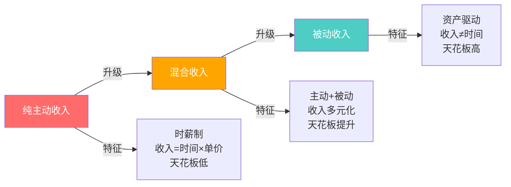
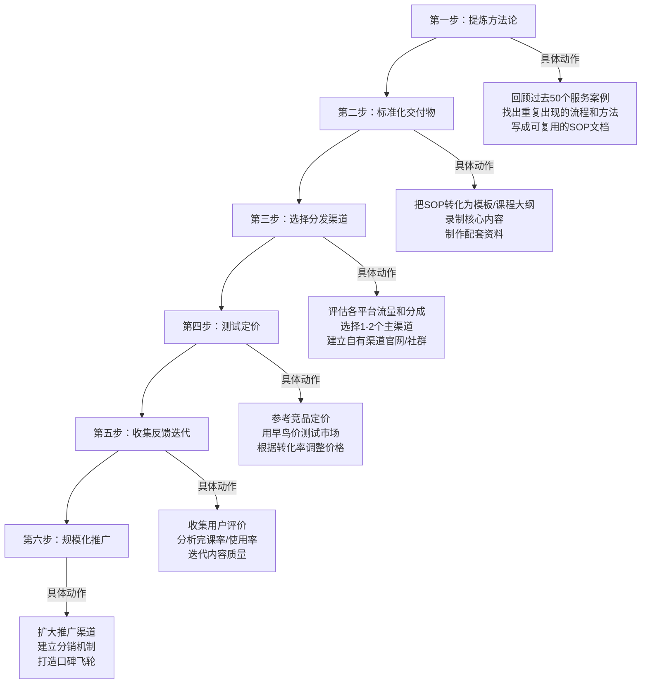
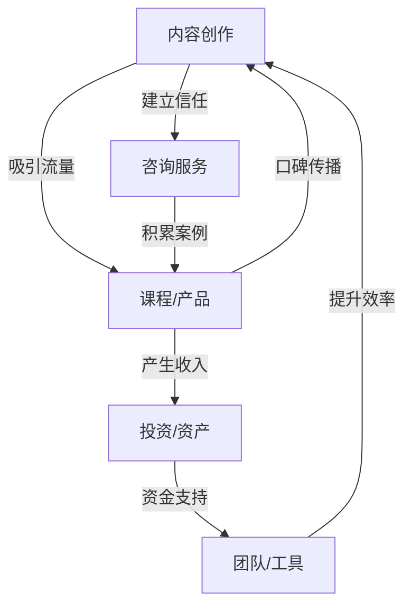

## 3.4 个人商业模式升级技巧

个人商业模式决定了你的收入上限、时间自由度和财富增长速度。大多数人的收入瓶颈不是因为不够努力，而是商业模式本身存在天花板——用时间换钱的模式，无论怎么加班，一天也只有24小时。本节从商业模式诊断入手，系统讲解三种升级路径，提供完整的工具和实操方法，帮助你突破收入天花板。

### 3.4.1 什么是个人商业模式

个人商业模式是你创造价值、传递价值并获取回报的完整系统。它回答三个核心问题：你为谁创造什么价值？你通过什么方式交付价值？你如何从中获取收入？

#### 商业模式的四个核心要素

| 要素 | 含义 | 关键问题 |
|------|------|----------|
| 价值主张 | 你解决什么问题、满足什么需求 | 客户为什么选你而不是别人？ |
| 交付方式 | 你如何把价值传递给客户 | 一对一、一对多还是自动化？ |
| 收入模式 | 你如何从价值交换中获取收入 | 时薪、项目制、订阅还是分成？ |
| 杠杆类型 | 你的价值交付是否可以规模化 | 你的收入是否依赖个人时间？ |

#### 个人商业模式的三种类型

理解你当前所处的商业模式类型，是升级的前提。根据纳瓦尔·拉维坎特（Naval Ravikant）的杠杆理论，个人商业模式可以分为三种：

**类型一：纯主动收入模式**

这是最常见的模式——用时间换取报酬。典型代表：上班族、自由职业者、按小时收费的顾问。收入公式为：收入 = 时薪 × 工作小时数。这种模式的致命缺陷是时间有上限，收入因此有硬天花板。一个程序员即使时薪从200元涨到500元，一个月不眠不休也只能挣36万元（720小时 × 500元），而现实中能做到的有效工作时间每月不超过200小时。

**类型二：混合收入模式**

在主动收入的基础上，叠加部分被动或半被动收入。典型代表：一边接咨询项目一边卖在线课程的技术专家，一边上班一边运营自媒体的白领。收入公式为：收入 = 主动收入 + 被动收入。这是大多数人的过渡阶段，主动收入提供稳定现金流，被动收入逐步积累。

**类型三：被动收入模式**

投入一次时间精力，持续获取回报。典型代表：畅销书作者、SaaS产品开发者、内容创作者通过广告和品牌合作获取收入。收入公式为：收入 = 资产价值 × 转化率。这种模式的前期投入大、回报周期长，但一旦越过临界点，收入增长将远超时间投入。



### 3.4.2 商业模式诊断框架

升级之前，先搞清楚自己在哪里。以下是一套完整的诊断工具，帮你量化当前商业模式的状态。

#### 诊断维度一：收入结构分析

把过去12个月的收入按来源分类统计，算出每种收入类型占总收入的百分比。

```text
┌─────────────────────────────────────────────┐
│            收入结构诊断表                      │
├─────────────────────────────────────────────┤
│                                             │
│  1. 收入类型分布                              │
│     ├─ 主动收入（工资/时薪/项目费）：____%      │
│     ├─ 组合收入（提成/绩效/奖金）：____%        │
│     └─ 被动收入（版税/广告/分红/租金）：____%   │
│                                             │
│  2. 价值交付方式                              │
│     ├─ 一对一服务（咨询/外包/教练）：____%      │
│     ├─ 一对多服务（课程/演讲/社群）：____%      │
│     └─ 自动化服务（产品/平台/SaaS）：____%     │
│                                             │
│  3. 客户辐射范围                              │
│     ├─ 本地客户：____%                        │
│     ├─ 全国客户：____%                         │
│     └─ 全球客户：____%                         │
│                                             │
│  4. 当前月收入天花板：________元               │
│  5. 按当前模式，理论年收入上限：________元      │
│  6. 如果不改变模式，3年后收入：________元      │
│                                             │
└─────────────────────────────────────────────┘
```

**诊断标准**：主动收入占比超过80%说明你还在"用时间换钱"阶段；被动收入占比超过30%说明你已经建立了初步的资产；被动收入占比超过50%说明你的商业模式已经比较成熟。

#### 诊断维度二：杠杆率评估

杠杆率衡量的是你的收入与个人时间投入的脱钩程度。

| 杠杆等级 | 描述 | 收入特征 | 典型例子 |
|---------|------|---------|---------|
| L0 无杠杆 | 收入与时间1:1绑定 | 停工即停收 | 上班族、小时工 |
| L1 人力杠杆 | 通过团队放大产出 | 收入=团队产出-管理成本 | 小型工作室老板 |
| L2 资本杠杆 | 用资金放大收益 | 收入=资本×收益率 | 投资者、房东 |
| L3 产品杠杆 | 一次开发持续销售 | 边际成本趋近于零 | App开发者、课程讲师 |
| L4 平台杠杆 | 撮合交易抽取佣金 | 收入=交易量×佣金率 | 平台创始人 |
| L5 媒体杠杆 | 内容持续产生价值 | 零边际成本无限复制 | 畅销书作者、头部博主 |

**自评方法**：把你的收入来源逐项列出，分别标注杠杆等级。如果所有收入都在L0-L1，说明你的商业模式急需升级。如果已经有一项达到L3以上，说明你已经找到了突破口，需要加大投入。

#### 诊断维度三：商业模式画布填写

商业模式画布（Business Model Canvas）是由亚历山大·奥斯特瓦德提出的经典工具。针对个人商业模式，画布的九个模块需要逐一填写：

| 模块 | 核心问题 | 填写要点 |
|------|---------|---------|
| 客户细分 | 你为谁创造价值？ | 精确描述理想客户画像，越具体越好 |
| 价值主张 | 你帮客户解决什么问题？ | 区分功能价值、情感价值和社会价值 |
| 渠道通路 | 你如何触达客户？ | 列出所有获客渠道及各渠道转化率 |
| 客户关系 | 你如何维护客户关系？ | 一次性交易、订阅制还是社区制？ |
| 收入来源 | 你从哪里赚钱？ | 列出所有收入流，标注稳定性和增长性 |
| 核心资源 | 你需要什么资源？ | 个人技能、知识、人脉、资金、工具 |
| 关键活动 | 你必须做什么？ | 产出价值的核心动作，区分高杠杆和低杠杆 |
| 重要合作 | 你需要谁的帮助？ | 供应商、合作伙伴、平台、导师 |
| 成本结构 | 你的主要成本是什么？ | 固定成本 vs 可变成本，显性成本 vs 隐性成本（时间机会成本） |

**填写技巧**：先从"客户细分"和"价值主张"开始，这两个模块决定了其他所有模块。填写时用具体数字而非模糊描述——"月收入5000元的自由撰稿人"比"写手"有价值得多。

### 3.4.3 路径一：从一对一到一对多

这是最常见的升级路径，核心思想是把你已经在一对一服务中验证过的方法论和经验，打包成可以同时服务多个人的产品。

#### 为什么这条路最可行

一对一服务是最好的市场验证手段——客户愿意付钱说明你的价值主张成立，你在服务过程中积累的案例、方法论和客户痛点认知是核心资产。升级到一对多不是从零开始，而是把你已经验证的东西规模化。

#### 四种升级方式详解

**方式一：把服务打包成标准化产品**

把你反复执行的服务流程标准化，变成一个有明确输入输出的产品。

```text
升级前：自由设计师接定制项目
├─ 每个项目都是全新设计
├─ 交付周期2-4周
├─ 月接3-5个项目
├─ 月收入1.5-2.5万元
└─ 瓶颈：设计产能有限

升级后：设计模板包 + 品牌方案
├─ 把常见行业设计方案做成模板包
├─ 提供品牌方案模板（含使用指南）
├─ 定价：单模板99-299元，全套方案999-2999元
├─ 月销100-300份
├─ 月收入1-9万元
└─ 突破点：一次制作，无限销售
```

**方式二：创建在线课程**

在线课程是一对多的经典形式。关键不在于"录视频"，而在于课程设计——好的课程需要有清晰的学习路径、可衡量的学习成果、和充分的练习反馈机制。

课程定价策略参考：

| 课程类型 | 时长 | 定价区间 | 目标销量 | 月收入估算 |
|---------|------|---------|---------|----------|
| 入门微课 | 1-3小时 | 9.9-49元 | 500-2000份/月 | 5000-5万元 |
| 系统课程 | 10-30小时 | 199-699元 | 50-300份/月 | 1-20万元 |
| 训练营 | 4-8周 | 999-4999元 | 20-100人/期 | 2-50万元/期 |
| 高端私教 | 3-6个月 | 5000-3万元 | 5-20人/期 | 2.5-60万元/期 |

**方式三：写书或出版内容**

写书的直接收入不高（除非成为畅销书），但它是建立专业权威的最高效方式。一本书可以带来咨询客户、演讲邀请、课程学员等间接收入。在中国市场，自出版电子书、专栏订阅（如知识星球、小报童）是更灵活的选择。

**方式四：开发软件工具或模板**

如果你的技能领域涉及重复性操作，把这些操作封装成工具。比如：做数据分析的可以开发Excel模板或Python脚本包；做运营的可以开发SOP模板库；做设计的可以开发Figma组件库。工具类产品边际成本几乎为零，且用户粘性高。

#### 从一对一到一对多的关键步骤



#### 常见误区

- **误区一**："我没经验做不了课程"。真相：你只需要比你的目标学员多走一步。面向小白的课程不需要你是行业顶尖，只需要你能把小白带入门。
- **误区二**："先做课程再做服务"。真相：正确顺序是先做一对一服务，积累方法论和案例，再转化为课程。没有实战验证的课程是空中楼阁。
- **误区三**："一对多就是降价"。真相：一对多不是降价，是改变交付方式。一对多产品的价格可以比一对一高，因为它的价值在于体系化的知识而非碎片化的时间。

### 3.4.4 路径二：从本地到全国/全球

地理限制是很多个人商业模式的隐性天花板。突破地理限制，客户基数可以从一个城市扩展到全国甚至全球，收入潜力呈指数级增长。

#### 线上化的三个层次

**层次一：内容线上化**

把你的专业知识转化为线上内容（文章、视频、播客），通过内容获取全国范围的客户。这是成本最低的起步方式。

实操步骤：
1. 选择主内容平台（公众号/B站/抖音/小红书），根据你的目标客户在哪里做决策
2. 每周产出2-3篇高质量内容，坚持至少3个月
3. 内容中自然植入服务入口（个人简介、文末引导）
4. 通过私信/评论区承接咨询需求

**层次二：服务线上化**

把原本线下交付的服务搬到线上。很多服务不需要面对面：财务咨询、营销策划、心理咨询、法律咨询、设计服务都可以通过视频会议和协作工具远程交付。

关键工具清单：

| 用途 | 工具推荐 | 备注 |
|------|---------|------|
| 视频会议 | 腾讯会议、飞书、Zoom | 支持屏幕共享和录制 |
| 协作办公 | 飞书文档、Notion、语雀 | 实时协作，降低沟通成本 |
| 项目管理 | 飞书多维表格、Teambition | 交付进度透明化 |
| 在线支付 | 微信支付、支付宝、Stripe | 国际客户用Stripe或PayPal |
| 内容分发 | 小鹅通、知识星球、Gumroad | 课程和数字产品分发平台 |

**层次三：产品线上化**

开发数字化产品（SaaS工具、App、模板库），面向全国或全球市场销售。这是杠杆率最高的方式，但需要技术能力或技术合伙人。

#### 国际市场开拓

如果你的技能具有通用性（编程、设计、写作、数据分析），开拓国际市场可以显著提升收入。同样的技能，在国际市场的时薪可能是国内的3-5倍。

起步方式：
1. 在Upwork、Fiverr等平台注册账号，用英文展示作品集
2. 从低单价起步积累评价，逐步提价
3. 建立英文个人网站，优化LinkedIn个人资料
4. 参与GitHub开源项目或英文技术社区，建立专业声誉

### 3.4.5 路径三：从个人到系统

从个人到系统的核心是把你从"执行者"变成"系统设计者"。你不再亲自交付每一个价值，而是设计一套系统，让系统替你交付价值。

#### 系统化的四个阶段

**阶段一：流程标准化**

把你所有重复性工作写成SOP（标准操作流程），让任何人按照SOP都能完成80%的工作。

SOP模板：

```text
SOP文档模板
━━━━━━━━━━━━━━━━━━━━━━━━━━━━━━━
流程名称：____________
适用场景：____________
执行频率：____________

步骤一：____________
  - 操作说明：____________
  - 输入物：____________
  - 输出物：____________
  - 常见问题：____________
  - 预计耗时：____________

步骤二：____________
  （同上格式）

质量检查清单：
  □ 检查项1：____________
  □ 检查项2：____________
  □ 检查项3：____________

常见错误及纠正：
  - 错误1：____________ → 纠正方法：____________
  - 错误2：____________ → 纠正方法：____________
━━━━━━━━━━━━━━━━━━━━━━━━━━━━━━━
```

**阶段二：团队搭建**

当SOP成熟后，把低杠杆的工作外包或招聘助理执行，你专注于高杠杆的工作（战略决策、核心内容创作、客户关系维护）。

团队搭建的成本收益分析：

| 角色 | 月成本 | 释放你的时间 | 你用释放的时间创造的价值 |
|------|--------|------------|----------------------|
| 虚拟助理 | 3000-5000元 | 40-60小时/月 | 开发新课程（预期月增收1万+） |
| 内容编辑 | 5000-8000元 | 30-50小时/月 | 接高端咨询（预期月增收2万+） |
| 客服人员 | 3000-4000元 | 20-30小时/月 | 建立新渠道（预期月增收5千+） |

**阶段三：自动化**

用技术工具替代人工执行。自动化是系统化的最高形态——系统7×24小时运行，你只需要维护和优化。

可以自动化的环节：
- 内容发布：用定时发布工具（如新榜、微小宝）批量排期
- 客户跟进：用CRM系统（如HubSpot免费版）自动发送跟进邮件
- 收款交付：用小鹅通/Teachable自动完成"付款→开通→交付"全流程
- 数据报告：用Python脚本自动生成周报/月报

**阶段四：资产化**

把你的系统变成可转让、可增值的资产。一个成熟的内容平台、一个有稳定用户群的SaaS产品、一个有品牌影响力的社群，都可以作为资产出售或融资。

#### 案例：一个内容创作者的系统化之路

```text
时间线：从月入5千到月入10万的系统化过程

第1-6个月（个人执行期）：
├─ 全职做自由撰稿，月收入5000-8000元
├─ 建立公众号，每周发3篇文章
├─ 开始积累写作方法论和客户案例
└─ 关键产出：写作SOP文档、客户画像分析

第7-12个月（产品化期）：
├─ 推出写作训练营（定价999元/期，每期30人）
├─ 同时保留高端一对一写作咨询（5000元/月）
├─ 训练营收入：999×30 = 29,970元/期
├─ 咨询收入：5000×3 = 15,000元/月
├─ 月收入提升到：3-5万元
└─ 关键产出：课程体系、学员社群

第13-18个月（团队化期）：
├─ 招聘1名助教负责训练营日常运营
├─ 招聘1名编辑负责内容分发
├─ 自己专注于内容创作和高端咨询
├─ 训练营升级为月度开班
├─ 月收入提升到：6-8万元
└─ 关键产出：运营团队、分发矩阵

第19-24个月（系统化期）：
├─ 开发写作工具（AI辅助写作模板/写作评分系统）
├─ 推出年度会员制（1999元/年）
├─ 训练营改为自动化流程（录播+助教答疑）
├─ 月收入提升到：8-12万元
├─ 每周实际工作时间：20-25小时
└─ 关键产出：自动化系统、工具产品
```

### 3.4.6 商业模式升级的风险管理

升级不是没有风险的。以下是常见的升级风险及应对策略：

| 风险类型 | 具体表现 | 应对策略 |
|---------|---------|---------|
| 收入断崖 | 放弃现有收入来源去追求新模式 | 保持主动收入的同时，用业余时间测试新模式 |
| 市场验证失败 | 产品推出后无人购买 | 先用最小可行产品（MVP）测试，不要一步到位 |
| 精力分散 | 同时推进多条升级路径 | 一次只聚焦一条路径，跑通后再扩展 |
| 能力瓶颈 | 新模式需要你不具备的能力 | 学习或外包，不要因为不会而放弃 |
| 现金流断裂 | 新模式还没盈利，旧模式已经放弃 | 确保新模式产生稳定收入后再逐步减少旧模式 |

#### 升级的时机判断

什么时候该升级？不是"我厌倦了现在的工作"，而是满足以下条件时：
1. 你在当前模式下的收入已经触顶（连续6个月没有增长）
2. 你已经积累了足够的方法论和客户案例
3. 你有至少3-6个月的生活费储备（应对过渡期收入下降）
4. 你已经验证了新模式的可行性（至少有1-2个付费客户）

### 3.4.7 进阶：商业模式组合与飞轮效应

高级的个人商业模式不是单一路径，而是多条路径的组合。当你的课程带来学员，学员中产生咨询客户，咨询经验反哺课程内容，课程口碑带来新学员——这就是飞轮效应。



飞轮的关键在于每个环节都在为其他环节加速。你需要找到自己的飞轮核心——通常是"内容"或"产品"——然后让其他环节围绕它运转。

#### 收入多元化黄金比例

根据实践经验，健康的个人商业模式收入结构大致如下：

```text
收入多元化建议比例
━━━━━━━━━━━━━━━━━━━━━━━━━━━━━
核心收入（主营产品/服务）：50-60%
  └─ 你的核心价值交付，最稳定的收入来源

增长收入（新产品/新渠道）：20-30%
  └─ 正在测试和增长的新收入线

被动收入（投资/版税/广告）：10-20%
  └─ 不依赖你日常时间投入的收入

探索收入（实验性项目）：5-10%
  └─ 小成本试错，寻找下一个增长点
━━━━━━━━━━━━━━━━━━━━━━━━━━━━━
```

### 3.4.8 行动清单：商业模式升级30天启动计划

不要读完就忘。以下是可执行的30天行动清单：

**第1-7天：诊断阶段**
- [ ] 完成收入结构诊断表，算出当前各收入类型占比
- [ ] 评估自己的杠杆等级（L0-L5）
- [ ] 填写商业模式画布九宫格
- [ ] 明确当前商业模式的最大瓶颈

**第8-14天：规划阶段**
- [ ] 确定一条升级路径（一对一→一对多 / 本地→全国 / 个人→系统）
- [ ] 研究3-5个同领域已成功升级的案例
- [ ] 设计最小可行产品（MVP），明确验证指标
- [ ] 制定3个月的升级路线图

**第15-21天：启动阶段**
- [ ] 开发MVP产品（课程大纲/模板原型/工具Demo）
- [ ] 找5-10个目标用户做种子测试
- [ ] 收集反馈，记录所有问题和建议
- [ ] 根据反馈调整产品方向

**第22-30天：验证阶段**
- [ ] 正式推出MVP，设定早鸟价格
- [ ] 追踪核心指标（转化率、复购率、满意度）
- [ ] 如果验证成功：制定规模化计划
- [ ] 如果验证失败：分析原因，调整方向，重新测试

***
