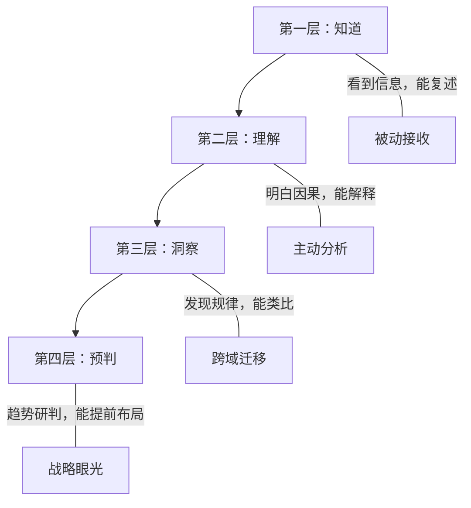
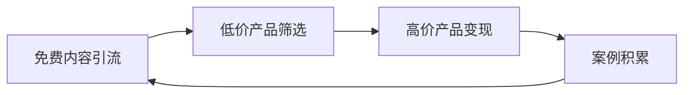

## 3.5 认知变现技巧

认知变现的本质是**将个人对世界的理解深度转化为经济回报**。与体力劳动不同，认知变现具有非线性增长特征——你的知识不会因为出售一次而消失，反而会在输出过程中进一步深化，形成"越分享越值钱"的正循环。

本节从信息差识别、认知差构建、执行力落地、变现路径选择四个维度，系统拆解认知变现的完整方法论。

### 3.5.1 识别信息差

信息差是最容易起步的认知变现形式。它的核心逻辑很简单：**你知道的，别人不知道；你能看到的，别人看不到**。谁先填补这个信息缺口，谁就能获得溢价。

#### 信息差的四种来源

| 类型 | 说明 | 典型场景 | 持续性 |
|------|------|----------|--------|
| 行业信息差 | 不同行业的知识壁垒 | 医疗行业的人不了解互联网运营，反之亦然 | 中等，行业融合趋势在缩小 |
| 地域信息差 | 不同地区的市场差异 | 国内成熟的商业模式在东南亚刚起步 | 较强，区域发展不均衡长期存在 |
| 平台信息差 | 不同平台的价格/规则差异 | 同一商品在拼多多和京东价差30%-50% | 较弱，信息透明化趋势明显 |
| 时间信息差 | 信息传播存在时间窗口 | 政策出台后的早期套利机会 | 弱，窗口期越来越短 |

#### 信息差的识别方法

**方法一：跨行业社交**

不要只和同行业的人交流。每季度至少参加一次非本行业的会议、沙龙或线上社群。关键不是听演讲，而是**在茶歇和饭局上了解其他行业的人在为什么问题发愁**。

具体做法：
1. 加入3-5个非本行业的付费社群（年费200-500元即可）
2. 每周花30分钟浏览非本行业的公众号/论坛热帖
3. 和不同行业的朋友定期吃饭，主动问"你们行业最近有什么新变化"
4. 记录信息差笔记，建立自己的"信息差清单"

**方法二：跨境/跨平台比价**

定期对比国内外同类产品或服务的价格差异。这不仅适用于实物商品，也适用于服务、课程、工具。

实操流程：
1. 选定一个品类（如SaaS工具、设计素材、机械设备配件）
2. 用工具对比国内外价格（Alibaba vs Amazon, 1688 vs 速卖通）
3. 计算含运费、关税后的到手成本
4. 评估是否有15%以上的价差空间——低于15%利润太薄，不值得做
5. 找到3个以上供应商，避免单一依赖

**方法三：政策追踪**

政府政策是最大的信息差来源之一。一项新政策从发布到被市场充分消化，通常有1-6个月的窗口期。

追踪渠道：
- 国务院政策文件库（www.gov.cn/zhengce）
- 各部委官网的政策解读
- 地方政府产业扶持政策（很多补贴信息只有本地人知道）
- 行业协会的政策解读会

#### 信息差案例详解

**案例一：跨境电商价差套利**

小王是一名外贸从业者，他发现国内某品牌的蓝牙耳机在1688上批发价为35元/副，而同款产品在Amazon美国站售价为15.99美元（约115元人民币）。扣除物流（8元）、平台佣金（15%，约17元）、包装（2元）后，每副利润约53元，毛利率超过46%。

他做了什么：
1. 在1688上筛选出5个优质供应商，分别索要样品
2. 对比音质、做工、包装质量，选定2家作为主供应商
3. 在Amazon创建品牌店铺，拍摄专业产品图
4. 第一个月投入5000元广告费测试，日均出单8-12单
5. 三个月后月均出单300+，月利润稳定在1.5万元以上

关键点：他不是简单搬运，而是**重新拍摄了产品图、优化了listing关键词、提供了英文售后**——这些都是填补信息差的服务。

**案例二：行业知识搬运**

李女士在医疗器械行业工作了8年，对二类医疗器械注册流程非常熟悉。她发现大量初创医疗器械公司因为不了解注册流程而反复被退审，浪费了大量时间和金钱。

她开始在知乎和公众号上系统梳理医疗器械注册的完整流程，包括：
- 注册分类判断标准
- 临床试验豁免条件
- 技术审评常见问题清单
- 各省份药监局的审批差异

半年后她的公众号粉丝达到2万+，开始提供付费咨询服务，单次咨询收费2000元/小时，每月稳定接10-15单。

#### 信息差变现的注意事项

**时效性**：信息差会随着信息扩散而消失。不要把信息差当作长期商业模式，而要**利用信息差窗口期赚到的钱去建立更持久的竞争优势**。

**合法性**：利用信息差不等于信息诈骗。确保你提供的信息是真实的、不涉及内幕交易、不违反平台规则。

**递减趋势**：互联网让信息差正在快速缩小。2015年跨境电商的信息差利润可以超过100%，到2025年同类产品的利润已经压缩到20%-30%。这意味着**纯信息差套利的窗口期越来越短，必须在信息差消失前完成认知差的构建**。

### 3.5.2 建立认知差

认知差是信息差的升级版。信息差是"我知道你不知道"，认知差是"我们都看到了同样的信息，但我理解得更深、判断得更准"。

信息差靠渠道获得，认知差靠深度学习获得。信息差会被填平，认知差却会随着积累越来越宽——**这才是真正可持续的认知变现基础**。

#### 认知差的四个层次

- **知道层**：看到一条新闻"某新能源车企获得百亿融资"，能转述给别人
- **理解层**：能分析这家车企为什么能获得融资、资金会用在哪里、对行业格局有什么影响
- **洞察层**：能从这条信息推导出新能源供应链中哪些环节会受益，提前布局相关股票或业务
- **预判层**：能根据技术路线演进趋势，判断3-5年后哪些技术路线会胜出，并提前押注

大多数人停留在"知道层"，少数人到达"理解层"，极少数人能到"洞察层"和"预判层"。**认知变现的收益与你所处的层次呈指数关系**。

#### 如何构建认知差

**第一步：选择一个垂直领域深耕**

认知差的构建需要聚焦。不要什么都学、什么都懂，而是选择一个有商业价值的领域，做到比90%的人理解更深。

选择标准：
1. **市场需求**：有人愿意为这个领域的知识付费
2. **壁垒高度**：不是三天就能学会的领域，否则认知差太容易被填平
3. **个人兴趣**：能支撑你持续投入2-3年以上
4. **成长空间**：领域本身在发展，知识在不断更新

**第二步：建立系统化的知识框架**

不要碎片化学习。先搭建这个领域的知识框架（骨架），再逐步填充细节（血肉）。

方法：
1. 找到这个领域公认的3-5本经典教材，通读一遍建立框架
2. 用思维导图梳理出核心概念、关键理论、主要流派
3. 找到这个领域的顶级学术期刊和行业报告，定期追踪最新研究
4. 加入2-3个专业社群，与同行交流，了解行业痛点

**第三步：通过实践验证认知**

知识不经过实践验证就是纸上谈兵。每学到一个新概念，都要问自己：**这个理论在真实世界中是如何运作的？有没有反例？**

验证方法：
- 在自己的工作中应用新学到的方法论，记录效果
- 用小资金验证投资理论（比如学到一个新的估值方法，先用模拟盘或小仓位验证）
- 为朋友的公司免费做一次咨询，检验你的分析框架是否有效
- 写文章总结你的实践结果——写作是最好的思考工具

**第四步：输出倒逼输入**

费曼学习法的核心：**如果你不能用简单的话把一个概念解释清楚，说明你还没有真正理解它**。

输出形式：
1. **写文章**：每周至少1篇深度分析，发布在公众号/知乎/即刻
2. **做分享**：每月至少1次线上或线下分享，锻炼表达能力
3. **录视频**：将你的分析做成短视频，检验你能否在3分钟内讲清楚一个复杂概念
4. **教别人**：找一个新手当"学生"，在教学过程中发现自己的知识盲区

#### 认知差案例详解

**案例一：价值投资的认知差**

两个人同时看到了贵州茅台2018年的财报。普通人看到的是"这家公司营收增长不错，利润很高"。具有认知差的投资者看到的是：

1. 茅台的自由现金流/净利润比值长期大于1，说明利润质量极高——不是靠应收账款堆出来的
2. 茅台的预收款（合同负债）持续增长，说明下游经销商在主动囤货，渠道需求旺盛
3. 茅台的产能扩张计划（茅台镇新产区）意味着3-5年后产量可以翻倍，而酱酒的稀缺性决定了价格不会大幅下降
4. 对比国际烈酒巨头帝亚吉欧的估值，茅台的PE虽然看起来高，但考虑到增速和利润率，实际上是被低估的

这个认知差带来了什么？2018年茅台股价约600元，到2021年最高涨到2100元以上，三年翻了三倍多。

**案例二：技术趋势的认知差**

张工是一名后端工程师，2019年开始系统学习云原生技术（Kubernetes、Service Mesh、Serverless）。当时很多同事觉得"学这些有什么用，我们公司又不用"。

他的做法：
1. 花6个月系统学习Kubernetes，考取CKA认证
2. 在公司内部主动申请将一个非核心服务容器化，积累实战经验
3. 在掘金和知乎上写了一系列云原生实践文章
4. 2020年跳槽到一家云厂商，薪资涨幅80%
5. 2022年成为技术团队负责人，带10人团队

他的认知差在于：**提前2年看到了云原生技术的普及趋势，比大多数人早一步完成了技能储备**。

### 3.5.3 提升执行力

有了信息差和认知差，如果没有执行力，一切都是空谈。**认知变现的最大敌人不是不懂，而是不做**。

#### 执行力缺失的根本原因

很多人把执行力不足归结为"懒"或"意志力不够"，但这只是表面现象。真正的根因是：

1. **目标模糊**："我要赚钱"不是目标，"我要在6个月内通过知识付费月入5000元"才是目标
2. **路径不清**：知道要做什么，但不知道从哪一步开始
3. **反馈缺失**：做了很久看不到结果，动力消退
4. **完美主义**：想要万事俱备再开始，结果永远在准备
5. **环境干扰**：身边没有人做这件事，缺乏氛围和压力

#### 执行力提升的五个方法

**方法一：SMART目标拆解**

把一个大目标拆解为可执行的小任务。每个小任务都应该满足SMART原则：

| 原则 | 说明 | 反面案例 | 正面案例 |
|------|------|----------|----------|
| Specific（具体） | 目标要明确 | "做自媒体" | "在公众号上写10篇关于医疗器械注册的文章" |
| Measurable（可衡量） | 要有量化指标 | "多读书" | "每月读2本行业经典，写读书笔记" |
| Achievable（可达成） | 不要太高 | "一个月涨粉10万" | "一个月涨粉500" |
| Relevant（相关） | 要和大目标相关 | "学做菜" | "学SEO优化"（如果目标是做知识付费） |
| Time-bound（有时限） | 要有截止日期 | "以后要做的事" | "在6月30日前完成课程大纲" |

**方法二：最小可行行动（MVA）**

不要等万事俱备。先找到"最小可行行动"——**做这件事的最低门槛是什么？** 然后立刻开始。

举例：
- 想做知识付费？先在朋友圈发一条免费分享，看有没有人感兴趣
- 想做跨境电商？先用1688的一件代发功能卖3单试试
- 想做投资？先用1000元买一只指数基金，体验完整流程
- 想做咨询？先免费帮3个朋友做分析，积累案例和口碑

**方法三：建立反馈循环**

没有反馈的行动是不可持续的。你需要建立一个系统，让自己能持续看到进展。

反馈类型：
- **数据反馈**：关注量、阅读量、收入金额——每周统计一次
- **同行反馈**：加入一个创作者社群，互相点评作品
- **用户反馈**：收集读者/客户的评价和建议
- **自我反馈**：每周写一篇周记，回顾做了什么、学到了什么

**方法四：公开承诺**

把你的目标告诉别人。心理学研究表明，公开承诺可以将目标完成率提高30%-40%。

具体做法：
1. 在朋友圈/社群中公布你的目标和截止日期
2. 找一个"问责伙伴"，每周互相汇报进展
3. 在社交媒体上定期更新进展（即使没什么进展也要如实说）
4. 把目标写下来贴在办公桌上，每天看到

**方法五：环境设计**

不要依赖意志力，要设计一个让正确行为自然发生的环境。

- 想每天写作？把写作软件设为开机自启动，关闭所有社交软件通知
- 想每天学习？把手机放在另一个房间，桌上只留学习资料
- 想坚持投资？设置每月自动定投，把App从手机首页移到最后一页

#### 执行力案例详解

**案例：从零到月入万元的副业执行计划**

小陈是一名产品经理，想通过写产品分析文章做知识变现。他的执行计划如下：

| 阶段 | 时间 | 目标 | 具体行动 | 验证指标 |
|------|------|------|----------|----------|
| 冷启动 | 第1-2周 | 验证需求 | 写3篇产品分析发知乎，观察数据 | 单篇阅读>500 |
| 内容积累 | 第3-8周 | 积累20篇 | 每周3篇，建立写作SOP | 总阅读>5万 |
| 流量放大 | 第9-12周 | 粉丝破2000 | 转发到各平台、加入创作者互助群 | 粉丝>2000 |
| 变现测试 | 第13-16周 | 收入>1000元 | 开通付费咨询、推出9.9元专栏 | 首月收入>1000 |
| 规模化 | 第17-24周 | 月入>5000元 | 课程+咨询+广告三条线并行 | 月收入>5000 |

小陈的执行力关键：**他把24周的目标拆成了5个阶段，每个阶段只有1-2个核心指标**。这样他不需要想太远的事情，只需要专注当前阶段的1-2个数字。

### 3.5.4 知识变现路径

知识变现不是只有"写公众号"一条路。以下是经过市场验证的六条主流变现路径，按启动难度从低到高排列。

#### 路径一：写作变现

**启动难度**：★☆☆☆☆（最低）
**收入天花板**：月入5万-50万（头部作者）
**适合人群**：有文字功底、善于总结归纳的人

**变现方式详解**：

| 平台 | 收入模式 | 启动条件 | 典型收入（月） |
|------|----------|----------|----------------|
| 微信公众号 | 广告+赞赏+付费阅读 | 500粉丝开通流量主 | 1000-3万 |
| 知乎 | 付费咨询+盐选专栏 | 创作者等级Lv4+ | 500-2万 |
| 小红书 | 品牌合作+好物推荐 | 1000粉丝开通蒲公英 | 2000-5万 |
| 头条号 | 广告分成+付费专栏 | 无门槛 | 500-1万 |
| 出版 | 版税（8%-15%） | 出版社认可或自费出版 | 单本书版税2-20万 |

**写作变现的关键步骤**：

1. **选题定位**：不要什么都写。选择一个你有认知差的垂直领域，如"产品经理求职"、"Python自动化办公"、"小红书运营"等
2. **内容规划**：建立"选题库"，至少储备50个选题。选题来源包括：读者提问、行业热点、竞品分析、个人经验
3. **写作SOP**：建立标准化的写作流程，提高效率——选题→大纲→初稿→配图→排版→发布→分发
4. **多平台分发**：同一篇内容稍作调整后发布到多个平台。注意各平台的内容偏好差异（知乎重深度、小红重视觉、头条重标题）
5. **数据复盘**：每周分析哪类内容数据最好，不断优化选题方向

#### 路径二：课程变现

**启动难度**：★★★☆☆
**收入天花板**：单门课10万-500万（爆款课程）
**适合人群**：有系统知识体系、表达能力好的人

**课程类型对比**：

| 类型 | 制作成本 | 售价范围 | 维护成本 | 适合场景 |
|------|----------|----------|----------|----------|
| 图文专栏 | 低（1-2周） | 9.9-99元 | 低 | 轻量级知识整理 |
| 录播课 | 中（2-4周） | 99-999元 | 中 | 系统性技能培训 |
| 训练营 | 高（持续投入） | 999-4999元 | 高 | 深度学习+实操 |
| 一对一辅导 | 低（无制作） | 200-2000元/小时 | 时间成本高 | 个性化指导 |

**课程开发流程**：

1. **需求验证**（1周）
   - 在社群/朋友圈发布课程大纲征求意见
   - 用问卷星收集100+份需求调研
   - 分析竞品课程的评价区，找到用户痛点

2. **课程设计**（1-2周）
   - 用"问题导向"而非"知识导向"设计课程结构
   - 每节课控制在15-25分钟（注意力曲线）
   - 设计课后作业和实操练习

3. **内容制作**（2-4周）
   - 录制设备：入门用手机+领夹麦（500元预算），进阶用相机+声卡+补光灯（5000元预算）
   - 后期剪辑：用剪映/Camtasia，不需要专业剪辑师
   - 建议先录3-5节试听课程，发布到B站/抖音验证反馈

4. **销售推广**（持续）
   - 冷启动：前100个学员通过朋友圈+社群转化
   - 规模化：通过免费内容引流→低价产品筛选→高价课程转化的漏斗模型
   - 复购：老学员转介绍给予佣金（通常10%-30%）

**课程变现案例**：

刘老师是一名高中数学老师，他在B站发布免费的数学解题视频积累了8万粉丝。然后他推出了"高考数学冲刺课"，定价299元，包含30节录播课+10套真题讲解+社群答疑。第一期招了200人，收入约6万元。经过3年迭代，他的课程年收入稳定在80-120万元。

#### 路径三：咨询变现

**启动难度**：★★★★☆
**收入天花板**：年入50万-500万
**适合人群**：有丰富行业经验、解决过大量实际问题的人

**咨询定价策略**：

| 阶段 | 定价方式 | 参考价格 |
|------|----------|----------|
| 新手期（0-50单） | 低价走量，积累案例和口碑 | 200-500元/次 |
| 成长期（50-200单） | 根据市场反馈提价 | 500-1500元/次 |
| 成熟期（200单+） | 按价值定价，不按时间 | 2000-5000元/次或按项目收费 |

**咨询流程标准化**：

1. 客户填写咨询表单（了解问题背景、期望目标）
2. 咨询前准备（15-30分钟，阅读资料、初步分析）
3. 正式咨询（60-90分钟，问题诊断+方案建议）
4. 咨询后输出（24小时内发送书面总结和行动建议）
5. 7天后回访（跟踪执行情况，解答新问题）

#### 路径四：社群变现

**启动难度**：★★★☆☆
**收入天花板**：年入20万-200万
**适合人群**：有影响力、善于运营人群关系的人

**社群定价模型**：

- **免费社群**：用于引流和培育信任，不直接变现
- **低价社群**（99-299元/年）：提供信息聚合和基础互动
- **中价社群**（500-2000元/年）：提供深度内容、定期直播、问题答疑
- **高价社群**（3000-10000元/年）：提供一对一指导、资源对接、线下聚会

**社群运营SOP**：

1. **内容节奏**：每天至少1条干货分享，每周1次主题讨论，每月1次直播/AMA
2. **互动机制**：设置话题标签、打卡活动、作业互评
3. **淘汰机制**：定期清理不活跃成员，保持社群质量
4. **续费策略**：在到期前30天开始续费提醒，提供续费优惠

#### 路径五：工具/模板变现

**启动难度**：★★☆☆☆
**收入天花板**：单个模板1万-50万
**适合人群**：有实操经验、善于将方法论标准化的人

**可变现的工具/模板类型**：

- Notion模板（项目管理、知识库、财务记录）
- Excel/Google Sheets模板（财务报表、数据分析、项目跟踪）
- 设计模板（Canva、Figma、PPT）
- 自动化脚本/工作流（Zapier、Make）
- 提示词模板（Prompt Engineering）

**销售渠道**：自己的网站（用Gumroad/Lemonsqueezy）、模板平台（如Notion模板市场）、知识星球附件

#### 路径六：IP授权与品牌合作

**启动难度**：★★★★★（最高）
**收入天花板**：年入100万-1000万+
**适合人群**：已经建立个人品牌、有大量粉丝基础的人

**变现形式**：
- 品牌广告合作（按粉丝量和互动率定价）
- 联名产品（与品牌方合作推出定制产品）
- IP授权（授权他人使用你的品牌/内容）
- 代言/推荐（按效果付费或固定费用）

### 3.5.5 认知变现的常见误区

#### 误区一：等待"完全准备好"再开始

**错误想法**：我要先把所有知识学完、把课程录好、把设备买齐再开始变现。

**真相**：你永远不会"完全准备好"。市场在变化，知识在更新，今天准备好的内容明天可能就过时了。正确做法是**先发布最小可行产品（MVP），在市场反馈中迭代完善**。

#### 误区二：只做输入不做输出

**错误想法**：我还在学习阶段，等学够了再输出。

**真相**：输出本身就是最好的学习方式。你不需要成为领域第一名才能教别人——你只需要比你的目标受众领先半步。一个学了3个月的人完全可以教一个刚开始学的人，因为**你刚经历过新手阶段，比专家更了解新手的困惑**。

#### 误区三：把信息搬运当作认知变现

**错误想法**：我把别人的文章整理一下、换个标题发出去就是认知变现。

**真相**：信息搬运的价值正在趋近于零，因为AI可以做得更好。认知变现的核心是**你自己的分析、判断和经验**——这些是AI无法替代的。搬运别人的内容不仅无法建立认知差，还可能面临版权风险。

#### 误区四：定价过低

**错误想法**：我先定低价吸引客户，以后再涨价。

**真相**：低价吸引的往往是对价值认知最低的客户，他们对你的要求反而最高。合理定价的策略是：**根据你为客户创造的价值定价，而不是根据你投入的时间定价**。如果你的咨询帮客户省了10万元的成本，收5000元是完全合理的。

#### 误区五：忽视交付质量

**错误想法**：只要营销做得好，内容质量差不多就行。

**真相**：在知识付费领域，口碑是最重要的增长引擎。一个满意的客户可能带来3-5个新客户，一个不满意的客户可能让你损失10个潜在客户。**永远把交付质量放在获客前面**。

### 3.5.6 认知变现的进阶策略

#### 策略一：构建"内容飞轮"

不要做一次性内容，要构建一个可以自我循环的内容飞轮：

- **免费内容**（公众号/知乎/短视频）→ 吸引关注、建立信任
- **低价产品**（9.9-99元专栏/模板）→ 筛选出付费意愿强的用户
- **高价产品**（课程/咨询/社群）→ 真正的利润来源
- **案例积累**（客户成功案例）→ 反哺免费内容，吸引更多关注

#### 策略二：建立"认知壁垒"

认知壁垒是你相对于竞争对手的核心优势。构建方法：

1. **数据壁垒**：积累别人没有的行业数据（如自建数据库、长期跟踪实验）
2. **经验壁垒**：在特定场景下解决过大量真实问题，形成模式识别能力
3. **网络壁垒**：建立了专家人脉网络，能快速获取一手信息
4. **品牌壁垒**：在某个细分领域建立了"提到XX就想到你"的心智占位

#### 策略三：从个人到系统

个人认知变现的天花板在于你的时间。要突破这个天花板，需要将个人认知系统化：

1. **标准化**：把你的方法论写成SOP，让团队成员可以复用
2. **产品化**：把一对一咨询变成课程，把课程变成训练营
3. **平台化**：从自己做内容变成搭建平台，让其他专家在你的平台上做内容
4. **自动化**：用AI和工具替代重复性工作，释放你的时间用于高价值创造

### 3.5.7 认知变现的行动清单

以下是可直接执行的30天启动计划：

**第1-3天：定位与调研**
- [ ] 列出你有认知差的3个领域
- [ ] 在知乎/小红书搜索这些领域的问题数量和回答质量
- [ ] 选择竞争最小、需求最大的1个领域作为切入点

**第4-7天：内容准备**
- [ ] 建立选题库，收集30个该领域用户最常问的问题
- [ ] 为每个问题写一个500字的初步回答大纲
- [ ] 从中选出10个最有深度的选题，排好发布顺序

**第8-14天：冷启动**
- [ ] 在知乎/小红书发布前5篇内容
- [ ] 加入3-5个相关社群，积极回答问题（不要硬广）
- [ ] 记录每篇内容的数据（阅读量、点赞、收藏、评论）

**第15-21天：迭代优化**
- [ ] 分析前5篇数据，找出表现最好的内容类型
- [ ] 再发布5篇，调整选题方向和写作方式
- [ ] 开始在文末引导关注和私信

**第22-28天：变现测试**
- [ ] 推出第一个付费产品（9.9元专栏或200元咨询）
- [ ] 通过私信和社群推广
- [ ] 收集首批付费用户的反馈

**第29-30天：复盘规划**
- [ ] 整理30天数据：发布数量、总阅读量、粉丝增长、收入
- [ ] 制定下一个30天的目标和计划
- [ ] 将有效做法标准化，将无效做法淘汰

认知变现不是一夜暴富的捷径，而是一个**持续积累、持续输出、持续优化的长期过程**。关键不在于你今天懂多少，而在于你是否每天都在加深理解、扩大影响、创造价值。从今天开始行动，比任何完美的计划都重要。
