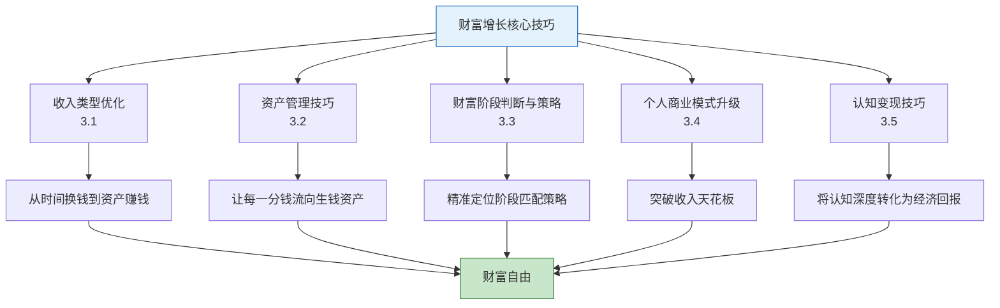
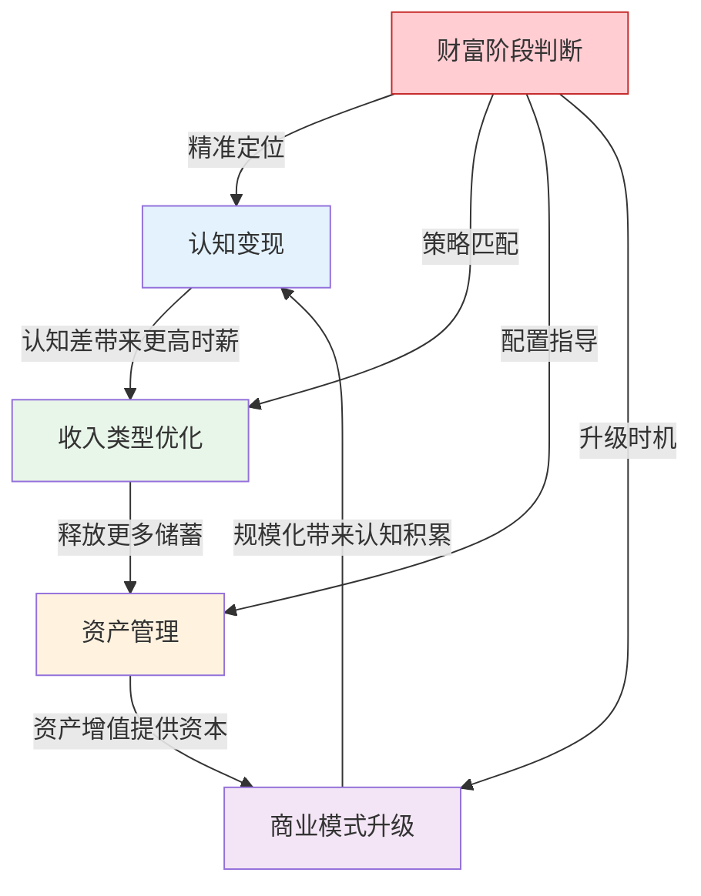
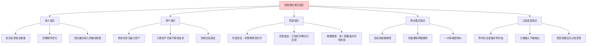
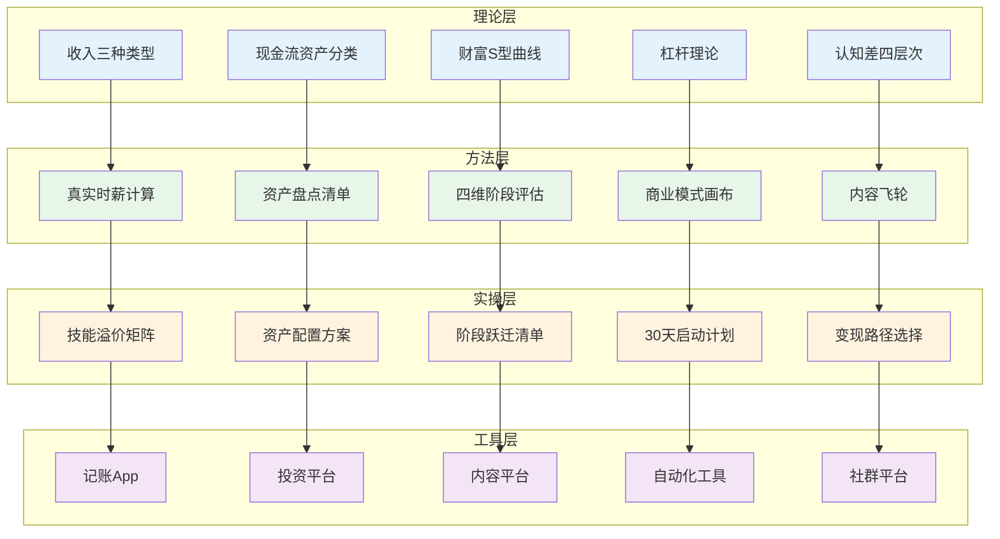

## 本节小结

> **核心技巧全景回顾**：本节围绕财富增长的五个核心维度展开——收入类型优化、资产管理、财富阶段判断与策略、个人商业模式升级、认知变现。这五个维度不是孤立的技能点，而是一个完整的财富增长操作系统。收入优化是"开源"，资产管理是"蓄水"，阶段判断是"导航"，商业模式升级是"引擎"，认知变现是"燃料"。只有五者协同运转，财富增长才能进入正循环。

### 一、五维知识体系总览



这五个维度之间存在明确的逻辑递进关系：

| 维度 | 核心问题 | 解决方案 | 依赖关系 |
|------|----------|----------|----------|
| 收入类型优化 | "我的收入结构健康吗？" | 从主动收入向被动收入迁移 | 一切的起点 |
| 资产管理 | "我的钱在帮我赚钱还是亏钱？" | 提高生钱资产比例 | 依赖收入优化释放的储蓄 |
| 财富阶段判断 | "我在哪个阶段？该用什么策略？" | 四维评估+阶段匹配策略 | 依赖资产盘点数据 |
| 商业模式升级 | "我的收入天花板在哪里？" | 从一对一到一对多、从本地到全球 | 依赖认知和能力积累 |
| 认知变现 | "我的知识如何变成钱？" | 信息差→认知差→执行力→变现 | 依赖深度学习和实践验证 |

---

### 二、各维度核心要点提炼

#### 2.1 收入类型优化（3.1节）

**一句话总结**：真正的收入优化不是"加班"，而是改变收入的底层结构，让时间与收入脱钩。

**三个关键认知**：

1. **收入有三种底层结构**：主动收入（时间换钱）、半被动收入（一次投入多次产出）、被动收入（资产自动产生收益）。优化路径是先稳定地基（主动收入），再建中层（半被动收入），最后搭顶层（被动收入）。

2. **你的真实时薪远低于你以为的数字**。扣除通勤、恢复、隐性成本后，月薪2万的人真实时薪可能只有59元/小时，而非表面的96元/小时。这个数字决定了你应该做什么样的决策——低于你真实时薪的工作都应该外包。

3. **收入优化有三条路径**：提高单价（技能升级、跳槽谈判、资质背书）、增加有效时间（副业开发、效率提升、外包低价值任务）、突破时间上限（产品化服务、知识付费、投资与资产）。

**实操要点**：

- 计算真实时薪，用时间价值决策矩阵指导日常选择
- 遵循70/20/10法则分配精力：70%主业+20%副业+10%投资
- 副业选择核心标准是边际收益递增，从L2技能型起步，逐步进化到L4产品型
- 常见误区：盲目追求副业数量、忽略税务优化、高估被动收入的"被动"程度

#### 2.2 资产管理技巧（3.2节）

**一句话总结**：资产管理不是"管钱"，而是管现金流方向——让每一分钱都流向能产生正现金流的位置。

**三个关键认知**：

1. **用现金流视角分类资产**：生钱资产（持有期间持续产生正现金流）、耗钱资产（持有期间持续产生负现金流）、中性资产（现金流接近零）。同一辆车，私家车是耗钱资产，网约车是生钱资产——资产的属性取决于你如何使用它。

2. **生钱资产比例是衡量财务健康的核心指标**：低于20%是危险区，40-60%是健康区，超过60%是优秀区。你的目标是持续提高这个比例。

3. **资产优化四大策略**：清理耗钱资产（释放被困资金）、转化耗钱为生钱（改变现金流方向）、增加生钱资产（扩大被动收入）、优化资产配置（提升整体效率）。

**实操要点**：

- 用完整资产盘点清单列出所有资产，计算净资产、生钱资产比例和财务自由度
- 应急基金是资产配置的地基：双薪家庭3-6个月，单一收入6-9个月，自由职业9-12个月
- 资产配置随财富阶段调整：积累期偏权益，加速期均衡配置，杠杆期加入另类资产，自由期偏保守
- 再平衡规则：每6个月检查，偏离5%触发，优先用新增资金调整

#### 2.3 财富阶段判断与策略（3.3节）

**一句话总结**：财富增长不是线性的，而是"阶梯式跃迁"——每个阶段的核心矛盾不同，适用的策略截然不同。

**四个财富阶段**：

| 阶段 | 资产范围 | 核心矛盾 | 核心策略 | 关键跃迁条件 |
|------|----------|----------|----------|-------------|
| 积累期 | 0-100万 | 本金太少 | 最大化储蓄率+提升主动收入 | 总资产100万+被动收入开始产生 |
| 加速期 | 100-500万 | 不会让钱高效运转 | 收入多元化+资产配置优化 | 总资产500万+被动收入占比30%+ |
| 杠杆期 | 500-1000万 | 缺乏系统化管理能力 | 合理使用杠杆+建立专业团队 | 总资产1000万+被动收入覆盖开支 |
| 自由期 | 1000万+ | 如何确保一辈子花不完 | 保守配置+财富传承规划 | 投资体系经受过市场周期考验 |

**关键判断工具**：四维评估体系——总资产、被动收入占比、收入结构、投资能力。用6-24分的评分表快速定位自己的阶段。

**阶段跃迁的加速策略**：

- 时间杠杆：收入跳升、技能变现、行业红利、合伙创业、合理杠杆
- 认知杠杆：避免关键错误——积累期的高息借贷消费、加速期的孤注一掷、杠杆期的过度杠杆、自由期的信任错付

#### 2.4 个人商业模式升级（3.4节）

**一句话总结**：大多数人的收入瓶颈不是因为不够努力，而是商业模式本身存在天花板——用时间换钱的模式，一天只有24小时。

**三种商业模式类型**：

1. **纯主动收入模式**：收入=时薪×工作小时数，天花板最低
2. **混合收入模式**：主动收入+被动收入，过渡阶段
3. **被动收入模式**：收入=资产价值×转化率，天花板最高

**三条升级路径**：

| 路径 | 核心思想 | 具体方式 | 杠杆率提升 |
|------|----------|----------|-----------|
| 一对一→一对多 | 把验证过的方法论打包成可复制产品 | 标准化产品、在线课程、写书、开发工具 | 从L0到L3-L5 |
| 本地→全国/全球 | 突破地理限制扩展客户基数 | 内容线上化、服务线上化、产品线上化 | 客户基数指数级增长 |
| 个人→系统 | 从执行者变成系统设计者 | 流程标准化→团队搭建→自动化→资产化 | 收入与个人时间脱钩 |

**飞轮效应**：内容创作→课程产品→投资资产→团队工具→内容创作，每个环节都在为其他环节加速。

**实操要点**：

- 用商业模式画布（九宫格）诊断当前模式
- 评估杠杆等级（L0-L5），找到突破口
- 先做一对一服务验证价值主张，再升级到一对多
- 30天启动计划：诊断→规划→启动→验证

#### 2.5 认知变现技巧（3.5节）

**一句话总结**：认知变现的本质是将个人对世界的理解深度转化为经济回报——认知越深，变现能力越强。

**四个关键概念**：

1. **信息差**："我知道你不知道"——最容易起步，但会随信息扩散而消失。来源包括行业信息差、地域信息差、平台信息差、时间信息差。

2. **认知差**："我们都看到了同样的信息，但我理解得更深、判断得更准"——比信息差更持久，会随积累越来越宽。四个层次：知道→理解→洞察→预判。

3. **执行力**："认知变现的最大敌人不是不懂，而是不做"。用SMART目标拆解、最小可行行动、反馈循环、公开承诺、环境设计来提升。

4. **变现路径**：写作变现（启动难度最低）、课程变现、咨询变现、社群变现、工具/模板变现、IP授权与品牌合作（天花板最高）。

**内容飞轮**：免费内容引流→低价产品筛选→高价产品变现→案例积累→免费内容，形成自循环。

**认知壁垒构建**：数据壁垒（别人没有的行业数据）、经验壁垒（大量真实问题的解决经验）、网络壁垒（专家人脉网络）、品牌壁垒（细分领域的心智占位）。

---

### 三、五维协同：从理论到实践的完整闭环

五个维度不是线性的先后关系，而是相互支撑的协同系统。以下闭环图展示了它们如何协同运作：



**协同运作的实际案例**：

假设你是一名月薪1.5万的程序员，正处于积累期。以下是五维协同的运作方式：

**第一步：认知变现驱动收入优化**

你在工作中深入学习了AI工程（认知差构建），通过在掘金和知乎写技术文章（输出倒逼输入），半年后获得了行业知名度。这直接带来了两个结果：

- 跳槽到AI公司，月薪从1.5万涨到2.5万（收入类型优化：提高单价）
- 开始接AI相关的技术咨询，副业月入5000元（商业模式升级：一对一服务）

**第二步：收入优化释放储蓄投入资产管理**

月收入从1.5万涨到3万（含副业），储蓄率从20%提升到35%，每月可投资资金从3000元增加到1.05万元。

你按照积累期策略配置：
- 应急基金：已存够6个月开支（10万），放在货币基金
- 定投：每月5000元到沪深300指数基金
- 学习仓：每月2000元尝试主动投资
- 副业收入再投资：3500元用于内容创作和工具购买

**第三步：资产管理加速阶段跃迁**

2年后，你的资产结构变为：

| 资产类型 | 金额 | 月净现金流 | 属性 |
|---------|------|-----------|------|
| 货币基金 | 15万 | +300元 | 生钱 |
| 指数基金 | 15万 | +1000元（分红） | 生钱 |
| 技术课程 | — | +8000元/月 | 生钱 |
| 应急基金 | 12万 | +200元 | 生钱 |

总资产42万，被动收入（含课程）约9500元/月，已接近加速期门槛。

**第四步：商业模式升级突破天花板**

你将一对一咨询经验转化为在线课程（一对一→一对多），课程定价299元，月销100份，月收入3万元。同时开始运营技术公众号，建立内容飞轮。

**第五步：财富阶段跃迁**

3年后，总资产突破120万，被动收入占总收入的35%以上，正式进入加速期。你的策略从"攒本金"切换为"让钱高效运转"，开始优化资产配置、拓展海外投资、建立更系统的风险管理框架。

---

### 四、核心方法论速查表

以下表格汇总了本节所有核心方法论，方便快速查阅和应用：

#### 4.1 收入优化速查

| 方法 | 适用场景 | 核心步骤 | 预期效果 |
|------|----------|----------|----------|
| 真实时薪计算 | 评估当前收入效率 | 收入-隐性成本÷（工作+通勤+恢复时间） | 重新认识时间价值 |
| 技能溢价矩阵 | 选择学习方向 | 找到"高稀缺性×高需求"交叉点 | 时薪提升30-100% |
| 跳槽谈判 | 提高单价 | 锚定效应+总包思维+多offer竞争 | 薪资涨幅20-30% |
| 副业评估五维模型 | 选择副业方向 | 时薪潜力+可扩展性+技能复用+启动成本+风险 | 选出边际收益递增的副业 |
| 70/20/10法则 | 分配精力 | 70%主业+20%副业+10%投资 | 收入结构健康化 |

#### 4.2 资产管理速查

| 方法 | 适用场景 | 核心步骤 | 预期效果 |
|------|----------|----------|----------|
| 现金流分类法 | 资产评估 | 计算月净现金流，判定生钱/耗钱/中性 | 识别隐性耗钱资产 |
| 资产盘点清单 | 全面了解财务状况 | 列出所有资产+负债，计算核心指标 | 找到优化空间 |
| 耗钱资产清理 | 释放被困资金 | 按优先级处理闲置物品、高成本负债、低收益投资 | 月现金流增加数百-数千元 |
| 耗钱转生钱 | 改变现金流方向 | 出租闲置房间/车位、技能产品化 | 现金流方向反转 |
| 再平衡规则 | 维持配置效率 | 每6个月检查，偏离5%触发 | 控制风险，锁定收益 |

#### 4.3 财富阶段速查

| 阶段 | 核心矛盾 | 必做事项 | 绝对禁区 |
|------|----------|----------|----------|
| 积累期 | 本金太少 | 储蓄率30%+、定投指数基金、建立应急基金 | 高息借贷消费、追求高收益投资 |
| 加速期 | 钱不会高效运转 | 收入多元化、学习资产配置、建立投资纪律 | 频繁交易、忽视现金流、孤注一掷 |
| 杠杆期 | 缺乏系统化管理 | 合理杠杆（<30%）、建立专业团队、海外配置 | 过度杠杆（>50%）、忽视流动性 |
| 自由期 | 如何确保花不完 | 保守配置、财富传承规划、系统化风控 | 过度保守、生活奢侈化、失去人生目标 |

#### 4.4 商业模式升级速查

| 升级路径 | 核心动作 | 关键节点 | 时间框架 |
|----------|----------|----------|----------|
| 一对一→一对多 | 提炼方法论→标准化→选渠道→测试定价 | 首个付费课程/产品上线 | 3-6个月 |
| 本地→全国/全球 | 内容线上化→服务线上化→产品线上化 | 粉丝/客户突破地域限制 | 6-12个月 |
| 个人→系统 | 流程标准化→团队搭建→自动化→资产化 | 收入与个人时间脱钩 | 12-24个月 |

#### 4.5 认知变现速查

| 路径 | 启动难度 | 收入天花板 | 关键成功因素 |
|------|----------|-----------|-------------|
| 写作变现 | ★☆☆☆☆ | 月入5-50万 | 垂直领域+持续输出+多平台分发 |
| 课程变现 | ★★★☆☆ | 单门课10-500万 | 需求验证+课程设计+销售漏斗 |
| 咨询变现 | ★★★★☆ | 年入50-500万 | 行业经验+标准化流程+口碑积累 |
| 社群变现 | ★★★☆☆ | 年入20-200万 | 内容节奏+互动机制+淘汰机制 |
| 工具/模板变现 | ★★☆☆☆ | 单个模板1-50万 | 实操经验+标准化能力+销售渠道 |
| IP授权 | ★★★★★ | 年入100-1000万+ | 个人品牌+粉丝基础+商业合作能力 |

---

### 五、常见误区与纠正（汇总）

以下是本节五个维度中最常见的误区，按严重程度排序：



**误区纠正速查表**：

| 误区 | 错误认知 | 正确做法 |
|------|----------|----------|
| 盲目追求副业数量 | "副业越多越好" | 集中精力做好1-2个，用"砍刀测试"筛选 |
| 忽略税务优化 | "税的问题以后再说" | 副业注册个体户、投资长期持有、利用税优工具 |
| 高估被动收入 | "被动收入就是躺着赚钱" | 计算从零到月入5000元需要多少小时投入 |
| 把自住房当资产 | "我的房子值300万" | 用现金流视角重新评估，计算机会成本 |
| 阶段高估 | 积累期就使用高杠杆 | 先建立基础，满足过渡条件后再升级策略 |
| 等完全准备好 | "等学够了再输出" | 先发布MVP，在市场反馈中迭代 |
| 信息搬运当变现 | "整理别人的文章就是认知变现" | 输出自己的分析、判断和经验 |

---

### 六、下一步行动建议

根据你当前所处的财富阶段，选择对应的重点行动：

#### 如果你在积累期（0-100万）

**本月必做**：
1. 计算你的真实时薪，用时间价值决策矩阵指导日常选择
2. 完成资产盘点清单，计算生钱资产比例和财务自由度
3. 建立3-6个月应急基金（放在货币基金）
4. 设置每月自动定投指数基金（金额不超过月收入的30%）

**本季度目标**：
- 储蓄率提升到30%以上
- 识别一个有认知差的垂直领域，开始系统学习
- 评估副业方向，用五维模型筛选

#### 如果你在加速期（100-500万）

**本月必做**：
1. 优化资产配置，按均衡型方案调整比例
2. 评估商业模式，找到杠杆率最高的升级路径
3. 开始构建内容飞轮（免费内容→低价产品→高价产品）

**本季度目标**：
- 副业收入达到主业收入的20-30%
- 学习资产配置理论和估值方法
- 建立投资记录和复盘习惯

#### 如果你在杠杆期（500-1000万）

**本月必做**：
1. 评估杠杆使用情况，确保不超过总资产的30%
2. 开始建立专业团队（税务师、律师、投资顾问）
3. 考虑海外资产配置（从QDII基金起步）

**本季度目标**：
- 被动收入占总收入的30%以上
- 完成财富传承规划的初步框架
- 建立系统化的风险管理框架

#### 如果你在自由期（1000万+）

**本月必做**：
1. 调整资产配置为保守型（固收30-40%，权益20-30%）
2. 完善财富传承方案（遗嘱+保险+信托组合）
3. 评估天使投资或慈善捐赠计划

**本季度目标**：
- 被动收入覆盖所有生活开支的120%以上
- 建立完整的风险管理体系（市场、信用、流动性、法律、人身、通胀）
- 保持学习、社交和目标感，避免"存在危机"

---

### 七、本节核心公式与指标

以下是本节涉及的所有核心公式和指标，供快速查阅：

**收入相关**：
```text
真实时薪 = (年税后收入 - 工作相关支出) ÷ (工作时间 + 通勤时间 + 加班时间 + 下班恢复时间)
储蓄率 = (收入 - 支出) ÷ 收入 × 100%
收入多元化比例 = 70%主业 + 20%副业 + 10%投资
```

**资产相关**：
```text
净资产 = 总资产市值 - 总负债余额
生钱资产比例 = 生钱资产总额 ÷ 总资产市值 × 100%
月净现金流 = 月流入 - 月流出（含折旧、维护、机会成本）
财务自由度 = 被动收入 ÷ 月生活支出 × 100%
```

**财富阶段相关**：
```text
阶段评估总分 = 总资产分 + 被动收入占比分 + 收入来源分 + 投资知识分 + 风险管理分 + 财务自由度分
  积累期：6-10分
  加速期：11-15分
  杠杆期：16-20分
  自由期：21-24分
```

**商业模式相关**：
```text
杠杆率等级：L0（无杠杆）→ L5（媒体杠杆）
收入天花板 = 时薪 × 最大工作小时数（纯主动）
收入天花板 = 资产价值 × 转化率（被动收入模式）
```

**健康指标阈值**：

| 指标 | 危险 | 警戒 | 健康 | 优秀 |
|------|------|------|------|------|
| 生钱资产比例 | <20% | 20-40% | 40-60% | >60% |
| 负债/净资产 | >100% | 50-100% | 20-50% | <20% |
| 储蓄率 | <10% | 10-20% | 20-30% | >30% |
| 财务自由度 | <5% | 5-20% | 20-50% | >50% |
| 收入来源数 | 1个 | 2个 | 3个 | 4个以上 |

---

### 八、本节知识体系图谱



---

### 九、关键提醒

1. **不要试图同时优化所有维度**。选择当前阶段最需要突破的1-2个维度集中发力，其他维度保持基础运转即可。

2. **认知是底层驱动力**。无论你处于哪个阶段、用什么策略，认知深度决定了你能走多远。持续学习、输出、实践，是贯穿所有阶段的核心动作。

3. **行动比完美更重要**。不要等到"完全准备好"再开始。先做最小可行行动，在市场反馈中迭代完善。完成比完美重要100倍。

4. **数据驱动决策**。建立月度财务复盘习惯，用数据而非感觉指导决策。每月花30分钟更新资产表、分析收支结构、调整投资配置。

5. **保持耐心和纪律**。财富增长是长期游戏。前5年可能看不到显著变化，但复利效应在第10-15年会显现。坚持定投、坚持学习、坚持输出，时间会给你答案。
