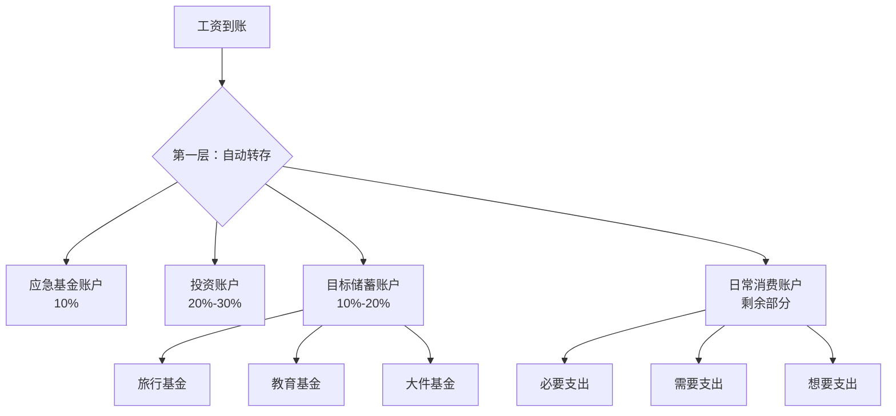
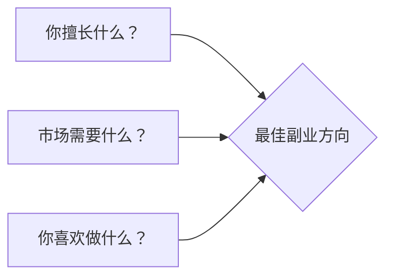
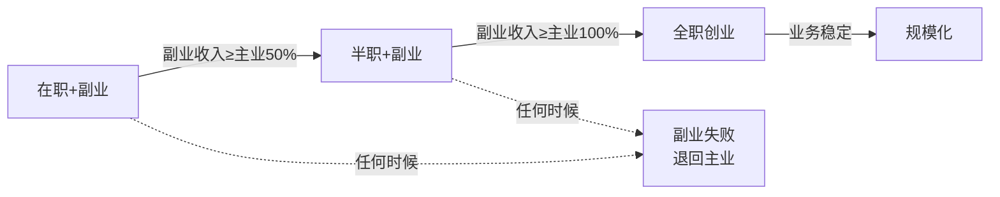
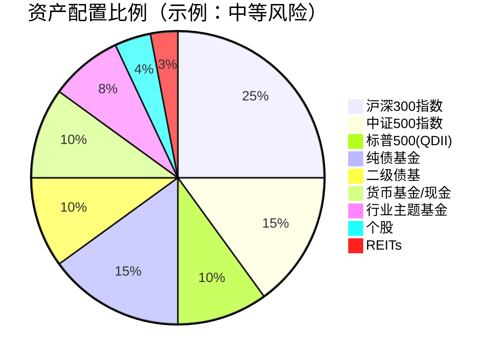
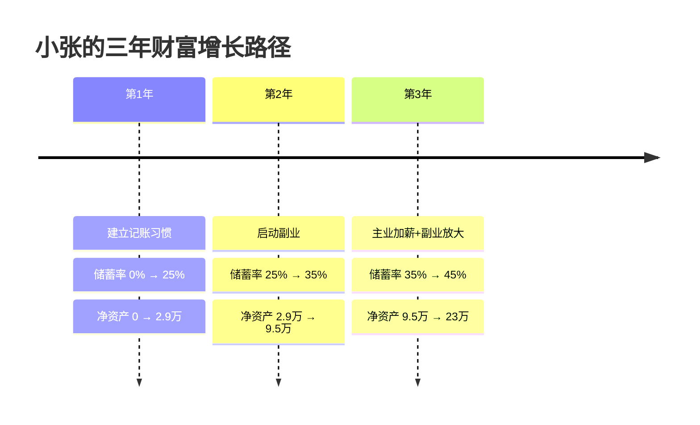

## 四、财富增长的实战策略

前几章我们建立了财富增长的底层认知——复利效应、资产与负债的区分、被动收入的本质。但认知到行动之间隔着一条鸿沟。本章解决的问题是：**具体怎么做？** 我们将从储蓄率优化、收入增长路径、资产配置框架、定期复盘机制四个维度，给出可落地的完整操作指南。

### 4.1 储蓄率优化的七个层次

储蓄率是财富积累的第一发动机。假设投资年化收益率8%，一个储蓄率30%的人和储蓄率50%的人，10年后的净资产差距不是67%，而是可能超过200%——因为更高的储蓄率意味着更大的本金基数在享受复利。

下面的七个层次是递进关系。每一层都是下一层的基础，不要跳过。

#### 4.1.1 第一层：建立记账习惯

**为什么记账是第一层？** 因为没有数据就没有优化空间。大多数人高估自己的储蓄能力，低估自己的消费金额。一项来自英国谢菲尔德大学的研究显示，人们平均低估自己20%-30%的月度支出。

**具体操作：**

1. 选择一款记账工具并坚持使用。推荐方案：

| 工具 | 平台 | 特点 | 适合人群 |
|------|------|------|----------|
| 随手记 | iOS/Android | 中文界面，支持多账户 | 国内用户入门首选 |
| MoneyWiz | iOS/Mac | 多币种，报表功能强大 | 有多账户/多币种需求 |
| YNAB | Web/iOS/Android | 零基预算理念，主动规划 | 愿意投入时间精细管理 |
| 薄荷记账 | iOS/Android | 自动同步银行卡账单 | 懒人记账，不想手动录入 |
| Excel/Notion | 全平台 | 完全自定义 | 喜欢自己掌控数据的人 |

2. 记录至少3个月完整数据。这3个月不要改变消费习惯，目的是获取真实的基线数据。
3. 每天花2-3分钟录入当天支出，不要积压到周末，否则遗忘率超过40%。

**常见误区：** 一开始就追求完美分类，导致记账变成负担。前3个月只需要记录金额和简单备注，分类可以事后整理。

#### 4.1.2 第二层：分析支出结构

有了3个月数据后，将所有支出分为三类：

- **必要支出（Needs）**：维持基本生存和工作的开支——房租/房贷、水电燃气、基本饮食、通勤交通、社保。
- **需要支出（Shoulds）**：提升生活质量但非生存必需——较好的饮食、适度社交、职业培训、健康管理。
- **想要支出（Wants）**：满足欲望但不影响生存和发展的——奢侈品、频繁外出就餐、冲动消费、订阅了但不看的会员。

**分析框架：**

用以下公式计算各项占比：

```text
必要支出占比 = 必要支出总额 / 税后收入 × 100%
需要支出占比 = 需要支出总额 / 税后收入 × 100%
想要支出占比 = 想要支出总额 / 税后收入 × 100%
储蓄率 = 1 - (必要 + 需要 + 想要) / 税后收入
```

**健康比例参考：**

| 支出类型 | 健康范围 | 警戒线 |
|----------|----------|--------|
| 必要支出 | 30%-50% | >60% |
| 需要支出 | 15%-25% | >35% |
| 想要支出 | 5%-15% | >25% |
| 储蓄率 | 20%-50% | <15% |

如果你的必要支出超过60%，说明基本生活成本过高，需要从根本上调整（换房、换城市、改变通勤方式），而不是在想要支出上抠细节。

#### 4.1.3 第三层：削减"想要支出"

这一步见效最快，但容易矫枉过正。目标不是消灭所有享受，而是消除"无意识消费"。

**三步过滤法：**

1. **48小时冷静期**：任何超过200元的非必需消费，加入购物车后等待48小时。如果48小时后仍然想要，再买。实测能减少40%-60%的冲动消费。
2. **单次使用成本计算**：一件2000元的大衣，如果你穿50次，单次成本40元——可以接受。如果你只穿3次，单次成本667元——不值得。公式：`单次使用成本 = 购买价格 / 预计使用次数`。
3. **一进一出规则**：买一件新物品，就必须处理掉一件同类旧物品。这条规则的妙处在于，它迫使你在购买时思考"我要放弃哪件旧东西"，从而触发理性思考。

**实操模板——月度"想要支出"审计表：**

```text
日期 | 项目 | 金额 | 冷静期后还想要？ | 单次成本 | 决策
-----|------|------|-----------------|---------|-----
6/01 | XX耳机 | 899 | 是 | 15元/次(预计60次) | 购买
6/05 | XX游戏皮肤 | 198 | 否 | - | 放弃
6/12 | XX餐厅 | 350 | 是 | 350元/次 | 入口（降低频次）
```

#### 4.1.4 第四层：优化"需要支出"

"需要支出"的优化空间往往比"想要支出"更大，因为金额更高。

**优化策略矩阵：**

| 优化方向 | 具体方法 | 预期节省 |
|----------|----------|----------|
| 餐饮 | 工作日自己做饭，周末外食 | 30%-50% |
| 社交 | 用高质量低成本活动替代（徒步、读书会 vs 酒吧聚餐） | 40%-60% |
| 学习 | 先用免费资源（B站、公开课），确认方向后再付费 | 50%-70% |
| 通讯 | 评估是否真的需要最高档套餐 | 20%-40% |
| 会员订阅 | 每季度审计一次，取消不用的 | 10%-30% |

**订阅服务审计清单：** 列出所有自动续费项目，逐个回答"过去30天我用过几次？"如果答案是0-1次，立即取消。

#### 4.1.5 第五层：优化"必要支出"

必要支出看似不可压缩，实则有大量优化空间。关键在于区分"真正的必要"和"习惯性的必要"。

**住房成本优化：**

住房通常是最大的必要支出（占收入30%-50%）。优化方式按难度递增：

1. **谈判租金**：续租时主动与房东谈判，提供按时付款记录和市场租金数据，通常能争取5%-10%的折扣。
2. **合租分摊**：选择靠谱的合租伙伴，将房租降低30%-50%。注意签订书面协议，明确费用分摊和退租规则。
3. **通勤换租金**：如果工作地点允许，选择地铁沿线但距离市中心稍远的区域，租金差可能达到20%-40%，而通勤时间仅增加20-30分钟。
4. **公积金最大化利用**：确保公积金贷款额度用满，商业贷款部分尽量转为公积金贷款，利差可达1.5%-2%。

**饮食成本优化：**

自己做饭的月均成本约为外卖的40%-60%。具体操作：
- 周末批量采购一周食材，减少临时购买的溢价
- 学会5-8道基础菜式，轮换搭配
- 使用冷冻蔬菜和干货降低损耗
- 早餐和午餐成本控制在15-25元/餐，晚餐20-35元/餐

#### 4.1.6 第六层：自动化储蓄

这一步将储蓄从"意志力驱动"变为"系统驱动"。

**自动化储蓄的三层架构：**



**具体设置步骤：**

1. 开设3个银行账户（或子账户）：日常消费账户、投资账户、应急基金账户。
2. 设置工资到账当天自动转账：税后收入的20%-40%自动转入投资账户和应急基金。
3. 只用日常消费账户的钱进行消费，花完即止。

**心理原理：** 这利用了"默认效应"（Default Effect）——当储蓄成为默认行为而非需要主动决定的行为时，执行率从30%提升到85%以上。

#### 4.1.7 第七层：收入增长驱动储蓄增长

最高层次的储蓄优化不是省钱，而是让收入增长速度超过支出增长速度。

**"逆向生活方式膨胀"策略：**

当收入增长时（加薪、奖金、副业收入），按照以下比例分配新增收入：

```text
新增收入分配：
├── 50% → 储蓄/投资
├── 30% → 生活质量提升
└── 20% → 自我投资（学习、健康）
```

举例：月薪从15000涨到20000，新增5000元中，2500元直接进入投资账户，1500元用于改善生活，1000元用于学习新技能。这样储蓄率从原来的假设30%提升到(6000+2500)/20000 = 42.5%。

**储蓄率阶段性目标：**

| 阶段 | 储蓄率目标 | 典型达成时间 | 关键动作 |
|------|-----------|-------------|----------|
| 入门 | 10%-15% | 第1-3个月 | 开始记账，取消明显浪费 |
| 进阶 | 20%-30% | 第4-12个月 | 优化支出结构，自动化储蓄 |
| 高级 | 30%-50% | 第1-3年 | 收入增长+支出控制双管齐下 |
| 极限 | 50%-70% | 第3年+ | 低欲望生活+高收入 |

### 4.2 收入增长的五条路径

储蓄率有天花板——你不可能把支出压缩到零。但收入没有理论上限。收入增长才是财富积累的主引擎。

#### 4.2.1 路径一：纵向深耕

**原理：** 在单一领域持续积累，形成深度专业壁垒。根据"一万小时定律"的简化版，在一个领域投入3000-5000小时的刻意练习，就能成为该领域的前10%。

**操作步骤：**

1. **识别高价值技能栈**：不是所有技能都值得深耕。评估标准：
   - 市场需求量（是否有大量企业愿意为这项技能付费？）
   - 可替代性（培养一个同等水平的人需要多长时间？）
   - 复利性（这项技能是否会随着经验积累越来越值钱？）

2. **制定3年深耕计划**：
   - 第1年：掌握核心技能，达到行业中位水平
   - 第2年：在细分方向上建立差异化优势
   - 第3年：形成个人品牌，开始获得溢价

3. **打造可验证的能力证明**：
   - 技术岗：GitHub贡献、技术博客、开源项目
   - 业务岗：业绩数据、案例积累、行业认证
   - 管理岗：团队成果、项目交付记录

**适合人群：** 技术型、专业型岗位从业者，如程序员、会计师、律师、医生、工程师。

**薪资增长预期：** 纵向深耕3-5年后，薪资通常是同龄平均水平的1.5-3倍。

#### 4.2.2 路径二：横向拓展

**原理：** 成为"T型人才"（一个深度专长+多个浅层技能）或"π型人才"（两个深度专长+多个浅层技能）。在知识交叉点上，竞争者最少，价值最高。

**操作步骤：**

1. **识别互补技能**：你的主业技能和哪些技能组合后会产生1+1>2的效果？
   - 程序员 + 产品思维 = 技术型产品经理（薪资溢价30%-50%）
   - 设计师 + 前端开发 = 全链路设计师（薪资溢价20%-40%）
   - 销售 + 数据分析 = 增长型销售（薪资溢价25%-45%）
   - 财务 + 编程 = 量化分析师（薪资溢价50%-100%）

2. **最小可行学习**：不要从零开始系统学习，而是针对具体问题学习具体技能。用"项目驱动学习"代替"课程驱动学习"。

3. **创造组合价值**：找到一个需要两种技能的真实项目，用项目来整合和验证你的能力。

**适合人群：** 管理型、复合型岗位从业者，以及想转型的人。

#### 4.2.3 路径三：战略性跳槽

**原理：** 内部加薪通常每年5%-10%，而跳槽加薪通常20%-50%。在职业早期（前5-8年），跳槽是实现薪资跳跃最有效的方式。

**操作步骤：**

1. **定期评估市场价值**：每半年在招聘网站查看同类岗位薪资范围，与猎头保持联系，了解市场行情。
2. **建立跳槽决策矩阵**：

| 评估维度 | 权重 | 当前公司评分(1-10) | 新公司评分(1-10) |
|----------|------|-------------------|-----------------|
| 薪资涨幅 | 25% | - | - |
| 成长空间 | 25% | - | - |
| 团队/文化 | 20% | - | - |
| 行业前景 | 15% | - | - |
| 工作生活平衡 | 15% | - | - |

3. **跳槽时机判断**：在当前公司学不到新东西、薪资明显低于市场、晋升通道被堵死时，就是跳槽的信号。
4. **不要裸跳**：在职状态下找工作，谈判筹码更大。

**注意事项：**
- 每段工作经历至少2年，否则简历上会显得不稳定
- 跳槽原因要说"追求更大的发展空间"，而不是"钱多"
- 跳槽前确认新公司的实际工作环境（找内部人了解、看脉脉评价）

#### 4.2.4 路径四：副业创收

**原理：** 副业不仅是额外收入来源，更是测试新方向、建立第二曲线的低成本方式。

**副业选择的三环模型：**



三个环的交集就是最佳副业方向。只有擅长但不喜欢的，会变成煎熬；只有喜欢但没市场的，会变成烧钱。

**低启动成本的副业类型：**

| 类型 | 启动成本 | 时间投入 | 收入天花板 | 举例 |
|------|----------|----------|-----------|------|
| 技能变现 | 极低 | 灵活 | 中等 | 自由设计、翻译、编程外包 |
| 内容创作 | 极低 | 高 | 高 | 自媒体、课程、电子书 |
| 知识付费 | 低 | 中 | 高 | 咨询、社群、训练营 |
| 电商/代购 | 中 | 高 | 中高 | 选品、代发、直播带货 |
| 投资理财 | 中高 | 低 | 高 | 量化策略、房产投资 |

**副业启动SOP：**

1. 选定一个方向（不超过2周决定，不要陷入分析瘫痪）
2. 用最小成本验证需求（发一条内容、接一个订单、做一个原型）
3. 设定3个月试错期，每月复盘数据
4. 3个月后数据达标（收入>时间成本的50%），加大投入
5. 3个月后数据不达标，果断换方向

**红线：** 副业收入不要影响主业表现。副业占用的时间控制在每周10-15小时以内。如果副业导致主业出问题，立即暂停。

#### 4.2.5 路径五：创业突破

**原理：** 创业是收入上限最高的路径，但也是风险最高的路径。不建议没有积累就创业。

**创业前的准备清单：**

- [ ] 至少有6个月的生活费作为安全垫（创业不拿工资的底线）
- [ ] 在目标行业有至少2年的从业经验
- [ ] 已经通过副业验证了商业模式
- [ ] 有明确的前3个客户或用户来源
- [ ] 家庭成员理解并支持

**从副业到创业的过渡路径：**



**关键原则：** 不要一步到位辞职创业。最安全的路径是"在职验证→副业放大→半职过渡→全职创业"。每一步都有明确的收入门槛作为决策依据。

### 4.3 资产配置的实操框架

有了储蓄和收入增长，下一步是让钱为你工作。资产配置是投资中最重要的决策——研究表明，投资收益的90%以上由资产配置决定，而非选股或择时。

#### 4.3.1 核心-卫星配置法

这个框架将资产分为"核心"和"卫星"两部分。核心资产追求稳健，卫星资产追求超额收益。



**详细配置说明：**

| 资产类别 | 配置比例 | 作用 | 推荐标的 |
|----------|----------|------|----------|
| 沪深300指数 | 15%-25% | 跟踪A股大盘，获取市场平均收益 | 天弘沪深300、易方达沪深300ETF联接 |
| 中证500指数 | 10%-15% | 跟踪A股中盘，成长性更强 | 南方中证500ETF联接 |
| 标普500(QDII) | 5%-10% | 海外配置，分散单一市场风险 | 博时标普500ETF联接、易方达标普500 |
| 纯债基金 | 10%-15% | 稳定收益，降低组合波动 | 易方达纯债、招商产业债 |
| 二级债基 | 5%-10% | 债券为主+少量股票增强 | 易方达增强回报、工银双利 |
| 货币基金/现金 | 5%-15% | 流动性储备，等待机会 | 余额宝、零钱通、银行T+0理财 |
| 行业主题基金 | 5%-15% | 押注特定行业趋势 | 根据研究选择，不宜超过15% |
| 个股 | 5%-10% | 精选个股追求超额收益 | 仅限有研究能力的投资者 |
| REITs | 3%-5% | 不动产投资，稳定分红 | 中金普洛斯REIT、华安张江光大REIT |

#### 4.3.2 不同风险偏好的配置方案

**保守型（风险承受力低，追求稳定）：**

```text
债券类 50%（纯债30% + 二级债基20%）
股票指数 30%（沪深300 20% + 标普500 10%）
现金类 20%
```

**平衡型（中等风险，追求长期增长）：**

```text
股票指数 50%（沪深300 25% + 中证500 15% + 标普500 10%）
债券类 30%（纯债15% + 二级债基15%）
卫星资产 10%（行业基金 + REITs）
现金类 10%
```

**进取型（高风险承受力，追求高增长）：**

```text
股票指数 60%（沪深300 25% + 中证500 20% + 标普500 15%）
卫星资产 25%（行业基金15% + 个股10%）
债券类 10%
现金类 5%
```

#### 4.3.3 再平衡的规则与实操

再平衡是资产配置中最容易被忽略但极其重要的环节。它本质上是一种"强制低买高卖"的纪律。

**再平衡规则：**

1. **定期再平衡**：每半年（6月和12月）检查一次资产比例。
2. **阈值再平衡**：任何一类资产偏离目标比例超过5个百分点时触发。例如目标25%的沪深300涨到了32%，就卖出7%的部分，买入其他低于目标的资产。
3. **现金流再平衡**：每月新增投资时，优先买入当前低于目标比例的资产，而不是追涨。

**再平衡的实操步骤：**

1. 打开投资账户，记录当前各类资产的实际市值
2. 计算各类资产占总资产的百分比
3. 与目标比例对比，标记偏离超过5%的类别
4. 卖出超配的部分，买入低配的部分
5. 记录调整日期和操作，作为下次参考

**注意：** 再平衡会产生交易成本（申购赎回费），因此不要过于频繁。一般半年一次足够，除非市场出现极端波动（如单月跌幅超过15%）。

#### 4.3.4 定投策略

对于大多数工薪族，定投是最适合的投资方式。它消除了择时的焦虑，利用"微笑曲线"效应在市场低迷时买入更多份额。

**智能定投策略：**

| 市场估值水平 | 沪深300市盈率 | 定投金额调整 |
|-------------|-------------|-------------|
| 极度低估 | <11倍 | 定投金额 × 2.0 |
| 低估 | 11-13倍 | 定投金额 × 1.5 |
| 正常 | 13-15倍 | 定投金额 × 1.0 |
| 高估 | 15-18倍 | 定投金额 × 0.5 |
| 极度高估 | >18倍 | 暂停定投，开始分批卖出 |

市盈率数据可在"理杏仁"或"且慢"等平台免费查询。

### 4.4 财富增长的检查清单

再好的策略，不执行等于零。再好的执行，不复盘就会跑偏。建立定期复盘机制是将策略转化为结果的最后一环。

#### 4.4.1 月度检查（每月最后一个周末，30分钟）

- [ ] 本月储蓄率是否达标？计算公式：`(收入-支出)/收入`
- [ ] 本月有哪些非计划支出？原因是什么？
- [ ] 本月投资账户的收益情况如何？（不要纠结短期涨跌，只记录数据）
- [ ] 下月是否有已知的大额支出（保险费、年度会员等）？预算是否已安排？
- [ ] 所有订阅服务是否仍在使用？

**月度检查模板：**

```text
=== YYYY年MM月 财务月报 ===
收入：税后 ¥________
支出：¥________（必要___% / 需要___% / 想要___%）
储蓄率：________%
投资组合总值：¥________（较上月 +/-________%）
净资产：¥________（较上月 +/-________%）
本月最大非计划支出：________
下月待处理：________
```

#### 4.4.2 季度检查（每季度末，1-2小时）

- [ ] 资产配置是否需要再平衡？（检查偏离度）
- [ ] 投资组合过去3个月表现如何？与基准指数对比是否合理？
- [ ] 主业收入是否有增长机会？（加薪窗口、晋升机会、新项目）
- [ ] 副业进展如何？是否需要调整方向？
- [ ] 应急基金是否充足？（目标：3-6个月必要支出）
- [ ] 保险保障是否充足？（重疾险、医疗险、意外险）

#### 4.4.3 年度检查（每年1月，半天时间）

- [ ] 过去一年净资产增长了多少？增长率是多少？
- [ ] 被动收入（利息、分红、租金）占总收入的比例是多少？
- [ ] 投资年化收益率是多少？与通胀率和市场基准相比如何？
- [ ] 投资能力是否有实质提升？（读了几本投资书？做了多少次复盘？）
- [ ] 明年的财务目标是什么？（净资产目标、储蓄率目标、收入目标）
- [ ] 当前所处的财富阶段是否需要调整？

**年度复盘的四个关键指标：**

| 指标 | 计算方式 | 健康标准 |
|------|----------|----------|
| 净资产增长率 | (年末净资产-年初净资产)/年初净资产 | >15% |
| 储蓄率 | 年度总储蓄/年度总收入 | >25% |
| 被动收入占比 | 被动收入/总收入 | 持续上升 |
| 投资收益率 | 投资收益/投资本金 | >通胀+3% |

#### 4.4.4 常见执行误区与纠正

| 误区 | 表现 | 纠正方法 |
|------|------|----------|
| 过度记账 | 每笔1元支出都记录，记账成为负担 | 设定最小记录金额（如50元以下归类为"零花"） |
| 频繁查看收益 | 每天看多次账户，因短期波动焦虑 | 设定查看频率：定投看月度，长投看季度 |
| 追涨杀跌 | 市场涨时加仓，跌时恐慌卖出 | 严格执行定投计划，不受情绪影响 |
| 忽略通胀 | 只看账户数字增长，不考虑购买力 | 用"实际收益率=名义收益率-通胀率"评估 |
| 过度优化 | 在小额支出上花大量时间优化 | 把精力放在大额支出和收入增长上 |
| 缺乏应急基金 | 所有钱都投入市场 | 保持3-6个月支出的现金储备 |

### 4.5 实战案例：从零开始的三年财富增长路径

**背景：** 小张，25岁，一线城市，月薪12000元（税后），无房无车，零存款。

**第一年：建立基础**

| 月份 | 行动 | 预期结果 |
|------|------|----------|
| 1-3月 | 开始记账，建立基线数据 | 了解月均支出约9000元 |
| 4月 | 分析支出结构，识别浪费 | 发现每月约1500元"想要支出"可优化 |
| 5-6月 | 削减浪费，设置自动转存 | 月储蓄率从0%提升到20%（2400元/月） |
| 7-9月 | 开始定投沪深300+中证500 | 积累7200元投资本金 |
| 10-12月 | 学习基金基础知识 | 理解资产配置概念，建立平衡组合 |

第一年末：净资产约28800元，储蓄率25%。

**第二年：加速积累**

| 月份 | 行动 | 预期结果 |
|------|------|----------|
| 1-3月 | 启动副业（用主业技能接外包） | 月均额外收入2000-3000元 |
| 4-6月 | 投资收益再投入+薪资小涨 | 月薪涨到14000元，月储蓄提升到5000元 |
| 7-9月 | 优化资产配置，加入债券基金 | 组合更均衡，波动降低 |
| 10-12月 | 副业收入稳定，考虑加大投入 | 副业月均3000元 |

第二年末：净资产约95000元（含投资收益），储蓄率35%。

**第三年：形成飞轮**

| 月份 | 行动 | 预期结果 |
|------|------|----------|
| 1-6月 | 主业争取加薪/跳槽 | 月薪达到18000-20000元 |
| 7-12月 | 副业收入持续增长 | 副业月均5000元 |
| 全年 | 严格执行资产配置和再平衡 | 年化收益约8%-10% |

第三年末：净资产约22-25万元，储蓄率45%，被动收入开始产生（年投资收益约1-2万元）。

**三年关键里程碑：**



这个案例的关键不是具体数字，而是展示了**正确的顺序**：先建立习惯 → 再优化支出 → 然后增加收入 → 同时让投资自动运转。每一步都是下一步的基础。

### 4.6 总结：财富增长的行动优先级

如果读完本章只能记住一件事，记住这个优先级排序：

```text
最重要的 → 最不重要的

收入增长 > 储蓄率优化 > 资产配置 > 选股择时
```

大多数人把精力花在"选股择时"上，但真正决定财富积累速度的是前三项。一个储蓄率50%、投资于宽基指数的人，10年后的财富一定超过一个储蓄率10%、天天研究个股的人。

**立即可以做的三件事：**

1. 今天就下载一个记账App，记录今天的每一笔支出
2. 设置工资到账自动转存（哪怕只转10%）
3. 列出所有自动续费的订阅服务，取消不用的

不需要等到"准备好了"才开始。财富增长的复利效应，每一天的延迟都是成本。
