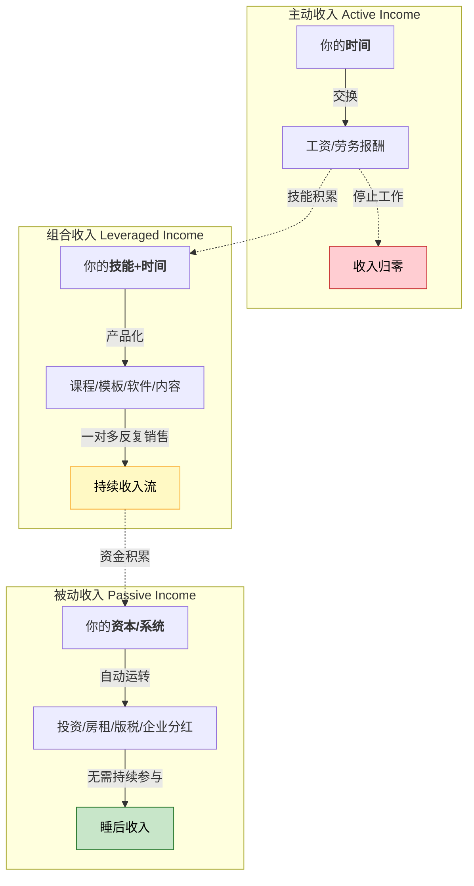
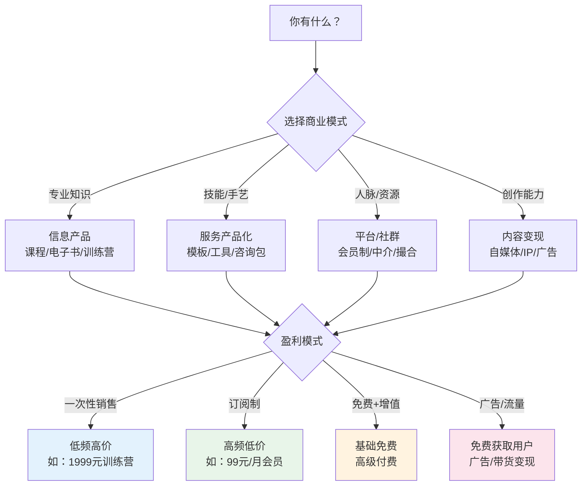
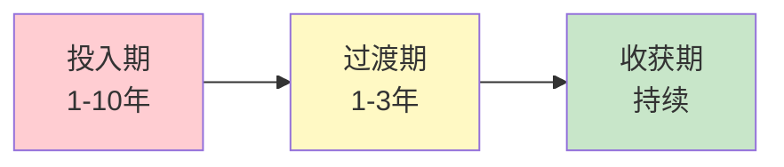
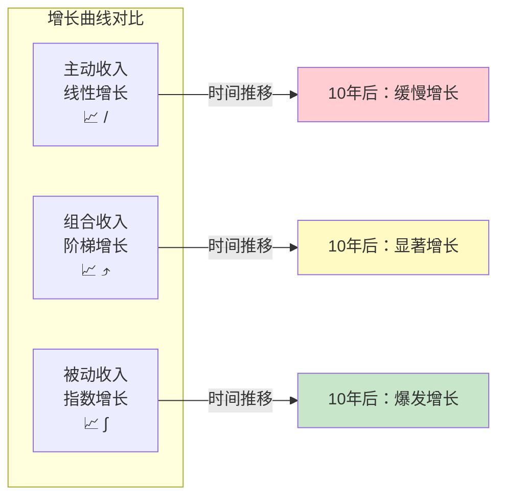
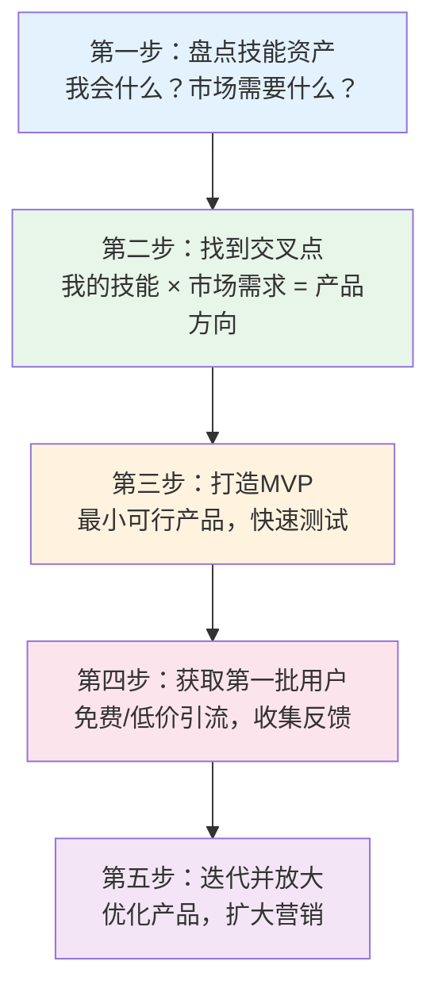
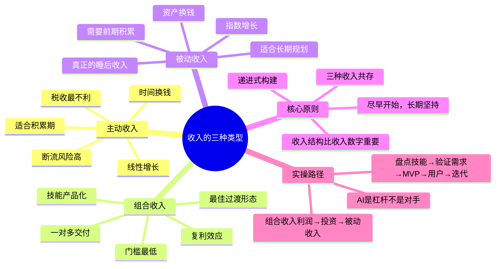

## 2.1 收入的三种类型

大多数人一辈子都在"赚钱"，却从未停下来想过一个根本问题：**我的收入从哪里来、怎么来的？** 这个问题的答案，决定了你是永远在跑步机上奔跑，还是逐步建立一台自动运转的财富机器。

理解收入类型，不是学术分类游戏，而是构建财富系统的**第一块基石**。你对收入结构的认知深度，直接决定了后续所有财务决策的质量——包括你如何分配时间、如何选择职业方向、如何配置资产、如何规划退休。

### 2.1.1 理论框架：从 ESBI 象限到三种收入

#### 罗伯特·清崎的 ESBI 象限

《富爸爸穷爸爸》的作者罗伯特·清崎在1997年提出了收入来源的四象限模型（ESBI Quadrant）。这个模型将所有人的收入来源归纳为四个位置，每个位置代表一种根本不同的赚钱方式和思维模式：

```mermaid
graph LR
    subgraph 左侧：主动收入
        E["E 象限<br/>Employee<br/>雇员"] 
        S["S 象限<br/>Self-employed<br/>自雇者"]
    end
    subgraph 右侧：非主动收入
        B["B 象限<br/>Business owner<br/>企业主"]
        I["I 象限<br/>Investor<br/>投资者"]
    end
    
    E -->|升级| S
    S -->|升级| B
    B -->|升级| I
    
    style E fill:#ffcdd2
    style S fill:#ffe0b2
    style B fill:#c8e6c9
    style I fill:#bbdefb
```

| 象限 | 收入方式 | 核心特征 | 典型人群 | 占比（估算） |
|------|---------|---------|---------|------------|
| **E（雇员）** | 出卖时间给雇主 | 收入稳定但有天花板，停止工作即停止收入 | 上班族、公务员、企业员工 | 约70% |
| **S（自雇）** | 自己卖自己的时间和技能 | 收入弹性大但仍绑定个人时间 | 自由职业者、个体户、小型工作室 | 约15% |
| **B（企业主）** | 建立系统让别人为你工作 | 收入与个人时间脱钩，系统自动运转 | 企业创始人、品牌持有者、连锁经营者 | 约10% |
| **I（投资者）** | 让钱为你工作 | 用资本获取回报，真正的"睡后收入" | 投资人、房东、股东 | 约5% |

E 和 S 象限的人本质上都在用**时间换钱**——区别只是为别人干还是为自己干。B 和 I 象限的人则跳出了时间换钱的循环——他们分别用**系统**和**资本**产生收入。

清崎的核心论点不是说某个象限"更好"，而是指出**每个象限需要完全不同的财商技能和思维模式**。E象限的人追求安全感和稳定；S象限的人追求独立和控制权；B象限的人追求系统化和规模化；I象限的人追求资本效率和复利。大多数人终其一生停留在左侧（E+S），不是因为没有能力，而是因为缺乏跨象限的知识和勇气。

#### 补充理论：收入分类的多元视角

ESBI 象限并非唯一的收入分类框架。理解其他理论有助于更全面地看待收入问题：

**亚当·斯密的生产要素理论：** 经济学之父亚当·斯密在《国富论》（1776年）中提出，国民收入由三种生产要素产生：劳动获得工资、资本获得利润、土地获得地租。这与我们讨论的主动收入（劳动工资）、组合收入（技能利润）、被动收入（资本/资产回报）高度吻合。后来的经济学家又加入了第四种要素——企业家才能获得超额利润，对应ESBI中的B象限。

**现金流象限与资产配置理论：** 诺贝尔经济学奖得主弗兰科·莫迪利安尼的生命周期假说（Life-Cycle Hypothesis）指出，人的收入和消费应在一个生命周期内平滑配置。年轻时收入低于消费潜力（应投资自己），中年时收入高于消费（应积累资产），老年时靠资产收入维持消费。这个理论从宏观层面证实了"从主动收入向被动收入过渡"的必要性。

**塔勒布的反脆弱收入观：** 纳西姆·塔勒布在《反脆弱》中提出了一个重要视角——不是看收入多少，而是看收入的**脆弱性**。工资收入是脆弱的（一裁员就没了），创业收入可能是反脆弱的（危机中反而获得机会），投资收入则取决于策略（分散投资是反脆弱的，集中持仓是脆弱的）。这个视角补充了ESBI模型忽略的维度：**同一象限内的收入，脆弱性可以完全不同。**

#### 三种收入类型的核心映射

将 ESBI 象限简化，结合经济学和反脆弱理论，我们得到三种收入类型的核心模型：



> **关键洞察：** 这三种收入不是互相替代的关系，而是**递进升级**的关系。你不需要放弃主动收入去追求被动收入，而是在保持主动收入的同时，逐步增加组合收入和被动收入的占比。根据托马斯·科里在《富有的习惯》中对233位百万富翁的5年跟踪研究，百万富翁平均拥有3.5个收入来源，其中65%的人在实现财务自由前就已经开始构建多元收入。更关键的数据是：他们收入来源的多元化**不是在有钱之后才开始的**，而是在积累期就同步启动。

### 2.1.2 主动收入：用时间换钱

#### 本质定义

**主动收入**是最基本、最普遍的收入形式：你付出单位时间的劳动，获得对应的报酬。它的核心公式极为简洁：

```text
主动收入 = 时间单价 × 工作时间
```

这个公式同时揭示了主动收入的**两大天花板**：

1. **时间天花板**：一天24小时，扣除睡眠（7-8小时）、通勤（1-2小时）、吃饭和生活必需（2-3小时），有效工作时间不超过10-12小时。假设你全年无休地工作12小时/天，年工作时间上限约4380小时——这已经是极限值，现实中不可持续。
2. **时间单价天花板**：根据国家统计局数据，2023年全国城镇非私营单位就业人员年平均工资为120,698元（月均约10,058元）。即使在一线城市，月薪超过5万的人群占比不到5%。时间单价的提升存在明显的边际递减——从月薪5000到15000可能只需2-3年，从15000到50000可能需要5-8年，从50000到150000则往往需要质变（转管理、转行业、创业）。

#### 六个核心特征

| 特征 | 说明 | 影响 | 应对思路 |
|------|------|------|---------|
| **即时性** | 干一天活拿一天钱，现金流即时产生 | 短期安全感强，但形成长期依赖 | 利用即时现金流建立应急基金 |
| **线性增长** | 收入与时间投入成正比，1:1对应 | 无法实现指数增长，增长曲线是直线而非S型 | 在线性增长的同时启动非线性收入 |
| **可替代性** | 大多数岗位可以被同等能力的人替代 | 个人议价权有限，除非拥有稀缺技能 | 构建不可替代的复合能力 |
| **断流风险** | 失业、生病、任何原因停止工作 → 收入归零 | 抗风险能力极弱，一次意外可能打断所有计划 | 建立6个月应急基金 + 第二收入来源 |
| **税收刚性** | 工资薪金按累进税率征税，无法合法规避 | 实际到手收入低于名义收入，高收入者尤其明显 | 了解税务优化空间（见下文详解） |
| **身份绑定** | 收入与"你这个人"强绑定，无法转让、继承 | 没有资产积累，人走了收入就没了 | 将部分主动收入转化为资产 |

#### 主动收入的行业与城市差异

不同行业和城市的主动收入差异巨大，这直接影响你的收入天花板和转型策略：

**一线城市的高薪行业（月薪中位数）：**

| 行业 | 初级（0-3年） | 中级（3-8年） | 高级（8年+） | 天花板 |
|------|-------------|-------------|-------------|-------|
| 互联网/软件开发 | 12,000-20,000 | 25,000-45,000 | 50,000-100,000 | 技术专家/架构师可达15万+ |
| 金融/投行 | 15,000-25,000 | 30,000-60,000 | 80,000-200,000 | MD级别年薪百万+ |
| 医疗（三甲主治+） | 10,000-20,000 | 25,000-50,000 | 50,000-100,000 | 顶级专家含飞刀等可达20万+ |
| 法律（红圈所） | 15,000-30,000 | 40,000-80,000 | 100,000-300,000 | 合伙人年收入百万-千万 |
| 教师/公务员 | 8,000-15,000 | 12,000-20,000 | 15,000-25,000 | 稳定但天花板明显 |

**关键观察：** 即使在最高薪的行业，主动收入的天花板通常在年薪100-300万之间（极少数顶尖人才可突破）。而这个天花板的到达往往需要10-15年的持续投入。更重要的是，一旦离开岗位，收入立刻归零——这就是主动收入的"身份绑定"本质。

**二三线城市的现实：** 大多数二三线城市的中位数月薪在5000-8000元，这意味着如果你只靠主动收入，在二三线城市实现财务自由的难度更大，但生活成本也更低。关键不在于绝对数字，而在于**储蓄率**——月薪8000存3000（37.5%储蓄率）比月薪20000存3000（15%储蓄率）的财务健康度更高。

#### 主动收入的税收深度分析

很多人忽略了一个关键事实：**不同收入类型承受的税负完全不同**。在中国现行税制下，工资薪金是最不利的征税方式。

**中国个人所得税综合所得税率表（2024年）：**

| 级数 | 全年应纳税所得额 | 税率 | 速算扣除数 |
|------|----------------|------|----------|
| 1 | 不超过36,000元 | 3% | 0 |
| 2 | 36,000-144,000元 | 10% | 2,520 |
| 3 | 144,000-300,000元 | 20% | 16,920 |
| 4 | 300,000-420,000元 | 25% | 31,920 |
| 5 | 420,000-660,000元 | 30% | 52,920 |
| 6 | 660,000-960,000元 | 35% | 85,920 |
| 7 | 超过960,000元 | 45% | 181,920 |

**实际税负计算案例：**

假设你在上海月薪3万，五险一金个人缴纳约5,100元（养老8%+医疗2%+失业0.5%+公积金7%=17.5%），专项附加扣除假设为3,000元（租房1,500+赡养老人1,500）：

```text
月应纳税所得额 = 30,000 - 5,100 - 5,000（起征点） - 3,000 = 16,900元
年应纳税所得额 = 16,900 × 12 = 202,800元
适用税率：20%，速算扣除数：16,920元
年个税 = 202,800 × 20% - 16,920 = 23,640元
实际税率 = 23,640 ÷ 360,000 = 6.57%
```

而如果同样的36万收入是**经营所得**（个体工商户），扣除成本费用后应纳税所得额可能降至15万左右，适用10%税率，速算扣除1,500元，年缴税仅13,500元，实际税率3.75%。

**合法的税务优化思路（仅供参考，具体操作请咨询专业税务师）：**

1. **充分利用专项附加扣除**：子女教育（每个子女每月1,000元）、继续教育（每月400元或3,600元/年）、大病医疗（最高80,000元/年）、住房贷款利息（每月1,000元）或住房租金（每月800-1,500元）、赡养老人（每月最高3,000元）、3岁以下婴幼儿照护（每个婴幼儿每月2,000元）。很多人没有填满所有扣除项，白白多缴税。
2. **年终奖计税方式选择**：2024年起年终奖可以选择单独计税或并入综合所得。对于年收入较高的人，并入综合所得可能导致跳档，单独计税可能更优。需要两种方式都算一遍，选税负低的。
3. **公积金比例最大化**：在政策允许范围内（5%-12%），选择最高的公积金缴纳比例。公积金是税前扣除的，且个人缴纳部分完全归个人所有——相当于"强制储蓄+免税"。
4. **企业年金/职业年金**：如果你的单位提供企业年金，个人缴费部分在4%以内可以税前扣除。

> **重要提示：** 以上仅为合法合规的税务知识普及。任何涉及虚开发票、阴阳合同、虚假扣除的行为都是违法的，后果严重。税务优化的边界是"在法律允许的范围内选择最优方案"，而不是"想办法少缴税"。

#### 案例：一个程序员的"时间单价"困境

小明，28岁，某互联网公司后端开发工程师，月薪2万。让我们算一笔详细的账：

**时间单价计算：**
```text
月薪：20,000元
每月工作日：22天
每天有效工作时间：8小时（名义上）→ 9.5小时（含加班，实际）
每月总工作时间：22 × 9.5 = 209小时

名义时间单价：20,000 ÷ 176 = 113.6元/小时
实际时间单价：20,000 ÷ 209 = 95.7元/小时
```

如果把通勤时间（每天1.5小时）也算进去，实际时间单价降至：

```text
含通勤总时间：22 × 11 = 242小时
含通勤时间单价：20,000 ÷ 242 = 82.6元/小时
```

**如果他想月入4万，只有两条路：**

| 路径 | 方法 | 可行性分析 | 时间成本 |
|------|------|-----------|---------|
| **增加时间投入** | 每天工作16小时 | 不现实。身体会垮，且边际效率急剧下降。连续3个月高强度加班后，产出效率可能只有正常水平的60% | 牺牲健康和生活，不可持续 |
| **提高时间单价** | 提升技能、跳槽、晋升 | 可行但有上限。从2万到4万需要3-5年，从4万到8万则可能需要5-10年甚至无法实现 | 3-10年 |

**更深层的问题：** 即使小明通过跳槽把月薪提到4万，他的时间单价变成了191元/小时——但这仍然是线性增长。他没有跳出"用时间换钱"的循环。一旦他停止工作（生病、裁员、行业衰退），4万月薪立刻归零。

**小明的隐藏成本清单（很多人忽略的）：**

```text
显性成本：加班导致的外卖增加（每月多花800-1500元）
隐性成本1：久坐导致的健康问题（颈椎、腰椎、体重增加）
隐性成本2：没有时间社交和恋爱，社交圈缩小
隐性成本3：没有时间学习工作之外的技能，能力圈固化
隐性成本4：心理压力导致的消费补偿（报复性消费、冲动购物）
隐性成本5：35岁危机——互联网行业对35岁以上的程序员存在隐性歧视
```

> **主动收入的最大陷阱：** 它给了你一种"我在赚钱"的错觉，但实际上你是在用生命中最不可再生的资源——时间——去交换可再生的金钱。你的时间在不断消耗，而你的收入却没有积累效应。更危险的是，随着年龄增长，你的时间单价增长会减速甚至停滞，而你的生活开支却在持续增长（结婚、生子、养老、医疗）——这个剪刀差最终会吞噬你的财务安全感。

#### 哪些人的主动收入值得长期坚持？

并非所有主动收入都是"低效"的。以下情况的主动收入具有较高价值：

1. **时间单价极高**（如顶尖外科医生、资深律师、顶级咨询顾问，时薪可达数千元甚至更高）。这类主动收入的"效率"已经足够高，足以在合理的工作时间内积累可观的财富。
2. **技能具有强网络效应**（如顶级程序员参与开源项目，工作本身在构建个人品牌和行业影响力）。此时主动收入不仅是收入，还是"投资"——你在用当前的时间换取未来的品牌溢价。
3. **能带来稀缺资源和人脉**（如投行分析师、战略咨询师，工作环境本身就是资源积累）。麦肯锡的分析师每天接触的是世界500强的CEO和董事会，这种人脉资源的价值远超工资本身。
4. **处于快速成长期**（如刚入行的年轻人，当前的主动收入是对未来能力的投资）。前3-5年的主动收入本质上是"带薪学习"，关键不在于赚多少，而在于能力增长的速度。
5. **具有高度自主权**（如大学教授、资深研究员，可以选择研究方向和工作节奏）。当主动收入不再受制于"996"和"领导安排"，它的质量就大幅提升。

如果你的主动收入符合以上任一条件，那么短期内维持甚至加大主动收入的投入是合理的。但即便如此，也应该同步开始规划组合收入和被动收入——因为上述所有条件都有时效性，没有人能永远保持高时间单价或稀缺地位。

### 2.1.3 组合收入：用技能和资源换钱

#### 本质定义

**组合收入**（也称杠杆收入、产品化收入）是介于主动收入和被动收入之间的关键过渡形态。它的核心逻辑是：

```text
前期投入（时间 + 技能）→ 创造可复制的产品/服务 → 反复销售获取持续收入
```

组合收入之所以"组合"，是因为它同时利用了两种要素：**你的专业技能**（不可替代的知识和经验）和**杠杆效应**（一次创作，多次销售）。它打破了主动收入"一对一"的时间交换模式，实现了"一对多"的价值交付。

从经济学角度看，组合收入的本质是**将可变成本转化为固定成本**。主动收入中，每服务一个客户都需要投入一份时间（可变成本为100%）。而组合收入中，产品制作是固定成本（投入一次），后续每多卖一份的边际成本接近于零。当销售量突破盈亏平衡点后，利润率急剧上升——这就是互联网产品和数字内容的底层商业逻辑。

#### 为什么组合收入是最应该优先启动的收入类型？

大多数人被告知要"追求被动收入"，但被动收入需要大量资本积累作为前提——如果你月薪1万，存款5万，你不可能靠投资收益实现财务自由。**组合收入是唯一不需要大量启动资本、只需要技能和时间就能开始的"半被动"收入类型。**

从投入产出比看，组合收入的启动门槛是三种收入中最低的：

| 对比维度 | 主动收入 | 组合收入 | 被动收入 |
|---------|---------|---------|---------|
| 启动资本 | 0（但需要时间） | 低（100-10000元即可） | 高（通常需要数十万以上） |
| 启动技能 | 岗位所需技能 | 某个领域的专业技能 | 投资知识、资本管理能力 |
| 启动时间 | 即时 | 1-6个月 | 取决于资本积累速度 |
| 收入上限 | 受限于时间 | 受限于市场规模 | 理论上无上限 |
| 风险等级 | 低（确定性高） | 中（产品可能无人购买） | 中高（投资可能亏损） |
| 学习曲线 | 平缓 | 中等（需要学营销和产品） | 陡峭（金融知识体系庞大） |

**关键论点：组合收入是"用时间投资未来"的最优方式。** 当你投入100小时制作一门课程，这100小时的时间单价在第一年可能只有50元/小时（假设年收入5万），但到第三年可能变成500元/小时（假设累计收入15万），到第五年可能变成2000元/小时（假设累计收入40万）。时间单价随着销售量增长而自动提升——这是主动收入永远无法实现的。

#### 组合收入的八种常见形式

| 形式 | 说明 | 典型收入范围 | 所需技能 | 启动难度 | 维护频率 |
|------|------|------------|---------|---------|---------|
| **在线课程** | 将专业知识录制为视频/音频课程 | 月入5000-50万+ | 教学能力、内容策划 | ★★★ | 低（每季度更新一次） |
| **电子书/付费文档** | 将经验写成系统化的文档 | 月入1000-10万 | 写作能力、专业知识 | ★★ | 低（每年修订一次） |
| **设计模板/UI Kit** | 可复用的设计资产 | 月入2000-20万 | 设计能力 | ★★★ | 中（跟随平台版本更新） |
| **软件工具/SaaS** | 解决特定问题的工具 | 月入5000-100万+ | 编程能力 | ★★★★ | 高（需要持续维护和迭代） |
| **付费社群/会员制** | 持续提供价值的社群运营 | 月入1万-50万+ | 社群运营、内容输出 | ★★★ | 高（需要持续活跃） |
| **咨询产品包** | 将咨询服务标准化为可交付的产品 | 月入5000-30万 | 行业经验、方法论 | ★★★ | 中 |
| **自媒体内容** | 公众号/B站/播客等平台的广告和打赏收入 | 月入0-100万+ | 内容创作、运营 | ★★（启动低，做起来难） | 高（需要持续更新） |
| **Affiliate/分销** | 推荐他人产品获取佣金 | 月入1000-20万 | 营销能力、流量 | ★★ | 低 |

#### 组合收入的商业模式选择框架

不同类型的组合收入对应不同的商业模式，选对模式比选对产品更重要：



**选择建议：**

- **刚起步**：选择"一次性销售"模式，降低运营复杂度。先验证产品是否有市场需求。
- **有一定用户基础**：转向"订阅制"，获得可预测的现金流。订阅制的关键是**留存率**——如果月流失率超过10%，订阅制就不成立。
- **有流量但难以变现**：尝试"免费+增值"，用免费内容获取用户，用增值服务赚钱。
- **擅长内容创作**：考虑"广告/流量"模式，但要注意：这种模式需要极大的流量规模才有可观收入（通常月入过万需要10万+粉丝）。

#### 定价策略：你的产品值多少钱？

定价是组合收入中最被低估的技能。很多人的产品卖不出去，不是因为产品不好，而是因为定价错误。

**定价的三个基本原则：**

1. **价值定价而非成本定价**：不要按"我花了多少时间做这个"来定价，而是按"用户获得这个能赚回多少/省下多少"来定价。一门帮助学员涨薪5000元/月的课程，定价2000元是合理的（4个月回本），定价200元反而是低估了价值。
2. **锚定效应**：先展示高价产品，再展示中低价产品。用户会以高价产品为"锚"来评估中低价产品的性价比。课程产品线通常是：旗舰课程（2999元）+ 精简版（799元）+ 入门版（199元）。
3. **测试定价敏感度**：在不同渠道用不同价格测试转化率。如果199元和299元的转化率差别不大，就用299元。如果299元的转化率暴跌50%以上，就用199元。

**常见定价区间参考（中国市场）：**

| 产品类型 | 入门价 | 中端价 | 高端价 | 适用场景 |
|---------|--------|--------|--------|---------|
| 电子书/PDF文档 | 9.9-29.9元 | 49-99元 | 199-399元 | 解决一个具体问题 |
| 录播课程 | 99-199元 | 299-599元 | 999-2999元 | 系统学习一个技能 |
| 训练营/直播课 | 199-499元 | 999-2999元 | 4999-9999元 | 高强度学习+社群+作业批改 |
| 模板/工具包 | 19.9-49元 | 99-199元 | 299-599元 | 即用型工具 |
| 付费社群/年费 | 99-299元/年 | 499-999元/年 | 1999-4999元/年 | 持续交流+资源+机会 |
| 一对一咨询 | 200-500元/小时 | 800-2000元/小时 | 3000-10000元/小时 | 个性化深度指导 |

#### 流量获取：如何找到你的第一批用户？

产品再好，没人知道就等于零。以下是经过验证的流量获取方法论：

**冷启动阶段（0-1000用户）：**

1. **平台红利法**：在目标用户聚集的平台（知乎、小红书、B站、公众号、抖音）持续输出免费高质量内容。每篇内容解决一个具体问题，文末引导到你的产品。关键指标：每篇内容至少获得500次曝光，10次转化。
2. **社群渗透法**：加入目标用户所在的微信群/QQ群/论坛，先提供价值（回答问题、分享资源），建立信任后再自然推荐产品。切忌进群就发广告——这不仅无效，还会被踢。
3. **种子用户法**：找到50-100个目标用户，免费提供产品换取真实反馈和口碑传播。这些早期用户如果觉得好，会主动帮你推荐——口碑传播的转化率是广告的5-10倍。
4. **SEO长尾法**：针对长尾关键词（如"python数据分析入门教程""PPT模板免费下载"）创建内容，通过搜索引擎获取免费流量。长尾关键词竞争小，转化率高。

**增长阶段（1000-10000用户）：**

1. **内容矩阵法**：一个核心产品搭配多篇不同角度的内容，覆盖不同的搜索关键词和平台。同一门课程可以写10篇不同的知乎回答、5篇小红书笔记、3个B站视频，每个角度吸引不同的人群。
2. **合作互推法**：找到与你用户群重叠但不竞争的创作者，互相推荐。你的课程和他的工具，你的社群和他的训练营——交叉推荐的转化率远高于冷流量。
3. **付费投放法**：当产品已有正向口碑后，可以用付费广告加速增长。关键指标：获客成本（CAC）必须低于客户终身价值（LTV）的1/3。如果一个课程售价299元，获客成本不能超过100元。

#### 案例：一个英语老师的产品化之路

小红，26岁，某培训机构英语老师，月薪1.5万。她决定将教学能力产品化。

**第一步：发现需求（第1-2周）**
小红分析了自己3年教学中最常被学生问到的问题，发现"职场商务英语"需求最旺盛但市面上的课程要么太学术、要么太浅。她做了一个关键动作——在知乎搜索"商务英语"相关问题，发现有超过2000个未被充分回答的问题，每个问题下面都有几十到几百个"赞同"。这就是明确的市场需求信号。

**第二步：打造最小可行产品MVP（第3-8周）**
她没有一上来就录制100节课，而是先做了一个12节课的"商务英语速成班"，定价99元。用手机录制，剪辑软件用免费的剪映。总投入：时间约80小时，金钱约200元（买了一个外接麦克风）。

**第三步：测试市场反应（第9-12周）**
在小红书和知乎发布免费干货内容引流，同时在网易云课堂上线。第一个月卖出87份，收入8613元。收集用户反馈后发现：用户最想要的是"邮件写作模板"和"会议发言框架"。这个反馈比任何市场调研都真实——用户用钱投票告诉了她什么最值钱。

**第四步：迭代升级（第3-6个月）**
根据反馈重录课程，扩充到36节，定价299元。同时推出"商务英语邮件模板包"（49元）和"一对一纠音服务"（399元/小时）。产品矩阵形成后，月均收入稳定在2.5-4万。

**第五步：建立系统（第6-12个月）**
录完的课程不再需要投入时间。她把精力转向内容营销（每周2篇小红书笔记）和社群运营（付费年费社群399元/年）。到第12个月，月均收入达到5-7万，其中80%来自已录制课程和模板的"自动"销售。

**关键数据对比：**

```text
主动收入（教课）：1.5万/月，需要每天到岗
组合收入（课程+模板+社群）：5-7万/月，核心内容已录制完成
投入时间比：从每月176小时 → 每月约40小时（主要做营销和社群维护）
时间单价变化：85元/小时 → 1250-1750元/小时（提升了15-20倍）
```

**小红成功的关键因素拆解：**

1. **精准的需求验证**：不是凭感觉做产品，而是用数据（知乎搜索量、竞品分析）验证需求
2. **极低的MVP成本**：200元+80小时，降低了试错成本
3. **快速迭代**：根据真实用户反馈优化产品，而不是闭门造车
4. **产品矩阵**：不依赖单一产品，而是构建产品组合（课程+模板+社群+一对一）
5. **内容营销**：用免费内容持续获取新用户，形成"内容→流量→转化→口碑→更多流量"的飞轮

> **组合收入的复利效应：** 小红的课程录制一次可以卖3年、5年甚至更久。每增加一个学员的边际成本几乎为零。而她的主动教学每多教一个学生就多花一份时间。这就是"一对多"和"一对一"的本质区别。更重要的是，随着学员数量增加，口碑传播效应也在增长——第100个学员比第10个学员更容易获得，因为前面99个学员中有部分会主动推荐。

#### 组合收入的五大认知误区

**误区一："我没有可以教人的技能"**
事实：你不需要是世界顶级专家，你只需要比你的目标受众多懂50%。一个工作2年的程序员完全有能力教刚入行的新人。教初学者不需要博士水平，需要的是"刚刚走过这条路"的实战经验。心理学上有一个概念叫"知识的诅咒"——你知道得越多，越觉得"这些谁都知道"。但实际上，你认为的"常识"对很多人来说是"新知"。

**误区二："做课程/写书需要先成为大V"**
事实：大V做课程确实更容易，但小众领域的专业课程完全不需要百万粉丝。一个只做"B2B外贸邮件写作"的课程，在全网可能只有3000个潜在客户，但转化率可以做到5%-10%，这就是150-300份 × 几百元的收入。关键不是粉丝数量，而是**粉丝精准度**和**需求紧迫度**。

**误区三："做一次就完了，不需要维护"**
事实：组合收入不是"做完就躺赚"。课程需要根据用户反馈迭代，内容需要持续营销推广，社群需要日常运营。但它的工作量远低于全职工作，且大部分是"可选"的优化而非"必须"的维持。一门成熟课程的维护工作量通常是每月5-10小时。

**误区四："太卷了，现在入场来不及了"**
事实：市场永远在变化，新的需求不断产生。2020年没人教"远程办公工具使用"，2022年没人教"ChatGPT提示词工程"，2024年没人教"AI辅助编程工作流"。机会不在于"第一批入场"，而在于"在需求爆发时已经有准备"。同时，很多看似饱和的市场实际上被低质量内容充斥——高质量内容永远有市场。

**误区五："组合收入就是割韭菜"**
事实：割韭菜是提供低价值内容高价卖，组合收入是提供真实价值获得合理回报。如果你的课程真的帮学员提升了英语、涨了薪、拿到了offer，你收300元就是合理的市场交换，不是割韭菜。关键在于你的产品是否真正解决了问题。判断标准很简单：如果你的产品消失了，用户会不会觉得遗憾？如果会，你就不是在割韭菜。

### 2.1.4 被动收入：用资产换钱

#### 本质定义

**被动收入**是收入的终极形态：你的资产（资金、系统、知识产权）为你工作，你不需要持续投入时间。它的核心公式：

```text
被动收入 = 资产规模 × 资产回报率
```

这个公式的含义是：被动收入的上限取决于两个变量——你有多少资产，以及这些资产能产生多高的回报。前者决定了下限，后者决定了效率。

被动收入的数学本质是**复利**。爱因斯坦（虽然可能是误引）说过："复利是世界第八大奇迹。"假设年化回报8%：

```text
第1年：100万 → 108万
第5年：100万 → 146.9万
第10年：100万 → 215.9万
第20年：100万 → 466.1万
第30年：100万 → 1,006.3万
```

30年后，100万变成了1006万——其中906万是复利产生的，只有100万是你的本金。这就是被动收入的数学魅力：**时间越长，复利的贡献越大。** 但反过来说，如果你起步晚10年，最终结果可能相差数倍。

#### 被动收入的"被动"是相对的

一个必须澄清的误解：**被动收入不等于"不劳而获"**。被动收入的"被动"是指**收入产生阶段**不需要你持续参与，但**资产构建阶段**需要大量前期投入：

- **投资收益**：需要你先积累本金（可能是10年甚至更久的主动收入），并持续学习投资知识
- **房租收入**：需要你先攒够首付、买房、装修、找租客、处理维修问题
- **版税收入**：需要你先花数月甚至数年写书、出书
- **企业分红**：需要你先建立企业、搭建团队、度过初创期

**被动收入的真实时间线：**



投入期是你付出最多、回报最少的阶段。大多数人在这个阶段就放弃了——他们看到"被动收入"四个字，以为可以轻松赚钱，结果投入几个月发现回报微乎其微，就断定"被动收入是骗人的"。

#### 被动收入的七大来源与门槛分析

| 来源 | 典型年化回报 | 启动资金门槛 | 知识门槛 | 时间投入（构建期） | 风险等级 | 适合人群 |
|------|------------|------------|---------|----------------|---------|---------|
| **银行存款/货币基金** | 1.5%-3% | 低（1000元起） | 极低 | 0 | 极低 | 所有人（作为应急资金） |
| **债券/债券基金** | 3%-6% | 中（1万元起） | 低 | 1-2周学习 | 低 | 保守型投资者 |
| **指数基金定投** | 8%-12%（长期） | 低（100元起） | 中 | 1-3个月学习 | 中 | 有耐心的长期投资者 |
| **股票分红组合** | 4%-8%（股息） | 中高（10万+） | 高 | 6-12个月学习 | 中高 | 有金融知识的投资者 |
| **出租房产** | 3%-6%（租金回报率） | 极高（数十万-数百万） | 中 | 3-6个月（选房+装修） | 中 | 有充足资金的投资者 |
| **版税/专利费** | 取决于作品 | 低（主要是时间） | 高（专业能力） | 6-24个月 | 中（不确定性高） | 有创作能力的专业人士 |
| **自动化线上业务** | 变化极大 | 低-中 | 高 | 6-18个月 | 高 | 有技术能力的创业者 |

#### 投资回报的数学原理

理解被动收入，必须理解几个核心数学概念：

**1. 72法则（Rule of 72）：** 用72除以年化回报率，得到资产翻倍所需的年数。

```text
年化6% → 72÷6 = 12年翻倍
年化8% → 72÷8 = 9年翻倍
年化10% → 72÷10 = 7.2年翻倍
年化12% → 72÷12 = 6年翻倍
```

**2. 4%法则（Four Percent Rule）：** 这是美国Trinity University在1998年提出的研究结论——如果你的投资组合每年提取不超过4%，在大多数情况下（基于1926-1995年的历史数据），你的资金可以支撑30年以上的退休生活。

换算成中文语境：如果你年支出20万，你需要的投资组合规模为 20万÷4% = 500万。当你拥有500万投资组合时，理论上可以实现财务独立。

**但4%法则在中国需要调整：**
- 中国没有美国那样的长期股市回报历史数据（A股波动性远大于美股）
- 中国的通胀率和医疗/教育支出增长可能高于美国
- 保守的做法是用3%法则：年支出20万 → 需要667万投资组合

**3. 定投的复利效应：**

假设每月定投3000元到年化10%的指数基金：

| 年限 | 累计投入 | 账户市值 | 收益率 |
|------|---------|---------|-------|
| 5年 | 18万 | 23.2万 | 29% |
| 10年 | 36万 | 61.5万 | 71% |
| 15年 | 54万 | 124.5万 | 131% |
| 20年 | 72万 | 228.0万 | 217% |
| 25年 | 90万 | 393.4万 | 337% |
| 30年 | 108万 | 649.6万 | 502% |

30年后，你投入的108万变成了649.6万，其中541.6万是复利收益。如果你从25岁开始定投，55岁时你就拥有了近650万的投资组合——按4%法则，每年可提取约26万，足以覆盖大多数人的基本生活。

#### 中国市场的主流投资工具详解

**1. 指数基金——最适合普通人的被动投资工具**

指数基金跟踪特定市场指数（如沪深300、中证500、创业板指数），买入指数基金相当于买入整个市场的"平均"表现。它的优势是：费率低（管理费通常0.5%以下）、不需要选股能力、长期回报可观。

**推荐的宽基指数基金：**

| 指数 | 代表基金（示例） | 跟踪标的 | 适合场景 |
|------|----------------|---------|---------|
| 沪深300 | 华泰柏瑞沪深300ETF（510300） | A股前300大公司 | 核心配置，适合长期定投 |
| 中证500 | 南方中证500ETF（510500） | A股第301-800家公司 | 补充中小盘，波动更大但长期回报可能更高 |
| 创业板指数 | 易方达创业板ETF（159915） | 创业板100家公司 | 科技成长股，高波动高回报 |
| 恒生指数 | 华夏恒生ETF（159920） | 港股龙头公司 | 分散A股风险 |
| 标普500 | 博时标普500ETF（513500） | 美股前500大公司 | 全球配置，对冲单一市场风险 |

**定投策略建议：**
- 核心-卫星配置：70%宽基指数（沪深300/中证500）+ 30%行业/主题指数
- 市场低估时多投（PE低于历史30%分位），高估时少投或暂停
- 至少坚持5年以上，不要因为短期波动而中断

**2. 高股息股票组合——追求稳定现金流**

选择分红稳定、股息率高的蓝筹股，构建分红组合。典型标的包括银行股（工商银行、招商银行）、电力股（长江电力）、高速公路股（宁沪高速）、地产收租股等。

**注意事项：**
- 股息率不是越高越好——超过8%的股息率可能意味着股价大跌或分红不可持续
- 分散持有至少10只以上股票，避免单一公司风险
- 关注公司的分红历史和现金流状况，而非仅看当期股息率

**3. REITs（不动产投资信托基金）——不用买房也能收租**

2021年中国正式推出公募REITs，让普通人可以用少量资金投资基础设施项目（高速公路、产业园、仓储物流等），获得租金和增值收益。

特点：门槛低（1000元起）、流动性好（场内交易）、强制分红（每年至少分配可供分配金额的90%）。

**4. 债券基金——稳健配置**

纯债基金（不含股票仓位）年化回报通常在3%-6%，波动极小，适合作为投资组合中的"压舱石"。在股市大跌时，债券通常表现良好，起到对冲作用。

#### 案例：一个普通人的被动收入构建之路

老张，55岁，某中学退休教师。他的被动收入并非一夜建成，而是30年持续积累的结果。让我们还原他的完整时间线：

**第一阶段（25-35岁，积累期）：**
- 月工资从800元涨到3000元
- 坚持每月储蓄30%，月存240-900元
- 10年累计储蓄约6万元（含利息）
- 1998年用4万元买了第一套单位集资房（70平米）

**第二阶段（35-45岁，发展期）：**
- 月工资涨到5000-8000元
- 开始学习基金投资，每月定投1000元到沪深300指数基金
- 2005年用积蓄+贷款买了第二套商品房（出租，月租1500元，月供1800元）
- 2008年金融危机时坚持定投，没有赎回（这是关键决策——在市场恐慌时坚持纪律，是被动收入构建中最难也最重要的品质）

**第三阶段（45-55岁，加速期）：**
- 月工资涨到8000-12000元
- 定投持续15年，基金账户累计市值约80万（含复利和市场增长）
- 第一套房从4万涨到市值约60万，第二套房从30万涨到市值约120万
- 开始学习股票投资，配置了高股息组合（银行、电力、高速公路）
- 用版税（参与编写教辅材料）每年获得约2万元

**当前被动收入结构（55岁退休后）：**

```text
高股息股票组合（市值约150万）：年分红约7-8万
指数基金组合（市值约100万）：年收益约8-12万（含资本增值）
出租房产2套：年租金约10-12万
银行理财（50万）：年收益约1.5-2万
教辅版税：年收入约1.5-2万

被动收入合计：约28-36万/年，月均2.3-3万
```

**关键决策复盘：**

老张的被动收入不是因为他有多聪明，而是因为他做对了几件简单但困难的事：

1. **从25岁开始储蓄**，而不是等到"有钱了再说"
2. **在市场恐慌时坚持定投**（2008年、2015年都没有赎回）
3. **长期持有出租房产**，不因为短期房价波动而卖出
4. **用主业收入持续投入资产**，而不是提高消费水平
5. **逐步学习新投资工具**，从银行存款→基金→股票→房产，知识随年龄增长

> **被动收入的真相：** 它不是"不用工作就有钱"，而是"前期用大量时间和纪律换取资产，后期资产替你工作"。老张用了30年才建立起月入2-3万的被动收入——这不性感，但这是大多数人能实现的真实路径。那些告诉你"3年实现财务自由"的人，要么在骗你，要么在把你当成他们的"产品"。

#### 被动收入的三大风险与应对

**风险一：本金损失风险**

投资型被动收入的最大风险是本金缩水。2015年A股从5178点跌到2850点，很多人的股票账户缩水40%-60%。如果老张在2015年6月满仓股票，他的被动收入可能需要3-5年才能恢复。

**应对策略：**
- 资产配置多元化，不把所有鸡蛋放在一个篮子里。股票、债券、房产、现金按比例配置
- 核心参考比例（可根据风险偏好调整）：股票类40-60% + 债券类20-30% + 现金类10-20% + 另类资产5-10%
- 任何单一资产类别占比不超过40%，任何单一标的占比不超过10%
- 每年再平衡一次（把涨多的卖掉一部分，买回跌多的，维持目标比例）

**风险二：现金流断裂风险**

出租房产可能遇到空租期、租客拖欠租金、房屋需要大修等问题。2020年疫情期间，很多房东被迫减免租金。股票分红也可能因公司经营恶化而削减。

**应对策略：**
- 预留6个月以上的应急资金（存在货币基金中，随时可取）
- 房产选择核心地段（空租率低），购买房东保险
- 分散收入来源，不依赖单一资产的现金流

**风险三：通胀侵蚀风险**

如果被动收入的增速低于通胀率，你的实际购买力在下降。银行存款1.5%的利率在3%的通胀率面前是负收益。假设年通胀率3%：

```text
今天的100元购买力：
5年后 ≈ 86元
10年后 ≈ 74元
20年后 ≈ 55元
30年后 ≈ 41元
```

**应对策略：**
- 配置部分抗通胀资产（如REITs、黄金、通胀保值债券）
- 选择能够随通胀涨价的资产（如租金通常随CPI上涨）
- 定期评估实际收益率（名义回报率 - 通胀率），确保为正
- 如果投资组合年化回报只有4%，而通胀是3%，你的实际收益只有1%——这比你想象的要低得多

#### 被动收入的常见陷阱

**陷阱一：高收益骗局**

任何承诺"年化收益20%以上且保本"的投资，大概率是骗局。庞氏骗局（用后来者的钱支付先来者的收益）在中国屡禁不止。识别标准很简单：**如果一个投资的收益远高于同期银行理财和股市平均水平，且声称"稳赚不赔"，那一定是骗局。**

合法的高收益投资一定伴随高风险——年化15%的股票组合可能在某一年亏损30%。如果你不能承受这种波动，就不应该追求这种收益。

**陷阱二：房产投资的幻觉**

很多人把"买房"等同于"被动收入"，但中国的房产投资回报率远低于想象。以上海为例：一套500万的房子，月租金约8000元，年租金回报率 = 96,000÷5,000,000 = 1.92%——这甚至低于银行存款利率。加上物业费、维修费、空租期，实际回报率可能低于1.5%。

房产投资的真正回报来自**资本增值**（房价上涨），而非租金收入。但房价是否继续上涨，取决于城市、地段、政策——这不是"被动"的，而是需要深入研究的"主动"决策。

**陷阱三：把"副业"当成"被动收入"**

很多人把"下班后开滴滴""周末摆地摊""兼职做家教"称为"被动收入"——这些不是被动收入，而是**第二份主动收入**。你仍然在用时间换钱，只是换了时间和换的对象。被动收入的核心特征是：**收入产生阶段不需要你持续投入时间。**

### 2.1.5 三种收入的全面对比

| 对比维度 | 主动收入 | 组合收入 | 被动收入 |
|---------|---------|---------|---------|
| **核心公式** | 时间单价 × 工作时间 | 产品价值 × 销售量 | 资产规模 × 回报率 |
| **增长曲线** | 线性（直线） | 阶梯型（先慢后快） | 指数型（复利） |
| **时间绑定** | 强绑定（必须在场） | 弱绑定（前期投入后可脱手） | 极弱绑定（资产自动运转） |
| **可扩展性** | 极低（受限于个人时间） | 高（一次创作，无限复制） | 极高（资本无上限） |
| **确定性** | 高（干了就有） | 中（产品可能卖不动） | 低-中（投资有波动） |
| **启动难度** | 低（找份工作就行） | 中（需要技能和产品化能力） | 高（需要资本或极强的系统构建能力） |
| **税收效率** | 最差（工资薪金累进税率） | 较好（可扣除成本，部分可按经营所得） | 最优（资本利得税率通常低于劳动所得税率） |
| **抗通胀能力** | 中（工资通常跟涨，但滞后） | 高（产品可涨价） | 取决于资产类别 |
| **继承性** | 无（人走收入断） | 中（产品和品牌可转让） | 高（资产可继承） |
| **心理状态** | 安全感强但焦虑感也强 | 前期焦虑，后期成就感强 | 安全感最强 |
| **失败后果** | 失业（可再找工作） | 浪费时间（机会成本） | 亏损本金（可能无法恢复） |
| **典型时间回报周期** | 当月 | 3-12个月 | 5-30年 |



### 2.1.6 收入转型的实操路径

#### 从主动收入到组合收入：五步转化法



**第一步：盘点你的技能资产**

拿出纸笔（或打开一个文档），回答以下问题：

1. 你在工作中最常被同事/朋友请教什么问题？（这是市场验证过的技能）
2. 你有什么技能是"轻松做到但别人觉得很难"的？（这是你的比较优势）
3. 你在过去3年里花最多时间学习/练习的是什么？（这是你投入最多的领域）
4. 如果你明天失业，你能靠什么技能立刻开始赚钱？（这是你的核心竞争力）
5. 你在朋友圈/社交媒体上发什么内容获得的互动最多？（这是市场对你价值的认可）

每个问题列出3-5个答案，然后找交集。交集最大的那个方向，就是你的产品化起点。

**技能资产评估矩阵：**

| 技能 | 市场需求（1-5） | 我的水平（1-5） | 热情程度（1-5） | 产品化难度（1-5，越低越好） | 综合得分 |
|------|----------------|----------------|----------------|--------------------------|---------|
| 技能A | ? | ? | ? | ? | 需求×水平×热情÷难度 |
| 技能B | ? | ? | ? | ? | ... |
| 技能C | ? | ? | ? | ? | ... |

综合得分最高的技能就是你的首选方向。

**第二步：验证市场需求**

不要凭感觉判断"这个有人买吗"，用数据验证：
- 在知乎/小红书搜索相关关键词，看有多少人在问这类问题（问题数量>100为强烈信号）
- 在网易云课堂/腾讯课堂搜索同类课程，看销量和评价（已有付费课程且销量不错=市场已验证）
- 在淘宝/闲鱼搜索相关产品，看有没有人在卖、卖多少钱（有人在卖且持续有销量=需求真实）
- 在微信群/朋友圈做一个简单调查："如果有一个XX课程/工具，你愿意花多少钱？"
- 用百度指数/微信指数查看关键词的搜索趋势（上升趋势=需求在增长）

**第三步：打造最小可行产品**

MVP的核心原则是"够用就好"，不要追求完美：
- 第一版课程：用手机录制，10-15节，每节10-20分钟
- 第一本电子书：Word/PDF格式，2-5万字，解决一个具体问题
- 第一个模板：PPT/Excel/Notion模板，解决一个具体场景
- 第一个工具：一个简单的脚本/小程序，解决一个具体痛点

目标是用最少的时间和金钱测试市场反应，而不是做出一个"完美"的产品。完美主义是组合收入的最大敌人。

**第四步：获取第一批用户**

- 免费送出50-100份给目标用户，换取真实评价和反馈
- 在目标用户聚集的社群（微信群、QQ群、论坛）分享免费干货
- 写3-5篇高质量的干货文章，在知乎/公众号/小红书发布
- 找5-10个KOC（关键意见消费者）免费试用，让他们帮你传播

**第五步：迭代并放大**

根据用户反馈优化产品，然后逐步扩大营销：
- 优化产品内容（补充用户最想要的部分）
- 提价（从99元涨到199元、299元——提价的前提是产品确实在变好）
- 拓展渠道（从一个平台到多个平台）
- 建立产品矩阵（一个核心产品 + 多个周边产品）
- 建立自动化营销系统（SEO内容、邮件序列、社群自动化）

#### 从组合收入到被动收入：三个转化方向

当你通过组合收入积累了足够的资金和经验后，可以开始构建被动收入：

**方向一：用组合收入的利润投资**
- 每月拿出组合收入的30%-50%定投指数基金
- 当投资组合达到年支出的25倍时，你就实现了财务独立（4%法则）
- 这是最"无聊"但最可靠的路径

**方向二：将组合收入系统化**
- 从"你做课程"变成"你建了一个课程平台，别人在上面做课程"
- 从"你做咨询"变成"你建了一个咨询团队，客户分配给团队成员"
- 从"你做内容"变成"你建了一个内容矩阵，AI辅助生成+人工审核"
- 核心思路：**把你从"执行者"变成"系统设计者"**

**方向三：将知识资产转化为知识产权**
- 把课程内容出版为正式图书（版税收入——通常图书版税率为定价的8%-12%）
- 把方法论注册为商标或品牌（品牌授权收入）
- 把技术方案申请专利（专利许可收入）
- 把原创内容注册版权（版权许可收入）

### 2.1.7 不同人生阶段的收入结构优化

| 阶段 | 年龄参考 | 净资产范围 | 主动收入占比 | 组合收入占比 | 被动收入占比 | 核心策略 |
|------|---------|-----------|------------|------------|------------|---------|
| **起步期** | 22-25岁 | 0-10万 | 95%-100% | 0%-5% | 0% | 提升技能，提高时间单价；建立储蓄习惯 |
| **积累期** | 25-30岁 | 10-50万 | 80%-90% | 5%-15% | 0%-10% | 开始尝试组合收入；开始定投学习投资 |
| **发展期** | 30-35岁 | 50-200万 | 60%-75% | 15%-25% | 10%-20% | 组合收入进入稳定期；投资组合初步成型 |
| **加速期** | 35-45岁 | 200-500万 | 40%-60% | 20%-30% | 20%-30% | 被动收入开始产生显著复利；可考虑减少主动收入时间 |
| **收获期** | 45-55岁 | 500万-1000万 | 20%-40% | 20%-30% | 40%-50% | 被动收入接近或超过生活支出；主动收入转为可选项 |
| **自由期** | 55岁+ | 1000万+ | 0%-20% | 10%-20% | 60%-100% | 被动收入完全覆盖生活；关注资产安全和传承 |

> **注意：** 年龄只是参考，净资产和收入结构才是真正的判断标准。一个30岁就实现了组合收入月入10万的人，可以跳过"积累期"直接进入"加速期"。一个50岁仍在月光的人，仍然需要从"起步期"的策略开始。

#### AI时代对三种收入的冲击与机遇

2023年以来，以ChatGPT为代表的大语言模型对收入结构产生了深远影响。理解这种影响，对你的收入转型决策至关重要：

**主动收入的冲击：**
- 初级文案、初级设计、初级翻译、初级编程等"可标准化"的主动收入岗位正在被AI替代
- 但"需要判断力、创造力、人际沟通"的高级岗位反而因为AI工具而效率提升
- 趋势：主动收入的两极化——底层岗位减少，高端岗位增值

**组合收入的机遇：**
- AI大幅降低了内容创作的门槛（写作、设计、编程、翻译）
- 但同时也降低了"质量门槛"——当所有人都能用AI生成内容时，**真正有价值的不是内容本身，而是独特的见解、实战经验和信任关系**
- 趋势：组合收入的竞争从"谁能做出来"转向"谁做得更深入、更真实、更值得信任"

**被动收入的变化：**
- AI驱动的量化投资、智能投顾让投资更加便捷
- 但也带来了新的风险（算法同质化、AI幻觉导致的错误投资决策）
- 趋势：被动收入的"知识门槛"在降低，但"判断力门槛"在升高

**行动建议：** 不要害怕AI，要学会利用AI。一个会用AI工具的英语老师，可以10倍速地制作课程内容；一个会用AI辅助分析的投资者，可以更高效地筛选投资标的。AI不是你的竞争对手，而是你的杠杆——前提是你有独特的技能和见解让AI为你服务。

#### 收入结构健康度自测

回答以下问题，评估你当前的收入结构健康度：

**基础指标（每项10分，满分50分）：**

1. 你有几个独立的收入来源？（1个=2分，2个=5分，3个+=10分）
2. 如果你明天失业，你的收入能维持多久？（0个月=0分，1-3个月=3分，3-6个月=6分，6个月+=10分）
3. 你的组合收入或被动收入占总收入的比例？（0%=0分，1-10%=3分，10-30%=6分，30%+=10分）
4. 过去3年你的收入年均增长率？（0-5%=2分，5-10%=5分，10-20%=8分，20%+=10分）
5. 你有没有正在运营的"非工资"收入项目？（没有=0分，有想法未开始=2分，已开始未盈利=5分，已盈利=10分）

**进阶指标（每项10分，满分50分）：**

6. 你有没有可复用的技能资产（课程、模板、工具）？（没有=0分，有想法=3分，有成品=7分，有稳定销售=10分）
7. 你的投资知识水平？（完全不懂=0分，了解基础=3分，有实战经验=7分，长期盈利=10分）
8. 你的投资组合规模？（0=0分，<10万=3分，10-50万=6分，50万+=10分）
9. 你有没有可出租的房产或可授权的知识产权？（没有=0分，有但在自用=3分，有且在产生收入=7分，多处资产在产生收入=10分）
10. 你的收入结构是否在持续优化？（没有优化意识=0分，有意识但没行动=3分，正在行动=7分，已见成效=10分）

**评分解读：**

| 分数段 | 评级 | 说明 | 建议行动 |
|-------|------|------|---------|
| 0-20 | 🔴 高危 | 你的收入结构极度依赖单一主动收入，任何意外都可能导致财务危机 | 立刻建立应急基金（3-6个月支出）；本月内开始一个副业探索 |
| 21-40 | 🟡 需要改善 | 你有一定的收入多元化意识，但执行不够 | 加快组合收入的启动步伐；开始定投指数基金 |
| 41-60 | 🟢 良好 | 你的收入结构正在向健康方向发展 | 继续保持，重点优化组合收入和被动收入的占比 |
| 61-80 | 🔵 优秀 | 你已经有了较好的收入多元化基础 | 关注资产的安全性和可持续性；考虑系统化和规模化 |
| 81-100 | 🟣 卓越 | 你的收入结构非常健康，大部分收入不依赖于个人时间投入 | 专注于资产保全、传承规划和帮助他人 |

### 2.1.8 常见误区与纠正

**误区一："被动收入就是不劳而获"**
纠正：被动收入的"被动"仅指收入产生阶段，资产构建阶段需要大量前期投入。没有人能跳过投入期直接进入收获期。那些宣传"轻松月入过万的被动收入"的内容，要么是夸大其词，要么是把你当成了他们的"产品"。

**误区二："等我有钱了再开始投资"**
纠正：投资的第一步不是"有钱"，而是"开始"。100元就可以定投指数基金。等待"有钱"的过程，你损失的是时间——而时间是复利最重要的因子。从今天开始，哪怕每月只投100元。假设年化10%，每月100元定投30年后约为22.6万——其中你只投入了3.6万本金。

**误区三："组合收入就是做自媒体"**
纠正：自媒体只是组合收入的一种形式，而且是竞争最激烈、成功率最低的一种。组合收入的核心是"技能产品化"，形式可以是课程、模板、工具、社群、咨询包、SaaS等任何可以一对多交付的产品。不要把组合收入等同于"当网红"。

**误区四："我只擅长技术/业务，不会做产品"**
纠正：产品化不需要你成为产品经理。最简单的产品化方式就是把你"教别人做某件事"的过程录下来——这就是一门课程。或者把你日常工作中反复使用的文档/模板整理出来——这就是一个产品。产品化的起点比你想象的低得多。

**误区五："追求被动收入就要放弃主动收入"**
纠正：在你的被动收入超过生活支出之前，主动收入是你的生命线。正确的做法是：用主动收入养活自己和家人，用业余时间构建组合收入，用组合收入的利润积累被动收入。三者是共存关系，不是替代关系。

**误区六："收入类型越高级越好"**
纠正：被动收入不"优于"主动收入，它只是不同。一个年薪百万的顶级程序员的主动收入，可能远高于一个拥有500万投资组合的人的被动收入。选择什么收入类型取决于你的技能、资源、风险偏好和人生阶段，而不是一个固定的"升级路线"。

**误区七："分散投资就是买了好几只基金"**
纠正：如果你买了5只基金，但这5只基金都跟踪沪深300指数——这不是分散，这是"伪分散"。真正的分散是跨资产类别（股票+债券+房产+现金）、跨市场（A股+港股+美股）、跨行业（科技+金融+消费+医药）。分散的核心是**降低相关性**——当一类资产下跌时，另一类资产能对冲。

**误区八："组合收入需要辞职全职做"**
纠正：90%以上的成功组合收入项目都是在保留主动收入的同时，利用业余时间启动的。辞职做组合收入不仅增加了财务压力，还降低了你的风险承受能力。正确的做法是：当组合收入稳定达到主动收入的50%以上时，再考虑是否减少主动收入的时间投入。

### 2.1.9 收入转型的工具与资源

#### 推荐书单

| 书名 | 作者 | 核心价值 | 适合阶段 |
|------|------|---------|---------|
| 《富爸爸穷爸爸》 | 罗伯特·清崎 | 建立收入类型的基本认知框架 | 入门 |
| 《富有的习惯》 | 托马斯·科里 | 百万富翁的收入结构和习惯数据 | 入门 |
| 《纳瓦尔宝典》 | 埃里克·乔根森 | 杠杆思维、财富与幸福的关系 | 进阶 |
| 《管道的故事》 | 贝克·哈吉斯 | 用故事说明被动收入的重要性 | 入门 |
| 《指数基金投资指南》 | 银行螺丝钉 | 中国市场的指数基金定投实操 | 投资入门 |
| 《反脆弱》 | 纳西姆·塔勒布 | 理解收入的脆弱性和反脆弱性 | 进阶 |
| 《个人商业模式画布》 | 亚历山大·奥斯特瓦德 | 将自己当成一个"企业"来经营 | 实操 |
| 《一人企业》 | 保罗·贾维斯 | 一个人如何构建可持续的商业模式 | 实操 |

#### 实用工具推荐

| 类别 | 工具 | 用途 | 费用 |
|------|------|------|------|
| **记账** | 随手记/MoneyWiz | 记录每笔收入和支出，分析收入结构 | 免费-68元/年 |
| **投资** | 天天基金/蛋卷基金 | 指数基金定投、基金筛选 | 免费 |
| **课程制作** | 剪映/OBS Studio | 录制和剪辑教学视频 | 免费 |
| **课程分发** | 网易云课堂/腾讯课堂/知识星球 | 上线和销售课程/社群 | 平台抽成10%-30% |
| **电子书** | Canva/InDesign | 制作电子书排版 | 免费-数百元/年 |
| **内容创作** | Notion/语雀 | 整理知识体系、制作付费文档 | 免费-数百元/年 |
| **财务管理** | 且慢/蛋卷基金 | 资产配置建议、投资组合管理 | 免费 |

### 2.1.10 本节核心要点回顾



> **一句话总结：** 收入的本质不是"你赚了多少钱"，而是"你的钱从哪里来、怎么来的"。一个月入3万但只有工资的人，和一个月入2万但有三个收入来源的人——后者的财务健康度远高于前者。因为前者的收入是一根独木桥，后者的收入是一张安全网。从今天开始，审视你的收入结构，找到从主动收入向组合收入和被动收入过渡的第一个切入点——哪怕只是一个100元的定投计划，或者一份10页的技能清单。
