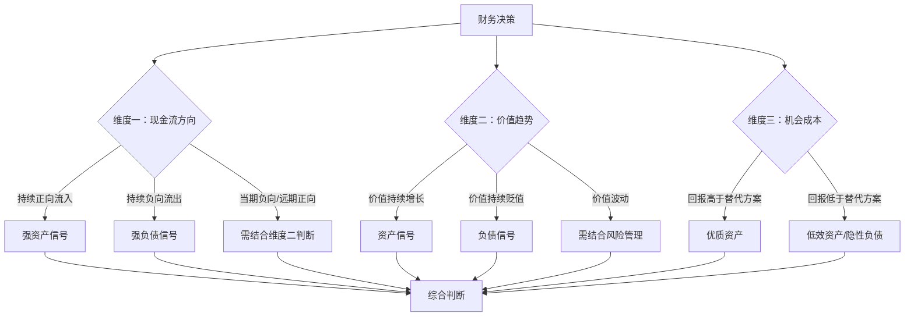
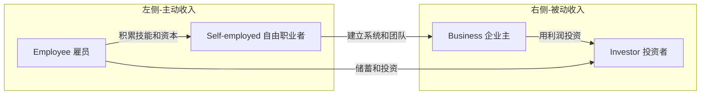

## 2.2 资产与负债的重新定义

大多数人在财务上挣扎的根本原因，不是收入不够高，而是对"什么是资产、什么是负债"存在根本性的认知错误。你可能听过这样的说法："房子是最大的资产"——但如果你每月为它支付房贷、物业费、维修费，而它不产生任何现金流，它真的是资产吗？

本节将从会计学、现金流和个人财务三个维度，重新定义资产与负债，并建立一套可操作的判断框架，帮助你在每一笔财务决策中做出正确的选择。

### 2.2.1 传统会计视角：资产与负债的经典定义

在进入"重新定义"之前，必须先理解传统定义——它没有错，只是不够完整。

#### 会计学中的资产

根据《企业会计准则》和国际财务报告准则（IFRS），资产是指企业过去的交易或事项形成的、由企业拥有或控制的、预期会给企业带来经济利益的资源。核心要素有三个：

| 要素 | 含义 | 示例 |
|------|------|------|
| 过去交易形成 | 已经发生而非计划中 | 已购买的设备，不是计划购买的设备 |
| 拥有或控制 | 法律所有权或实际控制权 | 租赁的设备（使用权资产）也算 |
| 预期带来经济利益 | 能产生现金流入或减少现金流出 | 厂房、专利、应收账款 |

#### 会计学中的负债

负债是指企业过去的交易或事项形成的、预期会导致经济利益流出企业的现时义务。关键特征：

- **现时义务**：已经存在的义务，不是未来可能发生的
- **经济利益流出**：必然导致现金或资源的减少
- **不可避免性**：义务的存在不取决于管理层的意愿

#### 传统定义的局限

传统会计视角适合企业财务报表，但在个人财务决策中有明显盲区。它关注的是"资产负债表上的数字"，而不是"对你口袋里现金流的实际影响"。一套价值500万的房产在资产负债表上是正数资产，但如果每月吞噬你2万的现金流，在个人财务意义上它可能是一个沉重的负债。

### 2.2.2 现金流视角：富爸爸的核心洞察

罗伯特·清崎在《富爸爸穷爸爸》中提出了一个颠覆性的重新定义，这个定义的简洁性和实用性使其成为个人理财领域最具影响力的概念之一：

> **资产是能把钱放进你口袋里的东西，负债是把钱从你口袋里取走的东西。**

这个定义的威力在于它将判断标准从"拥有什么"转向"现金流方向"。

#### 现金流方向的判断矩阵

| 判断维度 | 资产特征 | 负债特征 | 典型例子 |
|----------|----------|----------|----------|
| 日常现金流 | 持续流入（正向） | 持续流出（负向） | 出租房产 vs 自住房产 |
| 持有成本 | 低于或等于收益 | 高于收益或纯消耗 | 股票分红覆盖佣金 vs 年费信用卡 |
| 时间趋势 | 现金流随时间增长或稳定 | 现金流消耗随时间增加 | 成长股 vs 老化设备 |
| 可替代性 | 退出时有正收益 | 退出时有损失或沉没成本 | 可出售的域名 vs 过时的订阅 |

#### 经典案例对比

**案例一：自住房产**

小王2020年购入一套总价300万的房产，首付90万，贷款210万，月供1.2万，物业费500元/月，年维修预算5000元。房产市值在5年后涨到350万。

传统视角：资产350万，净增值50万，是好资产。

现金流视角：
- 每月现金流出：月供12,000 + 物业500 + 维修均摊417 = 12,917元
- 每月现金流入：0元（自住无租金）
- 年现金流消耗：约15.5万
- 5年现金流消耗：约77.5万
- 资产增值：50万
- 净现金流损益：-27.5万（还没算首付90万的机会成本）

结论：自住房在现金流视角下是负债，尽管它可能是生活方式的合理选择。关键是你要**知道**它是负债，而不是自我欺骗它是投资。

**案例二：出租房产**

同一套房产，如果用于出租，月租金6000元。

现金流视角：
- 每月现金流出：月供12,000 + 物业500 + 维修417 = 12,917元
- 每月现金流入：6,000元
- 月净现金流：-6,917元
- 仍然是负债——但比自住好了一半

如果租金涨到13,000元，净现金流转正，它就变成了真正意义上的资产。这就是为什么专业投资者会关注"租金回报率"是否能覆盖持有成本。

**案例三：指数基金定投**

小李每月定投3000元到沪深300指数基金，年化收益约8%。

现金流视角：
- 日常现金流：流出3000元/月（定投扣款）
- 这看起来是"负债"？但这里需要引入时间维度

关键区别：资产和负债的判断不能只看当期现金流，还要看**整个持有周期的净现金流折现**。指数基金的当期现金流为负，但其预期终值远大于累计投入，因此整体上是资产。这引出了更完整的判断框架。

### 2.2.3 三维判断框架：完整的资产与负债定义

单一的现金流方向不足以做出准确判断。需要综合三个维度：



#### 维度一：现金流方向（核心维度）

这是最直接、最实用的判断标准。将所有财务项目按现金流方向分类：

**正向现金流项目（资产特征）：**
- 出租房产的租金收入（扣除所有持有成本后为正）
- 股票/基金的分红收入
- 知识产权的版税/授权费
- 自媒体账号的广告/带货收入
- 存款/债券的利息收入
- 经营性业务的净利润

**负向现金流项目（负债特征）：**
- 自住房的月供、物业、维修
- 私家车的贷款、保险、油费、保养
- 消费贷款/信用卡分期
- 不产生收入的奢侈品
- 过多的订阅服务
- 闲置的设备/工具

**混合型项目（需具体分析）：**
- 教育投入（当期流出，长期可能提升收入能力）
- 健康支出（当期流出，减少未来医疗大额支出）
- 人脉社交支出（当期流出，可能带来未来商业机会）
- 自用工具/设备（当期流出，可能提升工作效率和收入）

#### 维度二：价值趋势

资产的市场价值或使用价值随时间的变化方向。

| 类型 | 价值趋势 | 典型例子 | 判断 |
|------|----------|----------|------|
| 增值型 | 价值随时间上升 | 优质地段房产、稀缺收藏品、成长股 | 倾向资产 |
| 保值型 | 价值基本稳定 | 黄金、核心城市土地 | 中性，看现金流 |
| 折旧型 | 价值持续下降 | 汽车、电子设备、大部分家具 | 倾向负债 |
| 波动型 | 价值大幅波动 | 加密货币、小盘股、艺术品 | 需看持有策略 |

**关键洞察：** 单纯的"增值"不足以判定为资产。如果增值速度低于资金的机会成本（比如低于无风险利率），它实际上是隐性负债。

#### 维度三：机会成本

每一元钱的使用都有机会成本。当你把100万投入一套出租房时，这100万不能同时投入指数基金或创业项目。

机会成本的计算公式：

```text
机会成本 = 替代方案的预期回报 - 当前方案的预期回报
```

**实际应用：**

假设你有50万闲钱，有两个选择：

| 方案 | 预期年回报 | 年现金流 | 流动性 | 风险 |
|------|-----------|----------|--------|------|
| A：购买出租房 | 房价增值5% + 租金净收入3% = 8% | 约1.5万/年净租金 | 低（变现周期3-6个月） | 中（空置、维修、政策） |
| B：指数基金组合 | 长期年化8-10% | 0（红利再投资） | 高（T+1至T+3） | 中（市场波动） |
| C：年化4%的银行理财 | 4% | 2万/年固定利息 | 中（有封闭期） | 低 |

如果只看回报率，A和B接近。但考虑流动性、管理精力、风险调整后回报，实际差异可能很大。真正的资产判断必须考虑"这笔钱在其他地方能产生什么"。

### 2.2.4 常见项目的重新分类

以下是日常生活中最容易被误判的项目，用三维框架重新审视：

#### 被误认为资产的负债

**1. 自用私家车**

传统认知：有车是有资产的表现。

现实分析：
- 购买成本：15万（紧凑型轿车）
- 年持有成本：保险5000 + 油费12000 + 保养3000 + 停车6000 + 折旧15000 = 约4.1万/年
- 年使用价值：假设替代方案（打车+租车）成本2.5万/年
- 净成本差额：约1.6万/年（持有成本高于替代方案）
- 价值趋势：每年贬值10-15%

结论：纯消费用途的私家车是负债，不是资产。只有当车辆用于生产经营（网约车、商务用车、货物运输）且收入覆盖持有成本时，它才是资产。

**2. 过度装修的自住房**

传统认知：装修是提升房产价值。

现实分析：
- 豪装30万 vs 简装10万，差额20万
- 二手交易时，豪装对房价的提升通常不超过5-10万
- 净损失：至少10万
- 如果将20万差额投资年化8%，10年后约43万

结论：超过基本居住需求的装修是消费，不是投资。将装修控制在"够用且体面"的水平，省下的钱才是真资产。

**3. 名牌服饰/奢侈品**

传统认知："买好的可以用很多年"、"某些奢侈品会升值"。

现实分析：
- 99%的服饰和奢侈品在购买后立即贬值30-70%
- 极少数限量款可能升值，但普通消费者缺乏鉴别能力
- 持有成本：存放空间、保养维护
- 消费者心理陷阱："因为贵所以是资产"是一种认知偏差

结论：日常消费的服饰和奢侈品是纯粹的消耗品。以"投资"名义购买奢侈品是一种自欺欺人的行为。

**4. 过多的数字订阅**

一个典型的互联网用户可能同时拥有：
- 视频平台×3（约30元/月×3 = 90元）
- 音乐平台（约15元/月）
- 云存储（约10元/月）
- 工具软件×5（约50元/月×5 = 250元）
- 知识付费×3（约30元/月×3 = 90元）
- 新闻/杂志（约20元/月）

月度合计：约475元，年度约5700元。

这些订阅中，实际使用率通常低于40%。定期审计订阅列表，砍掉不常用的部分，等于每年净增几千元可投资资金。

#### 被误认为负债的资产

**1. 教育与技能投资**

传统认知：学费是支出/消耗。

现实分析：
- 一个获得云计算认证的工程师，年薪可能从20万提升到30万
- 认证费用1万，年回报增量10万
- 投资回报率：1000%/年
- 价值趋势：技能随时间可能贬值（技术迭代）也可能增值（经验积累）

结论：能直接提升收入能力的教育投入是优质资产。关键是选择与市场需求匹配、能快速变现的技能。

**2. 专业工具与设备**

对自由职业者或创业者而言：
- 一台1万元的高性能电脑，可能让视频剪辑效率提升3倍
- 一个5000元的专业软件许可证，可能接更多类型的项目
- 一套2万元的摄影器材，可能开启新的收入渠道

判断标准：工具带来的增量收入是否在合理时间内覆盖购买成本？如果3-6个月内回本，这就是资产。

**3. 健康投入**

健身卡、体检、优质食材、良好睡眠——这些看起来是"花钱"，但：
- 研究表明，规律运动者年均医疗支出比不运动者低30-40%
- 健康的身体意味着更高的工作效率和更长的职业生涯
- 一次大病的治疗费用可能耗尽数十年的积蓄

结论：健康投入是回报周期最长、但确定性最高的资产。

### 2.2.5 负债的三重分类与管理策略

并非所有负债都是坏事。关键在于区分负债的性质和用途。

#### 第一类：破坏性负债（必须消灭）

定义：用于消费、不产生任何收益、利率通常很高的负债。

| 负债类型 | 典型利率 | 危害程度 | 消灭优先级 |
|----------|----------|----------|-----------|
| 信用卡分期/最低还款 | 12-18%/年 | 极高 | 最高 |
| 消费贷/花呗/借呗 | 8-24%/年 | 高 | 最高 |
| 网贷/现金贷 | 18-36%/年（甚至更高） | 致命 | 立即 |
| 向亲友借款（消费用途） | 0%（但消耗人情资本） | 高（隐性） | 高 |

**消灭策略：**

1. **雪崩法（Avalanche）**：优先偿还利率最高的债务，数学上最优
2. **雪球法（Snowball）**：优先偿还余额最小的债务，心理激励最强
3. **合并法**：用低利率贷款（如银行信用贷5%）替换高利率债务（如信用卡18%）

**执行步骤：**
1. 列出所有负债，按利率从高到低排序
2. 除最低还款外的所有可支配资金，全部投入最高利率负债
3. 最高利率负债消灭后，将释放的资金投入下一个
4. 严格执行，直到所有破坏性负债清零

#### 第二类：中性负债（合理使用）

定义：用于购买可能增值或有使用价值的资产，利率适中的负债。

典型代表：房贷（自住或投资）

**房贷作为中性负债的判断标准：**
- 月供不超过家庭月收入的30%
- 首付比例不低于30%（避免过度杠杆）
- 利率处于合理区间（参考同期LPR）
- 房产所在城市的人口和经济基本面支撑房价

**合理使用杠杆的原则：**
- 杠杆放大收益的同时也放大损失
- 确保在最坏情况下（收入下降30%）仍能偿还月供
- 不要让单一负债占据总负债的80%以上

#### 第三类：战略性负债（主动利用）

定义：用于投资能产生正现金流的资产，且资产回报率高于负债成本。

这是富人最常用的财务策略——用别人的钱（OPM, Other People's Money）赚钱。

**经典案例：**

假设你发现一个年租金回报率6%的商铺，银行贷款利率4%。

```text
投资金额：100万
银行贷款：70万（利率4%）
自有资金：30万
年租金收入：6万
年贷款利息：2.8万
年净收入：3.2万
自有资金回报率：3.2万 / 30万 = 10.67%
```

如果不使用杠杆：
```text
自有资金：100万
年租金收入：6万
自有资金回报率：6%
```

杠杆将自有资金回报率从6%提升到了10.67%。这就是战略性负债的威力。

**使用战略性负债的前提条件：**
1. 资产的回报率必须显著高于负债成本（至少2%以上的利差）
2. 现金流必须稳定可预测
3. 必须有应对最坏情况的缓冲（应急资金覆盖6-12个月的负债偿还）
4. 不要将杠杆用到极限——留出安全边际

### 2.2.6 个人资产负债表：实操工具

理论再好，落地需要工具。以下是构建个人资产负债表的具体方法。

#### 步骤一：全面盘点

花1-2个小时，列出你所有的财务项目：

**资产清单模板：**

| 类别 | 项目 | 当前市值 | 月现金流 | 现金流方向 |
|------|------|----------|----------|-----------|
| 现金类 | 银行存款 | 50,000 | +75（利息） | 正 |
| 投资类 | 沪深300基金 | 80,000 | 0（红利再投资） | 中性 |
| 投资类 | 出租房产 | 1,500,000 | +3,000（租金净收入） | 正 |
| 不动产 | 自住房产 | 2,000,000 | -12,000（月供+费用） | 负 |
| 动产 | 私家车 | 100,000 | -3,000（持有成本） | 负 |
| 其他 | 借给朋友的钱 | 10,000 | 0 | 中性 |

**负债清单模板：**

| 类别 | 项目 | 余额 | 月还款 | 利率 | 类型 |
|------|------|------|--------|------|------|
| 房贷 | 自住房贷 | 1,200,000 | 8,500 | 3.8% | 中性 |
| 消费贷 | 花呗 | 5,000 | 500 | 14% | 破坏性 |
| 信用卡 | XX银行信用卡 | 15,000 | 750（最低还款） | 18% | 破坏性 |

#### 步骤二：计算关键指标

**净资产 = 资产总额 - 负债总额**

以上述模板为例：
- 资产总额：50,000 + 80,000 + 1,500,000 + 2,000,000 + 100,000 + 10,000 = 3,740,000
- 负债总额：1,200,000 + 5,000 + 15,000 = 1,220,000
- 净资产：2,520,000

**但净资产只是一个数字。更有意义的是：**

**真资产总额 = 所有正向现金流资产的市值之和**
= 80,000 + 1,500,000 = 1,580,000

**真负债总额 = 所有负向现金流项目的市值 + 所有负债余额**
= 2,000,000 + 100,000 + 1,220,000 = 3,320,000

**现金流净值 = 月正向现金流 - 月负向现金流**
= (75 + 3,000) - (12,000 + 3,000 + 8,500 + 500 + 750) = -21,675

这个数字告诉你：虽然你有252万的"净资产"，但每个月净流出2.1万，你正在变穷。

#### 步骤三：制定优化计划

根据诊断结果，按优先级行动：

1. **立即消灭破坏性负债**：花呗5000 + 信用卡15000 = 20,000，利率14-18%，用存款立即还清
2. **评估负向现金流资产**：私家车是否可以卖掉？自住房是否可以出租一间？
3. **增加正向现金流资产**：将消灭破坏性负债后释放的月现金流（500+750=1250元/月）投入正向资产
4. **定期审计**：每季度重复上述盘点流程，追踪趋势

### 2.2.7 进阶：现金流象限与资产思维

理解了资产与负债的重新定义后，可以将其与现金流象限（ESBI模型）结合，形成更完整的财富认知框架。

#### ESBI四象限



| 象限 | 收入来源 | 资产思维 | 负债思维 |
|------|----------|----------|----------|
| E（雇员） | 工资 | 把工资的一部分持续投入资产 | 把工资全部用于消费和偿还贷款 |
| S（自由职业） | 个人劳动 | 用收入购买能产生被动收入的资产 | 把所有利润重新投入个人消费 |
| B（企业主） | 企业系统 | 建立能脱离个人运转的盈利系统 | 企业完全依赖个人才能运转 |
| I（投资者） | 资本回报 | 让资本流向高回报资产 | 盲目投机、追涨杀跌 |

**核心观点：** 真正的财务自由不取决于你赚多少钱（收入规模），而取决于你的收入结构——被动收入占总收入的比例。被动收入来源于你积累的正向现金流资产。

#### 资产积累的阶段路径

**第一阶段：消灭负债（0-2年）**
- 清除所有破坏性负债
- 建立3-6个月的应急资金
- 月储蓄率目标：>20%

**第二阶段：建立基础资产（2-5年）**
- 开始定投指数基金
- 学习并尝试第一笔投资（如REITs、债券基金）
- 培养"先付给自己"的习惯（发工资第一时间转入投资账户）
- 月投资率目标：>30%

**第三阶段：扩大资产规模（5-10年）**
- 多元化投资组合（股票、债券、REITs、可能的出租房产）
- 探索副业/被动收入渠道
- 学习使用战略性负债
- 被动收入目标：覆盖基本生活开支的50%

**第四阶段：实现财务自由（10年+）**
- 被动收入 > 全部生活开支
- 可以选择是否继续工作
- 财务决策从"赚钱"转向"保值增值"和"传承"

### 2.2.8 常见误区与纠正

#### 误区一："有房就有资产"

**错误逻辑**：房价涨了，我有房，所以我有资产。

**纠正**：如果你每月为房子净流出资金，且房子不产生收入，它在现金流意义上是负债。它可能是生活方式的合理选择，但不要把它等同于"投资"。

**正确做法**：区分"居住消费"和"房产投资"。先解决居住需求（可以租房），再用多余资金投资能产生正向现金流的房产。

#### 误区二："高收入 = 会变富"

**错误逻辑**：月薪5万，很快就能财务自由。

**纠正**：如果月支出4.5万，月净现金流只有5000元。而月薪1万但月支出3000元的人，月净现金流7000元——后者积累资产的速度反而更快。

**正确做法**：关注的不是收入绝对值，而是"储蓄率"（月净现金流 / 月总收入）。储蓄率>50%的人，即使收入不高，也能在10-15年内实现财务自由。

#### 误区三："负债都是坏的"

**错误逻辑**：我绝不用贷款，全部用现金。

**纠正**：在战略性负债的框架下，如果资产回报率>负债成本，适度使用杠杆可以加速财富积累。同时，通货膨胀会侵蚀现金的购买力——持有过多现金本身也是一种隐性损失。

**正确做法**：消灭高利率破坏性负债，合理使用中性负债，主动利用战略性负债。

#### 误区四："投资 = 股票/基金"

**错误逻辑**：说到投资就是买股票基金。

**纠正**：任何能产生正向现金流的东西都是投资——自媒体账号、出租的设备、知识产品（课程、电子书）、能产生收入的技能、甚至一个能带来商业机会的社交圈子。

**正确做法**：拓宽"资产"的定义，关注自己能力圈范围内、能产生正向现金流的所有可能性。

#### 误区五："记账太麻烦，没用"

**错误逻辑**：我知道大概花了多少，不用记。

**纠正**：不记账的人对自己实际的现金流几乎没有准确认知。研究显示，人们通常会低估自己的消费支出30-50%。

**正确做法**：至少连续记账3个月，用工具自动抓取银行和支付平台数据。不需要持续记一辈子——重点是通过记账建立对现金流的准确感知，之后可以凭直觉管理。

### 2.2.9 本节小结

| 维度 | 传统视角 | 重新定义 |
|------|----------|----------|
| 核心判断标准 | 法律所有权 | 现金流方向 |
| 房产 | 绝对是资产 | 看是否产生正向现金流 |
| 汽车 | 是资产（有残值） | 纯消费用途是负债 |
| 教育 | 是支出 | 能提升收入能力的是资产 |
| 负债 | 尽量避免 | 区分破坏性/中性/战略性 |
| 关注指标 | 净资产总额 | 现金流净值 + 被动收入占比 |

**一句话总结：** 资产是能持续把钱放进你口袋的东西，负债是持续从你口袋掏钱的东西。判断标准不是"你拥有什么"，而是"它对你现金流的实际影响"。从今天开始，用这个标准审视你的每一笔财务决策，你会发现很多"看起来像资产"的东西其实正在拖垮你，而很多"看起来像支出"的东西其实是最聪明的投资。
