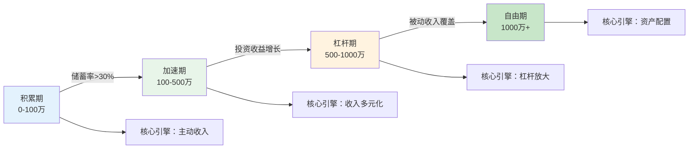
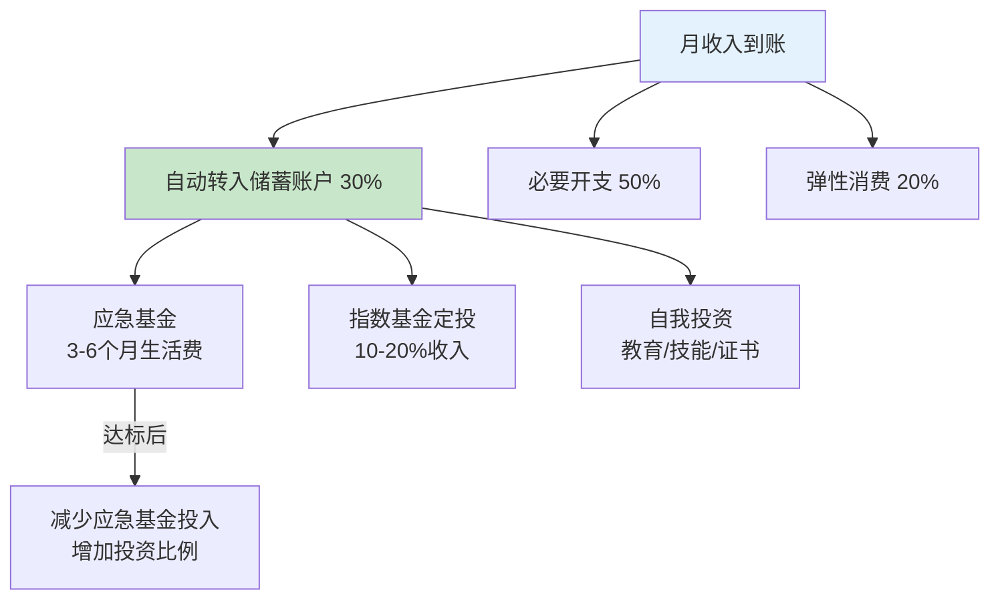
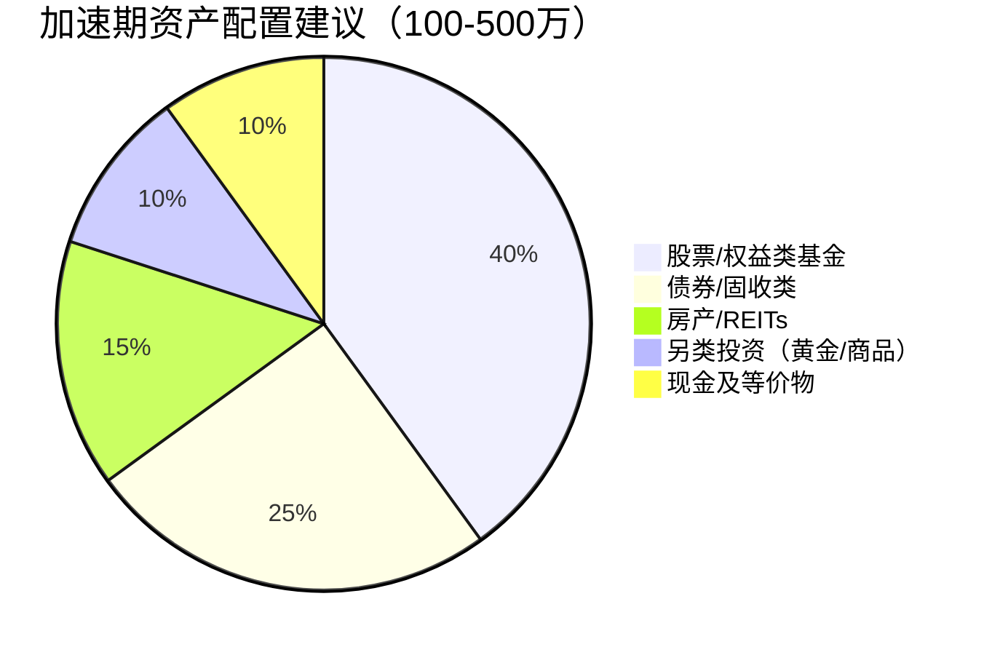
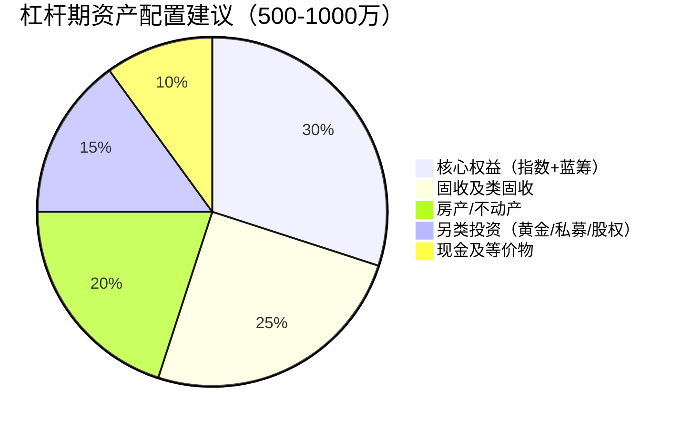
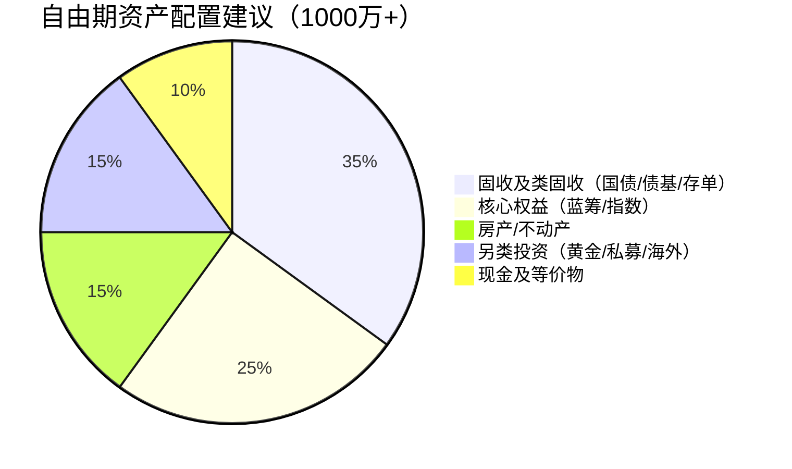
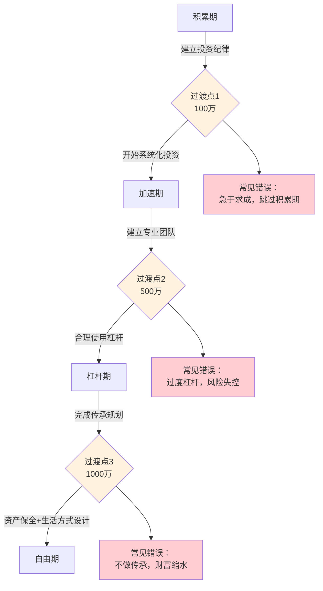

## 2.3 财富增长的四个阶段

财富增长不是一条匀速上升的直线，而是一条分段加速的曲线。理解这条曲线的四个阶段，是制定个人财务战略的前提。每个阶段有不同的核心矛盾、最优策略和常见陷阱——用错了阶段的策略，轻则效率低下，重则前功尽弃。

### 2.3.0 为什么是四个阶段：财富增长的数学本质

在深入每个阶段之前，先理解财富增长的基本公式：

**财富积累公式：**

$$W_n = W_0(1+r)^n + \sum_{t=1}^{n} S_t(1+r)^{n-t}$$

其中 $W_0$ 是初始本金，$r$ 是年化收益率，$n$ 是年数，$S_t$ 是第 $t$ 年的新增储蓄。

这个公式揭示了一个关键规律：**财富增长由两个引擎驱动——存量资金的复利和增量资金的注入。** 在不同阶段，两个引擎的贡献比例完全不同：

| 阶段 | 存量复利贡献 | 增量储蓄贡献 | 核心矛盾 |
|------|-------------|-------------|----------|
| 积累期（0-100万） | <10% | >90% | 本金太少，复利不起作用 |
| 加速期（100-500万） | 20-40% | 60-80% | 收入增长遇到瓶颈 |
| 杠杆期（500-1000万） | 50-70% | 30-50% | 如何放大存量收益 |
| 自由期（1000万+） | >80% | <20% | 如何保本而非增值 |

**阶段转换图：**

> **中国家庭财富分布数据**：根据中国家庭金融调查（CHFS）2023年数据，处于积累期（净资产<100万）的家庭占比约65%，加速期（100-500万）约20%，杠杆期（500-1000万）约10%，自由期（1000万+）约5%。从积累期到自由期的平均时间为15-25年，但通过系统优化策略可以缩短至10-15年。

---

### 2.3.1 积累期（0-100万）：打好地基

**核心矛盾**：本金太小，复利效应微乎其微。10万元本金，即使年化收益10%，一年也只有1万元收益——还不如一个月工资多。这个阶段的财富增长，90%以上来自储蓄而非投资。

**核心目标**：积累第一桶金，同时建立正确的财务习惯和投资认知。

#### 为什么100万是第一个里程碑

100万不是一个随意的数字。它代表了几个关键阈值：

- **心理阈值**：跨过100万后，大多数人会从"存钱心态"转向"投资心态"，开始真正思考资产配置
- **投资门槛**：许多投资机会（如私募、房产首付、优质股权）的最低门槛在100万左右
- **复利起步**：100万本金按年化8%计算，每年收益8万，相当于一个月薪6600元的"隐形员工"在帮你工作
- **抗风险能力**：100万的应急储备可以覆盖大多数家庭2-3年基本开支

#### 积累期的核心策略

**策略一：最大化储蓄率——比收益率重要10倍**

在积累期，储蓄率是决定财富增长速度的第一变量。用数字说明：

| 月收入 | 月储蓄 | 储蓄率 | 5年累计（无收益） | 10年累计（无收益） |
|--------|--------|--------|-------------------|-------------------|
| 1万 | 2000 | 20% | 12万 | 24万 |
| 1万 | 4000 | 40% | 24万 | 48万 |
| 1万 | 6000 | 60% | 36万 | 72万 |
| 2万 | 4000 | 20% | 24万 | 48万 |
| 2万 | 1.2万 | 60% | 72万 | 144万 |

可以看到，**储蓄率从20%提升到60%，等效于收入翻3倍**。而对于大多数人来说，提升储蓄率比提升收入要容易得多——减少不必要的开支是立竿见影的。

**具体执行方法：**

1. **50/30/20法则的升级版**：将税后收入按50%必要开支、20%弹性消费、30%储蓄投资分配。积累期的目标是将储蓄率推到40%以上
2. **自动化储蓄**：工资到账当天自动转入储蓄/投资账户，花剩下的而非存剩下的
3. **消费降级清单**：列出每月所有非必要支出，逐一评估是否有替代方案（如自己做饭替代外卖、公共交通替代打车）

**策略二：投资自己——积累期回报率最高的投资**

在积累期，人力资本（即你未来的赚钱能力）远大于金融资本。投资自己的回报率往往是投资金融市场的10倍以上。

**投资自己的三个维度：**

1. **专业技能深化**
   - 考取行业含金量高的证书（CPA、CFA、PMP等）
   - 参加行业会议和培训，建立人脉网络
   - 每年阅读20+本专业书籍
   - 目标：在3-5年内成为所在领域的前20%

2. **副业能力培养**
   - 利用专业技能发展咨询、培训、写作等副业
   - 学习可变现的数字技能（编程、设计、内容创作）
   - 目标：在3年内建立至少一个稳定的副业收入来源

3. **财商教育**
   - 系统学习投资基础知识（推荐书单见本节末尾）
   - 用小额资金（总资金的10-20%）实践投资
   - 记录每笔投资的逻辑和结果，定期复盘
   - 目标：在3年内形成自己的投资框架

**策略三：建立应急基金——不可跳过的安全垫**

在开始投资之前，必须先建立3-6个月基本生活费的应急基金。这不是可选项，而是必选项。原因很简单：没有应急基金，一次意外支出（医疗、失业、家电维修）就会迫使你在不合适的时机卖出投资，打断复利的积累。

**应急基金的要求：**
- 金额：3-6个月基本生活费（如果有房贷，建议6-12个月）
- 存放：高流动性、低风险的货币基金或银行活期
- 独立：与投资资金完全分开，不挪用

**策略四：开始定投——用最小成本建立投资纪律**

积累期的投资目标不是赚大钱，而是建立投资纪律和认知。推荐从指数基金定投开始：

- **沪深300指数基金**：代表A股大盘蓝筹，年化收益约8-10%
- **中证500指数基金**：代表A股中小盘成长，波动更大，长期收益更高
- **定投金额**：每月收入的10-20%
- **定投纪律**：无论市场涨跌，坚持每月固定日期买入

#### 积累期的真实案例

**案例一：普通上班族小王**

- 背景：25岁，月薪1.2万，坐标二线城市
- 执行：储蓄率45%，每月定投3000元到沪深300指数基金，每年花5000元考取行业证书
- 第1年：积蓄5.5万，基金账户3.8万
- 第3年：积蓄18万，基金账户12万，薪资因证书提升到1.8万/月
- 第5年：积蓄35万，基金账户25万，副业收入3000/月
- 第7年：突破100万，其中投资收益贡献约15万

**案例二：自由职业者小李**

- 背景：28岁，月均收入8000-1.5万不等，收入不稳定
- 执行：收入好的月份储蓄率60%，差的月份储蓄率20%，平均40%
- 挑战：收入波动导致定投不规律
- 解决方案：建立"收入平滑基金"——收入高的月份多存，低的月份从基金中补足基本生活
- 第6年：突破100万，其中副业（自媒体）收入贡献了40%

#### 积累期的常见陷阱

| 陷阱 | 表现 | 后果 | 纠正方法 |
|------|------|------|----------|
| 过早追求高收益 | 把大量资金投入高风险投资 | 本金亏损，心态崩溃 | 先存够应急基金，再用小比例资金投资 |
| 忽视自我投资 | 为了省钱拒绝所有培训和学习 | 收入增长停滞 | 每年至少投入收入的5%用于学习 |
| 消费主义陷阱 | "犒劳自己"频繁升级消费 | 储蓄率永远提不上去 | 区分"需要"和"想要"，延迟满足 |
| 不记账 | 不知道钱花在哪里 | 无法优化支出 | 使用记账APP，每月复盘支出结构 |
| 跟风投资 | 听朋友推荐买股票/基金 | 高位接仓，低位割肉 | 坚持定投纪律，不追涨杀跌 |

#### 积累期推荐书单

- 《小狗钱钱》——建立基础财商认知
- 《富爸爸穷爸爸》——理解资产和负债的区别
- 《指数基金投资指南》（银行螺丝钉）——定投入门
- 《财务自由之路》（博多·舍费尔）——系统化的储蓄和投资方法

---

### 2.3.2 加速期（100-500万）：构建增长引擎

**核心矛盾**：单纯靠工资增长已经无法显著提升财富积累速度。100万本金按年化8%收益，每年投资收益8万；如果年收入30万、储蓄率40%，年储蓄12万——投资收益已经占到总增量的40%。这个阶段的核心任务是**建立多元收入来源和优化投资组合**。

#### 加速期的关键转变

从积累期到加速期，思维方式需要发生三个根本转变：

1. **从"省钱思维"到"赚钱思维"**：积累期靠压缩开支提升储蓄率，加速期需要提升收入天花板
2. **从"存钱"到"管钱"**：100万以上的资产管理需要系统化的投资框架
3. **从"单一收入"到"多元收入"**：主动收入、被动收入、投资收入三管齐下

#### 收入多元化策略

**第一层：主业收入持续增长**

- 目标：成为行业中上水平（前20%），年薪达到30-50万区间
- 方法：跳槽涨薪（平均每2-3年跳一次，涨幅20-30%）、内部晋升、转岗到高薪方向
- 关键：不要为了副业牺牲主业的上升空间——主业是最大的"现金流资产"

**第二层：建立副业收入管道**

副业选择的核心标准：**可积累、可放大、边际成本递减**。

| 副业类型 | 启动成本 | 天花板 | 边际成本 | 适合人群 |
|----------|---------|--------|----------|----------|
| 自媒体/内容创作 | 低（时间） | 高 | 趋近于零 | 有表达能力的人 |
| 知识付费/培训 | 中 | 中高 | 低 | 有专业技能的人 |
| 电商/代购 | 中 | 中 | 中等 | 有供应链资源的人 |
| 技术外包/咨询 | 低 | 中 | 较高（时间换钱） | 有技术能力的人 |
| 房产投资 | 高 | 高 | 低（后期） | 有初始资金的人 |

**第三层：投资收入**

当投资组合达到200-500万时，按年化7-8%计算，每年投资收益14-40万，相当于一个不错的年薪。这个阶段需要从"定投指数基金"升级到系统化的资产配置。

#### 资产配置框架

**标准普尔家庭资产配置法的中国本土化版本：**

**各资产类别的具体配置建议：**

**股票/权益类基金（40-60%）：**
- 宽基指数基金（沪深300、中证500）：占权益类的50%
- 行业主题基金（消费、医药、科技）：占权益类的20%
- 个股投资（仅限深入研究过的公司）：占权益类的30%
- 操作策略：核心持仓（指数基金）+ 卫星持仓（个股/行业基金）

**债券/固收类（20-30%）：**
- 国债/国开债基金：安全性最高
- 优质企业债基金：收益略高，风险可控
- 银行大额存单：流动性好，适合短期配置
- 注意：利率下行周期加长久期，利率上行周期缩长久期

**另类投资（10-20%）：**
- 黄金ETF：对冲通胀和地缘风险
- REITs（不动产投资信托基金）：获取不动产收益而无需直接买房
- 商品基金：分散股票相关性

**现金及等价物（10%）：**
- 货币基金、银行活期
- 用途：日常开支 + 抓住市场下跌时的加仓机会

#### 加速期的风险管理

100-500万的资产规模已经"值得保护"。一次30%的下跌意味着30-150万的损失——可能是你3-5年的储蓄。

**风险管理四原则：**

1. **分散化**：不把超过20%的资产放在单一标的上
2. **再平衡**：每半年检查一次资产配置比例，偏离目标超过5%就调仓
3. **止损纪律**：个股亏损超过20%强制止损（指数基金除外，指数基金应该越跌越买）
4. **保险配置**：在资产达到200万时，配置足够的重疾险、寿险、意外险，防止因病返贫

#### 加速期的真实案例

**案例：双收入家庭的加速之路**

- 背景：夫妻双方均30岁，合计月收入4万，坐标深圳
- 初始状态：积蓄80万（积累期完成）
- 执行方案：
  - 储蓄率50%，月储蓄2万
  - 定投组合：沪深300（6000/月）+ 中证500（4000/月）+ 债券基金（5000/月）+ 黄金ETF（2000/月）+ 现金储备（3000/月）
  - 先生利用专业技能做周末培训，月均额外收入5000元
  - 太太运营小红书账号，第2年开始有广告收入，月均3000元
- 第3年（资产约180万）：投资收益开始显著，年投资收益约12万
- 第5年（资产约300万）：投资收益约20万/年，副业收入约10万/年
- 第8年（资产约500万）：投资收益35万/年，超过一方工资收入

#### 加速期的常见陷阱

| 陷阱 | 表现 | 后果 | 纠正方法 |
|------|------|------|----------|
| 过度自信 | 几年投资赚了钱，觉得自己是股神 | 重仓单一标的，一次亏损回吐多年收益 | 坚持分散配置，单标的不超过20% |
| 房产迷信 | 把大部分资金押注房产 | 流动性差，错过其他投资机会 | 房产配置不超过总资产的40% |
| 忽视保险 | "我年轻身体好不需要保险" | 一场大病可能清零多年积累 | 配置足额重疾险+寿险+意外险 |
| 副业影响主业 | 花太多精力在副业上 | 主业晋升停滞，总收入反而下降 | 副业时间不超过工作日的20% |

---

### 2.3.3 杠杆期（500-1000万）：放大收益的关键阶段

**核心矛盾**：500万本金按年化8%收益，每年投资收益40万——已经超过了大多数人的工资收入。此时继续靠"多存钱"来增长财富的效率很低（多存10万只增加2%），而通过**优化投资策略和合理使用杠杆**来提升收益率，效果要大得多。

收益率从8%提升到12%，500万本金的年收益从40万变成60万——多出的20万等效于额外储蓄200万（按10%收益率计算）。

#### 杠杆的本质与风险

杠杆是"借钱投资"的统称。它的数学本质很简单：

**杠杆收益率 = 自有资金收益率 × 杠杆倍数 - 借贷成本 × (杠杆倍数 - 1)**

举例：自有资金500万，借入500万（总资金1000万），投资收益率10%，借贷成本5%：

- 不用杠杆：收益 = 500万 × 10% = 50万，自有资金收益率 = 10%
- 使用杠杆：收益 = 1000万 × 10% - 500万 × 5% = 75万，自有资金收益率 = 15%

但杠杆是双刃剑。同样的例子，如果投资收益率只有2%：

- 不用杠杆：收益 = 500万 × 2% = 10万
- 使用杠杆：收益 = 1000万 × 2% - 500万 × 5% = -5万（亏损）

**杠杆使用的安全边际公式：**

> 只有当预期投资收益率 > 借贷成本 × 2 时，才值得使用杠杆。即如果借贷成本5%，投资收益率必须有把握超过10%才值得加杠杆。

#### 杠杆期的三大杠杆工具

**工具一：房产杠杆**

房产是普通人最容易获得的杠杆工具。30%首付 = 3.3倍杠杆。

- **优势**：银行贷款利率低（目前约3.5-4.5%）、还款周期长（最长30年）、可以通过租金覆盖部分月供
- **风险**：流动性差（卖出需要数月）、政策风险（限购限贷）、房价下跌时杠杆放大亏损
- **适用场景**：一二线城市核心地段、租金回报率>2%的房产
- **操作建议**：房产投资不超过总资产的40%，确保月供不超过家庭月收入的30%

**工具二：融资融券**

券商提供的杠杆工具，通常可以做到1:1融资（500万本金借500万）。

- **优势**：流动性好、操作灵活
- **风险**：有强制平仓线（通常维持担保比例低于130%会被强平）、利息成本高（年化6-8%）
- **适用场景**：对市场有较高把握的短期机会，不适用于长期持有
- **操作建议**：融资比例不超过自有资金的30%，只在有高确定性机会时使用

**工具三：经营杠杆**

通过企业/公司结构，用别人的钱做自己的生意。

- **方式**：创业融资、合伙人出资、预收客户款项、供应链账期
- **优势**：杠杆倍数可以很高、不直接承担借贷利息
- **风险**：经营失败的责任和损失
- **适用场景**：有成熟商业模式和行业经验的创业者

#### 杠杆期的资产配置

500-1000万的资产配置需要更加精细化：

**关键变化（对比加速期）：**
- 增加另类投资比例（从10%提升到15%），包括私募基金、优质股权等高门槛投资
- 房产配置从间接（REITs）转向直接持有，但总量控制在40%以内
- 开始考虑海外资产配置（如港股、美股、海外房产），分散单一市场风险

#### 杠杆期的专业团队

当资产规模达到500万以上，个人的时间和专业知识已经成为资产管理的瓶颈。需要建立专业顾问团队：

| 角色 | 职责 | 费用参考 | 何时需要 |
|------|------|----------|----------|
| 独立理财顾问（IFA） | 整体资产配置规划 | 1-2万/年或资产的0.3-0.5% | 资产>300万 |
| 税务顾问 | 税务筹划、合规优化 | 5000-2万/次 | 资产>500万 |
| 律师 | 资产保护、合同审查 | 按项目收费 | 大额交易/房产 |
| 保险经纪人 | 定制化保险方案 | 免费（佣金制） | 资产>200万 |

**选择顾问的注意事项：**
- 优先选择**收费制**（你付费给他）而非**佣金制**（他从产品方拿佣金）的顾问，避免利益冲突
- 独立理财顾问比银行理财经理更客观——银行理财经理背负销售任务
- 任何承诺"保本保收益"的都是骗子

#### 杠杆期的税务优化

500万以上的资产，税务优化每年可以节省数万甚至数十万：

1. **个人所得税优化**
   - 合理利用年终奖单独计税政策
   - 利用公益捐赠抵税（应纳税所得额30%以内可扣除）
   - 自由职业者/企业主合理利用企业所得税率差

2. **投资收益税务优化**
   - 股票持有超过1年，股息红利免征个人所得税
   - 基金分红免征个人所得税
   - 合理利用亏损抵税（如年底卖出亏损持仓实现税务亏损，再买入类似标的）

3. **房产税务优化**
   - 利用"满五唯一"免征个人所得税政策
   - 合理规划房产持有结构（个人 vs 公司）

#### 杠杆期的真实案例

**案例：从500万到1000万的企业主老张**

- 背景：40岁，企业主，年利润约80万，已有资产500万（含一套自住房产）
- 执行方案：
  - 企业利润的50%用于再投资和资产配置
  - 配置了200万的股票/基金组合（指数+蓝筹+行业基金）
  - 购入一套投资性房产（总价300万，首付90万，贷款210万，月租8000覆盖月供60%）
  - 配置50万的固收产品作为流动性储备
  - 注册个人独资企业进行税务筹划，年节省税费约8万
  - 配置了200万保额的终身寿险+50万保额的重疾险
- 结果：
  - 第4年：房产增值+投资收益+企业利润，总资产突破1000万
  - 投资收益约60万/年，已接近企业利润

#### 杠杆期的常见陷阱

| 陷阱 | 表现 | 后果 | 纠正方法 |
|------|------|------|----------|
| 过度杠杆 | 融资比例过高，追求暴富 | 市场下跌时被强平，一夜回到解放前 | 杠杆总额不超过自有资金的50% |
| 投资集中 | "看准了"把大量资金押在单一标的 | 黑天鹅事件导致巨额亏损 | 单一标的不超过总资产15% |
| 忽视流动性 | 大量资金锁定在房产/私募中 | 需要资金时无法变现 | 保持10%以上的高流动性资产 |
| 税务忽视 | 不做税务规划 | 多交数万甚至数十万的税 | 每年做一次税务筹划 |

---

### 2.3.4 自由期（1000万+）：守住财富，享受人生

**核心矛盾**：从"增长"转向"保全"。1000万按4%安全提取率（参考Trinity Study），每年可提取40万——足以覆盖大多数家庭的基本生活。此时的核心任务不再是"赚更多"，而是**确保财富不缩水，并实现有序传承**。

#### 财务自由的定义与标准

财务自由的经典定义：**被动收入 ≥ 生活开支**。

但"被动收入"和"生活开支"因人而异，需要精确计算：

**你的财务自由数字 = 年生活开支 ÷ 安全提取率**

| 年生活开支 | 安全提取率3% | 安全提取率4% | 安全提取率5% |
|-----------|-------------|-------------|-------------|
| 20万 | 667万 | 500万 | 400万 |
| 30万 | 1000万 | 750万 | 600万 |
| 50万 | 1667万 | 1250万 | 1000万 |
| 80万 | 2667万 | 2000万 | 1600万 |
| 100万 | 3333万 | 2500万 | 2000万 |

> **安全提取率的选择**：4%是美国市场历史数据（Trinity Study）的结论，基于30年提取周期。考虑到中国市场波动更大、通货膨胀不确定性更高，建议中国家庭使用3-3.5%的安全提取率，或保持一定的主动收入（咨询、兼职）作为缓冲。

#### 自由期的资产配置原则

进入自由期，资产配置的目标从"最大化收益"转变为"在保本基础上跑赢通胀"。

**核心原则：防守为主，进攻为辅。**

**关键变化（对比杠杆期）：**
- 固收类占比从25%提升到35%，成为最大类别
- 权益类从30%降到25%，减少波动
- 增加海外资产配置比例（10-15%），分散单一市场风险
- 黄金配置增加到5-8%，作为极端风险的对冲

**核心持仓结构：**

1. **基石资产（50-60%）**：低波动、稳定现金流
   - 国债/国开债基金
   - 高评级企业债
   - 银行大额存单
   - 优质REITs（租金收入稳定）

2. **增长资产（25-35%）**：跑赢通胀
   - 沪深300/中证红利指数基金
   - 优质蓝筹股（高分红、低估值）
   - 港股/美股指数基金（QDII）

3. **机会资产（10-15%）**：捕捉超额收益
   - 私募股权基金
   - 黄金ETF
   - 新兴市场基金

4. **流动性资产（5-10%）**：随时可用
   - 货币基金
   - 银行活期
   - 短期理财产品

#### 财富传承规划

当资产超过1000万，财富传承不再是"以后再说"的事情。中国没有遗产税（目前），但传承中的税务、法律和家庭关系问题依然复杂。

**传承工具对比：**

| 工具 | 优势 | 劣势 | 适用场景 |
|------|------|------|----------|
| 遗嘱 | 简单、成本低 | 可能被挑战、需公证 | 简单的家庭资产分配 |
| 保险 | 定向传承、有杠杆 | 灵活性差 | 指定受益人的定向传承 |
| 信托 | 资产隔离、专业管理 | 门槛高（通常1000万起） | 大额资产/复杂家庭结构 |
| 家族基金会 | 税务优惠、社会影响 | 设立和运营成本高 | 超高净值家族 |
| 生前赠与 | 简单直接 | 赠与后失去控制权 | 小额资产转移 |

**保险在传承中的独特价值：**

保险是唯一可以在被保险人身故时"创造"现金的金融工具。举例：一位50岁的高净值人士，购买1000万保额的终身寿险，年缴保费约30万。如果他在65岁身故，保险公司赔付1000万——即使他只交了15年共450万保费。这笔钱可以用于：
- 覆盖遗产分割中的现金需求
- 为未成年子女提供教育和生活保障
- 缴纳可能开征的遗产税

**信托的使用场景：**

- **防止子女挥霍**：设定分期领取条件（如每年领取收益的50%，本金在35岁后分期领取）
- **资产隔离**：信托资产不受受益人债务追索
- **婚姻财产保护**：信托资产不属于受益人的夫妻共同财产
- **多代传承**：一次性设立，惠及多代人

#### 自由期的生活方式设计

财务自由不是终点，而是新生活的起点。很多提前退休的人在1-2年后出现严重的空虚感和身份危机——因为他们只规划了"如何赚钱"，没有规划"自由之后做什么"。

**自由期的生活设计框架：**

1. **意义来源**：找到不需要钱也会做的事情（公益、教育、创作、研究）
2. **社交网络**：离开职场后，需要刻意维护和拓展社交圈
3. **健康管理**：有充足的时间和资源进行系统化的健康管理
4. **持续学习**：保持大脑活跃，防止认知退化
5. **家庭关系**：有更多时间陪伴家人，但也需要处理新的关系动态

#### 自由期的真实案例

**案例：45岁实现财务自由的老陈**

- 背景：45岁，前互联网公司高管，资产约1500万（含一套自住房产市值500万）
- 资产分布：
  - 投资性房产2套：市值400万，月租金1.2万
  - 股票/基金组合：500万，年分红+收益约35万
  - 固收产品：300万，年收益约12万
  - 保险：终身寿险保额500万，年缴保费15万
  - 现金/货币基金：100万
  - 自住房产：500万（不计入投资资产）
- 年被动收入：租金14.4万 + 投资收益35万 + 固收12万 = 61.4万
- 年家庭开支：约40万（含子女教育15万）
- 盈余：21.4万/年，可持续增长
- 自由后生活：
  - 每周2天做行业顾问（年收入约15万，非必要但保持社会连接）
  - 每年2次长途旅行
  - 系统学习书法和摄影
  - 在社区做青少年编程教育志愿者

#### 自由期的常见陷阱

| 陷阱 | 表现 | 后果 | 纠正方法 |
|------|------|------|----------|
| 过度保守 | 全部存银行定期 | 长期跑不赢通胀，购买力缩水 | 保持25-35%的权益类配置 |
| 生活膨胀 | "我有钱了"消费升级 | 提取率超过安全线 | 制定年度预算，提取率不超过3.5% |
| 缺乏规划 | 不做传承规划 | 资产被稀释或引发家庭纠纷 | 50岁前完成遗嘱和信托设立 |
| 孤立化 | 离开职场后社交萎缩 | 心理健康问题 | 刻意维护社交网络和社区参与 |
| 被骗 | "高收益"投资骗局 | 资产大幅缩水 | 任何承诺年化>10%保本的都是骗局 |

---

### 2.3.5 跨越阶段的过渡策略

每个阶段之间的过渡，比阶段本身更危险。因为过渡期意味着你需要同时执行两套策略——旧阶段的防守和新阶段的进攻。

**积累期→加速期（突破100万）：**
- 关键动作：从"纯储蓄"转向"储蓄+投资"双引擎
- 时间窗口：通常在第5-8年
- 心态转变：接受投资波动，不再追求"稳赚不赔"

**加速期→杠杆期（突破500万）：**
- 关键动作：从"个人投资"转向"系统化资产管理"
- 时间窗口：通常在第10-15年
- 心态转变：从"自己研究"转向"借助专业力量"

**杠杆期→自由期（突破1000万）：**
- 关键动作：从"增长导向"转向"保全导向"
- 时间窗口：通常在第15-20年
- 心态转变：从"赚更多"转向"够了就好"

### 2.3.6 不同起点的加速策略

不是所有人都是从零开始的。以下是不同起点的优化路径：

**起点一：有房无贷，积蓄50万（"隐形百万"家庭）**
- 房产市值计入总资产后，可能已经达到加速期门槛
- 策略：利用房产做抵押贷款（利率低于信用贷），获取低成本资金用于投资
- 注意：贷款金额不超过房产价值的30%，确保月供可控

**起点二：高收入但零积蓄（"月光族"转型）**
- 核心问题不是收入而是消费习惯
- 策略：强制储蓄率50%以上，用6个月时间建立应急基金
- 预计3-5年可突破100万

**起点三：继承/拆迁获得一笔资金（"突富"型）**
- 核心风险：没有管理大额资金的经验，容易挥霍或被骗
- 策略：先存银行3个月（冷静期），然后请独立理财顾问制定系统化方案
- 绝对不要在获得资金后的6个月内做任何重大投资决策

**起点四：中年起步（40岁以上，积蓄<50万）**
- 时间窗口较短，需要更激进的策略
- 策略：聚焦于提升收入（跳槽/创业）而非压缩开支
- 同时利用中年积累的人脉和经验，发展高价值副业

---

### 2.3.7 核心认知总结

**四个阶段的本质区别：**

| 维度 | 积累期 | 加速期 | 杠杆期 | 自由期 |
|------|--------|--------|--------|--------|
| 核心矛盾 | 本金太少 | 收入单一 | 收益率不够高 | 如何保全 |
| 第一优先级 | 储蓄率 | 资产配置 | 杠杆管理 | 风险控制 |
| 主要收入来源 | 主动收入>90% | 主动60%+投资40% | 投资>主动 | 被动>90% |
| 时间投入重点 | 提升技能 | 学习投资 | 管理团队 | 享受生活 |
| 最大风险 | 消费主义 | 过度自信 | 过度杠杆 | 过度保守 |
| 关键指标 | 储蓄率 | 收入来源数 | 资产收益率 | 安全提取率 |

**贯穿始终的原则：**

1. **复利需要时间**：不要试图跳过任何阶段，每个阶段都有必须积累的经验和认知
2. **风险管理优先**：在任何阶段，保护本金都比追求高收益更重要
3. **持续学习**：金融市场和政策环境不断变化，学习是终身任务
4. **健康第一**：没有健康，一切财富都是零
5. **人际关系是最宝贵的资产**：很多机会来自人脉，而非搜索引擎

> **最后一个提醒**：这四个阶段的数字门槛（100万、500万、1000万）是参考值，不是绝对标准。真正的阶段划分应该基于**被动收入与生活开支的比例**——当被动收入覆盖30%开支时，你已进入加速期；覆盖50%时，进入杠杆期；覆盖100%时，你已经自由了。
