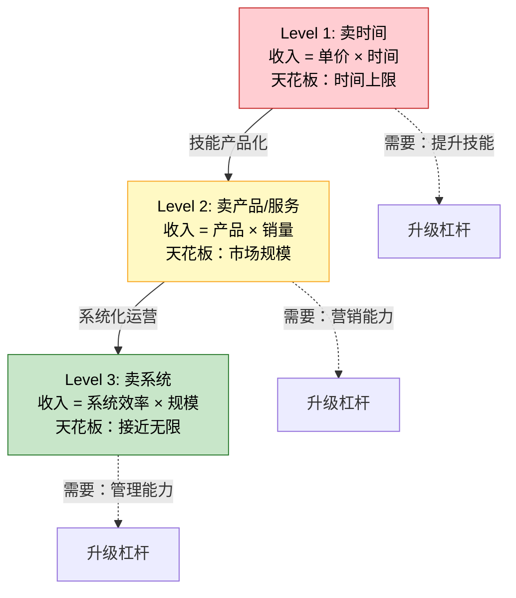
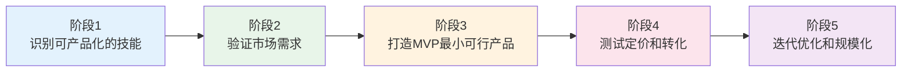
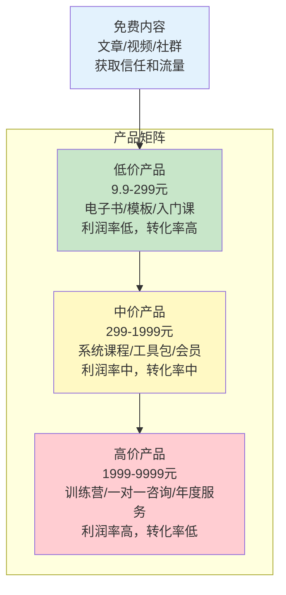
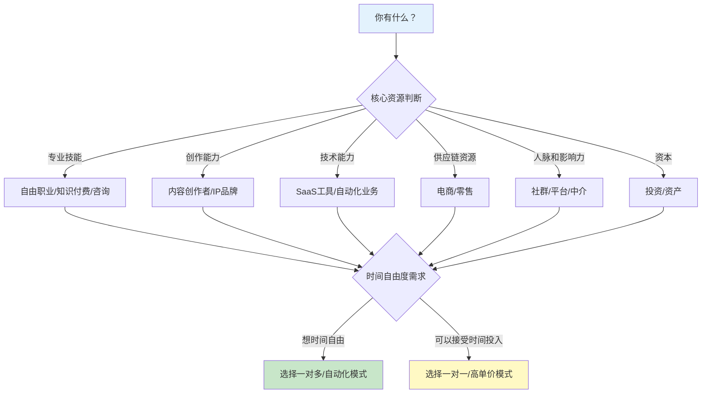

## 2.4 个人商业模式升级

> "你的商业模式决定了你的收入天花板——从卖时间到卖产品到卖系统，每一次升级都是一次收入维度的跃迁。"

大多数人终其一生都在用最低效的方式赚钱——卖时间。一个月薪2万的程序员和一个月入2万的煎饼摊老板，商业模式的本质是一样的：**停止工作，收入归零**。他们不是不努力，而是不知道赚钱还有"二档""三档""四档"。

个人商业模式是你**创造价值、交付价值、获取回报**的完整方式。它决定了三个关键问题：你的收入上限是多少？你的收入是否可持续？你停止工作后收入会不会归零？本节会帮你理解商业模式的三级升级路径，找到从"卖时间"到"卖系统"的具体方法。

### 2.4.1 个人商业模式的三级升级框架

#### 三级模型总览

个人商业模式可以归纳为三个层级，每一级都代表着收入结构的根本性变化：



| 维度 | Level 1: 卖时间 | Level 2: 卖产品/服务 | Level 3: 卖系统 |
|------|----------------|-------------------|----------------|
| **收入公式** | 单价 × 时间 | 产品价格 × 销售数量 | 系统效率 × 运营规模 |
| **收入上限** | 24小时/天 × 最高时薪 | 目标市场的客户总量 | 理论上无上限 |
| **时间绑定** | 强绑定，停止=归零 | 弱绑定，产品可自动销售 | 无绑定，系统自运转 |
| **典型月收入** | 5千-10万 | 1万-100万 | 10万-1000万+ |
| **核心能力** | 专业技能 | 产品能力 + 营销能力 | 系统设计 + 团队管理 |
| **风险特征** | 低风险，低回报 | 中等风险，中高回报 | 高风险，高回报 |
| **复利效应** | 无（线性增长） | 有（产品可复用） | 强（系统自动增长） |
| **代表人群** | 上班族、自由职业者 | 课程讲师、独立开发者 | 企业创始人、品牌持有者 |

#### 三级升级的底层逻辑

为什么"卖时间"注定有天花板？因为时间是**绝对稀缺资源**——每个人每天都只有24小时，这是物理定律，任何努力都无法突破。经济学中有一个概念叫**要素报酬递减**：当一种生产要素（时间）固定不变时，持续增加其他投入（努力、技能）带来的边际产出会逐渐下降。你从每天工作8小时增加到12小时，产出可能增加40%；但从12小时增加到16小时，产出可能只增加15%，而健康损耗却是指数级的。

升级的本质是改变**价值交付的方式**：

- **卖时间**：你和客户之间是**一对一**的关系。你服务一个客户的时间，就不能服务另一个客户。
- **卖产品**：你和客户之间是**一对多**的关系。同一份产品可以同时卖给100个、1000个、10000个客户。
- **卖系统**：你和市场之间是**系统对市场**的关系。系统自动获取客户、自动交付价值、自动收款，你只需要维护和优化系统。

这个转变的经济学本质是**将可变成本转化为固定成本**。卖时间时，每多服务一个客户就多投入一份时间（100%可变成本）。卖产品时，产品制作是一次性固定成本，后续每多卖一份的边际成本接近于零。当销售量突破盈亏平衡点后，利润率急剧上升——这就是数字产品和互联网服务的底层商业逻辑。

#### 升级的三个关键转变

从卖时间到卖产品再到卖系统，需要完成三个思维和能力的根本转变：

**转变一：从"我做什么"到"市场需要什么"**

卖时间的人思考的是"我会什么技能"，然后去找需要这个技能的雇主或客户。卖产品的人思考的是"市场上有什么未被满足的需求"，然后用自己的技能去满足这个需求。这个转变的核心是从**供给导向**转向**需求导向**。

实操方法：每周花2小时在目标用户聚集的平台（知乎、小红书、行业论坛）搜索"怎么""如何""求推荐""有没有"等关键词，记录下反复出现的问题。当你发现同一个问题被问了50次以上，这就是一个值得产品化的需求。

**转变二：从"一对一"到"一对多"**

卖时间的人一次只能服务一个客户。卖产品的人一份产品可以服务无数客户。这个转变的核心是**可复制性**——你需要把你的知识、技能、经验"封装"成一个可以独立交付的产品。

常见的封装方式：
- 把你的咨询过程录制成**视频课程**
- 把你的方法论整理成**电子书或付费文档**
- 把你常用的设计/代码/模板打包成**数字资产**
- 把你的社群运营经验变成**付费社群/会员制**

**转变三：从"我亲自做"到"系统替我做"**

卖产品的人虽然实现了"一对多"，但仍然需要亲自做营销、客服、迭代。卖系统的人把这些环节都自动化或外包，自己只负责战略决策和系统优化。这个转变的核心是**可替代性**——你需要让自己从日常运营中抽身出来。

### 2.4.2 Level 1 深度解析：卖时间

#### 卖时间的本质与局限

卖时间是最原始的商业模式，也是绝大多数人的起点。它的核心公式极为简洁：

```text
收入 = 时间单价 × 工作时间
```

这个公式同时揭示了两大天花板：**时间天花板**（一天最多工作16小时，不可持续）和**单价天花板**（行业薪资有上限，且增长曲线是递减的）。

但卖时间并非一无是处——它是最安全的起步方式，也是积累技能和资本的必经阶段。问题不在于你是否在卖时间，而在于你**是否在卖时间的同时为下一级做准备**。

#### 卖时间模式下的升级策略

如果你暂时无法脱离卖时间的模式，可以通过以下策略提升效率和为升级做准备：

| 策略 | 说明 | 预期效果 | 实施周期 |
|------|------|---------|---------|
| **提升时间单价** | 学习稀缺技能、考取高价值证书、向高薪行业转型 | 单价提升30%-200% | 6-24个月 |
| **提高时间效率** | 用工具自动化重复工作、优化工作流程 | 同等工作时间产出提升20%-50% | 1-3个月 |
| **利用碎片时间** | 在通勤、午休等碎片时间学习新技能或做产品准备 | 每天多出1-2小时有效利用 | 即时 |
| **记录和沉淀** | 把工作中的经验、方法论、案例系统记录下来 | 为未来产品化积累素材 | 持续 |
| **建立个人品牌** | 在行业社区分享专业内容，建立影响力 | 为未来的产品销售积累受众 | 3-12个月 |

**关键心态：** 把当前的卖时间阶段视为"带薪学习"——你不仅在赚工资，还在积累技能、案例、人脉和行业认知。这些资产在你未来升级商业模式时会发挥巨大价值。

#### 案例：一个设计师的"卖时间"阶段积累

阿杰，25岁，某互联网公司UI设计师，月薪1.2万。他没有急着创业或做副业，而是做了三件事：

1. **建立作品集网站**：每周花3小时把工作中做得好的设计案例整理到个人网站上，6个月后积累了50+高质量案例
2. **在Dribbble和站酷发布作品**：每周发布1-2个设计作品，1年后积累了3000+粉丝
3. **记录设计方法论**：把工作中的设计流程、评审标准、常见问题整理成文档

这些积累在两年后发挥了巨大作用——当他开始做设计课程时，有了现成的案例库、现成的受众、现成的方法论，冷启动成本几乎为零。

### 2.4.3 Level 2 深度解析：卖产品/服务

#### 从技能到产品的转化路径

卖产品/服务是大多数人最应该优先尝试的商业模式升级。它的核心逻辑是：**把你的一次性服务变成可重复销售的产品**。

转化路径分为五个阶段：



**阶段1：识别可产品化的技能**

不是所有技能都适合产品化。适合产品化的技能需要满足三个条件：

1. **有明确的需求**：有人愿意为这个技能付费（不是你觉得有用，而是市场觉得有用）
2. **可以标准化交付**：不需要面对面、不需要定制化，可以批量交付
3. **结果可衡量**：用户能明确感知到"我学到了什么"或"我获得了什么"

自测清单：
- 你是否经常被朋友/同事问某个领域的问题？（说明你有专业知识）
- 你是否能在一个小时内教会别人一个具体技能？（说明知识可传递）
- 你教会别人后，他们能否独立应用？（说明可以标准化交付）
- 是否有人愿意为此付费？（搜索同类产品的定价和销量）

**阶段2：验证市场需求**

验证需求是产品化过程中最关键的一步，也是大多数人跳过的一步。很多人凭感觉做产品，结果做出来没人买。

验证方法（按成本从低到高排列）：

| 方法 | 成本 | 周期 | 可靠性 | 具体操作 |
|------|------|------|--------|---------|
| **搜索验证** | 0元 | 1-3天 | 中 | 在知乎/小红书/百度搜索相关关键词，看搜索量和问题数量 |
| **竞品验证** | 0元 | 1-3天 | 高 | 搜索同类产品，看定价、销量、评价。有竞品说明有市场 |
| **预售验证** | 0元 | 1-2周 | 极高 | 先写产品介绍，看有多少人愿意预付定金 |
| **免费内容验证** | 0-500元 | 2-4周 | 高 | 先发布免费内容（文章/视频），看阅读量和互动量 |
| **MVP验证** | 500-5000元 | 4-8周 | 极高 | 做一个最小版本的产品，直接卖 |

**阶段3：打造MVP（最小可行产品）**

MVP的核心原则是**用最少的时间和成本验证产品是否有市场**。不要一上来就做"完美产品"——完美产品是迭代出来的，不是规划出来的。

MVP的三条红线：
- 时间投入不超过100小时
- 金钱投入不超过1000元
- 交付周期不超过8周

**阶段4：测试定价和转化**

定价是产品化中最被低估的技能。很多人的产品卖不出去，不是因为产品不好，而是因为定价错误。

定价的三个基本原则：

1. **价值定价而非成本定价**：不要按"我花了多少时间做这个"来定价，而是按"用户获得这个能赚回多少/省下多少"来定价。一门帮助学员涨薪5000元/月的课程，定价2000元是合理的（4个月回本），定价200元反而是低估了价值。

2. **锚定效应**：先展示高价产品，再展示中低价产品。用户会以高价产品为"锚"来评估中低价产品的性价比。产品线通常是：旗舰版（2999元）+ 标准版（799元）+ 入门版（199元）。

3. **测试定价敏感度**：在不同渠道用不同价格测试转化率。如果199元和299元的转化率差别不大，就用299元。如果299元的转化率暴跌50%以上，就用199元。

**阶段5：迭代优化和规模化**

产品上线不是终点，而是起点。真正的收入增长来自于持续的迭代优化。

迭代的优先级排序：
1. **修复影响留存的问题**（用户买了不用/要求退款）
2. **增加用户最常要求的功能/内容**
3. **优化转化漏斗**（从看到→了解→购买的每一步）
4. **扩展产品矩阵**（围绕核心产品开发配套产品）

#### 产品化的八种常见形式

| 形式 | 说明 | 典型月收入 | 启动难度 | 维护频率 | 适合谁 |
|------|------|-----------|---------|---------|--------|
| **在线课程** | 将专业知识录制为视频/音频课程 | 5千-50万+ | ★★★ | 低（每季度更新） | 有教学能力的专业人士 |
| **电子书/付费文档** | 将经验写成系统化的文档 | 1千-10万 | ★★ | 低（每年修订） | 有写作能力的人 |
| **设计模板/UI Kit** | 可复用的设计资产 | 2千-20万 | ★★★ | 中（跟随平台更新） | 设计师 |
| **软件工具/SaaS** | 解决特定问题的工具 | 5千-100万+ | ★★★★ | 高（持续维护） | 程序员 |
| **付费社群/会员制** | 持续提供价值的社群运营 | 1万-50万+ | ★★★ | 高（持续活跃） | 有影响力的人 |
| **咨询产品包** | 将咨询服务标准化为可交付的产品 | 5千-30万 | ★★★ | 中 | 有行业经验的顾问 |
| **自媒体内容** | 公众号/B站/播客的广告和打赏收入 | 0-100万+ | ★★ | 高（持续更新） | 有创作能力的人 |
| **Affiliate/分销** | 推荐他人产品获取佣金 | 1千-20万 | ★★ | 低 | 有流量的人 |

#### 产品矩阵策略

单一产品有天花板，产品矩阵才能最大化收入。一个成熟的产品矩阵通常包含三层：



**产品矩阵的转化逻辑：**
- 免费内容 → 低价产品：转化率通常3%-10%（100个读者中3-10人购买）
- 低价产品 → 中价产品：转化率通常10%-25%（对已经付费的用户，信任度更高）
- 中价产品 → 高价产品：转化率通常5%-15%（高价产品需要更强的信任和更明确的需求）

**关键指标：客户终身价值（LTV）**

不要只看单次交易金额，要看客户的终身价值。一个用户的典型消费路径可能是：
```text
免费文章 → 9.9元电子书 → 299元课程 → 1999元训练营 → 4999元年度会员
总消费：7256.9元
```

这意味着你获取一个新用户的价值不是9.9元，而是潜在的7256.9元。理解了LTV，你就不会在获取用户时吝啬——免费内容的投入是值得的，因为它在为高价产品培养潜在客户。

#### 案例：一个英语老师的产品化之路

小红，26岁，某培训机构英语老师，月薪1.5万。她决定将教学能力产品化。

**第一步：发现需求（第1-2周）**
小红分析了自己3年教学中最常被学生问到的问题，发现"职场商务英语"需求最旺盛但市面上的课程要么太学术、要么太浅。她在知乎搜索"商务英语"相关问题，发现有超过2000个未被充分回答的问题，每个问题下面都有几十到几百个"赞同"。这就是明确的市场需求信号。

**第二步：打造MVP（第3-8周）**
她没有一上来就录制100节课，而是先做了一个12节课的"商务英语速成班"，定价99元。用手机录制，剪辑用免费的剪映。总投入：时间约80小时，金钱约200元（买了一个外接麦克风）。

**第三步：测试市场反应（第9-12周）**
在小红书和知乎发布免费干货内容引流，同时在网易云课堂上线。第一个月卖出87份，收入8613元。收集用户反馈后发现：用户最想要的是"邮件写作模板"和"会议发言框架"。

**第四步：迭代升级（第3-6个月）**
根据反馈重录课程，扩充到36节，定价299元。同时推出"商务英语邮件模板包"（49元）和"一对一纠音服务"（399元/小时）。产品矩阵形成后，月均收入稳定在2.5-4万。

**第五步：建立系统（第6-12个月）**
录完的课程不再需要投入时间。她把精力转向内容营销（每周2篇小红书笔记）和社群运营（付费年费社群399元/年）。到第12个月，月均收入达到5-7万，其中80%来自已录制课程和模板的"自动"销售。

**关键数据对比：**

```text
主动收入（教课）：1.5万/月，需要每天到岗
组合收入（课程+模板+社群）：5-7万/月，核心内容已录制完成
投入时间比：从每月176小时 → 每月约40小时
时间单价变化：85元/小时 → 1250-1750元/小时（提升了15-20倍）
```

#### 流量获取方法论

产品再好，没人知道就等于零。流量获取分为三个阶段：

**冷启动阶段（0-1000用户）：**
1. **平台红利法**：在目标用户聚集的平台（知乎、小红书、B站）持续输出免费高质量内容，文末引导到产品
2. **社群渗透法**：加入目标用户所在的社群，先提供价值建立信任，再自然推荐产品
3. **种子用户法**：找到50-100个目标用户，免费提供产品换取反馈和口碑传播
4. **SEO长尾法**：针对长尾关键词创建内容，通过搜索引擎获取免费流量

**增长阶段（1000-10000用户）：**
1. **内容矩阵法**：一个核心产品搭配多篇不同角度的内容，覆盖不同搜索关键词和平台
2. **合作互推法**：找到用户群重叠但不竞争的创作者，互相推荐
3. **付费投放法**：当产品已有正向口碑后，用付费广告加速增长（获客成本 < 客户终身价值的1/3）

**规模化阶段（10000+用户）：**
1. **品牌化运营**：从"卖产品"升级为"卖品牌"，建立品牌认知和忠诚度
2. **渠道拓展**：从单一平台扩展到多平台，降低对单一渠道的依赖
3. **产品矩阵扩展**：围绕核心产品开发配套产品，提升客户终身价值

### 2.4.4 Level 3 深度解析：卖系统

#### 什么是"卖系统"？

卖系统是个人商业模式的终极形态。它的核心特征是：**你建立了一套系统，系统自动运转为你赚钱，你不需要持续参与日常运营。**

"系统"可以是：
- 一个**自动化运转的线上业务**（自动获客、自动交付、自动收款）
- 一个**有团队运营的品牌/公司**（你负责战略，团队负责执行）
- 一组**能产生现金流的资产组合**（投资组合、知识产权组合、房产组合）
- 一个**平台或生态**（连接供需双方，从中获取佣金或服务费）

#### 从卖产品到卖系统的关键跨越

卖产品的人仍然需要亲自做三件事：营销、客服、迭代。卖系统的人把这些都系统化了：

| 环节 | 卖产品（手动） | 卖系统（自动/半自动） |
|------|--------------|-------------------|
| **获客** | 亲自写内容、发朋友圈、做推广 | 内容矩阵自动引流 + SEO + 付费投放自动化 |
| **转化** | 亲自回复咨询、做销售 | 自动化销售漏斗（落地页→免费试听→自动付款） |
| **交付** | 亲自发货/开课/服务 | 自动化交付系统（自动开通权限、自动发送资料） |
| **客服** | 亲自回复用户问题 | FAQ + 社群互助 + AI客服 + 外包客服 |
| **迭代** | 亲自收集反馈、更新产品 | 自动化反馈收集 + 数据分析驱动迭代 |

#### 卖系统的五种常见模式

**模式一：自动化线上业务**
通过技术手段实现获客、交付、收款的全自动化。典型代表：自动化电商（选品→上架→投放→发货全链路自动化）、内容站（SEO流量→广告/联盟收入）。

**模式二：品牌化运营**
建立一个有知名度和美誉度的品牌，品牌本身成为资产。品牌的价值在于：用户会主动搜索你的品牌名，降低获客成本；品牌溢价允许你定更高的价格；品牌忠诚度带来复购和推荐。

**模式三：团队化运营**
组建团队来执行日常运营，你只负责战略决策和关键资源对接。从"一个人做所有事"到"每个人做最擅长的事"。

**模式四：平台/生态模式**
连接供需双方，从中获取佣金或服务费。你不需要自己提供产品/服务，只需要搭建和维护交易平台。

**模式五：资产组合模式**
构建一组能持续产生现金流的资产（投资组合、知识产权、房产等），通过资产的复利效应实现收入增长。

#### 系统构建的核心原则

1. **可替代性原则**：系统中的每个环节都应该可以由其他人或工具完成，不依赖任何单一个人（包括你自己）
2. **可复制性原则**：系统应该可以在新的市场/领域复制，而不是只能在一个地方运行
3. **可度量原则**：系统的关键指标（获客成本、转化率、留存率、利润率）都应该可以量化和追踪
4. **抗脆弱原则**：系统应该能在外部冲击（市场变化、竞争加剧、政策调整）中存活甚至变得更强

### 2.4.5 十种常见的个人商业模式

根据价值交付方式和收入结构的不同，个人商业模式可以归纳为十种常见类型：

| # | 模式名称 | 核心逻辑 | 典型代表 | 月收入范围 | 适合谁 | 核心风险 |
|---|---------|---------|---------|-----------|--------|---------|
| 1 | **自由职业模式** | 用自己的技能直接为客户服务 | 自由设计师、翻译、咨询师 | 5千-10万 | 有专业技能的人 | 客户依赖、收入不稳定 |
| 2 | **知识付费模式** | 将知识/经验产品化为课程/文档 | 在线讲师、知识博主 | 1万-100万 | 有教学能力的专业人士 | 内容同质化、用户留存 |
| 3 | **内容创作者模式** | 通过内容吸引流量，广告/带货变现 | B站UP主、公众号作者 | 0-200万 | 有创作能力的人 | 平台依赖、流量波动 |
| 4 | **SaaS/工具模式** | 开发解决特定问题的软件工具 | 独立开发者、小团队 | 1万-500万 | 有编程能力的人 | 技术维护、竞争壁垒 |
| 5 | **电商/零售模式** | 选品+供应链+销售 | 跨境电商、直播带货 | 5千-1000万 | 有供应链资源的人 | 库存风险、竞争激烈 |
| 6 | **社群/会员模式** | 建立付费社群持续提供价值 | 行业社群、私董会 | 1万-100万 | 有影响力和人脉的人 | 持续运营压力 |
| 7 | **咨询/教练模式** | 提供一对一或一对多的专业指导 | 管理咨询师、人生教练 | 1万-50万 | 有深厚行业经验的人 | 时间仍有绑定 |
| 8 | **中介/平台模式** | 连接供需双方赚取佣金 | 房产中介、猎头、撮合平台 | 1万-500万 | 有行业资源的人 | 信任成本高 |
| 9 | **投资/资产模式** | 用资本获取回报 | 投资人、房东 | 取决于本金 | 有资本积累的人 | 市场风险 |
| 10 | **IP/品牌模式** | 建立个人IP或品牌，授权/联名变现 | 知名博主、行业KOL | 10万-1000万+ | 有强个人品牌的人 | IP维护成本高 |

**如何选择适合你的商业模式？**



### 2.4.6 个人商业模式画布

#### 什么是商业模式画布？

商业模式画布（Business Model Canvas）是由亚历山大·奥斯特瓦德在《商业模式新生代》中提出的工具。它用一张图帮你梳理商业模式的九大核心模块。对个人而言，这张画布帮你回答一个根本问题：**你是如何创造价值、交付价值、并从中获取回报的？**

#### 个人商业模式画布模板

```text
┌─────────────────────────────────────────────────────────────────┐
│                        个人商业模式画布                           │
├───────────┬───────────┬───────────┬───────────┬─────────────────┤
│  关键合作   │  关键活动   │  价值主张   │  客户关系   │   客户群体      │
│           │           │           │           │                │
│ • 导师/顾问 │ • 内容创作  │ • 你解决什么 │ • 一对一    │ • 目标客户是谁？│
│ • 同行伙伴  │ • 产品开发  │   问题？    │ • 一对多    │ • 客户画像     │
│ • 供应商    │ • 市场营销  │ • 你提供什么 │ • 自动化    │ • 客户痛点     │
│ • 技术支持  │ • 客户服务  │   独特价值？│ • 社群      │ • 客户规模     │
│           │ • 学习迭代  │ • 为什么选你│           │                │
│           │           │   而不是别人？│           │                │
├───────────┴───────────┼───────────┴───────────┴─────────────────┤
│      关键资源          │              渠道                        │
│                       │                                        │
│ • 你的核心技能         │ • 你通过什么渠道触达客户？               │
│ • 你的知识和经验       │   - 自有平台（网站/公众号/社群）         │
│ • 你的人脉和信誉       │   - 第三方平台（知乎/B站/小红书）       │
│ • 你的工具和资金       │   - 搜索引擎（SEO/SEM）                │
│ • 你的时间精力         │   - 口碑推荐                           │
│                       │   - 合作伙伴渠道                        │
├───────────────────────┼────────────────────────────────────────┤
│      成本结构          │              收入来源                    │
│                       │                                        │
│ • 时间成本（最大成本）  │ • 主动收入：咨询/服务费                 │
│ • 学习成本             │ • 组合收入：课程/产品/模板销售           │
│ • 工具/平台成本        │ • 被动收入：投资收益/版税/广告           │
│ • 营销推广成本         │ • 订阅收入：会员/社群年费                │
│ • 外包/团队成本        │ • 授权收入：IP授权/品牌合作              │
└───────────────────────┴────────────────────────────────────────┘
```

#### 画布填写指南：逐模块详解

**模块一：客户群体（最重要的起点）**

你的客户是谁？这个问题的答案决定了后续所有模块的方向。填写时需要回答：
- 谁会为你的产品/服务付费？（不是"所有人"，而是具体的人群画像）
- 他们有什么共同的痛点或需求？
- 这个群体的规模有多大？（太小养不活你，太大你服务不过来）
- 他们愿意为解决这个问题付多少钱？

**模块二：价值主张（你的核心竞争力）**

你为客户解决什么问题？你提供什么独特价值？填写时需要回答：
- 客户在什么场景下会想到你？
- 你的解决方案和竞品有什么不同？
- 客户选择你的核心理由是什么？（不是"我更好"，而是"我在某个具体方面更好"）

**模块三：渠道（如何触达客户）**

你通过什么方式让客户知道你、了解你、购买你的产品？填写时需要列出所有触达渠道，并评估每个渠道的：
- 覆盖量（能触达多少人）
- 转化率（多少人会购买）
- 成本（获取一个客户需要多少钱）

**模块四：客户关系（如何维护用户）**

你和客户之间是什么关系？一次性交易还是长期关系？填写时需要考虑：
- 获取新客户的成本 vs 维护老客户的成本（通常维护成本是获取成本的1/5）
- 如何提高复购率和推荐率？
- 如何建立信任和忠诚度？

**模块五：关键活动（你每天做什么）**

你的商业模式中，哪些活动是不可或缺的？填写时需要区分：
- **高杠杆活动**：直接创造收入的活动（产品开发、营销、销售）
- **必要但低杠杆活动**：必须做但不直接创造收入（财务、行政、客服）
- **可外包活动**：别人能做且成本更低的活动

**模块六：关键资源（你需要什么）**

你的商业模式依赖哪些核心资源？填写时需要考虑：
- 技能资源：你必须具备什么能力？
- 人脉资源：你需要什么关键关系？
- 资金资源：你需要多少启动资金？
- 时间资源：你需要投入多少时间？

**模块七：关键合作（谁能帮你）**

你需要和谁合作？填写时需要考虑：
- 谁能帮你触达你无法触达的客户？
- 谁能提供你不具备的能力？
- 谁能降低你的成本或风险？

**模块八：成本结构（你花多少钱）**

你的商业模式有哪些成本？填写时需要区分：
- 固定成本：不随业务量变化的成本（工具订阅、平台费用）
- 可变成本：随业务量变化的成本（外包费用、营销投放）

**模块九：收入来源（你赚多少钱）**

你的收入从哪里来？填写时需要考虑：
- 每个收入来源的金额和占比
- 每个收入来源的稳定性和增长潜力
- 收入来源之间的协同效应

#### 画布填写案例：一个独立开发者的商业模式

以一个做"效率工具"的独立开发者为例：

| 模块 | 内容 |
|------|------|
| **客户群体** | 25-40岁的知识工作者（程序员、设计师、产品经理），月收入1-3万，愿意为提升效率付费 |
| **价值主张** | 帮助知识工作者节省每天30分钟的重复操作时间，年化节省价值约5000元 |
| **渠道** | 知乎回答（SEO流量）、小红书笔记、ProductHunt、用户口碑推荐 |
| **客户关系** | 免费版获取用户→付费版转化→社群维护→年度订阅续费 |
| **关键活动** | 产品开发（60%）、内容营销（25%）、用户支持（15%） |
| **关键资源** | 编程技能、产品设计能力、用户洞察、个人品牌 |
| **关键合作** | 设计师（UI外包）、KOL（产品评测）、技术社区（曝光） |
| **成本结构** | 服务器200元/月 + 设计外包1000元/月 + 营销500元/月 = 1700元/月 |
| **收入来源** | 订阅制（月付29元/年付269元）+ 一次性买断（199元） |

### 2.4.7 从本地市场到全球市场

#### 互联网打破地域限制

在传统商业模式中，你的市场半径受限于物理距离——一个北京的咨询师很难服务广州的客户。但互联网彻底改变了这个格局：

- **一个程序员**可以在GitHub上开源项目，获得全球用户
- **一个英语老师**可以在线教全球各地的学生
- **一个设计师**可以在Creative Market上卖给全球设计师
- **一个写作者**可以在Medium/Substack上获得全球读者

#### 全球化策略

| 策略 | 说明 | 适合谁 | 注意事项 |
|------|------|--------|---------|
| **内容出海** | 用英文/多语言发布内容，触达全球用户 | 有英语能力的创作者 | 需要了解目标市场的文化和需求差异 |
| **产品出海** | 在全球平台（Gumroad、App Store）销售产品 | 有数字产品的人 | 需要考虑定价策略（购买力平价） |
| **服务出海** | 通过Upwork、Fiverr等平台服务全球客户 | 有专业技能的自由职业者 | 需要适应不同时区和工作方式 |
| **品牌出海** | 建立面向全球的品牌和社区 | 有一定影响力的人 | 需要持续的本地化运营 |

#### 利用汇率差异

一个重要的全球化红利是**汇率差异**：你用人民币投入成本，用美元/欧元获取收入。假设你在二三线城市做线上课程，月成本5000元人民币（约700美元），但如果课程面向全球市场定价99美元，每月只需要卖出8份就能覆盖成本。而面向国内市场定价299元，需要卖出17份。

### 2.4.8 常见误区与纠正

**误区一："我必须先辞职才能升级商业模式"**
事实：绝大多数成功的商业模式升级都是在**保持主业的同时**逐步完成的。辞职创业的风险极高——你失去了稳定的现金流，同时还要承担新业务的不确定性。正确的做法是：用业余时间做MVP，验证市场后再考虑全职投入。

**误区二："我没有独特的技能，做不了产品"**
事实：你不需要是世界顶级专家，你只需要比你的目标受众多懂50%。一个工作2年的程序员完全有能力教刚入行的新人。教初学者不需要博士水平，需要的是"刚刚走过这条路"的实战经验。心理学上有一个概念叫"知识的诅咒"——你知道得越多，越觉得"这些谁都知道"。但实际上，你认为的"常识"对很多人来说是"新知"。

**误区三："做课程/写书需要先成为大V"**
事实：大V做课程确实更容易，但小众领域的专业课程完全不需要百万粉丝。一个只做"B2B外贸邮件写作"的课程，在全网可能只有3000个潜在客户，但转化率可以做到5%-10%，这就是150-300份 × 几百元的收入。关键不是粉丝数量，而是**粉丝精准度**和**需求紧迫度**。

**误区四："做一次就完了，不需要维护"**
事实：产品不是"做完就躺赚"。课程需要根据用户反馈迭代，内容需要持续营销推广，社群需要日常运营。但它的工作量远低于全职工作，且大部分是"可选"的优化而非"必须"的维持。一门成熟课程的维护工作量通常是每月5-10小时。

**误区五："太卷了，现在入场来不及了"**
事实：市场永远在变化，新的需求不断产生。2020年没人教"远程办公工具使用"，2022年没人教"ChatGPT提示词工程"，2024年没人教"AI辅助编程工作流"。机会不在于"第一批入场"，而在于"在需求爆发时已经有准备"。同时，很多看似饱和的市场实际上被低质量内容充斥——高质量内容永远有市场。

**误区六："商业模式升级 = 创业"**
事实：商业模式升级不等于开公司、融资、做大。一个自由职业者从按小时收费（卖时间）改为打包服务（卖产品），就是一次成功的商业模式升级。一个程序员从接外包改为做SaaS工具，也是一次升级。升级的核心是**改变价值交付方式**，不是改变身份标签。

### 2.4.9 行动清单：从今天开始升级你的商业模式

**第1周：诊断当前模式**
- [ ] 用商业模式画布梳理你当前的收入模式
- [ ] 计算你的时间单价（月收入 ÷ 实际工作小时数）
- [ ] 判断你目前处于哪个Level（卖时间/卖产品/卖系统）
- [ ] 列出你所有可以产品化的技能和经验

**第2-4周：验证需求**
- [ ] 在目标平台搜索你擅长领域的高频问题
- [ ] 找到3-5个竞品，分析它们的定价、销量、评价
- [ ] 写一份产品介绍，发到朋友圈/社群看反馈
- [ ] 如果反馈积极，确定MVP的方向和范围

**第2-3个月：打造MVP**
- [ ] 用不超过100小时制作最小可行产品
- [ ] 定价参考竞品，先用低价测试（入门版价格）
- [ ] 在2-3个渠道发布，观察转化率
- [ ] 收集前10个用户的详细反馈

**第4-6个月：迭代和扩展**
- [ ] 根据反馈优化产品内容和体验
- [ ] 逐步提价到合理区间
- [ ] 开发第2个产品（产品矩阵）
- [ ] 建立自动化营销和交付流程

**第7-12个月：规模化**
- [ ] 扩展到更多渠道
- [ ] 考虑外包低杠杆工作
- [ ] 建立客户社群提升复购和推荐
- [ ] 评估是否可以全职投入

> **记住：** 商业模式升级不是一夜之间的事，而是一个持续迭代的过程。最重要的是**开始行动**——哪怕只是在今天花30分钟画一张商业模式画布，也比"等我准备好了再说"强一万倍。

***
