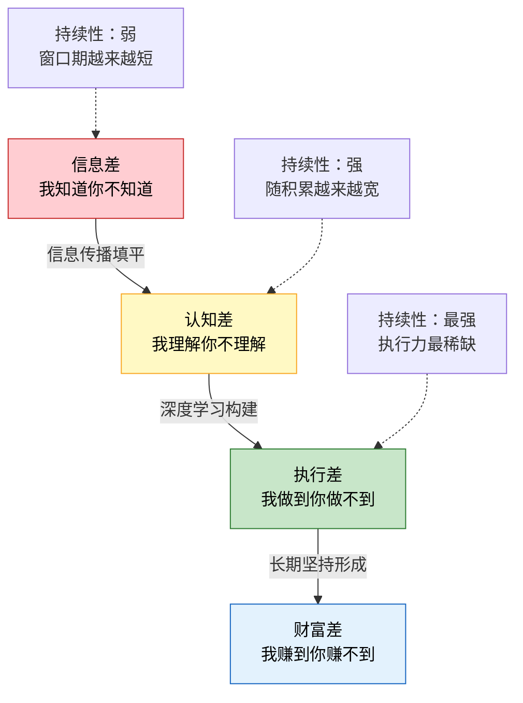
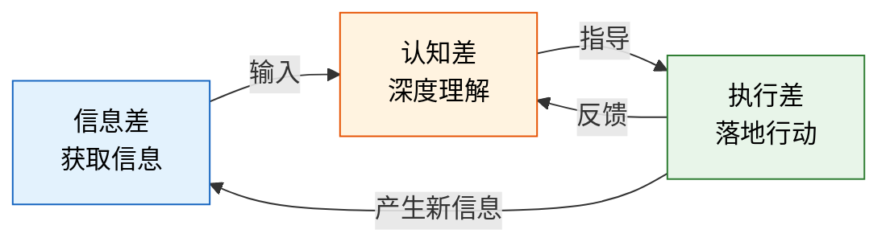
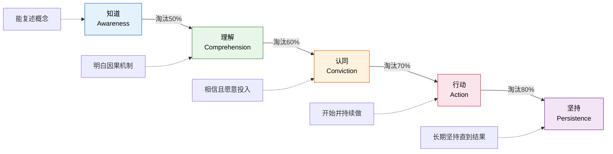
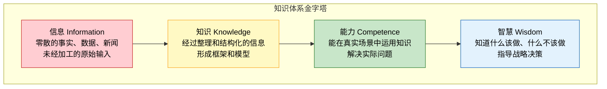
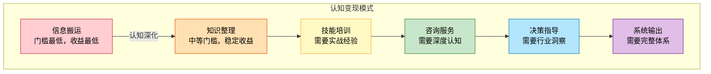
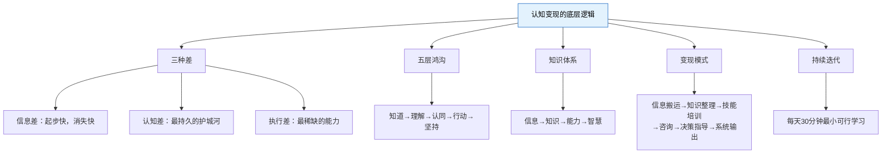

## 2.5 认知变现的底层逻辑

> "在信息时代，你最大的资产不是银行账户里的数字，而是你大脑里的认知结构。"

前四节我们拆解了收入类型、资产本质、财富阶段和个人商业模式——这些是财富增长的"硬件"。但硬件再好，没有"软件"也跑不起来。**认知就是驱动整个财富系统的操作系统**。

本节回答一个根本问题：**为什么同样聪明、同样努力的人，财富差距可以如此巨大？** 答案不在于运气，不在于出身，而在于他们处理信息、理解规律、采取行动的方式存在根本性差异。这种差异可以被精确地拆解为三个层级：信息差、认知差、执行差。

### 2.5.1 赚钱的三种"差"：信息差、认知差、执行差

#### 三层模型总览

财富的获取本质上是一个**信息处理和价值创造**的过程。在这个过程中，人与人之间的差距可以归结为三种"差"：

| 维度 | 信息差 | 认知差 | 执行差 |
|------|--------|--------|--------|
| **本质** | 你知道别人不知道的信息 | 你理解别人不理解的规律 | 你做到别人做不到的事情 |
| **获取方式** | 渠道、人脉、地理位置 | 深度学习、实践验证、思维模型 | 习惯养成、系统设计、意志力训练 |
| **持续性** | 弱——信息传播会填平差距 | 强——认知壁垒随积累加宽 | 最强——执行力是最稀缺的能力 |
| **竞争壁垒** | 低——别人知道了你就没优势 | 中高——理解深度难以速成 | 极高——知道和做到之间有巨大鸿沟 |
| **变现周期** | 短——利用窗口期快速变现 | 中——需要时间建立信任和口碑 | 长——持续执行才能看到复利效果 |
| **典型月收入** | 5千-5万（波动大） | 5万-50万（相对稳定） | 10万-500万+（指数增长） |
| **代表人群** | 代购、跨平台搬运、政策套利 | 行业分析师、投资顾问、技术专家 | 连续创业者、内容创作者、长期投资者 |

#### 信息差：最浅层但最容易起步

**信息差的本质**是你和别人之间存在信息不对称。在经济学中，信息不对称是市场失灵的主要原因之一，也是套利机会的主要来源。

**信息差的四种来源**：

1. **行业壁垒产生的信息差**：不同行业之间存在知识壁垒。医疗行业的人不了解互联网运营，金融行业的人不了解制造业供应链。这种信息差源于专业分工——社会越发展，分工越细，行业间的信息差就越大。

2. **地域差异产生的信息差**：同一商品或服务在不同地区的价格可能差异巨大。国内成熟的商业模式在东南亚可能才刚起步；一线城市的运营方法论在三四线城市可能还是"新概念"。这种信息差源于区域发展不均衡。

3. **平台差异产生的信息差**：同一商品在不同电商平台的价差可达30%-50%。不同平台的规则、算法、用户群体差异，为信息差套利提供了空间。

4. **时间窗口产生的信息差**：政策发布后的早期套利机会、新技术出现后的先发优势、市场情绪变化带来的定价偏差——这些都有时间窗口，窗口关闭后信息差消失。

**信息差的衰减规律**：互联网正在加速填平信息差。2015年跨境电商的信息差利润可以超过100%，到2025年同类产品的利润已经压缩到20%-30%。根据信息经济学的**信息扩散曲线**，一条有价值的信息从产生到被市场充分消化，周期正在从"年"缩短到"月"甚至"周"。这意味着：

- 纯信息差套利的窗口期越来越短
- 必须在信息差消失前完成认知差的构建
- 信息差变现赚到的钱，应该投入到建立更持久的竞争优势中

#### 认知差：最持久的财富护城河

**认知差的本质**是：面对同样的信息，你能看到别人看不到的规律、做出别人做不出的判断。信息差靠"渠道"获得，认知差靠"深度"获得。

认知差之所以是最持久的财富护城河，有三个深层原因：

**原因一：认知差符合复利效应**。认知的积累不是线性的，而是指数级的。当你在一个领域学到100个知识点时，这些知识点之间的连接可能产生1000个洞察；当你学到200个知识点时，连接可能产生10000个洞察。这就是为什么深耕一个领域5年的专家，其认知深度不是1年新手的5倍，而是50倍甚至100倍。

**原因二：认知差具有网络效应**。你在A领域建立的认知，可以帮助你更快理解B领域。查理·芒格的"多元思维模型"就是这个原理——物理学的临界质量概念、生物学的进化论、心理学的认知偏差，这些不同学科的模型交叉验证，产生了远超单一学科的认知深度。

**原因三：认知差难以被复制**。别人可以复制你的信息来源，可以抄袭你的产品，但无法复制你大脑中经过长期积累和验证的认知结构。这种认知结构是你处理新信息、做出判断的"底层操作系统"，它决定了你看到同一条信息时能提取多少价值。

#### 执行差：最稀缺的核心能力

**执行差的本质**是：你知道该做什么、理解为什么要做，但别人做不到的事情你能做到。

执行差之所以是最稀缺的能力，因为它同时受制于三个层面的约束：

**生理层面**：人类大脑天生偏好即时满足而非延迟满足。斯坦福大学的"棉花糖实验"表明，能够延迟满足的儿童在成年后的收入、健康、人际关系等指标上显著优于即时满足者。但延迟满足是反本能的，需要消耗大量的认知资源来抑制冲动。

**心理层面**：行为经济学中的"现状偏差"（Status Quo Bias）使人们倾向于维持现状，即使改变的期望收益远大于不改变。"损失厌恶"（Loss Aversion）使人们对损失的敏感度是对收益的2倍——这解释了为什么大多数人宁愿忍受不满意的工作，也不愿承担创业的风险。

**环境层面**：社会环境对个人行为有强大的塑造力。如果你身边的人都是"知道但不做"的人，你很难独自坚持执行。这就是为什么"孟母三迁"不是鸡汤，而是深刻的行为设计原理。

#### 三种"差"的协同关系

三种"差"不是孤立存在的，而是相互强化的：

- **信息差→认知差**：获取信息是认知构建的原材料。没有信息输入，认知就是无源之水。
- **认知差→执行差**：深度理解是正确执行的前提。不理解复利原理的人，不可能坚持30年的定投。
- **执行差→认知差**：实践验证是认知升级的关键路径。纸上谈兵的认知是脆弱的，只有经过实践检验的认知才是真正的认知差。
- **执行差→信息差**：执行过程中会接触到新的信息源，产生新的信息差。

**核心结论**：认知差 > 执行差 > 信息差。认知差是最持久的护城河，执行差是最稀缺的能力，信息差是最容易起步但最容易消失的优势。构建财富的正确路径是：**利用信息差起步，用信息差赚到的资源构建认知差，用认知差指导高效执行，用执行结果反哺认知升级**。

### 2.5.2 从"知道"到"做到"的五层鸿沟

很多人读了很多书，学了很多课程，参加了很多培训，但依然赚不到钱。他们不是不聪明，不是不努力，而是被困在了"知道"和"做到"之间的鸿沟里。

这条鸿沟不是一道沟，而是**五道连续的关卡**。每一道关卡都会淘汰一大批人。

#### 第一层：知道 → 理解（淘汰约50%的人）

**"知道"是什么**：你能复述一个概念，能用别人的话解释它。比如你知道"复利"这个词，能说"利滚利"。

**"理解"是什么**：你能用自己的话解释一个概念的因果机制，能推导它的适用条件和边界。比如你理解复利的数学原理 A=P(1+r)^n，知道收益率的微小差异在时间作用下会被指数级放大，理解复利在什么条件下会失效（负收益、高通胀、频繁取出）。

**为什么大多数人卡在"知道"层**：

心理学中的**达克效应**（Dunning-Kruger Effect）解释了这个现象：知识匮乏的人往往高估自己的理解程度。你读了一篇关于复利的文章，大脑产生了"我懂了"的感觉——但这种感觉是虚假的。真正的理解需要你能够：

1. 用自己的话向一个完全不懂的人解释清楚
2. 指出这个概念的适用边界和常见误解
3. 用具体数字推演一遍
4. 找到至少一个反例

**从"知道"到"理解"的方法**：费曼学习法。每学到一个新概念，假装你要向一个12岁的孩子解释它。如果你卡住了、开始用专业术语糊弄，说明你还没真正理解。

#### 第二层：理解 → 认同（淘汰约60%的人）

**"理解"是什么**：你明白一件事的原理和机制。

**"认同"是什么**：你不仅理解，而且**相信这件事真的有效，并且相信它能发生在你身上**。

很多人理解了复利的原理，但不相信长期投资真的能赚钱——因为他们的邻居炒股亏了、同事买基金被套了、新闻里天天都是"股灾"。理解是理性的，认同是感性的。**你需要同时说服你的左脑（逻辑）和右脑（情感）**。

行为金融学研究表明，人们对投资的决策更多受情感驱动而非理性分析。诺贝尔经济学奖得主丹尼尔·卡尼曼在《思考，快与慢》中指出，人类有两套思维系统：

- **系统1（快思维）**：自动、直觉、情感驱动——"市场在跌，赶紧卖！"
- **系统2（慢思维）**：刻意、理性、逻辑驱动——"市场波动是正常的，我的投资期限是20年。"

大多数人用系统1做投资决策，所以即使理解了复利原理，在市场下跌时仍然会恐慌卖出。**从"理解"到"认同"的关键是：用真实案例和亲身实践来"编程"你的系统1**。

方法：
1. 用历史数据回测你的投资策略，亲眼看到长期持有的收益
2. 用小资金开始实践，在真实市场中体验波动和收益
3. 找到你信任的人（导师、榜样）的真实案例，而非陌生人的故事

#### 第三层：认同 → 行动（淘汰约70%的人）

**"认同"是什么**：你相信一件事是对的。

**"行动"是什么**：你真的开始做了。

这是五层鸿沟中最残酷的一道关卡。你知道健身好、理解健身原理、认同健身有效——但你就是不去健身房。为什么？

**行为科学的"意图-行动差距"**（Intention-Action Gap）研究表明，即使人们有强烈的行动意图，也只有约30%-40%的人会真正采取行动。原因是：

1. **启动成本**：大脑把"开始做一件新事"视为高成本行为。即使客观成本很低（比如打开投资App只需要10秒），心理启动成本也很高。
2. **选择过载**：面对太多选项时，人倾向于不做选择。"我应该买哪只基金？""我应该用哪个平台？"这些问题让人瘫痪。
3. **完美主义陷阱**：想要万事俱备再开始，结果永远在准备。"等我学完这门课再开始投资""等我攒够10万再开始"。

**从"认同"到"行动"的方法**：

**最小可行行动**（Minimum Viable Action, MVA）：找到做这件事的最低门槛，然后立刻开始。

| 想做的事 | 最小可行行动 | 耗时 |
|---------|------------|------|
| 开始投资 | 用100元买一只指数基金 | 10分钟 |
| 开始写作 | 在知乎回答一个问题 | 30分钟 |
| 开始做课程 | 用手机录一段5分钟的分享 | 15分钟 |
| 开始做副业 | 在朋友圈发一条可以提供的服务 | 5分钟 |

#### 第四层：行动 → 坚持（淘汰约80%的人）

**"行动"是什么**：你开始了。

**"坚持"是什么**：你持续做了足够长的时间，直到看到结果。

这是最后一道、也是最难的一道关卡。复利效应在前期几乎不可见——前3年的投资收益可能还不如一个月的工资。内容创作的前10篇文章可能每篇只有几十个阅读量。这种"付出很多、回报很少"的阶段，是大多数人放弃的时刻。

**为什么坚持这么难**？

心理学中的**延迟折扣**（Temporal Discounting）效应解释了这个现象：人类大脑会自动"打折"未来的回报。1年后获得10万元的吸引力，在心理上只相当于现在获得5-7万元。时间越远，折扣越大。这意味着**长期回报的"心理价值"远低于其实际价值**。

**坚持的心理学原理**：

1. **习惯回路**：心理学家查尔斯·杜希格在《习惯的力量》中指出，习惯由三个要素组成——**暗示→惯常行为→奖赏**。要把一个行为变成习惯，关键是设计好暗示和即时奖赏。比如：每天早上打开电脑后（暗示）→写30分钟文章（行为）→在日历上画一个X（即时奖赏）。

2. **环境设计**：不要依赖意志力，要设计一个让正确行为自然发生的环境。想每天学习投资？把投资App放在手机首页。想坚持写作？把写作软件设为开机自启动。

3. **公开承诺**：心理学研究表明，公开承诺可以将目标完成率提高30%-40%。把你的目标告诉朋友、在社交媒体上公布、找一个问责伙伴。

#### 第五层的终极形态：从坚持到系统

真正的高手不是靠"坚持"在做一件事，而是把行动**系统化**了。坚持需要意志力，系统不需要——系统会自动运转。

| 层级 | 状态 | 驱动力 | 可持续性 |
|------|------|--------|---------|
| 行动 | 偶尔做一次 | 热情和新鲜感 | 极低 |
| 坚持 | 每天做 | 意志力和纪律 | 中等（会消耗） |
| 习惯 | 不做就难受 | 习惯回路自动驱动 | 高 |
| 系统 | 自动运转 | 环境和流程设计 | 极高 |

从坚持到系统的关键是**把行为嵌入到日常流程中**：
- 不是"我要坚持每天写作"，而是"每天早上的第一件事是写作30分钟"
- 不是"我要坚持投资"，而是"每月工资到账后自动转入投资账户"
- 不是"我要坚持学习"，而是"通勤时间固定听播客/课程"

### 2.5.3 构建个人知识体系

#### 为什么碎片化知识无法变现

在信息爆炸的时代，大多数人每天都在"学习"——刷知乎、看公众号、听播客、读文章。但这些碎片化的"学习"几乎无法变现。原因在于：

**碎片化知识的三个致命缺陷**：

1. **无法形成判断力**：你知道了100个独立的知识点，但它们之间没有连接。当面对一个真实决策时，你不知道该用哪个知识点、怎么组合。这就是为什么"什么都懂一点"的人往往做出最差的决策。

2. **容易被遗忘**：认知心理学中的**遗忘曲线**（艾宾浩斯曲线）表明，一个孤立的信息点在24小时后会被遗忘66%。但如果你把信息嵌入到已有的知识框架中，记忆留存率会提高3-5倍。

3. **无法产生认知差**：碎片化知识是所有人都能获取的。你能看到的文章，别人也能看到。只有经过系统化整理、深度加工、实践验证的知识，才能形成真正的认知差。

#### 知识体系的四层金字塔

| 层级 | 定义 | 特征 | 变现能力 | 举例 |
|------|------|------|---------|------|
| **信息** | 零散的事实和数据 | 未经加工、无上下文、容易遗忘 | 几乎为零（AI可以做得更好） | "某公司发布了新财报" |
| **知识** | 经过整理的信息 | 有结构、有框架、可以复述 | 低（写文章、做科普） | "该公司营收增长20%，主要靠新产品线" |
| **能力** | 能够运用的知识 | 能解决真实问题、有实践经验 | 中高（咨询、培训、产品） | "我能分析财报并给出投资建议" |
| **智慧** | 指导行动的深层理解 | 知道什么该做更知道什么不该做 | 最高（决策、战略、判断） | "在当前市场环境下，应该保守还是激进" |

**关键洞察**：大多数人终其一生都在信息层和知识层打转——他们不断"学习"新信息，不断"整理"知识框架，但从未进入能力层和智慧层。**变现发生在能力层和智慧层**。从信息到智慧的跃迁，不是靠"多学"，而是靠"多做"和"多反思"。

#### 构建知识体系的五步法

**Step 1：确定你的变现领域**

不要什么都学。选择一个有商业价值的领域作为你的"主战场"。

选择标准（四个条件必须同时满足）：

| 条件 | 说明 | 自测问题 |
|------|------|---------|
| **有市场需求** | 有人愿意为这个领域的知识付费 | 在知乎/小红书搜索这个领域，看有多少人在提问和付费 |
| **有壁垒** | 不是三天就能学会的领域 | 一个新手需要多久才能达到你的水平？如果答案是"一周"，壁垒太低 |
| **有兴趣** | 能支撑你持续投入2-3年以上 | 你愿意在没有收入的情况下持续研究这个领域吗？ |
| **有成长空间** | 领域本身在发展 | 这个领域的知识是在更新还是已经固化？ |

**Step 2：建立知识框架（骨架）**

在深入学习任何细节之前，先建立这个领域的**全局地图**。

方法：
1. 找到这个领域公认的3-5本经典教材，通读目录和前言，建立宏观理解
2. 用思维导图梳理出核心概念（通常不超过20个）、关键理论（不超过10个）、主要流派（不超过5个）
3. 找到这个领域的"元问题"——这个领域要解决的根本问题是什么？

以投资领域为例，元问题是："如何在风险可控的前提下实现资产的长期增值？"围绕这个元问题，核心概念包括：风险与收益、资产配置、复利效应、市场效率、行为偏差等。

**Step 3：深入学习（血肉）**

有了骨架之后，开始填充细节。这个阶段的学习策略：

1. **纵向深入**：对每个核心概念，找到3-5篇最权威的论文或文章，深度阅读
2. **横向关联**：学习与主领域相关的辅助学科。比如投资领域需要学习心理学（行为金融）、数学（概率统计）、历史（市场周期）
3. **案例积累**：每学到一个理论，至少找到3个真实案例来验证
4. **对比分析**：对同一问题，找到不同流派的观点，分析差异和适用场景

**Step 4：实践验证**

知识不经过实践验证就是纸上谈兵。每学到一个新概念，都要问自己三个问题：

1. **这个理论在真实世界中是如何运作的？** ——找到真实案例
2. **有没有反例？** ——找到理论的适用边界
3. **我能在自己的生活中应用吗？** ——小规模验证

验证方法：
- 在自己的工作中应用新学到的方法论，记录效果
- 用小资金验证投资理论（先用模拟盘或小仓位验证）
- 为朋友的公司免费做一次咨询，检验你的分析框架是否有效
- 写文章总结你的实践结果——写作是最好的思考工具

**Step 5：输出分享**

输出是最好的学习方式，也是构建个人品牌的起点。

输出的四重价值：
1. **倒逼深度理解**：如果你不能用简单的话解释清楚，说明你还没真正理解
2. **建立个人品牌**：持续输出让你成为领域内的"被认可的专家"
3. **获取反馈**：读者的提问和质疑帮你发现知识盲区
4. **创造连接**：输出吸引同频的人，为你带来合作机会和信息差

输出形式优先级（按变现效率排序）：
1. **付费内容**（课程、咨询、社群）——直接变现
2. **深度长文**（公众号、知乎专栏）——建立专业形象
3. **短视频**（B站、抖音）——扩大影响力
4. **社交媒体**（朋友圈、即刻）——日常曝光

#### 知识体系的迭代升级

知识体系不是一次性建成的，而是需要**持续迭代**的。迭代的节奏：

| 频率 | 动作 | 目的 |
|------|------|------|
| **每天** | 阅读30分钟+记录1个新知识点 | 保持信息输入 |
| **每周** | 回顾本周学到的知识，更新知识框架 | 将信息转化为知识 |
| **每月** | 用新知识解决一个实际问题 | 将知识转化为能力 |
| **每季度** | 复盘整体知识体系，调整学习方向 | 优化知识结构 |
| **每年** | 重新评估变现领域，决定是否扩展或深耕 | 战略级调整 |

### 2.5.4 认知变现的六种模式

认知变现不是只有"写公众号"一条路。根据认知深度和交付方式的不同，可以分为六种模式：

| 模式 | 认知层级 | 典型形态 | 月收入范围 | 适合谁 | 核心风险 |
|------|---------|---------|-----------|--------|---------|
| **信息搬运** | 知道层 | 跨平台搬运、翻译外文资讯、政策解读 | 1千-1万 | 信息获取渠道多的人 | AI替代、信息同质化 |
| **知识整理** | 理解层 | 付费专栏、电子书、知识图谱 | 5千-5万 | 善于总结归纳的人 | 内容同质化 |
| **技能培训** | 理解+实践 | 在线课程、训练营、工作坊 | 1万-50万 | 有教学能力的专业人士 | 课程迭代压力 |
| **咨询服务** | 洞察层 | 一对一咨询、诊断服务 | 2万-30万 | 有深厚行业经验的人 | 时间绑定 |
| **决策指导** | 预判层 | 投资顾问、战略咨询、行业研判 | 5万-100万 | 有长期验证记录的专家 | 判断失误的声誉风险 |
| **系统输出** | 智慧层 | 方法论体系、商业模型、IP授权 | 10万-500万+ | 已建立完整知识体系的人 | 体系被抄袭 |

**模式选择的关键原则**：

1. **从你当前的认知层级出发**：不要在"知道层"就试图做"决策指导"——市场会很快发现你没有真材实料
2. **每种模式都可以作为下一种模式的跳板**：信息搬运积累的受众，可以转化为知识整理的读者；知识整理建立的信任，可以转化为培训和咨询的客户
3. **模式升级的核心是认知深度的提升**：不是换个平台、换个形式，而是真正提升你对领域的理解深度

### 2.5.5 认知变现的底层心理机制

要真正理解认知变现，需要了解驱动它的三个心理学原理。

#### 原理一：信号理论（Signaling Theory）

经济学家迈克尔·斯宾塞提出的信号理论解释了**为什么"证明你懂"比"你真的懂"更重要**。

在信息不对称的市场中，买家无法直接观察卖家的真实能力。因此，买家依赖"信号"来判断能力。认知变现中的常见信号包括：

| 信号类型 | 说明 | 可信度 | 举例 |
|---------|------|--------|------|
| **成果信号** | 你做成过什么 | 最高 | 投资收益率记录、创业成功案例 |
| **背书信号** | 谁认可你 | 高 | 行业大佬推荐、权威媒体报道 |
| **内容信号** | 你输出了什么 | 中高 | 深度文章、专业书籍、系统课程 |
| **学历/证书** | 你学过什么 | 中 | 名校学历、专业认证 |
| **自我声明** | 你说你懂什么 | 最低 | "我有10年经验" |

**实操启示**：构建认知变现的起步阶段，优先投资于**成果信号**和**内容信号**——它们的可信度最高，且可以被直接验证。

#### 原理二：社会证明（Social Proof）

罗伯特·西奥迪尼在《影响力》中提出的"社会证明"原理，解释了**为什么"别人在用"是最强的购买驱动力**。

在认知变现中，社会证明体现在：
- 课程页面上的"已有10000+学员"
- 咨询服务的"客户评价"
- 公众号文章的"10万+阅读"
- 社群的"XX行业大佬也在"

**实操启示**：在变现初期，即使免费也要积累第一批用户和评价。10个真实好评的价值远大于1000个虚假流量。

#### 原理三：禀赋效应与沉没成本

行为经济学中的**禀赋效应**（Endowment Effect）表明，人们对已经拥有的东西的估值会高于未拥有的。**沉没成本谬误**表明，人们会因为已经投入的成本而继续投入，即使理性上应该止损。

在认知变现中，这两个效应的正面应用：
- **免费试用/试听**：让用户"拥有"了一部分体验后，他们更愿意付费获取完整版
- **阶梯式付费**：先付9.9元，再付99元，再付999元——每一步的沉没成本都在增加用户的留存意愿
- **社群打卡机制**：用户投入了时间和精力打卡，不舍得放弃已经积累的记录

### 2.5.6 持续学习与迭代的底层逻辑

#### 为什么要持续学习？

持续学习不是鸡汤，而是由三个客观因素决定的**生存必需**：

**因素一：知识的半衰期正在缩短**

技术领域的知识半衰期约为2-3年（即2-3年后一半的知识会过时），商业领域的知识半衰期约为5-7年，基础学科的知识半衰期较长（10-20年）。这意味着：

- 你5年前学的投资策略可能已经失效
- 你3年前学的营销方法可能已经被平台算法淘汰
- 你1年前学的技术框架可能已经被新框架替代

**因素二：竞争者在持续进化**

你不学习，不代表别人不学习。在信息时代，学习的边际成本趋近于零——任何人都可以免费获取MIT的课程、阅读顶级论文、参加行业会议。如果你停止学习，你的竞争对手会用更快的速度追上你。

**因素三：认知复利需要持续投入**

认知差的复利效应只有在持续投入的条件下才能发挥。停止学习的那一天，就是你的认知差开始缩小的那一天。

#### 查理·芒格的多元思维模型

查理·芒格是沃伦·巴菲特的搭档，被称为"行走的图书馆"。他的学习方法不是简单的"多读书"，而是有一套系统化的认知升级框架。

**核心理念：多元思维模型**

芒格认为，大多数人在决策时只依赖单一学科的思维模型（比如只用经济学模型分析商业问题），这就像"手里只有一把锤子，看什么都像钉子"。真正的智慧来自于**跨学科的多元思维模型**——当你掌握了来自不同学科的100个核心模型，你就能从多个角度分析同一个问题，做出更准确的判断。

**芒格推荐的核心学科和模型**：

| 学科 | 核心模型 | 应用场景 |
|------|---------|---------|
| **数学** | 复利效应、概率论、排列组合、贝叶斯定理 | 投资决策、风险评估 |
| **心理学** | 认知偏差、激励机制、社会证明、损失厌恶 | 理解市场行为、设计产品 |
| **经济学** | 供需关系、边际效应、机会成本、规模效应 | 商业分析、定价策略 |
| **生物学** | 进化论、适者生存、生态位 | 理解竞争格局、市场演变 |
| **物理学** | 临界质量、惯性、杠杆原理 | 理解增长拐点、放大效应 |
| **工程学** | 冗余设计、安全边际、断裂点 | 风险管理、系统设计 |

**芒格的学习习惯**：

1. **每天阅读**：每天花大量时间阅读，包括报纸、杂志、学术论文、书籍。他说："我这辈子遇到的聪明人，没有不每天阅读的——没有，一个都没有。"
2. **跨学科学习**：不局限于自己的专业领域，主动学习心理学、物理学、生物学、历史学等学科的核心模型
3. **建立思维模型清单**：把不同学科的核心模型整理成清单，遇到新问题时逐个对照
4. **实践验证**：把思维模型应用到投资决策中，用真实结果检验模型的有效性
5. **避免愚蠢**：芒格的名言"反过来想，总是反过来想"——与其想"如何成功"，不如想"如何避免失败"，然后系统性地避免那些导致失败的行为

#### 每日学习迭代的最小可行方案

不需要每天花3小时学习。关键是**建立一个可持续的学习系统**。

**最低配置（每天30分钟）**：
- 15分钟阅读：读一篇与你变现领域相关的深度文章或一章书
- 10分钟记录：在笔记工具中记录1-3个新知识点，标注与已有知识的关联
- 5分钟回顾：回顾昨天的笔记，强化记忆

**标准配置（每天1小时）**：
- 30分钟深度阅读：阅读书籍或学术论文
- 15分钟输出：写一段200-500字的思考或分析
- 15分钟实践：用新学到的知识解决一个实际问题

**进阶配置（每天2小时）**：
- 60分钟深度学习：系统学习一个新主题
- 30分钟写作：完成一篇完整的分析文章
- 30分钟交流：在社群中讨论、回答问题、获取反馈

**学习效果的衡量标准**：

不要用"读了多少本书"来衡量学习效果，而要用以下指标：

| 指标 | 衡量方式 | 目标 |
|------|---------|------|
| **新洞察数量** | 每周产生的新想法/新判断 | 每周≥3个 |
| **决策质量** | 关键决策的事后复盘准确率 | 逐月提升 |
| **输出质量** | 文章阅读量/课程完课率/客户满意度 | 逐月提升 |
| **变现效率** | 单位时间的收入产出 | 逐季度提升 |

### 2.5.7 认知变现的常见误区

#### 误区一：把"知道很多"等同于"认知很高"

**错误想法**：我读了100本书，听了50门课程，我的认知一定很高。

**真相**：认知高度不取决于输入量，而取决于**加工深度和实践验证**。一个只读了10本书但每本都做了深度笔记、写了书评、在实践中验证过的人，其认知深度可能远超读了100本书但只是"翻过"的人。

认知科学中的**加工深度理论**（Levels of Processing）表明，信息被加工得越深，记忆越持久、理解越深刻。浅层加工（只是"看了"）产生的是短期记忆，深层加工（用自己的话解释、与已有知识关联、在实践中应用）产生的是长期记忆和真正的理解。

#### 误区二：追求"万能认知"而非"深度认知"

**错误想法**：我要什么都懂，成为一个"通才"。

**真相**：在信息爆炸的时代，"什么都知道一点"的人比"什么都不懂"的人更危险——因为他们高估了自己的判断力，容易在不熟悉的领域做出自信但错误的决策。T型知识结构才是最优解：**一个领域的深度 + 多个领域的基本理解**。

深度认知的变现效率是浅层认知的10-100倍。一个在医疗器械注册领域有10年深度经验的专家，其咨询费可以是5000元/小时；而一个"什么都知道一点"的通才，可能连200元/小时的咨询都接不到。

#### 误区三：只做输入不做输出

**错误想法**：我还在学习阶段，等学够了再输出。

**真相**：输出本身就是最好的学习方式。费曼学习法的核心就是"教别人"——如果你不能用简单的话把一个概念解释清楚，说明你还没有真正理解它。

更重要的是，**输出是构建认知差的必经之路**。你不输出，就无法获得反馈；没有反馈，就无法发现知识盲区；不发现盲区，就无法针对性地提升。输出→反馈→修正→提升，这是认知升级的闭环。

#### 误区四：把信息搬运当作认知变现

**错误想法**：我把别人的文章整理一下、换个标题发出去就是认知变现。

**真相**：信息搬运的价值正在趋近于零。AI可以比你更快、更全面地搬运和整理信息。认知变现的核心是**你自己的分析、判断和经验**——这些是AI无法替代的。

判断标准：如果你的内容中没有"我认为""根据我的经验""我验证过"这类表述，你很可能只是在做信息搬运。

#### 误区五：忽视认知变现的时间维度

**错误想法**：我学了3个月，为什么还没赚到钱？

**真相**：认知变现有一个**积累期**，这个积累期通常比大多数人预期的要长。以内容创作为例：

| 阶段 | 时间 | 典型收入 | 核心任务 |
|------|------|---------|---------|
| 积累期 | 0-6个月 | 0-1000元/月 | 建立知识框架、积累内容、获取初始用户 |
| 增长期 | 6-18个月 | 1000-1万/月 | 优化内容、扩大影响力、测试变现模式 |
| 加速期 | 18-36个月 | 1万-10万/月 | 产品矩阵、品牌效应、复利开始显现 |
| 自由期 | 36个月+ | 10万+/月 | 系统化运营、被动收入占比提升 |

大多数人倒在了积累期——他们在第3-5个月因为"看不到效果"而放弃，殊不知再坚持3个月可能就会迎来拐点。

### 2.5.8 本节核心要点总结

**一句话总结**：认知变现的底层逻辑是——利用信息差起步，用信息差赚到的资源构建认知差，用认知差指导高效执行，用执行结果反哺认知升级，形成"认知→行动→财富→认知"的正向循环。这个循环的转速，决定了你的财富增长速度。

***

> **下一节预告**：2.6节将深入探讨复利的数学原理与心理效应——复利不仅是投资的概念，更是认知变现的底层引擎。理解复利，你就理解了为什么认知差的积累最终会产生"财富爆发"。
