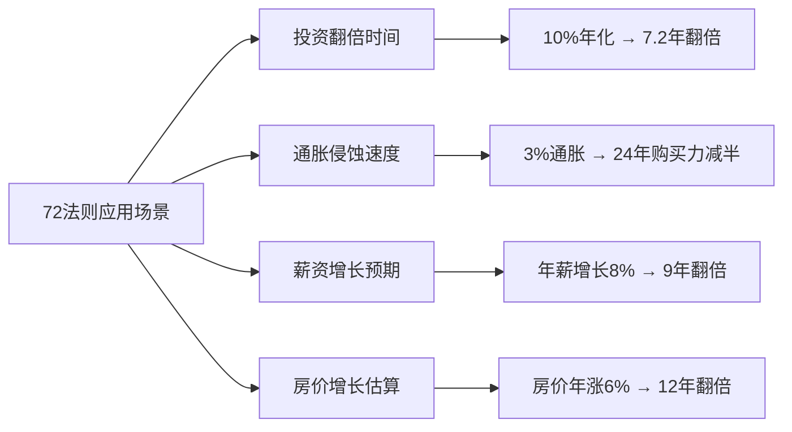
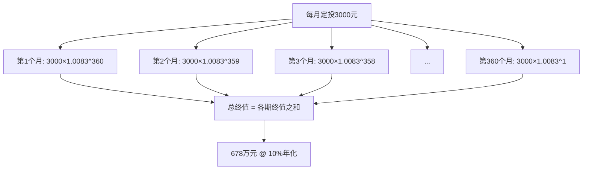

## 2.6 复利的数学原理与心理效应

> "复利是世界第八大奇迹。理解它的人，赚取它；不理解它的人，付出它。"——常被归于爱因斯坦

复利不只是一条数学公式，它是财富增长的核心引擎。理解复利的数学本质，认清阻碍我们践行复利的心理陷阱，并找到具体的破解方法，是从"知道复利"到"真正用复利致富"的关键跨越。

### 2.6.1 复利公式的数学本质

#### 基本公式与变量解析

复利公式：

$$A = P(1 + r)^n$$

其中：
- **A**：最终金额（终值）
- **P**：初始本金（现值）
- **r**：每期利率（年化收益率）
- **n**：计息期数（投资年数）

这个公式的本质是**指数函数**。与线性增长（单利 $A = P(1 + rn)$）不同，复利的每一期收益都会加入本金，下一期在更大的基数上产生收益——这就是"利滚利"。

用拆解的方式理解：第一年末你有 $P(1+r)$，第二年末你有 $P(1+r)(1+r) = P(1+r)^2$，以此类推。每一期的乘数都是 $(1+r)$，连乘 $n$ 次就是指数增长。

#### 单利与复利的鸿沟

以10万元本金、年化10%为例：

| 年限 | 单利终值 | 复利终值 | 复利/单利倍数 |
|------|----------|----------|---------------|
| 5年 | 15.0万 | 16.1万 | 1.07倍 |
| 10年 | 20.0万 | 25.9万 | 1.30倍 |
| 20年 | 30.0万 | 67.3万 | 2.24倍 |
| 30年 | 40.0万 | 174.5万 | 4.36倍 |
| 50年 | 60.0万 | 1173.9万 | 19.57倍 |

前5年差距微小（7%），但30年后复利是单利的4.4倍，50年后接近20倍。**时间越长，复利的威力越大。** 这就是为什么巴菲特99%的财富是在50岁之后获得的——他从11岁开始投资，复利滚动了70多年。

#### 变量敏感性分析

三个变量（本金P、收益率r、期数n）对终值的影响程度完全不同。以10万元本金为基准：

| 情景设定 | 10年终值 | 20年终值 | 30年终值 |
|----------|----------|----------|----------|
| r=5%, P=10万 | 16.3万 | 26.5万 | 43.2万 |
| r=8%, P=10万 | 21.6万 | 46.6万 | 100.6万 |
| r=10%, P=10万 | 25.9万 | 67.3万 | 174.5万 |
| r=12%, P=10万 | 31.1万 | 96.5万 | 299.6万 |
| r=15%, P=10万 | 40.5万 | 163.7万 | 662.1万 |

**关键发现**：

- 收益率从5%提升到10%（提升5个百分点），30年后结果从43.2万跳到174.5万——相差4倍
- 收益率从10%提升到15%（再提升5个百分点），30年后从174.5万到662.1万——相差3.8倍
- **收益率的微小差异，在时间的作用下会被指数级放大**

这意味着：即使只提升1-2个百分点的年化收益率，长期来看也会产生巨大的财富差异。学习投资知识的"收益率"极高。

#### 连续复利

当计息频率趋向无穷（即每时每刻都在计息），公式变为：

$$A = Pe^{rt}$$

其中 $e ≈ 2.71828$ 是自然常数。这是复利的极限形态。虽然实际投资中不会真正实现"连续计息"，但这个公式揭示了一个重要概念：**复利频率越高，终值越大**。

不同计息频率的差异（本金10万，年化10%，10年）：

| 计息频率 | 终值 | 比年复利多出 |
|----------|------|--------------|
| 年复利 | 25.94万 | — |
| 半年复利 | 26.53万 | +0.59万 |
| 季度复利 | 26.85万 | +0.91万 |
| 月复利 | 27.07万 | +1.13万 |
| 日复利 | 27.18万 | +1.24万 |
| 连续复利 | 27.18万 | +1.24万 |

月复利和年复利的差距看似不大（1.13万），但放在30年周期和更大本金上，差距会显著放大。这也是为什么某些理财产品强调"日计息"——频率越高，实际收益率（有效年利率EAR）越高。

#### 有效年利率（EAR）

名义年利率和实际年利率之间存在差异。公式：

$$EAR = (1 + \frac{r}{m})^m - 1$$

其中 $m$ 是年计息次数，$r$ 是名义年利率。

| 名义利率 | 计息方式 | 有效年利率（EAR） |
|----------|----------|-------------------|
| 10% | 年付 | 10.00% |
| 10% | 半年付 | 10.25% |
| 10% | 季付 | 10.38% |
| 10% | 月付 | 10.47% |
| 10% | 日付 | 10.52% |

**实操意义**：比较理财产品时，不要只看名义利率，要换算成EAR才能公平对比。一个标注"年化10%、月付息"的产品，实际EAR是10.47%，优于"年化10.2%、年付息"的产品。

#### 72法则与快速估算

**72法则**是复利计算中最实用的心算工具：

$$翻倍所需年数 ≈ \frac{72}{年化收益率(\%)}$$

| 年化收益率 | 72法则估算 | 精确值 | 误差 |
|-----------|-----------|--------|------|
| 3% | 24年 | 23.45年 | +2.3% |
| 6% | 12年 | 11.90年 | +0.8% |
| 8% | 9年 | 9.01年 | -0.1% |
| 10% | 7.2年 | 7.27年 | -1.0% |
| 12% | 6年 | 6.12年 | -2.0% |
| 15% | 4.8年 | 4.96年 | -3.2% |

72法则在收益率3%-15%范围内误差极小，是快速评估投资方案的利器。衍生用法：

- **72÷通胀率** = 购买力减半所需年数（通胀3%→24年购买力减半）
- **72÷薪资增长率** = 收入翻倍所需年数
- **110法则**：更精确的翻三倍估算（$110÷收益率\%$）



#### 对数思维：理解指数增长的正确方式

人类大脑天生擅长线性思维，不擅长指数思维。一个实用的转换方法：**用对数坐标思考复利**。

在对数坐标下，指数增长变成直线——斜率就是收益率。这让你能更准确地比较不同投资方案的增长速度，而不会被绝对数字的"曲棍球杆"曲线迷惑。

具体方法：取终值的对数 $\ln(A) = \ln(P) + n \cdot \ln(1+r)$，这是一个关于 $n$ 的线性方程，斜率 $\ln(1+r)$ 就代表增长速度。当 $r$ 较小时，$\ln(1+r) ≈ r$，所以可以直接用收益率近似比较。

### 2.6.2 定投的复利加速效应

定期定额投资（Dollar Cost Averaging, DCA）是普通人利用复利最实用的工具。

#### 定投的数学模型

假设每月定投 $C$ 元，月收益率为 $r_m = (1+r_{年})^{1/12} - 1$，则 $n$ 个月后总价值：

$$FV = C \times \frac{(1+r_m)^n - 1}{r_m}$$

这是**年金终值公式**。以每月定投3000元为例：

| 年化收益率 | 10年终值 | 20年终值 | 30年终值 | 总投入 |
|-----------|----------|----------|----------|--------|
| 5% | 46.6万 | 123.3万 | 250.3万 | 108万 |
| 8% | 54.9万 | 176.5万 | 447.1万 | 108万 |
| 10% | 61.7万 | 228.0万 | 678.1万 | 108万 |
| 12% | 69.5万 | 298.3万 | 1048.5万 | 108万 |

30年投入108万本金，在10%年化下变成678万——收益是本金的5.3倍。在12%年化下更是接近10倍。

#### 定投的时间杠杆

定投最大的秘密在于：**前期投入的资金复利时间最长，贡献了大部分收益**。

以月投3000元、年化10%、投30年为例，分析各阶段投入资金的贡献：

| 投资阶段 | 投入金额 | 30年末价值 | 收益倍数 |
|----------|----------|------------|----------|
| 第1-10年（36万） | 36万 | 437万 | 12.1倍 |
| 第11-20年（36万） | 36万 | 165万 | 4.6倍 |
| 第21-30年（36万） | 36万 | 76万 | 2.1倍 |

前10年投入的36万，到30年末变成了437万，占总终值的64%。**这就是"早开始"的价值——每晚一年开始，损失的不是一年的收益，而是那一年本金在剩余全部时间里的复利。**

#### 定投的三大实战优势

**优势一：强制储蓄机制**

将定投设为工资日自动扣款（"先支付自己"），等于把储蓄变成默认行为。行为经济学研究表明，"默认选项"对人的行为有巨大影响——opt-out（默认参与）比opt-in（主动参与）的参与率高出3-4倍。

**优势二：自动摊平成本**

市场低迷时，同样的金额买入更多份额；市场高涨时，买入较少份额。长期下来，平均成本低于市场均价。以沪深300指数为例，2015年1月至2024年12月期间：

- 指数均价：约3,800点
- 定投均价：约3,520点（低约7.4%）

这个差距看似不大，但在复利作用下，30年后会放大为可观的额外收益。

**优势三：复利叠加效应**

定投不是简单的"本金×收益率"，而是每一期投入都在各自的时间轴上产生复利。第1个月投入的3000元复利滚动了360个月，第360个月投入的3000元只滚动了1个月。这种"错层复利"结构让总收益远超一次性投入等额本金的收益。



#### 定投策略的优化进阶

基础版定投是"定期定额"，但可以通过策略优化进一步提升收益：

**估值定投法**：根据市场估值（如PE百分位）动态调整定投金额。PE低于历史30%分位时加倍投入，高于70%分位时减半投入。回测数据显示，此策略比普通定投年化收益可提升1-2个百分点。

**目标市值法**：设定每月目标持仓市值（如每月增加5000元市值），实际持有不足时补投，超出时暂停。这种方法确保资产匀速增长，避免"高位多买、低位少买"的反向操作。

### 2.6.3 复利的心理障碍

理解复利的数学原理只需几分钟，但真正践行复利却需要对抗人类几百万年进化形成的心理本能。

#### 障碍一：双曲贴现——人类天生短视

行为经济学中的"双曲贴现"（Hyperbolic Discounting）揭示：人类对延迟回报的"折价"不是恒定的，而是随时间推移急剧加速。实验数据显示：

- 给受试者选择"今天拿100元"还是"一个月后拿110元"，多数人选今天
- 但同一批人在"12个月后拿100元"和"13个月后拿110元"之间，多数人选后者

两者的收益率完全相同（月化10%），但"现在"这个词就像一个黑洞，扭曲了我们的判断。神经科学研究发现，即时奖励激活的是大脑的边缘系统（情绪中枢），而延迟奖励激活的是前额叶皮层（理性中枢）——两者在"拔河"，而边缘系统通常赢。

**破解方法**：

1. **心理账户隔离**：把投资的钱当作"已花掉的钱"。开设独立的投资账户，从物理上与消费账户分离
2. **预承诺机制（Pre-commitment）**：使用定期定投的自动扣款，让系统替你做决策，绕过每次都要"自控"的消耗
3. **可视化未来**：在手机壁纸上放一张写着"2054年的你"的图片，或者用投资计算器生成自己70岁时的资产预测图，让"未来自我"变得具体

#### 障碍二：线性思维——无法直觉感受指数增长

经典实验：一张纸对折50次有多厚？

大多数人猜几十厘米或几米。正确答案：约1.12亿公里——相当于地球到太阳的距离（约1亿5000万公里）的75%。这就是指数增长的反直觉性。

沃顿商学院的研究者给MBA学生做了个测试：给一个指数增长的序列（如2, 4, 8, 16...），让学生预测第10项和第20项。结果发现，即使是顶级商学院的学生，对指数增长的预测也系统性地偏低——平均低估了75%。

**破解方法**：

1. **亲手计算**：用Excel或手机计算器，输入自己的实际数字（本金、收益率、年限），看具体的金额。数字比概念更有冲击力
2. **里程碑追踪**：不看"30年后678万"这个遥远目标，而是设定"第一个10万""第一个50万"等阶段目标。每达成一个里程碑，复利的"加速度"就会变得可感知
3. **年度复盘**：每年年底计算一次投资总收益，亲自感受"去年赚的钱比前年多"这个事实

#### 障碍三：损失厌恶——短期波动的心理创伤

诺贝尔奖得主卡尼曼和特沃斯基的前景理论揭示：**损失的痛苦是等额收益快感的2-2.5倍**。这意味着：

- 账户涨10%，你开心60分
- 账户跌10%，你痛苦150分
- 净效果：即使长期向上，短期波动让你净痛苦90分

正因如此，很多人在市场下跌20-30%时恐慌卖出，完美错过了后续的反弹和复利。标普500的历史数据显示：

| 投资行为 | 2003-2023年年化收益 |
|----------|---------------------|
| 全程持有（买入不动） | 9.8% |
| 错过涨幅最大的10个交易日 | 5.6% |
| 错过涨幅最大的20个交易日 | 2.9% |
| 错过涨幅最大的30个交易日 | 0.6% |

**仅仅错过20年里最好的10天（不到总交易日的0.25%），收益就腰斩。** 而这最好的10天，往往紧跟着最恐慌的下跌——如果在大跌后卖出，你几乎必然错过。

**破解方法**：

1. **降低查看频率**：从每天看一次改为每月看一次。研究表明，查看频率与焦虑程度正相关，与长期收益负相关
2. **预设"不操作"规则**：在投资前写下"无论市场如何波动，我不会在XX年内卖出"，贴在电脑旁
3. **认知重构**：市场下跌不是"亏钱"，而是"打折买入"。如果你是长期投资者，下跌是好事

#### 障碍四：注意力偏误——被噪声淹没信号

每天的财经新闻、K线图、专家预测，构成了巨大的"信息噪声"。这些噪声的特征是：**短期极不确定，长期高度可预测**。

| 时间维度 | 标普500上涨概率 |
|----------|----------------|
| 单日 | 53% |
| 单月 | 60% |
| 单年 | 73% |
| 任意5年 | 87% |
| 任意10年 | 95% |
| 任意20年 | 100%（历史上从未亏损） |

日频数据只有微弱的正偏（53%），几乎和抛硬币无异。但拉到10年维度，正收益概率高达95%。每天盯着日线图，等于用放大镜看噪声，把信号完全淹没。

**破解方法**：

1. **信息断舍离**：取消所有股票推送通知，取关短期预测类财经博主
2. **年度投资报告**：只看年报级别的数据，忽略一切短期波动
3. **投资日志**：每次想操作时，写下原因和预期。事后回顾你会发现，大部分操作都是多余的

#### 障碍五：锚定效应——被初始价格"钉住"

买入一只基金后，你会不自觉地以买入价为"锚"，每天计算盈亏。当价格低于买入价时，即使基本面没变，你也觉得自己在"亏钱"；当价格回到买入价时，你急于"解套"卖出——即使这时它的长期前景依然很好。

**破解方法**：

1. **关注持有成本 vs 当前价值的比率**，而不是绝对价格
2. **用定投自动摊平成本**，避免对单一价格点形成锚定
3. **定期重新评估**：问自己"如果今天空仓，我会不会以当前价格买入？"如果会，就没理由卖出

### 2.6.4 复利的三个加速器

认清心理障碍之后，主动推动复利加速需要在三个维度发力。

#### 加速器一：提高收益率——从5%到10%的跨越

提高收益率是复利最直接的杠杆，但也是风险最大的维度。

| 投资工具 | 长期年化收益 | 波动性 | 适合阶段 |
|----------|-------------|--------|----------|
| 银行存款/货币基金 | 2-3% | 极低 | 应急资金 |
| 债券基金 | 4-6% | 低 | 稳健配置 |
| 宽基指数基金 | 8-12% | 中等 | 核心仓位 |
| 主动型股票基金 | 6-15%（分化大） | 高 | 需选股能力 |
| 个股投资 | 不确定 | 极高 | 高阶玩家 |

**核心原则**：收益率的提升必须是"风险调整后"的提升。追求15%的收益但承担了可能亏损50%的风险，不如稳拿10%且最大回撤15%。

**具体策略**：

1. **资产配置优化**：经典的60/40股债组合长期年化约7-8%，纯债约4-5%。仅通过从纯债转为股债平衡，就能提升3个百分点——这3个百分点在30年后意味着5-6倍的终值差异
2. **降低费率**：主动基金管理费通常1.5%，指数基金0.1-0.5%。仅这1%的费率差异，30年就会侵蚀你终值的25-30%
3. **税收优化**：利用长期持有的税收优惠（中国A股持有超过1年免征资本利得税），避免频繁交易

#### 加速器二：增加本金投入——前期最有效的杠杆

在复利的早期阶段（前10-15年），增加本金的边际效果远大于提高收益率。

**具体方法**：

1. **提升储蓄率**：从20%提升到40%，投资本金直接翻倍。在复利早期，这比收益率从8%提到12%效果更显著
2. **收入增长再投资**：每次加薪、奖金、副业收入，拿出50%以上投入投资。心理学称之为"自动升级储蓄"
3. **减少不产生复利的支出**：区分"消耗型消费"和"投资型消费"。3000元的课程如果能提升你的收入能力，比3000元的包更值得

**量化对比**（假设年化10%）：

| 策略 | 每月投入 | 30年终值 |
|------|----------|----------|
| 基准 | 3000元 | 678万 |
| 储蓄率翻倍（投入6000元） | 6000元 | 1356万 |
| 收益率提到12%（投入不变） | 3000元 | 1049万 |
| 两者叠加 | 6000元 + 12% | 2097万 |

增加本金在前期更有效，但随着时间推移，收益率的优势会逐渐凸显。**最佳策略是在前期重点提升本金（努力工作、增加收入），在后期重点提升收益率（精进投资技能）。**

#### 加速器三：延长时间——每早一年的隐形收益

时间是复利最强的加速器，因为指数函数的增长速度随时间递增。

**早开始10年的差距**（月投3000元，年化10%）：

| 开始年龄 | 投资年限 | 60岁终值 | 差距 |
|----------|----------|----------|------|
| 25岁 | 35年 | 1102万 | 基准 |
| 30岁 | 30年 | 678万 | -424万（-38%） |
| 35岁 | 25年 | 396万 | -706万（-64%） |
| 40岁 | 20年 | 228万 | -874万（-79%） |

晚开始5年，最终少424万；晚开始15年，少706万。**每晚一年开始投资，在60岁时的代价不是"少一年的收益"，而是数十万甚至上百万。**

这个差距无法通过后期"追加投入"弥补——即使35岁开始的人每月投入6000元（翻倍），30年后也只有792万，仍然追不上25岁开始、月投3000元的人。

```mermaid
graph LR
    subgraph "三个加速器的协同效应"
        A[提高收益率 r] --> D[终值 A = P(1+r)^n]
        B[增加本金 P] --> D
        C[延长时间 n] --> D
    end
    subgraph "各阶段重点"
        E[前期 25-35岁] --> F[主攻：增加本金]
        G[中期 35-50岁] --> H[主攻：提高收益率]
        I[后期 50岁+] --> J[主攻：延长时间+降低风险]
    end
```

### 2.6.5 复利的敌人：通胀与税收

名义复利不等于真实复利。侵蚀复利收益的两大隐形杀手是通胀和税收。

#### 通胀的真实侵蚀

假设年通胀率3%，不同名义收益率下的实际购买力增长：

| 名义收益率 | 实际收益率（扣除3%通胀） | 30年名义终值 | 30年实际终值 |
|-----------|--------------------------|-------------|-------------|
| 5% | ≈1.94% | 43.2万 | 24.3万 |
| 8% | ≈4.85% | 100.6万 | 56.9万 |
| 10% | ≈6.80% | 174.5万 | 98.8万 |
| 12% | ≈8.74% | 299.6万 | 169.6万 |

精确计算：实际收益率 = $(1+名义收益率)/(1+通胀率) - 1$，而非简单相减。

**通胀3%看似温和，但它在30年里把你的购买力削掉了近一半。** 如果你的投资年化只有5%，扣除通胀后实际年化不到2%，30年只增值24%——远不如名义上看起来的4.3倍。

这意味着：**如果你把钱全部存在银行（2-3%），你不是在"理财"，而是在"缓慢亏损"**——因为通胀在以更快的速度侵蚀你的购买力。

#### 税收的复利惩罚

频繁交易不仅增加交易成本，还触发短期资本利得税（如果有），相当于每次复利计算前先"打折"。

假设年化收益10%，对比不同交易频率下的终值（考虑每次交易2%的摩擦成本）：

| 交易频率 | 每次摩擦成本 | 等效年化收益 | 30年终值（10万本金） |
|----------|-------------|-------------|---------------------|
| 从不交易 | 0% | 10% | 174.5万 |
| 每年调仓一次 | 0.5% | 9.5% | 153.8万 |
| 每季度调仓 | 0.5% | 8.0%（近似） | 100.6万 |
| 每月交易 | 1% | 6.2%（近似） | 60.1万 |

每月交易、每次1%摩擦成本，30年终值只有60万——是从不交易的174万的34%。**交易频率和摩擦成本是复利的天敌。**

### 2.6.6 复利的非金融应用

复利不仅适用于金钱，它是一切"正反馈系统"的底层规律。

#### 知识的复利

每学一个新概念，你理解下一个相关概念的能力都会增强。一个读了100本投资书的人，读第101本的速度和理解深度，远超读第1本时的状态。

知识复利的关键：**学习内容之间要有相关性**。东学一点西学一点（随机投资），不如在一个领域深耕（集中投资），因为相关知识之间会形成"知识网络"，产生指数级的理解力提升。

#### 技能的复利

编程能力、写作能力、演讲能力——每提升一级，你在工作中的产出效率都会提高，释放更多时间用于进一步提升。这就是为什么顶级专家的收入是初级从业者的100倍甚至1000倍——不是他们100倍努力，而是技能的复利效应。

#### 关系的复利

长期维护的高质量人脉会产生"关系复利"。一个认识10年、互相帮助过多次的朋友，在关键时刻能提供的帮助，远超10个刚认识的人的总和。信任需要时间积累，而信任一旦建立，就会产生指数级的合作价值。

#### 健康的复利

每天运动30分钟，短期内看不出差别。但10年后，坚持运动的人和不运动的人在精力、体态、慢性病风险上的差距会变得惊人。健康是所有复利的基础——没有健康，其他一切都无从谈起。

### 2.6.7 常见误区与纠正

#### 误区一："复利就是躺着等钱变多"

**事实**：复利需要持续投入和耐心持有。不投入新本金、不坚持持有、频繁操作，都会打断复利链条。复利不是"被动"的——你需要主动做两件事：持续投入，控制不动。

#### 误区二："收益率越高越好"

**事实**：追求过高收益率通常意味着承担过大风险。巴菲特的长期年化"只有"约20%，但他持续了60年。很多人在牛市一年赚100%，但熊市亏80%——长期下来远不如稳定的15%。**可持续的收益率远比一时的高收益率重要。**

计算一个对比：
- 方案A：年化20%但每隔5年有一次-40%的回撤
- 方案B：年化12%但最大回撤-15%

30年后，方案B的终值可能更高，因为方案A的每次回撤都会大幅侵蚀复利基数。

#### 误区三："我已经错过了最佳时机"

**事实**：投资最好的时间是10年前，其次是现在。即使你现在40岁开始，到60岁还有20年——以10%年化、月投3000元计算，20年后仍有228万。不开始的损失永远大于晚开始的损失。

#### 误区四："小额投资没有意义"

**事实**：月投500元、年化10%、30年后是113万。不要因为金额小就放弃。定投的起点可以很低（很多基金100元起投），关键在于开始和坚持。

#### 误区五："复利公式假设收益率恒定，现实中不可能"

**事实**：虽然年收益率会有波动，但长期平均收益率是可以实现的。标普500过去100年的年化收益约10%（含分红再投资），沪深300自2005年以来年化约8-9%。复利公式中的r是平均收益率，不是每一年的实际收益率。实际操作中，好的年份和差的年份会"平均化"。

### 2.6.8 实操工具与模板

#### Excel/表格复利计算器

```text
复利终值计算器使用方法：
┌──────────────────────────────────────────┐
│ 单元格A1: 本金（如100000）               │
│ 单元格A2: 年化收益率（如0.10）           │
│ 单元格A3: 投资年数（如30）               │
│ 单元格A4: =A1*(1+A2)^A3                 │
│ 结果：1,744,940                          │
├──────────────────────────────────────────┤
│ 定投终值计算器：                         │
│ 单元格B1: 每月定投额（如3000）           │
│ 单元格B2: 年化收益率（如0.10）           │
│ 单元格B3: 投资年数（如30）               │
│ 月收益率 = (1+B2)^(1/12)-1              │
│ 总月数 = B3*12                          │
│ 单元格B4: =B1*((1+月收益率)^总月数       │
│           -1)/月收益率                    │
│ 结果：6,781,463                          │
└──────────────────────────────────────────┘
```

#### 定投复利的可视化追踪

建议用表格追踪定投进度，每月更新一次：

```text
月度定投追踪表
┌──────┬──────┬──────┬──────┬──────┬──────┐
│ 月份 │ 投入 │ 市值 │ 收益 │ 收益率│ 份额 │
├──────┼──────┼──────┼──────┼──────┼──────┤
│ 202501│ 3000 │ 3020 │  20  │ 0.67%│ 500  │
│ 202502│ 3000 │ 5800 │ -200 │-1.72%│ 510  │
│ 202503│ 3000 │ 9200 │  200 │ 2.17%│ 490  │
│ ...   │ ...  │ ...  │ ...  │ ...  │ ...  │
│ 合计  │ 累计 │ 当前 │ 累计 │ 年化 │ 累计 │
└──────┴──────┴──────┴──────┴──────┴──────┘
关键指标：
- 累计投入 vs 当前市值 → 总收益
- 平均成本 = 累计投入 / 累计份额
- 当前净值 vs 平均成本 → 成本优势
```

#### 复利思维决策清单

遇到任何财务决策时，用以下清单评估：

1. 这笔钱如果投资，按我的年化收益率，10年后值多少？（用72法则快速估算）
2. 这个消费的"复利成本"是多少？（花掉的不只是当前金额，还有这笔钱未来几十年的复利）
3. 这笔投入能产生复利效应吗？（教育→技能→收入→投资→复利 = 有；消费品 = 无）
4. 我是在为"现在的感觉"买单，还是在为"未来的自由"投资？

### 2.6.9 巴菲特的复利人生：终极案例

沃伦·巴菲特是复利原理最伟大的实践者：

| 关键数据 | 数值 |
|----------|------|
| 开始投资年龄 | 11岁 |
| 当前年龄 | 94岁 |
| 投资年限 | 83年 |
| 长期年化收益率 | 约19.8% |
| 当前净资产 | 约1400亿美元 |

关键事实：巴菲特99.7%的财富是在50岁之后获得的，95%的财富是在60岁之后获得的。如果他在30岁就停止投资（即使把已有的100万保持增长），到94岁时他的资产约为8亿美元——仅是实际财富的0.06%。

这个案例完美诠释了复利的三个加速器：极长的时间（83年）、合理的收益率（19.8%）、以及持续的本金增加（通过伯克希尔的保险浮存金不断获得低成本资金用于再投资）。

更值得注意的是巴菲特的"反面教材"：他的搭档查理·芒格曾说，如果去掉巴菲特投资生涯中最好的10笔交易，他的表现将相当平庸。这意味着：**复利的关键不是每天都赚钱，而是在少数关键机会上做出正确的大决策，然后长期持有不动。**

### 2.6.10 本节要点回顾

```mermaid
mindmap
  root((复利的原理与心理))
    数学本质
      指数函数 A=P(1+r)^n
      72法则快速估算
      有效年利率EAR
      连续复利极限
    定投加速
      年金终值公式
      前期投入复利最长
      摊平成本效应
      估值定投优化
    心理障碍
      双曲贴现→短视
      线性思维→低估指数
      损失厌恶→恐慌卖出
      注意力偏误→噪声干扰
      锚定效应→解套心理
    三个加速器
      提高收益率
      增加本金投入
      延长时间
    敌人
      通胀侵蚀购买力
      税收与摩擦成本
    非金融应用
      知识复利
      技能复利
      关系复利
      健康复利
```

**核心行动建议**：

1. **今天就开始**：哪怕月投500元，也比等待"更好的时机"强一万倍
2. **设置自动定投**：让系统替你克服心理障碍
3. **降低交易频率**：买入并持有，让复利不被打断
4. **每年复盘一次**：感受复利的真实增长，增强信心
5. **持续学习投资**：提升1-2个百分点的收益率，30年后差异数百万
