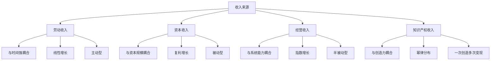
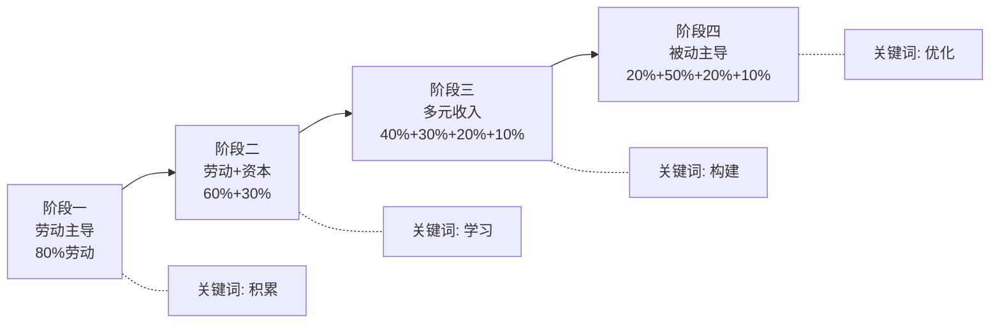
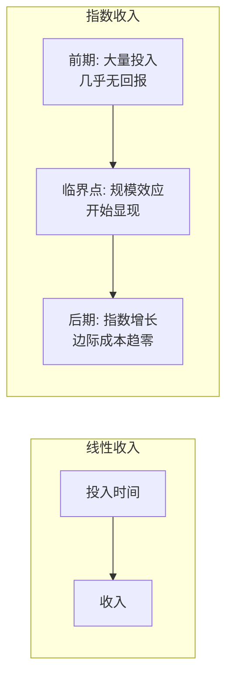

## 2.7 收入结构的深度分析

收入不是单一维度的数字，而是一个结构。结构决定了你的财务上限、抗风险能力和增长潜力。两个人月入同样3万，一个全部来自工资，另一个由工资1.5万+房租0.8万+股息0.5万+课程分成0.2万构成——他们的财务状况天差地别。前者一旦失业即归零，后者即使失去两个收入来源，生活依然稳定。

本节将系统拆解收入的底层结构，建立从"出卖时间"到"拥有系统"的认知框架，并给出可执行的转型路径。

### 2.7.1 收入的四维分类模型

收入的本质区别不在于金额大小，而在于它与**时间**、**资本**、**系统**和**创造力**四个维度的耦合关系。理解这四个维度，才能看清每种收入的天花板和杠杆点。



#### 第一类：劳动收入——时间的等价交换

**定义与机制**：劳动收入是通过出卖时间和技能获得的报酬。它的底层逻辑是**时间单价×工作时长**。无论你是月薪3000的文员还是时薪3000的律师，本质上都是在做同一件事——把时间卖给雇主或客户。

**数学模型**：

```text
年劳动收入 = 时薪 × 日工作时长 × 年工作天数
```

以中国一线城市为例：
| 职业 | 时薪（元） | 日工作时长 | 年工作天数 | 年收入（万） |
|------|-----------|-----------|-----------|-------------|
| 普通白领 | 60-100 | 10h | 250天 | 15-25 |
| 资深工程师 | 200-400 | 10h | 250天 | 50-100 |
| 顶级咨询师 | 1000-3000 | 8h | 200天 | 160-480 |
| 自由翻译 | 100-300 | 6h | 200天 | 12-36 |

**关键特征**：
- **有明确上限**：一天最多24小时，扣除睡眠和生活必须时间，可出售时间上限约12-14小时。即使时薪再高，总收入也有天花板。
- **线性增长**：收入增长依赖于提升时薪（技能升级、跳槽谈判）或增加工时（加班、兼职），两条路径都有明确上限。
- **停手即停收**：生病、休假、失业，收入立即中断。没有任何缓冲机制。
- **税收刚性**：劳动所得适用3%-45%超额累进税率，且由雇主代扣代缴，几乎没有合法避税空间。

**提升劳动收入的三条路径**：

1. **提升单位时间价值**：从执行者→专家→顾问→合伙人。每一步跃迁，时薪可能翻3-10倍。关键动作：建立个人专业品牌、获取稀缺资质、积累行业口碑。
2. **从计时转向计价**：从"按小时收费"转向"按项目收费"或"按价值收费"。一个网站建设项目报价5万，你可能只花40小时完成——等效时薪1250元，远超按时薪计价。
3. **将技能产品化**：把你的专业能力封装成可重复销售的产品（模板、课程、工具），从"一次服务一人"变成"一次服务多人"。

#### 第二类：资本收入——钱生钱的复利引擎

**定义与机制**：资本收入是通过资本运作（投资、存款、购买资产）获得的报酬。它的底层逻辑是**本金×收益率×时间**。与劳动收入最大的区别在于：资本收入不需要你亲自投入时间，钱在替你工作。

**数学模型**：

```text
终值 = 本金 × (1 + 年化收益率)^年数
```

复利的力量在长期维度上是惊人的：
| 本金（万） | 年化收益率 | 10年终值（万） | 20年终值（万） | 30年终值（万） |
|-----------|-----------|---------------|---------------|---------------|
| 10 | 5% | 16.3 | 26.5 | 43.2 |
| 10 | 8% | 21.6 | 46.6 | 100.6 |
| 10 | 12% | 31.1 | 96.5 | 299.6 |
| 50 | 8% | 107.9 | 233.0 | 503.1 |

**关键特征**：
- **与时间脱钩**：你睡觉时钱也在增长。这是真正意义上的"被动收入"。
- **复利效应**：收益再投入，产生"利滚利"。时间越长，复利威力越大。
- **需要初始资本**：没有本金就没有起点。这是劳动收入阶段必须积累的。
- **存在波动风险**：资本市场有涨有跌，短期内可能亏损。需要风险管理和心理承受力。
- **税收优势**：中国A股持有超过1年免征个人所得税；房产持有成本低；部分理财产品收益免税或低税。

**资本收入的六大类别**：

| 类别 | 预期年化 | 流动性 | 风险等级 | 门槛 | 适合阶段 |
|------|---------|--------|---------|------|---------|
| 银行存款/货币基金 | 1.5%-3% | 极高 | 极低 | 无 | 入门 |
| 债券/债券基金 | 3%-6% | 高 | 低 | 低 | 入门 |
| 指数基金定投 | 8%-12% | 高 | 中 | 低 | 进阶 |
| 股票投资 | 10%-20%+ | 高 | 高 | 中 | 高级 |
| 房产投资 | 3%-8%+租金 | 低 | 中 | 高 | 中期 |
| 私募/风投 | 20%+或亏损 | 极低 | 极高 | 极高 | 资深 |

**建立资本收入的核心策略**：

1. **先储蓄后投资**：强制储蓄率不低于收入的30%。没有本金，一切投资理论都是空谈。
2. **指数基金定投起步**：沪深300、中证500等宽基指数，长期年化8%-12%。适合大多数人，不需要选股能力。
3. **逐步建立投资组合**：随着知识和资本积累，配置债券、股票、REITs、商品等多资产类别，降低波动。
4. **控制回撤比追求收益更重要**：亏损50%需要上涨100%才能回本。风险管理是资本收入的生命线。

#### 第三类：经营收入——构建系统获取杠杆

**定义与机制**：经营收入是通过经营企业、项目或商业系统获得的报酬。它的核心是**搭建一个不完全依赖你个人时间运转的系统**，让他人的时间、资本和技术为你创造价值。

**数学模型**：

```text
经营利润 = 客户数 × 客单价 × 复购率 - 运营成本
```

经营收入的本质是**杠杆**——你雇佣员工、使用资本、搭建流程，让系统的产出远超你个人时间的产出。

**关键特征**：
- **可规模化**：从服务1个客户到服务100万个客户，边际成本递减甚至趋近于零（互联网业务）。
- **需要管理能力**：团队、流程、财务、法律、营销——经营是一个多维度的系统工程。
- **存在失败风险**：创业失败率在中国约80%-90%（3年存活率）。高收益对应高风险。
- **税收结构优化空间大**：企业所得税25%（小微企业可低至5%），可以通过合理的企业架构进行税务规划。

**经营收入的三种模式**：

**模式一：服务型经营**
- 特点：低启动成本，依赖个人专业能力，难以规模化
- 例子：咨询公司、设计工作室、培训机构
- 天花板：受限于团队规模和人均产出
- 适合：专业能力强、有行业资源的人

**模式二：产品型经营**
- 特点：前期投入大，一旦成功可大规模复制
- 例子：实体产品（消费品）、软件产品（SaaS）、数字产品（课程）
- 天花板：取决于市场规模和竞争格局
- 适合：有产品思维、能组建团队的人

**模式三：平台型经营**
- 特点：连接供给和需求，收取佣金或广告费
- 例子：电商平台、内容平台、服务平台
- 天花板：赢家通吃，头部效应极强
- 适合：有资本、有技术、能快速扩张的团队

**从劳动收入过渡到经营收入的实操路径**：


具体步骤：
1. **从副业开始**：不要裸辞创业。在保住劳动收入的同时，用业余时间验证商业模式。
2. **找到可复制的服务/产品**：把你最擅长的事情标准化、流程化，让它可以被其他人执行。
3. **雇佣第一人**：当业务量超过你个人处理能力时，雇佣一个执行者，你转为监督和获客。
4. **建立财务体系**：严格区分个人账户和企业账户，做好记账和税务规划。
5. **逐步脱手日常运营**：培养管理团队，建立KPI和SOP，让系统自运转。

#### 第四类：知识产权收入——创造力的复利

**定义与机制**：知识产权收入是通过创造具有知识产权保护的内容、技术或品牌获得的报酬。它的核心是**一次创造，持续变现**。这是唯一一种"睡后收入"能真正超过"工作收入"的类型——前提是你的创造物有足够的市场需求。

**数学模型**：

```text
累计收入 = 单次变现金额 × 销售次数 × 时间跨度
```

**关键特征**：
- **边际成本趋近于零**：一本书写完后，多卖一本的印刷成本几乎为零；一个课程录制完后，多一个学员不需要额外投入。
- **幂律分布**：头部10%的创作者获得90%的收入。要么成为头部，要么几乎赚不到钱。
- **需要时间积累**：内容创作、技术专利都需要前期投入大量时间，变现周期长。
- **受法律保护**：著作权、专利权、商标权提供法律壁垒，但维权成本高。

**知识产权收入的六种形式**：

| 形式 | 创作周期 | 变现周期 | 收入上限 | 难度 | 典型案例 |
|------|---------|---------|---------|------|---------|
| 出版书籍 | 3-12个月 | 持续数年 | 版税几万到几百万 | 中 | 技术书籍、畅销书 |
| 在线课程 | 1-6个月 | 持续1-3年 | 几万到几千万 | 中 | 得到、知乎Live |
| 软件/工具 | 1-12个月 | 持续数年 | 无上限 | 高 | 独立开发者产品 |
| 专利授权 | 6-24个月 | 持续10-20年 | 几万到几亿 | 高 | 技术专利 |
| 音乐/艺术 | 不定 | 持续数十年 | 幂律分布 | 高 | 版权收入 |
| 品牌/商标 | 长期 | 持续无限 | 无上限 | 极高 | 品牌授权 |

**建立知识产权收入的策略**：

1. **选择复利型赛道**：优先选择那些内容可以长期有效、市场需求持续的领域。技术教程比时事评论更有长尾价值。
2. **先建立影响力**：在公开平台（知乎、B站、GitHub、公众号）持续输出免费内容，积累受众后再变现。
3. **多渠道分发**：同一内容在多个平台销售，最大化单次创作的收益。一个课程可以在自有平台、腾讯课堂、网易云课堂同时销售。
4. **持续迭代更新**：知识产权的价值会随时间衰减（技术过时、内容陈旧），需要定期更新维护。

### 2.7.2 收入结构优化的四阶段路径

收入结构转型不是一蹴而就的，而是一个渐进的过程。每个阶段有不同的重心和关键动作。



#### 阶段一：以劳动收入为主（占比80%以上）

**典型画像**：刚毕业的职场新人，或工作3-5年尚未开始投资的人。

**核心任务**：
- **提升专业能力**：这是阶段一最重要的事。你的时薪从50元涨到200元，比你学任何投资技巧都有效。
- **强制储蓄**：每月收入的30%强制储蓄，建立6个月的紧急储备金。没有安全垫，任何投资都是赌博。
- **学习金融常识**：了解基本的投资品类、风险收益特征、税收政策。这个阶段学习比行动更重要。

**关键指标**：
- 月储蓄率 ≥ 30%
- 紧急储备金 = 6个月生活费
- 年收入增长率 ≥ 15%（通过跳槽、晋升、副业实现）

**常见错误**：
- ❌ 还没存够紧急储备金就开始炒股
- ❌ 为了追求高收益而忽略主业发展
- ❌ 盲目跟风投资热点（比特币、NFT等）

#### 阶段二：劳动收入+资本收入（60%+30%）

**典型画像**：工作5-10年，有一定积蓄，开始系统性投资的人。

**核心任务**：
- **建立投资体系**：确定自己的风险偏好、投资期限、资产配置方案。不再盲目跟风，而是有计划地执行。
- **定投指数基金**：每月固定金额投入宽基指数基金，利用时间和复利的力量。这是最适合普通人的投资方式。
- **学习房产投资**：了解房贷杠杆、租售比、城市分化等核心概念。房产是大多数中国家庭最大的资产配置。

**关键指标**：
- 投资组合年化收益率 ≥ 8%
- 被动收入覆盖日常开支的30%
- 投资知识体系基本建立

**投资组合参考（100万本金）**：
| 资产类别 | 配比 | 预期年化 | 作用 |
|---------|------|---------|------|
| 货币基金 | 10% | 2% | 流动性储备 |
| 债券基金 | 20% | 4% | 稳定收益 |
| 沪深300指数 | 30% | 10% | 核心仓位 |
| 中证500指数 | 20% | 12% | 成长补充 |
| 港股/美股 | 10% | 10% | 全球分散 |
| 黄金 | 10% | 5% | 避险对冲 |
| **综合** | **100%** | **约7.6%** | — |

#### 阶段三：多元化收入（40%+30%+20%+10%）

**典型画像**：职场资深人士或早期创业者，拥有多元收入来源。

**核心任务**：
- **将专业能力产品化**：把你在主业中积累的技能封装成可销售的产品（咨询、课程、模板、工具）。
- **探索经营性收入**：可以是合伙创业、加盟、投资入股等方式。关键是找到一个能产生系统性收入的项目。
- **持续优化投资组合**：随着资本规模增大，可以配置更多元的资产（私募、海外资产等）。

**关键指标**：
- 被动收入超过主动收入的50%
- 至少有2-3个独立收入来源
- 开始有可规模化的收入项目

#### 阶段四：以被动收入为主（20%+50%+20%+10%）

**典型画像**：企业主、资深投资者、成功的内容创作者。

**核心任务**：
- **资产配置优化**：将重心从"赚钱"转向"守钱"和"传钱"。降低风险敞口，增加稳定现金流资产。
- **财富传承规划**：信托、保险、遗嘱等工具的运用，确保财富跨代传递。
- **回馈社会**：慈善捐赠、天使投资、知识分享——这不仅是道德义务，也是建立社会网络和影响力的方式。

**关键指标**：
- 被动收入覆盖所有生活开支的200%以上
- 资产配置抗风险能力强（能承受市场下跌30%而不影响生活）
- 有清晰的财富传承计划

### 2.7.3 收入结构诊断与优化工具

#### 诊断框架：五维收入健康度评估

回答以下问题，给自己的收入结构打分（每项1-5分）：

| 维度 | 诊断问题 | 评分标准 |
|------|---------|---------|
| **多样性** | 你有几个独立收入来源？ | 1个=1分，2个=3分，3个以上=5分 |
| **被动性** | 你停止工作后收入能维持多久？ | 1个月=1分，6个月=3分，永久=5分 |
| **成长性** | 你的收入年增长率是多少？ | <5%=1分，10-20%=3分，>30%=5分 |
| **可控性** | 你的收入有多少由自己掌控？ | <30%=1分，50-70%=3分，>80%=5分 |
| **抗风险性** | 失去最大收入来源后生活影响？ | 崩溃=1分，紧张=3分，无感=5分 |

**评分解读**：
- 5-10分：收入结构严重失衡，需要立即行动
- 11-15分：有一定基础，但仍有明显短板
- 16-20分：结构较健康，持续优化即可
- 21-25分：优秀，继续保持

#### 收入结构诊断模板

```text
═══════════════════════════════════════════
        个人收入结构诊断报告
═══════════════════════════════════════════

一、当前收入结构
┌─────────────┬──────────┬────────┐
│ 收入类型     │ 月收入(元) │ 占比   │
├─────────────┼──────────┼────────┤
│ 劳动收入     │          │        │
│ 资本收入     │          │        │
│ 经营收入     │          │        │
│ 知识产权收入 │          │        │
├─────────────┼──────────┼────────┤
│ 合计         │          │ 100%   │
└─────────────┴──────────┴────────┘

二、收入天花板分析
- 劳动收入天花板：___元/月（基于当前时薪和可工作时间上限）
- 资本收入天花板：___元/月（基于当前资本规模和合理收益率）
- 经营收入天花板：___元/月（基于当前商业模式和市场规模）
- 知识产权收入天花板：___元/月（基于当前内容产出和受众规模）

三、五维健康度评估
- 多样性：___/5
- 被动性：___/5
- 成长性：___/5
- 可控性：___/5
- 抗风险性：___/5
- 总分：___/25

四、优化行动计划
1. 短期（3个月）：
   - 目标：
   - 具体动作：
   
2. 中期（1年）：
   - 目标：
   - 具体动作：

3. 长期（3年）：
   - 目标：
   - 具体动作：
═══════════════════════════════════════════
```

### 2.7.4 收入转型的实操要点与常见误区

#### 税务优化的基本原则

不同收入类型的税负差异显著，合理规划可以节省大量成本：

| 收入类型 | 税率范围 | 优化方向 |
|---------|---------|---------|
| 工资薪金 | 3%-45% | 专项附加扣除、年终奖单独计税 |
| 劳务报酬 | 20%-40% | 转为经营所得（注册个体户/工作室） |
| 股息红利 | 0%-20% | 持有超1年A股免税 |
| 房产租金 | 4%-20% | 合理扣除修缮费、贷款利息 |
| 经营所得 | 5%-35% | 小规模纳税人优惠、合理列支成本 |
| 稿酬所得 | 实际约11.2% | 有20%减免+70%优惠 |

**重要提醒**：税务优化必须在法律框架内进行。偷税漏税的后果远大于省下的税款。

#### 收入转型中的八大常见误区

**误区一：急于辞职创业**
- 错误做法：看到别人创业成功就裸辞
- 正确做法：先用副业验证商业模式，当副业收入稳定超过主业时再考虑转型
- 参考标准：副业月收入 ≥ 主业月收入 × 1.5，且持续6个月以上

**误区二：忽略紧急储备金**
- 错误做法：把所有积蓄都投入股市或创业
- 正确做法：先建立6个月生活费的紧急储备金，再进行投资
- 紧急储备金存放：货币基金或银行活期，确保随时可取

**误区三：追求一夜暴富**
- 错误做法：All in单一高风险资产（加密货币、期货、杠杆炒股）
- 正确做法：建立多元化的收入和投资组合，接受"慢慢变富"
- 数据支撑：巴菲特99%的财富是在50岁之后获得的

**误区四：只看收益不看风险**
- 错误做法：追求年化30%以上的收益，忽视可能亏损50%的风险
- 正确做法：先评估自己能承受多大的亏损，再决定投资策略
- 核心公式：最大可承受亏损 = 不影响生活的金额

**误区五：过度分散**
- 错误做法：同时尝试10个副业项目，每个都浅尝辄止
- 正确做法：聚焦1-2个有潜力的方向，深入做到极致再扩展
- 原则：在主业稳固的基础上，每年只新增1个收入探索项目

**误区六：忽视法律风险**
- 错误做法：用个人账户收企业款项、不做合同、不做知识产权保护
- 正确做法：从一开始就建立合规的财务和法律体系
- 基础动作：注册公司或个体户、签订书面合同、申请商标和版权

**误区七：低估时间成本**
- 错误做法：为了省几千块自己做所有事情（记账、设计、法务）
- 正确做法：把低价值工作外包，把时间用在高价值活动上
- 判断标准：如果你的时薪是200元，而外包只要50元/小时，就应该外包

**误区八：没有退出策略**
- 错误做法：在亏损的投资上持续加仓"摊平成本"，在失败的项目上死撑
- 正确做法：提前设定止损线和退出标准，严格执行
- 框架：投资亏损超过20%时重新评估，项目6个月无正向现金流时考虑退出

### 2.7.5 高阶思维：收入结构的底层逻辑

#### 线性收入vs指数收入

理解收入结构的终极视角是区分**线性收入**和**指数收入**：

- **线性收入**：投入1单位时间，获得1单位报酬。投入2单位时间，获得2单位报酬。所有劳动收入都是线性的。
- **指数收入**：前期投入巨大但收益微薄，一旦突破临界点，收益呈指数增长。经营收入和知识产权收入具有指数特征。



这个认知框架解释了为什么：
- 作家写一本书可能花1年时间，收入只有几万版税；但一本畅销书可以卖几十年，累计收入远超写作投入。
- 创业者前3年可能颗粒无收；但一旦商业模式跑通，收入可以在几年内增长100倍。
- 内容创作者前100个视频可能只有几百播放量；但第101个视频可能突然爆火，带来指数级的关注和收入。

#### 杠杆的四种形式

Naval Ravikant 提出的四种杠杆，完美解释了收入结构的底层逻辑：

| 杠杆类型 | 定义 | 例子 | 边际成本 | 门槛 |
|---------|------|------|---------|------|
| 劳动力杠杆 | 让他人替你工作 | 雇佣员工 | 高（工资） | 中 |
| 资本杠杆 | 用钱生钱 | 投资基金 | 中 | 高 |
| 代码杠杆 | 软件自动运行 | SaaS产品 | 极低 | 高 |
| 媒体杠杆 | 内容一次创作无限传播 | 书籍、视频、播客 | 零 | 低 |

**关键洞察**：代码和媒体是新时代的杠杆——它们不需要别人许可（劳动力杠杆需要有人愿意为你工作，资本杠杆需要有人给你钱），而且边际成本趋近于零。

这就是为什么一个独立开发者可以凭借一个SaaS产品年入百万，一个YouTuber可以凭借视频内容年入千万——他们使用的是最强大的杠杆形式。

#### 从"卖时间"到"拥有系统"的跃迁

收入结构优化的终极目标是实现这个跃迁：

```text
卖时间 → 卖技能 → 卖产品 → 卖系统 → 让系统自动运转
```

每一步跃迁的关键：
1. **卖时间→卖技能**：建立可识别的专业能力，让时薪显著高于平均水平
2. **卖技能→卖产品**：把技能封装成可重复销售的产品（课程、模板、工具）
3. **卖产品→卖系统**：建立运营系统（团队、流程、平台），让产品自动销售和交付
4. **卖系统→让系统运转**：培养管理团队，建立治理结构，创始人退出日常运营

大多数人卡在第一步或第二步。能走到第三步的人已经是少数。走到第四步的人凤毛麟角——但正是这第四步，才是真正的财务自由。
