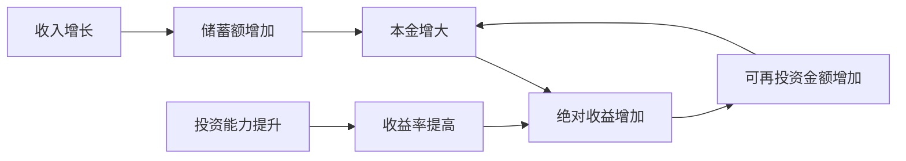
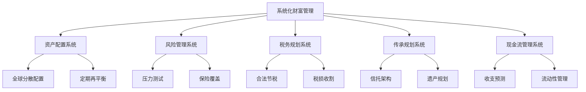

## 2.8 财富增长的阶段性特征

财富增长从来不是匀速运动。如果你画出一个人二十年的净资产曲线，它不会是一条直线，而是一条S形曲线——起初几乎不动，中间陡然上升，最后趋于平缓。理解这条曲线的形状、拐点和驱动力，是制定财富规划的前提。本节将从数学模型、阶段划分、跨越策略、心理陷阱和实操工具五个维度，系统拆解财富增长的阶段性规律。

### 2.8.1 为什么财富增长呈S曲线而非直线

#### 复利的非线性本质

财富增长的核心引擎是复利，而复利的数学本质是非线性的。复利公式为：

$$A = P(1 + r)^t$$

其中 $P$ 是本金，$r$ 是年化收益率，$t$ 是时间。这个幂函数的增长速度随 $t$ 增大而加快，但前提是本金 $P$ 要足够大，收益率 $r$ 要持续为正。

问题在于：大多数人起步时本金极小（几万到几十万），即使收益率不错，绝对收益也很低。10万元年化10%，一年才赚1万。这个数字不足以改变任何人的生活，因此看起来"复利没有用"。但当本金积累到100万时，同样的10%就是10万，相当于很多人一年的工资。这就是S曲线的形成机制——**前期慢，不是因为方法错了，而是因为本金基数太小**。

#### 收入增长的J曲线效应

除了投资收益，主动收入本身也呈J曲线特征：

| 职业阶段 | 年限 | 收入特征 | 增速 |
|---------|------|---------|------|
| 新手期 | 0-3年 | 低薪，学习为主 | 5-10%/年 |
| 成长期 | 3-8年 | 快速涨薪，跳槽红利 | 15-30%/年 |
| 成熟期 | 8-15年 | 薪资触顶，增长放缓 | 5-8%/年 |
| 平台期 | 15年+ | 收入稳定或转向被动收入 | 0-5%/年 |

主动收入和投资收益叠加后，整体财富曲线就呈现出明显的S形。

#### 正反馈循环的启动条件

S曲线中间那段陡峭上升，本质上是正反馈循环被激活了：



这个循环需要三个启动条件同时满足：
1. **本金超过临界点**：通常在50-100万之间，具体取决于个人生活成本
2. **收入增速超过消费增速**：即储蓄率在持续上升
3. **投资收益率稳定为正**：不需要很高，但必须持续

当这三个条件同时满足时，财富增速会突然加快，从"蜗牛爬"变成"滚雪球"。

### 2.8.2 四个阶段的完整拆解

#### 第一阶段：缓慢起步期（净资产 0-50万）

**核心特征**

这个阶段的典型画像：刚工作1-5年，月收入5000-15000元，扣除房租、生活费后每月能存2000-5000元。即使把所有存款投入理财，一年收益也不过几千元。这个阶段最折磨人的不是方法问题，而是**耐心问题**。

**关键数据**

| 指标 | 典型值 | 优化目标 |
|------|-------|---------|
| 月储蓄额 | 2000-5000元 | 5000-10000元 |
| 储蓄率 | 15-25% | 30-50% |
| 年化收益 | 3-5%（存款/货基） | 6-8%（指数基金） |
| 达到50万所需时间 | 8-12年 | 4-6年 |

**这个阶段最重要的三个动作**

1. **最大化储蓄率**：不是省钱，而是优化收入与支出的结构。具体方法：
   - 记账3个月，识别可优化的固定支出（如过高的房租、不必要的订阅）
   - 建立"先储蓄后消费"机制：工资到账当天自动转出30-50%到投资账户
   - 将意外收入（年终奖、副业收入）的100%直接投入储蓄

2. **建立投资纪律**：本金虽小，但必须从一开始就建立系统化的投资习惯
   - 选择1-2只宽基指数基金（如沪深300、中证500）
   - 设定每月固定日期自动定投
   - 不看盘、不择时、不追热点

3. **投资自己**：这个阶段投资自己的回报率远高于任何金融资产
   - 考取行业高含金量证书（如CPA、CFA、PMP）
   - 学习一项可变现的技能（编程、设计、写作）
   - 拓展人脉，为跳槽/创业做准备

**这个阶段的常见错误**

- ❌ 把大量时间花在研究个股上，试图"翻倍"。10万本金翻倍也才20万，但花的时间可以用来提升职业技能涨薪50%
- ❌ 过度节省导致生活质量极差，坚持不下去。储蓄率控制在30-50%即可，不必苦行僧
- ❌ 盲目追求高收益产品（P2P、数字货币、杠杆交易），本金损失后从零开始

#### 第二阶段：加速增长期（净资产 50-500万）

**核心特征**

这个阶段是财富增长最快、最令人兴奋的时期。本金已经有了一定规模，复利开始产生有意义的绝对收益。同时，这个阶段通常对应职业的快速上升期，收入也在快速增长。两者叠加，财富增速可能达到每年20-40%。

**关键数据**

| 指标 | 典型值 | 优化目标 |
|------|-------|---------|
| 年投资额 | 10-30万 | 30-50万 |
| 投资组合年化收益 | 5-8% | 8-12% |
| 被动收入占比 | 5-15% | 15-30% |
| 达到500万所需时间 | 10-15年 | 5-8年 |

**这个阶段的核心任务**

1. **资产配置升级**：从"只买基金"进化到多资产配置

   一个典型的50-500万阶段资产配置方案：

   | 资产类别 | 占比 | 预期年化 | 作用 |
   |---------|------|---------|------|
   | 宽基指数基金 | 40% | 8-12% | 核心增长 |
   | 债券基金/国债 | 20% | 3-5% | 稳定器 |
   | REITs/不动产 | 15% | 6-10% | 分红+通胀对冲 |
   | 行业/主题基金 | 10% | 高弹性 | 超额收益 |
   | 现金/货基 | 10% | 2-3% | 流动性储备 |
   | 另类投资 | 5% | 不确定 | 分散化 |

2. **收入结构优化**：开始构建多元收入来源
   - 主动收入：争取升职加薪或跳槽涨薪
   - 副业收入：利用专业技能接私活、做咨询
   - 投资收入：股息、利息、租金
   - 目标：到这个阶段末期，被动收入占总收入的20%以上

3. **风险管理体系建设**：
   - 建立6个月生活费的紧急备用金
   - 配置足额保险（重疾险、寿险、意外险）
   - 建立投资组合的再平衡机制（每季度或半年一次）

**这个阶段的常见错误**

- ❌ 收入增长后消费同步膨胀（生活方式通胀），导致储蓄率不升反降
- ❌ 过度自信，开始做超出自己能力圈的投资（如加杠杆炒股、投资不熟悉的行业）
- ❌ 忽视风险管理，觉得"我还年轻，亏了可以重来"。50万的亏损需要好几年才能弥补

#### 第三阶段：稳定增长期（净资产 500-2000万）

**核心特征**

进入这个阶段，投资收益的绝对值已经相当可观。假设年化8%，500万的年收益是40万，1000万是80万——这已经接近甚至超过很多人的工资收入。财富增长开始进入"自动驾驶"模式，个人精力可以从"赚钱"转向"管钱"。

**关键数据**

| 指标 | 典型值 | 优化目标 |
|------|-------|---------|
| 年投资收益 | 40-160万 | 50-200万 |
| 被动收入占比 | 30-50% | 50-70% |
| 投资组合波动率 | 10-15% | 8-12% |
| 达到2000万所需时间 | 8-15年 | 5-10年 |

**这个阶段的核心任务**

1. **资产配置精细化**：从"大概齐"到精确控制
   - 引入全球资产配置，降低单一市场风险
   - 考虑税务优化（如利用个人养老金账户、税优产品）
   - 适当配置另类资产（私募股权、对冲基金、艺术品等）

2. **被动收入系统化**：
   - 建立股息收入组合（高分红蓝筹+REITs）
   - 如果持有房产，优化租金收益率
   - 考虑建立小型现金流生意（如知识付费、自动化电商）

3. **专业团队建设**：
   - 聘请独立财务顾问（按小时收费，非销售导向）
   - 建立家庭CFO制度（定期审视资产负债表）
   - 考虑成立家族信托或有限合伙企业

**这个阶段的常见错误**

- ❌ 资产过于集中（如90%在房产上），一旦行业下行损失巨大
- ❌ 过于保守，大量资金放在银行存款里，被通胀侵蚀
- ❌ 不懂税务规划，每年多交几十万的税

#### 第四阶段：财富自由期（净资产 2000万+）

**核心特征**

被动收入完全覆盖生活开支。假设年化收益6%，2000万的年被动收入是120万，月均10万，足以在任何城市过上体面的生活。这个阶段的核心议题从"如何赚钱"转变为"如何让钱为我工作"和"如何有意义地花钱"。

**关键数据**

| 指标 | 典型值 | 优化目标 |
|------|-------|---------|
| 年被动收入 | 120-200万 | 150万+ |
| 生活开支覆盖率 | 150-300% | 200%+ |
| 投资组合分散度 | 5-8类资产 | 8-12类资产 |
| 财富传承准备度 | 低 | 完整规划 |

**这个阶段的核心任务**

1. **财富保全**：从"增长"转向"保值"
   - 资产配置向防守型倾斜（债券、保险、信托占比提高）
   - 建立法律架构保护资产（如家族信托、海外架构）
   - 定期进行压力测试（假设股市跌50%，生活是否受影响）

2. **财富传承规划**：
   - 制定遗嘱和遗产分配方案
   - 设立家族信托，确保财富跨代传递
   - 教育下一代财商，避免"富不过三代"

3. **人生意义探索**：
   - 财富自由后，很多人会经历"意义危机"
   - 需要找到超越金钱的人生目标
   - 慈善捐赠、社会投资、教育公益都是常见选择

### 2.8.3 阶段跨越的关键拐点

#### 拐点一：第一个100万（从第一阶段到第二阶段）

这是公认最难的一步。原因有三：

1. **本金小，复利慢**：前文已述，10万本金即使年化10%，绝对收益也只有1万
2. **收入低，储蓄有限**：月薪1万，存3000，一年才3.6万
3. **心理煎熬**：看着目标遥遥无期，容易放弃

**突破策略**：

| 策略 | 具体做法 | 预期效果 |
|------|---------|---------|
| 收入翻倍 | 跳槽/转行/升职 | 储蓄额翻2-3倍 |
| 副业变现 | 利用专业技能接单 | 每月增加3000-10000元 |
| 极致储蓄 | 储蓄率提高到50%+ | 加速积累 |
| 学习投资 | 从货基升级到指数基金 | 年化从3%提升到8-10% |

**关键认知**：第一个100万主要靠"攒"，而不是"投"。投资收益在这个阶段贡献很小，核心驱动力是储蓄率和收入增长。

**时间预期**：

- 每月存5000，年化5%：约14年
- 每月存10000，年化8%：约7年
- 每月存20000，年化8%：约4年

#### 拐点二：被动收入超过主动收入（从第二阶段到第三阶段）

这是质变的标志。当投资收益开始超过工资收入时，工作不再是"必须"，而是"选择"。这个拐点通常出现在净资产达到年支出的15-20倍时。

**计算公式**：

$$财务自由度 = \frac{被动收入}{月生活开支} \times 100\%$$

- < 25%：财务依赖期
- 25-50%：财务改善期
- 50-100%：财务安全期
- 100-200%：财务自由期
- \> 200%：财务富足期

**加速到达拐点的三个杠杆**：

1. **提高储蓄率**：储蓄率从30%提高到50%，到达时间缩短40%
2. **提高投资收益率**：年化从6%提高到10%，到达时间缩短25%
3. **降低生活开支**：月支出从2万降到1.5万，财务自由门槛从600万降到450万

#### 拐点三：系统化管理能力（从第三阶段到第四阶段）

净资产超过1000万后，个人精力和知识已经不足以有效管理所有资产。这个阶段需要的不是"更努力"，而是"更系统"。

**系统化管理的五个支柱**：



### 2.8.4 每个阶段的心理地图

财富增长不仅是数字游戏，更是心理修行。每个阶段都有独特的心理挑战，如果不能识别和应对，很容易在关键时刻做出错误决策。

#### 第一阶段的心理陷阱

| 陷阱 | 表现 | 应对 |
|------|------|------|
| 看不到希望 | "存了两年才10万，什么时候才能买房" | 关注储蓄率而非绝对金额，用数据追踪进度 |
| 社会比较 | 同龄人晒消费，自己却在省钱 | 建立自己的财务目标体系，不被他人标准绑架 |
| 急于求成 | 被"3年赚100万"的标题吸引 | 记住：你看到的成功案例都是幸存者偏差 |
| 自我怀疑 | "我是不是不适合投资" | 用定投策略，把决策交给系统而非情绪 |

#### 第二阶段的心理陷阱

| 陷阱 | 表现 | 应对 |
|------|------|------|
| 过度自信 | 赚了钱觉得自己是天才 | 记录每笔投资的决策逻辑，定期复盘 |
| 生活膨胀 | 收入翻倍，消费也翻倍 | 设定消费上限，增量收入100%投入储蓄 |
| 追热点 | 听说什么赚钱就投什么 | 坚持资产配置纪律，偏离不超过5% |
| 忽视风险 | "我还年轻，亏得起" | 建立紧急备用金和保险体系 |

#### 第三阶段的心理陷阱

| 陷阱 | 表现 | 应对 |
|------|------|------|
| 无聊感 | 财富自动增长，感觉没有挑战 | 将精力转向人生意义探索和社会贡献 |
| 目标迷失 | "我已经有够多了，为什么还要继续" | 重新定义财务目标（如传承、慈善、自由时间） |
| 家庭矛盾 | 财富带来家庭关系变化 | 建立家庭财务透明机制，共同制定目标 |
| 健康忽视 | 花大量时间管钱，忽视身体 | 设定健康管理KPI，纳入日常考核 |

#### 第四阶段的心理陷阱

| 陷阱 | 表现 | 应对 |
|------|------|------|
| 意义缺失 | 财富自由后不知做什么 | 探索兴趣、学习新技能、参与公益 |
| 财富焦虑 | 总担心财富缩水 | 建立足够的安全垫，设定"不再查看账户"的日子 |
| 传承焦虑 | 不知道如何教孩子管钱 | 从小培养孩子财商，建立家族财务教育体系 |
| 社交隔离 | 与老朋友消费习惯差异大 | 寻找志同道合的社群，保持多元社交 |

### 2.8.5 不同起点的差异化路径

并非所有人都从零开始。不同起点的人，策略应该有所不同。

#### 高薪高储蓄率路径（如程序员、金融从业者）

- 优势：收入高，可能直接跳过第一阶段的大部分时间
- 风险：收入集中在单一行业，行业下行风险大
- 策略：快速积累到第二阶段，尽早实现收入多元化

#### 普通工薪阶层路径

- 优势：收入稳定，现金流可预测
- 风险：收入增长有限，积累速度慢
- 策略：极致储蓄+副业变现+长期定投，用时间换空间

#### 创业者路径

- 优势：收入上限高，可能一次性跨越多个阶段
- 风险：收入波动大，可能归零
- 策略：创业期间保持低生活成本，盈利后快速转入稳健配置

#### 继承/拆迁等一次性收入路径

- 优势：起点高，可能直接进入第二或第三阶段
- 风险：缺乏管理经验，容易快速消耗
- 策略：聘请专业顾问，建立系统化管理框架，不急于做投资决策

### 2.8.6 实操工具：阶段自测与规划表

#### 阶段自测清单

回答以下问题，确定自己当前所处的阶段：

1. 你的净资产（资产减去负债）是多少？
   - A. 小于50万 → 第一阶段
   - B. 50-500万 → 第二阶段
   - C. 500-2000万 → 第三阶段
   - D. 2000万以上 → 第四阶段

2. 你的被动收入占总收入的比例是多少？
   - A. < 10% → 早期
   - B. 10-30% → 中期
   - C. 30-50% → 后期
   - D. > 50% → 已接近或达到财务自由

3. 你的储蓄率是多少？
   - A. < 20% → 需要优化支出结构
   - B. 20-40% → 合格
   - C. 40-60% → 优秀
   - D. > 60% → 极致储蓄者

#### 阶段规划模板

```markdown
## 我的财富阶段规划

### 当前状态
- 净资产：_____万
- 月收入：_____元
- 月支出：_____元
- 月储蓄：_____元
- 储蓄率：_____%
- 被动收入：_____元/月

### 当前阶段：第___阶段（___万 - ___万）

### 阶段目标
- 目标净资产：_____万
- 目标时间：_____年
- 所需年化收益率：_____%
- 所需月储蓄额：_____元

### 核心策略
1. 收入提升：_____________________
2. 支出优化：_____________________
3. 投资策略：_____________________
4. 风险管理：_____________________

### 里程碑
- 6个月后：_______________________
- 1年后：_________________________
- 3年后：_________________________
- 5年后：_________________________
```

### 2.8.7 阶段特征速查表

| 阶段 | 净资产范围 | 核心驱动力 | 关键策略 | 典型时间 | 心理主题 |
|------|-----------|-----------|---------|---------|---------|
| 一：起步期 | 0-50万 | 储蓄率 | 极致储蓄+自我投资 | 3-8年 | 耐心与纪律 |
| 二：加速期 | 50-500万 | 收入增长+复利 | 资产配置+收入多元化 | 5-12年 | 自信与克制 |
| 三：稳定期 | 500-2000万 | 复利主导 | 精细化管理+被动收入 | 5-15年 | 意义与平衡 |
| 四：自由期 | 2000万+ | 系统化管理 | 财富保全+传承规划 | 持续 | 自由与责任 |

### 2.8.8 常见误区与纠正

**误区一："等我有钱了再开始理财"**

真相：理财习惯必须从第一块钱开始建立。月薪5000时不做预算、不记账、不投资，月薪5万时同样不会。习惯的养成需要时间，而金钱是最好的老师——用小钱犯错，学费最低。

**误区二："理财就是炒股/买基金"**

真相：理财是一个系统，包括收入管理、支出控制、风险保障、投资增值、税务规划、传承安排。投资只是其中一个环节。很多人投资赚了钱，但因为没有保险，一场大病回到解放前。

**误区三："我需要等到下一个阶段才能做某事"**

真相：每个阶段都应该做所有的事，只是比例不同。第一阶段也需要保险（定期寿险、意外险很便宜），第四阶段也需要学习（了解新的投资工具和税务政策）。

**误区四："财富增长应该是匀速的"**

真相：S曲线意味着会有平台期。净资产可能连续几个月甚至一两年不增长（市场下跌），然后突然一年增长30%。这是正常的。如果在平台期放弃，就永远到不了加速期。

**误区五："到了财务自由就不用管了"**

真相：财务自由不是终点，而是新起点。你需要学习保值、传承、慈善等新技能。很多彩票中奖者和运动员在获得巨额财富后破产，就是因为缺乏管理能力。

### 2.8.9 本节小结

财富增长的阶段性特征可以用一句话概括：**前期靠攒，中期靠投，后期靠管，全程靠心态**。

- **第一阶段**的核心是建立习惯和纪律，用时间换空间
- **第二阶段**的核心是优化配置和提升能力，让复利加速
- **第三阶段**的核心是系统化和专业化，让财富自动运转
- **第四阶段**的核心是保全和传承，让财富超越个人生命周期

理解自己处于哪个阶段，知道这个阶段的核心任务是什么，避免这个阶段的常见陷阱——这就是财富增长阶段性认知的价值。不理解阶段特征的人，会用第一阶段的策略去应对第四阶段的挑战，或者用第四阶段的心态去面对第一阶段的困难，结果自然是事倍功半。
