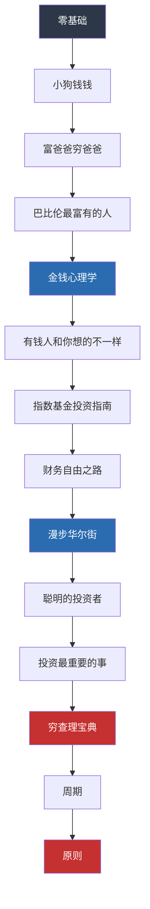

## 推荐阅读

本章从收入类型、资产定义、财富阶段、商业模式、认知变现、复利原理、收入结构到阶段特征，构建了财富增长的完整理论框架。以下推荐的书籍和资源，按**由浅入深**的顺序编排，每本都对应本章的一个或多个核心主题。建议按顺序阅读，每读完一本就回来对照本章内容，检验自己的理解深度。

---

### 一、入门奠基：建立正确的财富认知

这一阶段的目标是**打破旧观念、建立新框架**。大多数人的财务问题不是技术问题，而是认知问题——对钱的理解从根上就歪了。

#### 1.1 《富爸爸穷爸爸》——罗伯特·清崎

**对应本章主题：** 收入的三种类型（01）、资产与负债的重新定义（02）

**为什么推荐：** 这本书是财务启蒙的"第一课"。清崎用两个父亲的对比，把"为钱工作"和"让钱为你工作"的区别讲得极其清晰。书中提出的"现金流象限"（ESBI）直接对应本章讨论的个人商业模式升级——从E（雇员）到S（自由职业）到B（企业主）到I（投资者）的跃迁路径。

**核心收获：**
- 资产是把钱放进你口袋的东西，负债是把钱从你口袋拿走的东西——这个定义和会计准则不同，但在个人理财语境下极其好用
- 穷人和中产买入负债，富人买入资产
- 财务自由 = 被动收入 > 生活支出

**阅读建议：** 重点读前三章和现金流象限部分，后面的案例可以快速浏览。读完后画一张自己的现金流图，看看你的钱从哪来、到哪去。

**局限性：** 清崎的建议偏"理念"，缺少具体操作方法。他后来写的《富爸爸财务自由之路》补充了更多实操内容，但整体质量不如第一本。

#### 1.2 《小狗钱钱》——博多·舍费尔

**对应本章主题：** 财富增长的四个阶段（03）

**为什么推荐：** 别被"童话"的外衣骗了，这本书用一个12岁女孩和一只会说话的狗的故事，把储蓄、投资、复利、梦想储蓄罐讲得比大多数成人理财书都透彻。适合"知道该理财但一直没开始"的人。

**核心收获：**
- "梦想储蓄罐"方法：把大目标拆成具体的、有时间线的小目标
- 成功日记：每天写5件做得好的事，建立"我能行"的信念——这和本章讲的"认知变现"底层逻辑一脉相承
- 50/40/10法则：50%养"鹅"（投资），40%实现梦想，10%日常消费

**阅读建议：** 两小时就能读完，但建议反复翻阅。特别适合推荐给对理财有抵触情绪的朋友和家人。

#### 1.3 《金钱心理学》——摩根·豪塞尔

**对应本章主题：** 复利的数学原理与心理效应（06）、认知变现的底层逻辑（05）

**为什么推荐：** 这是近年最好的理财书之一。豪塞尔不讲具体投资策略，而是聚焦于**人与钱的关系**——为什么聪明人会做蠢事？为什么同样的收入有人存下百万有人月光？他用20个独立章节，每个讲一个关于金钱的反直觉真相。

**核心收获：**
- 复利的最大敌人不是低收益率，而是你没有耐心等够足够长的时间
- "尾部事件"驱动一切：投资组合中99%的回报来自1%的决策，关键是别在那1%之前退出
- 沃伦·巴菲特96%的财富是在60岁之后赚到的——这就是复利的威力
- 存钱能力和你的收入关系不大，和你的储蓄率减去欲望的差值关系最大

**阅读建议：** 每章独立，可以跳着读。第3章（永不知足）、第4章（复利的奥秘）、第20章（存钱）强烈建议精读。

---

### 二、进阶提升：掌握核心方法论

读完入门书籍后，你需要的是**可执行的系统**。以下书籍提供了具体的框架和方法。

#### 2.1 《巴比伦最富有的人》——乔治·克拉森

**对应本章主题：** 收入结构的深度分析（07）、财富增长的阶段性特征（08）

**为什么推荐：** 用古巴比伦的寓言故事讲理财，每个故事对应一条财富法则。虽然写于1926年，但法则至今适用。这本书的精华在于它把复杂的财务概念简化为几条朴素的原则。

**核心收获：**
- 巴比伦第一法则：至少存下收入的10%——"先支付自己"
- 巴比伦第四法则：把金子交给它能增值的人，只投资你了解的领域
- 巴比伦第六法则：确保未来的收入——保险、养老规划不是"以后再说"的事

**阅读建议：** 全书不到100页，一个下午就能读完。建议做成卡片贴在办公桌上。

#### 2.2 《指数基金投资指南》——银行螺丝钉

**对应本章主题：** 资产与负债的重新定义（02）、财富增长的四个阶段（03）

**为什么推荐：** 中文世界最好的指数基金入门书。螺丝钉是国内最早系统性推广指数基金定投的作者之一，他的"估值定投法"——在低估值时多买、高估值时少买或不买——比简单定投更聪明。

**核心收获：**
- 什么是指数基金，为什么它长期能跑赢80%的主动基金
- 常见指数（沪深300、中证500、恒生指数、标普500）的特点和适用场景
- 估值指标（PE、PB、股息率）怎么看，怎么用
- 具体的定投策略和止盈方法

**阅读建议：** 重点读第2-6章（基础概念）和第10-12章（定投策略）。第7-9章的基金品种介绍可以当工具书查。

**局限性：** 书中部分估值数据已过时（出版年份较早），实际操作时需要自己查最新数据。但方法论本身是普适的。

#### 2.3 《有钱人和你想的不一样》——哈维·艾克

**对应本章主题：** 认知变现的底层逻辑（05）、个人商业模式升级（04）

**为什么推荐：** 这本书的核心观点是：你的财务状况是你的"金钱蓝图"决定的。如果你内在认为"有钱人都不是好人"或者"我不配拥有财富"，那么无论你多努力，你的潜意识都会把你拉回原地。

**核心收获：**
- 17种有钱人和穷人的思维差异（具体、可对照自检）
- "财富档案"练习：写出你对钱的所有信念，找出哪些在限制你
- 宣言法：每天大声念出新的财富信念，重塑潜意识——听起来玄，但认知行为疗法的核心机制就是这样

**阅读建议：** 第一部分（思维差异）是精华，第二部分（行动计划）稍显鸡汤。重点做"财富档案"练习，你会惊讶于自己有多少隐藏的限制性信念。

#### 2.4 《财务自由之路》——博多·舍费尔

**对应本章主题：** 财富增长的四个阶段（03）、收入结构的深度分析（07）

**为什么推荐：** 如果《小狗钱钱》是启蒙版，这本就是实战版。舍费尔在书中提出了"梦想-目标-策略-工具"的四层框架，并给出了具体的财务规划方法。

**核心收获：**
- 财务保障、财务安全、财务自由三个层级的定义和计算方法
- 如何在7年内实现财务自由（基于德国中产收入水平的推演）
- 债务管理的"债务雪球法"：先还最小的债，获得正反馈后再还大的
- 教练和导师的重要性——找到已经做到的人学习

**阅读建议：** 第3章（如何创造奇迹）和第8章（储蓄的正确方式）值得反复读。书中有很多练习题，不要跳过。

---

### 三、高阶深耕：构建投资知识体系

当你的储蓄率稳定在30%以上，有了6个月应急资金，开始有闲钱投资时，进入这个阶段。

#### 3.1 《漫步华尔街》——伯顿·马尔基尔

**对应本章主题：** 复利的数学原理与心理效应（06）

**为什么推荐：** 这是投资领域的经典之作，自1973年首版以来修订了12版。马尔基尔是普林斯顿大学经济学教授，他用严谨的学术研究证明了一个核心观点：**你无法持续战胜市场**。这意味着，对大多数人来说，低成本指数基金是最优解。

**核心收获：**
- 技术分析和基本面分析为什么长期无效（附大量学术证据）
- 随机漫步理论：股价的短期走势是不可预测的
- 生命周期投资组合：年轻时多配股票，年纪大了多配债券
- 泡沫的形成机制和识别方法（从郁金香到比特币）

**阅读建议：** 第1部分（投资理论）和第3部分（实践指南）是核心。第2部分的具体股票分析方法可以跳过——马尔基尔的本意就是告诉你这些方法没用。

#### 3.2 《聪明的投资者》——本杰明·格雷厄姆

**对应本章主题：** 资产与负债的重新定义（02）、财富增长的阶段性特征（08）

**为什么推荐：** 巴菲特称之为"有史以来最伟大的投资著作"。格雷厄姆是价值投资的创始人，他提出的"安全边际"概念是所有理性投资的基石。书的核心思想可以浓缩为一句话：**用5毛钱买价值1块钱的东西**。

**核心收获：**
- "市场先生"寓言：市场每天给你报价，你可以接受也可以忽略——价格和价值是两回事
- 防御型投资者 vs 进取型投资者的策略差异
- 安全边际：为什么要买得足够便宜，以及"足够便宜"的标准是什么
- 如何分析公司的财务报表（简化版）

**阅读建议：** 原书比较厚且有年代感。建议先读杰森·茨威格的注释版（每个章节后有现代案例补充）。重点读第8章（市场先生）、第20章（安全边际）。

**局限性：** 格雷厄姆的选股方法在A股市场适用性有限（A股的财务报表质量和信息透明度不同），但投资哲学是普适的。

#### 3.3 《投资最重要的事》——霍华德·马克斯

**对应本章主题：** 财富增长的阶段性特征（08）、认知变现的底层逻辑（05）

**为什么推荐：** 马克斯是橡树资本的创始人，管理着超过1500亿美元的资产。他写的投资备忘录是华尔街必读物，巴菲特说"每次看到邮件都会第一时间打开"。这本书浓缩了他40年的投资智慧。

**核心收获：**
- 第二层思维：不只是"这公司好不好"，而是"市场对它的预期对不对"
- 风险不是波动，而是永久性资本损失的可能
- 周期是不可避免的，关键是在周期的哪个位置
- "这次不一样"是投资中最贵的五个字

**阅读建议：** 全书20章，每章一个主题，可以跳着读。但第5章（理解风险）和第11章（逆向投资）建议精读两遍。

#### 3.4 《穷查理宝典》——查理·芒格

**对应本章主题：** 认知变现的底层逻辑（05）、个人商业模式升级（04）

**为什么推荐：** 芒格是巴菲特的搭档，也是我见过最聪明的人之一。这本书不是理财书，而是**思维方法论**。芒格的"多元思维模型"——从不同学科借用核心概念来分析问题——是本章"认知变现"最有力的实证。

**核心收获：**
- 多元思维模型：不需要成为每个领域的专家，但要掌握每个领域最重要的1-2个模型
- 反向思维：反过来想，总是反过来想——想知道如何成功，先研究如何失败
- 能力圈：知道自己不知道什么，比知道什么更重要
- 检查清单：把决策过程结构化，减少遗漏

**阅读建议：** 重点读第2章（芒格的即席谈话）和第11章（人类误判心理学）。后者是芒格总结的25种心理偏误，对投资和生活都有巨大价值。

---

### 四、专项突破：深入特定领域

以下书籍针对本章涉及的特定主题做深入探讨，按需选读。

#### 4.1 复利与数学思维

**《思考，快与慢》——丹尼尔·卡尼曼**

诺贝尔经济学奖得主卡尼曼的代表作。核心是"系统1"（快思考、直觉）和"系统2"（慢思考、理性）的框架。为什么人类天生不擅长理解指数增长？因为系统1是线性思维的。理解这一点，你就能理解为什么大多数人低估了复利的威力。

**关键章节：** 第9章（规划谬误）、第29章（对罕见事件的过度反应）、第34章（经验效用与决策效用）。

#### 4.2 资产配置与风险管理

**《有效资产管理》——威廉·伯恩斯坦**

这本书比较硬核，适合有一定基础的投资者。伯恩斯坦是神经科医生出身的金融理论家，他把马科维茨的现代投资组合理论翻译成了普通人能理解的语言。

**核心收获：**
- 资产配置决定了你90%以上的投资回报
- 四种资产类别（大盘股、小盘股、长期国债、短期国债）的历史回报和风险
- 再平衡的频率和方法
- 不同市场的相关性和分散化效果

#### 4.3 收入增长与职业发展

**《纳瓦尔宝典》——埃里克·乔根森**

硅谷天使投资人纳瓦尔·拉维坎特的语录集。纳瓦尔的核心观点是：**用杠杆赚钱**。他总结了三种杠杆——劳动力、资本、代码/媒体（边际成本为零的产品）。这直接对应本章讨论的收入类型转变。

**核心收获：**
- 专属知识（Specific Knowledge）是无法被培训出来的，它来自于你的天赋和好奇心的交叉点
- 杠杆的三种形式：劳动力、资本、代码和媒体
- 判断力比勤奋更重要
- 财富是在你睡觉时还能为你赚钱的资产

**阅读建议：** 全书不长，3小时能读完。建议反复翻阅，每次都会发现新的启发。

#### 4.4 商业模式与创业

**《从0到1》——彼得·蒂尔**

PayPal创始人蒂尔的创业哲学。他提出：真正的财富创造是"从0到1"（创新），而不是"从1到N"（复制）。这对理解个人商业模式升级有深刻意义——你是在做别人也能做的事（竞争），还是在创造独一无二的价值（垄断）？

**核心收获：**
- 竞争是留给失败者的，垄断才是好生意
- 10倍好法则：新产品要比现有产品好10倍才能颠覆市场
- 创始人悖论：成功的创始人往往同时具有对立的特质

#### 4.5 认知升级与心智成长

**《原则》——瑞·达利欧**

桥水基金创始人达利欧的人生和工作原则。这本书的价值不在于具体的投资建议（虽然也有），而在于他展示了一种**系统化思考**的方式——把人生和投资都当成机器来优化。

**核心收获：**
- 极度透明和极度真实的文化
- 五步流程：目标→问题→诊断→方案→执行
- 每个人都有盲点，关键是建立机制去发现和弥补它们
- 全天候投资组合：在任何经济环境下都能获得稳定回报的资产配置方案

**阅读建议：** 重点读"生活原则"部分（约占全书1/3），"工作原则"和"经济机器原理"可以按需阅读。

---

### 五、中文原创精品

以下推荐针对中文读者量身定制，解决的问题更贴近国内实际。

#### 5.1 《定投十年财务自由》——银行螺丝钉

螺丝钉的第二本书，比《指数基金投资指南》更系统。核心是"定投+估值"策略的完整操作手册，包括如何选基金、何时买入、何时卖出、如何构建组合。适合想"照着做"的读者。

**核心收获：**
- 完整的指数基金定投策略（A股+港股+美股）
- 估值表的制作和使用方法
- 如何用基金组合实现10%+的年化收益
- 不同收入水平的定投方案（月入5000/10000/20000）

#### 5.2 《钱：7步创造终身收入》——托尼·罗宾斯

**注意：** 这本书有中文版，但原版是英文。罗宾斯采访了包括达利欧、巴菲特、博格尔在内的50多位顶级投资者，把他们的智慧浓缩为7个步骤。

**核心收获：**
- "投资的三层金字塔"：安全、增长、梦想
- 达利欧全天候投资组合的具体配置比例
- 年金的作用和陷阱
- 如何计算你的"财务自由数字"

#### 5.3 《周期》——霍华德·马克斯

马克斯的第二本书，专门讲周期。理解周期是理解财富增长阶段性特征的关键——市场有周期，经济有周期，你的职业生涯也有周期。

**核心收获：**
- 周期的三个阶段：上涨、顶部、下跌
- 如何判断我们在周期的什么位置
- 为什么"在别人恐惧时贪婪"说起来容易做起来难
- 周期定位的方法论

---

### 六、持续学习资源

除了书籍，以下资源值得长期关注。

#### 6.1 投资备忘录

| 资源 | 作者/机构 | 频率 | 特点 |
|------|-----------|------|------|
| 橡树资本备忘录 | 霍华德·马克斯 | 不定期 | 深度思考，每篇必读 |
| 伯克希尔年报 | 巴菲特 | 年度 | 最好的投资教育材料 |
| 桥水每日观察 | 瑞·达利欧 | 日/周 | 宏观经济视角 |
| 螺丝钉指数估值 | 银行螺丝钉 | 日 | A股指数基金估值表 |

#### 6.2 播客与视频

| 资源 | 平台 | 内容方向 |
|------|------|----------|
| 知行小酒馆 | 小宇宙/Apple Podcast | 中文理财播客，嘉宾质量高 |
| 硬核读书会 | 微信公众号 | 财经书籍深度解读 |
| 也谈钱 | B站/YouTube | 年轻人理财实操 |
| 牛先森的理财课堂 | 喜马拉雅 | 基金投资系统课 |
| The Investor's Podcast | Apple Podcast | 英文，深度投资书籍讨论 |

#### 6.3 数据工具

| 工具 | 用途 | 获取方式 |
|------|------|----------|
| 理杏仁 | A股/港股指数估值 | lixinger.com（部分付费） |
| 且慢 | 指数估值 + 定投工具 | qieman.com |
| 韭圈儿 | 基金分析 + 估值 | 韭圈儿小程序 |
| 乌龟量化 | 全市场估值对比 | guorn.com |
| Portfolio Visualizer | 回测投资组合 | portfoliovisualizer.com（英文） |

---

### 七、阅读路线图

不同基础的读者可以按以下路线选择阅读顺序：

**分阶段建议：**

| 阶段 | 目标 | 推荐书目 | 预计时间 |
|------|------|----------|----------|
| 启蒙期 | 建立财富意识 | 小狗钱钱、富爸爸穷爸爸、巴比伦最富有的人 | 2-4周 |
| 认知期 | 改变金钱思维 | 金钱心理学、有钱人和你想的不一样 | 2-3周 |
| 实操期 | 开始投资行动 | 指数基金投资指南、财务自由之路、定投十年财务自由 | 4-6周 |
| 进阶期 | 构建投资体系 | 漫步华尔街、聪明的投资者、投资最重要的事 | 6-8周 |
| 精通期 | 形成投资哲学 | 穷查理宝典、周期、原则 | 持续阅读 |

---

### 八、阅读方法与建议

#### 8.1 不要只读书，要做笔记

每读完一本书，回答以下三个问题：
1. **这本书的核心观点是什么？** 用一句话总结
2. **哪个观点颠覆了我的认知？** 写下之前的想法和现在的想法
3. **我明天就可以执行的一个行动是什么？** 越具体越好

#### 8.2 建立"读书-实践-复盘"循环

读书 → 写下3个可执行的行动 → 执行30天 → 复盘效果 → 调整 → 继续阅读

很多人陷入"读书-忘记-再读书"的死循环。解决方案是：**读一本，做一本**。与其一年读20本书都不做，不如读5本每本都实践。

#### 8.3 警惕"知识幻觉"

读了几本理财书后，你可能会觉得自己"懂了"。这是危险的。知识幻觉的特征是：
- 能说出很多术语和理论，但从没真正操作过
- 觉得"我知道这个"，但从未验证过
- 看不上简单的策略（比如定投），总觉得有"更好的方法"

**检验标准很简单：** 你的投资账户里有没有钱？你的储蓄率是多少？如果答案都是"还没有"，那你只是在用阅读代替行动。

#### 8.4 本章知识与推荐阅读的映射关系

| 本章主题 | 对应推荐书目 | 深度优先级 |
|----------|-------------|-----------|
| 收入的三种类型 | 富爸爸穷爸爸、纳瓦尔宝典 | ★★★★★ |
| 资产与负债的重新定义 | 富爸爸穷爸爸、聪明的投资者 | ★★★★★ |
| 财富增长的四个阶段 | 财务自由之路、小狗钱钱 | ★★★★☆ |
| 个人商业模式升级 | 从0到1、纳瓦尔宝典 | ★★★★☆ |
| 认知变现的底层逻辑 | 有钱人和你想的不一样、穷查理宝典 | ★★★★★ |
| 复利的数学原理与心理效应 | 金钱心理学、漫步华尔街、思考快与慢 | ★★★★★ |
| 收入结构的深度分析 | 财务自由之路、巴比伦最富有的人 | ★★★★☆ |
| 财富增长的阶段性特征 | 投资最重要的事、周期 | ★★★★☆ |

---

### 九、常见阅读误区

#### 误区一：只读不练

**症状：** 书架上摆满了理财书，但银行账户纹丝不动。

**纠正：** 每本书至少提取一个可执行的行动，当天就开始做。哪怕只是开一个基金定投账户、设置每月自动转存10%收入，都比"再读一本"有用。

#### 误区二：只读畅销书

**症状：** 只读亚马逊/当当排行榜上的书，不读经典。

**纠正：** 畅销书解决的是"入门"问题，经典书解决的是"体系"问题。《聪明的投资者》可能不如《XX天财富自由》好读，但它的含金量高出一个量级。

#### 误区三：只读中文书

**症状：** 英文原版有更好的内容，但因为语言障碍只读中文翻译版。

**纠正：** 如果你的英文水平允许，尽量读原版。翻译版有时会丢失原意，而且中文出版的理财书质量参差不齐。如果英文有困难，至少确保你读的翻译版是知名出版社出的。

#### 误区四：读完就扔

**症状：** 读完一本书就再也不翻了。

**纠正：** 好书值得反复读。巴菲特说自己把《聪明的投资者》读了至少四遍。建议建立"核心书架"——5-10本对你影响最大的书，每半年重读一遍。

#### 误区五：追求"最优"策略

**症状：** 在各种投资策略之间跳来跳去，永远在找"更好的方法"。

**纠正：** 对大多数人来说，70分的策略坚持执行10年，远胜于95分的策略执行1年。先选一个简单可行的策略（比如沪深300定投），执行两年以上再考虑优化。

---

> **最后一句话：** 书单再好，不如打开第一本。选择上面任何一本你现在最需要的，今天就开始读。读完之后，回来重读本章，你会发现你的理解完全不同了。
