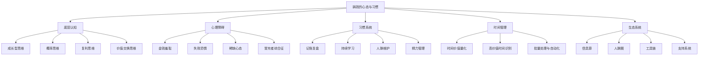
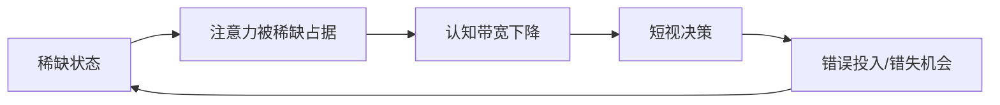
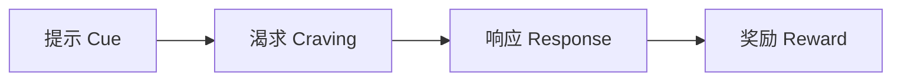
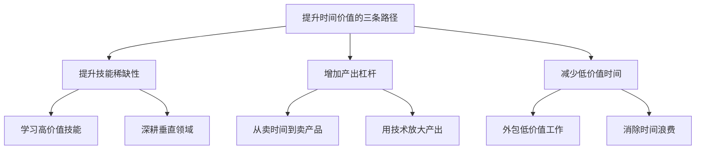
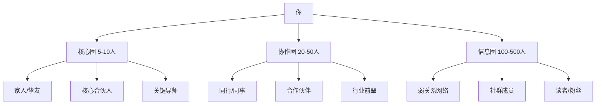
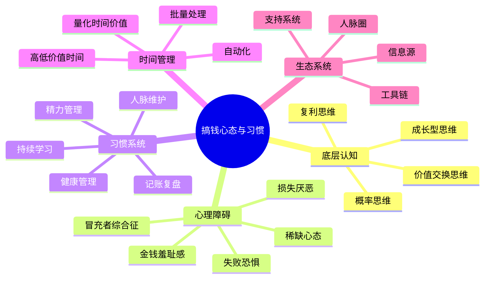

# 第三章：搞钱的心态与习惯

> "我们反复做的事情造就了我们。因此，卓越不是一种行为，而是一种习惯。" —— 亚里士多德

搞钱不仅仅是一种技能，更是一种**底层操作系统**。技能决定你能做什么，心态决定你敢不敢做、能不能坚持做、遇到挫折会不会放弃。本章将从认知科学、行为心理学和实战经验三个维度，系统构建搞钱的心态基础和习惯体系。



---

## 3.1 成功搞钱者的底层认知

搞钱能力的差异，表面看是资源、技能、运气的差异，深层看是**认知模式**的差异。心理学家 Carol Dweck 的研究表明，一个人对自身能力的基本信念，会深刻影响他的行为选择、抗挫能力和成长速度。

### 3.1.1 成长型思维 vs 固定型思维

Carol Dweck 在《终身成长》中提出两种思维模式：

| 维度 | 固定型思维 | 成长型思维 |
|------|-----------|-----------|
| 对能力的信念 | 天赋决定一切 | 能力可以通过努力提升 |
| 面对挑战 | 回避，怕暴露不足 | 拥抱，视为学习机会 |
| 面对失败 | "我不行"，放弃 | "我还没学会"，调整策略 |
| 面对批评 | 防御、否认 | 吸收、改进 |
| 面对他人成功 | 威胁感、嫉妒 | 学习、获取灵感 |
| 搞钱表现 | 容易半途而废 | 持续迭代，越做越好 |

**搞钱场景中的典型表现：**

固定型思维的人："我天生不擅长理财"、"我不是做生意的料"、"别人能赚钱是因为有人脉/有背景"。这些想法的本质是把成功归因于不可改变的因素，从而为自己的不作为找到合理化借口。

成长型思维的人："我现在还不懂理财，但我可以学"、"这次失败说明我的方法有问题，需要调整"、"他能赚钱，说明这条路走得通，我要研究他是怎么做的"。

**如何培养成长型思维：**

1. **觉察固定思维的触发器**。当你想说"我不行"的时候，加一个后缀："我不行……但我可以学"。当你想说"太难了"的时候，换成"这需要更多时间和练习"。
2. **把失败重新定义为数据**。每次失败不是对你能力的否定，而是一次实验结果。实验失败了，但你获得了信息——这个方法不通，换一个。
3. **关注过程而非结果**。不要问"我赚了多少钱"，要问"我今天学到了什么"、"我的策略比上周改进了什么"。
4. **寻找"还没"的力量**。"我还没成功"比"我失败了"多了一个关键信息：这是暂时状态，不是最终结果。

### 3.1.2 概率思维：用数学而非情绪做决策

搞钱本质上是一系列概率游戏。拥有概率思维的人不会被单次结果左右情绪，而是关注**期望值**和**大数定律**。

**期望值 = 胜率 × 赢的收益 - 败率 × 输的损失**

**案例：两个摆摊创业者的对比**

老王凭感觉选品："我觉得这个东西好卖"，结果第一批货砸手里了，亏损2万，从此再也不敢进货。

老李用概率思维选品：
- 第一步：调研10个同类摊位，记录他们的品类和销量
- 第二步：选3个销量最高的品类，每种进少量货测试
- 第三步：测试2周，记录每个品类的利润率和周转速度
- 第四步：淘汰表现最差的，加大表现好的进货量

老李第一批测试也亏了3000元，但他获得了关键数据。第二个月，他找到了利润率40%、周周转2次的品类，月利润稳定在8000元以上。

**概率思维的实操框架：**

1. **任何决策前先估算概率**。不要问"这个能赚钱吗"，要问"这个赚钱的概率是多少？如果赚了能赚多少？如果亏了会亏多少？期望值是多少？"
2. **用小样本测试，用大样本决策**。永远不要在第一次尝试时All in。用最小可行投入做测试，收集数据后再决定是否加大投入。
3. **关注系统而非单次结果**。一个好的交易系统，即使单次亏损，长期来看也是正期望值。不要因为一次亏损就否定整个系统。
4. **接受方差的存在**。即使你做对了所有事情，短期结果也可能不好。这不是你的问题，这是概率的特性。关键是确保你的方法在大样本下是正期望的。

### 3.1.3 复利思维：指数增长的底层逻辑

爱因斯坦（据传）说过："复利是世界第八大奇迹。"这句话被引用了无数遍，但大多数人并没有真正理解复利的含义。

**数学表达：**

```text
终值 = 初始值 × (1 + 增长率)^时间
```

复利的威力在于**指数增长**。假设你每天进步1%：
- 1天后：1.01
- 30天后：1.35（增长35%）
- 365天后：37.78（增长3778%）

这个数学事实揭示了一个关键道理：**持续的小幅进步，长期来看会产生惊人的效果**。

**复利在搞钱中的三个应用层面：**

**第一层：资金复利。** 这是最直接的层面。假设年化收益10%：
- 10万元本金，10年后变成25.9万
- 20年后变成67.3万
- 30年后变成174.5万

这就是为什么越早开始投资越好。晚10年开始，最终结果可能差一倍以上。

**第二层：技能复利。** 你学到的每一个技能都会与已有技能产生**组合效应**。一个懂编程的人学了营销，就变成了增长工程师；一个做销售的人学了数据分析，就变成了数据驱动的销售专家。技能不是线性叠加的，而是指数组合的。

**第三层：人脉复利。** 认识一个人可能带来2-3个新的人脉机会。10年后，你最初认识的10个人可能已经扩展成一个包含数百人的高质量网络。关键是每一段关系都要**双向维护价值**。

**复利思维的行为指导：**

1. **尽早开始**。复利最大的敌人是"再等等"。哪怕每月只能存500元，今天开始也比明天开始多一天的复利。
2. **不要中断**。复利一旦中断，损失的不仅是那段时间的收益，还有之前累积的利息。持续性比单次投入量更重要。
3. **耐心等待拐点**。复利曲线的特征是前期增长缓慢，后期爆发。大多数人放弃在拐点之前。
4. **提升增长率**。在时间不变的前提下，提高增长率能极大提升终值。学习新技能、优化投资策略，都是在提高增长率。

### 3.1.4 价值交换思维：搞钱的本质

**搞钱的本质是什么？** 不是投机取巧，不是坑蒙拐骗，而是**价值交换**。

你为他人创造了价值，他人用金钱回报你。这个逻辑非常简单，但很多人在实际操作中会偏离这个本质。

**价值交换的四个层次：**

| 层次 | 描述 | 收入天花板 | 举例 |
|------|------|-----------|------|
| 卖时间 | 用时间换取报酬 | 有限（时间有上限） | 打工、兼职 |
| 卖技能 | 用专业能力换取更高时薪 | 中等（技能稀缺性决定） | 程序员、设计师、咨询师 |
| 卖产品 | 创建一次、销售多次 | 较高（边际成本趋近于零） | 课程、软件、书籍 |
| 卖系统 | 建立自动运转的商业系统 | 极高（可脱离个人时间） | 公司、品牌、平台 |

**从价值交换的角度审视搞钱方式：**

- 问自己：我为谁创造了什么价值？
- 问自己：这个价值有多稀缺？有多少人能提供？
- 问自己：我能如何提升这个价值的稀缺性？
- 问自己：我能否把这个价值从"卖时间"升级到"卖产品"或"卖系统"？

**案例：一个厨师的价值升级之路**

小陈是一个厨师，月薪8000元（卖时间）。他发现自己的红烧肉特别受欢迎，于是：

- 第一步：在社交媒体分享红烧肉的做法视频，积累了5万粉丝（从卖时间到卖技能/内容）
- 第二步：推出线上烹饪课程，售价199元，卖了2000份（从卖技能到卖产品）
- 第三步：开发"小陈厨房"品牌酱料，进入电商平台（从卖产品到卖品牌/系统）

3年后，他的月收入从8000元变成了8万元，而且收入不再与他每天的工作时间直接挂钩。

### 3.1.5 目标清晰与SMART原则

目标清晰是所有行动的起点。没有清晰的目标，你的努力就是散射光——能量分散，穿透力弱。有了清晰的目标，你的努力就是激光——集中一点，穿透力极强。

**SMART原则详解：**

- **S**pecific（具体的）：不是"我要赚钱"，而是"我要通过副业月入1万"
- **M**easurable（可衡量的）：有明确的数字指标，可以量化进度
- **A**chievable（可实现的）：基于现实条件，但需要跳一跳才够得着
- **R**elevant（相关的）：与你的长期人生目标一致，不是孤立的
- **T**ime-bound（有时限的）：有明确的截止日期，创造紧迫感

**案例对比：**

小李的目标："我想变得有钱"。三年后，他还在原地。

小张的目标："在2025年12月31日前，通过开发一个微信小程序实现月收入5万元。为此我需要：第1-2个月学习小程序开发，第3-4个月开发MVP，第5-6个月获取前1000个用户，第7-12个月迭代优化并实现变现。"

小张的目标是SMART的：具体（小程序月入5万）、可衡量（月收入数字）、可实现（他有编程基础）、相关（符合他成为独立开发者的人生目标）、有时限（2025年12月31日）。

**目标分解的实操方法：**

1. **年度目标**：今年我要实现什么？（1-3个核心目标）
2. **季度目标**：这个季度我要完成哪些里程碑？
3. **月度目标**：这个月我要做什么？
4. **周目标**：这周我要完成什么？
5. **日目标**：今天我要做什么？

每一层目标都要满足SMART原则。年度目标可以模糊一些，但日目标必须非常具体——"今天我要完成小程序用户登录功能的开发和测试"。

### 3.1.6 延迟满足与长期主义

斯坦福大学的"棉花糖实验"发现，能够延迟满足的儿童，在成年后的学业成绩、职业发展、健康状况等方面都显著优于即时满足的儿童。

**延迟满足不是压抑欲望，而是战略性地重新分配满足感的时间轴。**

**即时满足者的消费模式：**

小A月薪1万：
- 每月消费9000元（最新款手机、名牌衣服、每周聚餐）
- 5年后：存款约2万，没有任何资产

**延迟满足者的消费模式：**

小B月薪1万：
- 每月消费5000元（性价比产品、适度社交）
- 每月储蓄投资5000元，年化收益8%
- 5年后：存款约36万，其中投资收益约4万

10年后差距更加惊人：小A可能还在月光，小B的资产已经超过100万。

**如何训练延迟满足能力：**

1. **24小时冷静法则**。任何非必需品的购买，等24小时再决定。你会发现，大部分冲动消费会在24小时后自然消退。
2. **"成本换算"法**。把消费金额换算成工作时间。一双1200元的鞋，对你来说是10小时的工作。问自己：这双鞋值我10小时的生命吗？
3. **设立"未来基金"**。每月固定一笔钱存入专门的"未来基金"账户，这笔钱的用途只有一个：投资未来的自己（学习、投资、创业）。
4. **可视化长期目标**。把你的长期目标（比如"35岁财务自由"）做成壁纸，放在手机和电脑上。每次想冲动消费时，看看这个目标。
5. **建立奖励阶梯**。达到月度目标奖励自己一杯好咖啡，达到季度目标奖励自己一顿好的，达到年度目标奖励自己一次旅行。让延迟满足也有甜头。

---

## 3.2 克服搞钱路上的心理障碍

认知模式建立了，但实际搞钱过程中，你会遇到各种心理障碍。这些障碍不是你"想太多"，而是进化留给我们的心理机制在现代社会的错配反应。理解它们的来源和机制，是克服它们的前提。

### 3.2.1 金钱羞耻感：对谈钱说"不"

很多人对赚钱有一种深层的羞耻感，觉得"谈钱俗气"、"赚钱是贪婪的表现"、"君子不言利"。这种羞耻感会让人在关键时刻退缩——不敢报价、不敢要涨薪、不敢谈合作条件。

**这种羞耻感的三个来源：**

1. **文化基因**。中国传统价值观中，"重义轻利"是核心叙事之一。"君子喻于义，小人喻于利"、"钱财乃身外之物"这些观念从小根植在我们的认知中。
2. **家庭烙印**。如果你的父母经常说"钱够用就行"、"我们家不是做生意的料"、"有钱人都不快乐"，你对金钱的态度很可能已经被他们塑造了。
3. **社会叙事**。媒体上关于"有钱人"的报道，负面新闻远多于正面——炫富、为富不仁、拜金主义。这让我们下意识地把"有钱"和"不是好人"画上等号。

**如何系统性地克服金钱羞耻感：**

**第一步：认知重构。** 金钱是工具，不是道德标签。一把刀可以用来切菜，也可以用来伤人——关键在于使用者。金钱也是如此。你赚钱的方式决定了赚钱这件事的道德属性，而不是赚钱本身。

**第二步：正视价值交换。** 你提供价值，获得金钱，这是公平的交易。你去餐厅吃饭会不好意思付钱吗？不会。那你为别人提供服务/产品，别人付你钱，为什么要不好意思？

**第三步：算一笔账。** 你的时间、精力、技能都是有限资源。如果你不为它们定价，实际上是对自己生命价值的否定。

**案例：一个心理咨询师的转变**

小李是一名心理咨询师，最初她觉得收咨询费"不好意思"，经常打折或免费。后来她意识到：
- 她的专业知识是多年学习和实践的结晶，是有价值的
- 收费是对她专业能力的市场认可
- 合理的收费让她能持续提供高质量服务——免费的咨询她无法全身心投入
- 免费的服务往往不被珍惜——免费预约的客户迟到率是付费客户的5倍

现在她的咨询费是500元/小时，客户反而更尊重她的专业意见，治疗配合度和效果都明显提升。

### 3.2.2 失败恐惧与完美主义

**失败恐惧的本质：** 不是害怕失败本身，而是害怕失败带来的**负面评价**。"万一亏了怎么办"其实是在说"万一别人觉得我很蠢怎么办"。

**完美主义的本质：** 不是追求卓越，而是**回避评价**。"我还没准备好"其实是在说"如果我现在就开始，可能会暴露我的不足"。

**这两种心理的共同根源：** 对不确定性的恐惧，以及把自我价值与结果过度绑定。

**如何系统性地克服：**

**策略一：预设最坏情况（Fear Setting）。**

Tim Ferriss 推荐的"恐惧设定"练习：

```text
我害怕的事情：_______________
最坏的情况是什么？_______________
最坏情况发生的概率？_______________
如果最坏情况发生了，我能做什么？_______________
如果我不做这件事，6个月后会怎样？_______________
1年后呢？3年后呢？_______________
```

这个练习的核心是：当你把模糊的恐惧具体化后，你会发现大部分恐惧要么发生的概率很低，要么即使发生了你也承受得起。而不行动的代价往往比失败更大。

**策略二：小步试错法。**

不要等到"完美"再行动，而是用最小成本验证：

1. 想开咖啡店？先去咖啡店打工3个月
2. 想做自媒体？先发30篇内容测试反馈
3. 想做电商？先用1000元进一批货试试
4. 想学投资？先用1万元实盘操作一年

小步试错的核心逻辑：把一次大的风险决策拆成多次小的风险决策，每次失败的代价可控，但获得的信息价值很高。

**策略三：重新定义失败。**

把失败从"我不行"重新定义为"这条路不通"或"这个方法需要调整"。失败是数据，不是判决。

爱迪生在发明灯泡时尝试了上千种材料。当被问到是否为这些失败感到沮丧时，他说："我没有失败。我只是发现了一千种行不通的方法。"

### 3.2.3 比较心理与幸存者偏差

**比较心理的危害：**

社交媒体时代，你每天都在被动接受他人的"精选集"——朋友晒收入、博主炫富、同行融资。这些信息会让你产生"所有人都在赚钱，只有我原地踏步"的错觉。

比较心理会导致：
- **焦虑驱动的错误决策**：看到别人炒股赚了50万，借钱跟风，结果亏损20万
- **节奏失控**：为了追赶别人，跳过必要的学习和积累阶段
- **自我否定**：总觉得自己不够好，丧失行动力

**幸存者偏差的陷阱：**

你看到的成功案例，背后可能有无数失败案例。媒体报道了一位靠比特币财富自由的人，但没有告诉你同时期有1000个人因为比特币亏损破产。你看到一个做自媒体月入10万的博主，但没有看到10万个做了半年就放弃的博主。

**如何建立健康的比较框架：**

1. **唯一的参照物是昨天的自己**。问自己：比起上个月，我进步了什么？比起去年，我成长了多少？
2. **用概率思维过滤信息**。当你看到一个成功案例时，问自己：这个成功的概率是多少？样本量有多大？我能复制他的条件吗？
3. **主动减少比较刺激源**。取关让你焦虑的账号，退出无意义的攀比群。你无法控制别人展示什么，但你可以控制自己看什么。
4. **把嫉妒转化为学习信号**。当你嫉妒某个人时，说明他有你想要的东西。不要沉浸在负面情绪中，而是分析：他是怎么做到的？我能从中学到什么？

### 3.2.4 稀缺心态：贫穷的心理根源

哈佛大学教授 Sendhil Mullainathan 在《稀缺》一书中揭示了一个重要发现：**贫穷不仅是一种经济状态，更是一种心理状态**。稀缺心态会降低人的认知带宽，导致短视决策。

**稀缺心态的典型表现：**
- "我没钱，所以不能投资自己"——实际上投资自己是回报率最高的投资
- "我没时间，所以不能学习"——实际上学习是节省时间的最佳方式
- "我没人脉，所以不能创业"——实际上人脉是在行动中建立的
- "现在行情不好，再等等"——实际上总会有"不好"的理由

**稀缺心态的恶性循环：**



**如何打破稀缺心态：**

1. **建立"余闲"**。在时间、金钱、精力上都留出缓冲。不要把日程排满（留出20%的弹性时间），不要把预算花光（留出10%的应急资金）。余闲是打破稀缺循环的关键杠杆。
2. **减少决策疲劳**。把日常的小决策自动化——固定穿衣搭配、固定早餐选择、固定工作流程。把认知带宽留给真正重要的决策。
3. **投资"带宽提升"**。阅读、运动、充足睡眠，这些看起来"不产生直接收益"的活动，实际上在提升你的认知带宽，让你能做出更好的决策。
4. **拉长决策时间框架**。稀缺心态让人只看眼前。强迫自己用"5年后我会怎么看这个决定"的视角来审视当前的选择。

### 3.2.5 冒充者综合征：觉得自己不配

心理学家 Pauline Clance 和 Suzanne Imes 在1978年首次描述了"冒充者综合征"：即使有客观的成就和能力，仍然觉得自己是个"冒牌货"，担心被别人发现自己"其实没那么厉害"。

**在搞钱场景中的表现：**
- "我的东西不值这个价"——不敢为自己的产品/服务定价
- "我还不够格"——不敢申请更好的职位或接更大的项目
- "他们肯定比我强"——在谈判中主动让步
- "这次成功只是运气"——否定自己的能力和努力

**研究表明，高达70%的人在职业生涯中经历过冒充者综合征。** 你不是一个人。

**如何克服：**

1. **建立"成就日志"**。每天记录3件你做得好的事情，无论大小。当你怀疑自己时，翻看日志，用事实反驳内心的否定声音。
2. **把内心批评者外化**。给那个说"你不够好"的声音起个名字。当它出现时，你可以说："又是你在说这些，我已经听过很多次了，但事实证明我做得还不错。"
3. **接受"足够好"**。完美主义是冒充者综合征的燃料。告诉自己：我不需要100分才配得到这个机会，80分就够了。
4. **正常化不适感**。成长的标志就是持续感到"有点不够格"。如果你总是觉得完全胜任，说明你没有在挑战自己。

### 3.2.6 损失厌恶：为什么我们害怕失去更多

诺贝尔经济学奖得主 Daniel Kahneman 的研究表明，**失去100元带来的痛苦，大约是获得100元带来的快乐的2-2.5倍**。这就是"损失厌恶"——我们对损失的敏感度远高于对收益的敏感度。

**在搞钱中的典型表现：**
- 亏损的股票不愿意卖，一直抱着等回本（"割肉太痛了"）
- 不敢辞职创业，因为害怕失去现有的稳定收入
- 不愿意花3000元学习一门新技能，但愿意花3000元买一个手机
- 已经投入了很多时间/金钱在一件事上，即使发现方向不对也不愿意放弃（沉没成本谬误）

**如何克服损失厌恶：**

1. **用"机会成本"替代"损失"来思考**。不是"我亏了5000元"，而是"这5000元如果不放在这里，能产生什么收益？"
2. **设定预定义的止损规则**。在投入之前就决定好退出条件。这样当止损触发时，你是执行规则，而不是做情绪化决策。
3. **定期审视沉没成本**。问自己：如果我现在从零开始，我还会做这个选择吗？如果不会，就应该果断止损。
4. **把"损失"重新框架为"学费"**。亏损的5000元不是"损失"，而是"学费"——你用5000元学到了一个重要的教训，这个教训在未来可能帮你避免50万的损失。

---

## 3.3 建立搞钱的日常习惯系统

心态是底层操作系统，习惯是自动运行的程序。好的习惯不需要意志力维持，它会在你的日常生活中自动运转，持续为你创造价值。

### 3.3.1 习惯形成的科学原理

James Clear 在《原子习惯》中提出了习惯的四阶段模型：



- **提示**：触发你行动的信号（比如手机通知响了）
- **渴求**：你想要的状态（想知道是什么消息）
- **响应**：你的实际行为（拿起手机看消息）
- **奖励**：行为带来的满足感（看到了有趣的内容）

**建立好习惯的四条法则：**

| 法则 | 对应阶段 | 具体做法 |
|------|---------|---------|
| 让它显而易见 | 提示 | 把记账App放在手机首屏；把理财书放在床头 |
| 让它有吸引力 | 渴求 | 把记账和奖励挂钩；把学习和社交结合 |
| 让它简便易行 | 响应 | 从最小的行为开始（每天只记一笔账） |
| 让它令人愉悦 | 奖励 | 每完成一周记账就奖励自己一杯好咖啡 |

**习惯叠加：** 把新习惯绑定在已有习惯之后。公式是："在[已有习惯]之后，我会[新习惯]"。

例如：
- "早上刷完牙后，我会花5分钟看财经新闻"（绑定刷牙）
- "午饭后散步时，我会听10分钟理财播客"（绑定午饭后散步）
- "晚上关电脑前，我会花2分钟记今天的账"（绑定关电脑）

### 3.3.2 记账与财务复盘

**为什么记账是搞钱的第一习惯？**

彼得·德鲁克说："如果你不能衡量它，你就不能管理它。"记账是让你的财务状况从模糊变为清晰的唯一方法。不记账的人，对自己的钱去了哪里只有一个大概的印象，而这个"大概"往往偏差30%以上。

**记账的四个层次：**

| 层次 | 内容 | 工具 | 时间投入 |
|------|------|------|---------|
| 入门级 | 记录每日收支 | 手机备忘录 | 2分钟/天 |
| 进阶级 | 分类统计+月度复盘 | 记账App（随手记、MoneyWiz） | 5分钟/天+30分钟/月 |
| 专业级 | 预算管控+现金流分析 | Excel/Google Sheets | 10分钟/天+1小时/月 |
| 高阶级 | 资产负债表+投资追踪 | 专业财务软件 | 自动化为主 |

**具体记账流程（进阶级）：**

1. **每日记录**。每笔消费花10秒记录。不需要精确到分，但需要分类。推荐分类：餐饮、交通、住房、购物、娱乐、学习、社交、医疗、其他。
2. **每周检视**。每周日花15分钟回顾本周支出，标记异常项（明显高于平均的支出）。
3. **每月复盘**。月末花30分钟做完整的财务复盘。

**月度财务复盘模板：**

```text
一、收入分析
  - 主营业务收入：_____元（占比____%）
  - 副业/兼职收入：_____元（占比____%）
  - 投资收益：_____元（占比____%）
  - 其他收入：_____元（占比____%）
  - 总收入：_____元

二、支出分析
  - 固定支出（房租/房贷、保险、订阅）：_____元
  - 生活必需（餐饮、交通、水电）：_____元
  - 可选消费（购物、娱乐、社交）：_____元
  - 自我投资（学习、健康）：_____元
  - 总支出：_____元

三、储蓄率 = (总收入 - 总支出) ÷ 总收入 = ____%
  目标：≥30%（及格）、≥50%（优秀）、≥70%（极佳）

四、资产变动
  - 存款变动：+/-_____元
  - 投资市值变动：+/-_____元
  - 负债变动：+/-_____元
  - 净资产变动：+/-_____元

五、本月最大教训：_________________________________
六、下月优化方向：_________________________________
```

**记账的常见误区：**

1. **追求完美记账**。不需要记录到每一毛钱。精确到元就够了，重要的是趋势和结构，不是绝对数字。
2. **只记不复盘**。记账只是数据收集，复盘才是价值创造。如果只记不分析，记账就变成了无效劳动。
3. **记账后产生罪恶感**。记账的目的是获得信息，不是惩罚自己。看到高消费不要自责，而是理性分析：这笔消费是否值得？如果不值得，下次如何避免？

### 3.3.3 持续学习与信息输入系统

**学习的投入产出分析：**

假设你花200元买一本书，花10小时读完。如果书中的一个方法帮你每月多赚1000元，那么这本书的ROI是（1000×12）÷（200+10×你的时薪）。假设你的时薪是100元，ROI就是12000÷1200=1000%。

没有哪种投资能稳定提供1000%的回报率。**学习是普通人回报率最高的投资。**

**构建学习系统的五个层次：**

**第一层：输入（获取信息）**
- 每天30分钟：财经新闻/行业资讯（通勤时间）
- 每天20分钟：深度阅读（书籍/长文）
- 每周2小时：系统学习（在线课程/专业书）

**第二层：处理（理解内化）**
- 读完一章后，用自己的话总结3个核心要点
- 每学一个新概念，找一个生活中的例子来解释它
- 把新知识与已有知识建立联系（"这和我之前学的XX有什么关系？"）

**第三层：输出（教是最好的学）**
- 写读书笔记/博客
- 在社群中分享你的学习心得
- 用费曼技巧：假装向一个外行人解释这个概念

**第四层：实践（学以致用）**
- 每学一个方法，找一个场景去实际应用
- 记录实践结果，与理论预期对比
- 根据实践反馈调整理解

**第五层：迭代（螺旋上升）**
- 定期回顾学习笔记，更新过时的认知
- 同一主题在不同阶段重复学习，每次都会有新的理解
- 建立个人知识库，形成体系化的认知框架

**推荐信息源分类：**

| 类型 | 推荐源 | 用途 |
|------|--------|------|
| 财经新闻 | 第一财经、财新网、华尔街见闻 | 了解宏观环境和行业动态 |
| 投资研究 | 雪球、集思录、理杏仁 | 深度研究投资标的 |
| 行业资讯 | 36氪、虎嗅、钛媒体 | 发现商业机会和趋势 |
| 知识付费 | 得到App、樊登读书 | 系统学习特定领域 |
| 免费学习 | B站、Coursera、YouTube | 技能学习和知识拓展 |
| 海外资源 | Bloomberg、The Economist、Harvard Business Review | 国际视野和前沿思想 |

### 3.3.4 人脉维护与社交投资

**人脉的经济学本质：** 人脉是一种**社会资本**，它和金融资本一样可以投资、增值、变现。不同的是，社会资本的增值方式是**价值交换**——你为别人提供价值，别人在你需要时也会为你提供价值。

**弱关系理论：**

社会学家 Mark Granovetter 的研究表明，对你最有价值的人脉往往不是你的亲密朋友（强关系），而是你不太熟悉的人（弱关系）。原因：强关系的人和你的信息圈重叠度高，弱关系能为你带来全新的信息和机会。

**人脉维护的实操系统：**

| 圈层 | 人数 | 维护频率 | 维护方式 |
|------|------|---------|---------|
| 核心圈（至亲密友） | 5-10人 | 每周 | 面对面/深度交流 |
| 重要圈（关键人脉） | 20-30人 | 每月 | 微信问候/分享有价值信息 |
| 活跃圈（行业同行） | 50-100人 | 每季度 | 点赞互动/社群交流 |
| 外围圈（弱关系） | 数百人 | 随缘 | 朋友圈互动/节日问候 |

**社交投资的四个原则：**

1. **先提供价值，再寻求回报**。帮别人介绍一个客户、分享一篇有用的文章、提供一个有价值的建议——这些都是低成本但高价值的社交投资。
2. **维护10个高质量关系，胜过认识100个泛泛之交**。深度关系带来的是信任和资源，浅层关系带来的只是通讯录里的一个名字。
3. **保持真诚，不要功利化**。人能敏锐地感知到你是在真诚交往还是在"攒人脉"。功利化的社交会适得其反。
4. **主动出击，不要等待**。不要等别人来找你。想认识谁，就找机会主动接近——参加他的分享会、评论他的文章、通过共同朋友介绍。

**案例：一个销售人员的人脉经营系统**

小刘是一名B2B销售，客户转介绍率高达60%。他的方法：
- 维护一个CRM表格，记录每个重要客户的基本信息、兴趣爱好、上次沟通时间
- 每月给5个重要客户发一条个性化的消息（不是群发，而是基于他了解的信息写的内容）
- 看到对客户有用的信息，主动转发并附上简短的评论
- 每季度约一个重要客户吃饭，不谈业务，只聊生活和行业趋势
- 客户生日和重要节日，发送个人化的祝福（不是复制粘贴的模板）

### 3.3.5 精力管理：比时间管理更重要

**核心观点：时间对每个人是公平的（每天24小时），但精力不是。管理精力比管理时间更重要。**

精力管理的四个维度（来自 Jim Loehr《精力管理》）：

| 维度 | 表现 | 充电方式 | 耗电行为 |
|------|------|---------|---------|
| 体能精力 | 身体状态、耐力 | 运动、睡眠、营养 | 久坐、熬夜、垃圾食品 |
| 情绪精力 | 心态状态、情绪稳定性 | 冥想、社交、感恩 | 焦虑、愤怒、嫉妒 |
| 心智精力 | 专注力、判断力 | 深度工作、阅读 | 多任务、碎片化、决策疲劳 |
| 意志精力 | 目标感、自律 | 使命感、价值观连接 | 目标模糊、道德困境 |

**精力管理的实操框架：**

**第一步：找到你的高能量时段。**

大多数人的精力曲线呈倒U型：上午10-12点精力最旺，下午2-3点最低谷，傍晚有一个小高峰。但每个人的曲线不同，你需要观察自己一周，记录每个时段的精力状态。

**第二步：把最重要的工作放在高能量时段。**

- 高能量时段（精力峰值）：做需要深度思考的工作——战略规划、创造性工作、重要决策
- 中能量时段（精力平稳）：做需要一定专注的工作——常规沟通、数据分析、方案撰写
- 低能量时段（精力低谷）：做不需要太多脑力的工作——整理文件、回复消息、行政事务

**第三步：建立精力恢复仪式。**

- 每工作90分钟，休息15分钟（90分钟是一个完整的精力周期）
- 休息方式：站起来走动、喝水、远眺窗外、做几个深呼吸
- 避免用刷手机来"休息"——这不会恢复精力，反而会消耗更多

**案例：一个创业者的精力管理日程**

老王是公司CEO，他把精力管理融入日常：

```text
05:30  起床，晨间运动（跑步30分钟 + 拉伸15分钟）
06:30  冲澡 + 冥想10分钟
07:00  早餐（高蛋白低GI食物）
07:30  阅读/学习30分钟
08:00  通勤（听播客）
09:00-11:00  深度工作（处理最重要的战略问题）
11:00-11:15  休息（走动 + 喝水）
11:15-12:00  会议/沟通
12:00-13:30  午餐 + 午休（20分钟power nap）
13:30-15:30  中度工作（项目推进、团队协调）
15:30-15:45  休息（茶歇 + 简单活动）
15:45-17:30  轻度工作（回复消息、行政事务）
17:30-18:00  日复盘 + 明日规划
18:00  下班
19:00  晚餐 + 家人时间
21:00  轻度阅读或娱乐
22:00  准备睡觉（关闭电子设备）
22:30  入睡
```

### 3.3.6 健康管理：搞钱的基础设施

**一个残酷的事实：** 如果你在30岁忽视健康，你可能在40岁用赚到的钱去看病，在50岁发现钱不够治病。

**健康与搞钱的关系：**

1. **体能影响工作产出**。研究表明，每周运动3次以上的知识工作者，工作效率比不运动的同事高15-20%。
2. **睡眠影响决策质量**。连续一周睡眠不足6小时，认知能力下降相当于血液酒精浓度0.1%（超过醉驾标准）。
3. **情绪影响风险管理**。身体状态差的时候，人更容易做出冲动的、短视的决策。
4. **长期健康影响复利曲线**。如果你在50岁因健康问题无法工作，你损失的不是50岁到65岁的收入，而是这段时间内所有收入的复利终值。

**健康管理的最小可行方案：**

不需要每天健身2小时，不需要严格的饮食计划。以下是"最小可行方案"——投入最小，收益最大：

| 项目 | 最低标准 | 推荐标准 | 理由 |
|------|---------|---------|------|
| 睡眠 | 7小时 | 7.5-8小时 | 认知能力和情绪稳定的基础 |
| 运动 | 每周3次×30分钟 | 每周5次×45分钟 | 提升精力和专注力 |
| 饮食 | 三餐规律，少吃外卖 | 高蛋白低GI，控糖 | 稳定血糖=稳定精力 |
| 体检 | 每年1次 | 每年1次全面体检 | 早发现早治疗，成本最低 |
| 心理 | 有压力时找人倾诉 | 冥想+定期心理咨询 | 情绪管理是精力管理的核心 |

---

## 3.4 时间管理与效率提升

### 3.4.1 时间就是金钱的量化分析

"时间就是金钱"不是比喻，而是可以精确计算的：

```text
你的时间价值 = 年收入 ÷ 年工作小时数
```

例如：月薪2万，年收入24万，年工作小时约2000小时，时间价值 = 120元/小时。

**这意味着：**
- 你每浪费1小时，就浪费了120元的机会成本
- 你每提升1%的效率，每年就多创造2400元的价值
- 你花100小时学习一门新技能，投入成本是12000元——如果这门技能每年帮你多赚5万，第一年就回本了

**但时间价值不是固定的。** 你的目标是不断提升每小时的产出价值：



### 3.4.2 高价值时间 vs 低价值时间

不是所有的时间都等值。你每天8小时工作中，可能只有2-3小时在创造真正的核心价值。

**高价值时间的特征：**
- 推进你最重要的目标
- 需要深度思考和创造力
- 产出难以被替代
- 有长期复利效应

**低价值时间的特征：**
- 任何人都能做
- 不需要太多思考
- 没有积累效应
- 可以被工具或他人替代

**识别方法：** 列出你一周内做的所有事情，给每件事打分（1-10分）：这件事对我的核心目标贡献有多大？打分低于5分的事情，要么消除，要么外包，要么批量处理。

### 3.4.3 批量处理与自动化

**批量处理的核心原理：** 每次切换任务都有"上下文切换成本"——你的大脑需要时间从一个任务的状态切换到另一个任务的状态。研究表明，这个切换成本平均需要23分钟。

**批量处理的实操场景：**

| 活动 | 错误做法 | 正确做法 | 节省时间 |
|------|---------|---------|---------|
| 回复消息 | 来一条回一条 | 每天3个固定时段集中回复 | 1-2小时/天 |
| 处理邮件 | 随时查看随时回复 | 每天2次集中处理 | 1小时/天 |
| 购物 | 想到什么买什么 | 列清单，集中采购 | 2-3小时/周 |
| 行政事务 | 随到随处理 | 固定时间集中处理 | 1小时/天 |
| 社交媒体 | 有空就刷 | 固定时段，限时使用 | 2-3小时/天 |

**自动化的思维框架：**

任何需要重复做3次以上的事情，都值得考虑自动化或模板化。

- **财务自动化**：设置自动定投、自动还信用卡、自动转存
- **工作自动化**：用模板处理重复性邮件、用脚本处理数据、用快捷回复处理常见问题
- **信息自动化**：用RSS订阅替代手动浏览、用信息聚合工具替代逐个App查看

### 3.4.4 时间管理工具矩阵

| 需求 | 推荐工具 | 适用场景 | 学习成本 |
|------|---------|---------|---------|
| 任务管理 | 滴答清单 / Todoist | 每日待办、项目管理 | 低 |
| 日程管理 | Google Calendar / 飞书日历 | 会议安排、时间块规划 | 低 |
| 专注工作 | Forest / 番茄钟 | 对抗拖延、深度工作 | 极低 |
| 知识管理 | Notion / Obsidian | 笔记、数据库、项目管理 | 中 |
| 自动化 | IFTTT / Zapier / 快捷指令 | 跨应用自动化 | 中 |
| 时间追踪 | Toggl / 时间块 | 了解时间去向 | 低 |

**工具选择原则：**
1. **够用就好**。不要花大量时间研究和折腾工具，工具是手段不是目的。
2. **一个工具解决一个核心问题**。不要用一个"全能"工具做所有事情，也不要同时使用太多工具。
3. **先养成习惯，再升级工具**。先用最简单的工具（手机备忘录、纸质笔记本）养成习惯，确认习惯稳定后再考虑升级。

---

## 3.5 构建搞钱的生态系统

个人搞钱不是孤军奋战，而是需要一套完整的生态系统来支撑。这个系统包括信息输入、人脉网络、工具链和情感支持四个子系统。

### 3.5.1 信息系统：高质量信息的获取与过滤

**信息是搞钱的原材料。** 高质量的输入决定高质量的决策。但信息过载和信息噪声是现代社会的普遍问题——你需要的不是更多信息，而是更高质量的信息。

**构建信息系统的原则：**

1. **主动订阅，被动接收**。用RSS、邮件订阅、精选关注列表来主动控制信息源，而不是被动接受算法推荐。
2. **分层消费**。不是所有信息都值得深度阅读。
   - 第一层：标题扫描（5分钟，了解今天有什么大事）
   - 第二层：快速浏览（15分钟，了解3-5个重要事件的概况）
   - 第三层：深度阅读（30-60分钟，对1-2个与你最相关的话题深入理解）
3. **定期清理**。每季度审视你的信息源，删除低质量的、不再相关的，添加新发现的高质量源。
4. **建立知识库**。把有价值的信息分类存档（用Notion、Obsidian或简单的文件夹），建立可检索的个人知识库。

**推荐信息源清单：**

| 类别 | 来源 | 更新频率 | 用途 |
|------|------|---------|------|
| 宏观经济 | 华尔街见闻、财新网 | 每日 | 把握经济大势 |
| A股市场 | 雪球、集思录 | 每日 | 投资决策参考 |
| 创业资讯 | 36氪、创业邦 | 每日 | 发现商业机会 |
| 深度分析 | 经济观察报、南方周末 | 每周 | 深度理解行业 |
| 国际视野 | Bloomberg、The Economist | 每周 | 全球化视角 |
| 专业知识 | 得到App、HBR | 持续 | 系统化学习 |

### 3.5.2 人脉网络：关系的系统化经营

**人脉网络的三层结构：**



**各圈层的维护策略：**

- **核心圈**：投入最多时间，提供最深度的支持。这是你搞钱路上的情感后盾和决策顾问团。
- **协作圈**：定期互动，互相提供价值。这个圈层是你获取机会和资源的主要来源。
- **信息圈**：保持最低限度的连接。这个圈层的价值在于信息的多样性和弱关系带来的意外机会。

### 3.5.3 工具链：效率的系统化提升

**搞钱者的核心工具链：**

| 类别 | 工具 | 用途 | 重要度 |
|------|------|------|--------|
| 财务管理 | 随手记 / MoneyWiz | 记账、预算 | ★★★★★ |
| 知识管理 | Notion / Obsidian | 笔记、资料库 | ★★★★★ |
| 任务管理 | 滴答清单 / Todoist | 待办、项目 | ★★★★☆ |
| 协作沟通 | 飞书 / 钉钉 | 团队协作 | ★★★★☆ |
| 投资研究 | 同花顺 / 雪球 / 理杏仁 | 行情、分析 | ★★★★☆ |
| 学习平台 | 得到 / Coursera / B站 | 知识获取 | ★★★☆☆ |
| 自动化 | IFTTT / 快捷指令 | 流程自动化 | ★★★☆☆ |

**工具链选择原则：**
1. **最少工具原则**。用最少的工具覆盖最多的需求，减少切换成本。
2. **数据互通原则**。优先选择能互相导入导出数据的工具。
3. **渐进升级原则**。从免费/简单工具开始，确认需求后再升级。

### 3.5.4 支持系统：情感与精神的后盾

搞钱是一条长期而孤独的路。你需要一个支持系统，在你疲惫时给你力量，在你迷茫时给你方向，在你失败时给你安慰。

**支持系统的四个来源：**

1. **家人**。让家人理解你的目标和计划，争取他们的支持。家人的理解是你最大的后盾。如果家人不支持，先沟通原因——很多时候不是他们不支持你的目标，而是不支持你的方法。
2. **志同道合的朋友**。找到3-5个和你有类似目标的朋友，定期交流进展和心得。互相监督、互相鼓励。
3. **社群**。加入1-2个高质量的社群（投资社群、创业社群、行业社群）。社群的价值不仅在于信息，还在于"你不是一个人在战斗"的感觉。
4. **专业支持**。在感到压力过大、焦虑严重、方向迷茫时，不要犹豫寻求专业帮助——心理咨询、职业规划师、财务顾问。这不是软弱的表现，而是理性的选择。

---

## 3.6 常见误区与纠正

### 误区一：等我有钱了再理财

**真相：** 理财不是有钱之后才做的事，而是让钱变多的方法。月薪5000时养成的理财习惯，比月薪5万时才开始学习要有效得多。因为习惯需要时间培养，而时间是不可逆的资源。

**纠正：** 从今天开始，哪怕每月只能存500元，也要开始记账、学习理财知识、建立储蓄习惯。

### 误区二：搞钱就是省吃俭用

**真相：** 开源和节流同样重要，但开源的天花板远高于节流。月入1万时，你最多省1万；但月入10万时，你存5万都不影响生活质量。搞钱的核心是**提升收入能力**，而不是无限压缩开支。

**纠正：** 在保证基本储蓄率（30%以上）的前提下，把主要精力放在提升收入上。

### 误区三：跟着大佬学就能赚钱

**真相：** 大佬的经验有参考价值，但不能直接复制。因为他们成功的背景、资源、时机和你完全不同。盲目跟风是亏损最快的方式之一。

**纠正：** 学习大佬的**思维方式**和**决策框架**，而不是他们的具体操作。然后基于自己的实际情况制定策略。

### 误区四：搞钱需要高学历/有人脉/有背景

**真相：** 这些是加分项，不是必要条件。大量成功搞钱的人起点并不高。关键要素是：正确的认知 + 持续的行动 + 足够的耐心。

**纠正：** 不要因为自己"条件不够"就不开始。条件是在过程中创造的，不是在起点就全部具备的。

### 误区五：稳定最重要，不要冒险

**真相：** "稳定"本身是一种风险——你的收入来源单一，一旦这个来源出问题（裁员、行业衰退、公司倒闭），你的整个财务就会崩塌。真正的安全来自**多元化**和**适应能力**。

**纠正：** 在保持主业稳定的同时，逐步建立多元收入来源。把"不把所有鸡蛋放在一个篮子里"的原则应用到职业规划中。

---

## 本章总结

### 核心认知框架



### 行动清单

- [ ] 用SMART原则设定一个90天搞钱目标，写下来贴在显眼的地方
- [ ] 今天就开始记账——下载一个记账App，记录今天的每一笔支出
- [ ] 找到你的高能量时段，把最重要的工作安排在这个时段
- [ ] 列出你最重要的5个人脉，制定本月的维护计划
- [ ] 审视你本月的时间分配，找出3个最大的"时间黑洞"并制定改进方案
- [ ] 建立你的信息输入系统——订阅3个高质量信息源，删除3个低质量信息源
- [ ] 给自己做一次"恐惧设定"练习，写下你最害怕的搞钱场景并逐一分析
- [ ] 开始养成一个新习惯（用习惯叠加法绑定到已有习惯上）

### 推荐阅读

| 书名 | 作者 | 核心收获 |
|------|------|---------|
| 《原子习惯》 | James Clear | 习惯形成的科学原理和实操方法 |
| 《终身成长》 | Carol Dweck | 成长型思维 vs 固定型思维 |
| 《高效能人士的七个习惯》 | Stephen Covey | 个人效能的系统框架 |
| 《深度工作》 | Cal Newport | 在注意力碎片化时代如何深度工作 |
| 《精力管理》 | Jim Loehr | 比时间管理更重要的精力管理 |
| 《稀缺》 | Sendhil Mullainathan | 稀缺心态如何影响决策 |
| 《思考，快与慢》 | Daniel Kahneman | 认知偏误和决策陷阱 |
| 《心流》 | Mihaly Csikszentmihalyi | 最优体验的心理学 |

***

> **下一章预告**：我们将探讨如何最大化主动收入，包括职场收入提升策略、副业收入开发、自由职业与远程工作、多收入来源构建。
