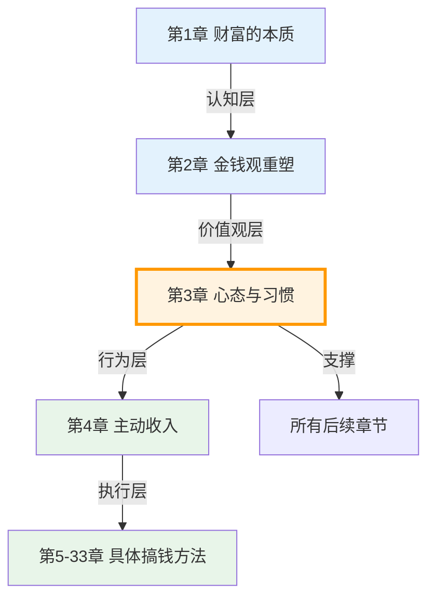
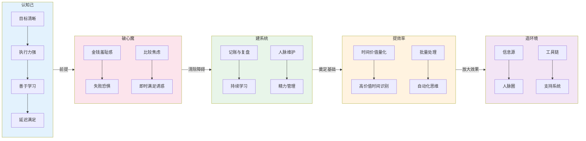

# 第三章：搞钱的心态与习惯

## 为什么这一章是全书的地基

> "成功不是偶然，而是习惯的结果。" —— 亚里士多德

前两章帮你重塑了金钱观——你已经理解了财富的本质，也建立了正确的搞钱认知。但认知只是起点，**真正决定你能否搞到钱的，是你的日常行为模式**。

这一章解决的核心问题是：**知道了，然后呢？**

很多人读完理财书籍后热血沸腾，三天后回到原样。不是因为方法不对，而是因为底层的操作系统——心态和习惯——没有升级。就像一台安装了最新软件的电脑，如果硬件跟不上，照样卡顿。

搞钱的心态与习惯，就是你的"硬件升级"。

### 本章在全书中的位置



**本章是"道"与"术"的桥梁**。前面的章节讲"道"（为什么搞钱），后面的章节讲"术"（怎么搞钱）。本章负责把你从"知道"推向"做到"——没有这个桥梁，再多的术也只是纸上谈兵。

---

## 本章核心问题

本章围绕五个层层递进的问题展开：

| 序号 | 问题 | 本质 | 解决什么 |
|------|------|------|----------|
| 1 | 成功搞钱者有哪些共同特质？ | 认知己 | 建立目标画像，知道自己要成为什么样的人 |
| 2 | 搞钱路上有哪些心理障碍？ | 破心魔 | 清除阻碍行动的内在阻力 |
| 3 | 应该建立哪些日常习惯？ | 建系统 | 把搞钱变成自动化的行为模式 |
| 4 | 如何管理时间和精力？ | 提效率 | 让同样的时间产出更大的价值 |
| 5 | 如何构建搞钱的生态系统？ | 造环境 | 让外部环境持续助推你的搞钱行动 |

这五个问题之间的关系是：**先认清目标（特质）→ 清除障碍（心理）→ 建立习惯（日常）→ 提升效率（时间）→ 借力环境（生态）**。每一步都是下一步的基础。

---

## 本章知识地图



---

## 自我诊断：你目前在哪个阶段？

在开始阅读之前，花2分钟做这个快速自测。它会帮你判断本章哪些部分需要重点阅读。

### 心态自测（勾选符合你的描述）

**关于搞钱认知：**
- [ ] 我有明确的搞钱目标（具体金额+时间期限）
- [ ] 我能清晰地说出自己的搞钱计划
- [ ] 我遇到失败后能快速恢复并继续行动
- [ ] 我能为了长远利益放弃眼前的享受

**关于心理障碍：**
- [ ] 我觉得谈钱有些不好意思
- [ ] 我害怕投资/创业失败
- [ ] 我经常和别人比较财务状况，然后焦虑
- [ ] 我经常冲动消费，事后后悔

**关于日常习惯：**
- [ ] 我有记账的习惯
- [ ] 我每周有固定的学习时间
- [ ] 我定期维护重要的人脉关系
- [ ] 我有规律的运动和作息

**关于时间精力：**
- [ ] 我知道自己每小时值多少钱
- [ ] 我能区分高价值时间和低价值时间
- [ ] 我有批量处理重复事务的习惯
- [ ] 我已经建立了至少3个自动化流程

**关于生态环境：**
- [ ] 我有3个以上高质量的信息源
- [ ] 我有可以交流搞钱话题的圈子
- [ ] 我使用效率工具管理日常事务
- [ ] 我有情感上支持我搞钱的人

### 评分与建议

**勾选0-5项**：你需要完整阅读本章每一节，从头开始建立搞钱的心态和习惯体系。

**勾选6-12项**：你有一定基础，但存在明显短板。建议重点阅读你没勾选的对应章节。

**勾选13-16项**：基础扎实，可以直接跳到核心技巧和深度拓展部分，寻找进阶提升点。

**勾选17-20项**：你已经是高段位选手，本章对你更多是查漏补缺和系统化整理。

---

## 本章结构详解

本章采用"**道-法-术-器**"四层结构，从理论到实操层层递进：

### 第一部分：理论基础（道）

**3.1 成功搞钱者的共同特质**
- 目标清晰，执行力强——不是"想赚钱"，而是"知道怎么赚钱"
- 善于学习，持续迭代——搞钱是一门需要终身学习的手艺
- 风险意识与机会敏感度并存——不做赌徒，也不做保守派
- 延迟满足，长期主义——复利的威力需要时间来兑现

**3.2 克服搞钱路上的心理障碍**
- 对金钱的羞耻感——"谈钱俗气"是最隐蔽的搞钱杀手
- 失败恐惧与完美主义——"等我准备好"永远不会准备好
- 比较心理与焦虑——别人的成功不是你的失败
- 即时满足的诱惑——每一次冲动消费都在透支未来的你

**3.3 建立搞钱的日常习惯**
- 记账与财务复盘——你无法管理你无法衡量的东西
- 定期学习与信息输入——认知升级是搞钱的底层燃料
- 人脉维护与社交投资——弱关系往往比强关系带来更多机会
- 健康管理与精力管理——身体是搞钱的本钱，不是口号

**3.4 时间管理与效率提升**
- 时间就是金钱的量化分析——把抽象概念变成具体数字
- 高价值时间 vs 低价值时间——不是所有时间都等价
- 批量处理与自动化思维——用系统代替意志力

**3.5 构建搞钱的生态系统**
- 信息源：获取高质量信息——信息差就是利润差
- 人脉圈：建立高质量社交网络——你是你最常交往的5个人的平均值
- 工具链：提升效率的工具——好工具让你事半功倍
- 支持系统：情感与精神支持——搞钱路上不孤单

### 第二部分：核心技巧（法）

在理论基础上，本章提供了七个可直接操作的核心技巧：

| 技巧 | 核心内容 | 适用场景 |
|------|----------|----------|
| 目标设定 | SMART原则 + OKR框架 | 不知道怎么定目标的人 |
| 习惯养成 | 21天→66天的科学路径 | 想建立好习惯但总失败的人 |
| 心态调整 | CBT认知行为疗法应用 | 容易焦虑、自我怀疑的人 |
| 时间管理 | 番茄工作法 + GTD | 总觉得时间不够用的人 |
| 精力管理 | 四象限精力模型 | 工作效率低、容易疲惫的人 |
| 深度工作 | 心流状态的触发条件 | 总被干扰打断的人 |
| 社交资本 | 弱关系网络构建 | 人脉资源不足的人 |
| 决策框架 | 面对搞钱机会的决策模型 | 纠结、犹豫不决的人 |

### 第三部分：实战案例（术）

五个真实案例，覆盖搞钱路上最典型的困境：

| 案例 | 主角 | 困境 | 转变 |
|------|------|------|------|
| 月光族逆袭 | 小王 | 月薪1万月月光 | → 年存30万 |
| 焦虑型投资者 | 老张 | 追涨杀跌、夜不能寐 | → 稳健型投资者 |
| 拖延症患者 | 小陈 | 什么都想做、什么都拖 | → 高效搞钱者 |
| 稀缺心态 | 李姐 | 总觉得钱不够、不敢花 | → 富足心态 |
| 信息焦虑 | 老刘 | 每天刷100条资讯、越看越慌 | → 信息节食 |

### 第四部分：练习方法（器）

七个配套练习，帮你把知识转化为行动：

1. **21天记账挑战**——从记录开始了解自己的消费模式
2. **48小时冷静期**——训练延迟满足的肌肉
3. **每周复盘**——建立持续优化的反馈循环
4. **感恩日记**——从稀缺心态转向富足心态
5. **环境设计**——用系统代替意志力
6. **时间价值计算**——把"时间就是金钱"变成具体数字
7. **搞钱伙伴计划**——用社交约束增强执行力

### 第五部分：深度拓展

为高级读者准备的深度内容，包括：
- 富人思维的科学研究（德韦克成长型思维、科利百万富翁研究）
- 延迟满足的经典实验（棉花糖实验的真相与修正）
- 习惯养成的神经科学（基底神经节、习惯回路、微习惯理论）
- 财富心态的训练方法（CBT、正念、目标可视化）
- 成功人士的日常习惯分析（晨间习惯、财务习惯、学习习惯）

---

## 学习路径建议

### 路径一：系统学习（推荐，适合初学者）

按顺序阅读，预计2-3小时：

```text
理论基础(3.1→3.2→3.3→3.4→3.5)
    ↓
核心技巧(选择最需要的2-3个)
    ↓
实战案例(对照自身情况)
    ↓
练习方法(选择1-2个开始)
    ↓
深度拓展(有余力再看)
```

### 路径二：问题导向（适合有基础的读者）

直接跳到你最需要的部分：

- **心态有问题** → 3.2 + 心态调整技巧 + 案例四
- **习惯没建立** → 3.3 + 习惯养成技巧 + 案例一
- **效率太低** → 3.4 + 时间管理技巧 + 案例三
- **环境不对** → 3.5 + 社交资本建设 + 案例五

### 路径三：速览模式（适合时间紧张的读者）

只读以下内容，30分钟即可获得核心收获：

1. 本概览（你现在在读的这个）
2. 3.1 成功搞钱者的共同特质
3. 误区部分（04-常见误区.md）
4. 本章小结（06-本章小结.md）

---

## 关键概念速查表

| 概念 | 定义 | 为什么重要 | 对应章节 |
|------|------|------------|----------|
| 目标清晰 | 知道要什么、为什么、怎么做、何时完成 | 没有清晰目标的行动是盲目的忙碌 | 3.1 |
| 执行力 | 说到做到，立即行动，坚持到底 | 再好的计划不执行等于零 | 3.1 |
| 延迟满足 | 为更大未来收益放弃眼前享受 | 复利需要时间，延迟满足是复利的前提 | 3.1 |
| 长期主义 | 关注长期价值而非短期利益 | 短期思维导致频繁交易和决策失误 | 3.1 |
| 稀缺心态 | 总关注"缺什么"而非"有什么" | 导致短视决策，陷入恶性循环 | 3.2 |
| 富足心态 | 关注"可以做什么"而非"不能做什么" | 打开可能性，促进创造性解决问题 | 3.2 |
| 习惯回路 | 提示→行为→奖赏的神经回路 | 理解回路才能设计和改变习惯 | 3.3 |
| 精力管理 | 管理精力比管理时间更重要 | 精力决定效率，时间只是容器 | 3.3 |
| 时间价值 | 年收入÷年工作小时数 | 让"时间就是金钱"变成可衡量的指标 | 3.4 |
| 高价值时间 | 用于学习、创造、战略思考的时间 | 把最好的精力用在回报最高的事上 | 3.4 |
| 微习惯 | 从极小的行为开始养成习惯 | 降低启动成本，提高坚持概率 | 3.3 |
| 习惯堆叠 | 把新习惯嫁接到已有习惯之上 | 利用已有的神经通路降低新习惯成本 | 3.3 |
| 弱关系 | 不太熟悉的社交关系（前同事、行业活动认识的人） | 弱关系连接不同社交圈，带来更多机会 | 3.5 |
| 承诺机制 | 在理性时做出约束未来自己的决定 | 避免情绪波动时的非理性决策 | 3.4 |

---

## 学习目标

完成本章学习后，你应该能够：

1. **识别成功搞钱者的共同特质**，并用SMART原则设定清晰的搞钱目标
2. **识别并克服四种核心心理障碍**（羞耻感、恐惧、比较、即时满足），建立积极的搞钱心态
3. **建立至少2个搞钱日常习惯**（记账、复盘、学习、人脉、健康），形成正向循环
4. **计算自己的时间价值**，区分高价值时间和低价值时间，提升单位时间产出
5. **构建个人搞钱生态系统**，包括信息源、人脉圈、工具链和支持系统
6. **识别并纠正常见的搞钱误区**，避免踩坑

---

## 预计学习时间

| 阅读方式 | 预计时间 | 适合人群 |
|----------|----------|----------|
| 速览模式 | 30-45分钟 | 时间紧张，想快速了解核心要点 |
| 系统学习 | 2-3小时 | 初学者，想全面掌握 |
| 深度学习 | 4-6小时 | 想要深入理解并付诸实践 |

> **提示**：学习时间不等于练习时间。本章的练习需要持续21天以上才能形成习惯。建议在阅读完的当天就开始第一个练习。

---

## 本章核心公式

```text
搞钱成果 = 心态 × 习惯 × 系统 × 时间
```

- **心态**：正确的金钱观和搞钱心态（本章3.1-3.2）
- **习惯**：有利于搞钱的日常习惯（本章3.3）
- **系统**：自动化、可重复的搞钱系统（本章3.4-3.5）
- **时间**：长期坚持的时间（贯穿全书）

**任何一项为零，结果都为零。**

一个心态正确但没有习惯的人，只能偶尔搞到钱。一个有习惯但系统不对的人，效率低下。一个有系统但心态不对的人，遇到挫折就会放弃。只有四者兼备，搞钱才能持续、稳定、可预期。

---

## 阅读建议

1. **先通读本概览**，建立整体框架感
2. **做完自我诊断**，找到你的薄弱环节
3. **选择适合你的学习路径**，不要贪多
4. **每读完一节，立即做一个小练习**——知识不转化为行动就是信息垃圾
5. **找到一个搞钱伙伴**，一起学习、互相监督

> **最重要的一点**：不要等到"读完所有内容"才开始行动。读到3.1就开始设定目标，读到3.2就开始识别自己的心理障碍，读到3.3就开始记账。**边学边做，才是搞钱的正确姿势。**

***
