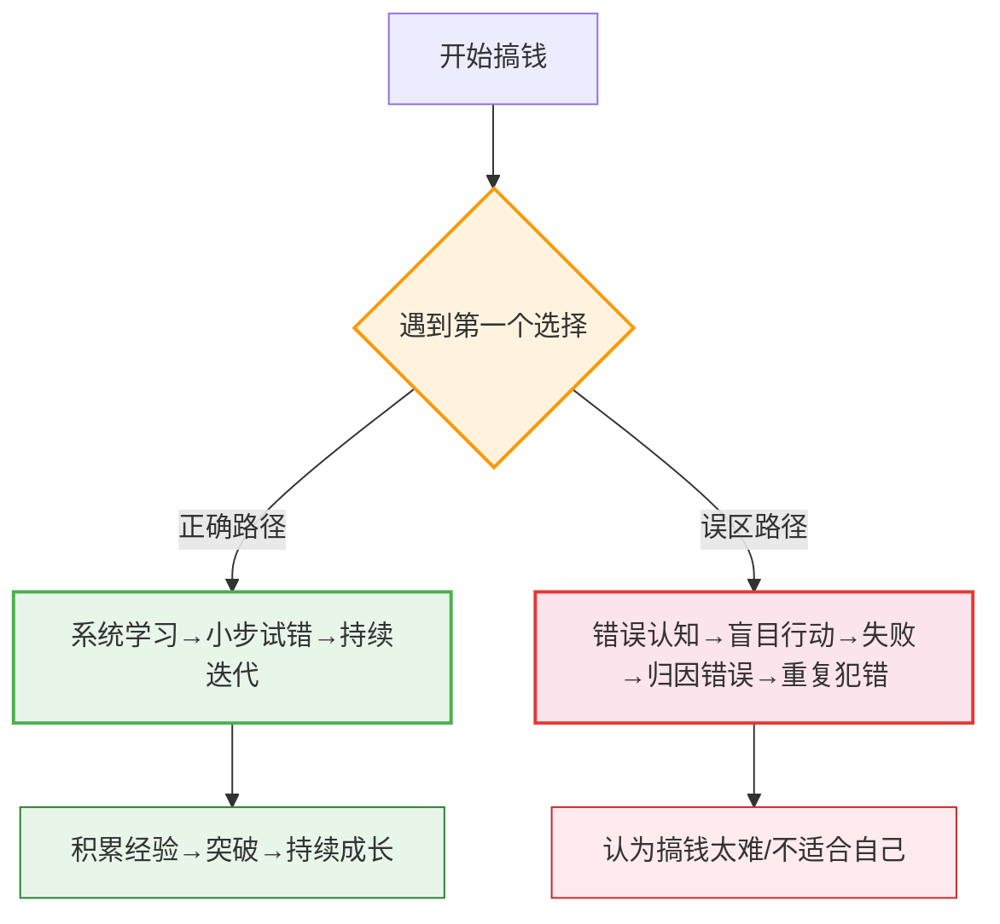
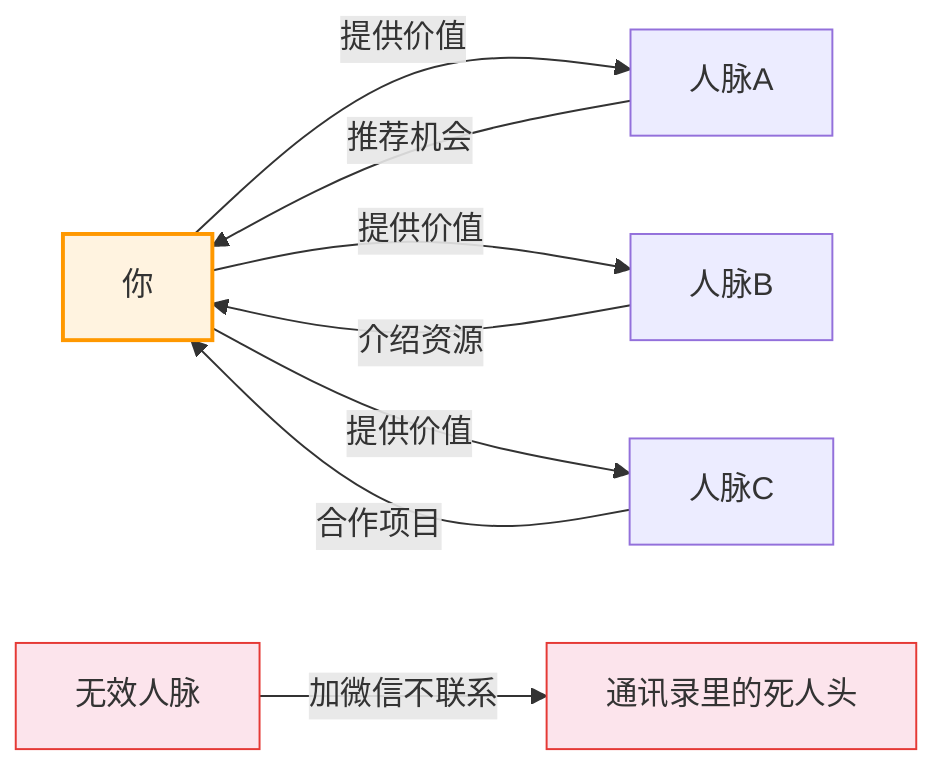
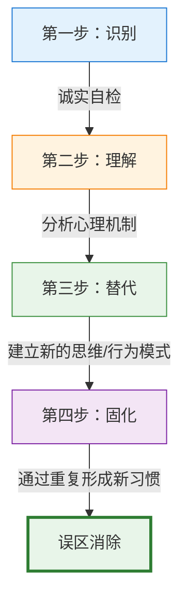
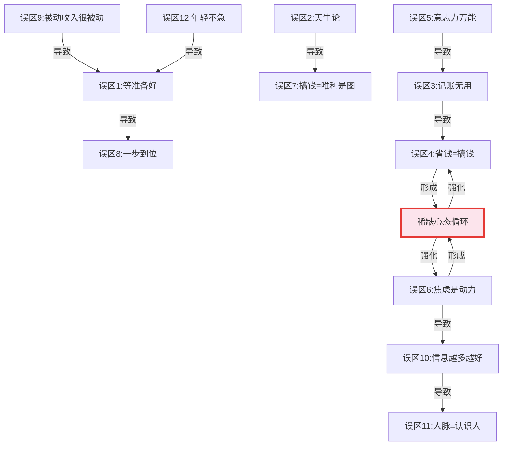

# 第三章：搞钱的心态与习惯 —— 常见误区

## 为什么误区比无知更可怕

无知可以补课，误区却会让你在错误的方向上越跑越远。搞钱路上最危险的不是"不知道怎么做"，而是"自以为知道怎么做"。

心理学中有一个概念叫**邓宁-克鲁格效应（Dunning-Kruger Effect）**：能力不足的人往往会高估自己的能力水平。在搞钱领域，这个效应表现得尤为明显——很多人在入门阶段就形成了"我已经懂了"的错觉，然后基于错误认知做出一系列决策，直到撞墙才意识到自己一直在误区里打转。

本章梳理了搞钱路上**最常见的12个误区**，按照从认知层到行为层的顺序排列。每个误区都包含：表现症状（你是否中招）、心理机制（为什么会这样想）、真实代价（这么想会付出什么）、纠正方法（如何走出来）。建议逐条对照，诚实面对自己——发现一个误区，就等于拔掉一颗定时炸弹。

---

## 误区一：等我准备好了再开始

### 你可能这么想过

- "等我看完这本理财书再开始投资"
- "等我存够10万再开始理财"
- "等我想清楚商业模式再创业"
- "等时机成熟再说"
- "等我考下XX证书再跳槽"

### 心理机制：完美主义的保护壳

"等准备好"本质上是一种**回避行为**，被完美主义包装成了"慎重"。心理学家休伊特和福莱特将完美主义分为三种类型：

| 类型 | 表现 | 在搞钱中的典型行为 |
|------|------|-------------------|
| 自我导向型完美主义 | 对自己要求极高 | "我要把所有知识学完才能开始" |
| 社会期许型完美主义 | 担心别人评价 | "万一失败了别人会笑话我" |
| 他人导向型完美主义 | 对环境要求极高 | "现在经济环境不好，不适合行动" |

三种完美主义的共同结果：**永远在准备，永远不开始**。

神经科学研究揭示了更深层的原因：大脑的杏仁核在面对不确定性时会触发恐惧反应，而"再准备一下"是大脑用来回避这种不适感的策略。你觉得自己在"准备"，实际上是大脑在保护你远离不确定性的威胁。

### 真实代价

不开始的代价不是零，而是**负数**：

1. **机会成本不断累积**。假设你每月能存2000元并投入年化8%的指数基金，推迟一年开始意味着你最终会少赚约24,000元（考虑复利效应）。推迟三年，这个数字变成约80,000元。你以为自己在"等待最佳时机"，实际上在亏钱。

2. **学习效率极低**。阅读投资书籍的实际知识留存率约为10%，而通过实践学习的留存率高达75%。看100本游泳教材，不如跳进水里游一次——这不是鸡汤，是教育心理学中的"学习金字塔"理论。

3. **心理成本越来越高**。每多等一天，"开始"这件事的心理门槛就高一分。拖延行为研究者皮尔斯·斯蒂尔提出"时间动机理论"：任务的拖延程度与开始的延迟成正比。等得越久，越难开始。

### 如何走出来

**核心原则：先开始，再优化。最小可行行动（Minimum Viable Action）。**

具体步骤：

1. **定义"最低启动门槛"**。不是"学完所有知识再投资"，而是"今天就开一个基金账户，先投100元"。不是"想清楚所有商业模式再创业"，而是"这周末就做一个最简单的原型给3个人看"。

2. **设置"准备期上限"**。给自己一个硬性截止日期。比如："我给自己两周时间了解基础知识，两周后不管准备到什么程度，都必须开始第一步行动。"

3. **把"学习"和"行动"同步进行**。边做边学，用实践中的问题驱动学习，而不是先学完再做。这在教育学中叫"即时应用"，知识转化效率比"先学后做"高出3-5倍。

4. **接受"不完美的开始"**。你的第一次投资可能会亏钱，你的第一个副业可能赚不到钱，你的第一次创业大概率会失败。这些都是正常的。每一次"不完美"都是一次高质量的学习机会。

> "Done is better than perfect."（完成比完美更重要）——Facebook早期企业文化格言

---

## 误区二：成功人士都是天生的

### 你可能这么想过

- "人家有天赋，我没有"
- "人家运气好，我没有"
- "人家有资源/人脉/背景，我没有"
- "人家是富二代，我不是"
- "这种事需要天赋，普通人做不到"

### 心理机制：归因偏差与自我保护

把成功归因于天赋和运气，本质上是一种**自我保护机制**。心理学家伯纳德·韦纳的"归因理论"指出，人们倾向于将他人的成功归因于外部因素（天赋、运气、资源），将自己的失败归因于不可控因素。这样做有一个心理上的好处：**如果成功取决于天赋和运气，那我不成功就不是我的错**。

这是一种舒适但有害的思维模式。

### 事实与数据

美国作家汤姆·科利（Tom Corley）对233位百万富翁和128位低收入者进行了为期5年的跟踪研究（"富人习惯研究"），发现：

| 习惯 | 百万富翁中占比 | 低收入者中占比 |
|------|---------------|---------------|
| 每天阅读30分钟以上 | 88% | 2% |
| 每天运动30分钟以上 | 76% | 23% | 
| 有明确的长期目标 | 80% | 12% |
| 每天早起（至少提前3小时工作） | 44% | 3% |
| 有多个收入来源 | 65% | 2% |

这些数据说明什么？成功人士的共同点不是天赋，而是**可习得的日常习惯**。

安德斯·艾利克森（Anders Ericsson）在"刻意练习"研究中发现，在大多数领域，天赋对最终成就的解释力不到20%，而练习的质量和数量才是决定性因素。他的研究被马尔科姆·格拉德威尔在《异类》中简化为"一万小时定律"——虽然这个简化不够精确，但核心结论是对的：**卓越是后天培养的，不是天生的**。

卡罗尔·德韦克（Carol Dweck）的"成长型思维"研究更进一步证实：认为能力可以通过努力提升的人（成长型思维），比认为能力是固定不变的人（固定型思维），在长期表现上显著更优。

### 正确的认知重构

天赋决定上限，习惯决定下限。对于绝大多数人来说，**远远没有到拼天赋的程度**。你和那些"成功人士"之间的差距，90%来自以下可控因素：

1. **时间分配**：他们把更多时间用在了高价值活动上
2. **学习习惯**：他们每天都在系统性地学习和迭代
3. **行动力**：他们想到了就去做，而不是反复纠结
4. **韧性**：他们失败后能快速恢复，而不是一蹶不振
5. **社交策略**：他们有意识地构建高质量的人际网络

**具体行动**：拿一张纸，写下你认为"成功"但"自己做不到"的3个人。然后逐一分析他们的成长路径——你会发现，他们的起点并不比你高多少，真正的差异在于他们从某个时间点开始，做了不同的选择。

> "大多数人高估了自己一年内能做的事，却低估了十年内能做的事。"——比尔·盖茨

---

## 误区三：记账太麻烦，没有用

### 你可能这么想过

- "记账太花时间了"
- "记了也不会改变什么"
- "大概心里有数就行了"
- "我又不是会计"
- "记了几天就忘了，坚持不下去"

### 心理机制：对"无即时反馈"行为的排斥

记账属于典型的**延迟反馈行为**——你今天记了账，看不到任何即时收益。大脑对这类行为天然排斥，因为人类的奖赏系统（多巴胺回路）更偏好即时反馈。

行为经济学家丹·艾瑞利的研究表明：人们对"当下成本"的感知远强于"未来收益"。记账的"当下成本"（花时间记录）是具体可感的，而"未来收益"（更好的财务决策）是模糊抽象的。这种不对称导致大多数人在尝试几次后就放弃了。

### 不记账的真实代价

**你无法管理你无法衡量的东西。** 这句话出自管理学之父彼得·德鲁克，适用于企业管理，同样适用于个人财务。

不记账的人通常会面临以下问题：

1. **严重低估支出**。多个财务行为学研究表明，不记账的人平均会低估自己实际支出的30%-50%。你以为自己每月花5000，实际可能花了8000。那3000的差额去了哪里？不知道——这就是最大的问题。

2. **无法识别"消费漏洞"**。很多人的财务问题不是收入太低，而是有一些持续性的"隐形支出"在消耗你的现金流：自动续费的订阅服务、从不使用的会员卡、每天一杯奶茶、外卖配送费累积……这些单独看都不起眼，加起来可能每月数千元。

3. **储蓄计划缺乏依据**。不记账就无法制定有效的预算，没有预算就无法控制支出，无法控制支出就永远存不下钱。这是一个恶性循环。

4. **决策缺乏数据支撑**。当你想做出重大财务决策（是否跳槽、是否买房、是否创业）时，你没有足够的数据来评估自己的财务承受能力。

### 正确做法

记账的核心不是"记录每一笔消费"，而是**了解自己的消费模式，找到优化空间**。

**第一阶段（第1-7天）：全面记录**
- 使用自动记账APP（随手记、钱迹、MoneyNote），绑定银行卡自动导入
- 目标不是精确，而是"不漏大项"
- 不纠结几分几毛的差异

**第二阶段（第8-14天）：分类分析**
将消费分为四大类：

| 类别 | 说明 | 优化策略 |
|------|------|----------|
| 固定必要支出 | 房租、水电、交通、基本饮食 | 长期看是否可以降低（换房、优化通勤） |
| 弹性必要支出 | 改善饮食、衣物、日用品 | 设定预算上限 |
| 冲动支出 | 不需要的、后悔的消费 | 建立48小时冷静期 |
| 投资性支出 | 学习、健身、社交 | 评估ROI，合理增加 |

**第三阶段（第15-21天）：优化调整**
- 找出最大的2-3个"消费漏洞"
- 制定下个月的分类预算
- 设置超预算提醒

**进阶：每周10分钟复盘**。不需要每天盯着账本，每周日晚上花10分钟看一次本周消费概况，重点关注"异常值"——哪笔支出超出了你的预期？为什么？

> "记账不是为了省钱，而是为了把钱花在真正重要的地方。"

---

## 误区四：省钱就是搞钱

### 你可能这么想过

- 为了省10块钱，花1小时比价
- 为了免费的东西，排2小时的队
- 为了打折，买了一堆不需要的东西
- 为了省钱，不舍得投资自己
- "钱是省出来的"

### 心理机制：稀缺心态的陷阱

哈佛大学教授塞德希尔·穆来纳森和普林斯顿大学教授埃尔德·沙菲尔在《稀缺》一书中揭示了"稀缺心态"的运作机制：当人们感到资源不足时，大脑会自动进入"隧道视野"模式——全部注意力集中在眼前的"省钱"上，忽略了更大的图景。

稀缺心态的三个致命影响：

1. **管窥效应**：只看到眼前的省钱机会，看不到背后的时间成本和机会成本
2. **借用效应**：为了今天的"省"，透支明天的资源（比如为了凑满减买不需要的东西）
3. **带宽不足**：财务焦虑消耗了认知资源，导致决策质量下降

### 算一笔账：过度省钱的隐性成本

假设你月薪15,000元，每月工作176小时，时薪约85元。

| 行为 | 省下 | 花费时间 | 时间成本 | 净收益 |
|------|------|----------|----------|--------|
| 花1小时比价买手机省200元 | 200元 | 1小时 | 85元 | +115元 |
| 花2小时排队领免费赠品 | 50元 | 2小时 | 170元 | **-120元** |
| 为了满减凑单买了不需要的东西 | "省"30元 | - | 多花了200元 | **-170元** |
| 不舍得花2000元学技能课 | 2000元 | - | 可能带来2万加薪 | **-18,000元** |

过度省钱还有一个更隐蔽的代价：**形成稀缺心态，限制你的视野和格局**。当你把全部精力都放在"怎么省下这10块钱"上时，你就没有精力去思考"怎么多赚10,000块钱"。

### 正确做法：大处着眼，小处放手

**在大处认真省钱：**
- 住房成本（通常占收入25%-35%）：选择性价比高的住所，考虑合租
- 保险配置：选对产品比选贵产品重要10倍
- 大件消费：认真做功课，但不要花超过2小时比价
- 订阅服务：每季度清理一次，砍掉不用的

**在小处果断放手：**
- 日常餐饮：别为了省5块钱吃让自己不开心的东西
- 通勤：如果打车能让你多出30分钟学习/休息时间，这笔钱值得花
- 品质生活：一杯好咖啡、一本好书、一次好的体验——这些"小确幸"是保持搞钱动力的燃料

**最重要的一条：投资自己永远是最高回报的投资。** 花2000元学一门新技能，可能带来20,000元的加薪。花500元参加行业活动，可能结识一个改变你职业轨迹的人。这些"花钱"行为的ROI远高于任何省钱行为。

> "穷人省钱，富人省时间。真正的高手，把钱花在能产生更多钱的地方。"

---

## 误区五：意志力可以解决一切

### 你可能这么想过

- "我要靠意志力坚持记账"
- "我要靠意志力控制消费"
- "我要靠意志力每天学习"
- "我要靠意志力戒掉XX"
- "只要我足够自律，就能成功"

### 心理机制：意志力的"肌肉模型"

心理学家罗伊·鲍迈斯特（Roy Baumeister）的"自我损耗"理论（Ego Depletion）揭示了一个关键事实：**意志力是一种有限的、可耗竭的心理资源**，就像肌肉一样，使用后会疲劳。

经典实验：让两组受试者面对一盘巧克力饼干。一组被要求必须抵抗诱惑（只吃萝卜），另一组可以随意吃。之后让两组人做一道无解的数学题。结果：抵抗过诱惑的那组人平均坚持了8分钟就放弃，而另一组平均坚持了19分钟。

这意味着什么？你在白天用意志力抵抗了消费冲动、强迫自己学习、控制饮食……到了晚上，你的意志力已经所剩无几，这时候再遇到诱惑（比如刷到一个"限时折扣"），你几乎没有抵抗力。

更关键的是：**环境对行为的影响远大于意志力**。斯坦福大学行为设计实验室的B.J.福格教授指出，如果你想改变一个行为，改变环境比增强意志力有效10倍。

### 正确做法：用系统代替意志力

这是搞钱路上最重要的认知转变之一。不要试图做一个"意志力更强的人"，而要设计一个"不需要意志力的系统"。

**四层系统设计：**

**第一层：自动化（消除决策）**
- 设置工资日自动转账到储蓄/投资账户
- 设置基金定投（每月自动扣款）
- 设置信用卡自动还款（避免逾期和利息）
- 设置账单自动缴费

这一层的核心逻辑：**不给自己花钱的机会**。钱在进入你的消费账户之前就已经被"截流"了。

**第二层：环境设计（消除诱惑）**
- 卸载购物APP（需要时再装回来，这个"安装"的动作就是一道防线）
- 取消关注种草博主和促销号
- 关闭消费类APP的推送通知
- 把信用卡收起来，只留一张日常消费卡
- 退出打折促销群

**第三层：减少选择（消除纠结）**
- 固定日常消费模式（比如工作日午餐就吃固定的几家店）
- 设定每月"自由消费"预算，花完即止
- 对非必要消费建立"48小时冷静期"规则
- 建立"必要支出清单"，清单外的消费默认不买

**第四层：外部约束（增加违约成本）**
- 公开你的储蓄目标（朋友圈、搞钱社群）
- 找一个"搞钱伙伴"互相监督
- 设置违约惩罚（没完成目标就给朋友转200元）
- 把储蓄目标可视化（进度条、目标墙）

> "不要考验自己的意志力，要设计不需要意志力的系统。"——这是查理·芒格反复强调的智慧。

---

## 误区六：焦虑是搞钱的动力

### 你可能这么想过

- "我要保持焦虑，这样才能有动力"
- "看到别人赚钱我就焦虑，焦虑让我行动"
- "没有压力就没有动力"
- "安逸会让人堕落"
- "焦虑说明我还在意，说明我还有上进心"

### 心理机制：焦虑的"伪动力"陷阱

焦虑确实能让你"动起来"——但这种"动"和真正的有效行动是两回事。

哈佛商学院教授艾莉森·伍德·布鲁克斯的研究发现：焦虑状态下的个体，其决策质量显著下降。焦虑会激活大脑的杏仁核（威胁检测中心），同时抑制前额叶皮层（理性决策中心）的功能。简单说：**焦虑让你变蠢了**。

在搞钱领域，焦虑驱动的行为模式通常是：

1. **追涨杀跌**：看到别人赚钱就焦虑→冲动入场→市场波动→恐慌抛售→亏损→更焦虑
2. **盲目跟风**：焦虑让你丧失独立判断力→跟风做"风口"项目→缺乏深入研究→失败
3. **过度承诺**：焦虑驱动你同时做太多事→精力分散→什么都做不好→更焦虑
4. **决策疲劳**：持续焦虑消耗认知资源→面对真正重要的决策时已经精疲力竭

这是一个**焦虑→低质量行动→失败→更焦虑**的恶性循环。

### 焦虑vs目标：两种动力模式的对比

| 维度 | 焦虑驱动 | 目标驱动 |
|------|----------|----------|
| 决策质量 | 冲动、短视 | 理性、长远 |
| 持续性 | 忽高忽低，像过山车 | 稳定输出 |
| 情绪状态 | 紧张、不安、内耗 | 充实、有方向感 |
| 面对失败 | 崩溃、自我否定 | 分析原因、调整策略 |
| 对健康的影响 | 失眠、胃病、免疫力下降 | 正向循环，精力充沛 |
| 长期结果 | 偶尔赚钱，经常亏钱 | 持续稳健增长 |

### 正确做法：从焦虑驱动转向目标驱动

**第一步：识别焦虑信号。** 当你感到"必须马上做点什么"的时候，先停下来问自己：这个冲动是来自清晰的目标，还是来自焦虑？如果是焦虑，先处理情绪，再做决策。

**第二步：建立"目标锚"。** 设定一个清晰的、具体的、有时间限制的财务目标。比如："3年内存款达到50万"。当焦虑来袭时，用这个目标来校准你的行动——这个行动是在靠近目标，还是只是在缓解焦虑？

**第三步：用"计划"代替"冲动"。** 焦虑让你"现在就要行动"，计划让你"在正确的时间做正确的事"。每周日晚上花30分钟规划下一周的搞钱行动，然后在工作日按计划执行，而不是被每天的焦虑牵着走。

**第四步：建立情绪缓冲机制。** 运动（每天30分钟有氧运动能显著降低焦虑水平）、冥想（正念冥想已被大量研究证实能降低焦虑）、社交支持（和理解你的人聊聊）——这些不是"浪费时间"，而是保持高效搞钱状态的基础设施。

> "焦虑来自于不确定性，目标来自于清晰的规划。用确定性对抗不确定性，才是搞钱的正确姿势。"

---

## 误区七：搞钱就是唯利是图

### 你可能这么想过

- "我不想成为金钱的奴隶"
- "搞钱会让人变得功利"
- "钱不是万能的"
- "我追求的是生活品质，不是钱"
- "谈钱伤感情"
- "太看重钱的人格局小"

### 心理机制：金钱羞耻感的来源

这种想法的根源是一种深层的**金钱羞耻感**——认为追求财富在道德上是可疑的。

这种羞耻感来自多个源头：
- **文化传统**：中国传统中"重义轻利"的价值观，"君子喻于义，小人喻于利"
- **家庭教育**：很多家庭从小教育孩子"谈钱俗气"、"够用就好"
- **社会叙事**：媒体上充斥着"有钱人不幸福"、"金钱是万恶之源"的故事
- **心理防御**：当你觉得自己搞不到钱时，贬低金钱的价值是一种自我保护

### 搞钱的真实意义

搞钱不是目的，是工具。但这个工具极其重要——它决定了你有多少选择的自由。

**有钱意味着什么？**

1. **选择的自由**：你可以在不喜欢的工作面前说"不"，因为你有存款支撑你找到更好的机会
2. **抵御风险的能力**：当疾病、失业、意外来临时，你不会手足无措
3. **帮助他人的能力**：你想孝敬父母、帮助朋友、支持公益——这些都需要钱
4. **追求梦想的底气**：想创业、想转行、想gap year——有存款才有底气
5. **时间和注意力的解放**：不用把所有精力都花在"生存"上，可以把注意力放在"生活"上

**不搞钱的真实代价：**
- 面对不喜欢的工作，没有底气辞职
- 家人生病时，只能在网上求助
- 想学习新技能，没有时间和金钱投入
- 遇到好的机会，没有资源去抓住
- 梦想永远只能是"等以后有钱了再说"

### 正确做法：重新定义"搞钱"

搞钱不是"唯利是图"，搞钱的本质是**创造价值并获得对等回报**。

- "我要创造价值，获得回报" —— 你提供产品或服务，客户付钱，这是双赢
- "我要解决问题，获得报酬" —— 你解决了别人的痛点，这是社会贡献
- "我要提升自己，获得更高的市场价值" —— 你变得更优秀，收入自然增长
- "我要建立系统，让钱为我工作" —— 你从"出卖时间"升级到"资本运作"

搞钱和道德不仅不冲突，反而可以高度统一。一个持续创造价值、诚实经营、回馈社会的赚钱者，比一个"视金钱如粪土"但无法养活自己的人，对社会的贡献更大。

> "搞钱不是为了成为有钱人，而是为了成为自由人。"

---

## 误区八：一步到位

### 你可能这么想过

- "我要找到一个完美的搞钱方法"
- "我要一次性解决所有财务问题"
- "我要找到一个一劳永逸的投资策略"
- "我要一步到位实现财务自由"
- "我要找到一个确定能赚钱的项目"

### 心理机制：对"确定性"的过度追求

人类大脑天生厌恶不确定性。在搞钱领域，这种厌恶表现为对"确定性方案"的执着追求——想找到一个"保证有效"的方法，一次性解决问题。

但现实是：**搞钱是一个持续迭代的过程，不是一个一次性的事件**。

期望一步到位会导致三个问题：

1. **期望越高，失望越大**。当你期待"一步到位"时，任何不完美的结果都会让你感到挫败，更容易放弃。

2. **错过"渐进式增长"的威力**。假设你每月收入增长1%，一年后你的收入将增长12.7%，十年后将增长约148%。复利效应需要时间，而"一步到位"的思维让你忽视了这个最强大的力量。

3. **容易被骗局吸引**。所有"快速致富"、"一夜暴富"的项目，本质上都是在利用人们对"一步到位"的渴望。当你期待捷径时，就是骗子最容易得手的时候。

### 正确做法：接受渐进式进步

**搞钱的正确节奏是：先建立基础→再逐步提升→最终实现突破。**

一个参考路径（不同人的速度会不同）：

| 阶段 | 时间 | 核心任务 | 预期状态 |
|------|------|----------|----------|
| 基础期 | 第1年 | 建立记账习惯、存3个月应急基金、学习基础理财知识 | 财务状况清晰，有安全垫 |
| 成长期 | 第2-3年 | 开始投资、建立被动收入来源、提升核心技能 | 收入增长20-50%，有投资经验 |
| 加速期 | 第4-5年 | 多收入来源、资产配置优化、建立个人品牌 | 财务状况明显改善，有底气 |
| 收获期 | 第6-10年 | 被动收入超过基本支出、选择权大幅提升 | 接近或达到财务自由 |

**关键心态**：
- 每一步都要比上一步好一点，而不是一步登天
- 接受"螺旋式上升"——有时候会退步，但总体趋势是向上的
- 专注于"可控的下一步"，而不是"遥远的终点"

> "不要高估一年能做的事，不要低估十年能做的事。"

---

## 误区九：被动收入很"被动"

### 你可能这么想过

- "我要找到一个躺赚的方法"
- "被动收入就是什么都不用做就能赚钱"
- "只要建立了被动收入，就可以退休了"
- "写一本书/做一个课程，就可以一直收钱"

### 心理机制：对"轻松赚钱"的幻想

"被动收入"这个概念被过度美化了。社交媒体上充斥着"睡后收入"、"躺赚"的叙事，让很多人误以为被动收入就是"不用工作也能赚钱"。

真相是：**不存在真正"被动"的收入**。所有被称为"被动收入"的来源，都需要大量的前期投入（时间、金钱、精力），并且需要持续的维护。

### 各类"被动收入"的真实工作量

| 被动收入类型 | 前期投入 | 持续维护 | 真实案例 |
|-------------|----------|----------|----------|
| 出租房产 | 大量资金+选房精力 | 租客管理、维修、空置期处理 | 年化收益率通常3-5%，扣除管理精力后更低 |
| 写书/课程 | 数百小时创作+营销 | 内容更新、答疑、平台维护 | 大多数书籍年销量不足1000本 |
| 投资理财 | 学习时间+本金 | 持续研究、调仓、风险控制 | 需要持续学习，不存在"设置完就不管"的策略 |
| 股息收入 | 大量本金 | 公司分析、组合调整 | 需要至少100万本金才能产生可观的被动收入 |
| 自媒体 | 数百小时内容创作 | 持续更新、互动、平台运营 | 99%的自媒体人月入不足3000元 |

### 正确理解被动收入

被动收入的正确理解是：**前期用大量时间和精力建立一个系统，后期用较少的时间维护，获得持续的收入流**。

它不是"不用工作"，而是"用前期的高强度工作，换取后期的较低强度维护"。就像种树——前期需要挖坑、种苗、浇水、施肥，后期只需要偶尔修剪和防虫，就能持续收获果实。

**正确做法**：
1. 不要期望"躺赚"，做好前期高强度投入的心理准备
2. 选择一个你愿意长期投入的领域，而不是追逐"最赚钱"的风口
3. 把"被动收入"当作长期目标（3-5年），而不是短期方案
4. 建立"主动收入+被动收入"的组合，而不是完全依赖被动收入

---

## 误区十：多就是好——信息越多越好

### 你可能这么想过

- "我要关注更多搞钱博主，获取更多信息"
- "我要加入更多社群，获取更多资源"
- "我要看更多书、更多课程，学到更多知识"
- "信息就是力量，知道越多越好"

### 心理机制：信息焦虑与"FOMO"

FOMO（Fear of Missing Out，错失恐惧症）在信息时代被无限放大。你害怕错过任何一个"搞钱机会"，所以不断刷新信息流、加入新社群、购买新课程。

但信息过载的危害比信息不足更大：

1. **决策瘫痪**：选项太多反而让你无法做出决定。心理学家巴里·施瓦茨在《选择的悖论》中证明，选择越多，满意度越低。
2. **浅层学习**：什么都看一点，什么都不深入。你拥有的是"信息碎片"，而不是"知识体系"。
3. **焦虑加剧**：看到别人赚钱就焦虑，看到新机会就想追，永远在追逐，永远不满足。
4. **注意力耗散**：你的注意力是有限资源，花在"收集信息"上的注意力，就是从"执行行动"上偷走的。

### 正确做法：信息节食

**原则：少而精，深而透。**

1. **精选3-5个高质量信息源**，砍掉其余的。宁可深度阅读一个优质公众号，也不要浅层浏览20个。
2. **设定固定的信息消费时间**。比如每天早上30分钟看行业资讯，其余时间关闭推送。
3. **区分"需要知道"和"想要知道"**。需要知道的直接关系到你当前的搞钱行动；想要知道的只是让你"感觉在学习"。
4. **用行动消化信息**。每学到一个新知识，24小时内必须采取一个相关行动。不能转化为行动的信息就是噪音。

> "信息不是力量，能转化为行动的信息才是力量。"

---

## 误区十一：人脉就是认识很多人

### 你可能这么想过

- "我要多参加活动，认识更多人"
- "加了微信就是人脉"
- "认识大佬就能搞到钱"
- "社交就是要广撒网"
- "人脉越多，机会越多"

### 心理机制：对"人脉"的肤浅理解

很多人把"人脉"等同于"通讯录里的联系人数量"。加了500个微信好友，觉得自己"人脉广"。但社会学家马克·格兰诺维特在1973年提出的"弱关系理论"告诉我们：**真正带来机会的，往往不是你认识多少人，而是你在不同社交圈之间有多少"桥梁"**。

更关键的是：**人脉的本质是价值交换，不是单方面索取**。你认识大佬没用，大佬愿不愿意帮你才取决于你能为大佬提供什么价值。

### 人脉的真正运作机制

**有效人脉的三个条件：**
1. **互相知道对方能提供什么价值**（不是只知道名字）
2. **有信任基础**（有过合作或深度交流）
3. **保持一定频率的互动**（不是加了微信就再也不说话）

### 正确做法：构建"高价值弱关系网络"

1. **先提升自身价值**。你是你最常交往的5个人的平均值——但前提是，你得有被别人"平均"的价值。专注于提升自己的专业能力和资源，是构建有效人脉的前提。

2. **有策略地社交**。不是"什么活动都参加"，而是选择和你的搞钱方向高度相关的场景：行业会议、专业社群、项目合作。

3. **维护20个核心关系**。邓巴数告诉我们，人能维持的有效社交关系约150个，其中核心圈约20个。把80%的社交精力放在这20个核心关系上。

4. **遵循"先给后取"原则**。每次社交互动前，先想"我能为对方提供什么价值"。一个愿意主动帮助别人的人，比一个到处索取的人拥有更强的人脉网络。

---

## 误区十二：年轻就应该享受，搞钱是以后的事

### 你可能这么想过

- "我还年轻，不着急"
- "趁年轻多享受，以后再攒钱"
- "等我30岁以后再开始考虑财务问题"
- "人生苦短，及时行乐"
- "年轻就是资本，以后有的是时间"

### 心理机制：双曲贴现（即时偏好）

行为经济学中的"双曲贴现"理论解释了为什么人们倾向于选择即时满足而非延迟回报。简单说：**人脑对"现在的快乐"的估值，远远高于"未来的快乐"**。

一个经典实验：给你两个选择——今天拿100元，或一个月后拿120元。大多数人选择今天拿100元。但从理性角度看，一个月多赚20元（年化回报率240%）是极好的投资。

"及时行乐"就是双曲贴现在搞钱领域的典型表现。

### 复利的残酷真相：年轻时的每一分钱都很值钱

假设年化收益率8%（长期指数基金的平均水平）：

| 开始投资年龄 | 每月投入 | 投资年限 | 60岁时总金额 |
|-------------|----------|----------|-------------|
| 22岁 | 1000元 | 38年 | 约348万 |
| 27岁 | 1000元 | 33年 | 约226万 |
| 32岁 | 1000元 | 28年 | 约144万 |
| 37岁 | 1000元 | 23年 | 约88万 |

晚开始5年，最终少赚超过100万。晚开始10年，少赚超过200万。这就是复利的残酷数学——**时间是你最大的朋友，也是你最大的敌人**。

### 正确做法：平衡当下与未来

年轻时搞钱不是要你"苦行僧"式地省钱不花，而是要你**建立正确的优先级**：

1. **"先付给自己"原则**：收入到手后，先存下15-20%，剩下的才是可消费金额。这样你既享受了生活，又积累了资本。
2. **区分"体验消费"和"物质消费"**：旅行、学习、社交——这些体验型消费值得投入。最新款手机、名牌包——这些物质型消费的边际效用递减很快。
3. **建立"自动化储蓄"**：设置工资日自动转账，让自己"看不到"那部分钱。心理学研究表明，"看不到的钱"不会被惦记。
4. **投资自己的"赚钱能力"**：年轻时最大的资产不是存款，而是你的赚钱能力。花在学习、技能提升、人脉拓展上的钱，回报率远高于任何金融投资。

> "20岁时你做选择，30岁时选择塑造你。"

---

## 如何识别和走出误区：自检与行动框架

### 误区自检清单

每个月花10分钟，诚实回答以下问题：

**认知层误区：**
- [ ] 我是否在等待"完美时机"或"准备好了"再开始？
- [ ] 我是否把别人的成功归因于天赋/运气/资源？
- [ ] 我是否对"搞钱"这件事有道德上的羞耻感？
- [ ] 我是否期望找到一个"一劳永逸"的搞钱方法？

**行为层误区：**
- [ ] 我是否在过度省钱，忽视了赚钱和投资自己？
- [ ] 我是否在靠意志力而不是系统来坚持搞钱习惯？
- [ ] 我是否在焦虑驱动下做出冲动的财务决策？
- [ ] 我是否在被动收入上投入了不切实际的期望？

**信息层误区：**
- [ ] 我是否在收集信息而不是执行行动？
- [ ] 我是否把"认识人"等同于"有人脉"？
- [ ] 我是否在用"年轻"当借口推迟搞钱？
- [ ] 我是否忽视了记账/复盘这些"麻烦"但有效的基础动作？

### 误区修正的四步法

**第一步：识别**（最难的一步）
- 对照自检清单，诚实面对自己的误区
- 让信任的朋友帮你"照镜子"——旁观者往往比你更清楚你的盲区
- 回顾过去半年的财务决策，找出哪些是由误区驱动的

**第二步：理解**
- 了解误区背后的心理机制（本节已经详细解释了每个误区的心理成因）
- 理解"我为什么会这样想"——不是为了自我辩解，而是为了找到根因
- 认识到误区是人类大脑的"默认设置"，不需要自责

**第三步：替代**
- 针对每个误区，找到一个替代性的思维模式或行为模式
- 不是"戒掉"旧习惯，而是"替换"为新习惯——大脑不擅长"不做某事"，擅长"做另一件事"
- 从小处开始：不要试图一次纠正所有误区，选择影响最大的一个先开始

**第四步：固化**
- 通过重复将新模式变成自动化的习惯（参考习惯养成的21-66天周期）
- 设定提醒和检查机制（每周复盘时检查自己是否回到了旧模式）
- 允许偶尔的失败——误区的纠正不是线性的，而是螺旋式前进的

### 当误区反复出现时

误区会反复出现——这不是你"不够好"，而是人类大脑的正常运作方式。关键是在每次"复发"时：

1. **不自责**。自责会消耗你的心理能量，让你更难走出误区。
2. **缩短"复发期"**。第一次可能花了一个月才意识到自己回到了误区，下次目标是两周内发现，再下次是一周。
3. **记录触发条件**。什么情境、什么情绪、什么人最容易触发你的误区？知道了触发条件，就能提前防范。

---

## 误区之间的关联：一张全景图

这12个误区不是孤立存在的，它们往往互相强化，形成一个"误区网络"：

打破误区的关键不是"逐个击破"，而是**找到你误区网络中的"枢纽节点"**——那个一旦改变，就能连锁改善其他误区的核心误区。

对大多数人来说，这个枢纽节点通常是以下三个之一：

1. **"等准备好"（误区1）**：如果你的主问题是拖延和不敢开始，先从"最小可行行动"开始
2. **"焦虑驱动"（误区6）**：如果你的主问题是焦虑和冲动决策，先从情绪管理开始
3. **"省钱=搞钱"（误区4）**：如果你的主问题是过度节俭和稀缺心态，先从重新定义"花钱"开始

找到你的枢纽节点，集中力量突破它，其他误区会像多米诺骨牌一样连锁改善。

---

## 本节小结

搞钱路上的误区，本质上都是人类大脑的"默认设置"在特定场景下的表现。它们不是你的错，但识别和纠正它们是你的责任。

**核心要点回顾：**

1. **先开始，再优化**——不完美的行动胜过完美的计划
2. **习惯大于天赋**——关注你能控制的事情
3. **记账是基础**——你无法管理你无法衡量的东西
4. **大处省钱，小处放手**——投资自己是最高ROI
5. **系统代替意志力**——设计不需要自律的环境
6. **目标代替焦虑**——用确定性对抗不确定性
7. **搞钱是自由的工具**——消除金钱羞耻感
8. **接受渐进式进步**——复利需要时间
9. **被动收入不被动**——前期投入+持续维护
10. **信息节食**——少而精，深而透
11. **人脉是价值交换**——先提升自己
12. **时间是最大资产**——年轻时每一分钱都很值钱

> **最后一句话**：意识到误区的存在，本身就是一种进步。最怕的不是有误区，而是不知道自己有误区。从今天开始，选一个你最容易中招的误区，按照四步法（识别→理解→替代→固化）开始改变。搞钱路上，每纠正一个误区，就少走一段弯路。
