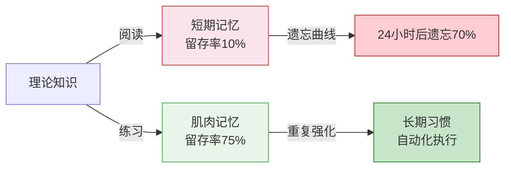
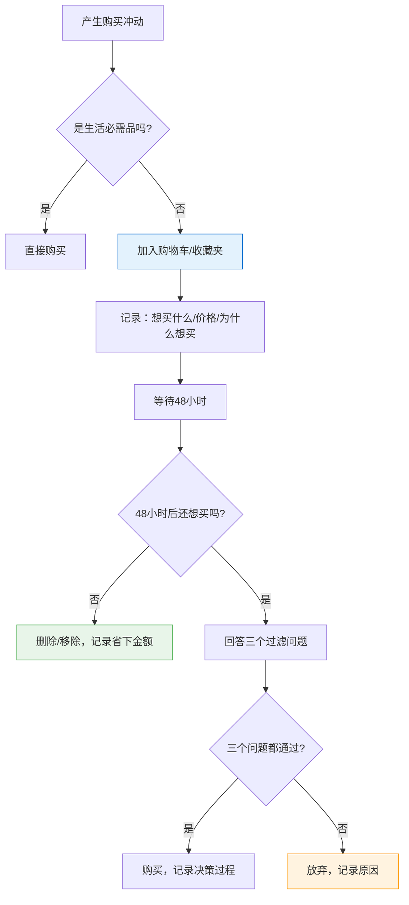
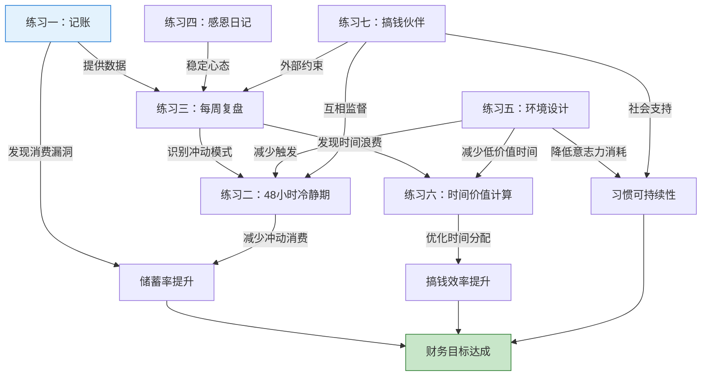

# 第三章：搞钱的心态与习惯 —— 练习方法

## 为什么"知道"和"做到"之间隔着一堵墙

前面的理论基础和常见误区，你可能读完觉得"说得很对"。但仅仅"觉得对"不会改变任何事情。神经科学研究表明，阅读一个概念和真正内化一个概念之间的差距巨大——阅读的知识留存率大约只有10%，而通过实践学习的留存率高达75%（美国国家训练实验室"学习金字塔"数据）。

这就是本章存在的意义：**把你读到的每一个理念，转化为可以执行的行动**。



## 如何使用这些练习

本节包含**七个渐进式练习**，按照从简单到复杂的顺序排列。建议的使用方式：

| 阶段 | 练习 | 时间投入 | 核心能力 | 难度 |
|------|------|----------|----------|------|
| 入门期 | 练习一：21天记账挑战 | 每天10分钟 | 财务觉察 | ★☆☆ |
| 入门期 | 练习四：感恩日记 | 每天5分钟 | 心态建设 | ★☆☆ |
| 进阶期 | 练习二：48小时冷静期 | 每次触发时5分钟 | 延迟满足 | ★★☆ |
| 进阶期 | 练习六：时间价值计算 | 一次性30分钟 | 价值评估 | ★★☆ |
| 巩固期 | 练习三：每周复盘 | 每周30分钟 | 反思迭代 | ★★★ |
| 巩固期 | 练习五：环境设计 | 一次性2-3小时 | 系统构建 | ★★★ |
| 深化期 | 练习七：搞钱伙伴计划 | 每周1小时 | 外部驱动 | ★★★ |

**关键原则**：

1. **不要同时开始所有练习**。心理学家罗伊·鲍迈斯特的"自我损耗"理论告诉我们，意志力是有限资源。同时启动太多新习惯会迅速耗尽你的执行力。建议从入门期的两个练习开始，稳定后再叠加。

2. **先坚持21天再评价效果**。伦敦大学学院的菲利帕·拉利（Phillippa Lally）在2009年的研究发现，习惯自动化的平均时间为66天，但21天足以建立初始的行为模式。不要在第3天就判断"这个练习没用"。

3. **记录过程比记录结果更重要**。每天记录你的执行情况和内心感受，这些数据是后续优化的基础。

---

## 练习一：21天记账挑战

### 为什么记账是所有搞钱行动的第一步

彼得·德鲁克说过："你无法管理你无法衡量的东西。"这句话同样适用于个人财务。

大多数人对自己每月花多少钱、花在哪里，有一个模糊的印象，但这个印象通常偏差30%-50%。你以为自己每月花5000，实际可能花了8000。那3000的差额去了哪里？不知道——这就是最大的问题。

记账不是为了省钱，而是为了**获得财务决策的数据基础**。没有这个基础，后面所有的预算、储蓄、投资计划都是空中楼阁。

### 科学原理

行为经济学中有一个概念叫"心理账户"（Mental Accounting），由诺贝尔经济学奖得主理查德·塞勒提出。人们会在心里把钱分成不同的"账户"——生活费、娱乐费、储蓄等，但这些账户的划分往往是随意的，与实际的现金流不匹配。

记账的作用就是打破这种模糊的心理账户，用真实数据取代主观感受。当你看到"本月外卖支出1200元"时，你的反应和"我觉得没花多少在外卖上"完全不同。

### 详细方法

#### 第一阶段（第1-7天）：全面记录，不遗漏

这个阶段的目标只有一个：**不漏记任何一笔**。不要纠结分类，不要追求精确到分，只需要确保每一笔消费都被记录下来。

**工具选择**：

| 工具 | 优势 | 劣势 | 适合人群 |
|------|------|------|----------|
| 钱迹 | 界面简洁，支持自动导入 | 部分功能需付费 | 追求简洁的用户 |
| 随手记 | 功能全面，社区活跃 | 广告较多，界面稍复杂 | 需要详细分析的用户 |
| MoneyNote | 极简设计，无广告 | 功能较少 | 不喜欢复杂操作的用户 |
| 微信/支付宝账单 | 无需额外操作 | 只覆盖单平台 | 懒人起步方案 |
| Excel/Notion | 完全自定义 | 需要手动输入 | 喜欢自定义的用户 |

**执行要点**：

- **即时记录**。每消费一笔，立刻打开APP记录。延迟记录会导致遗忘，研究表明人在24小时后会遗忘约70%的细节。
- **设置提醒**。在手机上设置3个提醒：午餐后、晚餐后、睡前。提醒内容："今天有遗漏的消费吗？"
- **不遗漏隐形消费**。自动续费的订阅、公交地铁的扫码支付、早餐摊的现金支付——这些是最容易遗漏的。
- **容忍不精确**。这个阶段不要为"早餐到底是8块还是9块"纠结。记录的目的是建立习惯，不是做审计。

**每日记录模板**：

```text
日期：____年____月____日

今日消费明细：
1. ____:____ - ____元 - [即时消费/计划消费]
2. ____:____ - ____元 - [即时消费/计划消费]
3. ____:____ - ____元 - [即时消费/计划消费]
...

今日总计：____元
今日最大一笔：____（____元），是否必要？____
今日是否有"不记得为什么要花"的消费？____
```

#### 第二阶段（第8-14天）：分类分析，找规律

在第一阶段"不遗漏"的基础上，这个阶段要开始分类和分析。

**消费分类体系**：

```mermaid
graph TD
    A[总消费] --> B[必要支出]
    A --> C[改善支出]
    A --> D[冲动支出]
    A --> E[投资支出]
    A --> F[隐形支出]
    
    B --> B1[住房：房租/房贷/物业]
    B --> B2[饮食：基本餐食/食材]
    B --> B3[交通：通勤/公交地铁]
    B --> B4[通讯：手机话费/宽带]
    B --> B5[保险：社保/商业保险]
    
    C --> C1[改善餐饮：外卖/下馆子]
    C --> C2[服饰：换季衣物/鞋包]
    C --> C3[娱乐：电影/游戏/旅游]
    C --> C4[居住改善：装饰/小家电]
    
    D --> D1[看到打折就买的商品]
    D --> D2[情绪性消费]
    D --> D3[跟风购买]
    D --> D4[凑满减的附加商品]
    
    E --> E1[学习：课程/书籍/培训]
    E --> E2[健康：健身/体检/营养品]
    E --> E3[社交：有意义的聚餐/活动]
    E --> E4[工具：提升效率的设备/软件]
    
    F --> F1[自动续费的订阅服务]
    F --> F2[小额高频消费累积]
    F --> F3[手续费/利息/罚款]
    F --> F4[闲置会员卡/储值卡]
    
    style D fill:#fce4ec,stroke:#e53935
    style F fill:#fff3e0,stroke:#ff9800
    style E fill:#e8f5e9,stroke:#4caf50
```



**关键分析方法**：

1. **计算各类别占比**。必要支出应控制在50%-60%，改善支出20%-25%，投资支出10%-15%，冲动支出应趋近于0。
2. **找出"消费漏洞"**。哪一类支出超出你的预期？哪些支出是你事后觉得"不应该花"的？
3. **计算"冲动消费率"**。冲动支出÷总支出×100%。如果超过15%，说明你的消费决策存在较大改善空间。
4. **分析消费时间规律**。你是深夜容易冲动消费（被直播间收割）？还是周末容易超支（社交应酬多）？

#### 第三阶段（第15-21天）：制定预算，优化调整

基于前两周的数据，制定下个月的消费预算。

**预算制定步骤**：

1. **先确定储蓄目标**。建议储蓄率不低于收入的20%。如果目前达不到，先从10%开始，逐步提升。
2. **倒推可消费金额**。月收入 - 储蓄目标 = 可消费金额。
3. **按类别分配**。参考第二阶段的分析结果，为每个类别设定上限。
4. **设置超支预警**。在记账APP中设置各类别的预算上限，超支时自动提醒。

**预算模板**：

```text
月收入：____元
储蓄目标：____元（____%）
可消费金额：____元

| 类别 | 预算上限 | 实际支出 | 差额 | 状态 |
|------|----------|----------|------|------|
| 必要-住房 | ____ | ____ | ____ | ✓/⚠ |
| 必要-饮食 | ____ | ____ | ____ | ✓/⚠ |
| 必要-交通 | ____ | ____ | ____ | ✓/⚠ |
| 改善-餐饮 | ____ | ____ | ____ | ✓/⚠ |
| 改善-娱乐 | ____ | ____ | ____ | ✓/⚠ |
| 投资-学习 | ____ | ____ | ____ | ✓/⚠ |
| 投资-健康 | ____ | ____ | ____ | ✓/⚠ |
| 其他 | ____ | ____ | ____ | ✓/⚠ |
```

### 预期成果

- 清楚知道每月钱花在哪里，精确到具体消费类别
- 发现3-5个可以优化的"消费漏洞"，每月节省500-2000元
- 建立可持续的记账习惯，形成"无意识记账"的自动化行为
- 拥有制定下月预算的数据基础

### 常见卡点与解决方案

**卡点一：记了几天就忘了**

原因：记账还没有成为"锚定习惯"。解决方案：使用"习惯叠加法"——把记账叠加到一个已有的习惯上。比如"每天刷完牙后，花2分钟记录今天的消费"。刷牙这个已有习惯会自动触发记账行为。

**卡点二：觉得记了也没改变什么**

原因：期望即时反馈，但记账的收益是延迟的。解决方案：在第7天做一次"第一周消费总览"，你大概率会惊讶于某个类别的支出比你想象的高很多。这个"啊哈时刻"就是坚持下去的动力。

**卡点三：分类太复杂，不知道怎么分**

原因：过度追求精确。解决方案：先粗后细。前两周只分"必要/改善/冲动/投资"四大类就够了。等习惯建立后再细分。分类的目的是帮助你做决策，不是做会计报表。

---

## 练习二：48小时冷静期练习

### 为什么冲动消费是搞钱的最大敌人

行为经济学家丹·艾瑞利（Dan Ariely）在《怪诞行为学》中揭示了一个关键发现：人类的消费决策很大程度上是**情绪驱动**的，而非理性计算的。当你在直播间看到"限时秒杀"、在商场看到"最后一件"时，你的大脑杏仁核（情绪中枢）会激活，而前额叶皮层（理性决策区）会被抑制。

这种状态下做出的消费决策，事后后悔率高达60%-80%。48小时冷静期的核心目的就是**给前额叶皮层重新上线的时间**。

### 科学原理

神经经济学研究表明，面对诱人的商品时，大脑的伏隔核（奖赏中枢）会大量释放多巴胺，产生强烈的购买冲动。但这种多巴胺脉冲是短暂的——通常在24-48小时内消退。这就是为什么"当时很想买，过两天就不想买了"。

48小时冷静期利用的就是这个神经机制：**等待多巴胺脉冲消退，让理性判断重新主导决策**。

### 详细规则

#### 核心规则

当你产生"想买"的冲动时，执行以下流程：



#### 三个过滤问题（48小时后回答）

这三道问题的设计来自消费心理学研究，分别对应三个维度的需求判断：

**问题一：功能性需求——"我真的需要这个东西吗？"**

区分"需要"和"想要"。"需要"是指没有它会实质性影响你的生活或工作。"想要"是觉得它会让自己更开心、更有面子、更时髦。

判断标准：如果这个东西明天就不存在了，你的生活会受到多大的实际影响？

**问题二：替代性评估——"现有的东西能满足同样的需求吗？"**

很多时候我们买新东西，是因为忘记了自己已经有的。买新衣服前翻翻衣柜，买新电子产品前想想旧的是否还能用。

判断标准：你家里是否有可以完成相同功能的物品？

**问题三：机会成本——"这笔钱是否有更好的用途？"**

每一笔钱花在这里，就不能花在那里。这个问题帮你把这笔消费放到更大的财务图景中考虑。

判断标准：如果把这笔钱用于投资自己（学习、健康）或存入应急基金，哪个选择在3个月后让你更满意？

#### 例外情况的处理

冷静期不是死板的规则，需要有合理的例外：

| 情况 | 处理方式 | 理由 |
|------|----------|------|
| 生活必需品（食材、日用品） | 直接购买，不适用冷静期 | 延迟购买不会带来更好的决策 |
| 限时特价 + 确实需要 | 缩短到24小时，但仍需回答三个问题 | 折扣压力不等于需求真实 |
| 送礼等社交需求 | 如果关系重要，灵活处理 | 社交资本也是投资 |
| 学习资料/课程 | 冷静期内先搜索免费替代方案 | 很多优质内容是免费的 |
| 金额低于50元 | 可以不适用，但记录下来 | 控制管理成本 |

### 每次触发时的记录模板

```text
日期：____年____月____日

【冲动记录】
想买的东西：________________
价格：____元
在哪里看到的：________________
当时的感受/冲动程度（1-10分）：____
为什么想买：________________

【48小时后】
现在还想买吗？ 是/否
冲动程度（1-10分）：____

问题1-我真的需要吗？____
问题2-有替代品吗？____
问题3-有更好的用途吗？____

最终决定：买 / 不买
如果不买，省下了：____元
如果买，购买理由：________________
```

### 进阶技巧：建立"冲动消费日志"

坚持记录每次冲动消费的触发和结果，一个月后你会发现自己冲动消费的模式：

- **时间模式**：深夜（被直播间收割）？周末（社交应酬）？发工资后（心理账户效应）？
- **情绪模式**：压力大时？无聊时？焦虑时？开心时奖励自己？
- **场景模式**：刷手机时？逛商场时？朋友推荐时？
- **品类模式**：服饰？电子产品？美妆？食品？

找到模式后，可以针对性地设计环境干预。比如深夜容易冲动消费，就设置手机定时锁屏；压力大容易吃东西，就用运动替代。

### 预期成果

- 冲动消费减少50%以上
- 每月节省1000-3000元（根据个人消费水平不同）
- 建立"冲动→暂停→评估→决策"的思维模型
- 拥有自己的"冲动消费模式"数据，可以针对性优化

### 常见卡点与解决方案

**卡点一：忍不住，48小时太长了**

解决方案：先从24小时开始，逐步延长到48小时。也可以用"10分钟规则"——不是不买，而是"10分钟后再决定"。10分钟足以让多巴胺脉冲衰减30%。

**卡点二：打折太诱人，过了就没了**

解决方案：认清一个事实——商家每周都有促销活动。"限时折扣"是制造紧迫感的营销手段，不是真正的稀缺。真正的稀缺品（比如学区房）不会在购物APP上打折。把这条写下来贴在手机壳背面。

**卡点三：冷静期过了还是买了，觉得没效果**

解决方案：不要只看"买没买"，还要看"买的原因变了没有"。冷静期后的购买如果经过了理性评估，那就是有效决策，和冲动消费完全不同。

---

## 练习三：每周复盘练习

### 为什么复盘是搞钱能力的"倍增器"

管理学中有一个PDCA循环（Plan-Do-Check-Act），由质量管理大师戴明提出。这个循环的核心思想是：**持续改进来自于系统性的反思和调整**，而不是盲目的重复。

很多人的搞钱行动是这样的：做→做→做→做→做了很久→发现方向不对→从头来过。没有复盘的行动，就像闭着眼睛跑步——你可能很努力，但不知道自己跑的是不是直线。

每周复盘就是PDCA中的"Check"环节。它帮你回答三个关键问题：
1. 我这周做的事情，是在靠近目标还是在远离目标？
2. 什么有效？什么无效？为什么？
3. 下周应该调整什么？

### 详细方法

#### 时间和环境设定

- **固定时间**：每周日晚上8-9点（或你方便的固定时间）
- **固定地点**：安静、不被打扰的环境
- **所需工具**：纸笔或电子文档、本周的记账数据、日程表

#### 复盘的四个维度

每周复盘不只是"总结做了什么"，而是从四个维度系统性地审视过去一周：

**维度一：财务数据复盘（客观事实）**

这是最基础的维度，回答"钱怎么样了"。

```text
本周收入：____元
  - 主业收入：____元
  - 副业收入：____元
  - 其他收入：____元

本周支出：____元
  - 必要支出：____元（占比____%）
  - 改善支出：____元（占比____%）
  - 冲动支出：____元（占比____%）
  - 投资支出：____元（占比____%）

本周净收入（收入-支出）：____元
本周储蓄率：____%（净收入÷收入）
累计储蓄：____元
距离目标还差：____元
```

**维度二：行动复盘（做了什么）**

回答"这周在搞钱方面做了哪些具体的事"。

```text
已完成的行动：
1. ________________________________ [效果评分：/10]
2. ________________________________ [效果评分：/10]
3. ________________________________ [效果评分：/10]

未完成的行动：
1. ________________________________
   原因：□ 时间不够 □ 优先级变了 □ 拖延 □ 外部阻碍 □ 其他：____
2. ________________________________
   原因：□ 时间不够 □ 优先级变了 □ 拖延 □ 外部阻碍 □ 其他：____
```

**维度三：心态复盘（内在状态）**

回答"这周的搞钱心态怎么样"。这个维度很多人忽略，但心态是搞钱的底层操作系统——系统不稳，再好的应用也跑不起来。

```text
本周搞钱心态评分：____/10

本周正面情绪事件：
- ________________________________
- ________________________________

本周负面情绪事件：
- ________________________________
- ________________________________

本周焦虑来源：
- ________________________________
  焦虑程度（1-10）：____
  我是如何应对的：________________

本周心态变化轨迹：
周一：____ → 周三：____ → 周五：____ → 周日：____
（用一个词描述每天的搞钱心态）
```

**维度四：认知复盘（学到了什么）**

回答"这周在搞钱认知上有什么新增长"。

```text
本周新学到的知识/观点：
1. ________________________________
   来源：________________
   如何应用：________________

本周推翻或修正的旧认知：
1. ________________________________
   旧认知：________________
   新认知：________________

本周值得深入研究的问题：
1. ________________________________
```

#### 下周计划制定

基于四个维度的复盘结果，制定下周的行动计划：

```text
下周核心搞钱目标（最多3个）：
1. ________________________________ [预期完成时间：____]
2. ________________________________ [预期完成时间：____]
3. ________________________________ [预期完成时间：____]

下周要避免的陷阱：
- ________________________________

下周要继续保持的好习惯：
- ________________________________

下周的心态关键词：________________
```

### 进阶技巧：月度复盘与季度复盘

每周复盘关注的是战术层面的执行细节。但搞钱是长期的事，需要定期拉高视角看战略方向。

**月度复盘**（每月最后一个周日，增加30分钟）：
- 本月储蓄率趋势：是上升还是下降？
- 本月最大的一个"顿悟"是什么？
- 本月搞钱目标完成率：____%
- 下月的核心调整方向：________________

**季度复盘**（每季度最后一个周日，增加1小时）：
- 本季度资产变化：____元 → ____元（变化：____%）
- 本季度收入变化趋势
- 本季度最大的成长和最大的失误
- 下季度的战略方向调整

### 预期成果

- 建立每周30分钟的复盘习惯，形成PDCA循环
- 搞钱行动不再"盲目"，每周都有明确的方向调整
- 心态波动被记录和管理，减少情绪对决策的干扰
- 每月积累4份复盘记录，可以回溯自己的成长轨迹

### 常见卡点与解决方案

**卡点一：不知道复盘什么，觉得没什么好写的**

解决方案：即使"什么都没做"也是有价值的信息——它说明你这周在搞钱方面是停滞的。写下"本周没有推进任何搞钱行动"，然后分析原因。这本身就是最有价值的复盘。

**卡点二：复盘变成了自我批评会**

解决方案：复盘的目的是"改进"，不是"自我惩罚"。每找到一个问题，必须搭配一个解决方案。如果只是列问题不给方案，那就不是复盘，是自虐。

**卡点三：坚持了几周就停了**

解决方案：降低门槛。如果30分钟的完整复盘让你有压力，先做"5分钟极速复盘"——只回答三个问题：(1)这周搞钱方面做了什么？(2)下周要做什么？(3)有什么要调整的？5分钟的复盘远好过不复盘。

---

## 练习四：感恩日记练习

### 为什么感恩与搞钱有关

这可能看起来不像一个"搞钱练习"，但它解决的是搞钱路上最容易被忽视、也最具破坏力的心理问题：**稀缺心态**。

哈佛大学教授塞德希尔·穆来纳森和普林斯顿大学教授埃尔德·沙菲尔在《稀缺》一书中证明：稀缺心态会严重削弱人的认知能力和决策质量。当你总是关注"缺什么"时，大脑会被焦虑占据，认知带宽下降，做出更差的决策。

感恩日记的作用是**训练大脑关注"有什么"而非"缺什么"**，从神经层面对抗稀缺心态。

### 科学原理

积极心理学研究者罗伯特·埃蒙斯（Robert Emmons）进行了多项感恩干预实验，发现坚持写感恩日记的人在以下方面显著改善：

- **财务满意度提升25%**：即使客观收入没有变化，对财务状况的主观满意度明显提高
- **冲动消费减少**：满足感增强后，"补偿性消费"的需求降低
- **决策质量提升**：焦虑减少后，认知带宽释放，可以做出更理性的财务决策
- **抗挫折能力增强**：面对投资亏损等财务挫折时，恢复速度更快

神经科学的解释是：感恩练习会激活大脑的前额叶皮层和腹侧纹状体，这两个区域与奖赏处理和积极情绪相关。持续练习可以改变大脑的"默认关注点"，从"威胁检测模式"转向"机会发现模式"。

### 详细方法

#### 基础版：每日三件感恩事（5分钟）

每天晚上睡前，花5分钟写下3件今天值得感恩的事情。

**关键规则**：

1. **具体而非笼统**。不是"感谢今天很顺利"，而是"感谢今天午餐时同事分享了一个很好的项目管理工具"。具体的感恩更有效，因为它能激活更多细节记忆相关的神经回路。

2. **轮换关注点**。不要每天都写类似的内容。刻意寻找新的感恩点——与金钱相关的、与人际关系相关的、与自我成长相关的、与日常小事相关的，轮换关注。

3. **关注"为什么"**。不只是写下感恩的事，还要写下"为什么这件事让我感恩"。比如："感谢今天准时下班——因为这让我有时间陪家人，提醒我搞钱的目的不是搞钱本身。"

**每日记录模板**：

```text
日期：____年____月____日

感恩事项一：________________
为什么感恩：________________

感恩事项二：________________
为什么感恩：________________

感恩事项三：________________
为什么感恩：________________

今日财富相关的一个小确幸：________________
```

#### 进阶版：每周财富感恩清单（每周一次，10分钟）

每周日晚上，花10分钟专门从财富角度写一份感恩清单。

```text
第____周财富感恩清单

财务层面的感恩：
1. ________________________________
2. ________________________________
3. ________________________________

能力层面的感恩：
1. ________________________________
2. ________________________________

关系层面的感恩（谁帮助了我的搞钱之路）：
1. ________________________________
2. ________________________________

本周与搞钱相关的"小胜利"：
1. ________________________________
2. ________________________________
```

#### 高阶版：稀缺心态自我检测

在感恩日记的基础上，每周做一次"稀缺心态检测"，识别自己的稀缺心态触发点：

```text
本周稀缺心态检测

触发稀缺心态的事件：
1. ________________________________
   当时的想法：________________
   持续时间：____

触发富足心态的事件：
1. ________________________________
   当时的想法：________________
   持续时间：____

稀缺/富足比例：____:____（目标：逐步向富足倾斜）
```

### 预期成果

- 30天后：心态从"总是关注缺什么"转变为"开始注意有什么"
- 60天后：焦虑水平明显下降，财务决策质量提升
- 90天后：形成自动化的"感恩思维模式"，积极心态成为默认状态

### 常见卡点与解决方案

**卡点一：觉得没什么好感恩的**

解决方案：降低标准。"今天没有生病"、"今天有一顿热饭吃"、"今天手机没坏"——这些看似理所当然的事，换个角度都是值得感恩的。练习的重点是"训练关注积极事物的能力"，不是"找到值得感恩的大事"。

**卡点二：觉得这太鸡汤了**

解决方案：这不是鸡汤，这是经过严格实验验证的心理干预技术。罗伯特·埃蒙斯的研究发表在顶级心理学期刊上，感恩干预的效果已经被大量重复实验证实。把它当作一个"心理健身"动作，和做俯卧撑一样——不需要"相信"它有效，只需要做。

**卡点三：写着写着变成流水账**

解决方案：如果连续三天的感恩内容几乎一样，说明你在"自动执行"而非"真诚感受"。这时候可以换个视角——从不同的感官角度切入：今天看到了什么美好的事物？听到了什么温暖的话？闻到了什么好闻的味道？触感上有什么舒适的体验？

---

## 练习五：环境设计练习

### 为什么环境比意志力重要10倍

斯坦福大学行为设计实验室的B.J.福格教授（BJ Fogg）在研究中得出一个核心结论：**如果你想改变一个行为，改变环境比增强意志力有效10倍**。

为什么？因为意志力是有限的、可耗竭的心理资源（前面"常见误区"中已经详细分析过），而环境是持续存在的外部力量。你不需要每天花意志力去抵抗诱惑——如果环境中根本没有诱惑，你自然就不会被诱惑。

查理·芒格说过一句经典的话："如果我知道我会死在哪里，我就永远不去那个地方。"环境设计的逻辑就是：**把不利于搞钱的因素从你的生活空间中移除，把有利于搞钱的因素放进去**。

### 科学原理

行为科学家库尔特·勒温（Kurt Lewin）的行为公式：**B = f(P, E)**，即行为是个人因素和环境因素的函数。大多数人在试图改变行为时，只关注P（提升自己的意志力、能力），忽略了E（环境）。

但研究表明，环境因素对行为的影响力往往大于个人因素。一个经典的例子：把水果放在办公桌显眼处，把巧克力放在抽屉里——即使巧克力比水果更诱人，人们也会因为"看到水果更容易"而多吃水果。

### 详细方法：三层环境设计

#### 第一层：数字环境设计（手机/电脑）

这是现代人消耗注意力和金钱的主要战场。

**手机环境清理清单**：

| 操作 | 具体步骤 | 原理 |
|------|----------|------|
| 卸载购物APP | 淘宝、京东、拼多多、得物等全部卸载 | 需要时重新安装的动作就是一道防线 |
| 清理订阅 | 取消关注种草博主、促销号、直播间 | 切断被动信息输入 |
| 关闭通知 | 关闭所有非必要APP的推送通知 | 消除外部触发点 |
| 设置屏幕时间 | 设置社交/娱乐APP每日使用上限 | 限制低价值时间 |
| 调整首页 | 首屏只放工具类、学习类APP | 改变"打开手机"的第一个行为 |
| 清理收藏夹 | 删除收藏的购物链接 | 消除"下次再买"的触发点 |

**电脑环境清理清单**：

| 操作 | 具体步骤 | 原理 |
|------|----------|------|
| 修改浏览器首页 | 设为学习/理财网站（如雪球、Coursera） | 每次打开浏览器的第一个动作是学习 |
| 清理书签栏 | 删除购物网站书签，添加学习资源 | 改变默认行为路径 |
| 清理桌面 | 删除游戏和娱乐软件的快捷方式 | 增加启动娱乐软件的步骤数 |
| 安装屏蔽插件 | 使用广告屏蔽插件，减少消费类广告触达 | 消除被动诱惑 |
| 设置工作模式 | 使用专注模式/番茄钟，屏蔽娱乐网站 | 在高价值时间段内隔绝干扰 |

#### 第二层：物理环境设计（生活空间）

你的物理空间会无声地影响你的行为和心态。

**家居环境优化**：

1. **视觉锚点设置**。在你最常待的地方（书桌、床头）放置与搞钱目标相关的视觉锚点：
   - 财务目标的具体数字（写在卡片上，贴在显示器边框）
   - 储蓄进度图（贴在冰箱上或墙上）
   - 你欣赏的搞钱人物的照片或语录

2. **学习角设置**。在家中划定一个专门的学习/思考区域：
   - 只用于学习和与搞钱相关的活动
   - 保持整洁、安静、光线充足
   - 不在这个区域做娱乐活动（建立"这个空间=搞钱"的心理关联）

3. **减少消费触发**：
   - 如果你习惯在商场闲逛时买东西，改变散步路线
   - 如果你路过奶茶店就想买，换一条通勤路线
   - 把信用卡收起来，只留一张日常消费卡，设置消费限额

#### 第三层：社交环境设计

人是社会性动物，你的社交圈对你的搞钱行为影响巨大。

**优化策略**：

1. **加入搞钱社群**。找到1-3个高质量的搞钱社群（付费社群通常质量更高，因为付费本身就是一道筛选门槛）。不是要在群里"潜水学习"，而是要**参与讨论、分享自己的实践、获得反馈**。

2. **关注高质量信息源**。取关所有"贩卖焦虑"的博主，关注那些**提供方法论和实操经验**的内容创作者。推荐标准：(1) 有实际搞钱成果，不是靠卖课赚钱；(2) 分享具体的、可执行的方法；(3) 有数据和案例支撑，不只讲道理。

3. **找到搞钱伙伴**。至少找一个和你目标类似的人，建立定期交流机制（详见练习七）。

4. **减少无效社交**。拒绝那些纯粹消耗时间、没有信息增量、不产生情感价值的社交活动。这不是"势利"，是"把有限的时间投入到高回报的关系中"。

### 环境设计检查清单

完成环境设计后，用以下清单验证：

```text
【数字环境】
□ 手机上没有购物APP（或被移到了很难找到的位置）
□ 手机首屏只有工具类和学习类APP
□ 关闭了所有消费类APP的推送通知
□ 浏览器首页是学习/理财网站
□ 设置了社交/娱乐APP的每日使用时长上限

【物理环境】
□ 有一个固定的学习/搞钱角落
□ 书桌上有财务目标的视觉锚点
□ 没有容易触发消费的物理环境（如收藏的购物杂志）

【社交环境】
□ 加入了至少1个高质量搞钱社群
□ 关注了至少3个提供方法论的优质信息源
□ 有至少1个搞钱伙伴
□ 已取关/屏蔽贩卖焦虑的信息源

【信息环境】
□ 有固定的信息消费时间段（不是随时刷）
□ 能区分"需要知道"和"想要知道"
□ 有付费订阅的高质量内容源
```

### 预期成果

- 消费冲动的触发频率降低60%以上（因为触发源被物理隔绝）
- 每天释放1-2小时的低价值时间（来自屏幕时间限制）
- 学习和搞钱相关的行动频率显著提升（因为环境默认导向搞钱）
- 对意志力的依赖大幅减少，行为改变变得更"轻松"

### 常见卡点与解决方案

**卡点一：觉得太极端了，不想生活这么"苦行僧"**

解决方案：环境设计不是让你过苦日子，而是让你**减少在低价值事物上做决策的消耗**。卸载淘宝不是不买东西，而是买东西时需要"打开浏览器→搜索→比较→下单"，这个多出来的步骤让你有时间想清楚"我是否真的需要"。需要的东西你还是会买，冲动买的东西会大幅减少。

**卡点二：和家人/室友同住，无法完全控制环境**

解决方案：你控制不了公共空间，但可以完全控制自己的手机和个人空间。从你能控制的部分开始。在自己的书桌上放财务目标，在自己的手机上做环境清理。这些小改变的累积效果已经很大了。

**卡点三：改了几天就恢复原样了**

解决方案：这很正常。环境设计需要持续维护。每周日花10分钟检查一次环境状态：有没有新装了购物APP？通知有没有又打开了？社群有没有又混进焦虑信息源？把它当作"环境维护"，就像每周打扫房间一样。

---

## 练习六：时间价值计算练习

### 为什么"时间就是金钱"不只是一句口号

大多数人对"时间就是金钱"的理解停留在抽象层面。但当你把时间**精确量化为金钱**时，它会从根本上改变你的消费决策和时间分配方式。

这个练习来自行为经济学家的"心理账户"理论。人们对金钱有具体的感觉——看到100元会觉得"不少"，但对1小时的感觉很模糊。把时间换算为金钱，就是把模糊变成具体。

### 详细方法

#### 第一步：精确计算你的真实时薪

不要用"月薪÷工作天数÷8小时"这种算法，因为它忽略了你为工作付出的全部时间。

**真实时薪计算公式**：

```text
真实时薪 = 月可支配收入 ÷ 每月为工作付出的总时间

其中：
月可支配收入 = 月税后收入 - 为工作必须支出的费用（通勤费、工作餐费、职业装、因工作产生的额外支出等）

每月为工作付出的总时间 = 正式工作时间 + 通勤时间 + 加班时间 + 下班后处理工作的时间 + 为工作做的准备工作时间（如通勤前的准备）
```

**计算示例**：

```text
假设条件：
月税后收入：20,000元
通勤费：800元/月
工作餐费：1,200元/月（因工作无法自己做饭的额外支出）
职业装/形象维护：300元/月
因工作产生的其他支出：200元/月

月可支配收入 = 20,000 - 800 - 1,200 - 300 - 200 = 17,500元

工作时间：
正式工作：22天 × 8小时 = 176小时
通勤：22天 × 1.5小时 = 33小时
加班：约4天 × 3小时 = 12小时
下班后处理工作：约5小时/月
准备工作（早上准备出门）：22天 × 0.5小时 = 11小时

总时间 = 176 + 33 + 12 + 5 + 11 = 237小时

真实时薪 = 17,500 ÷ 237 ≈ 73.8元/小时
```

注意：如果你的名义时薪是114元/小时（20000÷176），但真实时薪只有73.8元/小时——差距超过35%。大多数人的实际时薪比他们以为的低30%-40%。

#### 第二步：建立"时间-金钱"换算表

用你的真实时薪，计算常见消费的时间成本：

```text
我的真实时薪：____元/小时

| 消费项目 | 价格 | 时间成本 | 换算感受 |
|----------|------|----------|----------|
| 一杯奶茶 | 15元 | 12分钟 | 还行 |
| 一次打车（vs公交） | 30元差价 | 24分钟 | 可以接受 |
| 一顿外卖（vs自己做） | 40元差价 | 32分钟 | 值得吗？ |
| 一件快时尚衣服 | 200元 | 2.7小时 | 要工作大半天 |
| 一部新手机 | 5000元 | 67.7小时 | 工作将近两周 |
| 一次出国旅行 | 15000元 | 203小时 | 工作将近一个月 |
| 一辆车的首付 | 50000元 | 677小时 | 工作将近4个月 |
```

#### 第三步：在消费决策中应用

下次面对消费决策时，把价格换算为工作时间，然后问自己：

1. **"我愿意用X小时的工作来换这个东西吗？"** 把抽象的价格转化为具体的、可感知的劳动量。

2. **"如果老板说今天加班X小时，工资就是这件东西的价格，我愿意加吗？"** 这个问题把消费的机会成本暴露无遗。

3. **"如果有人出这个价格雇我做X小时的劳动，我愿意吗？"** 这个反向问题帮你评估这笔消费的真实价值。

#### 进阶：计算"低价值时间"的真实成本

不只用时间价值来衡量消费，还可以用来衡量**时间浪费**。

```text
每天刷社交媒体：2小时
每月 = 60小时
每月时间成本 = 60 × 73.8 = 4,428元
每年时间成本 = 4,428 × 12 = 53,136元

每天纠结"要不要买"：30分钟
每月 = 15小时
每月时间成本 = 15 × 73.8 = 1,107元
每年时间成本 = 1,107 × 12 = 13,284元
```

当你意识到"每天刷2小时手机"等于"每年浪费5万元"时，你对时间的态度会完全不同。

### 预期成果

- 建立"时间-金钱"的量化思维模型
- 消费决策时自动触发"时间成本"评估
- 低价值时间的使用减少30%以上
- 对"省钱花时间"和"花钱省时间"有清晰的判断标准

### 常见卡点与解决方案

**卡点一：算了之后觉得什么都不敢买了**

解决方案：这个练习的目的不是让你什么都不买，而是让你**有意识地买**。经过时间成本评估后仍然决定购买的东西，说明它是真正有价值的。减少的是"没想过就买了"的冲动消费，不是所有消费。

**卡点二：收入低的人时薪很低，换算后更焦虑**

解决方案：时薪低恰恰说明你应该把更多时间投入到**提升时薪**的事情上，而不是用大量时间去省小钱。花2小时比价省50元，对于时薪30元的人来说，时间成本是60元，净亏10元。低收入者更应该珍惜时间，把省下的时间用来学习和提升。

---

## 练习七：搞钱伙伴计划

### 为什么"一个人走得快，一群人走得远"

这句话在搞钱领域尤其适用，原因有三个：

1. **外部约束比内部承诺更可靠**。行为经济学研究发现，人们遵守"对他人做出的承诺"的概率是遵守"对自己做出的承诺"的2-3倍。当你告诉搞钱伙伴"这周我要完成XX"时，你完成它的动力比只对自己说要强得多。

2. **认知盲区需要他人帮你发现**。你自己的思维模式有惯性，很多错误你意识不到。一个了解你情况的伙伴可以在关键时刻提醒你："你这个决定和你上周复盘时说的目标矛盾了。"

3. **情绪缓冲需要社会支持**。搞钱路上不可避免会遇到挫折——投资亏损、创业失败、被裁员。这些时刻如果只有自己扛，很容易陷入负面情绪螺旋。一个搞钱伙伴可以在你低谷时给你支持和理性分析。

### 科学原理

社会心理学中的"社会促进效应"（Social Facilitation）表明，他人的存在会提高个体在简单/熟练任务上的表现。搞钱中的很多行为（记账、复盘、执行计划）本质上是"简单但需要坚持"的任务，伙伴的存在恰好能提供这种促进效果。

此外，"承诺一致性原理"（Robert Cialdini，《影响力》）指出，人们有强烈的动机让自己公开声明的行为与实际行为保持一致。当你在搞钱伙伴面前承诺了一个目标，你就给自己增加了一层"言行一致"的外部压力。

### 详细方法

#### 第一步：找到合适的搞钱伙伴

**理想的搞钱伙伴画像**：

| 维度 | 理想特征 | 避免特征 |
|------|----------|----------|
| 目标相似度 | 和你有类似的搞钱目标（比如都想3年存30万） | 目标差距太大（他是千万级，你是万级） |
| 执行力水平 | 和你差不多或稍强 | 差距太大（太强你会自卑，太弱你会拖沓） |
| 性格匹配 | 能真诚交流、能接受批评 | 报喜不报忧、过于敏感 |
| 时间承诺 | 能保证每周固定时间交流 | 总是临时取消、没有时间观念 |
| 信息互补 | 在搞钱领域有不同的经验和知识 | 和你完全同质（没有信息增量） |

**在哪里找**：
- 搞钱社群中主动发起"找搞钱伙伴"的帖子
- 朋友圈中发一条"找搞钱伙伴，互相监督"的动态
- 行业活动中认识的、有搞钱意识的人
- 线上课程/训练营中的同学

#### 第二步：建立搞钱伙伴协议

找到伙伴后，需要明确双方的规则和期望。这不是"随便聊聊"，而是一种结构化的互助关系。

**搞钱伙伴协议模板**：

```text
【我们的搞钱伙伴协议】

一、基本信息
伙伴A：________________ 伙伴B：________________
开始日期：________________

二、交流规则
频率：每周____次
时间：每周____的____:____
方式：□ 视频 □ 语音 □ 文字 □ 线下
时长：每次____分钟

三、交流内容
每次交流必须包含：
□ 本周搞钱行动回顾（做了什么）
□ 本周财务数据分享（收入/支出/储蓄率）
□ 本周心态状态分享（焦虑/收获/困惑）
□ 下周目标设定（最多3个）
□ 对对方的反馈和建议

四、保密约定
□ 对方分享的财务数据不外传
□ 对方的搞钱计划不外传
□ 对方的困惑和失误不外传

五、激励/惩罚机制
完成周目标：________________（奖励）
未完成周目标：________________（惩罚）
连续4周完成目标：________________（大奖）

六、退出机制
如果一方要退出，需提前____周通知对方
```

#### 第三步：高效交流的结构化模板

每次交流不要漫无目的地聊，使用结构化模板确保效率：

```text
第____周搞钱伙伴交流记录
日期：________________

【我方分享】
本周核心行动：
1. ________________________________ [完成/未完成]
2. ________________________________ [完成/未完成]

本周财务概况：
收入：____元 支出：____元 储蓄率：____%

本周心态：____/10
本周最大收获：________________
本周最大困惑：________________

下周目标：
1. ________________________________
2. ________________________________
3. ________________________________

【对方反馈】
对方对我本周行动的评价：________________
对方给我的建议：________________

【我给对方的反馈】
我对对方本周行动的看法：________________
我给对方的建议：________________
```

#### 第四步：维持关系的质量

搞钱伙伴计划最大的挑战不是开始，而是持续。以下是维持高质量伙伴关系的关键：

1. **准时参加**。每次交流都严格按约定时间进行。如果要取消，提前12小时通知。连续取消3次，这个伙伴关系基本就废了。

2. **真诚而非表演**。不要只分享成功，也要分享失败和困惑。报喜不报忧的伙伴交流没有价值——你需要的是一个能看到你真实状态的人。

3. **反馈要具体可行**。不要说"你做得很好"或"你要加油"这种废话。好的反馈是："你上周说想减少外卖支出，我建议你试试meal prep——周日花2小时做好一周的午餐，我试过每月能省800。"

4. **定期评估关系效果**。每4周做一次"伙伴关系评估"：
   - 这4周里，伙伴关系帮我保持了动力吗？
   - 我从对方那里学到了什么？
   - 有什么需要调整的？
   - 我们是否需要调整交流频率或方式？

### 进阶：搞钱小组（3-5人）

如果两个人的伙伴关系运转良好，可以扩展为3-5人的搞钱小组。小组的优势是信息量和视角更多元，但也面临协调成本增加的挑战。

**小组运作建议**：
- 每周一次线上会议（30-60分钟），轮流主持
- 每次会议有固定议程（各人分享+集中讨论+下周目标）
- 可以邀请不同搞钱领域的人（投资型、创业型、副业型），增加信息互补性
- 每月一次线下聚会（如果地理位置允许），加强信任关系

### 预期成果

- 获得稳定的外部约束力，搞钱行动的坚持率提升50%以上
- 定期获得来自伙伴的客观反馈和新视角
- 建立至少一个高质量的搞钱社交关系
- 在低谷时有人支持，在高峰时有人提醒保持清醒

### 常见卡点与解决方案

**卡点一：找不到合适的搞钱伙伴**

解决方案：先从"不完美"的伙伴开始。找不到100%匹配的，80%匹配的也比没有强。你也可以同时维护2-3个"搞钱轻关系"（不是深度伙伴，但可以定期交流），效果也远好于单打独斗。

**卡点二：交流变成闲聊或抱怨大会**

解决方案：使用上面的结构化模板，每次交流有明确的议程。设定时间限制——每人分享10分钟，反馈5分钟，设定目标5分钟。如果发现自己在抱怨而不是在解决问题，主动切换："这个困扰我能做什么来改善？"

**卡点三：伙伴先放弃了**

解决方案：提前在协议中约定退出机制。如果伙伴确实要退出，不要因此放弃整个复盘和交流的习惯。找一个新的伙伴，或者暂时一个人继续做每周复盘。伙伴是加分项，不是必要条件。

---

## 练习进阶：从单点练习到系统构建

### 练习之间的联动关系

这七个练习不是孤立的，它们之间有内在的逻辑关系。当你同时运行多个练习时，它们会产生"1+1>2"的协同效果：



### 推荐的练习组合方案

根据你当前的搞钱阶段，选择最合适的练习组合：

**阶段一：搞钱新手（刚入门）**

核心目标：建立觉察，知道现状。

| 练习 | 频率 | 时间投入 |
|------|------|----------|
| 记账挑战 | 每天 | 10分钟/天 |
| 感恩日记 | 每天 | 5分钟/天 |

总时间投入：15分钟/天。先稳定21天，再叠加下一个练习。

**阶段二：搞钱进阶（已有基础）**

核心目标：优化决策，减少浪费。

| 练习 | 频率 | 时间投入 |
|------|------|----------|
| 记账+月度预算 | 每天 | 10分钟/天 |
| 48小时冷静期 | 每次触发 | 5分钟/次 |
| 时间价值计算 | 一次性 | 30分钟 |
| 环境设计 | 一次性 | 2-3小时 |

**阶段三：搞钱高手（追求系统化）**

核心目标：系统化运作，持续迭代。

| 练习 | 频率 | 时间投入 |
|------|------|----------|
| 记账+自动预算 | 已自动化 | ~0 |
| 48小时冷静期 | 已内化为本能 | ~0 |
| 每周复盘 | 每周 | 30分钟 |
| 每月/季度复盘 | 每月/每季 | 30-60分钟 |
| 搞钱伙伴交流 | 每周 | 1小时 |
| 感恩日记 | 每天 | 5分钟 |
| 环境维护 | 每周检查 | 10分钟 |

### 练习进度追踪表

```text
| 练习名称 | 开始日期 | 当前天数 | 坚持率 | 主要收获 | 调整计划 |
|----------|----------|----------|--------|----------|----------|
| 21天记账挑战 | | | ____% | | |
| 48小时冷静期 | | | ____% | | |
| 每周复盘 | | | ____% | | |
| 感恩日记 | | | ____% | | |
| 环境设计 | | | ____% | | |
| 时间价值计算 | | 一次性 | N/A | | |
| 搞钱伙伴计划 | | | ____% | | |
```

---

## 最后的提醒

练习不是目的，**养成习惯才是目的**。

心理学家威廉·詹姆斯说过："播下一个行动，收获一种习惯；播下一种习惯，收获一种性格；播下一种性格，收获一种命运。"

你不需要同时做所有练习。选择1-2个最适合你当前状态的练习，坚持21天。当它们从"需要刻意执行"变成"自动化的日常行为"时，再叠加下一个。

搞钱是一场马拉松，不是百米冲刺。这些练习就是你的训练计划——每天练一点，日积月累，量变产生质变。

**从今天开始，选择你的第一个练习，打开计时器，开始。**
