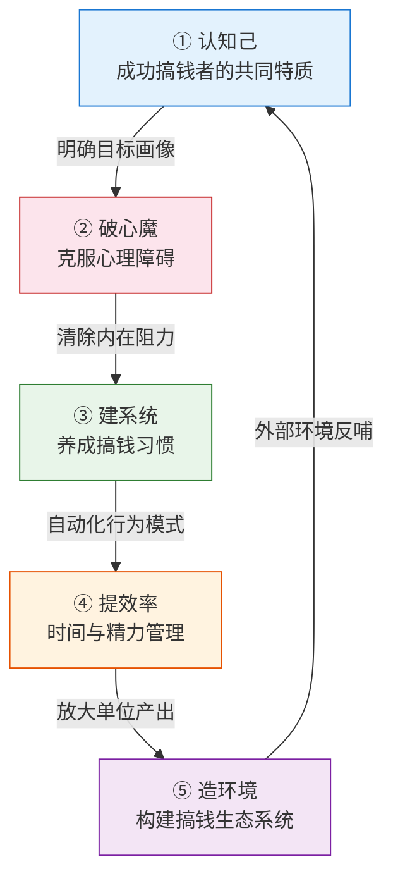
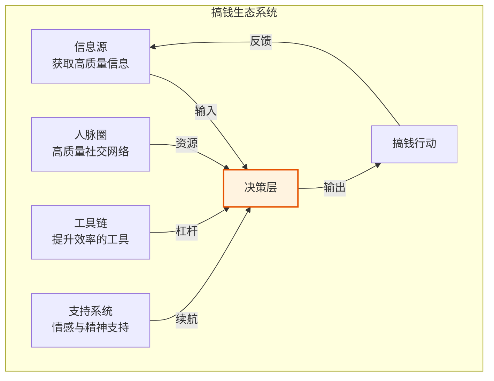
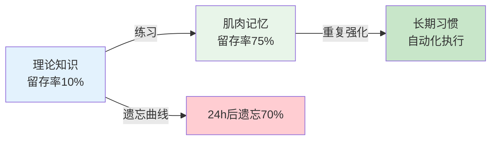
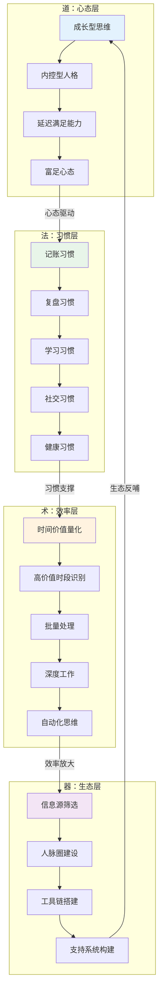

# 第三章：搞钱的心态与习惯 —— 本章小结

## 一、本章核心框架回顾

第三章是全书从"道"到"术"的关键桥梁。前两章帮你重塑了金钱观，本章解决的是"知道了，然后呢？"的问题。我们围绕五个层层递进的核心命题展开，每一步都是下一步的地基：



下面逐一回顾每个模块的核心洞察，并将它们串联成一个可执行的完整体系。

---

## 二、五大模块核心洞察

### 模块一：成功搞钱者的共同特质（3.1节）

本节通过斯坦福大学对500位成功企业家的研究，提炼出四大核心特质及其相互关系：

| 特质 | 核心表现 | 为什么重要 |
|------|----------|------------|
| **目标清晰** | 知道想要什么、为什么、如何实现 | 模糊的目标产生模糊的结果；清晰的目标是所有行动的指南针 |
| **执行力强** | 说到做到，立即行动，坚持到底 | 想法值一毛钱，执行力值一百万；没有行动，一切归零 |
| **善于学习** | 持续迭代，不断升级认知 | 市场在变，能力不进化就会被淘汰；88%的富人每天阅读至少30分钟 |
| **延迟满足** | 放弃眼前享受，换取更大未来收益 | 复利需要时间；能等的人才能吃到两颗棉花糖 |

研究数据表明：92%的成功者具备"目标清晰+执行力强"的组合特质，87%的人善于平衡风险与机会，79%的人能够延迟满足。关键结论是：**这些特质不是天生的，而是可以通过刻意练习培养的**。

**特质之间的联动关系**：目标清晰→指引执行力→产生行动结果→反馈给持续学习→升级认知后目标更清晰。这是一个自我强化的正向循环。

### 模块二：搞钱路上的心理障碍（3.2节）

心理障碍是阻碍行动的内在敌人。本节识别了五种最常见的心理障碍，每一种都有其深层来源和具体的破解方法：

| 心理障碍 | 典型表现 | 深层来源 | 核心破解策略 |
|----------|----------|----------|--------------|
| **金钱羞耻感** | "谈钱庸俗""赚钱是贪婪" | 传统文化、家庭教育、社会偏见 | 重新定义金钱为工具；正视价值交换的公平性 |
| **失败恐惧** | "万一亏了怎么办？" | 对不确定性的焦虑 | 重新定义失败为学费；用小额实验降低试错成本 |
| **比较心理** | "别人赚得比我多" | 社交媒体放大了他人的光鲜面 | 关注自己的进步轨迹；用纵向对比替代横向对比 |
| **即时满足** | 追求短期快感，忽视长期价值 | 大脑热系统（杏仁核）的本能驱动 | 设计承诺机制（自动储蓄）；激活冷系统（理性分析） |
| **完美主义** | "我还没准备好""条件不成熟" | 对失控的恐惧 | 接受"完成>完美"；用最小可行行动起步 |

**关键认知**：这些障碍不是"性格缺陷"，而是可以被系统性克服的。克服的方式不是靠意志力硬撑，而是靠环境设计和认知重构——这正是3.3节和后续内容要解决的问题。

### 模块三：搞钱的日常习惯（3.3节）

习惯是行为的自动化。当你把搞钱行为变成习惯，就不再需要每天消耗意志力去做决定。本节基于MIT神经科学家安·格雷比尔的习惯回路研究，建立了五类核心搞钱习惯：

**习惯回路的三个要素**：提示（Cue）→ 行为（Routine）→ 奖赏（Reward）。理解这个回路是设计习惯的前提。

| 习惯类别 | 核心习惯 | 具体做法 | 微习惯入门版 |
|----------|----------|----------|--------------|
| **记账** | 了解消费模式 | 记录每一笔收支，按月分析 | 每天花1分钟检查银行余额 |
| **复盘** | 定期回顾优化 | 每周30分钟复盘财务和搞钱行动 | 每周花5分钟更新净资产表 |
| **学习** | 持续输入高质量信息 | 每天阅读30分钟行业/理财内容 | 每天读1页财经内容 |
| **社交** | 维护有价值的人脉 | 每周至少一次深度社交互动 | 每周给一位有价值的朋友发一条消息 |
| **健康** | 管理精力 | 规律运动、充足睡眠、合理饮食 | 每天做1个俯卧撑 |

**三个关键研究成果**：

1. **习惯形成平均需要66天**（而非流行的21天）。伦敦大学学院菲利帕·拉利的研究表明，简单习惯可能20天，复杂习惯可能超过200天。偶尔错过一天不影响，关键是"绝不连续错过两天"。
2. **40%的日常行为由环境线索驱动**（杜克大学研究）。与其依赖意志力，不如设计环境——把记账APP放在主屏幕，把消费APP藏到第三屏。
3. **习惯堆叠**是最有效的新习惯启动方式：将新习惯嫁接到已有习惯上，利用已有的神经通路降低启动成本。公式："在[已有习惯]之后，我会[新习惯]"。

### 模块四：时间管理与效率（3.4节）

时间是搞钱最稀缺的资源。本节的核心理念是：**管理精力比管理时间更重要**。

**时间价值量化**：假设你月薪15000元，每月工作22天、每天8小时，你的时薪约为85元。当你理解了这个数字，很多决策就变得简单了——花2小时做一件能外包100元的事，你其实亏了70元。

**高价值时间管理原则**：

| 原则 | 含义 | 实操建议 |
|------|------|----------|
| **识别高价值时段** | 每个人都有精力最旺盛的时段 | 用一周时间记录自己的精力曲线，把最重要的搞钱行动放在巅峰时段 |
| **批量处理** | 减少任务切换的认知成本 | 集中回复消息、集中处理琐事、集中学习同类内容 |
| **自动化思维** | 能自动化的就不要手动 | 设置自动转账、自动投资、自动账单支付 |
| **深度工作** | 进入心流状态处理高价值任务 | 设定不受打扰的2小时专注块，关闭所有通知 |

**精力管理四维度**（吉姆·洛尔理论）：体能精力、情绪精力、注意力精力、意义精力。搞钱是长跑，不是冲刺，持续的精力管理比短期的拼命更重要。

### 模块五：搞钱生态系统（3.5节）

个人搞钱不是单打独斗，而是构建一个持续运转的生态系统。这个系统由四个相互支撑的子系统组成：



| 子系统 | 核心目标 | 关键指标 |
|--------|----------|----------|
| **信息源** | 获取高质量、低噪声的信息 | 信息源数量控制在5-8个；信噪比>70% |
| **人脉圈** | 建立互惠互利的社交网络 | 弱关系数量（信息桥梁）；强关系质量（信任支持） |
| **工具链** | 用技术杠杆放大效率 | 自动化覆盖的重复任务比例 |
| **支持系统** | 搞钱路上的情感续航 | 搞钱伙伴、家庭理解、社群归属 |

---

## 三、关键公式与核心模型

### 搞钱成果公式

```text
搞钱成果 = 心态 × 习惯 × 系统 × 时间
```

| 变量 | 含义 | 为零时的后果 |
|------|------|--------------|
| **心态** | 正确的金钱观和搞钱心态 | 心态为零＝有方法也不敢行动 |
| **习惯** | 有利于搞钱的日常习惯 | 习惯为零＝三天打鱼两天晒网 |
| **系统** | 自动化、可重复的搞钱系统 | 系统为零＝靠意志力硬撑，迟早崩溃 |
| **时间** | 长期坚持的时间 | 时间为零＝一切需要复利的事都不存在 |

**乘法关系意味着：任何一项为零，结果都为零。** 这就是为什么很多人"道理都懂，但就是搞不到钱"——他们可能在某一项上做得不错，但在其他项上是零。

### 从"知道"到"做到"的转化模型



学习金字塔数据表明：阅读的知识留存率只有10%，而通过实践学习的留存率高达75%。这就是为什么本章配置了七个渐进式练习——从21天记账挑战到搞钱伙伴计划，每一个练习都是为了把知识转化为肌肉记忆。

---

## 四、本章知识体系全景图

将五个模块串联起来，形成一个完整的搞钱操作系统：



---

## 五、实战案例的核心教训

本章通过五个真实案例，展示了心态与习惯转变前后的巨大差异：

| 案例 | 起点 | 转变关键 | 结果 |
|------|------|----------|------|
| **小王（月光族→年存30万）** | 月入8000，月月光 | 建立记账习惯+自动化储蓄+环境设计 | 年储蓄30万，心态从焦虑变为从容 |
| **老张（焦虑投资者→稳健投资者）** | 频繁追涨杀跌，情绪化操作 | 学习行为金融学+建立投资清单+设置冷静期 | 年化收益从负值提升到8-12% |
| **小陈（拖延症→高效搞钱者）** | 什么都想做，什么都做不成 | 微习惯起步+番茄钟+搞钱伙伴监督 | 副业从0到月入10000+ |
| **李姐（稀缺心态→富足心态）** | 越省钱越焦虑，越焦虑越省钱 | 认知重构+投资自己+扩大信息源 | 从节流转向开源，3年收入翻倍 |
| **老刘（信息焦虑→信息节食）** | 每天刷3小时资讯，反而更迷茫 | 信息源筛选+深度学习替代碎片阅读 | 效率提升40%，焦虑显著降低 |

**五个案例的共同规律**：
1. 转变的起点不是"更大的目标"，而是"更小的第一步"
2. 环境设计比意志力更可靠
3. 记录和复盘是所有转变的基础动作
4. 社交支持（搞钱伙伴、社群）显著提高成功率

---

## 六、自我诊断：你现在的搞钱操作系统打几分？

完成本章学习后，用以下清单自评。每个维度1-5分，总分25分：

| 维度 | 自评标准 | 你的分数 |
|------|----------|----------|
| **心态** | 1分=谈钱焦虑；3分=能理性看待金钱；5分=金钱是实现自由的工具 | /5 |
| **习惯** | 1分=没有任何搞钱习惯；3分=有记账等1-2个习惯；5分=5个核心习惯全部运转 | /5 |
| **时间** | 1分=时间完全失控；3分=偶尔做时间管理；5分=时间价值量化且高价值时段被保护 | /5 |
| **系统** | 1分=完全靠手动和意志力；3分=部分自动化；5分=核心流程全部自动化 | /5 |
| **环境** | 1分=信息源混乱、无搞钱社交；3分=有基本的信息筛选；5分=完整的信息-人脉-工具-支持系统 | /5 |

- **5-10分**：操作系统需要全面升级，建议从最简单的微习惯（每天1分钟记账）开始
- **11-15分**：有基础但不稳定，重点加强环境设计和自动化系统
- **16-20分**：运转良好，找薄弱环节针对性提升
- **21-25分**：操作系统成熟，可以进入下一章学习具体的搞钱方法

---

## 七、行动清单

完成本章学习后，请按以下节奏执行：

### 立即行动（今天）

- [ ] 下载记账APP（推荐随手记或钱迹），记录今天的每一笔消费
- [ ] 用SMART原则写下3个搞钱目标（具体、可衡量、可实现、相关、有时限）
- [ ] 卸载手机上最让你冲动消费的APP，或将其移到第三屏文件夹深处

### 本周行动

- [ ] 完成7天连续记账——目的是建立"财务觉察"的神经通路
- [ ] 尝试一次48小时冷静期：遇到非必需消费冲动时，记录下来，等48小时再决定
- [ ] 做一次本周复盘：花了多少钱？花在了哪些高价值和低价值的地方？

### 本月行动

- [ ] 完成21天记账挑战，形成基本的财务觉察习惯
- [ ] 设计你的搞钱环境：整理手机桌面、设置自动储蓄、创建专注工作区
- [ ] 找到一个搞钱伙伴——可以是朋友、同事或线上社群成员
- [ ] 建立每周复盘的习惯，固定时间（如周日晚上），用模板化流程降低启动成本

### 本季度行动

- [ ] 将记账从手动记录升级为自动化（银行APP自动分类+月度报告）
- [ ] 完成"搞钱伙伴计划"的启动：确定伙伴、约定复盘频率、设定共同目标
- [ ] 用精力管理四维度（体能、情绪、注意力、意义）做一次全面自评，找到最需要提升的维度

---

## 八、本章金句

> "成功不是偶然，而是习惯的结果。" —— 亚里士多德

> "我们先养成习惯，然后习惯塑造我们。" —— 约翰·德莱顿

> "管理精力比管理时间更重要。" —— 吉姆·洛尔

> "你的时间有限，不要浪费在别人的生活里。" —— 史蒂夫·乔布斯

> "不要考验自己的意志力，要设计不需要意志力的系统。"

> "穷人省钱，富人省时间。"

> "搞钱不是为了成为有钱人，而是为了成为自由人。"

---

## 九、推荐资源

### 书籍

| 书名 | 作者 | 核心价值 |
|------|------|----------|
| 《习惯的力量》 | 查尔斯·都希格 | 理解习惯回路的神经科学机制，掌握改变习惯的方法 |
| 《自控力》 | 凯利·麦格尼格尔 | 斯坦福大学心理学课程精华，科学提升意志力 |
| 《高效能人士的七个习惯》 | 史蒂芬·柯维 | 从依赖到独立到互赖的成长路径，搞钱心态的底层框架 |
| 《精力管理》 | 吉姆·洛尔 | 超越时间管理的精力管理四维度体系 |
| 《稀缺》 | 塞德希尔·穆来纳森 | 理解"穷人为什么穷"的行为经济学视角，打破稀缺心态 |

### APP工具

| 类别 | 推荐APP | 核心用途 |
|------|---------|----------|
| 记账 | 随手记、钱迹 | 记录消费，自动生成报表和分类统计 |
| 专注 | Forest、番茄钟 | 提升深度工作时长，减少手机干扰 |
| 习惯 | 打卡、小日常 | 可视化习惯连续天数，利用"不断链"心理驱动坚持 |
| 学习 | 得到、微信读书 | 系统化学习理财和搞钱知识，碎片时间高效利用 |

---

## 十、下一章预告

下一章我们将进入**第四章：主动收入最大化**，学习如何把"搞钱心态和习惯"转化为实际的收入增长：

1. **提升职场收入**：薪资谈判的策略与话术、升职加薪的系统化路径
2. **开发副业收入**：用"三圈模型"（擅长×喜欢×有市场）找到适合自己的副业
3. **自由职业与远程工作**：真实成本核算、定价策略、客户获取
4. **构建多收入来源**：降低风险、产生复利、从主动收入逐步过渡到被动收入
5. **个人品牌建设**：通过内容输出建立专业形象，让机会主动找上门

> **记住**：心态和习惯是搞钱的基础。第三章帮你升级了"操作系统"，第四章开始教你安装具体的"应用程序"。基础打好了，接下来的搞钱之路会顺畅很多。

---

> **阅读建议**：如果你已经完成了本章的七个练习，恭喜你——你已经建立了搞钱的基础设施。如果还没有开始，现在就是最好的时机。选择最简单的那个（每天1分钟检查银行余额），今天就开始。记住：习惯的形成不取决于行为的大小，而取决于重复的频率。
