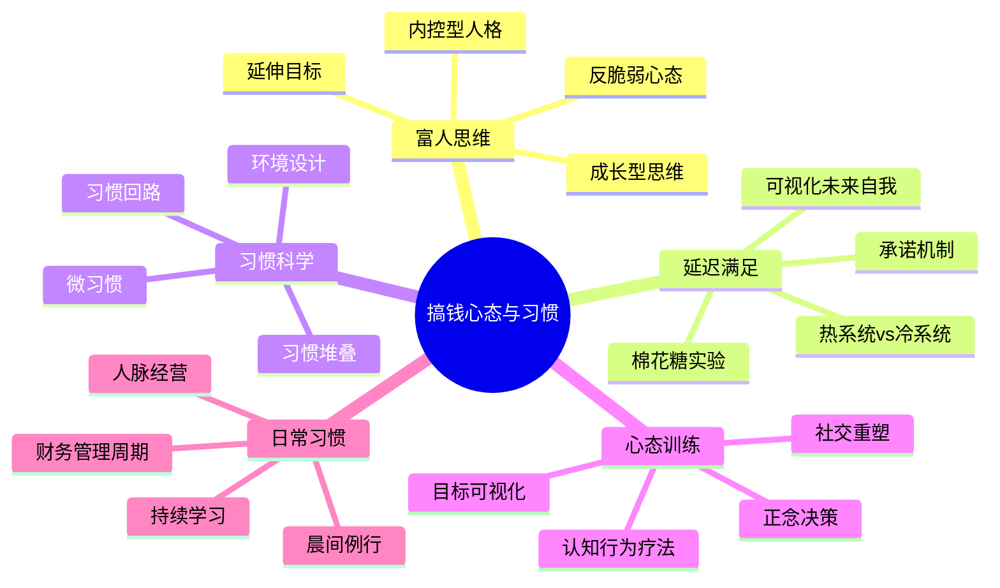
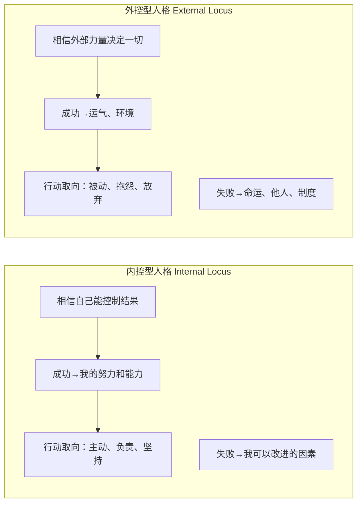
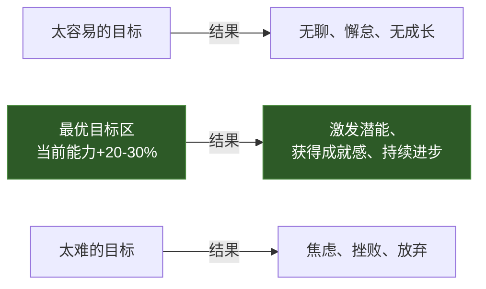
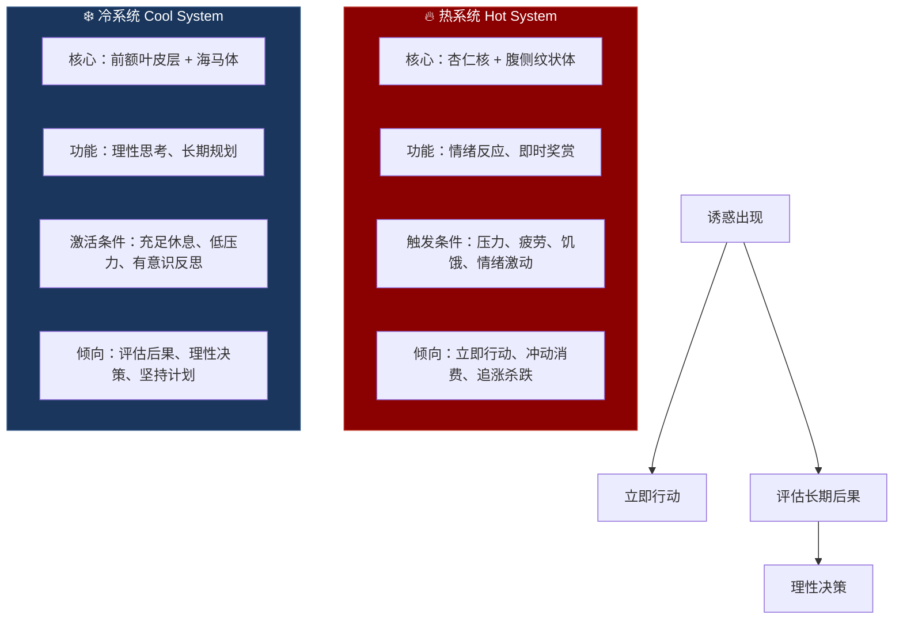
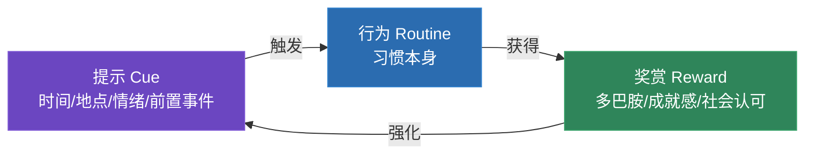
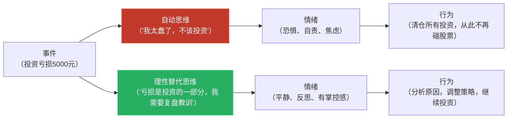
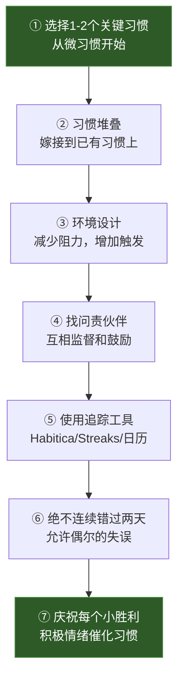

# 深度拓展：搞钱的心态与习惯

> "财富不是你赚了多少钱，而是你留住了多少钱，以及你的钱为你工作了多久。" —— 罗伯特·清崎

本章是对"搞钱心态与习惯"主题的深度拓展，涵盖从神经科学、行为经济学到实操训练的完整知识体系。无论你是刚开始建立财务自律的新手，还是希望突破瓶颈的进阶者，都能在这里找到对应的理论支撑和行动指南。



---

## 一、富人思维的科学研究

### 1.1 思维模式的差异：固定型 vs 成长型

斯坦福大学心理学教授卡罗尔·德韦克（Carol Dweck）经过30年的系统研究，提出了两种核心思维模式理论。这一理论被广泛应用于教育、商业和个人发展领域，对理解财富积累的心理机制具有根本性意义。

**固定型思维模式（Fixed Mindset）**：认为能力是天生固定的，无法通过努力改变。持有这种思维的人倾向于回避挑战、轻易放弃、将失败视为自身能力不足的证据。

在财务领域的典型表现：

| 固定型思维的内心独白 | 隐含信念 | 导致的行为 | 最终结果 |
|:---|:---|:---|:---|
| "我天生不擅长理财" | 能力不可改变 | 从不学习理财知识 | 持续的财务无知 |
| "投资是有钱人的游戏" | 资源决定一切 | 不尝试任何投资 | 错过复利增长 |
| "我做不到" | 障碍=终点 | 遇到困难立即放弃 | 永远停留在起点 |
| "那个人只是运气好" | 成功靠运气 | 等待"运气"降临 | 被动等待，错失主动机会 |
| "亏了就是我不行" | 失败=身份 | 回避所有风险 | 收益天花板极低 |

**成长型思维模式（Growth Mindset）**：认为能力可以通过努力和学习不断提升。持有这种思维的人倾向于拥抱挑战、从失败中学习、将困难视为成长的机会。

在财务领域的典型表现：

| 成长型思维的内心独白 | 隐含信念 | 导致的行为 | 最终结果 |
|:---|:---|:---|:---|
| "我可以学习理财知识" | 能力可培养 | 主动学习、阅读、请教 | 逐步建立财务素养 |
| "投资技能可以通过实践提升" | 技能可习得 | 小额起步，边做边学 | 投资能力持续增长 |
| "失败是学习过程的一部分" | 失败=数据 | 复盘错误，提取教训 | 每次失败都转化为经验 |
| "他的成功有什么值得学习的？" | 成功有方法论 | 研究成功案例，模仿学习 | 缩短试错路径 |
| "我现在不会，但我可以学" | 起点不等于终点 | 从第一步开始行动 | 持续积累，量变到质变 |

**德韦克的经典实验**：她给两组学生同样难度的数学题。固定型思维的学生在遇到难题时很快放弃，焦虑水平显著上升，大脑的错误相关信号（ERN）较弱——这意味着他们甚至没有充分关注自己的错误。而成长型思维的学生表现出更高的坚持度、更低的焦虑水平，且错误相关信号更强——他们真正在从错误中学习。

**思维模式的可塑性**：德韦克在后续研究中证实，思维模式不是固定不变的。通过以下干预可以有效从固定型思维转向成长型思维：

1. **觉察**：识别自己的固定型思维触发情境（如面对财务困难时）
2. **命名**：给自己的固定型思维起一个名字（如"小恐"），以便将其外化
3. **教育**：告诉自己大脑的神经可塑性——每次学习新东西，大脑都会形成新的神经连接
4. **行动**：选择成长型思维的行动路径，即使一开始感到不适

**对财富积累的实证支持**：研究者托马斯·科利（Thomas Corley）对233位百万富翁和128位低收入者进行了为期5年的跟踪研究（"富人习惯研究"），发现：

- 88%的富人每天阅读至少30分钟，主要集中在自我提升和行业知识类内容
- 76%的富人每周至少运动4天
- 86%的富人喜欢学习新事物
- 63%的富人每天听有声书或播客
- 仅6%的低收入者有类似的学习和自我提升习惯
- 93%的富人将财富归因于"习惯"，而非运气或天赋

### 1.2 内控型人格与财富积累

心理学家朱利安·罗特（Julian Rotter）在1954年提出的"控制点理论"（Locus of Control Theory），是人格心理学中最具影响力的概念之一。该理论将人分为两类：



**内控型（Internal Locus of Control）**：相信自己能够控制和影响生活中的事件和结果。这类人倾向于将成功归因于自身的努力和能力，将失败归因于可以改进的因素。他们在面对财务困难时，会问"我能做什么来改变现状？"而不是"为什么这种事总是发生在我身上？"

**外控型（External Locus of Control）**：认为生活中的事件主要由外部力量（运气、他人、环境等）决定。这类人倾向于将成功归因于运气，将失败归因于不可控的外部因素。他们在面对财务困难时，更倾向于抱怨、等待或逃避。

**与财富积累的相关性**：保罗·皮尔泽（Paul Zane Pilzer）的研究发现，自力更生型百万富翁中，约90%具有强内控型人格特征。美国国家经济研究局（NBER）的多项研究也证实，内控型人格与更高的储蓄率、更合理的投资行为和更快的财富积累速度显著相关。

**运气与内控的辩证关系**：内控型人格并不否认运气的作用。关键区别在于内控型的人对运气的态度：

- **在运气到来之前做好准备**：持续学习、积累技能、建立人脉，确保当机会出现时能够抓住
- **在运气不好时继续努力**：将暂时的挫折视为正常的波动，而非命运的判决
- **主动创造"幸运"的机会**：扩大社交圈、尝试新事物、接受新的挑战——统计学上，你尝试的次数越多，"幸运"出现的概率就越高
- **从每次"不幸"中提取学习和改进的要素**：即使结果不好，过程中的经验和教训也有长远价值

理查德·怀斯曼（Richard Wiseman）在《幸运的公式》一书中，通过大规模实验证实了这一点：自认为"幸运"的人并非真的运气更好，而是他们更善于注意到机会、更愿意跟随直觉、更有弹性面对挫折、更擅长将坏运气转化为好运气。

### 1.3 延伸目标与野心校准

密歇根大学的C.K.普拉哈拉德（C.K. Prahalad）提出了"延伸目标"（Stretch Goals）的概念。其核心主张是：设定略超出当前能力范围的目标，能够最大程度地激发人的潜能和创造力。

**目标难度的校准模型**：



**哈佛商学院的研究发现**，有效的延伸目标具有以下特征：

- **具体且可衡量**："月收入增加20%"比"赚更多钱"有效得多。大脑需要明确的方向才能高效行动。
- **有时间约束**："在6个月内实现"比"将来某个时候"创造更强的紧迫感。截止日期激活大脑的执行系统。
- **略超当前能力**：大约超出当前水平的20-30%最为理想。这处于维果茨基所说的"最近发展区"——略超出舒适区但通过努力可以达到的范围。
- **可以分解为子目标**：将大目标分解为可管理的小步骤，每完成一步都会释放多巴胺，形成正向反馈循环。

**野心校准的常见陷阱**：

| 陷阱 | 典型表现 | 纠正方法 |
|:---|:---|:---|
| 目标模糊 | "我要财务自由" | 明确数字：净资产达到X万，被动收入覆盖生活开支的Y% |
| 目标过大 | "一年内资产翻10倍" | 分解为季度目标，每个季度挑战15-20%增长 |
| 只看结果不看过程 | "我要赚100万" | 同时设定过程目标：每天学习1小时、每周开发1个新客户 |
| 不及时调整 | 目标设定后从不修订 | 每季度回顾，根据实际情况微调目标 |
| 缺乏情感连接 | 目标只是数字 | 连接到"为什么"：这个数字对你和家人意味着什么？ |

### 1.4 反脆弱心态：超越韧性

纳西姆·塔勒布（Nassim Taleb）在《反脆弱》一书中提出了一个超越"韧性"（Resilience）的概念——**反脆弱性（Antifragility）**。韧性是"受到冲击后恢复原状"，反脆弱是"受到冲击后变得更强"。

在财富积累中，反脆弱心态表现为：

- **将市场波动视为机会而非威胁**：当市场下跌时，反脆弱的投资者会看到打折买入的机会，而非恐慌抛售
- **建立多元化的收入来源**：不依赖单一收入来源，每个收入来源的失败都是探索新来源的触发器
- **从失败中提取超额价值**：每次失败都提供比成功更丰富的学习材料——失败暴露了你的认知盲点和能力短板
- **主动引入小压力**：定期尝试新事物、接受新挑战，保持系统的活力和适应性

---

## 二、延迟满足的经典实验与应用

### 2.1 棉花糖实验的真相

1972年，斯坦福大学心理学家沃尔特·米歇尔（Walter Mischel）进行了一系列后来被称为"棉花糖实验"的研究。实验的基本设计是：给4-5岁的儿童一颗棉花糖，并告诉他们，如果能等待15分钟不吃，就可以获得两颗棉花糖。

**原始发现**：约1/3的儿童成功等待了15分钟。后续跟踪研究（跨越30年）发现，那些能够等待的儿童在SAT考试中平均得分高出210分，成年后的收入更高，肥胖率更低，社交能力更强，大脑前额叶皮层的活跃度也更高。

**2018年的重大修正**：泰勒·瓦茨（Tyler Watts）等人对棉花糖实验进行了大规模复制研究，样本量是原实验的10倍以上，并严格控制了家庭社会经济地位、母亲教育水平、家庭收入等混杂变量。修正后的结论是：

- 延迟满足能力对成年后成就的预测作用比原始研究小得多
- 很大程度上，延迟满足能力是家庭环境和教育资源的产物，而非纯粹的个人特质
- 在控制了社会经济因素后，棉花糖测试的预测力下降了约50%

**综合启示**：

| 观点 | 说明 |
|:---|:---|
| 延迟满足是重要的 | 它确实与更好的财务决策和长期规划相关 |
| 延迟满足不是天生固定的 | 它可以通过训练、环境设计和认知策略来提升 |
| 环境设计比意志力更可靠 | 自动化机制（如自动储蓄）比依赖每天的自律更有效 |
| 延迟满足≠纯粹忍耐 | 它应该是"有策略的等待"，而非"痛苦的压制" |

### 2.2 延迟满足的神经科学机制

大脑中存在两个竞争系统，它们之间的角力决定了我们是选择即时满足还是延迟满足：



**关键发现**：延迟满足的关键不是"压抑"热系统（这会消耗大量心理能量），而是"激活"冷系统。米歇尔后来的研究发现，成功等待的儿童并非"更强忍耐"，而是使用了巧妙的认知策略来"冷却"诱惑：

| 策略 | 机制 | 成人财务管理中的应用 |
|:---|:---|:---|
| **注意力转移** | 不去想棉花糖的美味，而是关注形状（"像一朵云"） | 把注意力从"这个东西好想要"转移到"我的净资产增长了多少" |
| **时间框架重构** | 将15分钟想象成"很短的时间" | 将投资回报的时间框架从"几天"重构为"几年" |
| **抽象化思维** | 将棉花糖抽象为"1颗 vs 2颗"的数学问题 | 将消费决策抽象为"今天花500 vs 投资5年后变750" |
| **心理距离化** | 想象棉花糖是别人在吃 | 想象消费决策是"帮别人做的"——你会帮朋友买这个吗？ |
| **冷却刺激** | 想象棉花糖是一朵云或一个棉花球 | 将商品想象成"只是一堆原子的组合"，降低其吸引力 |

### 2.3 延迟满足在财务管理中的应用

将延迟满足的神经科学原理转化为可执行的财务策略：

**策略一：自动储蓄机制（预承诺）**

与其依赖意志力来"延迟消费"，不如设置自动转账，让储蓄在你看到工资之前就完成了。这相当于"预先承诺"——在你还有冷系统控制力的时候，约束未来的自己。

具体设置：
- 发薪日当天自动转账20-30%到储蓄/投资账户
- 设置多个自动转账目标（应急基金、投资基金、教育基金）
- 将储蓄账户的取款设置为需要24-48小时的冷静期
- 使用"先付给自己"原则：储蓄是第一笔"账单"，不是最后剩下的

**策略二："未来自我"的可视化**

加州大学洛杉矶分校的哈尔·赫什菲尔德（Hal Hershfield）的研究发现了一个惊人的人类认知盲点：我们很难与"未来的自己"产生共情——大脑扫描显示，当我们想象"未来的自己"时，激活的区域与想象"另一个人"时几乎相同，而非想象"自己"时。

解决方案：
- 使用FaceApp等工具生成自己老年后的照片，放在钱包或手机壁纸中
- 给"未来的自己"写一封信，描述10年后的生活
- 在做重大财务决策时，问自己："60岁的我会感谢现在这个决定吗？"
- 使用在线退休计算器，可视化退休后的生活水平

**策略三："小奖励"策略**

纯粹的延迟满足很难长期持续——大脑需要定期的多巴胺释放来维持动机。更有效的方法是设置阶段性小奖励：

```text
季度储蓄目标达成 → 奖励自己一顿好的晚餐（预算内）
年度投资目标达成 → 奖励自己一个一直想要的小物件
净资产里程碑（如10万、50万）→ 奖励自己一次旅行
```

这种策略的关键是：奖励必须在预算内、不能抵消积累的成果、且必须在目标达成后才能获得。

**策略四：承诺机制（Commitment Device）**

承诺机制是一种"绑架未来自己"的策略——在你理性的时候做出决定，并设计机制使未来的自己难以违背。

| 承诺机制 | 运作方式 | 适用场景 |
|:---|:---|:---|
| 定期定额投资（DCA） | 自动扣款，避免择时 | 长期投资 |
| 高息定期存款 | 提前取款损失利息 | 应急基金之外的储蓄 |
| 30天冷静期规则 | 想买的东西等30天再决定 | 非必要消费 |
| 消费上限APP | 设置每日/每月消费上限 | 控制冲动消费 |
| 问责伙伴 | 与朋友互相报告消费情况 | 培养消费纪律 |

---

## 三、习惯养成的神经科学

### 3.1 习惯回路的神经基础

麻省理工学院的神经科学家安·格雷比尔（Ann Graybiel）的研究揭示了习惯形成的神经机制。习惯的形成依赖于大脑中的"基底神经节"（Basal Ganglia），这是一个位于大脑深处的古老结构，负责将重复的行为模式"打包"成自动执行的程序。

**习惯回路（Habit Loop）的三个组成部分**：



**提示（Cue）**：触发习惯行为的信号。可以是：
- 时间提示："每天早上7点"
- 地点提示："到办公室时"
- 情绪提示："感到压力时"
- 前置事件提示："吃完午饭后"
- 社交提示："和某个朋友在一起时"

**行为（Routine）**：习惯本身。当一个行为被重复足够多次后，它会从前额叶皮层（有意识控制）转移到基底神经节（自动执行）。这就是习惯的"自动化"过程——你不再需要"决定"去做，它变成了像呼吸一样的自动行为。

**奖赏（Reward）**：完成行为后获得的满足感。奖赏分为三个层次：
- **生理奖赏**：多巴胺释放、内啡肽分泌（如运动后的愉悦感）
- **心理奖赏**：成就感、掌控感、确定性（如完成记账后的安心）
- **社会奖赏**：他人的认可、归属感、社会地位（如分享理财经验获得的尊重）

**神经科学的关键洞察**：习惯一旦形成，就不会被"删除"——它只是被新的习惯覆盖。这意味着：
- 旧习惯的神经通路始终存在，一旦触发条件满足，旧习惯可能"复活"
- 改变习惯的最有效方式不是"戒除"旧习惯，而是用新的行为"替换"旧习惯的回路
- 保持相同的提示和奖赏，只改变中间的行为，是最高效的习惯改变策略

### 3.2 习惯形成的21天迷思与现实

流行文化中广泛传播的"21天形成习惯"说法实际上是一个误解。这个数字来源于1960年代整形外科医生马克斯韦尔·马尔茨（Maxwell Maltz）的观察——他发现截肢患者大约需要21天来适应失去的肢体。这个临床观察被后人错误地泛化为"任何习惯都只需要21天"。

**科学真相**：伦敦大学学院的菲利帕·拉利（Phillippa Lally）在2009年发表的研究中，对96名参与者进行了为期12周的习惯追踪，要求他们每天记录特定行为的"自动化程度"（即执行该行为时需要多少有意识的努力）。结果发现：

| 习惯类型 | 示例 | 达到自动化所需时间 | 特点 |
|:---|:---|:---|:---|
| 简单习惯 | 每天早上喝一杯水 | 约20天 | 行为简单、执行成本低、奖励即时 |
| 中等习惯 | 每天吃一个水果 | 约40天 | 需要少量准备，但不复杂 |
| 复杂习惯 | 每天跑步15分钟 | 66-200天 | 需要克服阻力、奖励延迟 |
| 高复杂习惯 | 每天记账+分析支出 | 可能超过250天 | 需要认知投入、多步骤、延迟奖赏 |

**平均值**：一个新习惯的自动化程度达到稳定水平平均需要**66天**，而非21天。

**关键发现**：
1. **偶尔错过一天不会显著影响习惯形成**。真正重要的是"连续性"——如果你错过了某一天，尽快恢复比自责更重要。这被称为"绝不连续错过两天"法则。
2. **自动化不是全有或全无的**。习惯的自动化程度是渐进提升的，而非某一天突然"养成"的。
3. **早期的重复比后期的重复更重要**。习惯形成的关键窗口是前30天——在这个阶段保持高频率重复，可以大大加速习惯的自动化。

### 3.3 习惯堆叠与环境设计

**习惯堆叠（Habit Stacking）** 是将新习惯"嫁接"到已有习惯之上的策略。这个方法由BJ·福格（BJ Fogg）教授首先系统化提出，基于一个简单但强大的原理：已有的习惯已经形成了稳定的神经通路，利用这些通路可以大大降低新习惯的启动成本。

**公式：** "在[已有习惯]之后，我会[新习惯]"

**财务管理中的习惯堆叠实例**：

| 已有习惯（触发器） | 新习惯（财务行为） | 预期效果 |
|:---|:---|:---|
| 早上泡咖啡 | 花10分钟阅读财经新闻 | 培养市场敏感度 |
| 打开电脑 | 先检查投资组合日报 | 及时发现异常 |
| 吃完午饭 | 花15分钟学习新投资概念 | 持续积累知识 |
| 晚上刷牙后 | 花5分钟记账 | 覆盖当日所有消费 |
| 周末早上起床 | 更新净资产表 | 每周追踪进度 |
| 坐地铁通勤 | 听理财播客/有声书 | 利用碎片时间学习 |

**环境设计（Environment Design）**：杜克大学的研究发现，我们每天约40%的行为不是由有意识的决策驱动的，而是由环境线索驱动的习惯行为。这意味着，**改变环境比改变意志力更有效**。

**物理环境设计**：

| 想要增加的行为 | 环境调整 |
|:---|:---|
| 更多储蓄 | 将储蓄/投资APP放在手机主屏幕最显眼的位置 |
| 更多记账 | 将记账工具放在桌面最容易看到的地方，设置每日提醒 |
| 更多学习 | 在床头放一本投资书籍，取代手机 |
| 更少冲动消费 | 将购物类APP移到手机第三屏或文件夹深处 |
| 更少无效消费 | 在钱包中放一张写着财务目标的卡片 |

**数字环境设计**：
- 设定手机屏幕时间，为消费类APP设置每日使用限制
- 取消订阅促销邮件和短信通知
- 将默认浏览器首页设置为财经新闻或投资平台
- 在消费平台关闭"一键支付"功能，增加购买阻力
- 设置信用卡消费提醒，每笔消费即时通知

**"选择架构"（Choice Architecture）** 的应用：诺贝尔经济学奖得主理查德·塞勒（Richard Thaler）提出的"助推"（Nudge）理论，核心思想是通过改变选择的呈现方式来引导更好的决策：

- **默认选项的力量**：将退休金计划的默认选项设为"参与"而非"不参与"，参与率可从50%提升到90%以上
- **摩擦力的调节**：增加坏习惯的执行摩擦（如删除购物APP），减少好习惯的执行摩擦（如设置一键记账）
- **信息的及时呈现**：在消费前展示"这笔钱如果投资5年后的价值"，利用心理账户效应减少非理性消费

### 3.4 微习惯的力量

BJ·福格（BJ Fogg）教授提出的"微习惯"（Tiny Habits）方法论，基于一个核心洞察：**习惯的形成不取决于行为的大小，而取决于重复的频率**。

**为什么微习惯有效**：
1. **启动成本极低**：每天做1个俯卧撑几乎不需要意志力，而每天运动30分钟需要大量的启动能量
2. **不会失败**：微习惯小到不可能失败，消除了"今天没做到"的挫败感
3. **自然扩展**：一旦习惯自动化，行为会自然扩展——你做了1个俯卧撑后，很可能会多做几个
4. **建立身份认同**："我是每天运动的人"比"我偶尔运动"更容易维持

**财务管理的微习惯体系**：

| 微习惯 | 执行时间 | 培养的能力 | 扩展方向 |
|:---|:---|:---|:---|
| 每天花1分钟检查银行余额 | 1分钟 | 财务觉知 | → 每日记账 |
| 消费前花5秒问"需要还是想要" | 5秒 | 消费意识 | → 30天冷静期规则 |
| 每周花5分钟更新净资产表 | 5分钟 | 财务追踪 | → 每周财务复盘 |
| 收到工资后检查自动转账 | 1分钟 | 自动化储蓄 | → 优化资产配置 |
| 每天读1页理财书 | 1分钟 | 知识积累 | → 每天阅读30分钟 |
| 每次大额消费后记录原因 | 2分钟 | 消费反思 | → 月度消费分析 |

**"庆祝"的力量**：福格教授强调，完成微习惯后立刻给自己一个积极的心理反馈（如微笑、握拳、内心说"太棒了"），这种即时的积极情绪会通过多巴胺释放强化神经回路，是习惯养成中最被低估却最关键的步骤。

---

## 四、财富心态的训练方法

### 4.1 认知行为疗法（CBT）在财富心态中的应用

认知行为疗法（CBT）是目前实证支持最强的心理干预方法之一，由亚伦·贝克（Aaron Beck）在1960年代创立。其核心理念是：**我们的情绪和行为不是由事件本身决定的，而是由我们对事件的认知（解释）决定的**。



**财务管理中的12种常见认知扭曲**：

| 认型扭曲 | 定义 | 财务中的典型表现 | 理性替代 |
|:---|:---|:---|:---|
| **灾难化思维** | 将最坏情况当作必然结果 | "如果我投资亏了，我会破产的！" | "分散投资和止损可以控制风险，最坏情况是损失有限的。" |
| **非黑即白** | 只看两个极端 | "存不了5000就别存了" | "任何储蓄都有意义，1000元复利20年也有60万。" |
| **情绪推理** | 把感觉当事实 | "我感觉不擅长理财" | "感觉不等于事实，理财是可学的技能。" |
| **贴标签** | 用负面标签定义自己 | "我就是个月光族" | "我目前储蓄习惯不好，但可以逐步改变。" |
| **过度概括** | 从一件事推断普遍规律 | "这只股票亏了，投资都是骗局" | "一次亏损不代表所有投资都有问题，我需要分散。" |
| **心理过滤** | 只看到负面信息 | "市场跌了200点！"（忽略过去一年涨了2000点） | "市场有涨有跌，看长期趋势而非短期波动。" |
| **读心术** | 假设知道别人在想什么 | "别人都在赚钱，就我在亏" | "我看到的只是别人想展示的，亏钱的时刻没人分享。" |
| **应该思维** | 用"应该"绑架自己 | "我应该在30岁前有100万" | "每个人的节奏不同，重要的是持续进步。" |
| **公平世界谬误** | 认为世界应该是公平的 | "我这么努力，为什么还没赚到钱？" | "努力不保证结果，但不努力一定没结果。" |
| **沉没成本谬误** | 因为已经投入而继续 | "已经亏了这么多，不能卖" | "沉没成本不影响未来收益，当下最理性的选择是什么？" |
| **确认偏误** | 只看支持自己观点的信息 | 只关注支持某只股票的分析 | "有没有反对意见？为什么有人看空？" |
| **锚定效应** | 过度依赖第一个信息 | "这股票最高到过100，现在50太便宜了" | "股价高低是相对的，关键看公司当前的价值。" |

**CBT实践的四步法**：

1. **记录自动思维日志**：每次做出与金钱相关的决定时，记录触发事件、你的想法、情绪强度（1-10分）和你的行为
2. **识别认知扭曲**：对照上表，看看自己的想法属于哪种认知扭曲
3. **生成理性替代**：用更平衡、更现实的想法替代扭曲的认知。关键是理性替代必须是你真正相信的，而不是自欺欺人的安慰
4. **行为实验验证**：通过实际行动来检验新认知——例如，如果你认为"投资一定亏钱"，可以用最小金额进行实际投资，用经验证据来挑战这个信念

**自动思维日志模板**：

```text
日期：____
触发事件：____
自动思维：____
情绪（1-10）：____
认知扭曲类型：____
理性替代：____
替代后情绪（1-10）：____
行为实验计划：____
实验结果：____
```

### 4.2 正念与财务决策

正念（Mindfulness）是一种专注于当下、不评判的觉知状态，源于佛教禅修传统，已被现代心理学大量研究验证。在财务管理中，正念训练可以显著改善决策质量。

**正念改善财务决策的三个机制**：

**机制一：减少冲动消费**

哈佛大学的研究发现，8周的正念训练可以使参与者的冲动消费减少约20%。原理：正念训练增强了人们对自身情绪状态的觉知。当你能觉察到"我现在想买东西是因为焦虑/无聊/沮丧"时，你就有了选择的空间——你可以选择不被这个情绪驱动。

**机制二：改善风险评估**

加州大学伯克利分校的研究表明，正念训练可以帮助人们更好地管理恐惧和贪婪情绪。在模拟投资实验中，接受过正念训练的参与者表现出更低的处置效应（过早卖出盈利股票、过久持有亏损股票）和更理性的资产配置决策。

**机制三：提升认知灵活性**

正念训练增强了大脑前额叶皮层的功能，提升了认知灵活性——这使得人们能够更好地从多个角度看待问题，做出更全面的决策，而非被单一视角所束缚。

**正念理财的日常练习**：

| 练习 | 时机 | 方法 | 时长 |
|:---|:---|:---|:---|
| 消费前正念暂停 | 任何非必要消费前 | 关注呼吸，问"这是需要还是情绪驱动？" | 30秒 |
| 投资决策正念检查 | 买卖决策前 | 检查情绪状态：是恐惧还是贪婪？ | 1分钟 |
| 日常财务正念 | 每天固定时间 | 安静审视财务状况，不带评判，只是观察 | 5分钟 |
| 消费后悔复盘 | 大额消费后24小时 | 觉察消费后的情绪变化，记录感受 | 3分钟 |
| 市场波动正念 | 市场大幅波动时 | 关注呼吸，观察恐惧/贪婪情绪，不做即时决策 | 2分钟 |

### 4.3 财务目标可视化

目标可视化（Visualization）是一种被广泛应用于运动心理学和商业领域的心理训练技术。神经科学研究表明，当人们生动地想象自己实现目标的场景时，大脑中激活的区域与实际经历时激活的区域高度重叠——这意味着可视化可以在某种程度上"预演"成功。

**有效可视化的四要素模型**：

| 要素 | 说明 | 实操方法 |
|:---|:---|:---|
| **感官细节** | 用五感构建生动场景 | 想象你住的房子、开的车、每天的生活、去哪里旅行 |
| **情感连接** | 融入强烈的真实情感 | 感受安全感、自由感、成就感、对家人的自豪 |
| **过程想象** | 不只想象结果，还要想象过程 | 想象你如何工作、学习、克服困难、一步步达到目标 |
| **障碍预演** | 想象遇到困难并成功应对 | 想象市场下跌、收入中断、意外支出，以及你如何应对 |

**日常练习建议**：每天花5-10分钟进行财务目标可视化，最佳时间是早上起床后或晚上入睡前——这两个时间段大脑处于α波状态，更容易接受积极的心理暗示。

**常见误区**：纯粹"白日梦式"的可视化可能适得其反。纽约大学的加布里埃尔·厄廷根（Gabriele Oettingen）研究发现，单纯想象成功会降低动力（因为大脑已经"享受"了成功的快感，反而减少了行动的动力）。她提出了更有效的"WOOP"方法：

```text
W - Wish（愿望）：明确你想要什么
O - Outcome（结果）：想象实现后的最好结果
O - Obstacle（障碍）：识别最可能阻碍你的内部障碍
P - Plan（计划）：制定"如果...那么..."的应对计划
```

### 4.4 环境重塑与社交影响

"你是与你相处时间最长的5个人的平均值。" —— 吉姆·罗恩（Jim Rohn）

虽然这句话有些简化，但科学研究确实支持社交环境对个人行为的深远影响。

**社会传染效应的科学证据**：

哈佛大学的尼古拉斯·克里斯塔基斯（Nicholas Christakis）和詹姆斯·福勒（James Fowler）在《连接》（Connected）一书中展示了惊人的发现：

| 社交影响 | 具体数据 |
|:---|:---|
| 朋友肥胖 | 你肥胖的概率增加57% |
| 配偶肥胖 | 你肥胖的概率增加37% |
| 兄弟姐妹肥胖 | 你肥胖的概率增加40% |
| 朋友戒烟 | 你戒烟的概率增加36% |
| 朋友快乐 | 你快乐的概率增加15% |

类似的社会传染效应在财务行为中同样存在。如果你的社交圈普遍具有良好的储蓄和投资习惯，你也更可能形成这些习惯；反之，如果周围人都在攀比消费，你很难独善其身。

**"五人法则"的实操策略**：

1. **加入高质量社群**：投资学习群、FIRE社区、行业交流群、创业社群
2. **寻找财务导师**：找到比你走得更远的人，学习他们的思维模式和行为习惯
3. **减少消极影响**：减少与具有消极财务习惯的人在一起的时间——不是断绝关系，而是减少在财务话题上的互动
4. **创造正向互动**：参加理财课程、研讨会和工作坊，结识志同道合的人
5. **成为价值输出者**：分享你的学习心得，教授他人——这既帮助了别人，也加深了你自己的理解

**信息环境重塑**：

| 消除 | 替换为 |
|:---|:---|
| 激发消费欲望的社交媒体账号 | 高质量财经播客和新闻通讯 |
| 通勤时刷社交媒体 | 听有声书或学习课程 |
| 娱乐性内容占据大部分时间 | 每周至少30分钟经典投资书籍 |
| 关注"别人买了什么" | 关注"别人如何思考和学习" |
| 消费导向的社群 | 学习和成长导向的社群 |

---

## 五、成功人士的日常习惯分析

### 5.1 晨间习惯的科学

对众多高成就者的日常习惯进行分析后，研究者发现了一些共同的模式。需要强调的是：这些习惯不是"成功的秘诀"，而是"成功者选择的生活方式"——相关性不等于因果性，但这些习惯确实具有科学支持的正面效果。

**早起倾向**：哈佛大学生物学家克里斯托弗·兰德勒（Christopher Randler）的研究发现，习惯早起的人在工作满意度、收入水平和职业成就方面普遍高于习惯晚起的人。原因分析：
- 早起提供了更多不受打扰的"深度工作"时间
- 早起者通常有更好的睡眠规律，睡眠质量更高
- 早起与"主动性人格"相关——主动型人格本身就是职业成功的预测因子

**晨间运动**：托马斯·科利的研究发现，76%的富人每周至少运动4天，且大多数在早上进行。神经科学证据：
- 有氧运动可以提高前额叶皮层的活跃度，增强执行功能、决策能力和创造力
- 运动促进BDNF（脑源性神经营养因子）的分泌，促进神经元生长
- 运动减少皮质醇水平，降低压力和焦虑
- 运动后的3-4小时是认知功能最佳的时间窗口

**冥想或反思**：雷·达利欧（Ray Dalio）表示，冥想是他一生中最重要的习惯。科学支持：
- 8周的正念冥想可以增加前额叶皮层的灰质密度
- 冥想减少杏仁核的活跃度，降低应激反应
- 冥想增强注意力和元认知能力

**阅读与学习**：沃伦·巴菲特每天花80%的时间阅读。科利的研究中，88%的富人每天阅读至少30分钟。关键不是阅读的量，而是阅读的质量和一致性——每天30分钟的高质量阅读，一年下来就是182小时的知识积累。

### 5.2 财务管理的日常习惯体系

建立系统化的财务习惯体系，让财务管理成为"自动驾驶"而非"偶尔手动"：

**每日习惯（约5分钟）**：
- 检查银行账户余额和交易记录（发现异常）
- 记录当日所有支出（使用记账APP）
- 回顾当日的消费决策，反思是否有可改进之处

**每周习惯（约30分钟）**：
- 更新个人净资产表
- 审查本周预算执行情况
- 规划下周大额支出
- 阅读一篇高质量财经分析文章
- 检查投资组合是否有需要关注的变动

**每月习惯（约1-2小时）**：
- 全面审视本月收入和支出，分析消费结构
- 检查投资组合表现，与基准指数对比
- 评估是否有异常的支出模式（如某类支出突然增加）
- 更新长期财务目标的进度
- 检查信用报告（确保没有异常）

**每季度习惯（约2-3小时）**：
- 深入分析投资组合，评估是否需要调整资产配置
- 审查保险覆盖范围是否充足
- 更新遗嘱和受益人信息（如有需要）
- 评估职业发展的进展和下一步计划
- 回顾并调整季度/年度财务目标

**每年习惯（约半天）**：
- 全面财务审计：净资产、现金流、投资回报、债务状况
- 设定新一年的财务目标
- 最大化利用税务优惠
- 重新评估风险承受能力
- 与财务顾问进行年度回顾（如有）
- 更新人生规划与财务规划的对应关系

### 5.3 学习与成长的日常习惯

**每日学习时间**：高成就者普遍保证每天至少30-60分钟的学习时间。这个时间可以分散在通勤、午休、睡前等碎片时间中。关键是要有"系统化"的学习计划，而非随机阅读。

**跨学科知识结构**：查理·芒格（Charlie Munger）强调"多元思维模型"（Latticework of Mental Models）的重要性——从物理学、生物学、心理学、经济学等多个学科中提取核心概念，形成综合性的决策框架。在财务领域，你需要掌握的核心学科：

| 学科 | 核心概念 | 对财务决策的价值 |
|:---|:---|:---|
| 心理学 | 认知偏误、损失厌恶、从众效应 | 识别和避免非理性决策 |
| 经济学 | 复利、机会成本、供需关系 | 理解市场运作的基本逻辑 |
| 统计学 | 概率、均值回归、相关性vs因果 | 正确评估风险和回报 |
| 历史 | 经济周期、市场泡沫、金融危机 | 以史为鉴，避免重蹈覆辙 |
| 行为金融学 | 前景理论、心理账户、锚定效应 | 理解市场参与者的非理性行为 |

**费曼学习法**：理查德·费曼（Richard Feynman）的学习方法核心就是"通过教授他人来加深理解"：
1. 选择一个你想学习的概念
2. 用最简单的语言解释它，假装在教一个完全不懂的人
3. 发现解释不清的地方——那就是你还没真正理解的地方
4. 回去学习，直到能流畅解释

**反思与复盘**：雷·达利欧在《原则》中描述了他的"痛苦+反思=进步"公式。每次犯错或遇到挫折时：
1. 不要逃避或自责——这会阻断学习
2. 深入分析原因——是什么认知盲点导致了这个错误？
3. 提取教训——转化为明确的"原则"
4. 系统化记录——建立自己的"错误日志"和"原则库"

### 5.4 人际关系与社交习惯

**维护"弱关系"网络**：社会学家马克·格兰诺维特（Mark Granovetter）的"弱关系理论"（The Strength of Weak Ties）表明，对我们职业和商业机会帮助最大的，往往不是亲密的"强关系"（如家人和密友），而是不太熟悉的"弱关系"（如前同事、行业活动认识的人）。原因：
- 强关系通常与你处于相同的社交圈，信息重叠度高
- 弱关系连接不同的社交圈，能提供你自身圈子中不存在的信息和机会
- 弱关系更可能带来"非冗余信息"——真正的新机会、新视角

**"先给予"社交哲学**：加里·维纳查克（Gary Vaynerchuk）提出的"Give First"原则——不要只在需要帮助时才联系他人，而是定期主动为他人提供价值：
- 分享有用的信息和资源
- 介绍合适的人脉
- 提供力所能及的帮助和建议
- 在社交媒体上创造有价值的内容

**减少"消耗型"社交**：识别并减少以下类型的社交活动：
- 无意义的应酬（没有实质内容的饭局）
- 充满负能量的抱怨聚会
- 纯粹为了面子的炫富场合
- 只消耗不产出的社交群组

### 5.5 习惯的复利效应

习惯的力量在于复利效应——每个单独的习惯看起来微不足道，但经过长时间的累积，能够产生惊人的结果。

**复利数学**：
- 每天进步1%，一年后你将比现在优秀 **37.78倍**（1.01^365 ≈ 37.78）
- 每天退步1%，一年后你将只剩下现在的 **2.6%**（0.99^365 ≈ 0.026）
- 这个差距在3年后变成：37.78^3 ≈ **53,937倍**

**七步行动计划**：



---

## 六、常见误区与避坑指南

### 误区一："意志力是成功的关键"

**真相**：意志力是一种有限的心理资源，会随着使用而消耗（"自我损耗"效应）。依赖意志力来维持好习惯，就像用电池驱动汽车——总有一天会耗尽。更可靠的策略是设计环境、建立系统、自动化行为。

**正确做法**：将意志力用于"设计系统"，而非"执行系统"。用意志力设置自动转账，而不是每天"决定"是否储蓄。

### 误区二："我需要先有知识才能行动"

**真相**：这是一个精美的拖延借口。知识是在行动中获得的，而非在行动之前。你不需要读完所有投资书籍才开始投资——你只需要开始，然后边做边学。

**正确做法**：从最小的可行行动开始。想学投资？先用100元买一只指数基金。想学记账？先记今天一天的支出。想学理财？先读完一本入门书。

### 误区三："我看到别人做到了，所以我也应该能做到"

**真相**：幸存者偏差让你只看到了成功者，看不到成千上万的失败者。每个人的起点、资源、环境都不同，盲目模仿他人的路径是危险的。

**正确做法**：学习他人的方法论，而非具体路径。关注"他们是如何思考的"，而非"他们做了什么"。然后根据自己的实际情况调整。

### 误区四："只要我足够努力，就一定能成功"

**真相**：努力是必要条件，但不是充分条件。方向比努力更重要。在错误的道路上加速只会让你更快到达错误的目的地。

**正确做法**：定期停下来审视方向——你的努力是否在产出结果？如果长期没有效果，可能需要换策略，而非加倍努力。

### 误区五："失败是不可接受的"

**真相**：失败是学习最有效的途径之一。大脑从错误中学到的东西远多于从成功中学到的。每次失败都暴露了你的认知盲点和能力短板。

**正确做法**：建立"失败日志"——每次失败后记录：发生了什么？为什么？下次如何改进？将失败视为数据，而非身份标签。

---

## 七、进阶工具与资源

### 推荐书单

| 书名 | 作者 | 核心主题 | 适合人群 |
|:---|:---|:---|:---|
| 《终身成长》 | 卡罗尔·德韦克 | 成长型思维 | 所有人 |
| 《原子习惯》 | 詹姆斯·克利尔 | 习惯养成的系统方法 | 想建立好习惯的人 |
| 《思考，快与慢》 | 丹尼尔·卡尼曼 | 认知偏误与决策 | 想改善决策质量的人 |
| 《原则》 | 雷·达利欧 | 系统化思维与决策 | 进阶投资者 |
| 《反脆弱》 | 纳西姆·塔勒布 | 不确定性中的获益 | 想在波动中成长的人 |
| 《助推》 | 理查德·塞勒 | 选择架构与行为设计 | 想优化环境的人 |
| 《正念的奇迹》 | 一行禅师 | 正念的基础实践 | 想改善情绪管理的人 |
| 《富有的习惯》 | 托马斯·科利 | 百万富翁的习惯研究 | 想了解富人习惯的人 |

### 实用工具推荐

| 工具类型 | 推荐工具 | 用途 |
|:---|:---|:---|
| 记账 | 随手记、MoneyWiz、YNAB | 日常消费追踪 |
| 习惯追踪 | Habitica、Streaks、Loop | 习惯养成与坚持 |
| 投资追踪 | 雪球、天天基金、且慢 | 投资组合管理 |
| 正念冥想 | Headspace、潮汐、小睡眠 | 冥想训练 |
| 知识管理 | Notion、Obsidian、Flomo | 学习笔记与复盘 |
| 目标管理 | 滴答清单、Todoist、Things | 目标分解与执行 |

---

> **最后的话**：心态和习惯是财富积累的底层操作系统。没有正确的操作系统，再好的赚钱方法也无法高效运行。投资你的思维方式，建立你的习惯系统，然后让复利为你工作。这不是一朝一夕的事，但每一天的微小进步都在为未来的你积累力量。
