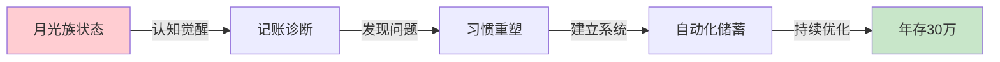
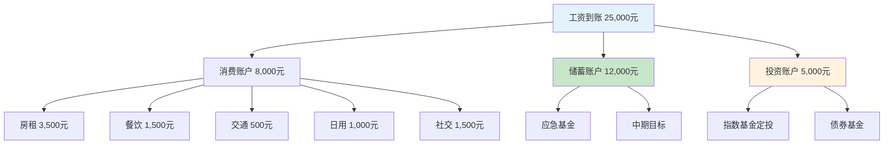

## 案例一：从月光族到年存30万的小王

### 案例概览

这是一个关于**消费习惯重塑**的真实案例。小王的故事之所以典型，是因为他代表了当代城市年轻白领的一个普遍画像：高学历、高收入、高消费、零储蓄。他的转变过程不是靠"省钱"这种简单粗暴的方式，而是通过**认知升级→习惯重塑→系统构建**三步走，实现了从"月光族"到"年储蓄30万"的跨越。



**案例核心数据一览：**

| 指标 | 转变前 | 转变后 | 变化幅度 |
|------|--------|--------|----------|
| 月收入 | 25,000元 | 25,000元 | 不变 |
| 月支出 | 16,000元 | 7,200元 | -55% |
| 月储蓄 | 0元 | 12,800元 | 从无到有 |
| 年储蓄 | 0元 | 约15.4万元（纯储蓄） | 质的飞跃 |
| 年投资 | 0元 | 约6万元（定投+收益） | 质的飞跃 |
| 储蓄率 | 0% | 51.2% | 远超健康线 |
| 应急储备 | 0元 | 6个月支出 | 安全垫建立 |

---

### 第一部分：背景还原——小王是谁？

#### 1.1 基本画像

小王，28岁，坐标深圳，某互联网公司产品经理，工作三年。月薪25,000元（税后约21,000元），加上年终奖约3个月，年收入约31.5万元。

从收入角度看，小王已经超过了全国90%以上的工薪阶层。但他的财务状况却惨不忍睹：

- **银行存款**：3,200元（还不够交一个月房租）
- **信用卡负债**：18,000元（分期还款中）
- **花呗/白条**：6,500元
- **投资资产**：0
- **应急储备**：0
- **保险保障**：仅有公司缴纳的五险一金

用一句话总结：**高收入、零资产、负现金流**。

#### 1.2 消费结构拆解

小王的月支出16,000元具体构成如下：

| 消费类别 | 月均金额 | 占比 | 性质判定 |
|----------|----------|------|----------|
| 房租 | 3,500元 | 21.9% | 必要支出（偏高） |
| 外卖/餐饮 | 3,200元 | 20.0% | 可优化 |
| 冲动消费 | 5,000元 | 31.3% | 严重浪费 |
| 社交应酬 | 3,000元 | 18.8% | 部分可优化 |
| 咖啡/奶茶 | 800元 | 5.0% | 可优化 |
| 其他杂项 | 500元 | 3.1% | 可接受 |

**关键发现**：冲动消费占总支出的31.3%，是最大的财务漏洞。这部分消费的特征是：非计划性、情绪驱动、事后后悔率高。

#### 1.3 心理画像分析

小王的问题不是收入低，而是**心态和习惯出了系统性问题**。具体表现为四个层面：

**即时满足心态（行为层面）**

小王的大脑被"即时奖励回路"劫持了。神经科学研究表明，购物时大脑会释放多巴胺，产生愉悦感。这种机制在原始社会帮助人类获取资源，但在现代消费社会却成了陷阱。小王每次"种草"后下单，本质上是在用金钱购买多巴胺的短暂释放。

**社交攀比心态（认知层面）**

同事换了iPhone 15 Pro Max，自己也要换；朋友去了人均500的日料店打卡，自己也要去。这种行为背后是社会比较理论在作祟——人们通过与他人比较来评估自己的价值。在社交媒体时代，这种比较被无限放大，因为你看到的永远是别人生活中最光鲜的一面。

**财务无知（知识层面）**

小王对个人理财几乎一无所知。他不知道什么是储蓄率，不知道复利的力量，不知道通货膨胀在悄悄吞噬他的购买力。这种无知让他无法对自己的财务状况做出正确判断。

**缺乏系统（习惯层面）**

没有记账习惯、没有预算意识、没有储蓄机制、没有投资规划。所有的消费都是随机的、情绪化的、无计划的。这种"无系统"状态是月光族最根本的问题。

---

### 第二部分：转变过程——从觉醒到系统

#### 2.1 第一阶段：认知觉醒（第1个月）

**触发事件**

小王偶然看到一个理财博主的视频，博主说了一句话："你不是赚得少，你是花得多。25岁到35岁是人生积累的黄金期，你现在花掉的每一块钱，都是在透支未来的自己。"

这句话刺痛了他。他开始认真审视自己的财务状况，发现工作三年，收入近90万，但手头只有3,200元。**三年，90万，只剩下0.35%**。

**第一步：记账**

小王下载了记账APP（随手记），开始记录每一笔支出。第一个月他没有做任何改变，只是记录。

**记账方法详解：**

| 记账方式 | 优点 | 缺点 | 适合人群 |
|----------|------|------|----------|
| 手动记账（APP） | 培养意识强，分类精确 | 耗时，容易遗漏 | 初学者，需要建立意识 |
| 自动记账（银行账单导入） | 省时，不遗漏 | 分类不够精确 | 已有基础者 |
| 信用卡账单分析 | 一次性掌握大额消费 | 覆盖不全 | 快速诊断 |
| 支付宝/微信账单导出 | 覆盖面广 | 需手动分析 | 快速诊断 |

**第一个月的发现**

一个月后，小王导出了完整的消费数据，结果让他震惊：

- 外卖：3,200元/月（平均每天107元，其中30%是深夜加餐）
- 咖啡：800元/月（每天一杯30元的星巴克）
- 冲动消费：5,000元/月（包括3件衣服、2个电子产品配件、若干"种草"好物）
- 社交应酬：3,000元/月（每周2-3次聚餐，人均150-300元）
- 其他：1,000元/月

**总计：13,000元/月**（不含房租），占税后收入的61.9%！

**心理冲击**

这个数字让小王意识到一个残酷的事实：**他每年花在"非必要消费"上的钱超过15万，足够在老家付一套小户型的首付**。

#### 2.2 第二阶段：习惯重塑（第2-3个月）

小王没有采取极端节俭的方式，而是采用了**渐进式优化**策略。他的原则是：**保持生活质量，消除浪费**。

**优化措施详解：**

| 优化项目 | 具体做法 | 月节省 | 难度 | 痛苦指数 |
|----------|----------|--------|------|----------|
| 外卖→自己做饭 | 工作日带饭，周末偶尔外卖 | 1,700元 | ★★★☆☆ | 中等 |
| 星巴克→手冲咖啡 | 买咖啡豆+手冲壶，成本降至5元/杯 | 600元 | ★★☆☆☆ | 低 |
| 冲动消费→48小时冷静期 | 加入购物车，等48小时再决定 | 4,000元 | ★★★★☆ | 较高 |
| 社交应酬→选择性参加 | 只参加真正有价值的聚会 | 1,500元 | ★★★☆☆ | 中等 |
| 其他杂项→预算制 | 每月设定上限，超出不买 | 500元 | ★★☆☆☆ | 低 |
| **总计** | | **8,300元** | | |

**关键习惯改变的执行细节：**

**48小时冷静期（核心习惯）**

这是小王认为最有效的改变。执行方法：

1. 看到想买的东西，先加入购物车
2. 在手机备忘录记录：物品名称、价格、想买的原因
3. 设置48小时后的提醒
4. 48小时后重新评估：我真的需要吗？有没有替代方案？这笔钱如果存下来能做什么？
5. 统计结果：80%的东西48小时后就不想买了

小王说："48小时后，很多东西你会发现根本想不起来为什么要买它。那些还能想起来的，才是真正需要的。"

**替代消费法**

不是不消费，而是找到**性价比更高的替代方案**：

- 星巴克（30元/杯）→ 自己买豆子手冲（5元/杯），品质更好
- 健身房年卡（3,000元）→ 居家健身+跑步（0元）
- 打车（15元/次）→ 地铁+共享单车（4元/次）
- 外卖（30-50元/餐）→ 自己做饭（10-15元/餐）

**社交断舍离**

小王对自己的社交圈做了一次"审计"：

- 每周2-3次聚餐 → 每月2-3次高质量聚会
- 无效社交（纯喝酒、纯吹牛）→ 直接拒绝
- 有价值的社交（行业交流、深度对话）→ 主动参加
- 社交预算上限：1,500元/月

**执行中的困难与应对**

小王在第二个月遇到了强烈的"戒断反应"：

- **第1周**：极度不适应，总觉得"亏待了自己"
- **第2周**：开始怀疑"这样活着有什么意思"
- **第3周**：看到同事买新手机，差点破戒
- **第4周**：第一次看到存款数字增长，产生了正向激励

**应对策略：**

1. **设立小奖励**：每存满5,000元，允许自己买一件100元以内的小物件
2. **找同伴**：加入了一个"极简生活"社群，互相监督
3. **可视化进度**：在手机壁纸上显示存款目标和当前进度
4. **重新定义"享受"**：从"花钱买东西"转变为"看着数字增长"

#### 2.3 第三阶段：系统构建（第4-6个月）

习惯初步建立后，小王开始构建**自动化财务系统**，让好的行为不再依赖意志力。

**三账户系统详解：**



**账户设置细节：**

| 账户 | 银行/平台 | 月转入 | 用途 | 自动化方式 |
|------|-----------|--------|------|------------|
| 消费账户 | 招商银行工资卡 | 8,000元 | 日常开销 | 工资到账后手动转出其他部分 |
| 储蓄账户 | 招商银行朝朝宝 | 12,000元 | 应急+中期目标 | 工资日自动转入 |
| 投资账户 | 天天基金 | 5,000元 | 长期投资 | 设置自动定投 |

**为什么是这个比例？**

- 消费账户（32%）：覆盖基本生活需求，略有余量
- 储蓄账户（48%）：快速建立应急储备，满足中期目标
- 投资账户（20%）：开始学习投资，让钱生钱

这个比例不是固定的。小王计划在应急基金建立完成后，调整为消费30%、储蓄20%、投资50%。

**核心心态转变：**

| 旧心态 | 新心态 | 转变机制 |
|--------|--------|----------|
| 先花再存 | 先存再花 | 工资到账自动转出，剩下才是可花的 |
| 及时行乐 | 延迟满足 | 48小时冷静期+目标可视化 |
| 被动消费 | 主动规划 | 每月初做预算，月底做复盘 |
| 存钱很痛苦 | 存钱有成就感 | 设立里程碑奖励，可视化进度 |
| 投资很危险 | 不投资才危险 | 学习理财知识，理解通货膨胀 |

---

### 第三部分：进阶优化——从存钱到理财

#### 3.1 应急基金的建立

小王在第4-6个月优先建立了应急基金。他的目标是**6个月的基本生活支出**（7,200元 × 6 = 43,200元）。

**应急基金存放原则：**

| 原则 | 说明 | 小王的选择 |
|------|------|------------|
| 流动性 | 随时可取，T+0到账 | 招商银行朝朝宝（年化2.1%） |
| 安全性 | 本金不能有损失风险 | 银行存款类产品 |
| 收益性 | 跑赢活期即可 | 不追求高收益 |
| 独立性 | 与日常消费账户分开 | 单独账户，不绑定支付 |

**应急基金的使用规则：**

1. 只用于真正的紧急情况（失业、重大疾病、意外）
2. 使用后必须在3个月内补回
3. 不用于"想买但没钱"的情况
4. 每季度检查一次金额是否足够

#### 3.2 投资入门

小王从第4个月开始定投，选择了最简单的策略：**宽基指数基金定投**。

**小王的投资组合：**

| 基金类型 | 具体产品 | 月投金额 | 占比 | 选择理由 |
|----------|----------|----------|------|----------|
| 沪深300指数 | 天弘沪深300ETF联接 | 3,000元 | 60% | 覆盖A股核心资产 |
| 中证500指数 | 天弘中证500ETF联投 | 1,500元 | 30% | 覆盖中盘成长股 |
| 债券基金 | 易方达稳健收益 | 500元 | 10% | 降低波动 |

**定投纪律：**

1. 每月15日自动扣款，不看市场涨跌
2. 不追涨杀跌，坚持至少3年
3. 每季度复盘一次，但不做调整
4. 设定止盈线：累计收益达到30%时分批止盈

#### 3.3 保险配置

小王在第6个月配置了基础保险，这是很多人忽略的关键环节。

**保险配置方案：**

| 险种 | 产品 | 年缴保费 | 保额 | 配置理由 |
|------|------|----------|------|----------|
| 重疾险 | 达尔文6号 | 3,200元 | 50万 | 覆盖重大疾病风险 |
| 医疗险 | 好医保长期医疗 | 280元 | 400万 | 补充社保不足 |
| 意外险 | 小蜜蜂2号 | 168元 | 100万 | 杠杆率高 |
| 定期寿险 | 华贵大麦 | 600元 | 100万 | 覆盖房贷等负债 |
| **合计** | | **4,248元/年** | | 月均354元 |

**保险配置原则：**

1. 先保障后理财：先把保障型保险配齐，再考虑理财型
2. 先大人后小孩：经济支柱优先保障
3. 保额充足：重疾险保额至少覆盖3-5年收入
4. 保费合理：总保费不超过年收入的5%

---

### 第四部分：成果与数据

#### 4.1 一年后的财务状况

| 指标 | 一年前 | 一年后 | 变化 |
|------|--------|--------|------|
| 银行存款 | 3,200元 | 180,000元 | +55倍 |
| 投资资产 | 0元 | 62,000元 | 从无到有 |
| 应急基金 | 0元 | 43,200元 | 安全垫建立 |
| 保险保障 | 仅五险 | 全面配置 | 风险覆盖 |
| 信用卡负债 | 18,000元 | 0元 | 负债清零 |
| 花呗/白条 | 6,500元 | 0元 | 负债清零 |
| 月支出 | 16,000元 | 7,200元 | -55% |
| 储蓄率 | 0% | 51.2% | 远超健康线 |

**总资产计算：**

- 银行存款：180,000元
- 投资资产：62,000元（含约5%收益）
- 应急基金：43,200元
- **净资产合计：285,200元**

小王说："以前觉得存钱很痛苦，现在发现，当存钱变成习惯后，反而有一种安全感和成就感。看着数字增长，比买东西开心多了。"

#### 4.2 生活质量变化

很多人担心"省钱会降低生活质量"。小王的经历证明，**优化消费结构不仅不会降低生活质量，反而可能提升**。

| 方面 | 以前 | 现在 | 评价 |
|------|------|------|------|
| 饮食 | 外卖为主，不健康 | 自己做饭，营养均衡 | 提升 |
| 社交 | 无效社交多，疲惫 | 高质量社交，充实 | 提升 |
| 娱乐 | 购物消费 | 阅读、运动、学习 | 转变 |
| 心态 | 焦虑、攀比 | 平静、自信 | 显著提升 |
| 健康 | 久坐、外卖、熬夜 | 运动、做饭、早睡 | 显著提升 |
| 财务 | 负债、焦虑 | 有存款、有规划 | 质的飞跃 |

---

### 第五部分：自我诊断——你是不是另一个小王？

#### 5.1 月光族自测表

请诚实地回答以下问题，每个"是"得1分：

| 序号 | 问题 | 是/否 |
|------|------|-------|
| 1 | 你是否不清楚自己每月具体花了多少钱？ | |
| 2 | 你是否经常在月底发现钱不够用？ | |
| 3 | 你是否有信用卡分期或花呗/白条未还清？ | |
| 4 | 你是否看到"种草"内容就忍不住下单？ | |
| 5 | 你是否因为社交压力而消费（同事都有，我也要有）？ | |
| 6 | 你是否没有应急基金（3个月以上生活费）？ | |
| 7 | 你是否从未做过预算或财务规划？ | |
| 8 | 你是否觉得"存钱=痛苦"？ | |
| 9 | 你是否不知道自己的储蓄率是多少？ | |
| 10 | 你是否没有配置任何商业保险？ | |

**评分解读：**

- 0-2分：财务状况健康，继续保持
- 3-5分：存在隐患，需要开始关注
- 6-8分：月光风险高，需要立即行动
- 9-10分：典型月光族，急需系统性改变

#### 5.2 消费结构健康度分析

健康的消费结构应该满足以下比例（基于税后收入）：

| 消费类别 | 健康比例 | 警戒线 | 危险线 |
|----------|----------|--------|--------|
| 住房（房租/房贷） | 25-30% | 35% | 40%以上 |
| 餐饮 | 10-15% | 20% | 25%以上 |
| 交通 | 5-10% | 15% | 20%以上 |
| 娱乐/社交 | 5-10% | 15% | 20%以上 |
| 购物/冲动消费 | 5%以下 | 10% | 15%以上 |
| 储蓄+投资 | 30%以上 | 20%以下 | 10%以下 |

---

### 第六部分：可复制的方法论

#### 6.1 月光族转型四步法

```mermaid
graph TD
    A[第一步：认知觉醒] --> B[第二步：记账诊断]
    B --> C[第三步：习惯重塑]
    C --> D[第四步：系统构建]
    
    A --> A1[理解复利的力量]
    A --> A2[认识通货膨胀]
    A --> A3[计算你的"财务时薪"]
    
    B --> B1[连续记账30天]
    B --> B2[导出消费数据]
    B --> B3[分类分析]
    
    C --> C1[48小时冷静期]
    C --> C2[替代消费法]
    C --> C3[社交断舍离]
    
    D --> D1[三账户系统]
    D --> D2[自动转账]
    D --> D3[定期复盘]
    
    style A fill:#e3f2fd
    style D fill:#c8e6c9
```

#### 6.2 记账模板

**每日记账模板：**

```text
日期：____年__月__日
收入：
- 工资/奖金：____元
- 副业收入：____元
- 其他收入：____元
收入合计：____元

支出：
- 餐饮：____元
- 交通：____元
- 购物：____元
- 娱乐：____元
- 社交：____元
- 其他：____元
支出合计：____元

今日结余：____元
累计结余：____元
```

**月度复盘模板：**

```text
月份：____年__月

一、收入分析
- 总收入：____元
- 各来源占比：____%

二、支出分析
- 总支出：____元
- 各类别占比：____%
- 超预算项目：____

三、储蓄分析
- 本月储蓄：____元
- 储蓄率：____%
- 累计储蓄：____元

四、投资分析
- 本月投入：____元
- 累计投入：____元
- 投资收益：____元

五、下月计划
- 预算调整：____
- 优化目标：____
- 特别事项：____
```

#### 6.3 工具推荐

| 工具类型 | 推荐工具 | 特点 | 费用 |
|----------|----------|------|------|
| 记账APP | 随手记 | 功能全面，支持多账本 | 免费/高级版 |
| 记账APP | Money Pro | 界面美观，支持预算 | 付费 |
| 自动记账 | 挖财 | 支持银行账单导入 | 免费 |
| 预算管理 | YNAB | 零基预算理念 | 订阅制 |
| 投资平台 | 天天基金 | 基金种类全，费率低 | 免费 |
| 投资平台 | 蛋卷基金 | 智能定投功能 | 免费 |
| 银行账户 | 招商银行 | 朝朝宝收益较高 | 免费 |

---

### 第七部分：常见陷阱与应对

#### 7.1 执行中的常见陷阱

**陷阱一：极端节俭**

有些人矫枉过正，把所有娱乐和社交都砍掉，导致生活极度枯燥，最终报复性消费。

**应对**：保留10-15%的"享受预算"，用于真正带来快乐的消费。

**陷阱二：忽视收入增长**

只关注省钱，不关注提升收入。省钱有上限（最多省100%），但收入增长没有上限。

**应对**：省钱和增收同步进行，把节省下来的时间用于学习和提升。

**陷阱三：没有应急机制**

严格执行预算，但遇到突发情况（朋友结婚、家电损坏）就崩溃。

**应对**：预留5-10%的弹性预算，应对不可预见支出。

**陷阱四：社交压力**

朋友约饭、同事聚餐、节日礼物，各种社交消费压力。

**应对**：提前沟通你的财务计划，真正的朋友会理解你。

**陷阱五：三分钟热度**

前两个月严格执行，第三个月开始松懈，第四个月回到原点。

**应对**：找一个同伴互相监督，设定阶段性奖励，可视化进度。

#### 7.2 心理陷阱

**心理陷阱一：及时行乐的合理化**

"人生苦短，及时行乐"——这句话本身没错，但被过度消费的人滥用了。真正的及时行乐是**有选择地享受**，而不是**无节制地消费**。

**应对**：区分"享受"和"消费"。享受可以是免费的（散步、阅读、与朋友聊天），消费不一定带来享受（冲动购物后的空虚感）。

**心理陷阱二：沉没成本谬误**

"我已经花了这么多钱了，现在省钱太亏了"——这种想法让人继续错误的行为。

**应对**：过去的无法改变，但未来可以。从现在开始，每一分钱都是新的选择。

**心理陷阱三：社会比较的陷阱**

"别人都在买，我不买就落后了"——你看到的只是别人消费的表面，看不到他们的财务压力。

**应对**：不跟别人比消费，跟自己比进步。每个月跟上个月的自己比较。

---

### 第八部分：延伸思考

#### 8.1 从节流到开源

小王的故事主要聚焦在**节流**（减少支出）上。但真正的财务自由需要**开源和节流并重**。

节流的极限是把支出降为0（不可能），但收入的增长空间是无限的。小王在第二年开始思考如何增加收入：

- 利用产品经理技能做咨询（时薪500元）
- 在知识星球分享产品经验（年收入约2万）
- 参与公司内部项目获得额外奖金

#### 8.2 财务自由的定义

小王重新定义了"财务自由"：

> 财务自由不是"想买什么就买什么"，而是"不想做什么就可以不做什么"。

当你有了6个月的应急基金，你就有了"不忍受恶劣工作环境"的底气。当你有了被动收入覆盖基本支出，你就有了"选择自己想做的事"的自由。

#### 8.3 长期视角

小王的案例告诉我们，**改变不在于一夜暴富，而在于日积月累**。

| 时间维度 | 目标 | 关键行动 |
|----------|------|----------|
| 1个月 | 建立记账习惯 | 每天记录，不遗漏 |
| 3个月 | 优化消费结构 | 执行48小时冷静期 |
| 6个月 | 建立应急基金 | 存够6个月支出 |
| 1年 | 形成投资习惯 | 开始定投 |
| 3年 | 资产达到100万 | 持续储蓄+投资 |
| 5年 | 实现财务安全 | 被动收入覆盖基本支出 |

小王的故事还在继续。他说："我现在最大的感受是，**存钱不是目的，自由才是**。当我有了存款，我不再焦虑，不再攀比，不再为了钱做自己不喜欢的事。这种感觉，比买任何东西都爽。"

***

> **本案例启示**：月光不是收入问题，而是系统问题。通过"认知觉醒→记账诊断→习惯重塑→系统构建"四步法，任何人都可以从月光族转变为有储蓄、有投资、有保障的财务健康状态。关键不是"省钱"，而是**建立让好习惯自动运行的系统**。
