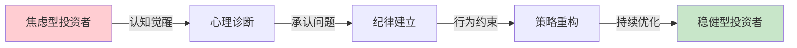
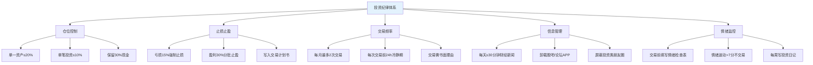
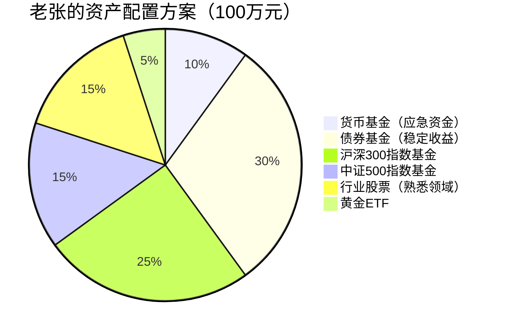
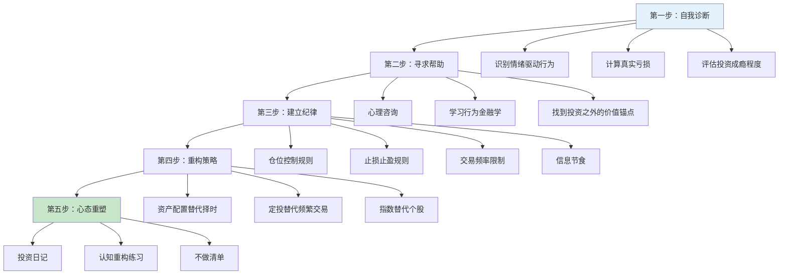

## 案例二：从焦虑型投资者到稳健型投资者的老张

### 案例概览

这是一个关于**投资心理重塑**的真实案例。老张的故事之所以典型，是因为他代表了一类高收入、有积蓄、有学习能力，却在投资中反复亏损的中产群体——他们的失败不是因为"不懂技术"，而是因为**情绪系统劫持了决策系统**。老张的转变路径是：**情绪觉察→纪律建立→策略重构→认知升级**，最终从"被市场控制的焦虑型投资者"变成"控制自己情绪的稳健型投资者"。



**案例核心数据一览：**

| 指标 | 转变前 | 转变后 | 变化幅度 |
|------|--------|--------|----------|
| 年薪 | 50万元 | 50万元 | 不变 |
| 投资本金 | 100万元 | 100万元 | 不变 |
| 三年累计收益 | -15万元（亏损） | +24万元（两年） | 从亏损到盈利 |
| 年化收益率 | -5% | +12% | 质的飞跃 |
| 交易频率 | 每周3-5次 | 每月≤2次 | 降低90%+ |
| 每日盯盘时间 | 6-8小时 | 0（仅月度复盘） | 几乎归零 |
| 焦虑指数 | 严重焦虑、失眠 | 心态平和 | 根本性转变 |
| 工作效率 | 明显下降 | 显著提升 | 全面恢复 |

---

### 第一部分：背景还原——老张是谁？

#### 1.1 基本画像

老张，35岁，坐标上海，某外企中层管理人员，年薪50万元（税后约38万元）。已婚，有一个5岁的孩子，妻子是全职太太。家庭月支出约1.5万元，经济压力不算大。

从收入角度看，老张已经进入了全国前5%的收入阶层。但他的投资表现却远不如一个简单的银行定期存款：

- **投资本金**：100万元（多年积蓄）
- **三年累计亏损**：15万元
- **年化收益率**：约-5%
- **同期银行定期存款收益**：约3%（三年累计约9万元）
- **机会成本**：15万亏损 + 9万放弃的收益 = **实际损失约24万元**

用一句话总结：**高收入、有本金、负收益、高焦虑**。

#### 1.2 老张的投资行为记录

为了诊断问题，老张在心理咨询师的建议下，回顾了三年的投资记录。以下是他的典型交易行为时间线：

| 时间 | 事件 | 行为 | 心理状态 | 结果 |
|------|------|------|----------|------|
| 2021年1月 | 朋友买基金赚30% | All in买在高点 | FOMO，害怕错过 | 买入即下跌 |
| 2021年3月 | 基金下跌10% | 不断补仓"越跌越买" | 损失厌恶，不愿认错 | 继续下跌，套牢更深 |
| 2021年6月 | 基金下跌25% | 恐慌割肉 | 恐惧，心理崩溃 | 卖在最低点附近 |
| 2021年7月 | 割肉后反弹20% | 又追进去 | 后悔+贪婪 | 再次高位接盘 |
| 2021年10月 | 再次下跌 | 再次割肉 | 绝望 | 二次亏损 |
| 2022年全年 | 反复操作 | 追涨杀跌循环 | 焦虑→贪婪→恐惧循环 | 累计亏损15万 |

**关键发现**：老张的亏损不是因为"选错了标的"，而是因为**每一次操作都是情绪驱动的**。如果他2021年初买入后什么都不做，持有到2023年底，他的收益大约是+8%。

#### 1.3 心理画像深度分析

老张的问题不是"不懂投资"——他读过不少理财书籍，能说出各种技术指标。他的问题是**情绪系统全面压倒了理性系统**。具体表现为四个层面：

**FOMO——错失恐惧症（社交层面）**

FOMO（Fear of Missing Out）是一种源于社交比较的心理焦虑。当老张看到朋友、同事、网友在投资中赚钱时，他感到的不是"恭喜"，而是"我落后了"。这种心理的底层逻辑是：**把投资收益等同于个人价值**——别人赚了钱说明别人比我聪明、比我成功。

行为金融学研究表明，FOMO是散户亏损的首要心理原因之一。2021年初的基金热就是一个典型的社会性FOMO事件：当你的朋友圈里人人都在晒基金收益时，不参与就等于"被时代抛弃"。老张就是在这种氛围下All in的。

**损失厌恶——不愿认错（认知层面）**

诺贝尔经济学奖得主丹尼尔·卡尼曼（Daniel Kahneman）的前景理论揭示了一个关键事实：**人对损失的痛苦感是同等收益快乐感的2-2.5倍**。这意味着，亏1万块钱的痛苦，需要赚2-2.5万块钱才能弥补。

老张在基金下跌10%时选择"补仓"，表面理由是"摊低成本"，真实心理是**不愿承认自己买错了**。割肉等于承认错误，这对自尊的打击远大于金钱损失本身。于是他选择了一种心理上更"舒服"但财务上更危险的策略：死扛。

**过度自信——觉得自己能预测市场（认知层面）**

过度自信是投资者最常见的认知偏差之一。老张读了几本技术分析的书，就觉得自己"看懂了市场"。他相信自己能通过K线图、MACD指标来预测短期走势，于是频繁交易。

然而学术研究反复证明：**短期市场走势本质上是不可预测的**。诺贝尔经济学奖得主尤金·法玛（Eugene Fama）的有效市场假说指出，在有效市场中，股价已经反映了所有已知信息，没有人能持续"打败市场"。高盛的一项研究显示，超过80%的主动型基金在10年期内跑输指数。

**信息焦虑——越看越焦虑（行为层面）**

老张每天花6-8小时看财经新闻、股吧评论、大V分析。他以为这是"做功课"，实际上这是**用信息的堆积来缓解焦虑**——但他获得的信息越多，看到的矛盾观点越多，焦虑反而越严重。

这种行为在心理学中叫做"确认偏差"的反面——不是只关注支持自己的信息，而是在信息洪流中迷失方向。一个大V说"看多"，另一个说"看空"，老张在两者之间摇摆不定，最后往往凭直觉做决定。

---

### 第二部分：转变过程——从情绪失控到系统投资

#### 2.1 第一阶段：承认问题（第1-2周）

**触发事件**

老张的转折点来自两个事件的叠加：

1. **家庭危机**：妻子因为他连续亏损而与他大吵一架，说"你要是再这么炒下去，这个家就完了"
2. **健康警报**：体检发现血压偏高、轻度失眠、焦虑症状明显

老张第一次意识到：投资亏损15万不是最大的问题——**最大的问题是投资正在毁掉他的家庭和健康**。

**寻求专业帮助**

老张做了一个很多人做不到的决定：去看心理咨询师。咨询师帮他做了一个关键的区分：

| 区分维度 | 理性投资者 | 焦虑型投资者（老张） |
|----------|-----------|---------------------|
| 决策驱动 | 数据和逻辑 | 情绪和冲动 |
| 对亏损的反应 | 分析原因，调整策略 | 恐慌、自责、急于翻本 |
| 对盈利的反应 | 评估是否达到目标 | 兴奋、自信膨胀、加大投入 |
| 信息处理 | 有选择地获取关键信息 | 海量信息、越看越焦虑 |
| 交易频率 | 低频、有计划 | 高频、随机 |
| 时间视角 | 3-5年以上 | 几天到几周 |
| 自我认知 | "我是普通人，无法预测市场" | "我能比别人看得更准" |

咨询师告诉老张：他的投资行为模式与赌博成瘾高度相似——都是由"间歇性强化"驱动的。偶尔的盈利就像老虎机的偶尔中奖，强化了他继续交易的欲望。

**"投资成瘾"的自我诊断**

咨询师给了老张一个"投资成瘾"自测表：

| 序号 | 表现 | 老张的回答 |
|------|------|-----------|
| 1 | 不看盘就焦虑不安 | 是 |
| 2 | 明知该止损但做不到 | 是 |
| 3 | 亏损后急于"翻本"加大投入 | 是 |
| 4 | 投资影响了工作和家庭关系 | 是 |
| 5 | 曾经撒谎隐瞒亏损金额 | 是 |
| 6 | 用"研究投资"逃避其他问题 | 是 |
| 7 | 做过让自己后悔的冲动交易 | 是 |
| 8 | 觉得"这次一定不一样" | 是 |

**8项全部命中。** 老张终于承认：他不是在"投资"，他是在用投资的名义满足自己的心理需求——刺激感、控制感、自我价值感。

#### 2.2 第二阶段：建立投资纪律（第3-6周）

承认问题后，老张没有立刻"改邪归正"——他知道光靠觉悟是不够的，必须建立**外部约束机制**来对抗内心的情绪冲动。

**制定投资纪律清单**

老张和咨询师一起制定了一套投资纪律，核心原则是：**用规则取代直觉，用系统取代情绪**。



**纪律详解：**

**纪律一：仓位控制**

| 规则 | 具体标准 | 目的 |
|------|---------|------|
| 单一资产上限 | 任何单一资产不超过总资产的20% | 避免"把鸡蛋放在一个篮子里" |
| 单笔投资上限 | 单笔投资不超过总资产的10% | 限制单次决策的风险敞口 |
| 现金储备 | 始终保留30%现金 | 保持灵活性，降低被迫卖出的风险 |
| 行业分散 | 同一行业投资不超过30% | 避免行业系统性风险 |

老张之前的仓位管理是什么样的？100万全部买了一只基金。这相当于把所有命运押在一个标的上——涨了全涨，跌了全跌。这不是投资，这是赌博。

**纪律二：止损止盈**

| 规则 | 具体标准 | 执行方式 |
|------|---------|---------|
| 止损线 | 单笔亏损达15% | 无条件卖出，不找借口 |
| 止盈线 | 单笔盈利达30% | 分三批卖出（10%+10%+10%） |
| 时间止损 | 持有超过6个月无盈利 | 重新评估投资逻辑 |
| 写入计划 | 每笔投资必须提前写好止损止盈点 | 不允许事后"移动"止损线 |

止损是最难执行的纪律。老张之前的"止损"方式是：跌了不卖，告诉自己"会涨回来的"。这不是止损，这是心理逃避。

**纪律三：交易频率限制**

老张之前每周交易3-5次，一年下来交易超过150次。每次交易都有手续费和买卖价差成本，更重要的是，频繁交易让他始终处于情绪波动中。

新的规则：

- 每月最多交易2次（一年最多24次）
- 每次交易前必须有24小时冷静期
- 每次交易必须写出书面理由（不超过3句话）
- 交易理由必须基于基本面或资产配置，不允许基于"感觉"或"消息"

**纪律四：信息节食**

老张之前每天看6-8小时财经新闻，订阅了20多个财经公众号，加了5个投资交流群。信息过载让他严重焦虑。

新的规则：

- 每天只看30分钟财经新闻（固定在晚上8:00-8:30）
- 卸载股吧、雪球等投资论坛APP
- 退掉所有投资交流群
- 屏蔽朋友圈中晒投资收益的人
- 只关注2-3个高质量的信息源

**纪律五：情绪监控**

这是最具创新性的一条。老张在每次交易前必须填写一份"情绪检查表"：

| 检查项 | 评分（1-10） | 老张的标准 |
|--------|-------------|-----------|
| 当前焦虑程度 | ___ | ≥7分不交易 |
| 当前兴奋程度 | ___ | ≥7分不交易 |
| 是否受到他人影响 | 是/否 | "是"不交易 |
| 是否急于翻本 | 是/否 | "是"不交易 |
| 交易理由是否客观 | 是/否 | "否"不交易 |

**执行中的困难与应对**

建立纪律的过程并不顺利。老张在第一个月就遇到了强烈的"戒断反应"：

- **第1周**：看到基金涨了5%，不买极其痛苦，觉得"又错过了"
- **第2周**：看到同事讨论某只股票，忍不住想跟，差点破戒
- **第3周**：基金下跌，习惯性想补仓，被纪律拦住了
- **第4周**：第一次忍住没操作，月底发现"什么都没做"反而少亏了

**应对策略：**

1. **物理隔离**：把投资APP从手机主屏移到最后一页，增加打开的心理成本
2. **替代行为**：想看盘的时候，改为去散步或运动
3. **建立支持系统**：告诉妻子自己的纪律规则，请她监督
4. **记录冲动**：每次想交易但忍住了，记录下来。月底统计：这些"没做的交易"如果做了，结果如何

#### 2.3 第三阶段：转变投资策略（第2-4个月）

纪律建立后，老张开始重构自己的投资策略。核心转变是：**从"择时交易"到"资产配置+定投"**。

**投资理念的根本转变**

| 旧理念 | 新理念 | 转变依据 |
|--------|--------|---------|
| 我能预测市场短期走势 | 短期走势不可预测 | 学术研究和自身经历证明 |
| 频繁交易能赚更多 | 交易越频繁，亏损越多 | 行为金融学研究 |
| 追热点能赚钱 | 热点追到手时往往已是高点 | 老张的亲身经历 |
| 个股收益高 | 个股风险也高，指数更稳健 | 数据：80%主动基金跑输指数 |
| 择时是关键 | 资产配置决定90%的收益 | 布林森研究 |

**资产配置方案**

老张根据自己的风险承受能力（经过评估为"稳健型"）和投资期限（10年以上），制定了以下资产配置方案：



| 资产类别 | 配置比例 | 具体产品 | 选择理由 | 风险等级 |
|----------|---------|---------|---------|---------|
| 货币基金 | 10%（10万） | 天弘余额宝 | 应急资金，随时可取 | 极低 |
| 债券基金 | 30%（30万） | 易方达稳健收益A | 稳定收益，降低组合波动 | 低 |
| 沪深300指数基金 | 25%（25万） | 天弘沪深300ETF联接A | 覆盖A股核心资产 | 中 |
| 中证500指数基金 | 15%（15万） | 天弘中证500ETF联接A | 覆盖中盘成长股 | 中高 |
| 行业股票 | 15%（15万） | 外企相关行业的3-5只龙头股 | 只买自己真正了解的行业 | 中高 |
| 黄金ETF | 5%（5万） | 华安黄金ETF | 对冲通胀和极端风险 | 中 |

**为什么这样配？**

- **债券占30%**：提供"压舱石"，在股市大跌时缓冲损失，降低组合整体波动
- **宽基指数占40%**：通过指数基金"买下整个市场"，不赌个股，不赌方向
- **行业股票仅15%**：限制在老张真正有认知优势的领域（他在外企工作，对相关行业有深入了解）
- **黄金5%**：作为"保险"，在极端事件中提供保护

**定投执行方案**

| 定投项目 | 月投金额 | 定投日期 | 定投平台 | 自动化 |
|----------|---------|---------|---------|--------|
| 沪深300指数基金 | 5,000元 | 每月15日 | 天天基金 | 自动扣款 |
| 中证500指数基金 | 3,000元 | 每月15日 | 天天基金 | 自动扣款 |
| 债券基金 | 4,000元 | 每月15日 | 天天基金 | 自动扣款 |
| **月定投合计** | **12,000元** | | | |

**定投纪律：**

1. 每月15日自动扣款，不看市场涨跌
2. 市场大跌时不加仓（这是纪律，不是机会）
3. 市场大涨时不减仓（这是纪律，不是贪心）
4. 每季度复盘一次资产配置比例，偏离超过5%时再平衡

**为什么选择定投而非一次性投入？**

老张的100万本金是分批投入的：

- 第1个月：投入40万（债券20万 + 货币基金10万 + 沪深300指数基金10万）
- 第2-6个月：每月定投约6万，逐步建仓
- 第7个月：剩余资金一次性配置完毕

这种分批建仓的方式避免了"一次性买在高点"的风险，也给了老张时间来适应新的投资方式。

#### 2.4 第四阶段：心态重塑（持续进行）

纪律和策略是"术"的层面，心态转变才是"道"的层面。老张花了整整半年时间，才真正完成了心态的转变。

**三个核心心态转变**

| 旧心态 | 新心态 | 转变机制 |
|--------|--------|---------|
| "我要打败市场" | "我要跟随市场" | 学习有效市场假说，接受自己的局限性 |
| "短期暴富" | "长期稳健" | 计算复利的力量，理解时间才是最大的杠杆 |
| "每天盯盘" | "每月复盘" | 用数据证明"不操作"比"频繁操作"收益更高 |

**心态转变的具体方法：**

**方法一：重写"投资日记"**

老张开始写投资日记，不是记录"买了什么赚了多少"，而是记录**每次投资决策时的心理状态**。

日记模板：

```text
日期：____年__月__日
今日市场表现：上证指数涨/跌 ___%

我的情绪状态（1-10分）：
- 焦虑程度：___/10
- 兴奋程度：___/10
- 贪婪程度：___/10
- 恐惧程度：___/10

今天是否有交易冲动？
□ 有  □ 无
如果有，原因是什么？__________________
我是否执行了交易？□ 是  □ 否
如果没有执行，忍住后感觉如何？__________________

本月已交易次数：___/2次
本周已看盘时间：___/30分钟
```

这个方法的核心价值在于：**让无意识的情绪变成有意识的觉察**。当老张能清楚地说出"我现在焦虑程度是8分"时，他就不会轻易做出冲动交易。

**方法二：认知重构练习**

每当老张出现焦虑情绪时，他会用一个"三问法"来重构认知：

1. **这个想法是事实还是情绪？** （"市场要崩盘了"是事实还是恐惧？）
2. **最坏的情况是什么？我能承受吗？** （跌50%？能，因为我有30%债券和10%现金）
3. **五年后我会怎么看今天的决定？** （大概率会觉得今天的焦虑毫无意义）

**方法三：建立"不做清单"**

老张列了一个"不做清单"，贴在电脑屏幕旁边：

```text
【老张的"不做"清单】

✗ 不在大涨/大跌当天做任何决策
✗ 不根据"消息面"买卖
✗ 不在社交场合讨论自己的投资
✗ 不看任何"明天涨跌预测"的内容
✗ 不追任何热点板块
✗ 不在情绪激动时打开交易APP
✗ 不因为"别人赚了"就改变自己的策略
✗ 不用"这次不一样"来说服自己
```

**方法四：找到投资之外的价值锚点**

咨询师帮老张意识到：他之所以对投资如此焦虑，是因为他在潜意识里把投资收益等同于自我价值——赚了钱说明我聪明，亏了钱说明我失败。

老张开始有意识地在投资之外建立价值感：提升工作能力、陪伴家人、锻炼身体、发展兴趣爱好。当他的自我价值不再完全依赖投资结果时，他的投资心态自然就平和了。

---

### 第三部分：成果与数据

#### 3.1 两年后的投资表现

| 指标 | 转变前（三年） | 转变后（两年） | 对比 |
|------|--------------|--------------|------|
| 累计收益 | -15万元 | +24万元 | 差距39万元 |
| 年化收益率 | -5% | +12% | 质的飞跃 |
| 最大单次亏损 | -8万元 | -2.3万元 | 风险显著降低 |
| 最大回撤 | -25% | -8% | 波动大幅下降 |
| 交易次数 | ~150次/年 | 20次/年 | 降低87% |
| 投资相关焦虑 | 严重 | 几乎为零 | 根本性转变 |

#### 3.2 生活质量的全面改善

| 方面 | 转变前 | 转变后 | 评价 |
|------|--------|--------|------|
| 睡眠 | 失眠、半夜醒来看盘 | 每晚7-8小时深度睡眠 | 显著提升 |
| 工作 | 无法集中精力，频繁出错 | 效率提升，获得晋升 | 显著提升 |
| 家庭 | 因投资频繁吵架 | 家庭关系和谐 | 显著提升 |
| 健康 | 血压偏高、焦虑症状 | 体检正常、心态平和 | 显著提升 |
| 社交 | 只聊投资、炫耀收益 | 话题多元、关系更真实 | 提升 |

#### 3.3 老张的感悟

老张在一次分享中说：

> "最大的收获不是赚了多少钱，而是不再被钱控制了。以前我每天醒来第一件事是看美股收盘，现在第一件事是给孩子做早餐。以前我觉得不看盘就会错过一个亿，现在我知道，真正错过的其实是生活本身。"

---

### 第四部分：可复制的方法论

#### 4.1 焦虑型投资者转型五步法



#### 4.2 情绪检查表模板

每次投资决策前，填写以下表格：

```text
【投资情绪检查表】

日期：____年__月__日
计划操作：买入/卖出/调整 ________________

一、情绪自评（1-10分）
1. 焦虑程度：___/10
2. 兴奋程度：___/10
3. 贪婪程度：___/10
4. 恐惧程度：___/10
5. FOMO程度：___/10

二、触发因素
□ 看到别人赚钱    □ 市场大涨/大跌
□ 财经新闻        □ 朋友推荐
□ 自己的分析      □ 其他：___

三、纪律检查
□ 本月交易次数未超限（≤2次）
□ 已过24小时冷静期
□ 已写书面交易理由
□ 符合资产配置方案
□ 已设定止损止盈点

四、决策
□ 通过，执行交易
□ 暂缓，再等24小时
□ 驳回，不符合纪律

五、备注
________________________________
```

#### 4.3 资产配置自检清单

每季度复盘一次，检查以下项目：

| 检查项 | 标准 | 当前状态 | 是否达标 |
|--------|------|---------|---------|
| 资产类别多样性 | ≥4类 | ___ | □ |
| 单一资产占比 | ≤20% | ___ | □ |
| 同一行业占比 | ≤30% | ___ | □ |
| 现金储备 | ≥10% | ___ | □ |
| 配置偏离度 | ≤5% | ___ | □ |
| 止损止盈执行 | 100%遵守 | ___ | □ |
| 交易频率 | ≤2次/月 | ___ | □ |
| 信息摄入时间 | ≤30分钟/天 | ___ | □ |

#### 4.4 推荐阅读与学习资源

| 资源 | 类型 | 核心价值 |
|------|------|---------|
| 《思考，快与慢》丹尼尔·卡尼曼 | 书籍 | 理解认知偏差的底层机制 |
| 《漫步华尔街》伯顿·马尔基尔 | 书籍 | 理解市场效率和指数投资 |
| 《投资中最简单的事》邱国鹭 | 书籍 | A股投资的实战框架 |
| 《行为金融学》赫什·舍夫林 | 书籍 | 投资心理的系统性分析 |
| 《钱：7步创造终身收入》托尼·罗宾斯 | 书籍 | 资产配置的实操指南 |
| 《随机漫步的傻瓜》纳西姆·塔勒布 | 书籍 | 理解随机性和运气的本质 |

---

### 第五部分：自我诊断——你是不是另一个老张？

#### 5.1 焦虑型投资者自测表

请诚实地回答以下问题，每个"是"得1分：

| 序号 | 问题 | 是/否 |
|------|------|-------|
| 1 | 你是否每天花超过1小时看盘或财经新闻？ | |
| 2 | 你是否经常因为投资而失眠或焦虑？ | |
| 3 | 你是否在亏损时不愿卖出，总想着"会涨回来"？ | |
| 4 | 你是否在盈利时急于卖出，害怕利润消失？ | |
| 5 | 你是否看到别人赚钱就忍不住跟风？ | |
| 6 | 你是否频繁交易（每周超过1次）？ | |
| 7 | 你是否觉得自己能预测市场的短期走势？ | |
| 8 | 你是否因为投资亏损而影响了工作或家庭关系？ | |
| 9 | 你是否曾因为"消息面"而做出冲动交易？ | |
| 10 | 你是否不清楚自己的资产配置方案？ | |

**评分解读：**

- 0-2分：投资心态健康，继续保持
- 3-5分：存在焦虑倾向，需要开始关注投资心理
- 6-8分：典型的焦虑型投资者，需要系统性改变
- 9-10分：严重的投资心理问题，建议寻求专业帮助

#### 5.2 投资行为健康度评估

| 行为维度 | 健康标准 | 警戒线 | 危险线 |
|----------|---------|--------|--------|
| 交易频率 | ≤2次/月 | 每周1次 | 每周3次以上 |
| 每日盯盘时间 | 0分钟 | 30分钟 | 2小时以上 |
| 单一资产占比 | ≤20% | 30% | 50%以上 |
| 止损执行率 | 100% | 80% | 50%以下 |
| 投资情绪日记 | 每周1篇 | 每月1篇 | 从不记录 |
| 资产配置种类 | ≥4类 | 3类 | 1-2类 |

---

### 第六部分：常见陷阱与误区

#### 6.1 "学了就能赚钱"陷阱

很多投资者在亏损后开始疯狂学习——读了50本投资书、考了CFA、学了技术分析——然后自信满满地重新入场，结果依然亏损。

**为什么？** 因为投资亏损的根本原因往往不是"知识不足"，而是"情绪管理不足"。知识可以帮你做出正确的分析，但只有情绪管理才能帮你执行正确的决策。老张的故事证明：一个懂技术分析但情绪失控的投资者，表现远不如一个什么都不懂但坚持定投的人。

#### 6.2 "这次不一样"陷阱

每一轮市场周期中，总有人说"这次不一样"——这次是真正的牛市、这次是永远的熊市、这次是百年一遇的机会。老张在2021年初就是被"这次是基金大年"的话术洗脑的。

**应对方法：** 每当听到"这次不一样"，就提醒自己：这句话在每一次市场狂热和恐慌中都出现过，而市场每次都回归了均值。

#### 6.3 "回本就卖"陷阱

很多被套的投资者把"回本"作为卖出的唯一标准——"等涨回成本价我就卖"。这是一种典型的"锚定效应"：你把买入价格当成了"合理价格"，但实际上市场根本不知道你的买入价。

**正确做法：** 问自己一个问题——"如果我现在没有持有这只股票/基金，我愿意以当前价格买入吗？"如果答案是"不愿意"，那你就应该卖出，不管是否回本。

#### 6.4 "靠投资翻身"陷阱

有些投资者把投资当成"翻身"的机会——希望通过一次成功的投资改变命运。这种心态会让你不自觉地加大杠杆、集中仓位、忽视风险。

**正确心态：** 投资是"锦上添花"，不是"雪中送炭"。真正的财富来源是你的工作能力和持续收入，投资只是让你的积蓄保值增值的工具。

---

### 第七部分：进阶内容——行为金融学视角

#### 7.1 投资中常见的认知偏差

行为金融学是研究投资者心理和行为的学科，它揭示了许多导致投资亏损的认知偏差：

| 认知偏差 | 定义 | 在投资中的表现 | 应对方法 |
|----------|------|---------------|---------|
| 损失厌恶 | 对损失的痛苦感是收益快乐感的2倍 | 死扛亏损、急于止盈 | 用规则替代直觉 |
| 锚定效应 | 过度依赖第一个接触到的信息 | "回本就卖"、"历史高点" | 用基本面估值替代价格锚点 |
| 确认偏差 | 只关注支持自己观点的信息 | 只看利好消息、忽视风险 | 主动寻找反对意见 |
| 过度自信 | 高估自己的判断能力 | 频繁交易、重仓押注 | 记录预测准确率 |
| 从众心理 | 跟随大众的行为 | 追热点、跟风买入 | 建立独立的分析框架 |
| 近因偏差 | 过度重视最近发生的事件 | 因为最近涨了就认为会继续涨 | 拉长观察周期 |
| 沉没成本 | 因为已经投入而不愿放弃 | "已经亏了这么多，不能卖" | 只看未来收益，不看过去成本 |
| 处置效应 | 过早卖出盈利资产、过久持有亏损资产 | "卖涨持跌" | 用止损止盈规则强制执行 |

#### 7.2 从"市场先生"到"资产配置"

投资大师本杰明·格雷厄姆提出了一个著名的比喻："市场先生"（Mr. Market）。他把市场比作一个情绪不稳定的交易对手——有时候他兴高采烈地报出高价，有时候他垂头丧气地报出低价。聪明的投资者不会被"市场先生"的情绪影响，而是利用他的情绪来获利。

老张之前的做法是：跟着"市场先生"的情绪走——他高兴时我也高兴，他恐慌时我也恐慌。新的做法是：无视"市场先生"的情绪，专注于自己的资产配置方案。

**学术支持：** 加里·布林森（Gary Brinson）等人在1986年和1991年的研究表明，投资组合收益的91.5%由资产配置决定，而非选股或择时。这意味着：你买什么（个股选择）和什么时候买（择时）加在一起，对收益的影响不到10%。

这一研究结论对焦虑型投资者的启示是：**与其花时间研究"买什么"和"什么时候买"，不如花时间确定"各类资产配多少"**。

#### 7.3 长期主义的数学基础

老张的心态转变有一个关键的数学支撑——复利计算。假设初始本金100万元：

| 年化收益率 | 5年 | 10年 | 20年 | 30年 |
|-----------|-----|------|------|------|
| 3%（银行存款） | 115.9万 | 134.4万 | 180.6万 | 242.7万 |
| 6%（债券基金） | 133.8万 | 179.1万 | 320.7万 | 574.3万 |
| 10%（指数基金） | 161.1万 | 259.4万 | 672.7万 | 1744.9万 |
| 12%（老张的目标） | 176.2万 | 310.6万 | 964.6万 | 2996.0万 |

这些数字说明了一个关键事实：**时间是投资中最强大的变量**。年化12%的收益率，30年后100万可以变成近3000万。而频繁交易带来的摩擦成本（手续费、买卖价差、税费）和情绪消耗，恰恰在侵蚀这个复利过程。

老张现在明白了：投资最大的敌人不是市场波动，而是自己的情绪。当他不再被情绪控制，让复利自然发生，财富就会稳步增长。

---

### 本节总结

老张的故事给我们的核心启示：

1. **投资失败的根源往往是心理问题，而非知识不足**。FOMO、损失厌恶、过度自信、信息焦虑——这些情绪才是真正的"亏损之源"。

2. **纪律是情绪的解药**。当你的理性系统制定了明确的规则，情绪系统就无法轻易劫持你的决策。

3. **资产配置比择时重要一百倍**。不要试图预测市场，而要建立一个在任何市场环境下都能生存的投资组合。

4. **信息节食比信息过载更有效**。每天看30分钟高质量信息，远胜于每天看8小时噪音。

5. **投资的终极目标不是赚钱，而是获得自由**。不再被金钱和市场控制，拥有平静的心态和充裕的时间——这才是投资的真正回报。

***
