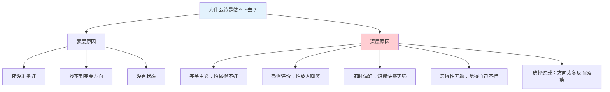
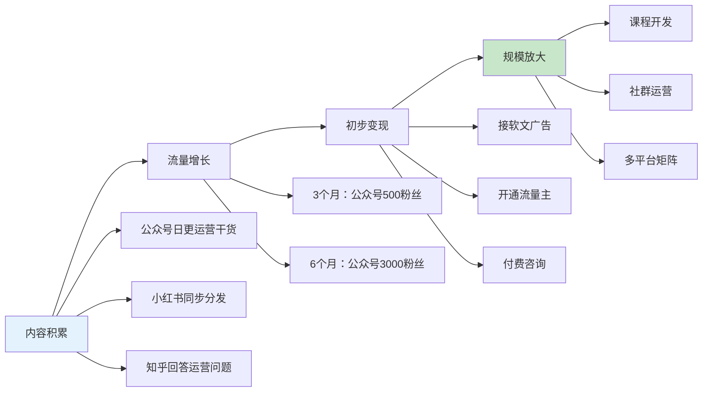
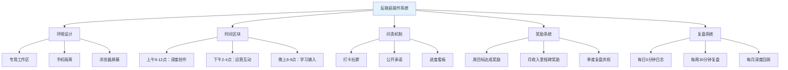

## 案例三：从拖延症患者到高效搞钱者的小陈

### 案例概览

这是一个关于**执行力重塑**的真实案例。小陈的故事之所以典型，是因为他代表了一类"什么都懂、什么都不做"的聪明人——他们不缺知识、不缺想法、不缺能力，缺的是**把想法变成行动、把行动变成结果**的执行力系统。小陈的转变路径是：**拖延诊断→阻力拆解→微习惯启动→自动化系统构建**，最终从"永远在准备、永远不开始"的拖延症患者变成"想到就做、做完就优化"的高效搞钱者。


**案例核心数据一览：**

| 指标 | 转变前 | 转变后 | 变化幅度 |
|------|--------|--------|----------|
| 月薪（主业） | 15,000元 | 15,000元 | 不变 |
| 副业月收入 | 0元 | 12,000元 | 从无到有 |
| 月总收入 | 15,000元 | 27,000元 | +80% |
| 年总收入 | 18万元 | 32.4万元 | +80% |
| 副业项目完成率 | 0%（从未完成） | 85% | 质的飞跃 |
| 每日有效工作时间 | 2-3小时 | 6-7小时 | +150% |
| 拖延发作频率 | 每天 | 每周1-2次（可控） | 降低80%+ |
| 自我效能感 | 极低、习得性无助 | 高、持续正反馈 | 根本性转变 |

---

### 第一部分：背景还原——小陈是谁？

#### 1.1 基本画像

小陈，29岁，坐标杭州，某互联网公司运营岗，工作四年。月薪15,000元（税后约12,500元），加上年终奖约2个月，年收入约21万元。

从能力角度看，小陈是个不折不扣的"聪明人"——211本科毕业，学习能力强，对新事物敏感，朋友圈里经常分享各种搞钱思路和商业分析。但他的实际行动记录却惨不忍睹：

- **想做自媒体**：2022年3月注册了公众号，写了一篇开篇，然后——停更至今
- **想做电商**：研究了两个月的选品工具，列了Excel表对比了200多款产品，然后——没有上架任何一款
- **想学编程接单**：买了三门Python课程，完成了第一门的30%——其余两门从未打开
- **想做知识付费**：写了一份20页的课程大纲，甚至连PPT模板都选好了——然后搁置了八个月
- **想投资理财**：关注了20多个理财博主，做了大量笔记——账户里的钱仍然躺在余额宝里

用一句话总结：**高能力、零产出、持续内耗**。

#### 1.2 拖延行为的时间线

为了诊断问题，小陈在朋友（一位心理咨询师）的建议下，回顾了过去两年中每次"想搞钱但没搞成"的经历，绘制了一张行为时间线：

| 时间 | 想做的事 | 完成情况 | 卡在哪一步 | 心理状态 |
|------|---------|---------|-----------|---------|
| 2022年3月 | 做自媒体 | 写了1篇 | "等我想好定位再写" | 热情→犹豫→遗忘 |
| 2022年6月 | 做电商 | 选品200+未上架 | "还没找到完美的产品" | 兴奋→纠结→疲惫 |
| 2022年9月 | 学Python | 完成30% | "课程太枯燥，等有状态再学" | 冲动→厌倦→自责 |
| 2023年1月 | 做知识付费 | 完成大纲和模板 | "我还不够格教别人" | 期待→自我怀疑→放弃 |
| 2023年4月 | 做投资 | 学了理论没动手 | "等我再学深入一点" | 焦虑→囤积知识→停滞 |
| 2023年8月 | 做小红书 | 注册了账号 | "不知道发什么内容" | 兴奋→迷茫→搁置 |

**关键发现**：小陈的拖延不是"懒"，而是一种**系统性的行为模式**——每个项目都卡在同一个阶段：从"学习/准备"过渡到"正式开始"的临界点。他永远在准备，永远不开始。

#### 1.3 心理画像深度分析

小陈的问题不是能力不足，而是**拖延的心理机制全面控制了他的行为系统**。具体表现为五个层面：

**完美主义陷阱（认知层面）**

小陈的内心有一个根深蒂固的信念："要么不做，要做就做到最好。"这个信念表面上看是高标准，实际上是**行动的枷锁**。心理学家唐·哈马切克（Don Hamachek）将完美主义分为"正常完美主义"和"神经质完美主义"：前者追求卓越但能接受不完美，后者则因为害怕不完美而拒绝开始。小陈属于后者。

他的完美主义表现为：不做任何"不完美"的尝试。公众号文章必须字字珠玑，否则不发；选品必须找到"独一无二"的爆品，否则不上架；课程必须"完全准备好"，否则不开课。问题是——**世界上不存在完美的起步**，所有成功的项目都是从粗糙的1.0版本迭代而来的。

**对失败的灾难化想象（情绪层面）**

小陈的拖延背后，隐藏着一种对失败的深层恐惧。但他的恐惧不是"怕亏钱"或"怕浪费时间"——而是**怕被评价**。他害怕发了公众号没人看（丢人），害怕选了产品卖不出去（证明自己没眼光），害怕做了课程被嘲笑（暴露自己的不足）。

心理学家阿尔伯特·埃利斯（Albert Ellis）的理性情绪行为疗法（REBT）将这种思维模式称为"灾难化"（Catastrophizing）——把可能的失败后果无限放大。小陈在开始任何项目前，大脑中已经预演了无数次"失败的场景"，这些想象中的灾难让他动弹不得。

**即时满足偏好（神经层面）**

拖延的神经科学基础是大脑边缘系统（负责情绪和即时奖励）与前额叶皮层（负责计划和长期决策）之间的冲突。小陈的大脑中，边缘系统占据了绝对优势——刷短视频、打游戏、看小说这些即时满足的活动，总是比"写文章""做选品""学编程"这些需要延迟满足的活动更有吸引力。

神经科学家皮尔斯·斯蒂尔（Piers Steel）的研究表明：**任务的延迟折扣率越高，拖延的可能性越大**。也就是说，一个回报在遥远未来的任务（如"做自媒体三个月后可能有收入"），在大脑中的主观价值会被大幅折扣，远远比不上一个能立刻带来快感的活动。

**习得性无助（自我认知层面）**

两年六次"想搞钱但没搞成"的经历，让小陈形成了一种深层的自我认知：**"我就是个执行力差的人，我注定做不成大事。"** 这就是心理学家马丁·塞利格曼（Martin Seligman）提出的"习得性无助"——反复的失败经历让人相信自己对结果无能为力，从而放弃尝试。

小陈甚至发展出了一套自我保护机制："我只是还没认真做，等我认真起来，一定能做成。"这句话让他可以永远活在"潜力"的幻觉中，而不用面对"行动→可能失败"的现实。

**决策疲劳与选择过载（行为层面）**

小陈是一个典型的"信息囤积者"。他收藏了500多篇搞钱攻略，关注了100多个商业博主，手机备忘录里存了200多条"搞钱灵感"。表面上这是勤奋，实际上是**用信息的收集来替代真正的行动**——每多看一篇文章，就多了一个"我正在准备"的借口。

心理学家巴里·施瓦茨（Barry Schwartz）在《选择的悖论》中指出：**选择越多，决策越困难，满意度越低**。小陈面对200种可选的副业方向，反而陷入了"选择瘫痪"——因为选了A就意味着放弃了B、C、D……Z，这种机会成本的焦虑让他无法做出任何选择。

---

### 第二部分：转变过程——从瘫痪到行动

#### 2.1 第一阶段：拖延觉醒（第1-2周）

**触发事件**

小陈的转折点来自一次"算总账"。

2023年国庆假期，小陈闲来无事，翻出了自己两年来记录的所有"搞钱计划"。他把每一条计划、每一笔学费、每一个注册的平台都列了出来，然后做了一个残酷的计算：

| 项目 | 投入时间 | 投入金钱 | 实际产出 |
|------|---------|---------|---------|
| 自媒体 | 约30小时 | 0元 | 1篇文章，0收益 |
| 电商选品 | 约80小时 | 0元 | 0个上架产品，0收益 |
| Python课程 | 约20小时 | 599元 | 未完成，0收益 |
| 知识付费 | 约40小时 | 299元（PPT模板） | 仅大纲，0收益 |
| 投资学习 | 约60小时 | 0元 | 未实际投资，0收益 |
| 小红书 | 约5小时 | 0元 | 0篇内容，0收益 |
| **合计** | **约235小时** | **约898元** | **0元收益** |

**235小时——相当于整整一个月的全职工作时间。898元——虽然不多，但换回的是零。** 更重要的是，如果这235小时哪怕只投入一个方向，按照他研究过的任何一种副业模式，至少应该有几千元的收入了。

小陈在日记中写道："我不是没时间，也不是没能力。我把235个小时分散在6个项目上，每个都浅尝辄止，每个都没有结果。问题不是做什么，而是——为什么我就是做不下去？"

**寻求专业认知**

小陈的咨询师朋友给了他一个关键的认知框架：**拖延不是性格缺陷，而是一种情绪调节策略**。人们拖延的不是任务本身，而是任务带来的**负面情绪**（焦虑、无聊、恐惧、自我怀疑）。

这个认知让小陈如释重负——他不是"懒"，也不是"废"，他只是在用拖延来逃避不舒服的感觉。这意味着，解决方案不是"逼自己更努力"，而是**降低任务的情绪阻力**。

#### 2.2 第二阶段：拖延诊断与阻力拆解（第3-4周）

**逐一拆解六个失败项目**

小陈和咨询师一起，把每个失败项目"卡住"的真正原因拆解了出来：



**发现核心模式**

每个项目的失败都遵循相同的模式：

```text
热情启动 → 学习/准备阶段（舒适区）→ 即将正式开始 → 情绪阻力爆发 → 拖延 → 自责 → 放弃 → 找下一个新项目 → 循环
```

**关键时刻**不是"开始学习"的时刻，而是"从学习过渡到行动"的时刻——那是情绪阻力最大的时刻，也是小陈每次都倒下的时刻。

**制定"阻力拆解清单"**

针对每个失败项目，小陈列出了具体的阻力点和应对策略：

| 项目 | 卡住的那一刻 | 阻力来源 | 拆解策略 |
|------|------------|---------|---------|
| 自媒体 | 写完第一篇后不敢发 | 害怕没人看、害怕被评价 | 先发到"仅自己可见"，再发到小群，逐步扩大 |
| 电商 | 选完品后不敢下单进货 | 害怕亏钱、害怕选错 | 先用一件代发模式，零库存试水 |
| Python | 学到函数后觉得枯燥 | 任务太抽象、缺乏即时反馈 | 改为"边做边学"，直接做一个实际小项目 |
| 知识付费 | 写完大纲后觉得自己不够格 | 冒充者综合征 | 先做免费分享，收集反馈，验证价值 |
| 投资 | 学完理论后不敢下单 | 害怕亏钱 | 先用100元实际操作，体验真实流程 |
| 小红书 | 不知道发什么 | 选择过载 | 限定只发"运营干货"一个垂类 |

#### 2.3 第三阶段：微习惯启动（第5-8周）

**核心策略：把门槛降到"不可能失败"**

咨询师教给小陈一个关键概念：**微习惯（Micro Habits）**——把一个大目标拆解成一个"小到不可能失败"的每日行动。这个概念来自斯蒂芬·盖斯（Stephen Guise）的《微习惯》一书，其核心原理是：**启动比坚持更重要，行动比计划更有价值**。

小陈为自己的第一个副业项目（自媒体）设定了以下微习惯：

| 传统目标 | 微习惯版本 | 每日耗时 | 为什么不可能失败 |
|----------|-----------|---------|----------------|
| 每天写一篇公众号文章 | 每天写100字 | 5分钟 | 100字连一条朋友圈都比这长 |
| 每周发3篇内容 | 每天打开写作软件 | 1分钟 | 打开软件就完成任务 |
| 做出爆款内容 | 每天记录1个选题灵感 | 2分钟 | 随便想一个就行 |
| 研究竞品账号 | 每天看1篇同行文章 | 3分钟 | 刷手机顺便就看了 |

**为什么微习惯有效？**

小陈之前的失败模式是：设定宏大目标→初期热情执行→热情消退→任务变得痛苦→拖延→自责→放弃。微习惯打断了这个循环的起点——**它消除了"任务太痛苦"这个环节**。当目标小到不可能失败时，大脑不会启动"逃避"机制。

更重要的是，微习惯利用了**行为惯性**——一旦你开始做了，往往会做得比计划更多。小陈的体验是：每天的目标是写100字，但实际平均写了400字，最多的一天写了2000字。关键不是写多少，而是**每天都坐在了电脑前**。

**执行记录**

小陈的微习惯执行日志（第一周）：

```text
Day 1（周一）：打开写作软件，写了120字。感觉不错。
Day 2（周二）：写了几段，总共180字。有点想继续但要去打游戏了。
Day 3（周三）：只写了100字就关了，有点累。但完成了任务！
Day 4（周四）：写了300字，写到了一个有趣的话题，停不下来。
Day 5（周五）：写了一整段500字。开始觉得写作没那么可怕了。
Day 6（周六）：休息日，只写了100字。但没有断！
Day 7（周日）：写了400字。整理了一周的内容，发现已经攒了1700字。
```

第一周结束后，小陈发现：**七天完成率100%**——这是他人生中第一次连续七天完成一个搞钱相关的日常任务。虽然产出不多，但那种"我做到了"的感觉，比任何一篇文章的阅读量都更有价值。

#### 2.4 第四阶段：从副业项目到收入（第2-4个月）

**选择"最小可行产品"路径**

小陈没有再犯"什么都想做"的老毛病。他用了一个决策框架来选择第一个副业方向：

| 评估维度 | 自媒体写作 | 电商 | 知识付费 | 投资 |
|----------|-----------|------|---------|------|
| 启动门槛 | 低（只需电脑） | 中（需要选品+资金） | 高（需要专业积累） | 中（需要本金） |
| 首次收入周期 | 2-3个月 | 1-2个月 | 6个月+ | 不确定 |
| 所需技能匹配度 | 高（运营岗，擅长写） | 中 | 高 | 低 |
| 失败成本 | 极低（仅时间） | 中（可能压货） | 低 | 中（可能亏损） |
| 拖延风险 | 中 | 高（选品会拖延） | 高（准备会拖延） | 高（学习会拖延） |
| **综合评分** | **最优** | 中 | 低 | 低 |

**选择自媒体写作的理由**：启动门槛最低、首次收入周期合理、与现有技能匹配、失败成本最低。更重要的是——**它最容易用微习惯启动**。

**自媒体变现的具体路径**

小陈选择了一个自己最擅长的垂类：**互联网运营干货**。变现路径如下：



**关键里程碑记录**

| 时间节点 | 里程碑 | 收入 | 感受 |
|----------|--------|------|------|
| 第1个月 | 日更30天，累计15,000字 | 0元 | "我居然坚持下来了！" |
| 第2个月 | 公众号破500粉丝，开通流量主 | 18元 | "18块钱不多，但这是我赚的第一笔副业收入" |
| 第3个月 | 接到第一篇软文广告 | 800元 | "有人愿意花钱让我写，说明我有价值" |
| 第4个月 | 公众号2000粉丝，稳定接广告 | 2,500元 | "开始找到节奏了" |
| 第6个月 | 公众号5000粉丝，开通付费咨询 | 6,000元 | "副业收入快赶上主业的一半了" |
| 第9个月 | 公众号12000粉丝，开发了小课 | 10,000元 | "搞钱真的可以靠执行力" |
| 第12个月 | 公众号20000粉丝，多平台矩阵 | 12,000元 | "我终于不是那个只会想的人了" |

**关键时刻：第一次"差点又拖延"**

在第三个月，小陈遇到了第一次真正的考验——一个品牌方给他发了合作邀请，但要求他在两天内交稿。小陈的第一反应是"两天太紧了，我还没准备好"——拖延的老毛病又来了。

这一次，他用了一个新策略：**"先做5分钟"原则**。他告诉自己："我只花5分钟打开文档、写一个标题。5分钟后如果不想写，可以停下来。"结果他写了标题之后，顺手写了第一段，然后一口气写了三个小时，提前交稿。

这个经历让小陈领悟到一个关键认知：**行动的动力不是来自"想做"，而是来自"开始做"**。你不需要等到"有状态"才开始——开始做了，状态自然就来了。

#### 2.5 第五阶段：系统构建与效率提升（第5-12个月）

**构建"反拖延"操作系统**

小陈明白，光靠意志力和微习惯是不够的——他需要一套**自动化系统**来对抗拖延的本能。他构建了一个包含五个模块的"反拖延操作系统"：



**模块一：环境设计**

小陈发现，拖延很大程度上是环境触发的。手机放在桌上→看到通知→刷一下→半小时没了。解决方案不是"靠意志力不看手机"，而是**让干扰源物理消失**。

| 干扰源 | 干扰方式 | 环境设计方案 |
|--------|---------|------------|
| 手机 | 通知、社交媒体 | 写作时手机放到另一个房间，用智能手表接电话 |
| 浏览器 | 刷网页、看视频 | 安装Cold Turkey屏蔽器，工作时段屏蔽娱乐网站 |
| 电脑桌面 | 游戏、无关软件 | 创建专用"工作用户"，桌面上只有写作工具 |
| 噪音 | 室友、街道 | 降噪耳机 + 白噪音（推荐Noisli） |
| 工作区 | 躺在床上工作 | 固定在书桌前工作，床只用于睡觉 |

**模块二：时间区块管理**

小陈采用了"时间区块法"（Time Blocking），把一天分成几个固定用途的时间段。核心原则是：**每个时间段只做一件事，不切换任务**。

| 时间段 | 用途 | 具体内容 | 不允许做的事 |
|--------|------|---------|------------|
| 7:00-8:00 | 晨间仪式 | 运动+早餐+读30分钟 | 看手机、回消息 |
| 9:00-12:00 | 深度创作（主业+副业） | 写文章、做课程内容 | 回消息、开会、刷网页 |
| 12:00-13:30 | 午餐+休息 | 吃饭、散步、午休 | 工作相关的内容 |
| 13:30-17:30 | 主业工作 | 公司运营工作 | 副业相关的内容 |
| 18:00-19:30 | 晚餐+放松 | 吃饭、运动、社交 | 工作 |
| 20:00-21:00 | 运营互动 | 回复评论、社群互动、数据复盘 | 创作新内容 |
| 21:00-21:30 | 学习输入 | 阅读行业文章、记录灵感 | 被动刷信息流 |

**为什么时间区块能对抗拖延？**

拖延的一个重要触发因素是"决策疲劳"——每次都要想"我现在做什么？"这个问题本身就消耗意志力，很容易导致"算了，先刷会手机"。时间区块消除了这个决策：到了时间就做对应的事，不需要思考。

**模块三：问责机制**

小陈加入了两个"问责社群"：

1. **搞钱打卡群**（微信群，6人）：每天晚上10点前，群内汇报当天的副业进展。连续3天未打卡需要发50元红包。
2. **公开承诺**（朋友圈）：每月初在朋友圈公布当月的副业目标。做不到会被朋友"打脸"。

心理学研究表明，**公开承诺能将目标完成率提高65%**。原因在于：公开承诺激活了"一致性需求"——人们希望自己的行为与公开宣称的一致，否则会产生认知失调。

**模块四：奖励系统**

小陈建立了一套"即时奖励"机制，弥补副业回报的延迟性：

| 成就 | 奖励 | 成本 |
|------|------|------|
| 连续7天完成微习惯 | 看一部想看的电影 | 30元 |
| 月度内容目标达成 | 买一本想读的书 | 50元 |
| 副业月收入破3000 | 一顿好餐厅 | 200元 |
| 副业月收入破8000 | 一双想要的鞋 | 500元 |
| 副业月收入破12000 | 一次周末短途旅行 | 1000元 |

**模块五：复盘系统**

小陈坚持了三种复盘：

**每日复盘（5分钟，睡前）**

```text
【今日复盘】
日期：____年__月__日
1. 今天完成了什么？__________________
2. 今天拖延了吗？如果拖延了，触发因素是什么？__________________
3. 明天最重要的1件事是什么？__________________
4. 给今天的执行力打分（1-10）：___
```

**每周复盘（30分钟，周日晚上）**

```text
【周复盘】
第___周

一、本周目标完成情况
□ 目标1：__________ 完成/未完成
□ 目标2：__________ 完成/未完成
□ 目标3：__________ 完成/未完成

二、数据回顾
- 本周发布内容：___篇
- 本周新增粉丝：___人
- 本周副业收入：___元

三、拖延分析
- 本周拖延次数：___次
- 主要触发因素：__________
- 应对效果：__________

四、下周计划
- 最重要的1件事：__________
```

**每月深度回顾（2小时，月末）**

分析本月的收入数据、粉丝增长、内容表现、拖延模式变化，并调整下月策略。

---

### 第三部分：成果与数据

#### 3.1 一年后的全面数据

| 指标 | 一年前 | 一年后 | 变化 |
|------|--------|--------|------|
| 副业月收入 | 0元 | 12,000元 | 从无到有 |
| 月总收入 | 15,000元 | 27,000元 | +80% |
| 年总收入 | 18万元 | 32.4万元 | +14.4万元 |
| 公众号粉丝 | 0 | 20,000 | 从零起步 |
| 发布内容总数 | 0 | 350+篇 | 持续产出 |
| 付费咨询客户 | 0 | 8人/月 | 稳定客源 |
| 小课程学员 | 0 | 120人 | 知识变现 |
| 每日有效工作时间 | 2-3小时 | 6-7小时 | +150% |
| 拖延发作频率 | 每天 | 每周1-2次 | 降低80%+ |

**收入结构拆解：**

| 收入来源 | 月均收入 | 占比 | 启动时间 |
|----------|---------|------|---------|
| 公众号广告（软文+流量主） | 4,500元 | 37.5% | 第3个月 |
| 付费咨询（运营诊断） | 3,500元 | 29.2% | 第6个月 |
| 小课程销售（自动化） | 2,500元 | 20.8% | 第9个月 |
| 多平台分发（知乎、小红书） | 1,500元 | 12.5% | 第8个月 |
| **合计** | **12,000元** | **100%** | |

#### 3.2 生活质量的全面改善

| 方面 | 以前 | 现在 | 评价 |
|------|------|------|------|
| 自我认知 | "我就是执行力差的人" | "我是一个能持续产出的人" | 根本性转变 |
| 自信心 | 极低，觉得自己什么都做不成 | 高，知道自己能做到 | 显著提升 |
| 焦虑程度 | 高，总是焦虑"别人在搞钱我在干嘛" | 低，知道自己在持续前进 | 显著改善 |
| 社交质量 | 吹牛式社交，光说不练 | 分享实战经验，受到尊重 | 显著提升 |
| 主业表现 | 因焦虑影响效率 | 副业经验反哺主业 | 正向循环 |
| 身体状态 | 久坐、熬夜、焦虑性失眠 | 规律作息、运动习惯 | 改善 |

#### 3.3 小陈的感悟

小陈在一次社群分享中说：

> "两年前的我，收藏了500篇搞钱文章，一个都没有实践。两年后的我，只用了一个方法——每天写100字。不是那些文章没用，是我一直在用'学习'来代替'行动'。现在我明白了，搞钱最大的秘诀不是找到最好的方向，而是**先动起来，哪怕是一小步**。100字不多，但365天就是36,500字——足够变成一门课程、一本电子书、或者一个2万粉丝的账号。"

---

### 第四部分：可复制的方法论

#### 4.1 拖延型搞钱者转型五步法

```mermaid
graph TD
    A[第一步：算总账] --> B[第二步：拆阻力]
    B --> C[第三步：微习惯启动]
    C --> D[第四步：项目突破]
    D --> E[第五步：系统构建]

    A --> A1[统计过去投入的时间和金钱]
    A --> A2[计算实际产出和回报率]
    A --> A3[直面"一直在准备"的真相]

    B --> B1[列出每个项目的卡点]
    B --> B2[区分表层原因和深层原因]
    B --> B3[制定针对性的拆解策略]

    C --> C1[选1个最简单的项目]
    C --> C2[设定"不可能失败"的每日目标]
    C --> C3[连续执行21天建立惯性]

    D --> D1[用微习惯完成第一个里程碑]
    D --> D2[获得第一次正反馈]
    D --> D3[逐步扩大行动规模]

    E --> E1[环境设计：消除干扰]
    E --> E2[时间区块：消除决策]
    E --> E3[问责机制：外部约束]
    E --> E4[奖励系统：即时反馈]
    E --> E5[复盘系统：持续优化]

    style A fill:#e3f2fd
    style E fill:#c8e6c9
```

#### 4.2 拖延自测表

请诚实地回答以下问题，每个"是"得1分：

| 序号 | 问题 | 是/否 |
|------|------|-------|
| 1 | 你是否有很多搞钱的想法，但一个都没落地？ | |
| 2 | 你是否经常说"等我准备好了就开始"？ | |
| 3 | 你是否收藏了大量攻略，但从没实践过？ | |
| 4 | 你是否在开始一个项目后，很快就失去兴趣？ | |
| 5 | 你是否害怕开始，因为怕做得不好？ | |
| 6 | 你是否用"学习"来代替"行动"？ | |
| 7 | 你是否有过至少3个"半途而废"的副业计划？ | |
| 8 | 你是否觉得自己"执行力差"？ | |
| 9 | 你是否在开始前就想象过失败的场景？ | |
| 10 | 你是否经常在应该做事的时候刷手机/看视频？ | |

**评分解读：**

- 0-2分：执行力健康，继续保持
- 3-5分：存在拖延倾向，需要有意识地调整
- 6-8分：典型的拖延模式，需要系统性干预
- 9-10分：严重拖延，建议寻求专业帮助

#### 4.3 "最小可行行动"模板

针对每种常见的搞钱方向，提供一个"小到不可能失败"的微习惯方案：

| 搞钱方向 | 传统目标 | 微习惯版本 | 每日耗时 |
|----------|---------|-----------|---------|
| 自媒体写作 | 每天写一篇文章 | 每天写100字 | 5分钟 |
| 电商 | 本月上架10款产品 | 每天研究1个竞品链接 | 10分钟 |
| 短视频 | 每周拍3条视频 | 每天用手机拍15秒素材 | 1分钟 |
| 知识付费 | 做一门完整的课程 | 每天写1个知识点（200字） | 10分钟 |
| 投资理财 | 研究透了再入场 | 每天记1条理财笔记 | 5分钟 |
| 技能变现 | 学完整门课再接单 | 每天练习1个小项目 | 15分钟 |
| 社群运营 | 建一个100人社群 | 每天在1个群里分享1条干货 | 5分钟 |

**使用规则：**

1. **只选一个方向**：不要同时启动多个项目
2. **连续21天**：在微习惯稳定之前，不提高目标
3. **完成后可以多做**：微习惯是下限，不是上限
4. **断了就重新计数**：连续性的中断需要重新建立

#### 4.4 "5分钟启动"话术库

当你感到拖延冲动时，对自己说以下任何一句话，然后立刻开始做5分钟：

```text
"我只做5分钟，5分钟后可以停。"
"先做完再说，做完了想停就停。"
"完美不重要，开始才重要。"
"这100字写得再烂也比我刷手机强。"
"两年后的我会感谢今天动起来的自己。"
"不是等有状态才做，是做了才有状态。"
"别人也在拖延，但我选择今天就开始。"
```

#### 4.5 常见工具推荐

| 工具类型 | 推荐工具 | 用途 | 费用 |
|----------|---------|------|------|
| 微习惯追踪 | Habitica（习惯RPG） | 游戏化打卡，增加趣味 | 免费 |
| 微习惯追踪 | 小日常 | 极简习惯打卡 | 免费 |
| 屏蔽干扰 | Cold Turkey | 屏蔽网站和APP | 免费/付费 |
| 屏蔽干扰 | Forest（专注森林） | 种树计时，防玩手机 | 付费 |
| 时间管理 | Toggl Track | 时间记录和分析 | 免费 |
| 时间管理 | 滴答清单 | 任务管理和时间区块 | 免费/付费 |
| 写作工具 | Notion | 内容管理和写作 | 免费 |
| 写作工具 | Typora | Markdown写作 | 付费 |
| 问责社群 | 微信打卡群 | 每日汇报，互相监督 | 免费 |
| 数据分析 | 公众号后台 | 粉丝和内容数据分析 | 免费 |

---

### 第五部分：常见陷阱与应对

#### 5.1 执行中的常见陷阱

**陷阱一：微习惯太小，觉得没用**

很多人对"每天写100字"嗤之以鼻："这能有什么用？"小陈自己一开始也这么想。但事实证明：**微习惯的价值不在于单次产出，而在于建立"每天都做"的惯性**。100字×365天 = 36,500字，相当于一本小书。更重要的是，当"每天写作"变成习惯后，写作的阻力会大幅降低，实际产出会自然增长。

**陷阱二：又想同时做多个项目**

小陈在第四个月时，看到一个朋友做短视频赚了不少钱，差点又去"研究短视频"。他用了一个"冷静决策法"：**任何新方向的启动，必须等到当前方向月收入稳定超过5,000元之后**。这个规则帮他避免了"广撒网、全扑街"的老路。

**陷阱三：进度慢时想放弃**

小陈在第二个月时，公众号只有200个粉丝，写的文章阅读量大多在50-100之间。他差点又想放弃。但他用了一个思维转换：**"不要和别人比速度，要和自己的过去比方向"**——两个月前他连1个粉丝都没有，现在有了200个，这就是进步。

**陷阱四：用"优化"替代"执行"**

有些人在开始行动后，会陷入另一种拖延——**用"优化"来替代"执行"**。比如花大量时间调整排版、研究标题公式、对比各种写作工具，却不写新内容。小陈在第一个月就踩了这个坑：他花了三个晚上对比五款写作软件，结果一行正文都没写。后来他定了一个规则：**工具选定后，3个月内不换**。

**陷阱五：收入增长后的松懈**

小陈在月入8,000元时出现了松懈心态："差不多了，不用那么拼了。"结果连续两周产出下降，第三个月收入降到了6,000元。他意识到：**副业收入是"手停口停"的——一旦停止产出，收入就会立刻反映出来**。他给自己设了一个"底线纪律"：无论收入多少，每天的微习惯不能断。

#### 5.2 不同阶段的挑战与对策

| 阶段 | 时间范围 | 典型挑战 | 应对策略 |
|------|---------|---------|---------|
| 启动期 | 第1-2周 | "我还没准备好" | 微习惯降到不可能失败 |
| 惯性期 | 第3-8周 | "太慢了，看不到结果" | 只关注过程指标（字数、天数），不关注结果指标 |
| 瓶颈期 | 第3-4个月 | "增长停滞了" | 分析数据，找到瓶颈，针对性优化 |
| 放大期 | 第5-8个月 | "忙不过来了" | 自动化、外包低价值工作 |
| 稳定期 | 第9-12个月 | "想偷懒了" | 设定新目标，保持挑战感 |

---

### 第六部分：深度思考——拖延与搞钱的底层关系

#### 6.1 拖延的本质是什么？

拖延不是"懒"，不是"能力差"，不是"时间管理不好"。心理学家蒂莫西·皮切尔（Timothy Pychyl）的研究表明：**拖延是一种情绪调节失败**——人们拖延的不是任务本身，而是任务引发的负面情绪。

这个认知对搞钱至关重要：很多人以为自己"不会搞钱"，实际上他们"知道怎么搞钱"但"做不到"。知识不是瓶颈，情绪才是。解决拖延的核心不是学习更多方法，而是**管理好启动行动时的情绪阻力**。

#### 6.2 为什么聪明人更容易拖延？

这是一个反直觉但有研究支撑的结论：**越聪明的人，越容易拖延**。原因有三个：

1. **想象力更丰富**：聪明人能在脑中预演更多的失败场景，导致行动前的焦虑更高
2. **选项更多**：聪明人通常有更多可选方向，选择过载导致决策瘫痪
3. **自我期待更高**：聪明人对自己有更高的标准，完美主义倾向更强

这对小陈的案例有很好的解释：他的六次失败不是因为"想不到好方向"，恰恰是因为"想到的方向太多，每个都觉得不够完美"。

#### 6.3 从"知道"到"做到"的鸿沟

小陈的案例揭示了一个普遍现象：**信息不等于行动，知识不等于结果**。在搞钱这件事上，大多数人的问题不是"不知道做什么"，而是"知道了但不做"。

这个鸿沟的四个成因：

| 成因 | 表现 | 解决方案 |
|------|------|---------|
| 延迟折扣 | 未来收益的主观价值太低 | 建立即时奖励机制，缩短反馈周期 |
| 情绪阻力 | 启动行动时的不适感太强 | 微习惯，把阻力降到接近零 |
| 决策疲劳 | 方向太多，不知道选哪个 | 限定选择，先做一个再说 |
| 缺乏问责 | 没有人监督，自我约束不够 | 公开承诺，问责社群 |

#### 6.4 行动者的共同特征

小陈观察了身边那些"搞钱成功"的朋友，发现他们有一个共同特征：**不是比别人更聪明、更幸运、更有资源，而是比别人更早开始、更持续地做、更快地迭代**。

成功搞钱者的执行力公式：

```text
搞钱结果 = 方向选择 × 执行力 × 持续时间
```

- 方向选择：30%（重要但不是最重要的）
- 执行力：40%（决定了你能不能做起来）
- 持续时间：30%（决定了你能做多大）

大多数人把80%的精力花在"找方向"上，只给"执行"和"持续"留了20%。小陈的教训是：**一个"一般般"的方向加上超强的执行力，远胜于一个"完美"的方向加上零执行力**。
