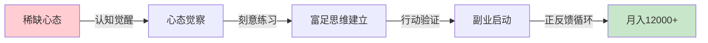
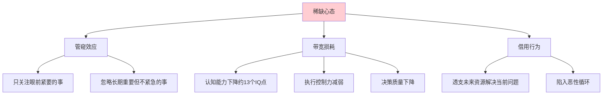
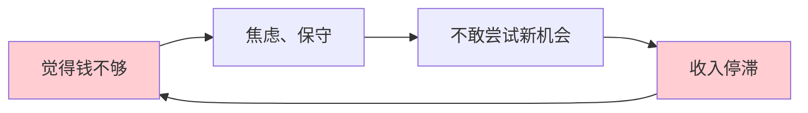
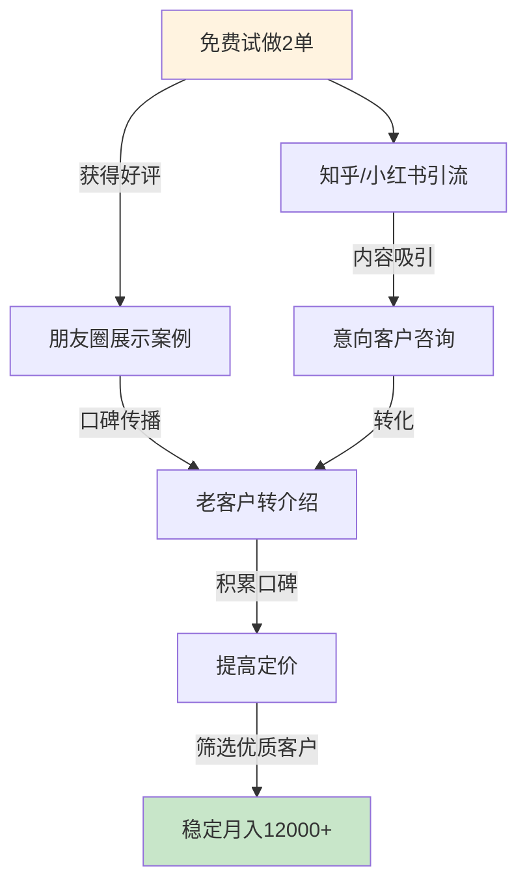
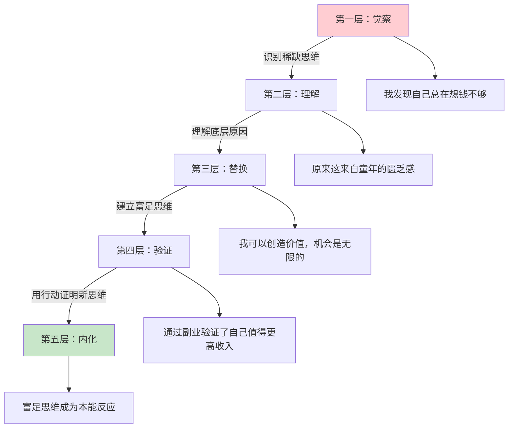
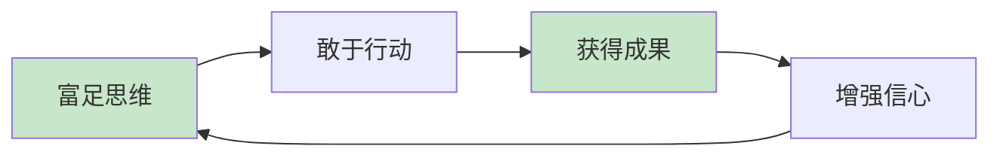
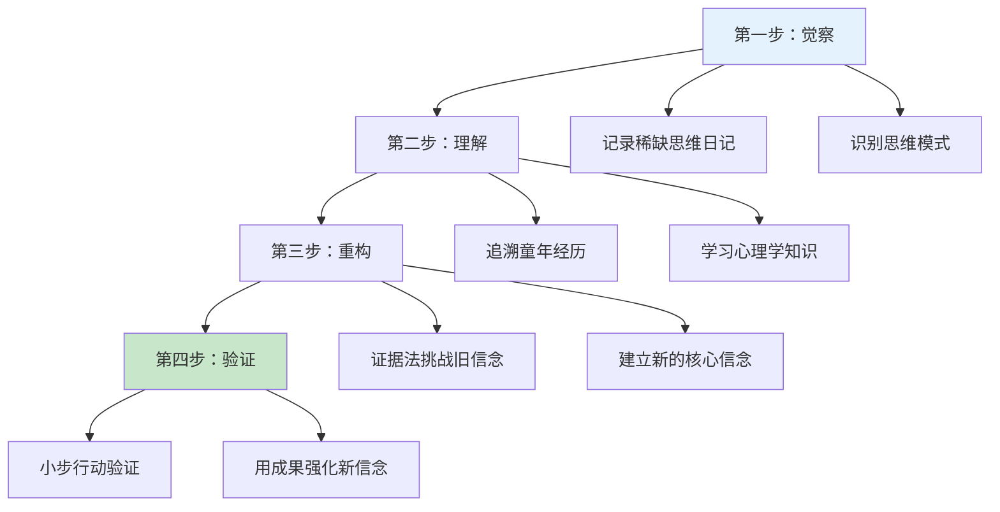

## 案例四：从稀缺心态到富足心态的李姐

### 案例概览

这是一个关于**心态跃迁**的真实案例。李姐的故事之所以深刻，是因为她揭示了一个被多数人忽视的真相：**限制一个人赚钱能力的，往往不是技能、资源或机会，而是底层心智模式**。她从"总觉得不够"的稀缺心态，转变为"我能创造价值"的富足心态，实现了副业月入从0到12,000+元的跨越。

与其他案例不同的是，李姐的核心突破不在于某个具体技巧，而在于**认知系统的底层重写**——她改变了大脑看待金钱、机会和自我价值的方式。



**案例核心数据一览：**

| 指标 | 转变前 | 转变后 | 变化幅度 |
|------|--------|--------|----------|
| 月收入（副业） | 0元 | 12,000元 | 从无到有 |
| 客户数量 | 0个 | 15个 | 从无到有 |
| 客户复购率 | 0% | 60% | 高黏性 |
| 副业投入时间 | 0小时/周 | 12小时/周 | 可持续节奏 |
| 时薪（副业） | 0元 | 约250元/小时 | 远超主业时薪 |
| 心理状态 | 焦虑、匮乏 | 从容、富足 | 根本性转变 |

---

### 第一部分：背景还原——李姐是谁？

#### 1.1 基本画像

李姐，35岁，坐标成都，某传统企业行政主管，工作十年。月薪8,500元（税后），丈夫月薪6,000元，家庭月收入约14,500元。有一个5岁的女儿，每月幼儿园费用3,000元。

从收入角度看，李姐的家庭在成都属于中等偏下水平。但真正困扰她的不是收入数字，而是一种**深入骨髓的匮乏感**——她总觉得钱不够用、机会不够多、自己不够好。

**李姐的财务状况：**

- **银行存款**：28,000元（多年的"应急金"，从不敢动）
- **信用卡**：无负债（极度厌恶借钱）
- **投资**：0（觉得"那是有钱人玩的"）
- **保险**：仅有社保
- **房贷**：月供3,200元（还有18年）

#### 1.2 稀缺心态的具体表现

李姐的"稀缺心态"不是简单的节俭或保守，而是一套**深层认知系统**，渗透到了生活的方方面面。以下是她的典型表现：

**金钱维度的稀缺思维：**

- 买菜时为了省2块钱，多走20分钟去更远的菜市场
- 孩子想报绘画班（200元/月），犹豫了三个月没报名，觉得"太贵了"
- 丈夫提议全家出游，她的第一反应是"要花多少钱"，而不是"能收获什么"
- 每次花钱都有负罪感，哪怕花的是合理支出
- 存折上的数字是她的"安全感来源"，看到数字减少就焦虑

**机会维度的稀缺思维：**

- 看到同事做微商赚了钱，想的是"万一赔了怎么办"
- 朋友邀请合伙开小店，她的反应是"我没钱投资"
- 公司内部竞聘管理岗，她觉得"肯定轮不到我"
- 看到免费的线上课程，第一反应是"学了也没用吧"

**自我价值维度的稀缺思维：**

- 觉得自己"没什么特长"，不配赚更多的钱
- 帮同事做了一件好事，别人感谢她，她说"举手之劳，不值一提"
- 从不敢主动要求加薪，觉得"能有这份工作就不错了"
- 做任何事情都先想"我不行"，而不是"我可以试试"

#### 1.3 稀缺心态的心理机制

心理学家Sendhil Mullainathan和Eldar Shafir在《稀缺》一书中揭示了稀缺心态的底层机制。李姐的表现完美印证了这一理论：



**管窥效应**：李姐的注意力被"省钱"这个隧道完全占据，看不到更广阔的可能性。她花了大量时间在"如何少花钱"上，却从未认真思考过"如何多赚钱"。

**带宽损耗**：持续的"钱不够"焦虑占据了她的心理带宽，导致她在做其他决策时（比如职业发展、技能学习）也无法全力以赴。研究表明，稀缺心态会让人的有效认知能力下降约13个IQ点——相当于一整晚没睡的水平。

**自我强化循环**：稀缺心态不是静态的，而是一个**自我强化的恶性循环**：



---

### 第二部分：转变过程——从觉醒到重构

#### 2.1 第一阶段：认知觉醒（第1-2个月）

**触发事件**

李姐的觉醒来自一次意外的对话。她的大学同学刘姐（同为宝妈）在同学聚会上分享了自己的经历：利用业余时间做线上家庭教育咨询，月收入稳定在15,000元以上。

李姐的第一反应是："你肯定有什么特殊资源。"但刘姐说了一句让她至今难忘的话：**"我没有特殊资源，我只是不再觉得自己不配拥有了。"**

这句话像一把钥匙，打开了李姐认知世界的另一扇门。她开始意识到，**自己之所以赚不到更多钱，不是因为没有能力，而是因为从来没有真正允许自己去赚**。

**第一周：自我觉察日记**

李姐开始记录自己的"稀缺思维时刻"。每天晚上花10分钟，记录当天出现的匮乏感和保守想法：

```text
记录模板：
日期：____
场景：____（发生了什么事）
想法：____（我脑海中冒出的第一个念头）
情绪：____（焦虑/恐惧/自卑/愧疚）
事实核查：____（这个想法有客观依据吗？最坏情况是什么？）
替代想法：____（如果用富足视角看，会怎么想？）
```

**第一个月的发现：**

李姐在30天内记录了87个"稀缺思维时刻"，分析后发现了三个核心模式：

| 稀缺思维模式 | 出现频次 | 典型触发场景 | 底层信念 |
|--------------|----------|--------------|----------|
| "我不配" | 32次（37%） | 看到好东西、遇到好机会 | 自我价值感低 |
| "万一失败" | 28次（32%） | 面对新尝试、风险决策 | 对不确定性的恐惧 |
| "钱会花完" | 27次（31%） | 任何花钱的场景 | 对匮乏的恐惧 |

**关键洞察**：李姐发现，她的稀缺思维有**70%来自童年经历**——父母在她成长过程中反复强调"咱家没钱"、"别乱花钱"、"能省就省"。这些信息在她幼年时期就写入了潜意识，成为她看待金钱的底层操作系统。

**第二周：学习稀缺与富足的理论框架**

李姐开始系统学习心态转变的相关知识，重点阅读了三本书：

| 书名 | 核心观点 | 对李姐的启发 |
|------|----------|--------------|
| 《稀缺》（Mullainathan & Shafir） | 稀缺会俘获注意力，降低决策能力 | 理解了自己为什么总做"短视"的决策 |
| 《终身成长》（Carol Dweck） | 成长型思维 vs 固定型思维 | "我不行"是固定型思维，"我可以学"是成长型思维 |
| 《富爸爸穷爸爸》（Robert Kiyosaki） | 资产与负债的区别，富人思维vs穷人思维 | "我买不起"→"我怎样才能买得起" |

#### 2.2 第二阶段：思维重构（第3-4个月）

李姐没有急于行动，而是花了两个月时间**重建自己的认知操作系统**。她把这个过程比喻为"给大脑重装系统"。

**核心转变一：从"我不配"到"我值得"**

李姐识别出自己最大的心理障碍是**低自我价值感**。她开始用"证据法"来对抗这个信念：

```text
练习方法：成就清单
步骤：
1. 列出你人生中所有值得骄傲的事情（无论大小）
2. 列出别人曾经夸奖过你的事情
3. 列出你帮助过别人的事情
4. 每天花5分钟阅读这个清单

李姐的清单（节选）：
- 大学期间获得过二等奖学金
- 工作中多次被评为"优秀员工"
- 独自带大女儿，孩子健康快乐
- 帮同事解决了多次工作难题
- 坚持记账三年，从未断过
- 会做20多道拿手菜
```

**核心转变二：从"万一失败"到"万一成功"**

李姐开始练习"可能性思维"——不再只关注最坏的结果，而是同时考虑最好的结果：

```text
旧思维模式：
看到机会 → 想到最坏结果 → 恐惧 → 放弃

新思维模式：
看到机会 → 评估最坏结果（能承受吗？）→ 评估最好结果 → 小步尝试
```

她给自己设定了一个规则：**在做任何决定之前，必须同时写出三个"万一成功"的场景**。比如：

- "万一我做副业成功了，每年能多赚14万，女儿的教育基金就有着落了"
- "万一我竞聘上了管理岗，不仅收入提升，职业发展空间也打开了"
- "万一我学会了投资，10年后的被动收入可能超过工资"

**核心转变三：从"钱会花完"到"钱能生钱"**

李姐开始理解"投资"和"消费"的区别。她做了一个关键练习：**把"花钱"重新分类**：

| 分类 | 定义 | 例子 | 心态转变 |
|------|------|------|----------|
| 消耗型支出 | 花了就没了 | 冲动购物、过度消费 | 需要减少 |
| 消费型支出 | 满足基本需求 | 房租、饮食、交通 | 合理即可 |
| 投资型支出 | 能带来未来回报 | 学习、健康、社交 | 应该增加 |
| 杠杆型支出 | 用小钱撬动大收益 | 工具、外包、平台 | 勇敢投入 |

这个分类让李姐意识到：**她一直以来把"投资型支出"和"消耗型支出"混为一谈了**。花钱学一门新技能不是"乱花钱"，而是"投资自己"；花钱买一个好工具不是"浪费"，而是"提高效率"。

#### 2.3 第三阶段：行动验证（第5-8个月）

心态转变后，李姐开始用行动来验证新的认知。她的策略是：**找到自己能提供的价值，用副业来"练习"富足心态**。

**第一步：分析自身技能和市场需求**

李姐做了一次全面的"技能盘点"：

```text
技能盘点模板：
我擅长什么？（技能）
- 行政管理（10年经验）
- Excel/Word/PowerPoint（熟练）
- 活动策划（公司年会、团建）
- 沟通协调（跨部门对接）
- 文案撰写（公文、通知、方案）

我热爱什么？（兴趣）
- 帮人解决问题
- 整理和规划
- 学习新知识

市场需要什么？（需求）
- 中小企业的行政外包需求
- 个人的时间管理和效率提升
- 职场新人的办公技能提升

三个圈的交集 = 最佳副业方向
```

**第二步：确定服务方向**

经过分析，李姐锁定了一个细分方向：**为中小微企业提供虚拟助理（VA）服务**，包括文档整理、会议纪要、活动策划、流程优化等。

选择这个方向的理由：
1. **低启动成本**：只需要电脑和网络，零投入
2. **技能匹配**：10年行政经验直接可用
3. **市场需求大**：大量小微企业需要行政支持但雇不起全职
4. **时间灵活**：可以在晚上和周末完成
5. **可规模化**：积累口碑后可以涨价、带团队

**第三步：建立个人品牌**

李姐没有一上来就去"找客户"，而是先花了一个月建立自己的专业形象：

| 动作 | 具体做法 | 效果 |
|------|----------|------|
| 打造微信朋友圈人设 | 每周分享2-3条职场效率/行政管理干货 | 3周后有人主动咨询 |
| 写作输出 | 在知乎、小红书发布"行政人的效率秘籍"系列文章 | 1个月积累500+关注 |
| 制作服务手册 | 详细列出服务内容、流程、价格、案例 | 提升专业感和信任度 |
| 免费试做 | 为2位朋友免费提供VA服务，换取真实评价和推荐 | 获得第一批口碑 |

**第四步：获取客户并优化服务**

李姐的获客路径：



**定价策略演变：**

| 阶段 | 时间 | 定价 | 客户数 | 月收入 | 策略 |
|------|------|------|--------|--------|------|
| 冷启动 | 第1-2个月 | 50元/小时 | 2个 | 约1,200元 | 低价获取第一批客户 |
| 验证期 | 第3-4个月 | 80元/小时 | 5个 | 约3,500元 | 提价测试市场接受度 |
| 增长期 | 第5-6个月 | 120元/小时 | 8个 | 约7,000元 | 通过案例和口碑支撑涨价 |
| 成熟期 | 第7个月起 | 150-200元/小时 | 15个 | 约12,000元 | 专注优质客户，提供深度服务 |

**客户管理的关键细节：**

李姐在服务过程中总结出了一套客户管理方法，这是她复购率达到60%的核心原因：

**服务标准化**：每位新客户第一次合作时，她都会花1小时做"需求深度访谈"，了解对方的工作习惯、偏好、痛点，然后制作一份《客户服务档案》。后续服务严格按照档案执行，确保一致性。

**超预期交付**：李姐给自己定了一条规矩——**每次交付都多做一点**。比如客户要求整理一份会议纪要，她不仅整理好内容，还会附上"行动事项清单"和"跟进时间表"。这个小小的额外动作，让客户感受到"物超所值"。

**定期回访**：每月主动联系客户一次，询问"最近有什么需要帮忙的吗"。不是推销，而是真诚的关心。这种主动姿态让客户感受到被重视，复购率自然提高。

---

### 第三部分：心态转变的深层机制

#### 3.1 从稀缺到富足的五层转变

李姐的转变不是一蹴而就的，而是经历了五个递进的层次：



**第一层：觉察**——能识别自己的稀缺思维模式。这是最难的一步，因为稀缺思维往往是无意识的。李姐通过"自我觉察日记"实现了这一步。

**第二层：理解**——理解稀缺思维的来源和机制。李姐通过阅读和反思，发现自己的匮乏感主要来自童年经历。

**第三层：替换**——用富足思维替代稀缺思维。李姐通过"证据法"、"可能性思维"和"支出重分类"等练习实现了这一步。

**第四层：验证**——用行动来验证新思维的正确性。李姐通过启动副业，用真实的收入增长证明了"我值得拥有更多"。

**第五层：内化**——富足思维成为本能反应，不再需要刻意练习。李姐在副业稳定后，发现自己面对机会时的第一反应从"万一失败"变成了"值得试试"。

#### 3.2 稀缺心态与富足心态的对照

以下是李姐转变前后的核心信念对照：

| 维度 | 稀缺心态（旧） | 富足心态（新） | 转变方法 |
|------|----------------|----------------|----------|
| 金钱观 | 钱是有限的，花完就没了 | 钱是流动的，可以通过创造价值获得 | 理解货币流通和价值创造原理 |
| 机会观 | 机会很少，错过了就没了 | 机会到处都有，关键在于识别和行动 | 记录身边的机会，小步尝试 |
| 自我认知 | 我没什么特别的 | 我有独特的价值 | 成就清单+他人反馈 |
| 风险观 | 风险=危险，必须避免 | 风险=不确定性，可以管理 | 设定"最坏情况"底线 |
| 时间观 | 只关注眼前 | 同时关注长期 | 设定3年愿景和年度目标 |
| 社交观 | 别人都比我强 | 每个人都有值得学习的地方 | 关注成长而非比较 |
| 消费观 | 花钱=消耗 | 花钱可能是投资 | 区分消耗型和投资型支出 |
| 失败观 | 失败=丢人 | 失败=数据点 | 记录每次失败的收获 |

#### 3.3 正反馈循环的建立

李姐转变过程中最关键的因素之一，是她成功建立了**正反馈循环**。这个循环让好的行为不断自我强化：



**循环的关键节点：**

- **起点**：用小行动验证新思维（免费试做VA服务）
- **催化剂**：第一次收到客户的好评和付费，打破了"我不配"的信念
- **加速器**：客户转介绍带来新客户，证明了"机会是自己创造的"
- **稳定器**：月收入稳定在12,000元以上，富足思维成为本能

---

### 第四部分：成果与数据分析

#### 4.1 副业收入数据

| 指标 | 起步时（第1月） | 成熟后（第8月起） | 变化 |
|------|-----------------|-------------------|------|
| 月副业收入 | 0元 | 12,000元 | 从无到有 |
| 客户数量 | 0个 | 15个 | 从无到有 |
| 客户复购率 | 0% | 60% | 高黏性 |
| 时薪（副业） | 50元 | 150-200元 | 3-4倍增长 |
| 每周投入时间 | — | 12小时 | 可持续 |
| 客户转介绍率 | 0% | 40% | 口碑驱动 |

#### 4.2 家庭财务变化

| 指标 | 转变前 | 转变后 | 变化幅度 |
|------|--------|--------|----------|
| 家庭月收入 | 14,500元 | 26,500元 | +83% |
| 月储蓄 | 约800元 | 约6,000元 | +650% |
| 储蓄率 | 5.5% | 22.6% | 质的提升 |
| 应急储备 | 28,000元 | 68,000元 | 安全垫增厚 |
| 投资资产 | 0元 | 35,000元 | 从无到有 |
| 年度可支配储蓄 | 约9,600元 | 约72,000元 | +650% |

#### 4.3 生活质量变化

| 方面 | 转变前 | 转变后 | 评价 |
|------|--------|--------|------|
| 心理状态 | 持续焦虑，总觉得不够 | 从容淡定，对未来有信心 | 根本性改善 |
| 亲子关系 | 因为"省钱"拒绝孩子的需求 | 能合理满足孩子的需求 | 显著改善 |
| 夫妻关系 | 因钱频繁争吵 | 共同规划，目标一致 | 显著改善 |
| 职业发展 | 不敢争取，原地踏步 | 主动竞聘，获得晋升 | 突破 |
| 社交圈 | 封闭、自卑 | 开放、自信 | 质的提升 |
| 自我认知 | "我是一个普通人" | "我是一个有价值的人" | 根本性转变 |

---

### 第五部分：自我诊断——你是否也有稀缺心态？

#### 5.1 稀缺心态自测表

请诚实地回答以下问题，每个"是"得1分：

| 序号 | 问题 | 是/否 |
|------|------|-------|
| 1 | 你是否经常觉得"钱不够用"，即使收入在增长？ | |
| 2 | 你是否花钱时总伴随负罪感，哪怕花的是合理支出？ | |
| 3 | 你是否看到别人赚钱时，第一反应是"我没有那个条件"？ | |
| 4 | 你是否面对新机会时，首先想到的是"万一失败"？ | |
| 5 | 你是否觉得"赚钱很难"，并且认为这是不可改变的事实？ | |
| 6 | 你是否不敢要求加薪或提高报价，觉得自己"不配"？ | |
| 7 | 你是否把大量时间花在"省钱"上，而很少思考"如何多赚钱"？ | |
| 8 | 你是否对投资有恐惧感，觉得"那是有钱人玩的"？ | |
| 9 | 你是否经常与他人比较，并因此感到焦虑或自卑？ | |
| 10 | 你是否很少为自己的成就感到骄傲，总是觉得"还不够好"？ | |

**评分解读：**

- 0-2分：富足心态主导，继续保持
- 3-5分：存在稀缺思维倾向，需要有意识地调整
- 6-8分：稀缺心态明显，建议系统性地进行心态重构
- 9-10分：严重稀缺心态，需要深入觉察和持续练习

#### 5.2 稀缺心态的隐藏信号

除了明显的"不敢花钱"和"总觉得不够"，稀缺心态还有一些**隐藏信号**，很多人意识不到自己有这些问题：

**过度囤积**：家里堆满了"可能有用"的东西，却从不舍得用。本质上是对"未来可能匮乏"的恐惧。

**拖延决策**：面对选择时反复犹豫，迟迟不做决定。本质上是害怕做出"错误"的选择导致损失。

**过度比较**：频繁查看别人的收入、消费、成就，并因此产生负面情绪。本质上是觉得自己"不如人"。

**拒绝求助**：遇到困难时不愿向他人求助，觉得"麻烦别人不好"。本质上是觉得自己"不值得被帮助"。

**自我设限**：在做任何事情之前，先给自己设定一个"天花板"。比如"我最多只能赚到这么多"。

---

### 第六部分：可复制的方法论

#### 6.1 稀缺→富足心态转变四步法



#### 6.2 核心练习工具

**工具一：稀缺思维觉察日记**

每天花10分钟记录一个"稀缺思维时刻"：

```text
日期：____
场景：____
自动想法：____（脑海中冒出的第一个念头）
情绪强度：____（1-10分）
事实核查：____
  - 这个想法有客观证据支持吗？
  - 最坏的情况是什么？我能承受吗？
  - 最好的情况是什么？
替代想法：____（用富足视角重新解读）
行动方案：____
```

**工具二：成就清单**

每周更新一次，记录你所有的成就、优点、他人的正面反馈。当稀缺思维出现时，打开清单阅读。

**工具三：可能性思维练习**

每次面对机会或决策时，强制写出三个"万一成功"的场景：

```text
机会/决策：____
万一成功场景1：____
万一成功场景2：____
万一成功场景3：____
最坏结果：____（我能承受吗？）
下一步行动：____
```

**工具四：支出重分类表**

每次花钱前，问自己这笔钱属于哪个类别：

| 类别 | 判断标准 | 处理方式 |
|------|----------|----------|
| 消耗型 | 花了就没了，没有长期价值 | 减少或避免 |
| 消费型 | 满足基本需求，维持生活 | 保持合理水平 |
| 投资型 | 能带来技能提升、健康改善、人脉拓展 | 勇敢投入 |
| 杠杆型 | 用小钱撬动大收益（工具、外包、平台） | 积极寻找机会 |

---

### 第七部分：常见陷阱与纠正

#### 陷阱一：以为心态转变就是"盲目乐观"

**错误表现**：读了几本正能量的书，就觉得自己"想通了"，不做任何实际行动。

**纠正方法**：心态转变必须用行动来验证。李姐的成功不是因为她"想通了"，而是因为她用副业的真实成果证明了新思维的正确性。没有行动支撑的心态转变，只是自我安慰。

#### 陷阱二：急于求成，期望一夜之间改变

**错误表现**：做了一周的觉察日记，觉得"我已经变了"，然后回到旧模式。

**纠正方法**：李姐花了4个月进行思维重构，又花了4个月用行动验证。心态转变是一个**渐进过程**，需要持续练习。大脑的神经通路是多年形成的，不会因为几周的练习就彻底改变。

#### 陷阱三：只有心态转变，没有技能提升

**错误表现**：觉得"只要心态好了，钱自然会来"，不去学习具体的赚钱技能。

**纠正方法**：心态是**必要条件**，不是**充分条件**。李姐在心态转变的同时，也在系统学习VA服务技能、客户沟通技巧、时间管理方法。富足心态让你敢于行动，但行动的质量取决于你的能力。

#### 陷阱四：忽视环境的影响

**错误表现**：独自进行心态转变，但周围的人都是稀缺思维，不断被拉回旧模式。

**纠正方法**：李姐的做法是——加入了一个"个人成长"社群，定期与志同道合的人交流。同时，她有意识地减少了与"负能量"朋友的接触。**你是你最常接触的5个人的平均值**，环境对心态的影响远超你的想象。

#### 陷阱五：把"富足心态"等同于"乱花钱"

**错误表现**：从极度节俭走向另一个极端，觉得"富足心态就是想花就花"。

**纠正方法**：富足心态不是挥霍，而是**对金钱有正确的认知**——它既是有限的（需要合理管理），也是可以通过创造价值来获取的（不必恐惧）。李姐在副业收入增长后，并没有增加消费，而是把多出的收入用于储蓄、投资和自我提升。

---

### 第八部分：进阶思考

#### 8.1 稀缺心态的代际传递

李姐在反思过程中发现，她的稀缺心态很大程度上来自父母。这种"代际传递"是稀缺心态最隐蔽的传播方式：

- 父母反复说"咱家没钱"→ 孩子内化"钱是稀缺的"
- 父母从不谈论投资 → 孩子认为"投资是有钱人的事"
- 父母把"省钱"作为美德 → 孩子把"花钱"等同于"罪恶"

**打破代际传递的方法**：

1. 觉察：识别哪些金钱观念来自父母
2. 评估：这些观念在当下还适用吗？
3. 选择：主动选择对你有利的观念
4. 行动：用新的方式与孩子谈论金钱

#### 8.2 从个人心态到团队文化

李姐在副业发展后期开始带小团队。她发现，稀缺心态不仅影响个人，也会影响团队：

- 团队成员不敢提新想法 → 创新停滞
- 团队成员害怕犯错 → 执行力下降
- 团队成员只关注成本 → 忽视价值创造

她开始有意识地在团队中营造富足文化：
- 鼓励试错，把失败当作学习
- 庆祝每一个小胜利
- 关注价值创造而非成本控制

#### 8.3 长期视角：从赚钱到创造价值

李姐最终领悟到，**真正的富足心态不是"我要赚更多钱"，而是"我能为更多人创造价值"**。当你的关注点从"获取"转向"给予"，金钱反而会自然流向你。

这是心态转变的最高境界——你不再被金钱驱动，而是被价值驱动。金钱只是你创造价值后的自然副产品。

---

> **本案例的核心启示**：限制你赚钱能力的，往往不是技能、资源或机会，而是你底层的心态操作系统。从稀缺到富足的转变，不是一句"想开点"就能做到的——它需要觉察、理解、重构、验证四个阶段的系统性工作。但一旦完成这个转变，你会发现一个全新的世界：机会到处都是，你值得拥有更多，而创造价值本身就是最大的回报。
