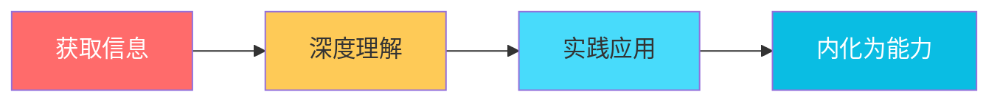
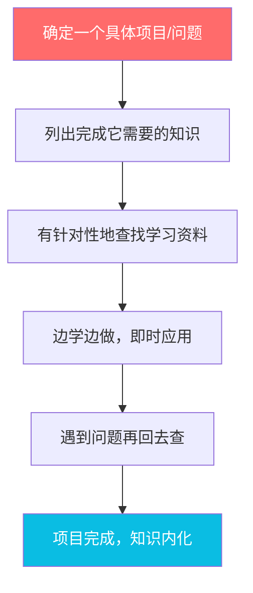
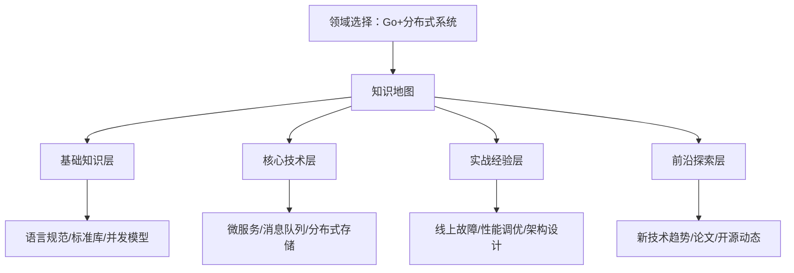

## 案例五：从信息焦虑到信息节食的程序员老刘

### 案例背景

老刘，32岁，杭州某互联网公司后端开发工程师，工作八年，月薪25K。按理说收入不低，但他有一个困扰已久的问题——**信息焦虑**。

每天早上睁眼第一件事是刷手机：技术博客、公众号推文、Twitter时间线、掘金热榜、Hacker News、知识星球、付费社群……他给自己定了一个信念："程序员必须终身学习，错过一条信息就可能错过一个风口。"这个信念让他每天花3-4小时在信息消费上，却几乎没有任何产出。

#### 老刘的典型一天

| 时间段 | 行为 | 耗时 | 实际收获 |
|--------|------|------|----------|
| 7:00-7:30 | 躺床上刷技术公众号 | 30min | 看了8篇文章标题，点开3篇，读完0篇 |
| 8:00-8:30 | 通勤听技术播客 | 30min | 听了个大概，下车就忘 |
| 12:00-12:40 | 午休刷掘金/知乎 | 40min | 收藏了5篇"稍后阅读"（永远不会读） |
| 18:30-19:00 | 通勤刷Twitter/即刻 | 30min | 焦虑感+1，觉得自己又落后了 |
| 21:00-23:00 | 知识星球/付费社群/课程 | 120min | 笔记记了一堆，从未回顾 |
| **合计** | | **4小时/天** | **零输出，零实践** |

#### 焦虑的具体表现

老刘的焦虑不是抽象的，它有非常具体的症状：

- **收藏癖**：微信收藏夹里有2000+篇文章，浏览器书签栏密密麻麻，Notion里建了十几个"待学习"数据库，全部处于积灰状态
- **FOMO发作**：看到同事在群里讨论某个新框架，立刻放下手头工作去查资料，生怕自己"落伍"
- **学习幻觉**：觉得"看了就是学了"，用信息消费的快感替代了动手实践的痛苦
- **选择瘫痪**：想学的东西太多（Rust、Go、K8s、AI、区块链），每个都浅尝辄止，没有一个精通
- **社交比较**：看到别人在技术社区发文章、做开源项目，既羡慕又自卑，觉得自己"什么都没做出来"

#### 触发改变的事件

2024年3月，公司进行了一轮技术评估。老刘惊讶地发现，自己虽然"什么都了解一点"，但在深度技术面试中表现平平。反而是平时不怎么刷社交媒体、只专注写代码的同事小张，因为在某个开源项目上有深入贡献，被晋升为技术专家。

这个结果像一盆冷水浇在老刘头上：**他花了大量时间获取信息，却在真正有价值的事情上毫无积累。**

### 问题诊断：信息焦虑的根因分析

老刘决定认真分析自己的问题。他用了一周时间，用RescueTime追踪自己的屏幕时间，用Notion记录每次"想刷手机"的触发场景。最终，他识别出了四个核心问题：

#### 根因一：输入输出比严重失衡

老刘计算了自己的"信息转化率"：

- 每天信息消费时间：4小时
- 每天输出/实践时间：接近0
- 每月信息消费时间：约120小时
- 每月产出（代码/文章/项目）：几乎为零

他意识到一个残酷的事实：**信息只有被转化为行动才有价值。** 看100篇关于微服务架构的文章，不如自己动手把一个单体应用拆成微服务。收藏1000篇技术干货，不如写一篇自己的技术总结。

#### 根因二：缺乏信息筛选标准

老刘没有一套判断"这条信息值不值得我花时间"的标准。他用的策略是"全盘接收"——看到技术相关内容就收藏、就阅读，从不问自己三个关键问题：

1. 这条信息和我当前的工作/项目有直接关系吗？
2. 我会在未来30天内用到这个知识吗？
3. 如果不看这条信息，最坏的结果是什么？

绝大多数情况下，答案都是"没有直接关系""用不到""没什么坏结果"。

#### 根因三：把"获取信息"当成"自我提升"

这是一个极其普遍的认知陷阱。老刘用信息消费制造了一种"我在学习"的幻觉。但真正的学习需要三个环节：



老刘只做了第一步（获取信息），后面的深度理解、实践应用、内化能力全部缺失。这就像一个人每天去健身房看别人训练，自己却从不上器械——他永远不会长肌肉。

#### 根因四：环境设计失败

老刘的数字环境充满了"触发器"：

- 手机首页放了20多个App，全是信息源
- 微信置顶了15个技术群，消息不断
- 浏览器默认打开页是掘金热榜
- 开着十几个技术社区的通知推送

每一条推送、每一个红点、每一条消息，都在争夺他的注意力。他不是在主动选择看什么，而是被环境推着走。

### 执行过程：信息节食四阶段改造

老刘没有一步到位，而是分四个阶段，用八周时间完成了改造。

#### 第一阶段：信息断舍离（第1-2周）

**核心动作：清理信息源，从"多多益善"到"少而精"。**

**Step 1：列出所有信息源**

老刘花了两个小时，把自己所有的信息源列了一个清单：

| 类别 | 信息源数量 | 具体内容 |
|------|-----------|----------|
| 微信公众号 | 87个 | 技术类42个、行业类25个、个人成长类20个 |
| 技术社区 | 6个 | 掘金、知乎、V2EX、SegmentFault、CSDN、思否 |
| 社交媒体 | 4个 | Twitter、即刻、微博、LinkedIn |
| 付费社群 | 5个 | 知识星球3个、付费Discord 2个 |
| RSS订阅 | 34个 | 通过Inoreader订阅的技术博客 |
| 播客 | 8个 | 技术类5个、商业类3个 |
| 课程平台 | 3个 | 极客时间、拉勾教育、Udemy |
| **合计** | **147个** | |

**Step 2：用"三问筛选法"逐一评估**

对每个信息源，问三个问题：
- 过去30天我从这里获取了什么有价值的信息？（如果没有，删除）
- 这个信息源的内容是否可以被其他源替代？（如果是，保留更好的那个）
- 这个信息源是否和我当前的核心目标直接相关？（如果不是，删除或降级）

**Step 3：执行清理**

| 类别 | 清理前 | 清理后 | 操作 |
|------|--------|--------|------|
| 微信公众号 | 87个 | 12个 | 取消关注75个，仅保留技术深度内容+核心领域 |
| 技术社区 | 6个 | 2个 | 保留掘金（有实战内容）和V2EX（行业动态） |
| 社交媒体 | 4个 | 1个 | 仅保留Twitter（国际技术前沿） |
| 付费社群 | 5个 | 1个 | 保留最活跃、质量最高的1个知识星球 |
| RSS订阅 | 34个 | 8个 | 只保留每周产出高质量内容的博客 |
| 播客 | 8个 | 2个 | 保留1个技术深度访谈+1个商业思维 |
| 课程平台 | 3个 | 1个 | 保留极客时间，其他不再续费 |

**147个信息源缩减到27个，减少82%。**

老刘的感受："清理完的第一天，手机突然变得很安静。我有点不习惯，但奇怪的是，并没有觉得'错过了什么'。那些我取关的公众号，我甚至想不起来它们发过什么内容。"

#### 第二阶段：建立信息摄入规则（第3-4周）

**核心动作：从"随时可看"到"定时定点"。**

老刘制定了严格的"信息摄入时间表"：

```text
┌─────────────────────────────────────────────────┐
│           老刘的信息节食时间表                      │
├──────────┬──────────────────────────────────────┤
│ 7:00-7:15 │ 晨间信息扫描（仅看标题，标记1-2篇）     │
│ 12:30-13:00│ 午间深度阅读（精读标记的文章）          │
│ 21:00-21:30│ 晚间输出时间（写笔记/代码/文章）       │
│ 其他时间   │ 关闭所有信息源通知                      │
├──────────┴──────────────────────────────────────┤
│ 每日信息摄入上限：45分钟                           │
│ 每日输出/实践时间：30分钟（最低）                   │
└─────────────────────────────────────────────────┘
```

**关键规则：**

1. **48小时规则**：看到任何文章/教程，先标记。如果48小时后还想看，再看。大多数情况下，冲动会过去。
2. **输入输出1:1规则**：每花1小时消费信息，必须花至少1小时输出（写笔记、写代码、写文章）。
3. **即时应用规则**：学到一个新技术/方法，必须在48小时内找到一个场景去实践，否则这条信息就是无效消费。
4. **深度优于广度规则**：同一主题只看1-2篇最权威的内容，而不是收集10篇浅尝辄止的文章。

**技术手段辅助执行：**

```bash
# 用浏览器插件BlockSite在工作时间屏蔽信息源
# 屏蔽列表：juejin.cn, v2ex.com, twitter.com, zhihu.com
# 允许时间段：12:30-13:00, 21:00-21:30

# 用手机"屏幕使用时间"设置每日上限
# 微信：30分钟
# 掘金：15分钟
# Twitter：15分钟
# 超出后需要输入密码才能继续（密码让老婆设，自己不知道）
```

老刘把手机的"屏幕使用时间"密码交给了妻子，这意味着他无法在达到上限后自行解锁。这个"承诺装置"非常关键——光靠意志力是不够的，必须用环境设计来约束自己。

#### 第三阶段：从消费者到生产者（第5-6周）

**核心动作：把省下来的时间用于输出和实践。**

老刘在第二阶段省出了每天约3小时的时间。他没有把这些时间用来加班或打游戏，而是全部投入到"生产"中：

**输出渠道一：技术博客**

老刘开始在掘金上写技术文章。他的写作策略很聪明——不写"XX入门教程"（这类内容已经饱和），而是写自己在工作中遇到的真实问题和解决方案：

- 《我们是如何把MySQL慢查询从200ms优化到5ms的》
- 《一次线上OOM排查实录：从GC日志到堆内存分析》
- 《为什么我放弃了微服务，又回到了单体》

这些文章因为有真实场景、具体数据、踩坑经验，在掘金上获得了不错的阅读量。第一篇文章就有3000+阅读、50+收藏。

**输出渠道二：开源工具**

老刘把自己工作中写的几个小工具整理成了开源项目：

- 一个Go语言的轻量级限流库（200行代码）
- 一个CLI工具，用于批量重命名文件
- 一个VSCode插件，自动格式化SQL语句

这些项目虽然star数不多（分别是120、45、230），但每一个都是他真实需求驱动的产物，代码质量远高于"造轮子练手"项目。

**输出渠道三：内部分享**

老刘在公司内部做了一次技术分享，主题是《信息节食：程序员如何管理知识输入》，反响出乎意料地好。CTO当场邀请他做技术委员会的定期分享人。

#### 第四阶段：建立反馈循环（第7-8周）

**核心动作：用数据驱动优化，而不是凭感觉。**

老刘建了一个简单的Excel表，每周日晚上花15分钟填写：

| 指标 | 第1周 | 第4周 | 第8周 |
|------|-------|-------|-------|
| 每日信息消费时间 | 4h | 45min | 30min |
| 每日输出/实践时间 | 0 | 30min | 60min |
| 技术文章发布数 | 0 | 2篇 | 4篇 |
| GitHub提交数 | 0 | 15次 | 35次 |
| 收藏夹待读文章数 | 2000+ | 120 | 30 |
| 焦虑感自评(1-10) | 9 | 5 | 2 |
| 技术深度自评(1-10) | 4 | 6 | 7 |

他还养成了一个习惯：每周回顾时问自己——

- 这周我学到了什么？（必须能用一句话说清楚）
- 这周我做出了什么？（必须有可交付的成果）
- 这周有没有"假学习"的时刻？（有没有用信息消费逃避真正的工作）

### 成果数据

经过8周的信息节食改造，老刘的各项指标发生了显著变化：

| 指标 | 改造前 | 改造后(8周) | 变化幅度 |
|------|--------|-------------|----------|
| 每日信息消费时间 | 4小时 | 30分钟 | **-87.5%** |
| 每日输出/实践时间 | 0 | 60分钟 | **从0到1** |
| 月度技术文章产出 | 0篇 | 4篇 | **从0到4** |
| GitHub年度贡献 | 12次 | 380次 | **+3067%** |
| 收藏夹未读文章 | 2000+ | 30 | **-98.5%** |
| 技术社区粉丝 | 0 | 850 | **自然增长** |
| 焦虑感自评(1-10) | 9 | 2 | **-78%** |
| 睡眠质量自评(1-10) | 4 | 8 | **+100%** |

#### 职业层面的连锁反应

信息节食带来的改变远不止"省了时间"。更深层的影响是：

- **技术深度提升**：因为不再追求"什么都知道"，老刘在Go语言和分布式系统这两个方向上深入钻研，成为团队里这两个领域的go-to person
- **个人品牌建立**：持续的技术文章输出让他在掘金上积累了850粉丝，有猎头主动联系他
- **副业收入**：他开始接一些技术咨询的私活，利用在文章中展示的专业能力获客，月均增加收入3000-5000元
- **晋升加薪**：年底技术评估中，老刘因为开源项目贡献和内部技术影响力，成功晋升为高级工程师，薪资涨了30%

### 方法论提炼：信息节食的五条铁律

老刘把自己的经验总结成了五条可复用的铁律，每一条都来自他的真实踩坑：

#### 铁律一：收藏不等于学习

> "你的收藏夹不是你的知识库，它是你的焦虑清单。"

每次你想收藏一篇文章时，问自己：我是因为"这篇文章真的很有用，我马上要用"，还是因为"不收藏就感觉错过了什么"？如果是后者，关掉它。你不会错过什么的——99%的信息，3天后就没人记得了。

实操建议：每周清理一次收藏夹，超过7天没看的直接删除。如果真的重要，它会再次出现在你面前。

#### 铁律二：输出倒逼输入

不要先学再做，而是先做再学。当你有一个具体的项目要完成时，你的学习会变得极其高效——你知道自己需要什么，能快速筛选出相关信息，学完立刻用上。



#### 铁律三：深度优于广度

在信息爆炸的时代，"什么都知道一点"的人一文不值——AI可以做得比他们好100倍。真正稀缺的是"在某个方向上比99%的人懂得更深"的人。

老刘的选择是：Go语言 + 分布式系统。他不再泛泛地看"技术资讯"，而是：
- 只读这两个方向的经典书籍和高质量论文
- 只关注这两个方向的顶级贡献者
- 只参与这两个方向的技术讨论
- 只做这两个方向的实践项目

#### 铁律四：设置"承诺装置"

人的意志力是有限资源，不要和它对抗。用技术手段和外部约束来保证执行：

| 承诺装置 | 具体做法 | 原理 |
|----------|----------|------|
| 时间锁 | 手机屏幕使用时间+密码交给家人 | 物理隔离，无法自行破解 |
| 环境改造 | 工作时手机放另一个房间 | 消除触发源 |
| 社交承诺 | 在朋友圈宣布"每周发一篇技术文章" | 利用社交压力 |
| 财务承诺 | 预付一年的技术写作平台会员 | 沉没成本驱动 |
| 固定流程 | 每天早上第一件事是写代码，不是刷手机 | 用习惯替代意志力 |

#### 铁律五：定期复盘，用数据说话

不要凭感觉判断自己的信息消费是否健康。用工具追踪数据，每周复盘：

```text
每周复盘清单（周日晚上15分钟）：
□ RescueTime显示的"分心时间"是多少？目标：<1小时/天
□ 本周发布了多少内容？目标：至少1篇
□ 本周学到了什么新技能？目标：能用一句话说清楚
□ 本周有没有"假学习"的时刻？记录并反思
□ 下周要聚焦的核心任务是什么？只写1个
```

### 常见误区与纠正

在信息节食的实践中，很多人会踩进以下误区：

#### 误区一：把"信息节食"理解为"不学习"

信息节食不是拒绝学习，而是拒绝**低效的信息消费**。区别在于：

| | 信息消费（要戒掉的） | 有效学习（要保留的） |
|--|----------------------|----------------------|
| 目的 | 消遣、缓解焦虑 | 解决具体问题 |
| 方式 | 被动浏览、碎片化阅读 | 主动搜索、系统化学习 |
| 产出 | 收藏、转发、"学到了" | 代码、文章、项目成果 |
| 记忆 | 3天后遗忘90% | 内化为长期技能 |
| 时间 | 随时随地、无上限 | 定时定点、有上限 |

#### 误区二：第一天就砍掉所有信息源

老刘见过有人在读了"信息节食"的文章后，当天就取关了所有公众号、退出了所有群。三天后焦虑反弹，又全部加回来，甚至比之前更焦虑。

正确做法是渐进式减少：第一周砍掉50%，第二周再砍50%，第三周根据实际感受微调。给自己一个适应期。

#### 误区三：只减少输入，不增加输出

如果你省下来的时间只是用来刷短视频、打游戏、发呆，那信息节食就变成了信息戒断，同样没有意义。省下来的时间必须投入到输出和实践上——哪怕每天只有30分钟。

#### 误区四：追求完美的信息过滤系统

有些人花了大量时间搭建"完美的信息管理系统"——Notion数据库、Obsidian知识图谱、Readwise同步、标签分类体系……折腾工具本身变成了新的信息消费陷阱。

老刘的建议：工具越简单越好。他的整个系统就是：浏览器书签（暂存）→ 每周清理 → 飞书文档（输出）。没有复杂的分类，没有精美的模板，只有"输入-处理-输出"三个环节。

### 进阶指南：从信息节食到知识管理

当信息节食成为习惯后，老刘开始向更高级的知识管理演进：

#### 构建个人知识体系



每个层次都有明确的学习目标和产出要求：
- **基础知识**：能通过代码演示核心概念（产出：技术博客）
- **核心技术**：能在实际项目中使用（产出：开源项目/工作成果）
- **实战经验**：能总结方法论并传授他人（产出：技术分享/培训）
- **前沿探索**：能判断技术趋势并做出取舍（产出：技术决策文档）

#### 建立"T型能力结构"

在信息节食的基础上，老刘刻意构建了"T型能力结构"：

- **横向**（广度）：对相关领域保持基本了解，但不深入——通过每周30分钟的"行业扫描"完成
- **纵向**（深度）：在核心领域持续深挖——通过每日60分钟的"深度工作"完成

这种结构让他既不会成为"只会一样"的窄才，也不会成为"什么都会一点"的万金油。

#### 教是最好的学

老刘发现，把自己学到的东西教给别人，是最高效的学习方式。他通过三个渠道"教"：

1. **技术博客**：把复杂的技术概念用通俗的语言解释清楚
2. **内部培训**：在公司内部做技术分享，接受同事的提问和挑战
3. **一对一辅导**：带新人，在教的过程中发现自己知识的盲区

### 总结：信息节食的核心公式

老刘的故事告诉我们一个简单但深刻的道理：

```text
知识积累 = (有效输入 - 信息噪音) × 实践转化率
```

不是信息越多越好，而是有效信息×转化率越高越好。一个每天只花30分钟看高质量内容、但花60分钟写代码的人，比一个每天花4小时看各种"干货"但从不动手的人，成长速度快10倍以上。

信息节食的本质，是把"我什么都要知道"的恐惧，转化为"我只需要在关键领域比大多数人懂得更深"的专注。这种专注不仅降低了焦虑，还带来了实际的产出——技术文章、开源项目、职业晋升、副业收入。

老刘现在常说的一句话是："**我不是学得少了，我是学得对了。**"
