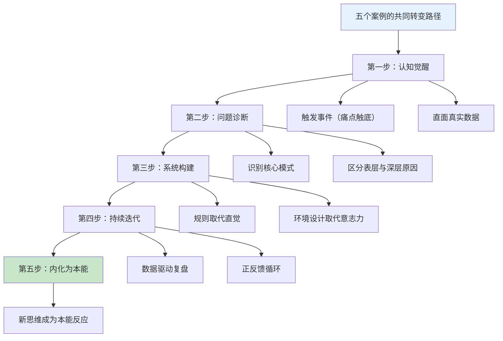
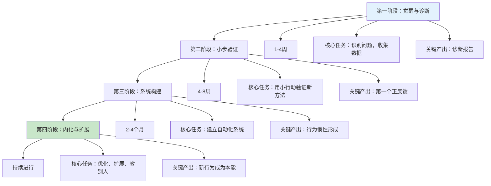
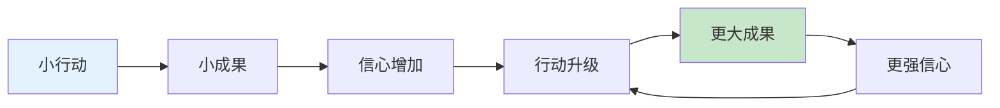
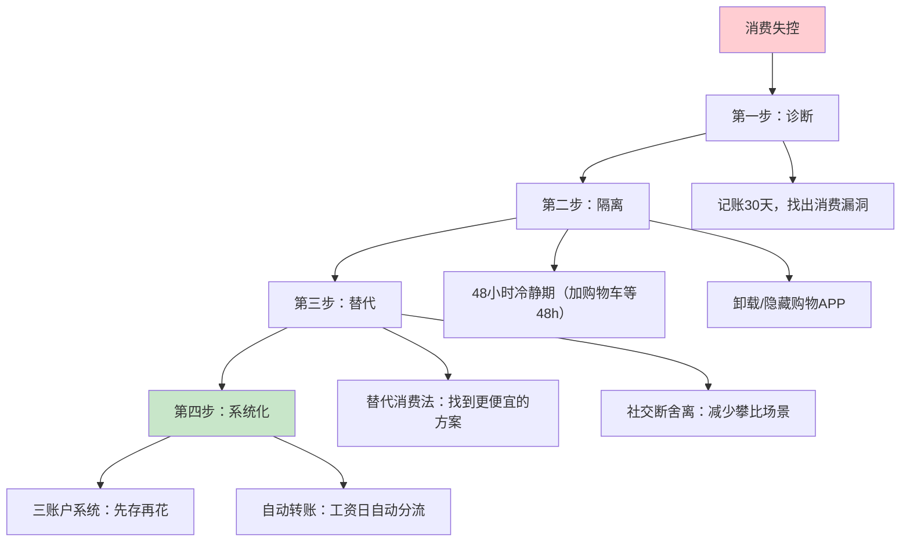
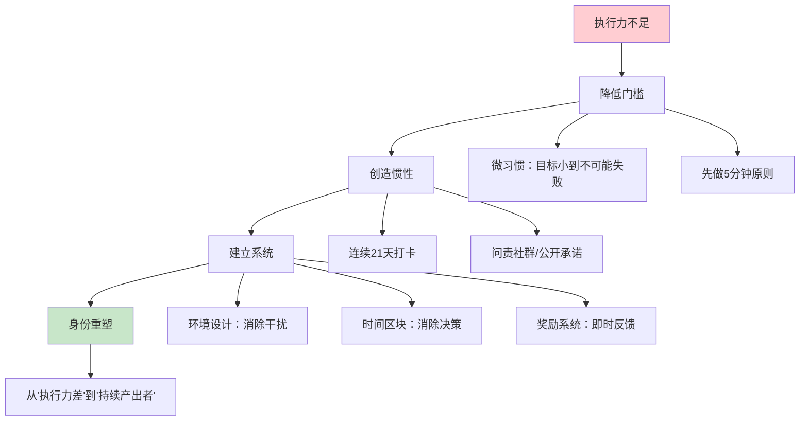
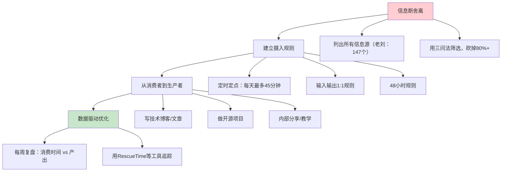

## 从这些案例中我们可以学到什么

五个真实案例，五种不同的起点，五条看似迥异的转变路径——但当你把它们放在一起审视时，会发现一些极其深刻的共性规律。这一节不是简单地"总结经验"，而是要**提炼出一套可复制的底层操作系统**，让你无论面对什么样的心态和习惯问题，都能找到对应的解决框架。

### 五个案例的核心数据对比

先把五个案例的关键数据摆出来，形成一个全景式的对比：

| 维度 | 小王（消费习惯） | 老张（投资心理） | 小陈（执行力） | 李姐（心态跃迁） | 老刘（信息管理） |
|------|-----------------|-----------------|---------------|-----------------|-----------------|
| 年龄 | 28岁 | 35岁 | 29岁 | 35岁 | 32岁 |
| 坐标 | 深圳 | 上海 | 杭州 | 成都 | 杭州 |
| 转变前收入 | 2.5万/月 | 50万/年 | 1.5万/月 | 0.85万/月 | 2.5万/月 |
| 核心问题 | 月光、冲动消费 | 情绪化投资 | 拖延、不行动 | 稀缺心态 | 信息焦虑 |
| 转变耗时 | 6个月 | 4个月 | 12个月 | 8个月 | 8周 |
| 转变后成果 | 储蓄率51.2% | 年化收益12% | 副业月入1.2万 | 副业月入1.2万 | 产出从0到持续 |
| 最大单点突破 | 48冷静期 | 情绪检查表 | 微习惯100字 | 成就清单 | 147→27信息源 |



---

### 第一部分：五个案例揭示的六条底层规律

#### 规律一：转变的起点永远是"痛到不得不变"

五个案例有一个惊人的共同点：**没有人是在"感觉良好"的时候开始改变的**。

| 案例 | 触发事件 | 痛苦程度 |
|------|----------|----------|
| 小王 | 发现三年90万收入只剩3200元 | 财务触底 |
| 老张 | 妻子大吵+体检异常 | 家庭+健康双重危机 |
| 小陈 | 算总账发现235小时零产出 | 时间触底 |
| 李姐 | 同学刘姐的一句话"我不再觉得自己不配" | 认知冲击 |
| 老刘 | 技术评估输给只写代码的同事 | 职业危机 |

这不是巧合，而是有深层的行为科学依据。心理学家罗伯特·凯根（Robert Kegan）的"变革免疫"理论指出：人之所以抗拒改变，是因为**当前行为模式背后有一个隐藏的"好处"**。小王的冲动消费在提供即时多巴胺，老张的频繁交易在提供控制感，小陈的拖延在保护他免于失败的评价，李姐的保守在提供安全感，老刘的信息囤积在制造"我在学习"的幻觉。

只有当痛苦大到足以压过这些隐藏好处时，转变才可能发生。

**这给我们的启示是：**

1. **不要等到"准备好"才开始**——你永远不会准备好。真正的准备是让自己"痛"到无法继续现状。如果你还没有这种痛感，就主动去制造它：算一算你的财务总账，统计一下你的时间投入产出比，对比一下你和同龄人的差距。
2. **记录你的"痛感日记"**——当不适感出现时，不要逃避它，而是把它记录下来。这些记录将成为你未来坚持改变时最有力的"燃料"。
3. **"算总账"是最有效的觉醒工具**——小王算了三年90万的账，小陈算了235小时的账。具体的数字比抽象的"我要改变"有力一万倍。

#### 规律二：所有问题的根源都在"系统"，不在"个体"

五个案例的主人公在转变前，都把问题归因于自己："我意志力不行"（小王）、"我运气不好"（老张）、"我就是执行力差"（小陈）、"我不配拥有更多"（李姐）、"我学得不够多"（老刘）。

但转变后的复盘都指向同一个结论：**问题不在于"你是谁"，而在于"你所处的系统是什么样的"**。

```mermaid
graph LR
    subgraph 旧系统（问题系统）
        A1[无预算 → 随意消费]
        A2[无纪律 → 情绪化交易]
        A3[无微习惯 → 拖延循环]
        A4[无觉察 → 稀缺思维自循环]
        A5[无筛选 → 信息过载]
    end
    
    subgraph 新系统（解决方案）
        B1[三账户系统 → 自动化储蓄]
        B2[纪律清单 → 规则取代直觉]
        B3[微习惯+问责 → 行为惯性]
        B4[觉察日记+证据法 → 思维重构]
        B5[信息节食+输出倒逼 → 知识内化]
    end
    
    A1 -->|系统升级| B1
    A2 -->|系统升级| B2
    A3 -->|系统升级| B3
    A4 -->|系统升级| B4
    A5 -->|系统升级| B5
    
    style A1 fill:#ffcdd2
    style A2 fill:#ffcdd2
    style A3 fill:#ffcdd2
    style A4 fill:#ffcdd2
    style A5 fill:#ffcdd2
    style B1 fill:#c8e6c9
    style B2 fill:#c8e6c9
    style B3 fill:#c8e6c9
    style B4 fill:#c8e6c9
    style B5 fill:#c8e6c9
```

五个案例的具体"系统升级"对照：

| 案例 | 旧系统（靠意志力） | 新系统（靠机制） | 核心转变 |
|------|-------------------|-----------------|----------|
| 小王 | "我要少花钱" | 工资到账自动分流到三个账户 | 从"先花再存"到"先存再花" |
| 老张 | "我要控制情绪" | 情绪检查表+交易纪律清单 | 从"凭感觉"到"凭规则" |
| 小陈 | "我要更努力" | 微习惯（100字/天）+问责群 | 从"宏大目标"到"不可能失败的行动" |
| 李姐 | "我要自信一点" | 稀缺思维觉察日记+成就清单 | 从"无意识反应"到"有意识觉察" |
| 老刘 | "我要多学习" | 147→27信息源+45分钟上限 | 从"被动接收"到"主动筛选" |

**这给我们的启示是：**

1. **停止用"意志力"解决问题**——意志力是有限资源，用完就没了。真正的解决方案是设计一套系统，让正确的行为变成默认行为。
2. **把"我要XXX"变成"系统自动帮我XXX"**——小王的自动转账、老张的纪律清单、小陈的微习惯、李姐的觉察日记、老刘的屏幕时间密码，都是"系统代替意志力"的典范。
3. **环境设计比自我约束有效100倍**——老刘把手机密码交给妻子，小陈把手机放到另一个房间，老张把投资APP从主屏移走。不要相信"我能忍住"，要让诱惑在物理上不可达。

#### 规律三：认知觉醒必须转化为具体行动，否则只是"精神按摩"

五个案例中，每个人都在转变初期经历了"认知觉醒"——突然明白了某个道理。但觉醒本身毫无价值，**有价值的是觉醒之后采取的具体行动**。

小王的觉醒是"我三年花了90万"，但让他真正改变的是接下来做的第一件事：连续记账30天。老张的觉醒是"我的投资行为和赌博成瘾一样"，但让他真正改变的是写第一份情绪检查表。小陈的觉醒是"235小时零产出"，但让他真正改变的是写下第一个100字。李姐的觉醒是"我不再觉得自己不配"，但让她真正改变的是做第一次免费VA服务。老刘的觉醒是"我在假学习"，但让他真正改变的是删掉第75个公众号。

**"知道"和"做到"之间的鸿沟，只能用"第一个小行动"来填平。**

五个案例的"第一个行动"对比：

| 案例 | 认知觉醒 | 第一个具体行动 | 行动的巧妙之处 |
|------|----------|--------------|--------------|
| 小王 | "我花了太多钱" | 下载记账APP，只记不改 | 降低心理阻力，先观察再行动 |
| 老张 | "我在赌博不是投资" | 填写情绪检查表 | 把无意识情绪变成可量化数据 |
| 小陈 | "我在假勤奋" | 每天写100字 | 门槛低到不可能失败 |
| 李姐 | "我配得上更多" | 记录稀缺思维日记 | 先觉察，不急着改变 |
| 老刘 | "我在假学习" | 列出147个信息源清单 | 用数据制造冲击感 |

**这给我们的启示是：**

1. **觉醒后24小时内必须做一个小行动**——哪怕只是写一行字、开一个记账APP、列一个清单。不行动的觉醒会像烟花一样转瞬即逝。
2. **第一个行动要足够小**——小到"不可能失败"。小陈的100字、小王的"只记不改"、李姐的"只观察不改变"，都是这个原则的体现。
3. **先观察再改变，先诊断再治疗**——小王第一个月只记账不改变，李姐前两周只记录不纠正，老刘第一周只列清单不删除。这种"先了解现状"的做法，能让你的后续行动更有针对性。

#### 规律四：转变不是一个事件，而是一个有明确阶段的进程

五个案例都不是"一步到位"的，而是经历了清晰的阶段递进。将它们的时间线叠加，可以提炼出一个通用的"转变四阶段模型"：



五个案例的阶段耗时对比：

| 阶段 | 小王 | 老张 | 小陈 | 李姐 | 老刘 |
|------|------|------|------|------|------|
| 觉醒与诊断 | 1个月 | 2周 | 2周 | 2个月 | 1周 |
| 小步验证 | 2个月 | 4周 | 4周 | 2个月 | 2周 |
| 系统构建 | 3个月 | 2个月 | 8个月 | 2个月 | 4周 |
| 内化与扩展 | 持续 | 持续 | 持续 | 持续 | 持续 |
| **总关键转变期** | **6个月** | **4个月** | **12个月** | **8个月** | **8周** |

**不同案例耗时不同的原因：**

- **老刘（8周最快）**：信息节食是"减法"——删掉多余的东西比建立新东西快得多。而且技术手段（屏幕时间密码）可以立即生效。
- **小陈（12个月最慢）**：拖延症涉及深层心理机制（完美主义、习得性无助、恐惧评价），改变认知模式需要更长时间。加上副业从0到1.2万需要内容积累。
- **老张（4个月）**：投资纪律可以通过外部规则快速建立，但心态内化花了更长时间。
- **小王和李姐（6-8个月）**：消费习惯和心态跃迁都需要反复的"觉察→行动→验证"循环。

**这给我们的启示是：**

1. **不要期待一蹴而就**——转变需要时间，而且不同类型的转变需要的时间不同。消费习惯可以在6个月内改变，但深层心理模式可能需要1-2年。
2. **每个阶段有明确的核心任务**——不要在觉醒阶段就开始建系统，也不要在系统构建阶段还停留在诊断。每个阶段做每个阶段该做的事。
3. **"减法型"转变比"加法型"转变更快**——删掉坏习惯（信息节食、减少冲动消费）比建立新习惯（写文章、做副业）见效更快。如果你同时面临多个问题，优先做减法。

#### 规律五：正反馈循环是持续改变的唯一燃料

五个案例中，**每一个成功转变的关键转折点都不是"更大的决心"，而是"第一个正反馈"**。

| 案例 | 第一个正反馈 | 反馈带来的心态变化 |
|------|------------|-------------------|
| 小王 | 第一个月底看到存款增长 | "原来存钱没那么痛苦，还有成就感" |
| 老张 | 忍住不操作，月底反而少亏 | "不操作比频繁操作收益更高" |
| 小陈 | 第一篇技术文章3000+阅读 | "有人愿意看我写的东西" |
| 李姐 | 第一次收到客户付费50元/小时 | "有人愿意为我的时间付钱" |
| 老刘 | 第一篇技术博客50+收藏 | "我的经验对别人有价值" |

正反馈循环的完整机制：



关键洞察：**这个循环的启动需要一个"足够小"的初始行动和一个"足够快"的初始反馈**。小陈的第一篇100字不需要任何人认可，他自己的"连续7天完成"就是反馈。老刘的第一个信息源删除不需要任何技术能力，"手机突然安静了"就是反馈。

**这给我们的启示是：**

1. **设计"即时反馈"机制**——副业收入可能3个月后才有，但"连续7天完成微习惯"今天就能获得成就感。小陈的奖励系统（每存5000元买个小物件）、老张的"忍住不交易记录"，都是人工设计的即时反馈。
2. **公开你的进展**——小陈在打卡群汇报，李姐在朋友圈展示案例，老刘在掘金发文章。公开进展创造了社交反馈，这是最强大的正反馈之一。
3. **数据是最好的反馈**——小王的存款数字、老张的收益率曲线、小陈的粉丝增长、李姐的收入表、老刘的屏幕时间数据，都是客观、不可辩驳的正反馈。

#### 规律六：所有成功的转变都伴随着"身份认同"的重塑

这可能是最深刻也最容易被忽视的规律。五个案例的主人公在转变完成后，不仅行为改变了，**他们对自己的定义也彻底改变了**。

| 案例 | 旧身份 | 新身份 | 身份转变的标志 |
|------|--------|--------|--------------|
| 小王 | "月光族" | "精明的理财者" | 看到存款增长比买东西更开心 |
| 老张 | "炒股的" | "长期投资者" | 不再盯盘，改做早餐 |
| 小陈 | "执行力差的人" | "能持续产出的人" | 从"收藏文章"到"写文章" |
| 李姐 | "普通人" | "有价值的人" | 主动竞聘管理岗 |
| 老刘 | "终身学习者" | "深度创造者" | "我不是学得少了，是学得对了" |

身份认同的转变是深层的、持久的。行为可以靠意志力维持一时，但身份认同会让你"自然而然"地做出正确选择。一个认为自己是"长期投资者"的人，不需要靠意志力来克制频繁交易——他根本不会想交易。一个认为自己是"持续产出者"的人，不需要靠打卡来坚持写作——他不写反而难受。

心理学家詹姆斯·克利尔（James Clear）在《原子习惯》中提出了"身份驱动的习惯改变"理论：**不要聚焦于"我要做什么"（行为），而要聚焦于"我要成为谁"（身份）**。先改变你对自己的定义，行为自然会跟着变。

**这给我们的启示是：**

1. **用"我是XXX"替代"我要做XXX"**——不要说"我要坚持写文章"，而要说"我是一个持续输出的人"。身份认同比行为目标更有驱动力。
2. **用早期的小胜利来"证明"新身份**——小陈连续7天写100字，就是在向自己证明"我是一个能坚持的人"。每一个小胜利都是新身份的一块砖。
3. **远离否定新身份的环境**——如果身边都是"月光族"，你很难维持"精明理财者"的身份认同。小王加入极简生活社群、老张屏蔽晒投资收益的朋友圈，都是在为新身份创造支持性环境。

---

### 第二部分：五类搞钱障碍的诊断与对策矩阵

将五个案例的问题类型提炼成一个通用的诊断框架，帮助你快速识别自己的核心障碍并找到对应的解决方案。

#### 障碍一：消费失控（对应小王）

**识别信号：**
- 不清楚自己每月具体花了多少钱
- 经常在月底发现钱不够用
- 看到"种草"内容就忍不住下单
- 信用卡/花呗有未还清的分期
- 觉得"存钱=痛苦"

**底层机制：** 多巴胺驱动的即时满足回路被商业营销反复强化。每一次"种草→下单→拆快递"的循环，都在加固"花钱=快乐"的神经通路。

**解决方案框架：**



**关键行动清单：**
1. 今天就下载记账APP，只记录不改变，持续30天
2. 30天后导出数据，找出前三大"消费漏洞"
3. 对每个漏洞执行48小时冷静期
4. 设置工资日自动转账（先存20%-30%到储蓄账户）
5. 每月底做一次消费复盘

#### 障碍二：投资情绪化（对应老张）

**识别信号：**
- 每天盯盘超过30分钟
- 交易频率每周超过1次
- 大涨/大跌时有强烈的操作冲动
- 亏损后急于"翻本"
- 投资影响了睡眠、工作或家庭关系

**底层机制：** 损失厌恶（亏1万的痛苦=赚2.5万的快乐）+ FOMO（社交比较焦虑）+ 过度自信（觉得自己能预测市场）三重心理偏差叠加，导致情绪系统全面压倒理性系统。

**解决方案框架：**

| 解决层面 | 具体措施 | 执行难度 | 见效时间 |
|----------|----------|----------|----------|
| 规则层 | 制定纪律清单（仓位/止损/频率） | ★★★☆☆ | 立即 |
| 执行层 | 交易前填写情绪检查表 | ★★☆☆☆ | 1-2周 |
| 环境层 | 卸载投资论坛APP，屏蔽相关朋友圈 | ★★☆☆☆ | 立即 |
| 认知层 | 学习行为金融学，理解自己的心理偏差 | ★★★★☆ | 1-3个月 |
| 身份层 | 从"炒股的"转变为"长期投资者" | ★★★★★ | 3-6个月 |

**关键行动清单：**
1. 今天就列出你的"不做清单"并贴在屏幕上
2. 下次交易前必须填写情绪检查表（焦虑/兴奋/贪婪/恐惧≥7分不交易）
3. 把投资APP从手机主屏移到最后一页
4. 设置每月最多2次交易的硬规则
5. 每次交易必须写出不超过3句话的书面理由

#### 障碍三：执行力不足（对应小陈）

**识别信号：**
- 收藏了大量"搞钱攻略"但从未实践
- 经常在"准备阶段"卡住，无法进入"执行阶段"
- 项目启动热情高，但很快放弃
- 觉得"等我准备好了再开始"
- 自我评价为"执行力差"

**底层机制：** 完美主义（怕做得不好）+ 对失败的灾难化想象（怕被评价）+ 即时满足偏好（短期快感压过长期回报）+ 习得性无助（反复失败后放弃尝试）四重心理障碍叠加。

**解决方案框架：**



**关键行动清单：**
1. 列出你过去所有"想做但没做成"的项目，算总账（投入时间/金钱 vs 产出）
2. 选择一个最简单的项目，设定一个"不可能失败"的微习惯（如每天写100字/写1行代码/打1个电话）
3. 连续执行21天，在打卡群或朋友圈记录
4. 用"先做5分钟"原则突破启动阻力
5. 设置环境：手机放另一个房间，安装网站屏蔽器

#### 障碍四：稀缺心态（对应李姐）

**识别信号：**
- 经常觉得"钱不够用"，即使收入在增长
- 花钱时总伴随负罪感
- 面对新机会首先想到"万一失败"
- 觉得"赚钱很难"且不可改变
- 不敢要求加薪或提高报价
- 大量时间花在"省钱"上，很少思考"如何多赚钱"

**底层机制：** 稀缺心态是一个自我强化的恶性循环——"觉得钱不够"→焦虑、保守→不敢尝试新机会→收入停滞→"钱确实不够"。研究表明，稀缺心态会让人的有效认知能力下降约13个IQ点，相当于一整晚没睡。

**解决方案框架——五层转变法：**

| 层次 | 任务 | 方法 | 耗时 |
|------|------|------|------|
| 觉察层 | 识别稀缺思维模式 | 每天记录"稀缺思维时刻" | 2-4周 |
| 理解层 | 追溯思维的来源 | 追溯童年经历，学习心理学 | 2-4周 |
| 替换层 | 建立富足思维 | 证据法、可能性思维、支出重分类 | 4-8周 |
| 验证层 | 用行动证明新思维 | 启动一个低风险副业 | 2-4个月 |
| 内化层 | 富足思维成为本能 | 持续实践，教别人 | 持续进行 |

**关键行动清单：**
1. 今天就开始写"稀缺思维觉察日记"
2. 列出你的"成就清单"（至少20条），每天读一遍
3. 做一次"技能盘点"：我擅长什么×我热爱什么×市场需要什么
4. 找一个低成本的方式验证你的价值（免费试做、低价起步）
5. 练习"万一成功"思维：每次想"万一失败"时，必须同时写出三个"万一成功"的场景

#### 障碍五：信息焦虑（对应老刘）

**识别信号：**
- 收藏夹/书签里有数百上千篇"稍后阅读"
- 每天花2小时以上消费信息内容
- 看到同事讨论新技术就焦虑
- "看了就是学了"的学习幻觉
- 想学的方向太多，每个都浅尝辄止

**底层机制：** 信息焦虑的本质是**把"获取信息"等同于"自我提升"**。但真正的学习链路是"获取→理解→实践→内化"，信息焦虑者只做了第一步，后面三步全部缺失。这就像每天去健身房看别人训练，自己却从不上器械。

**解决方案框架——信息节食四步法：**



**关键行动清单：**
1. 今天列出你所有的信息源（公众号、社群、APP、播客、课程）
2. 对每个信息源问：过去30天我从这里获得了什么有价值的东西？没有就删
3. 设置手机屏幕使用时间上限（所有信息类APP合计不超过1小时/天）
4. 执行"输入输出1:1"规则：每消费1小时信息，必须产出1小时
5. 把密码交给家人，用物理约束替代意志力

---

### 第三部分：案例间的交叉启示

五个案例虽然聚焦不同问题，但它们之间存在大量可以交叉借鉴的方法。

#### 交叉启示一：48小时冷静期的通用应用

小王用48小时冷静期控制冲动消费，老刘用48小时规则过滤信息，小陈用"先做5分钟"原则打破拖延。这三个方法的本质相同：**在"刺激"和"反应"之间插入一个时间缓冲**。

| 应用场景 | 旧模式（刺激→反应） | 新模式（刺激→缓冲→选择） |
|----------|---------------------|-------------------------|
| 消费决策 | 看到种草→立即下单 | 看到种草→加购物车→等48小时→再决定 |
| 信息消费 | 看到推送→立即点开 | 看到推送→标记→48小时后再看 |
| 拖延应对 | 有任务→逃避 | 有任务→只做5分钟→往往继续做下去 |
| 投资决策 | 大涨/大跌→立即操作 | 大涨/大跌→冷静期24小时→书面理由→再操作 |

**通用公式：当面对任何冲动时，在"想做"和"做"之间插入24-48小时的缓冲。** 在这个缓冲期里，大部分冲动会自行消退。那些缓冲后仍然存在的冲动，才值得认真对待。

#### 交叉启示二：环境设计是所有改变的基础设施

五个案例都大量使用了"环境设计"策略——不是靠意志力对抗诱惑，而是让诱惑在物理上不存在。

| 策略 | 小王 | 老张 | 小陈 | 李姐 | 老刘 |
|------|------|------|------|------|------|
| 物理隔离 | 卸载购物APP | 投资APP移到末页 | 手机放另一个房间 | — | 屏幕时间密码给妻子 |
| 信息过滤 | 屏蔽种草内容 | 退投资群、屏蔽朋友圈 | 安装网站屏蔽器 | — | 147→27信息源 |
| 自动化 | 工资日自动转账 | 设置自动定投 | — | — | 自动化工具辅助 |
| 社交环境 | 加入极简社群 | 告诉妻子纪律规则 | 加入打卡群 | 找到同频宝妈 | — |

**环境设计的核心原则：** 让正确的行为成为阻力最小的路径，让错误的行为成为阻力最大的路径。小王的自动转账意味着"不储蓄"需要主动操作（从储蓄账户转回消费账户），这比"储蓄"的操作更多一步——这一步的阻力就足以阻止大部分冲动。

#### 交叉启示三：复盘系统是持续优化的引擎

五个案例都建立了复盘机制，但复盘的频率和深度各不相同：

| 案例 | 日复盘 | 周复盘 | 月复盘 | 季度复盘 | 核心复盘指标 |
|------|--------|--------|--------|----------|------------|
| 小王 | — | — | 消费结构分析 | 预算调整 | 储蓄率、各品类支出 |
| 老张 | 投资日记 | — | 交易记录回顾 | 资产配置再平衡 | 情绪评分、交易次数 |
| 小陈 | 5分钟日志 | 30分钟复盘 | 深度回顾 | — | 执行力评分、拖延次数 |
| 李姐 | 稀缺思维记录 | — | 收入分析 | 心态评估 | 稀缺思维出现频次 |
| 老刘 | — | 15分钟数据复盘 | — | — | 消费时间、输出时间 |

**复盘的黄金法则：**

1. **数据先行，不凭感觉**——小王的消费数据、老张的交易记录、老刘的屏幕时间，都用客观数据替代主观感受
2. **只关注1-3个核心指标**——指标太多等于没有指标。小王只看储蓄率，老张只看交易频率和情绪评分
3. **复盘的目的是调整系统，不是自责**——发现问题是好事，意味着你有机会优化系统

#### 交叉启示四：从"我"到"我们"——社交支持系统的力量

五个案例中，社交支持都扮演了重要角色：

| 案例 | 社交支持形式 | 具体作用 |
|------|------------|----------|
| 小王 | 极简生活社群 | 互相监督，减少孤立感 |
| 老张 | 妻子监督纪律 | 外部约束，防止破戒 |
| 小陈 | 6人打卡群+朋友圈公开承诺 | 社交压力驱动执行 |
| 李姐 | 大学同学刘姐的启发 | 提供"可能性"的活证据 |
| 老刘 | 妻子保管密码+公司内部分享 | 物理约束+职业认可 |

**社交支持的三种类型：**

1. **问责型**：告诉你"你答应过要做XXX"（小陈的打卡群、老张的妻子）
2. **榜样型**：向你证明"这完全可以做到"（李姐的刘姐、小王的社群）
3. **认可型**：给你正反馈，强化新身份（老刘的掘金粉丝、小陈的客户好评）

**你需要至少每种类型各一个人。** 如果身边找不到，线上社群、付费教练、甚至AI助手都可以部分替代。

---

### 第四部分：常见误区——从案例中提炼的"不要做"清单

五个案例的主人公在转变过程中都踩过坑。以下是最重要的误区，每一个都附带真实的案例证据。

#### 误区一：矫枉过正——从一个极端跳到另一个极端

**案例证据：** 小王在转变初期差点走向"极端节俭"——砍掉所有社交、所有娱乐、所有非必要支出。结果第二周就产生了强烈的"戒断反应"，差点报复性消费。

**正确做法：** 保持生活质量，消除浪费。小王最终的策略是"优化消费结构"而非"消灭消费"——把星巴克换成手冲咖啡，而不是戒掉咖啡；减少无效社交，而不是拒绝所有聚会。

**通用原则：** 任何改变都不应该是"从100到0"，而是"从100到70到50"。留出20%的弹性空间，否则反弹是必然的。

#### 误区二：只改行为不改系统——靠意志力硬撑

**案例证据：** 老张在建立投资纪律之前，曾经多次"下决心不再频繁交易"，但每次都坚持不过两周。直到他建立了纪律清单+情绪检查表+物理隔离的系统后，改变才真正持续。

**正确做法：** 把每一条"我要XXX"都翻译成一个具体的系统机制。

| 意志力宣言（无效） | 系统机制（有效） |
|-------------------|-----------------|
| "我要少花钱" | 工资日自动转30%到储蓄账户 |
| "我要控制情绪交易" | 交易前必须填情绪检查表≥7分不操作 |
| "我要坚持写作" | 每天100字微习惯+打卡群问责 |
| "我要自信" | 每天读成就清单+觉察日记 |
| "我要少看手机" | 屏幕时间密码交给家人 |

#### 误区三：追求完美起步——"等我准备好再开始"

**案例证据：** 小陈的六个失败项目全部卡在同一个点——从"准备"过渡到"行动"的临界点。他永远在"准备"，因为准备是安全的（不会被评价），而行动是危险的（可能失败）。

**正确做法：** 先做出来一个"丑陋的1.0版本"，再迭代优化。小陈最终用"每天写100字"打破了这个循环——100字不需要完美，甚至不需要有人看，但它打破了"不行动"的惯性。

**通用原则：** 完成比完美重要一万倍。一个80分的执行胜过一个100分的计划。

#### 误区四：只做减法不做加法——砍掉坏习惯但不建立新习惯

**案例证据：** 老刘见过有人"信息节食"后，省下来的时间用来刷短视频和打游戏——焦虑不仅没减少，反而增加了"我应该学习"的愧疚感。

**正确做法：** 每砍掉一个坏习惯，必须同时建立一个好习惯来填充空出来的时间和精力。

| 砍掉的（减法） | 建立的（加法） | 案例来源 |
|---------------|--------------|---------|
| 冲动消费 | 记账+预算管理 | 小王 |
| 频繁交易 | 资产配置+定投 | 老张 |
| 无限准备 | 微习惯+每日输出 | 小陈 |
| 稀缺思维 | 富足思维练习+副业行动 | 李姐 |
| 信息消费 | 技术博客+开源项目 | 老刘 |

#### 误区五：一个人硬扛——不寻求外部支持

**案例证据：** 小陈在转变前两年一直在"独自尝试"，六次全部失败。转变的关键转折点是加入打卡群和告诉朋友自己的目标——社交压力和外部监督成为他持续行动的关键驱动力。

**正确做法：** 主动寻找或构建你的支持系统。不需要很多人，但需要三种角色：一个问责者（监督你执行）、一个榜样者（证明可能性）、一个认可者（给你正反馈）。

#### 误区六：忽视心理底层——只治标不治本

**案例证据：** 李姐在转变前尝试过很多次"做副业"，但每次都因为"觉得自己不配"而放弃。直到她花了两个月时间系统性地重构自己的底层信念（从"我不配"到"我值得"），行动层面的改变才真正持续。

**正确做法：** 如果你发现自己反复在同一个地方失败（比如每次都卡在"开始"，或者每次都败在"坚持"），问题很可能不在行为层面，而在认知层面。花时间做一次深度的自我诊断，找到底层的限制性信念，然后有针对性地重构。

---

### 第五部分：你的个人行动计划模板

基于五个案例的经验，以下是你可以直接使用的行动计划模板。

#### 第一周：诊断期

```text
【第一周行动计划】

Day 1-2：算总账
□ 列出过去12个月的总收入和总支出
□ 列出过去12个月所有"想做但没做成"的项目
□ 统计每个项目的投入时间/金钱 vs 实际产出
□ 写下此刻最强烈的"痛感"是什么

Day 3-4：自我诊断
□ 做本节五个"识别信号"清单的自测
□ 识别你的主要障碍类型（可多选）：
  □ 消费失控  □ 投资情绪化  □ 执行力不足  □ 稀缺心态  □ 信息焦虑
□ 追溯这个障碍的深层原因（童年经历？社交环境？认知偏差？）

Day 5-7：收集数据
□ 开始记账（消费类）/ 记录交易情绪（投资类）/ 记录拖延触发因素（执行类）
□ 开始写"稀缺思维日记"（心态类）/ 列出所有信息源（信息类）
□ 不做任何改变，只收集数据
```

#### 第二周至第四周：小步验证期

```text
【小步验证期行动计划】

核心原则：选一个最简单的改变，执行21天

□ 选择你的"第一个微行动"（参考下方清单）
□ 设定"不可能失败"的每日目标
□ 找到一个问责伙伴或加入一个打卡群
□ 每天用2分钟记录执行情况
□ 每周末花15分钟复盘数据

微行动参考清单：
- 消费类：每天记账3分钟
- 投资类：每次交易前填情绪检查表
- 执行类：每天做100字/5分钟/1个最小单位的行动
- 心态类：每天记录1个稀缺思维时刻
- 信息类：每天删除5个信息源
```

#### 第二个月至第六个月：系统构建期

```text
【系统构建期行动计划】

核心原则：把好的行为从"靠意志力"升级为"靠系统"

□ 设计你的自动化系统（参考五个案例的系统设计）
□ 建立环境设计（物理隔离诱惑源）
□ 建立复盘机制（日/周/月）
□ 建立奖励系统（里程碑奖励）
□ 寻找你的三种社交支持角色

系统设计参考：
- 消费系统：三账户+自动转账+48小时冷静期
- 投资系统：纪律清单+情绪检查表+定投+再平衡
- 执行系统：微习惯+时间区块+问责群+奖励阶梯
- 心态系统：觉察日记+成就清单+可能性思维练习
- 信息系统：27个精选信息源+45分钟上限+1:1输入输出
```

---

### 第六部分：超越案例——更深层的搞钱哲学

五个案例教给我们的不仅仅是具体的方法和技巧，更是一些关于"如何与金钱建立健康关系"的深层哲学。

#### 哲学一：搞钱的本质是价值创造，不是零和博弈

小王通过优化消费结构"赚到"了储蓄，老张通过减少交易"赚到"了收益，小陈通过内容创作"赚到"了副业收入，李姐通过VA服务"赚到"了客户付费，老刘通过技术输出"赚到"了职业晋升和副业收入。

**五个人没有一个通过"投机取巧"赚到钱**。他们赚钱的方式都是：为他人创造价值，然后获得对应回报。

这是搞钱最根本的底层逻辑：**你能赚多少钱，取决于你能为多少人创造多少价值**。提升赚钱能力的本质，是提升你创造价值的能力。

#### 哲学二：时间是最终的货币

五个案例中最稀缺的资源不是金钱，而是**时间**。小王的时间花在了冲动消费的决策上，老张的时间花在了盯盘上，小陈的时间花在了"准备"上，李姐的时间花在了"省钱"上，老刘的时间花在了信息消费上。

**他们"赚到"的不仅仅是金钱，更是时间的重新分配**——从低价值活动到高价值活动的转移。

你的时间花在哪里，你的未来就在哪里。每次你花一小时刷购物APP、盯盘、"准备"、焦虑、信息消费时，你都在用你的未来为这些活动买单。

#### 哲学三：转变是一个动词，不是一个名词

五个案例的主人公没有一个"一夜之间"改变了自己。他们的转变是一个持续的、有时痛苦的、经常反复的过程。小王在第二个月差点报复性消费，老张在第一个月差点追涨杀跌，小陈在第三个月差点又拖延，李姐在第一个月仍然频繁出现稀缺思维，老刘在清理信息源后感到不适应。

**转变不是到达一个目的地，而是选择一条路并持续走下去**。路上会有反复、会有挫折、会有怀疑——但只要你还在走，你就没有失败。

最后，用老张的一句话作为本节的结尾：

> "最大的收获不是赚了多少钱，而是不再被钱控制了。以前觉得不看盘就会错过一个亿，现在知道，真正错过的其实是生活本身。"

搞钱的终极目标不是拥有最多的钱，而是**拥有对生活的掌控权**——有底气说"不"的自由，有能力说"好"的从容，有时间陪伴重要的人的富足。这才是五个案例真正想告诉你的事情。
