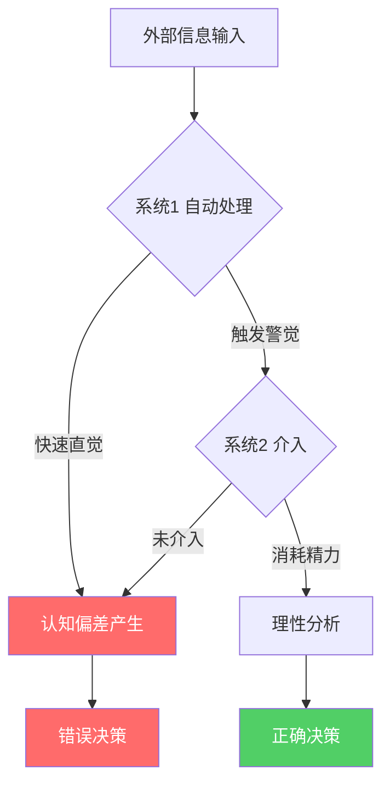
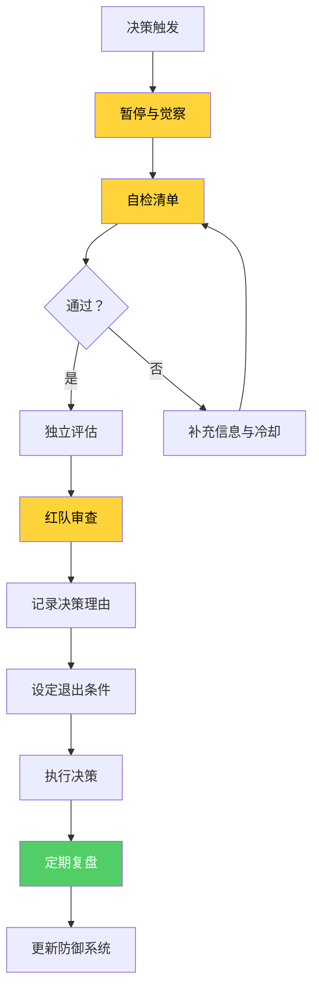

## 认知偏差与搞钱陷阱

你的大脑不是为搞钱设计的。进化赋予我们一套在非洲草原上生存的认知系统——快速识别威胁、跟随群体、偏好即时回报。这套系统在21世纪的金融市场、创业决策和财富管理中，会系统性地把你推向错误的选择。

诺贝尔经济学奖得主丹尼尔·卡尼曼（Daniel Kahneman）在《思考，快与慢》中指出：人类大脑有两套决策系统——**系统1**（快速、直觉、情绪驱动）和**系统2**（缓慢、理性、需要消耗精力）。绝大多数搞钱失误，都源于系统1在不该主导的时候主导了决策。

本章将系统梳理影响搞钱的12种核心认知偏差、6大心理陷阱，以及一套可操作的防御框架。

---

### 认知偏差的底层机制



认知偏差不是"愚蠢"的表现，而是大脑的节能模式。哈佛大学心理学家丹尼尔·吉尔伯特的研究表明：人类每天要做约35000个决策，如果每个都用系统2分析，大脑的能量消耗会翻倍。偏差是进化留下的认知捷径（heuristics），在多数日常场景中高效，但在搞钱场景中频繁出错。

---

### 十二种核心认知偏差

#### 一、确认偏差（Confirmation Bias）

**定义**：人们倾向于搜索、解读和记忆那些支持自己已有信念的信息，同时忽略或贬低与之矛盾的证据。

**神经科学机制**：当我们接收到支持自己观点的信息时，大脑的奖励回路（腹侧纹状体）会被激活，产生类似吃巧克力的愉悦感。相反，接收到矛盾信息时，前扣带皮层会触发类似生理疼痛的反应。你的大脑在字面意义上"享受"被确认，"疼痛"于被否定。

**搞钱中的典型表现**：

| 场景 | 确认偏差行为 | 正确做法 |
|------|-------------|---------|
| 股票投资 | 买入后只看利好新闻，忽略利空 | 建立正反两面信息清单，定期更新 |
| 创业项目 | 只采访赞同你想法的朋友 | 找持怀疑态度的行业专家做压力测试 |
| 副业选择 | 搜索"XX副业赚钱"而不是"XX副业失败" | 先搜索失败案例，再搜索成功案例 |
| 房产投资 | 只关注支持房价上涨的数据 | 同时列出上涨和下跌的5个理由 |

**真实案例**：2021年加密货币牛市期间，大量投资者在各种社群中只接收"比特币到10万美元"的预测，屏蔽所有看空信号。当2022年市场崩盘时，很多人损失超过70%。事后调查显示，其中83%的投资者承认自己主动屏蔽了负面信息来源。

**防御体系**：

1. **预设反对派**：每次做重大财务决策前，强制自己写出3个反对理由
2. **信息对冲**：关注至少一个与你观点相反的高质量信息源
3. **决策日记**：记录决策时的理由和预期，3个月后回顾准确性
4. **红队审查**：找一个信任的人专门唱反调，给予他们"挑刺权"

#### 二、损失厌恶（Loss Aversion）

**定义**：人们对损失的痛苦感受强度，约是同等收益快乐感受的2到2.5倍。丢掉100元的痛苦，需要赚到200至250元才能弥补。

**神经科学机制**：杏仁核（负责恐惧和焦虑的脑区）对损失信号的反应强度是对收益信号的两倍以上。fMRI脑成像研究显示，当人们面对潜在损失时，杏仁核的激活程度远超面对同等收益时伏隔核（奖励中枢）的激活。

**搞钱中的典型表现**：

- **处置效应**：过早卖出赚钱的股票（锁定收益的快感），却死守亏钱的股票（不愿确认损失）。加州大学的研究显示，个人投资者卖出盈利股票的概率比卖出亏损股票高1.5倍。
- **止损困难**：亏损10%时不舍得卖，亏损30%时更不舍得卖，最终亏损50%以上。
- **免费陷阱**：对已获得但无实际价值的东西（如过期的优惠券、无用的赠品）不愿放手，因为"扔掉就是损失"。
- **升级承诺**：项目已经亏了10万，为了"不浪费"这10万，又追加投入20万，结果亏得更多。

**处置效应量化模型**：

```text
心理账户公式：
- 赚100元的效用 = +1 单位
- 亏100元的效用 = -2.5 单位
- 净效用 = +1 - 2.5 = -1.5 单位

结果：即使一笔投资的期望值为正，
      损失厌恶也会让你觉得"不值得冒险"
```

**防御体系**：

1. **自动化止损**：设置硬性止损线（如亏损8%无条件卖出），用条件单自动执行
2. **忘掉成本**：每天问自己——"如果今天手上没有这只股票，我会以当前价格买入吗？"如果不会，就应该卖出
3. **重新定义损失**：把止损视为"保险费"而非"亏损"，花8%避免后面50%的崩盘是明智的
4. **批量决策**：不要逐笔看待盈亏，而是按季度或年度评估整体投资组合表现

#### 三、过度自信偏差（Overconfidence Bias）

**定义**：人们系统性地高估自己的知识、能力和判断准确性。

**三种过度自信形式**：

| 类型 | 定义 | 搞钱中的危害 |
|------|------|-------------|
| 过度估计 | 高估自己的能力水平 | "我能跑赢大盘"（实际90%的主动基金跑输指数） |
| 过度精确 | 对自己的判断过于确定 | "这只股票肯定涨"（把猜测当成确定性） |
| 优于平均效应 | 认为自己比大多数人强 | "别人会亏，我不会"（74%的基金经理认为自己高于平均水平） |

**真实案例**：行为金融学家布拉德·巴伯和特伦斯·奥丁的研究追踪了66,465个家庭的交易记录（1991-1996年），发现交易最频繁的20%投资者的年化收益率比最不活跃的20%低7个百分点。过度自信导致的频繁交易是最大的隐形杀手——每次交易都有手续费和滑点成本，而且频繁进出往往意味着"高买低卖"。

**过度自信的校准方法**：

1. **置信区间练习**：对每个预测给出80%置信区间。例如"这只股票明年价格在80到120之间"。如果你的80%置信区间只有50%的准确率，说明你过度自信了
2. **预测追踪表**：记录你所有的财务预测和信心程度，每季度复盘准确率
3. **基准率思维**：在做判断前先问"这类事情的一般成功率是多少？"创业5年存活率不到7%，这个基准率应该成为你的起点
4. **专家谦逊训练**：在你最擅长的领域，列出5个你曾经犯过的判断错误

#### 四、锚定效应（Anchoring Effect）

**定义**：决策时过度依赖最先接收到的信息（"锚点"），后续判断围绕这个锚点做不充分的调整。

**实验验证**：卡尼曼和特沃斯基的经典实验中，让受试者先转一个随机数字轮盘，然后估计联合国中非洲国家的百分比。转到10的人平均估计25%，转到65的人平均估计45%。一个完全随机的数字就能显著影响判断。

**搞钱中的典型表现**：

- **价格锚定**：看到"原价1999，现价599"就觉得便宜，但这个商品可能只值300
- **历史锚定**："这只股票之前涨到过100元，现在才60元，肯定能回去"——历史价格不代表未来价值
- **收入锚定**：跳槽时以上一份工资为锚，而不是以市场价值为锚
- **沉锚后的谈判**：对方先出价100万，你本来觉得值50万，谈完后觉得70万是"合理的"

**破解锚定效应**：

1. **先做功课再看价**：在知道对方报价前，先独立评估价值
2. **多锚对冲**：主动引入多个参考点——"同类产品A卖300，B卖450，C卖280"
3. **反向锚定**：主动提出自己的锚——在谈判中先出价
4. **忽略极端信息**：如果一个价格看起来离谱，直接排除它作为参考

#### 五、从众效应（Bandwagon Effect）

**定义**：人们倾向于模仿多数人的行为，即使多数人的选择可能是错误的。

**进化根源**：在原始部落中，跟随群体是生存策略。当所有人开始奔跑时，跟着跑的人活下来了，独立思考"为什么跑"的人可能被狮子吃掉了。这种本能深深刻在我们的基因里。

**搞钱中的典型表现**：

- **牛市蜂拥**：当出租车司机都在讨论股票时，市场往往已经接近顶部
- **创业跟风**：看到某个赛道火了就跟进去，等产品做出来时风口已经过了
- **消费攀比**：身边人都买了最新款手机，自己也忍不住换
- **恐慌抛售**：市场下跌时看到大家都在卖，自己也跟着卖

**市场中的从众效应周期**：


**防御体系**：

1. **逆向指标**：当"所有人都在讨论某个投资机会"时，恰恰是应该警惕的信号
2. **独立评估框架**：建立自己的投资评估清单，在做决策前必须完成清单，不参考他人行为
3. **延迟决策**：当感受到强烈的"跟上大部队"冲动时，强制等待48小时
4. **记录从众成本**：回顾过去因为跟风做出的决策，计算实际损失

#### 六、可得性偏差（Availability Bias）

**定义**：人们根据信息在记忆中的易获取程度来判断事件的概率。越容易想起来的事情，越被认为发生的概率高。

**搞钱中的典型表现**：

- 媒体大量报道某人炒币暴富，你高估了炒币致富的概率
- 身边一个朋友做直播赚了大钱，你认为直播很容易赚钱
- 刚看完一部创业纪录片，你觉得创业成功率很高

**防御方法**：在评估任何赚钱机会时，先搜索该领域的**基础统计数据**——成功率、平均回报率、中位数收入——而不是依赖记忆中的"鲜活案例"。

#### 七、禀赋效应（Endowment Effect）

**定义**：人们对已经拥有的东西赋予更高的价值，仅仅因为"它是我的"。

**经典实验**：在康奈尔大学的实验中，随机获得一个杯子的学生平均愿意以5.25美元出售，而没有杯子的学生平均只愿意花2.25美元购买。同一个杯子，拥有者认为它值两倍多。

**搞钱中的危害**：

- 持有的股票跌了，总觉得"它会涨回来的"——因为你对它有感情了
- 创业者对自己的项目估值过高，错过合理的收购offer
- 房子住了多年后，觉得它比市场价更值钱
- 不舍得卖掉不再使用的订阅服务、会员资格

**防御方法**：定期做"从零开始"思维实验——"如果我没有这只股票/这个项目/这套房子，我今天会买入吗？"

#### 八、沉没成本谬误（Sunk Cost Fallacy）

**定义**：因为已经投入了不可收回的时间、金钱或精力，而继续一个明显错误的决策。

**为什么大脑会犯这个错**：承认沉没成本等于承认过去的决策是错误的，这会触发自我认知的不适。为了维护"我是理性的人"这个自我形象，大脑宁愿继续犯错也不愿承认错误。

**搞钱中的典型场景**：

| 场景 | 沉没成本思维 | 理性思维 |
|------|-------------|---------|
| 创业项目 | "已经投了50万，不能放弃" | "如果现在没有投入，我还会启动这个项目吗？" |
| 职业发展 | "已经学了4年会计，不能转行" | "未来20年我想做会计吗？" |
| 课程培训 | "花了3万报的课，再难也要学完" | "这个课程对我的目标还有帮助吗？" |
| 加盟投资 | "加盟费30万交了，硬着头皮做吧" | "继续做下去的预期回报是多少？止损后释放的资金和时间能做什么？" |

**防御体系**：

1. **零基思考**：假装你从未投入过任何东西，纯粹基于未来预期做决策
2. **机会成本清单**：列出继续投入所放弃的替代方案及其价值
3. **预设退出条件**：在投入前就设定明确的退出标准——"如果6个月内没有达到X，就止损退出"
4. **定期审计**：每季度审视所有进行中的项目和投资，问"这个还值得继续吗？"

#### 九、幸存者偏差（Survivorship Bias）

**定义**：只关注成功者而忽略失败者，导致对成功概率的严重高估。

**经典案例**：二战时，美军想给轰炸机加装甲。统计返航飞机的弹孔分布，发现机翼中弹最多。最初方案是加固机翼，但统计学家亚伯拉罕·瓦尔德指出：应该加固弹孔最少的部位（发动机和驾驶舱），因为被击中这些部位的飞机根本没能返航。

**搞钱中的幸存者偏差**：

- 你看到100个创业成功故事，但看不到那10000个失败的案例
- 你看到某基金经理5年翻倍，但看不到同期有3000只基金被清盘
- 你看到网红年入千万，但看不到99.9%的创作者月入不足3000

**数据**：中国中小企业平均寿命2.5年，5年存活率不到7%。美国新餐厅1年内倒闭率60%，3年内80%。这些才是真实的基准率。

**防御方法**：

1. **主动搜索失败案例**：每个"成功故事"旁边，搜索3个同类的失败案例
2. **查基础概率**：做任何事之前先查"这类事情的成功率是多少"
3. **阅读失败者日记**：比成功学书籍更有价值的是失败复盘

#### 十、框架效应（Framing Effect）

**定义**：同一个信息，用不同的方式呈现，会导致截然不同的决策。

**经典实验**：
- 框架A："这个手术存活率90%"——75%的人选择做手术
- 框架B："这个手术死亡率10%"——只有50%的人选择做手术

**搞钱中的表现**：

- 基金广告说"近3年收益率150%"（选了最佳起止点），实际年化可能只有8%
- "每月只需399元"比"每年4788元"听起来便宜很多
- "成功率只有5%"和"每20个人就有1个成功"是同一回事，但感受完全不同

**防御方法**：遇到任何数字表述时，自己换算成另一种框架再看一遍。把月付换算成年付，把百分比换算成绝对数字，把收益率换算成实际金额。

#### 十一、现时偏差（Present Bias）

**定义**：人们系统性地高估即时回报，低估延迟回报。今天的100元感觉比一年后的150元更有吸引力，即使理性计算后者的回报率远超任何理财。

**搞钱中的危害**：

- 明知应该学习新技能提升收入，却选择刷短视频
- 明知应该存钱投资，却忍不住消费升级
- 明知应该为退休储蓄，却觉得"还早"
- 副业收入刚到手就想花掉，而不是再投入

**时间折扣的心理公式**：

```text
心理价值 = 实际价值 × 折扣因子^(延迟时间)

示例（年折扣率30%）：
- 现在拿到1000元 → 心理价值 = 1000元
- 1年后拿到1500元 → 心理价值 = 1500 × 0.7 = 1050元
- 3年后拿到3000元 → 心理价值 = 3000 × 0.343 = 1029元

结果：理性最优选择（3年后3000元）在心理上
      几乎等价于现在拿1000元
```

**防御体系**：

1. **自动化储蓄**：工资到账日自动划转30%到投资账户，剩下的才是可支配收入
2. **可视化未来**：用复利计算器展示"每月存2000元，年化10%，30年后是多少"——答案是约452万元
3. **承诺机制**：开设定期存款、锁定基金，降低即时提取的便利性
4. **奖励替代**：用低成本的即时奖励（一杯好咖啡）替代高成本的消费冲动

#### 十二、权威偏差（Authority Bias）

**定义**：人们倾向于服从权威人物的意见，即使权威的建议可能不适用于当前场景。

**搞钱中的典型表现**：

- 某知名投资人说看好某个行业，你立刻跟投
- "专家"在电视上推荐某只股票，你不做研究就买入
- 某大V推荐的理财课程/训练营，不考虑是否适合自己就付费
- 银行理财经理推荐的产品，不看合同就签字

**关键区别**：权威在他们的专业领域可能是对的，但他们的投资建议可能有利益冲突（收了推广费），也可能不适用于你的具体情况（资金量、风险承受力、时间周期不同）。

**防御方法**：

1. **利益审查**：这个"专家"推荐的东西，他有没有收钱？
2. **适用性检查**：他的建议是基于什么假设？这些假设适用于我吗？
3. **多元验证**：同一个问题至少找3个独立来源交叉验证

---

### 六大搞钱心理陷阱

偏差是认知层面的系统性错误，陷阱则是行为层面的模式化失误。以下是搞钱中最常见的六个心理陷阱。

#### 陷阱一：赌博谬误（Gambler's Fallacy）

**表现**："已经连续跌了5天了，明天肯定涨"——错误地认为随机事件有"自我纠正"的趋势。

**真相**：独立随机事件之间没有记忆。硬币连续抛出10次正面，第11次正面的概率仍然是50%。股票价格的短期走势也是类似——连续下跌不代表"该涨了"。

**搞钱中的案例**：很多人在股市连续下跌后"抄底"，认为"跌了这么多总该反弹了"，结果越抄越低。2008年金融危机中，很多人在跌了30%时入场，结果市场又跌了40%。

#### 陷阱二：心理账户（Mental Accounting）

**表现**：人们对不同来源的钱赋予不同的"心理标签"，导致非理性消费。

**典型现象**：

- 年终奖5万，觉得是"意外之财"，花起来大手大脚
- 辛苦赚的5000元工资，花起来精打细算
- 赌场赢了1000元，觉得是"白来的钱"，风险承受力瞬间变高
- 退税3000元，觉得是"天上掉的馅饼"，立刻花掉

**真相**：钱就是钱。无论来源如何，1万元的购买力是一样的。把"意外收入"和"劳动收入"区别对待是非理性的。

**防御方法**：取消心理标签，所有收入统一管理。年终奖和工资一样，都进入同一个投资账户，按统一的资产配置比例分配。

#### 陷阱三：承诺升级（Escalation of Commitment）

**表现**：面对负面反馈，不是止损撤退，而是加倍投入。

**与沉没成本的区别**：沉没成本是"因为已经投入所以继续"，承诺升级是"因为被挑战了所以加倍投入来证明自己是对的"。后者带有强烈的情绪驱动——不甘心、要面子、不服输。

**真实案例**：长期资本管理公司（LTCM）由诺贝尔奖得主和顶级交易员创立，1998年在俄罗斯债务危机中开始亏损。管理层不仅没有止损，反而加仓试图"摊薄成本"，最终亏损46亿美元，差点引发全球金融系统崩溃。

**防御方法**：在投资前写下"如果发生X情况，我将无条件退出"，并让第三方监督执行。

#### 陷阱四：禀赋效应导致的机会成本盲区

**表现**：因为执着于已有的东西，看不到放弃它所能获得的更好机会。

**量化示例**：

```text
你持有一只股票，买入价10万，现在市值8万。

沉没成本思维：不卖，等回本到10万再卖
→ 可能等1年、2年、甚至永远回不来

机会成本思维：这8万放到其他地方能产生多少收益？
→ 如果优质基金年化12%，2年后 = 10.04万
→ 如果继续等这只股票回本，可能2年后还是8万
→ 守着亏损股的机会成本 = 放弃的收益
```

#### 陷阱五：叙事谬误（Narrative Fallacy）

**表现**：人们喜欢给随机事件编造因果故事，然后基于这些故事做决策。

**典型叙事**：

- "他创业成功是因为大学辍学"（忽略了辍学创业失败的99.9%）
- "房价过去20年涨了10倍，所以未来20年也会"（忽略了人口结构变化）
- "90后做短视频都赚到钱了"（幸存者偏差+叙事谬误的双重叠加）

**防御方法**：每当你听到一个"因为A所以B"的搞钱故事，问自己——"有没有同样满足条件A但结果不是B的人？"几乎每次都有。

#### 陷阱六：过度交易综合征

**表现**：频繁买卖，试图抓住每一个波动，结果被手续费和错误决策蚕食收益。

**数据佐证**：行为金融学研究反复证明，交易频率与投资回报呈负相关。交易最活跃的投资者，长期回报往往最差。原因是：

1. 每次交易都有成本（佣金、印花税、滑点）
2. 频繁交易意味着频繁做决策，而每个决策都有出错的概率
3. 短期波动本质上接近随机，试图预测随机事件是徒劳的

**诊断清单**：如果你有以下3个以上症状，可能存在过度交易问题：

- 每天查看账户超过3次
- 持有一个投资标的的平均时间不到1个月
- 经常在买入后几天就后悔
- 交易决策主要受情绪驱动
- 交易记录显示买卖时机经常相反

---

### 搞钱的正确心态模型

识别偏差和陷阱是防御性的，建立正确的心态模型才是进攻性的。以下是经过验证的四种搞钱核心心态。

#### 一、成长型思维（Growth Mindset）

**来源**：斯坦福大学心理学家卡罗尔·德韦克的数十年研究。

**核心理念**：能力不是固定的，而是可以通过学习和练习发展的。

**在搞钱中的应用**：

| 固定型思维 | 成长型思维 |
|-----------|-----------|
| "我不是做生意的料" | "我还没学会怎么做生意" |
| "投资太复杂了，我搞不懂" | "投资需要学习，我可以一步步来" |
| "这次亏了，说明我不适合投资" | "这次亏了，我从中学到了什么？" |
| "别人赚到钱是因为他们有资源" | "我能通过什么方式积累资源？" |

**培养方法**：把"我不会"改成"我还没学会"。这不只是文字游戏，而是重新定义你和能力之间的关系——从"固定的特质"变成"正在发展的过程"。

#### 二、长期主义（Long-termism）

**核心数据**：

```text
假设年化收益率10%（标普500历史平均）：

投入10万元：
- 5年后 → 16.1万
- 10年后 → 25.9万
- 20年后 → 67.3万
- 30年后 → 174.5万

复利的威力在后期才真正显现：
- 前10年收益 → 15.9万
- 后10年收益 → 41.4万（前10年的2.6倍）
```

**长期主义的操作定义**：

1. 投资标的持有周期至少3年，理想5年以上
2. 不因为短期波动改变长期策略
3. 持续投入（定投），利用时间放大复利效应
4. 延迟消费升级，把差额投入资产

**巴菲特的启示**：巴菲特99%的财富是在50岁之后获得的。他的核心策略不是找到暴涨的股票，而是找到能持续增长的资产，然后耐心等待复利发挥作用。

#### 三、概率思维（Probabilistic Thinking）

**核心理念**：世界的本质是不确定的。搞钱不是追求"确定的答案"，而是追求"正期望值的决策"。

**期望值计算**：

```text
期望值 = 胜率 × 赢利金额 - 败率 × 亏损金额

示例A（赌博）：
- 胜率30%，赢利1000元
- 败率70%，亏损500元
- 期望值 = 0.3×1000 - 0.7×500 = 300 - 350 = -50元
→ 负期望值，长期必亏

示例B（技能投资）：
- 学习编程后加薪概率80%，每年多赚5万
- 学习投入成本2万（时间折算）
- 期望值 = 0.8×5万 - 0.2×2万 = 4万 - 0.4万 = 3.6万/年
→ 正期望值，值得投入
```

**概率思维的实操**：

1. 不追求"一定赚钱"，追求"多数情况下赚钱"
2. 接受单次失败，关注长期平均
3. 做10次正期望值的决策，比做1次"完美"决策更重要
4. 分散投资：不要把所有赌注押在单一机会上

#### 四、反脆弱思维（Antifragile Thinking）

**来源**：纳西姆·塔勒布的《反脆弱》。

**三个层次**：

| 层次 | 定义 | 搞钱中的例子 |
|------|------|-------------|
| 脆弱 | 受冲击就受损 | 全部资产投入单一股票 |
| 坚韧 | 受冲击能抵抗 | 有应急基金和保险 |
| 反脆弱 | 受冲击反而变强 | 多元收入来源，危机中低价买入优质资产 |

**构建反脆弱的搞钱系统**：

1. **冗余设计**：保持6个月以上的应急现金储备，即使"效率低"
2. **选择权思维**：投资于有"不对称收益"的机会——下行有限（最多亏10%），上行无限（可能赚100%）
3. **杠铃策略**：90%资产极度保守（指数基金、国债），10%极度激进（高风险高回报投资）
4. **小规模试错**：用小钱测试新机会，验证可行后再加大投入

---

### 认知偏差自检清单

在做任何重大财务决策（投资、创业、大额消费、职业转变）前，用以下清单做自检：

| 序号 | 检查项 | 自问 |
|------|--------|------|
| 1 | 确认偏差 | "我有没有主动搜索反对意见？" |
| 2 | 损失厌恶 | "我是因为害怕损失才不做/继续做的吗？" |
| 3 | 过度自信 | "我的信心有数据支撑还是只是直觉？" |
| 4 | 锚定效应 | "我的判断是否被某个初始信息影响了？" |
| 5 | 从众效应 | "我是独立判断还是跟着别人走？" |
| 6 | 可得性偏差 | "我是因为最近看到了相关信息才这么想的吗？" |
| 7 | 沉没成本 | "如果从零开始，我还会做同样的选择吗？" |
| 8 | 幸存者偏差 | "我是否只看到了成功案例而忽略了失败者？" |
| 9 | 现时偏差 | "我是为了眼前的快感而放弃了长期利益吗？" |
| 10 | 叙事谬误 | "我的因果推理有没有逻辑漏洞？" |

如果任何一个检查项的答案让你犹豫，暂停决策，至少等待24小时再做最终判断。

---

### 常见误区与纠正

**误区一："我了解这些偏差，所以不会再犯了"**

真相：知道偏差的存在并不能消除它。卡尼曼本人也承认，他研究了一辈子认知偏差，自己仍然会犯同样的错误。关键是建立**外部系统**（自动化止损、定投、决策清单）来约束行为，而不是依赖意志力。

**误区二："理性决策就是不带感情"**

真相：完全排除感情既不可能也不可取。情绪是重要的信息来源——恐惧可能在提醒你真正的风险，兴奋可能在指向你真正热爱的方向。正确的做法是"先觉察情绪，再做决策"，而不是"消灭情绪"。

**误区三："只有投资才需要注意认知偏差"**

真相：认知偏差影响所有与搞钱相关的决策——副业选择、薪资谈判、消费习惯、保险购买、教育投资。每个涉及资源分配的决策都可能被偏差扭曲。

**误区四："经验越丰富越不容易犯错"**

真相：经验有时反而会强化偏差。资深投资者可能因为"过去这样做有效"而拒绝接受环境已经改变的事实。2008年金融危机中，很多有20年经验的老手爆仓了，正是因为他们用旧经验应对新环境。

---

### 实践框架：偏差防御系统

与其依赖意志力对抗认知偏差，不如建立一套系统化的防御机制：



**系统组件**：

1. **决策暂停机制**：任何超过月收入10%的支出决策，强制等待48小时
2. **自检清单**：每次重大决策前过一遍上面的10项清单
3. **红队伙伴**：找一个理性、信任的人，在你做重大决策时担任"反对派"
4. **决策日记**：记录每个重要决策的理由、预期和信心程度，每季度复盘
5. **自动化规则**：将反复出现的决策规则自动化——定投、止损、储蓄比例
6. **定期审计**：每半年全面审视自己的财务状况和投资组合，清除"沉没成本"驱动的持仓

---

### 本章小结

认知偏差是人类大脑的出厂设置，不是个人缺陷。关键不在于"消灭偏差"（这不可能），而在于：

1. **认识它**：了解12种核心偏差和6大心理陷阱的触发机制
2. **觉察它**：在决策瞬间能识别"我现在可能正在被XX偏差影响"
3. **对抗它**：用外部系统（清单、自动化、红队审查、决策日记）约束偏差
4. **复盘它**：定期回顾决策记录，从错误中学习

搞钱的本质不是比别人更聪明，而是比别人更少犯系统性错误。减少认知偏差带来的损失，就是最可靠的"被动收入"。
